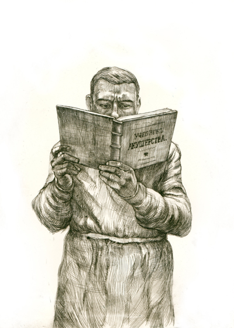
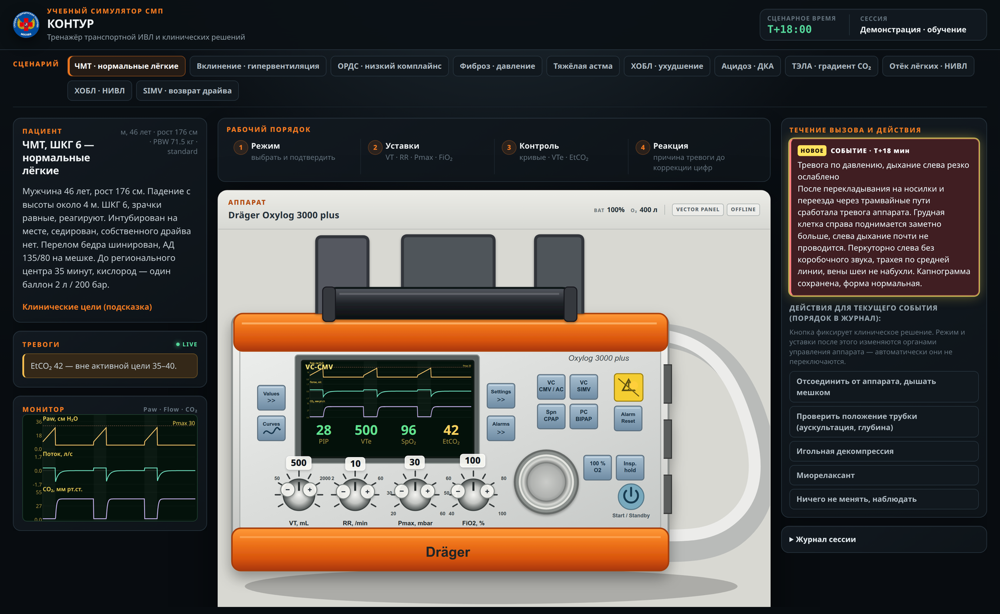
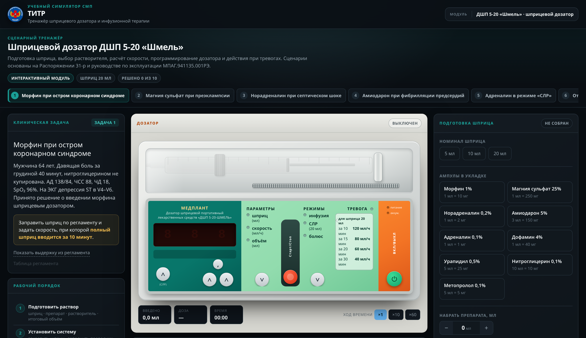
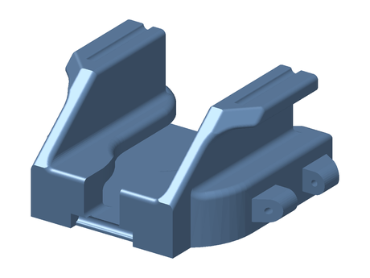

# Крещение поворотом

### Клинические разборы реальных случаев из практики скорой медицинской помощи, учебные материалы, интерактивные тренажеры, чеклисты, справочные материалы, тесты, задачи

<table width="100%">
<tbody>
<tr>
<td width="50%" valign="top"><a href="https://julianekrasova.github.io/kreschenie-povorotom/razdely/razbory.html"><strong>Клинические разборы</strong></a> · 18 материалов Разборы реальных вызовов: презентация случая, вопросы для размышления, теория, анализ случая и его исход</td>
<td width="50%" valign="top"><a href="#ekg-cases"><strong>ЭКГ кейсы</strong></a> · 5 материалов Разборы реальных плёнок с вызовов</td>
</tr>
<tr>
<td valign="top"><a href="https://julianekrasova.github.io/kreschenie-povorotom/razdely/farmakologiya.html"><strong>Фармакология укладки</strong></a> · 9 материалов Механизм, время до эффекта, дозы по показаниям, типичные ошибки введения, карточки формата A5 для кармана</td>
<td valign="top"><a href="#cheklisty"><strong>Чеклисты</strong></a> · 5 материалов Интерактивный чеклист «Маршрут вызова» для телефона, боль в грудной клетке, неврологический осмотр, осмотр ребёнка, осмотр горла, чтение ЭКГ</td>
</tr>
<tr>
<td valign="top"><a href="https://julianekrasova.github.io/kreschenie-povorotom/razdely/vinyetki.html"><strong>Виньетки</strong></a> · 10 выпусков Клинические задачи с вопросами, ответами и выводами по каждой</td>
<td valign="top"><a href="#uchebnye-materialy"><strong>Учебные и справочные материалы</strong></a> · 3 материала Конспекты занятий и лекций, таблицы для вызова: дозы по массе, энергии, разведения</td>
</tr>
<tr>
<td valign="top"><a href="#oborudovanie"><strong>Оборудование и оснащение</strong></a> · 3 материала Тренажёры аппаратуры: <a href="https://julianekrasova.github.io/kreschenie-povorotom/trenazhery/oxylog_3000_plus/kontur_trenazher.html">КОНТУР</a> — транспортная ИВЛ Oxylog 3000 plus, <a href="https://julianekrasova.github.io/kreschenie-povorotom/trenazhery/shmel_titr/titr_trenazher.html">ТИТР</a> — шприцевой дозатор «Шмель». Модели для 3D-печати и приспособления для работы на линии</td>
<td valign="top"><a href="#chtenie"><strong>Журнальный клуб</strong></a> · 4 материала Профессиональная литература по разделам медицины, книги о профессии, видео и открытые ресурсы, разборы статей и подкастов</td>
</tr>
</tbody>
</table>

[О проекте](#o-proekte) · [Кто пишет](#kto-pishet) · [Оговорка](#ogovorka) · [Если нашли ошибку](#oshibka) · [Лицензии](#licenzii)

## О проекте

> «Эх, Додерляйна бы сейчас почитать!» — тоскливо думал я, намыливая руки. Увы, сделать это сейчас было невозможно.
>
> — М. А. Булгаков, «Крещение поворотом», из цикла «Записки юного врача»

Думаю, что похожее состояние (тоска по Додерляйну, в котором можно найти ответ на вопрос, но которого мучительно нет ни под рукой, ни в голове) знакомо практически всем медикам. *“Столетие все увеличивающегося знания и опытности хотел бы я иметь за собою,— тогда, может быть, я мог бы кое-что сделать”*, писал Теодор Бильрот в письме одной своей старой знакомой. Это было в 1873 году, он написал их в зените славы и опытности, уже будучи профессором хирургии Венского университета, уже проведя первую в мире эзофагоэктомию, первую в мире ларингоэктомию и готовясь совершить первую же в мире резекцию желудка (два вида резекции, известные сегодня, носят названия Бильрот-1 и Бильрот-2). Он уже ввел у себя в отделении обязательную мойку операционных столов после каждой операции (а ее не было до него, ведь было не совсем понятно зачем это делать, если стол испачкается кровью заново), и ношение белых халатов (а до этого грязный сюртук считался доказательством опытности хирурга!). Бильрот, великий Бильрот, написал вот эти горькие слова, и еще далее: “*Успехи наши подвигаются довольно медленно, и то немногое, чего достигает один, так трудно передать другим! Получаю­щий должен самое важное сделать сам*”.

При этом о цене этого “самого важного”, этого опыта и интуиции, иногда даже страшно думать и говорить. Почитать у Пирогова его “Анналы Дерптской хи­рургической клиники”, или у Вересаева “Записки врача”, где оба они с откровенностью гениев описывают свои ошибки и ошибки коллег - и можно за голову схватиться от ужаса, от груза ответственности, от понимания, что “*это все уж совершенно неизбежно, и никакого выхода отсюда нет*” (Вересаев). “*И сколько таких проклятых вопросов в этой страшной науке, где шагу нельзя сту­пить, не натолкнувшись на живого человека!*” (он же). И это был еще XIX век, что уж говорить о нашем времени, когда количество технологий, нозологий, и всяких других "логий" возросло многократно. 

И вот ничем, никакой теорией, цифрами, фактами, названиями РКИ, никакой мед. статистикой и доказательной медициной опыт работы с живыми людьми заменить нельзя. “*Никакого выхода отсюда нет*”, это мы, Викентий Викентиевич, поняли. Но все-таки мне кажется, что самое близкое к этому явление могут представлять собой клинические задачи, реальные случаи, на которых можно хоть немного набить руку до того, как нечто подобное (ну или, будем честны, нечно совсем другое) встретится на практике. Поэтому основу предлагаемых читателю достаточно разношерстных материалов будут составлять клинические кейсы, описанные в том виде, в каком они предстали перед бригадой на вызове: со всей неполнотой сведений, со скандальными родственниками, с кучей важных и неважных показателей, часть из которых были решающими, а часть - просто фоном. Дальше будет представлена теория разбираемого вопроса, в той степени полноты и систематичности, которая мне была на момент написания доступна. И наконец, в конце резбора, реальный результат кейса: что сделала бригада, и что в итоге оказалось у пациента на самом деле. 

Еще из показавших себя с положительной стороны педагогических находок в книге будет реализована концепция “претестинга”, когда перед задачей и разбором читателю предлагаются наводящие вопросы. И если ответа на них читатель не знает, это формирует в мозгу как бы некое свободное пространство для нового знания, мозг как будто резервирует ячейку под единицу информации и потом она легко и надолго заполняется новым знанием.

Кейсы, которые здесь будут предлагаться, собраны по крупицам из личного опыта автора, из богатого опыта коллег и товарищей. Самую малость - из книг. Еще меньше - из фантазии. Совсем исключить два последних источника нельзя, да, наверное, и не нужно. Но торжественно клянусь, что фантазии тут минимум (насколько это возможно в литературе, конечно!), а фактического реального материала - максимум.

«*Начиная работать, никогда не знаешь, что получится в итоге*» - говорил Хаяо Миядзаки. Поэтому, уважаемые читатели, настоящие и будущие коллеги - не судите строго, я ведь тоже не знаю, что из этого всего выйдет. Но если хотя бы вам захочется со мной поспорить, поступить иначе, предложенные ситуации переиграть по-своему, о, это будет самым лучшим результатом и самой лучшей наградой.

*Рисунок: эстамп Николая Степанова к «Запискам юного врача» М. А. Булгакова.*

## Клинические разборы

<table width="100%">
<thead><tr><th width="28%">Материал</th><th width="44%">О чём</th><th width="12%">Версия</th><th width="16%">Файл</th></tr></thead>
<tbody>
<tr><td><strong>Доброкачественное пароксизмальное позиционное головокружение</strong></td><td>Каналолитиаз заднего и горизонтального каналов, проба Дикса — Холлпайка и roll-тест, маневры Эпли, Семона и barbecue roll, границы применимости HINTS; чем обоснованы магния сульфат, метоклопрамид и атропин из Алгоритмов и чем их заменяют международные рекомендации. Случай молодого мужчины с сомнительным нистагмом и кратковременным эффектом маневра</td><td>1.1 · 08.09.2026</td><td><a href="razbory/dppg/dppg.pdf">PDF, A4, 25 стр.</a></td></tr>
<tr><td><strong>Острые тонзиллиты</strong></td><td>Фолликулярная, лакунарная, фибринозная, некротическая ангины, дифтерия, ангина Симановского — Плаута — Венсана, инфекционный мононуклеоз, тонзиллолиты, синдром Лемьера; клинический случай с лихорадкой 9 дней и односторонней болью в шее</td><td>1.0 · 03.09.2026</td><td><a href="razbory/ostrye_tonzillity/ostrye_tonzillity.pdf">PDF, A4, 39 стр.</a></td></tr>
<tr><td><strong>Тахисистолия при фибрилляции предсердий</strong></td><td>Диастола, которой нет: почему при частоте 160 падает давление, механизм Франка — Старлинга, дефицит пульса, метопролол против разряда и слово «гипотония», у которого в приказе нет числа</td><td>1.0 · 29.08.2026</td><td><a href="razbory/fp_tahisistoliya_gipotoniya/fp_tahisistoliya_gipotoniya.pdf">PDF, A4, 14 стр.</a></td></tr>
</tbody>
</table>

Последние материалы раздела. Полный список — 18 материалов — на странице [«Клинические разборы»](https://julianekrasova.github.io/kreschenie-povorotom/razdely/razbory.html).

## ЭКГ кейсы

<table width="100%">
<thead><tr><th width="28%">Материал</th><th width="44%">О чём</th><th width="12%">Версия</th><th width="16%">Файл</th></tr></thead>
<tbody>
<tr><td><strong>Пароксизмальная наджелудочковая тахикардия</strong></td><td>Две минуты, которых могло не быть: случайная находка АВУРТ у молодой женщины, двойные пути АВ-узла и ри-ентри, рвота как вагусный маневр, постконверсионная Т-память и ложная ишемия</td><td>1.0 · 30.08.2026</td><td><a href="razbory/paroksizmalnaya_nzht/paroksizmalnaya_nzht.pdf">PDF, A4, 12 стр.</a></td></tr>
<tr><td><strong>Трепетание и аллапинин</strong></td><td>Регулярный широкий желудочковый комплекс, антиаритмики класса IC и риск проведения 1:1</td><td>1.2 · 16.08.2026</td><td><a href="ekg/trepetanie_allapinin/trepetanie_allapinin.pdf">PDF, A4, 6 стр.</a></td></tr>
<tr><td><strong>Гипертрофия левого желудочка и strain</strong></td><td>Дискордантные подъёмы и депрессии ST при гипертрофии, ожидаемая дискордантность при глубоком S, когда за strain прячется инфаркт</td><td>1.1 · 25.08.2026</td><td><a href="ekg/glzh_strain/glzh_strain.pdf">PDF, A4, 7 стр.</a></td></tr>
<tr><td><strong>ЭКС: сливной комплекс и память сердца</strong></td><td>Чтение плёнки со стимулятором, захват и восприятие, слияние против псевдослияния, инверсия зубца T после стимуляции и критерии её отличия от ишемии</td><td>1.1 · 24.08.2026</td><td><a href="ekg/eks_slivnoy_kompleks/eks_slivnoy_kompleks.pdf">PDF, A4, 9 стр.</a></td></tr>
 <tr><td><strong>Удлинённый QT и АВ-блокада 2:1 у ребёнка</strong></td><td>Почему очередной зубец P не проводится: реполяризация желудочков длиннее предсердного цикла. Измерение QT на плёнке 50 мм/с, функциональная блокада 2:1, синдром Тимоти</td><td>1.0 · 22.08.2026</td><td><a href="ekg/lqts_deti_av_blok/lqts_deti_av_blok.pdf">PDF, A4, 15 стр.</a></td></tr>
</tbody>
</table>

## Фармакология укладки (и не только!)

<table width="100%">
<thead><tr><th width="28%">Материал</th><th width="44%">О чём</th><th width="12%">Версия</th><th width="16%">Файл</th></tr></thead>
<tbody>
<tr><td><strong>Нифедипин</strong></td><td>Дигидропиридиновый блокатор кальциевых каналов, токолиз и артериальная гипертензия при беременности, механизм, профиль безопасности, путь введения</td><td>1.1 · 02.09.2026</td><td><a href="farmakologiya/nifedipin/nifedipin.pdf">PDF, A4, 15 стр.</a> · <a href="farmakologiya/nifedipin/kartochka.pdf">карточка СМП, PDF, A5</a></td></tr>
<tr><td><strong>Ноотропы и нейропротекция</strong></td><td>Глицин, пирацетам, церебролизин, мексидол, семакс, цитофлавин, фенибут с точки зрения Кокрейн, FDA, AHA, отечественных исследований</td><td>1.0 · 31.08.2026</td><td><a href="farmakologiya/nootropy/nootropy.pdf">PDF, A4, 22 стр.</a></td></tr>
<tr><td><strong>Преднизолон</strong></td><td>Геномный и негеномный путь и время до эффекта, сравнение с дексаметазоном и гидрокортизоном, дозы по темам, расхождения при анафилаксии и травме спинного мозга, ЧМТ как противопоказание</td><td>1.1 · 24.08.2026</td><td><a href="farmakologiya/prednizolon/prednizolon.pdf">PDF, A4, 10 стр.</a> · <a href="farmakologiya/prednizolon/kartochka.pdf">карточка СМП, PDF, A5</a></td></tr>
</tbody>
</table>

Последние материалы раздела. Полный список — 9 материалов — на странице [«Фармакология укладки»](https://julianekrasova.github.io/kreschenie-povorotom/razdely/farmakologiya.html).

## Чеклисты

<table width="100%">
<thead><tr><th width="28%">Материал</th><th width="44%">О чём</th><th width="12%">Версия</th><th width="16%">Файл</th></tr></thead>
<tbody>
<tr><td><strong>Интерактивный чеклист «Маршрут вызова»</strong></td><td>Шаги вызова от кнопки «Выезд» до закрытия карты, с таймерами норматива и справочными карточками по каждому шагу. Содержит автоматически формирующийся протокол СЛР (метроном 120/мин, таймеры адреналина и разрядов, хронометраж на 35 минут), материалы актуальных приказов и распоряжений по станции. Постоянно пополняется</td><td>1.5 · 10.09.2026</td><td><a href="https://julianekrasova.github.io/kreschenie-povorotom/cheklisty/marshrut_vyzova/marshrut_vyzova.html">открыть онлайн</a> · <a href="https://raw.githubusercontent.com/JuliaNekrasova/kreschenie-povorotom/main/cheklisty/marshrut_vyzova/marshrut_vyzova.html">скачать HTML-файл</a></td></tr>
<tr><td><strong>Боль в грудной клетке</strong></td><td>Ступени догоспитальной диагностики: объём первых минут до расспроса, характеристика боли с отношениями правдоподобия, анамнез, физикальное обследование, ЭКГ и дополнительные отведения, оценка имеющихся документов, дифференциальный ряд из тринадцати состояний, частоты признаков при расслоении аорты, тромбоэмболии, тампонаде и пневмотораксе, шкалы Wells и Женевская, ситуации с повышенной вероятностью ошибки, маршрутизация</td><td>1.0 · 11.09.2026</td><td><a href="cheklisty/bol_v_grudi/bol_v_grudi.pdf">PDF, A4, 19 стр.</a></td></tr>
<tr><td><strong>Осмотр горла</strong></td><td>Угроза дыхательным путям, анамнез, параметры описания наложений, лимфатические узлы, боль в шее, шкала Centor / McIsaac, дифференциальный диагноз по картине зева, признаки для эвакуации</td><td>1.0 · 03.09.2026</td><td><a href="cheklisty/osmotr_gorla/osmotr_gorla.pdf">PDF, A4, 7 стр.</a></td></tr>
<tr><td><strong>Неврологический осмотр</strong></td><td>Время начала, глюкоза, сознание, речь, черепные нервы, MRC, координация, LAMS и маршрутизация, терапия по алгоритму</td><td>1.0 · 16.08.2026</td><td><a href="cheklisty/nevrologicheskiy_osmotr/nevrologicheskiy_osmotr.pdf">PDF, A4, 6 стр.</a></td></tr>
<tr><td><strong>Осмотр ребёнка</strong></td><td>Pediatric Assessment Triangle, ABCDE, возрастные нормы, дегидратация, осмотр от головы к пяткам, безнадзорный ребёнок</td><td>1.0 · 16.08.2026</td><td><a href="cheklisty/osmotr_rebenka/osmotr_rebenka.pdf">PDF, A4, 5 стр.</a></td></tr>
<tr><td><strong>Алгоритм чтения ЭКГ "ПРИВЕТ, ДОКТОР"</strong></td><td>Систематическое чтение ЭКГ: ритм, интервалы, вольтаж, ось, ST–T, дополнительные отведения, резюме</td><td>1.0 · 16.08.2026</td><td><a href="cheklisty/privet_doktor/privet_doktor.pdf">PDF, A4, 6 стр.</a></td></tr>
</tbody>
</table>

## Учебные и справочные материалы

<table width="100%">
<thead><tr><th width="28%">Материал</th><th width="44%">О чём</th><th width="12%">Версия</th><th width="16%">Файл</th></tr></thead>
<tbody>
<tr><td><strong>Акушерство на линии</strong></td><td>Практическое занятие ЦПС: патология яичника, внематочная, ТЭЛА в 10 недель, преэклампсия, отслойка, тихий разрыв рубца, метод Пискачека, пособия в родах, выпадение пуповины</td><td>1.7 · 24.08.2026</td><td><a href="uchebnye/akusherstvo_na_linii/akusherstvo_na_linii.pdf">PDF, A4, 15 стр.</a></td></tr>
<tr><td><strong>ГБ: стадия и коды МКБ</strong></td><td>Степени по уровню АД, коды I / II / III стадии, поражение органов-мишеней и ассоциированные клинические состояния по КР 2024</td><td>1.0 · 05.09.2026</td><td><a href="spravochniki/gb_stadii_mkb/gb_stadii_mkb.pdf">PDF, A4 гориз., 1 стр.</a></td></tr>
<tr><td><strong>Педиатрические дозы по массе</strong></td><td>Энергии разрядов, реанимационные препараты, анафилаксия, судороги, лихорадка, круп</td><td>1.2 · 16.08.2026</td><td><a href="spravochniki/pediatriya_dozy_po_vesu/pediatriya_dozy_po_vesu.pdf">PDF, A4, 5 стр.</a></td></tr>
</tbody>
</table>

## Виньетки

<table width="100%">
<thead><tr><th width="28%">Материал</th><th width="44%">О чём</th><th width="12%">Версия</th><th width="16%">Файл</th></tr></thead>
<tbody>
<tr><td><strong>Делирий</strong></td><td>Пять задач: гипоактивный, послеоперационный, алкогольный, антихолинергический делирий и как их отличить от психоза</td><td>1.0 · 16.08.2026</td><td><a href="vinyetki/deliriy/deliriy.pdf">PDF, A4, 6 стр.</a></td></tr>
<tr><td><strong>Каналопатии и кардиомиопатии</strong></td><td>Десять задач: LQTS, CPVT, Бругада, ГКМП, ARVC, дигоксин, синдром Тимоти, синдром Карвахаля</td><td>1.0 · 16.08.2026</td><td><a href="vinyetki/kanalopatii_kardiomiopatii/kanalopatii_kardiomiopatii.pdf">PDF, A4, 8 стр.</a></td></tr>
<tr><td><strong>Нейроинтоксикации</strong></td><td>Пять задач: угарный газ, фосфорорганические соединения, метанол, тепловой удар, синдром Рамсея — Ханта</td><td>1.0 · 16.08.2026</td><td><a href="vinyetki/neyrointoksikatsii/neyrointoksikatsii.pdf">PDF, A4, 6 стр.</a></td></tr>
</tbody>
</table>

Последние материалы раздела. Полный список — 10 материалов — на странице [«Виньетки»](https://julianekrasova.github.io/kreschenie-povorotom/razdely/vinyetki.html).

## Оборудование и оснащение

Тренажёры аппаратуры, приспособления, доработки и модели для 3D-печати, сделанные сотрудниками для работы на линии. Не медицинские изделия: применение под ответственность пользователя, на функционирование оборудования влиять не должно.

### Тренажёры

Два браузерных тренажёра. Каждый — один файл, работает без интернета и без установки: файл надо скачать (кнопка **Download raw file** на странице файла) и открыть в браузере.

<table width="100%">
<tbody>
<tr>
<td width="50%" valign="top"></td>
<td width="50%" valign="top"></td>
</tr>
<tr>
<td align="center"><strong>КОНТУР</strong> — транспортная ИВЛ Dräger Oxylog 3000 plus <a href="https://julianekrasova.github.io/kreschenie-povorotom/trenazhery/oxylog_3000_plus/kontur_trenazher.html">открыть онлайн</a></td>
<td align="center"><strong>ТИТР</strong> — шприцевой дозатор ДШП 5-20 «Шмель» <a href="https://julianekrasova.github.io/kreschenie-povorotom/trenazhery/shmel_titr/titr_trenazher.html">открыть онлайн</a></td>
</tr>
</tbody>
</table>

<table width="100%">
<thead><tr><th width="28%">Материал</th><th width="44%">О чём</th><th width="12%">Версия</th><th width="16%">Файл</th></tr></thead>
<tbody>
<tr><td><strong>КОНТУР</strong> — транспортная ИВЛ, Dräger Oxylog 3000 plus</td><td>Панель и режимы аппарата, связь уставок с механикой и газообменом, 11 задач от ЧМТ и ОРДС до НИВЛ и массивной ТЭЛА, автоматический разбор сессии</td><td>16.08.2026</td><td><a href="https://julianekrasova.github.io/kreschenie-povorotom/trenazhery/oxylog_3000_plus/kontur_trenazher.html">открыть онлайн</a> · <a href="https://raw.githubusercontent.com/JuliaNekrasova/kreschenie-povorotom/main/trenazhery/oxylog_3000_plus/kontur_trenazher.html">скачать HTML-файл</a> · <a href="trenazhery/oxylog_3000_plus/KONTUR_kratkiy_guide.pdf">гайд, PDF, 6 стр.</a></td></tr>
<tr><td><strong>ТИТР</strong> — шприцевой дозатор ДШП 5-20 «Шмель»</td><td>Сборка шприца, растворитель, режимы, расчёт скорости по времени, по мг/ч и по мкг/кг·мин, 10 задач по схемам Распоряжения 31-р, тревога окклюзии</td><td>15.08.2026</td><td><a href="https://julianekrasova.github.io/kreschenie-povorotom/trenazhery/shmel_titr/titr_trenazher.html">открыть онлайн</a> · <a href="https://raw.githubusercontent.com/JuliaNekrasova/kreschenie-povorotom/main/trenazhery/shmel_titr/titr_trenazher.html">скачать HTML-файл</a> · <a href="trenazhery/shmel_titr/TITR_kratkiy_guide.pdf">гайд, PDF, 6 стр.</a> · <a href="trenazhery/shmel_titr/SHMEL_metodichka_A5.pdf">методичка, PDF, A5, 34 стр.</a></td></tr>
</tbody>
</table>

Оба — учебные модели, а не сертифицированные симуляторы производителей и не медицинские изделия. При расхождении с руководствами по эксплуатации и действующими алгоритмами службы приоритет у последних.

### Приспособления и модели для 3D-печати

<table width="100%">
<thead><tr><th width="28%">Материал</th><th width="44%">О чём</th><th width="12%">Версия</th><th width="16%">Файл</th></tr></thead>
<tbody>
<tr><td><strong>Скоба для фонендоскопа</strong> </td><td>Держатель фонендоскопа под 3D-печать, подходит к любой модели: корпус и три подвижные лапки на осях, штифты DIN 2 × 30 и 3 × 40, габариты деталей, примечания по доработке отверстий и сборке. Модели STL и исходники SolidWorks. Автор модели — ведущий инженер АО «ИТТ» Геннадий Хохлов</td><td>1.0 · 11.09.2026</td><td><a href="oborudovanie/skoba_fonendoskopa/README.md">описание</a> · <a href="oborudovanie/skoba_fonendoskopa/skoba_fonendoskopa.zip">архив, 1,05 МБ</a></td></tr>
</tbody>
</table>

## Журнальный клуб

Списки профессиональной литературы и образовательных ресурсов, разборы статей и подкастов. Раздел пополняется; предложения принимаются через [Issue](../../issues/new/choose).

<table width="100%">
<thead><tr><th width="28%">Материал</th><th width="44%">О чём</th><th width="12%">Версия</th><th width="16%">Файл</th></tr></thead>
<tbody>
<tr><td><strong>Остановка сердца: что изменилось после рекомендаций 2025 года</strong></td><td>Разбор двух выпусков подкаста Emergency Medicine Cases (эпизоды 215 и 216): качество компрессий, капнометрия, вентиляция по счёту компрессий, положение электродов и ток через миокард, окно рецидива фибрилляции, двойная последовательная дефибрилляция, препараты, прекращение реанимации, ведение после восстановления кровообращения. Тезисы, границы применимости и 23 открытых вопроса к обсуждению</td><td>1.0 · 11.09.2026</td><td><a href="chtenie/klub_01_ostanovka_serdtsa/klub_01_ostanovka_serdtsa.pdf">PDF, A4, 12 стр.</a></td></tr>
<tr><td><strong>Профессиональная литература</strong></td><td>Рабочие руководства по разделам, с которыми фельдшер сталкивается на линии: неотложная помощь, реанимация и ИВЛ, кардиология и ЭКГ, неврология, хирургия и травма, токсикология, педиатрия, акушерство и гинекология, инфекции, фармакология, ЛОР и офтальмология, клиническое мышление и документация, анатомия. По каждому разделу отечественные и зарубежные издания</td><td>1.3 · 11.09.2026</td><td><a href="chtenie/professionalnaya_literatura/professionalnaya_literatura.pdf">PDF, A4, 22 стр.</a></td></tr>
<tr><td><strong>Книги о профессии</strong></td><td>Не учебники: мемуары сотрудников службы, медицинская классика и художественная литература, история медицины, разбор ошибок и человеческого фактора, психология экстремальных профессий, понимание пациентов, смерть и умирание</td><td>1.1 · 11.09.2026</td><td><a href="chtenie/knigi_o_professii/knigi_o_professii.pdf">PDF, A4, 10 стр.</a></td></tr>
<tr><td><strong>Видео, подкасты и открытые ресурсы</strong></td><td>Подкасты и блоги по неотложной медицине, каналы с разбором физиологии и навыков, открытые алгоритмы реанимационных советов, базы изображений и ЭКГ. С указанием языка и условий доступа</td><td>1.0 · 11.09.2026</td><td><a href="chtenie/video_i_resursy/video_i_resursy.pdf">PDF, A4, 10 стр.</a></td></tr>
</tbody>
</table>

## Кто пишет

Юлия Некрасова, фельдшер выездной бригады скорой медицинской помощи (Москва). Проект личный и не связан с работодателем, не выражает его позицию и не является ведомственным документом.

## Оговорка

Представленные материалы чисто учебные. Они не заменяют действующие протоколы, клинические рекомендации и распоряжения службы и не могут быть единственным основанием для клинического решения. Дозы, показания и маршрутизацию проверяйте по первоисточникам, действующим на момент чтения. Подробнее — в [DISCLAIMER.md](DISCLAIMER.md).

## Если нашли ошибку

Ошибка в дозе, сроке или механизме — не мелочь. Если такое Вам встретилось, откройте [Issue](../../issues/new/choose) по шаблону «Ошибка в материале». Исправление выходит новой версией, изменение попадает в [CHANGELOG.md](CHANGELOG.md), а прежняя версия остаётся в истории проекта.

## Лицензии

- Тексты, схемы, PDF — [CC BY-NC-SA 4.0](LICENSE). Печатать и раздавать коллегам можно свободно, продавать нельзя, при переработке лицензия сохраняется.
- Код тренажёров и сборочных скриптов — [MIT](LICENSE-CODE).
- Чужие изображения используются только под открытыми лицензиями; источник и лицензия каждого указаны в разделе «Источники иллюстраций» внутри материала.
- Рисунок в разделе «О проекте» — эстамп Николая Степанова к «Запискам юного врача» М. А. Булгакова.
