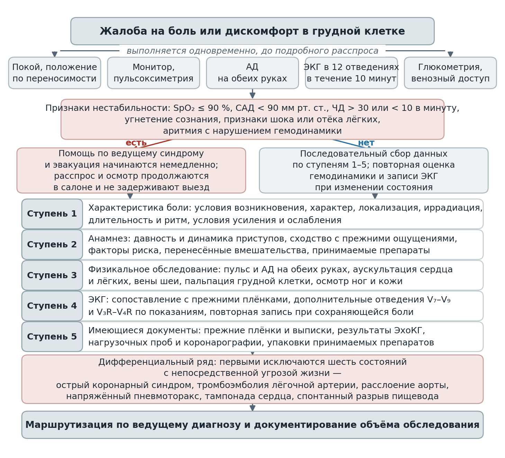
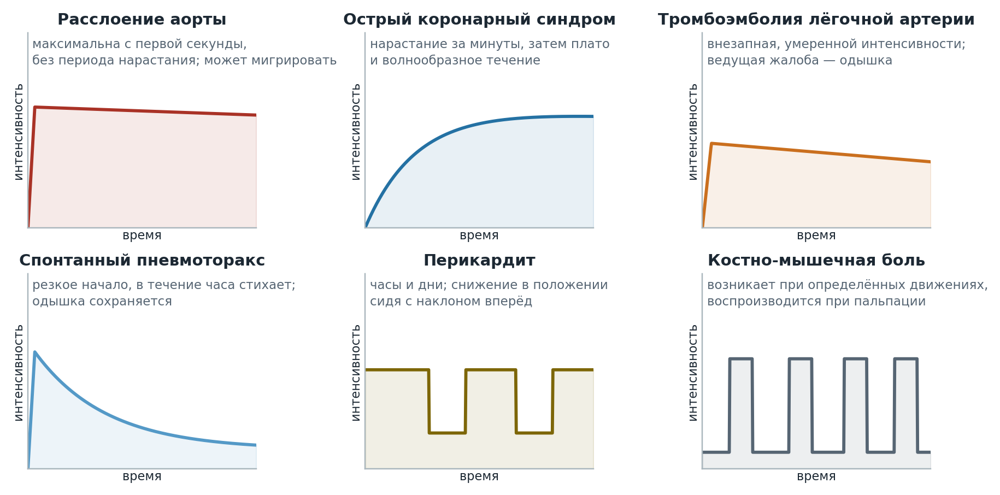
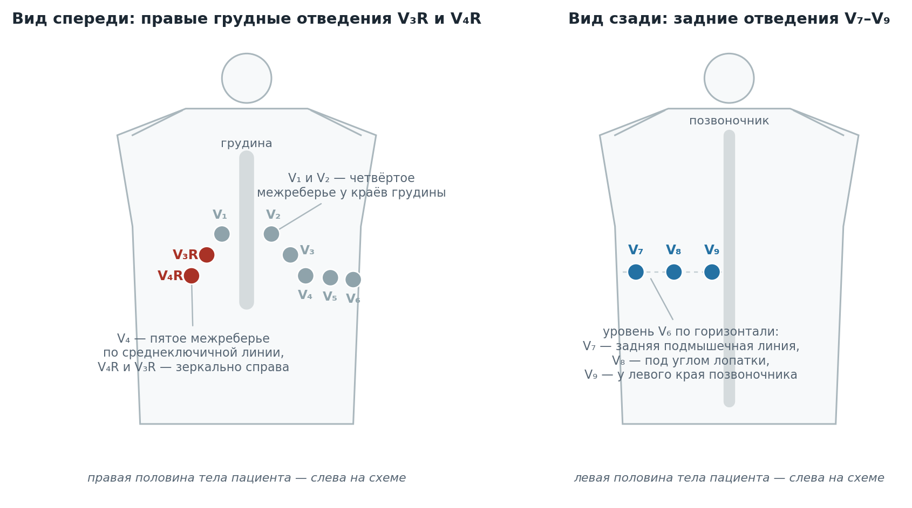

  
Чек-лист

  
Боль в грудной клетке

  
Ступени догоспитальной диагностики: от первого контакта до маршрутизации

  

  
Порядок работы: объём первых минут до расспроса, затем характеристика боли, анамнез, физикальное обследование, электрокардиограмма, имеющиеся документы. Дифференциальный ряд открывают шесть состояний с непосредственной угрозой жизни.

  
Серия «Крещение поворотом» · версия 1.2 · 12 сентября 2026 · CC BY-NC-SA 4.0

::: {.cheklist}

## Первые минуты — одновременно, не по очереди

Покой и положение по переносимости · **ЭКГ 12 отведений в течение 10 минут** · мониторинг ЭКГ · пульсоксиметрия · **АД на обеих руках** · глюкометрия · венозный доступ.

**Нестабильность — помощь и эвакуация немедленно, расспрос в салоне:** SpO₂ ≤ 90 % · САД < 90 мм рт. ст. · ЧД > 30 или < 10 в минуту · угнетение сознания · шок или отёк лёгких · аритмия с нарушением гемодинамики.

## Ступень 1. Боль — девять параметров

Слова пациента фиксируются до подсказок; «давит?», «отдаёт в руку?» пациент повторяет независимо от истинных ощущений.

Условия возникновения · характер · локализация и площадь · иррадиация · условия усиления · условия ослабления · продолжительность и ритм · реакция на нитраты · сопутствующие симптомы.

## Ступень 2. Анамнез

Дебют приступов и их динамика (до 28–30 дней — впервые возникшая стенокардия) · переносимость нагрузки за сутки и недели · сходство с прежней ишемической болью · факторы риска: ИБС, тромбоэмболии, расслоения аорты, пневмоторакса · перенесённые инфаркты и вмешательства · терапия с упаковок, включая ингибиторы ФДЭ-5 · алкоголь, курение, кокаин · семейный анамнез.

## Ступень 3. Физикальное обследование

Общий осмотр с обнажением грудной клетки · пульс, дефицит пульса, асимметрия АД > 20 мм рт. ст. · аускультация сердца: шумы, трение перикарда, галоп · лёгкие: асимметрия дыхания, тимпанит, хрипы, трение плевры · вены шеи · грудная стенка и позвоночник, воспроизведение боли · живот · конечности: отёк, болезненность вен, периферический пульс.

## Ступень 4. Электрокардиограмма

Подъём ST в двух смежных отведениях · депрессия ST и инверсия T в динамике · подъём в aVR с распространённой депрессией · картина де Винтера · картина Веленса · V₇–V₉ · V₃R–V₄R при нижнем инфаркте с гипотензией · перегрузка правых отделов · конкордантный подъём с депрессией PR · низкий вольтаж и альтернация.

**Сопоставить с прежними плёнками. Повторить при сохраняющейся или рецидивирующей боли. Нормальная ЭКГ острый коронарный синдром не исключает.**

## Ступень 5. Документы

Прежние электрокардиограммы · выписки и результаты коронарографии · ЭхоКГ и нагрузочные пробы · рентгенография и компьютерная томография · лабораторные показатели · упаковки препаратов и дневники самоконтроля.

## Исключаются первыми — шесть угроз жизни

Острый коронарный синдром · тромбоэмболия лёгочной артерии · расслоение аорты · напряжённый пневмоторакс · тампонада сердца · спонтанный разрыв пищевода.

Отсутствие признаков инфаркта на ЭКГ завершает только одну из шести линий.

## Маршрутизация по Алгоритмам СМП

| Состояние | Код | Тактика |
|---|---|---|
| Инфаркт с подъёмом ST | I21.9, I22.9 | Экстренно, без сбора вещей и документов; носилки |
| ОКС без подъёма ST | I20.0, I21.9 | Эвакуация; носилки |
| Кардиогенный шок | R57.0 | Больница или шок-центр; носилки |
| Тромбоэмболия | I26.9 | Эвакуация; носилки |
| Расслаивающая аневризма | I71.0 | Эвакуация; носилки |
| Пневмоторакс | J93 | Эвакуация; при напряжённом — пункция |
| Разрыв пищевода | K22 | Эвакуация |

::: {.opasnye}
**Где диагноз теряют чаще всего.** Боль в эпигастрии — ЭКГ регистрируется всё равно. Реакция на нитраты критерием не является ни в ту, ни в другую сторону. Воспроизведение боли пальпацией инфаркт не исключает. Прекращение боли до приезда не отменяет ни ЭКГ, ни эвакуацию. Возраст младше 40 лет угрожающих причин не снимает. Отсутствие боли — треть инфарктов. Готовый диагноз в документах нового эпизода не объясняет.
:::

:::

Чек-лист описывает последовательность сбора данных при жалобе на боль или дискомфорт в грудной клетке у взрослого пациента и диагностическое значение отдельных находок. Объём лечебных мероприятий и дозы препаратов не приводятся: они определяются установленным ведущим диагнозом и изложены в Алгоритмах оказания скорой медицинской помощи (Москва, 2025) и в отдельных материалах серии.

Структура ступеней 1–5 следует порядку, принятому в руководстве А. В. Тополянского и Р. Х. Люкманова «Пациент с болью в грудной клетке в амбулаторной практике» (Эксмо, 2022): характеристика болевого синдрома, сбор анамнеза, физикальные данные, оценка имеющихся результатов обследования. Руководство написано для амбулаторного этапа, поэтому перечень доступных исследований, объём помощи и маршрутизация приведены здесь по Алгоритмам оказания скорой медицинской помощи. Операционные характеристики признаков — чувствительность, специфичность и отношения правдоподобия — приведены по международным источникам, указанным рядом с числом.

# Первые минуты: объём, выполняемый до подробного расспроса

Перечисленные действия выполняются одновременно и не выстраиваются в очередь. Электрокардиограмма при подозрении на острый коронарный синдром регистрируется в течение 10 минут от начала осмотра (Алгоритмы СМП, Москва, 2025, раздел 3).

| Действие | Обоснование объёма |
|---|---|
| Покой, положение по переносимости | Нагрузка увеличивает потребность миокарда в кислороде; вынужденное положение само является диагностическим признаком |
| Электрокардиограмма в 12 отведениях в течение 10 минут | Определяет разделение на острый инфаркт миокарда с подъёмом сегмента ST и без подъёма, от которого зависят тактика и стационар |
| Мониторинг ЭКГ | Первые часы инфаркта — период максимального риска фибрилляции желудочков |
| Пульсоксиметрия | Гипоксемия указывает на лёгочную причину или на левожелудочковую недостаточность; определяет показание к кислороду |
| Артериальное давление на обеих руках | Асимметрия систолического давления входит в диагностику расслоения аорты; результат на одной руке этой информации не даёт |
| Глюкометрия | Гипергликемия и гипогликемия изменяют клиническую картину и влияют на интерпретацию сознания |
| Венозный доступ | Устанавливается до ухудшения; при нестабильной гемодинамике периферические вены спадаются |

Признаки нестабильности, при которых помощь и эвакуация начинаются немедленно, а расспрос продолжается в салоне: SpO₂ ≤ 90 %, систолическое давление < 90 мм рт. ст., частота дыхания > 30 или < 10 в минуту, угнетение сознания, признаки шока или отёка лёгких, аритмия с нарушением гемодинамики.

<figure>
  
  <figcaption>Последовательность работы при боли в грудной клетке. Ступени 1–5 выполняются полностью при стабильном состоянии; при нестабильности объём сокращается до данных, влияющих на немедленные решения.</figcaption>
</figure>

# Ступень 1. Характеристика болевого синдрома

Формулировка пациента фиксируется до подсказок и до предъявления вариантов ответа: предложенное описание («давит?», «отдаёт в руку?») воспроизводится пациентом независимо от истинных ощущений.

| Параметр | Что уточняется | Дифференциально-диагностическое значение |
|---|---|---|
| Условия возникновения | Нагрузка, покой, приём пищи, эмоциональное напряжение, движение, кашель, положение тела; темп развития | Возникновение при ходьбе, подъёме по лестнице, на холоде, после еды и при эмоциональной нагрузке — стенокардия напряжения. Максимальная интенсивность с первой секунды — расслоение аорты, тромбоэмболия лёгочной артерии, пневмоторакс. Боль после многократной рвоты — разрыв пищевода. Возникновение при неловком движении, подъёме тяжести, кашле — костно-мышечная причина или спонтанный пневмоторакс |
| Характер | Собственные слова пациента: давит, сжимает, жжёт, раздирает, колет, ноет | Давление, сжатие, жжение, тяжесть — ишемический характер; жест сжатого кулака у грудины и затруднение в описании — в пользу ишемии. Раздирающая или рвущая — расслоение аорты. Колющая, точечная, острая — плевральная, костно-мышечная, невропатическая или психогенная боль |
| Локализация | Указание рукой, площадь, глубина, смещение зоны во времени | За грудиной, площадью не менее ладони — ишемия. Указание одним пальцем на ограниченный участок вне грудины — низкая вероятность ишемии. Межлопаточная область — расслоение нисходящей аорты. Мигрирующая сверху вниз — распространение расслоения. Латеральная и связанная с дыханием — плевра. Паравертебральная и по ходу ребра — опорно-двигательный аппарат |
| Иррадиация | Рука, обе руки, нижняя челюсть, шея, межлопаточная область, эпигастрий, спина | Левая половина грудной клетки, левая рука по внутренней поверхности, левая лопатка, шея, нижняя челюсть, зубы — типично для ишемии; иррадиация в обе руки и в правое плечо повышает вероятность инфаркта сильнее, чем иррадиация в левую руку. Иррадиация ниже нижней челюсти и в ноги для ишемии не характерна. Иррадиация в спину — расслоение аорты, а также заболевания пищевода, поджелудочной железы, двенадцатиперстной кишки. Иррадиация в надплечье и край трапециевидной мышцы — перикард. Распространение полосой по дерматому — корешковое или герпетическое поражение |
| Условия усиления | Дыхание, кашель, наклоны и повороты тела, глотание, приём пищи, пальпация, положение лёжа | Усиление при дыхании и кашле — плевра, перикард, опорно-двигательный аппарат; при этом плевральный характер боли встречается и при тромбоэмболии. Усиление при глотании — пищевод. Усиление после приёма пищи — желудочно-кишечный тракт. Усиление при эмоциональной нагрузке без связи с физической — невротические и аффективные расстройства, фибромиалгия |
| Условия ослабления | Прекращение нагрузки, положение сидя, наклон вперёд, вертикальное положение, лежание на больном боку, отрыжка, приём препаратов | Прекращение боли при остановке нагрузки, быстрее в положении сидя — стенокардия. Облегчение в положении сидя с наклоном вперёд — перикардиальная боль. Уменьшение при лежании на стороне поражения или при сдавливании грудной клетки руками — плевральная боль. Исчезновение в вертикальном положении и после отрыжки — гастроэзофагеальный рефлюкс. Вынужденная поза, облегчающая боль, характерна для патологии опорно-двигательного аппарата |
| Продолжительность и ритм | Длительность приступа, число приступов, ритм в течение суток, изменение за последние сутки | Приступ стенокардии — несколько минут, но не более 15–20 минут. Боль длительностью секунды проявлением ишемии не является. Болевой синдром более 30 минут стенокардией не расценивается: исключаются инфаркт миокарда, расслоение аорты, перикардит, тромбоэмболия. Боль, длящаяся сутками, с засыпанием пациента на её фоне, для ишемии не характерна. Механический ритм (усиление при движении, «стартовая боль», облегчение в покое) — дегенеративные изменения межпозвонковых и позвоночно-рёберных сочленений. Воспалительный ритм (боль в покое, максимум во второй половине ночи, облегчение при разминании) — воспалительное поражение |
| Реакция на нитраты | Время от приёма до изменения боли, полнота эффекта, доза | Приступ стенокардии полностью прекращается в течение 1–3 минут. Отсутствие эффекта в течение 10 минут указывает на острый коронарный синдром либо на некоронарогенную причину. Нитраты уменьшают боль при спазме пищевода и гастроэзофагеальном рефлюксе, поэтому положительная реакция ишемию не подтверждает. При заболеваниях опорно-двигательного аппарата и при аффективных расстройствах характеристики боли под действием нитратов не меняются |
| Сопутствующие симптомы | Одышка, перебои и сердцебиение, синкопе, потливость, тошнота и рвота, кровохарканье, лихорадка, нарушение глотания, сыпь | Одышка, потливость, тошнота в сочетании со сжимающей загрудинной болью — в пользу острого коронарного синдрома. Боль в голени в сочетании с болью в груди — тромбоз глубоких вен и тромбоэмболия. Синкопе — тромбоэмболия, тампонада, расслоение, аритмия, стеноз аорты. Бледность, холодный пот, снижение давления с последующим преобладанием одышки — пневмоторакс. Лихорадка — перикардит, пневмония, плеврит, медиастинит. Нарушение глотания — поражение пищевода. Пузырьковая сыпь по ходу дерматома — герпетическое поражение, причём боль опережает высыпания |

<figure>
  
  <figcaption>Профиль интенсивности во времени как различающий признак. Кривые условны и отражают описанный в источниках характер начала и динамики, а не результат измерений.</figcaption>
</figure>

## Операционные характеристики признаков в отношении инфаркта миокарда

Признаки анамнеза боли по отдельности не подтверждают и не исключают острый коронарный синдром; они изменяют предтестовую вероятность в пределах, указанных ниже. Приведены отношения правдоподобия положительного результата (LR+) из двух систематических обзоров: Swap C. J., Nagurney J. T. *JAMA*, 2005; 294(20): 2623–2629 — исход «инфаркт миокарда»; Fanaroff A. C. et al. *JAMA*, 2015; 314(18): 1955–1965 — исход «острый коронарный синдром», 58 исследований, 102 847 пациентов. Разные исходы и разные наборы данных объясняют расхождение по отдельным признакам; там, где обзоры расходятся, приведены оба значения.

::: {.primechanie}
Отношение правдоподобия (likelihood ratio, LR) — во сколько раз данный признак меняет отношение шансов диагноза по сравнению с тем, каким оно было до учёта признака. LR+ относится к признаку, который есть; LR− — к признаку, которого нет. Значение около 1 вероятность не меняет. Значения 2–5 повышают её слабо, 5–10 — умеренно, больше 10 — существенно. Значения 0,5–0,2 понижают слабо, 0,2–0,1 — умеренно, меньше 0,1 — существенно. В скобках, где они есть в источнике, указан доверительный интервал 95 %. Пороги интерпретации — по Jaeschke R., Guyatt G. H., Sackett D. L. *JAMA*, 1994; 271(9): 703–707.
:::

| Признак | LR+ для инфаркта (Swap, 2005) | LR+ для ОКС (Fanaroff, 2015) |
|---|---|---|
| Иррадиация в правую руку или правое плечо | 4,7 (1,9–12) | 1,3 (0,78–2,1) |
| Иррадиация одновременно в обе руки | 4,1 (2,5–6,5) | 2,6 (1,8–3,7) |
| Связь боли с физической нагрузкой | 2,4 (1,5–3,8); отсутствие связи — 0,8 (0,6–0,9) | — |
| Боль тяжелее прежних ангинозных приступов или похожа на них | 1,8 (1,6–2,0) | 2,2 (2,0–2,6) |
| Изменение характера или учащение приступов за предшествующие 24 часа | — | 2,0 (1,6–2,4) |
| Потливость | 2,0 (1,9–2,2) | 1,3–1,4 |
| Тошнота и рвота | 1,9 (1,7–2,3) | 0,92–1,1 |
| Характер боли: давление или сжатие | 1,3 (1,2–1,5) | — |
| Плевральный характер боли | 0,2 (0,1–0,3) | 0,35–0,61 |
| Зависимость боли от положения тела | 0,3 (0,2–0,5) | — |
| Острая, колющая боль | 0,3 (0,2–0,5) | — |
| Боль воспроизводится пальпацией грудной клетки | 0,3 (0,2–0,4) | 0,28 (0,14–0,54) |
| Локализация, указываемая одним пальцем | 0,6 (0,3–1,0) | — |
| Уменьшение боли после нитроглицерина | — | 1,1 (0,93–1,3) |

Признаки с LR+ около единицы — потливость и тошнота по данным обзора 2015 года, характер боли «давит» и реакция на нитроглицерин — вероятность диагноза практически не меняют. Признак «локализация одним пальцем» приведён со значением, доверительный интервал которого включает единицу, то есть статистически незначим. Наибольшая по величине оценка — иррадиация в правое плечо — получена на выборке 770 пациентов и имеет интервал от 1,9 до 12.

Реакция на нитроглицерин диагностической ценности не имеет ни в положительную, ни в отрицательную сторону. В проспективном исследовании 459 последовательных пациентов боль уменьшилась не менее чем наполовину у 35 % пациентов с подтверждённой ишемической болезнью и у 41 % без неё (Henrikson C. A. et al. *Ann Intern Med*, 2003; 139(12): 979–986). Систематический обзор пяти исследований даёт суммарную чувствительность 0,52 и специфичность 0,49 (Grailey K., Glasziou P. P. *Emerg Med J*, 2012; 29(3): 173–176). Российские клинические рекомендации по острому коронарному синдрому без подъёма сегмента ST (2024) формулируют это прямо: положительный эффект нитроглицерина не исключает острый коронарный синдром.

# Ступень 2. Анамнез

| Вопрос | Клиническая значимость ответа |
|---|---|
| Когда появились приступы боли впервые и как менялись | Остро возникшая интенсивная боль может быть первым проявлением острого коронарного синдрома, расслоения аорты, тромбоэмболии, спонтанного пневмоторакса. Приступы давностью до 28–30 дней расцениваются как впервые возникшая стенокардия, то есть как форма острого коронарного синдрома. Длительный анамнез стабильной стенокардии при неизменившемся характере приступа делает предположение об остром коронарном синдроме менее вероятным |
| Изменилась ли переносимость нагрузки за последние сутки и недели | Снижение толерантности, увеличение частоты и продолжительности приступов, рост потребности в нитратах — прогрессирующая стенокардия, форма острого коронарного синдрома. Изменение характера боли в предшествующие 24 часа — один из признаков, наиболее значимо повышающих вероятность инфаркта |
| Похож ли текущий приступ на прежние ишемические ощущения | Сходство с прежней ишемической болью повышает вероятность коронарной причины. При инфаркте боль обычно интенсивнее и продолжительнее, чем при прежних приступах стенокардии, и сопровождается вегетативными симптомами |
| Факторы риска ишемической болезни | Возраст, мужской пол, курение, артериальная гипертензия, сахарный диабет, дислипидемия, отягощённая наследственность. Факторы риска повышают вероятность диагноза в популяции, но не исключают его отсутствие у конкретного пациента и не заменяют оценку боли и ЭКГ |
| Факторы риска тромбоэмболии | Иммобилизация, операция или травма в предшествующие 4 недели, перелом или гипсовая иммобилизация, злокачественное новообразование, перенесённый тромбоз глубоких вен или тромбоэмболия, беременность и послеродовой период, приём эстрогенов, длительный переезд, тромбофилия |
| Факторы риска расслоения аорты | Артериальная гипертензия, в том числе неконтролируемая, синдром Марфана и другие наследственные болезни соединительной ткани, двустворчатый аортальный клапан, известная аневризма аорты, операции на аорте и аортальном клапане, беременность третьего триместра, употребление кокаина и амфетаминов, семейный анамнез расслоения |
| Факторы риска пневмоторакса | Высокий рост и астеническое сложение у молодых, курение, хроническая обструктивная болезнь лёгких, буллёзная эмфизема, туберкулёз, перенесённый пневмоторакс, недавние пункции и катетеризация центральных вен |
| Перенесённые инфаркты, инсульты, вмешательства на сердце | Перенесённый инфаркт, коронарная ангиопластика со стентированием, шунтирование, аблация, имплантация устройства, стернотомия. Пациенты пожилого возраста нередко не отвечают на вопрос о диагнозе, но помнят факт госпитализации и сроки. Атеросклеротическое поражение других органов — перемежающаяся хромота, стеноз каротид — повышает вероятность коронарного генеза атипичной боли. После стернотомии возможна хроническая боль в грудной клетке, не связанная с ишемией |
| Постоянная терапия и её изменения | Названия и дозы переписываются с упаковок. Антикоагулянты и антиагреганты влияют на объём помощи и составляют противопоказание к части препаратов. Отмена бета-адреноблокатора вызывает рикошетную ишемию. Приём ингибиторов фосфодиэстеразы-5 в предшествующие 24–48 часов — противопоказание к нитратам. Эффективность нестероидных противовоспалительных средств указывает на плевральную, перикардиальную или костно-мышечную боль, эффективность антацидов — на гастроэзофагеальную |
| Употребление алкоголя, курение, наркотические средства | Употребление кокаина или амфетаминов в предшествующие часы — коронарный спазм, инфаркт при непоражённых артериях, расслоение аорты; возраст при этом диагностическим ориентиром не является. Алкогольный анамнез позволяет предполагать алкогольную кардиомиопатию; многократная рвота после алкогольного эксцесса с последующей болью в груди — разрыв пищевода |
| Семейный анамнез | Ишемическая болезнь и внезапная сердечная смерть у родственников первой линии в молодом возрасте — фактор риска. Расслоение аорты, наследственные болезни соединительной ткани, внезапная смерть в молодом возрасте у родственников учитываются при боли у молодого пациента |

# Ступень 3. Физикальное обследование

| Система | Находки и их значение |
|---|---|
| Общий осмотр | Вынужденное положение и его характер. Бледность, холодный пот, спутанность — признаки нарушения перфузии. Астеническое сложение и высокий рост у молодого пациента — пневмоторакс. Признаки наследственных болезней соединительной ткани (высокий рост, арахнодактилия, деформация грудной клетки, гипермобильность суставов) — расслоение аорты. Ксантелазмы, ксантомы, симптом Франка — маркеры атеросклероза. Пузырьковая сыпь по дерматому — герпетическое поражение. Подкожная эмфизема шеи и надключичных областей — разрыв пищевода, напряжённый пневмоторакс |
| Кровообращение | Частота и характер пульса; дефицит пульса и асимметрия давления на руках более 20 мм рт. ст. — расслоение аорты. Тахикардия при инфаркте — левожелудочковая недостаточность или обширное поражение; брадикардия при нижнем инфаркте — вовлечение проводящей системы. Артериальная гипотензия при боли — кардиогенный шок, тампонада, тромбоэмболия, напряжённый пневмоторакс, инфаркт правого желудочка, кровотечение. Набухание вен шеи при чистых лёгких — перегрузка правого желудочка или тампонада. Парадоксальный пульс — тампонада. Аускультация: диастолический шум аортальной регургитации — расслоение с вовлечением корня аорты; систолический шум над аортой с проведением на сонные артерии — стеноз аортального клапана; шум трения перикарда — перикардит; впервые возникший шум с гипотензией после инфаркта — разрыв папиллярной мышцы или межжелудочковой перегородки; ритм галопа — левожелудочковая недостаточность |
| Дыхательная система | Частота дыхания < 10 или > 29 в минуту — угрожающие значения. Односторонние ослабление или отсутствие дыхательных шумов в сочетании с тимпанитом — пневмоторакс; при напряжённом добавляются смещение трахеи, набухание вен шеи и гипотензия. Ослабление дыхания с притуплением перкуторного звука — гидроторакс. Влажные хрипы над нижними отделами с обеих сторон — левожелудочковая недостаточность. Локальные крепитация и хрипы с лихорадкой — пневмония. Шум трения плевры — плеврит, инфаркт лёгкого |
| Грудная стенка и позвоночник | Болезненность при пальпации рёбер, межреберий, грудино-рёберных сочленений, паравертебральных точек; воспроизведение боли пальпацией и движением. Воспроизводимость боли при пальпации снижает вероятность острого коронарного синдрома, но не исключает его, поскольку встречается у части пациентов с инфарктом |
| Живот | Болезненность в эпигастрии, симптомы раздражения брюшины, пальпируемое пульсирующее образование. Эпигастральная боль может быть проявлением инфаркта нижней стенки; отказ от ЭКГ при эпигастральной боли составляет типичную причину пропущенного диагноза |
| Конечности | Асимметричный отёк, болезненность по ходу глубоких вен, увеличение окружности голени — тромбоз глубоких вен. Симметричные отёки чаще указывают на хроническую сердечную недостаточность. Отсутствие или асимметрия периферического пульса, разница температуры кожи, неврологический дефицит в конечности — расслоение аорты с вовлечением ветвей |

Полнота физикального обследования не зависит от степени убедительности первой версии диагноза: измерение давления на одной руке, аускультация через одежду и осмотр без обнажения грудной клетки исключают из оценки признаки расслоения, пневмоторакса и герпетического поражения.

# Ступень 4. Электрокардиограмма

Запись выполняется в течение 10 минут от начала осмотра, сопоставляется с прежними плёнками и повторяется при сохраняющейся или рецидивирующей боли и при изменении состояния. Дополнительные отведения V₇–V₉ и V₃R–V₄R при остром инфаркте с подъёмом ST задней и нижней стенки предусмотрены Алгоритмами СМП (Москва, 2025) для диагностики распространения инфаркта на правый желудочек и базальные отделы левого желудочка.

<figure>
  
  <figcaption>Дополнительные отведения. Анатомические ориентиры даны приближённо; положение электрода определяется пальпацией межреберий у конкретного пациента.</figcaption>
</figure>

::: {.nahodki}

| Находка | Значение |
|---|---|
| Подъём сегмента ST, выпуклый кверху, в двух и более смежных отведениях | Острый инфаркт миокарда с подъёмом сегмента ST; определяет экстренную маршрутизацию |
| Депрессия ST, инверсия T, динамика изменений на фоне боли | Острый коронарный синдром без подъёма сегмента ST; диагностическую ценность имеет сопоставление с прежней плёнкой и с записью вне боли |
| Подъём ST в aVR в сочетании с распространённой депрессией ST | Поражение ствола левой коронарной артерии или многососудистое поражение |
| Депрессия точки J с восходящим сегментом ST и высокими симметричными T в V₁–V₄ (картина де Винтера) | Эквивалент проксимальной окклюзии передней межжелудочковой ветви при отсутствии подъёма ST |
| Двухфазные или глубокие симметричные T в V₂–V₃ вне болевого приступа (картина Веленса) | Критический стеноз передней межжелудочковой ветви; регистрируется в межприступный период |
| Подъём ST в V₇–V₉ | Инфаркт базальных отделов; может не сопровождаться подъёмом в стандартных отведениях |
| Подъём ST в V₃R–V₄R, нижний инфаркт с гипотензией без застоя в лёгких | Вовлечение правого желудочка; определяет чувствительность к снижению преднагрузки |
| Синусовая тахикардия, инверсия T в V₁–V₄, неполная или полная блокада правой ножки, P-pulmonale, картина S₁Q₃T₃, смещение переходной зоны влево | Перегрузка правых отделов; совместимо с тромбоэмболией лёгочной артерии, но ни один признак её не подтверждает и не исключает |
| Конкордантный подъём ST в нескольких отведениях с депрессией сегмента PR, подъём ST в II больше, чем в III | Перикардит; отличается от инфаркта отсутствием реципрокных изменений и распространённостью, не соответствующей бассейну одной артерии |
| Электрическая альтернация комплексов, низкий вольтаж, тахикардия | Значительный объём выпота, тампонада |
| Признаки гипертрофии левого желудочка с изменениями ST и T | Артериальная гипертензия, стеноз аортального клапана; изменения имитируют и маскируют ишемию |
| Нормальная электрокардиограмма | Острый коронарный синдром не исключается: при расслоении аорты и при тромбоэмболии запись может быть нормальной, а при инфаркте изменения появляются не одновременно с болью |

:::

Подъём сегмента ST при расслоении аорты встречается при распространении расслоения на устье коронарной артерии, чаще правой. Электрокардиографическая картина инфаркта в этом случае не отменяет диагноза расслоения, а устанавливает сочетание, при котором антикоагулянты и тромболизис противопоказаны.

# Ступень 5. Имеющиеся документы и результаты обследований

| Источник данных | Диагностически значимые находки |
|---|---|
| Прежние электрокардиограммы | Основной документ для оценки давности изменений: сохранившиеся подъём ST, депрессия, инверсия T, блокады, признаки перенесённого инфаркта. Сопоставление позволяет отличить острое изменение от хронического |
| Выписки из стационара | Диагноз, результаты коронарографии, число и локализация стентов, дата вмешательства, фракция выброса, рекомендованная терапия |
| Результаты ЭхоКГ, нагрузочных проб, коронарографии | Подтверждают наличие ишемической болезни или, при отрицательных результатах, требуют поиска иной причины боли. Наличие значимого стеноза, аневризмы аорты, выпота в полости перикарда, дилатации правого желудочка меняет вероятности диагнозов |
| Рентгенография и компьютерная томография грудной клетки | Прежние заключения о буллёзной эмфиземе, объёмных образованиях, расширении аорты, признаках перенесённых заболеваний лёгких. Отсутствие расширения средостения на прежних снимках расслоение не исключает |
| Лабораторные показатели | Гипергликемия, нарушения липидного обмена — факторы риска. Тяжёлая анемия — причина вторичной стенокардии и фактор утяжеления ишемии. Лейкоцитоз и повышение маркеров воспаления — пневмония, перикардит. Гипотиреоз ускоряет развитие атеросклероза; гипертиреоз утяжеляет течение ишемической болезни |
| Упаковки препаратов и дневники пациента | Фактически принимаемая терапия, а не назначенная; записи самоконтроля давления, частоты приступов и потребности в нитратах |

# Дифференциальный ряд

Первыми исключаются состояния с непосредственной угрозой жизни. Отсутствие электрокардиографических признаков инфаркта завершает только одну из шести линий дифференциального ряда.

::: {.differencial}

| Состояние | Признаки, повышающие вероятность | Признаки, снижающие вероятность | Решается на догоспитальном этапе |
|---|---|---|---|
| Острый коронарный синдром | Сжимающая загрудинная боль более 20 минут, иррадиация в обе руки и правое плечо, сходство с прежней ишемической болью, вегетативные симптомы, изменения ST и T в динамике | Боль секундами или сутками, точечная локализация, полная зависимость от положения тела при нормальной ЭКГ | Электрокардиограмма, в том числе повторная, и дополнительные отведения |
| Тромбоэмболия лёгочной артерии | Внезапная одышка, преобладающая над болью, плевральный характер боли, синкопе, гипоксемия при аускультативно чистых лёгких, признаки тромбоза глубоких вен, факторы риска | Отсутствие одышки и тахикардии при нормальной SpO₂ у пациента без факторов риска | Оценка по шкалам вероятности, ЭКГ, пульсоксиметрия, осмотр ног |
| Расслоение аорты | Максимальная интенсивность с первой секунды, раздирающий характер, миграция боли, иррадиация в межлопаточную область, асимметрия давления и дефицит пульса, диастолический шум, неврологический дефицит | Постепенное нарастание боли за минуты, полное купирование нитратами, отсутствие факторов риска у молодого пациента без наследственной патологии | Давление на обеих руках, пульс на четырёх конечностях, аускультация, оценка факторов риска |
| Напряжённый пневмоторакс | Внезапная боль с одышкой, односторонние отсутствие дыхательных шумов и тимпанит, набухание вен шеи, гипотензия, смещение трахеи, подкожная эмфизема | Симметричное дыхание при аускультации и перкуссии | Физикальное обследование; состояние требует немедленного вмешательства без подтверждающих исследований |
| Тампонада сердца | Гипотензия, набухание вен шеи, глухие тоны, парадоксальный пульс, низкий вольтаж и альтернация на ЭКГ, недавнее вмешательство на сердце, травма, перикардит в анамнезе | Отсутствие признаков повышенного венозного давления при гипотензии | Осмотр вен шеи, ЭКГ, оценка ответа на инфузию |
| Спонтанный разрыв пищевода | Боль после многократной рвоты, чаще за грудиной и в эпигастрии, подкожная эмфизема, дисфагия, быстрое ухудшение состояния, лихорадка | Отсутствие рвоты и инструментальных вмешательств на пищеводе в анамнезе | Анамнез эпизода, пальпация шеи, аускультация |
| Перикардит | Боль, усиливающаяся лежа и при дыхании, ослабевающая сидя с наклоном вперёд, иррадиация в надплечье, шум трения перикарда, лихорадка, конкордантный подъём ST с депрессией PR | Отсутствие связи с положением тела, наличие реципрокных изменений на ЭКГ | Анамнез позиционной зависимости, аускультация, ЭКГ |
| Пневмония и плеврит | Лихорадка, кашель, локальные аускультативные изменения, плевральный характер боли, предшествующая инфекция дыхательных путей | Отсутствие лихорадки и кашля при остро возникшей боли с гипоксемией — состояние требует исключения тромбоэмболии | Термометрия, аускультация, пульсоксиметрия |
| Гастроэзофагеальный рефлюкс и спазм пищевода | Связь с приёмом пищи и горизонтальным положением, жжение, отрыжка, облегчение в вертикальном положении и после антацидов, нарушение глотания | Возникновение при физической нагрузке, вегетативные симптомы, изменения на ЭКГ | Анамнез, эффект ранее принимавшихся препаратов; диагноз остаётся предположительным |
| Костно-мышечная и корешковая боль | Связь с движением, воспроизведение боли пальпацией и определённой позой, механический ритм, локальная болезненность, предшествующая нагрузка или травма | Вегетативные симптомы, гипотензия, гипоксемия, изменения на ЭКГ | Пальпация и оценка движений; диагноз устанавливается после исключения угрожающих причин |
| Герпетическое поражение | Боль полосой по дерматому, гиперестезия кожи, пузырьковая сыпь; боль опережает высыпания на несколько дней | Загрудинная локализация с иррадиацией в обе руки, отсутствие кожной гиперестезии | Полный осмотр кожи грудной клетки и спины |
| Заболевания органов брюшной полости | Эпигастральная и подреберная локализация, связь с приёмом пищи, тошнота и рвота, болезненность и напряжение мышц при пальпации живота | Изменения на ЭКГ, вегетативные симптомы, иррадиация в челюсть и руки | Пальпация живота и ЭКГ: эпигастральная боль не отменяет запись ЭКГ |
| Тревожное и аффективное расстройство | Боль в левой половине грудной клетки, ощущение неудовлетворённости вдохом, витальный страх, парестезии, полиурия в конце приступа, уменьшение боли при переключении внимания, отсутствие зависимости от позы и нагрузки | Объективные нарушения гемодинамики и дыхания, изменения на ЭКГ, впервые возникший эпизод у пациента старше 40 лет | Диагноз устанавливается последним, после исключения органических причин |

:::

# Частота признаков при состояниях с угрозой жизни

Частоты показывают, на какую долю пациентов приходится классическая картина и как часто она отсутствует. Отсутствие признака, встречающегося у половины пациентов, диагноз не снимает.

## Расслоение аорты

Данные международного регистра расслоений аорты: Hagan P. G., Nienaber C. A., Isselbacher E. M. et al. *JAMA*, 2000; 283(7): 897–903 (464 пациента, тип A — 62,3 %). Отношения правдоподобия — Klompas M. *JAMA*, 2002; 287(17): 2262–2272.

| Признак | Частота | Примечание |
|---|---|---|
| Внезапное начало боли | 84,8 % | Отсутствие внезапного начала: LR− 0,3 (0,2–0,5) |
| Самая сильная боль в жизни | 90,6 % | — |
| Раздирающий или рвущий характер | 50,6 % | Описание «острая, резкая» встречалось чаще — 64,4 % |
| Миграция боли | 16,6 % | LR+ 7,6 (3,6–16,0) |
| Дефицит пульса | 15,1 % | Тип A — 18,7 %, тип B — 9,2 % |
| Диастолический шум аортальной регургитации | 31,6 % | Тип A — 44 %, тип B — 12 %; LR+ 1,4 (1,0–2,0), то есть вероятность меняет мало |
| Синкопе | 9,4 % | При типе A — 12,7 % |
| Острое нарушение мозгового кровообращения как проявление | 4,7 % | — |
| Нормальная электрокардиограмма | 31,3 % | Неспецифические изменения ST и T — 41,4 % |
| Новые зубцы Q или подъём сегмента ST | 3,2 % | Картина инфаркта при расслоении — редкость, но именно она приводит к введению антикоагулянтов |
| Расширение средостения на рентгенограмме отсутствует | 38,4 % | Полностью нормальная рентгенограмма — 12,4 % |

## Тромбоэмболия лёгочной артерии

Частоты симптомов — PIOPED II: Stein P. D., Beemath A., Matta F. et al. *Am J Med*, 2007; 120(10): 871–879. Одышка в покое или при нагрузке — 79 %, плевральная боль — 47 %, боль в груди неплеврального характера — 17 %, кашель — 43 %, боль в бедре или голени — 42 %. Из объективных признаков: частота дыхания ≥ 20 в минуту — 57 %, частота сердечных сокращений > 100 в минуту — 26 %, признаки тромбоза глубоких вен — 47 %, картина циркуляторного коллапса — 8 %. По данным регистра ICOPER (2454 пациента) синкопе отмечено у 14 %, кровохарканье — у 7 %.

Частоты электрокардиографических изменений — метаанализ 24 исследований, 7467 пациентов (*J Clin Med*, 2025; 14(13): 4750): синусовая тахикардия — 31 % (22–40), ротация по часовой стрелке — 28 %, инверсия T в V₁–V₃ — 18 % (13–23), картина S₁Q₃T₃ — 15 % (11–19), блокада правой ножки — 14 % (10–17). Разброс данных по S₁Q₃T₃ между отдельными исследованиями составляет от 3,7 % до 41 %, гетерогенность максимальная, и авторы метаанализа отмечают публикационное смещение именно по этому признаку. P-pulmonale по единственному исследованию с количественной оценкой встречается у 0,5 % пациентов.

Шкалы клинической вероятности применяются до инструментального подтверждения.

| Шкала | Признаки и баллы | Интерпретация |
|---|---|---|
| Wells (Wells P. S. et al. *Thromb Haemost*, 2000; 83(3): 416–420) | Клинические признаки тромбоза глубоких вен — 3,0; тромбоэмболия вероятнее альтернативного диагноза — 3,0; ЧСС > 100 в минуту — 1,5; иммобилизация ≥ 3 суток или операция в предшествующие 4 недели — 1,5; тромбоз или тромбоэмболия в анамнезе — 1,5; кровохарканье — 1,0; злокачественное новообразование — 1,0 | Низкая вероятность < 2,0; умеренная 2,0–6,0; высокая > 6,0. Двухуровневый вариант: «маловероятна» ≤ 4,0, «вероятна» > 4,0 |
| Женевская пересмотренная (Le Gal G. et al. *Ann Intern Med*, 2006; 144(3): 165–171) | Возраст > 65 лет — 1; тромбоз или тромбоэмболия в анамнезе — 3; операция или перелом в предшествующий месяц — 2; активное злокачественное новообразование — 2; односторонняя боль в нижней конечности — 3; кровохарканье — 2; ЧСС 75–94 в минуту — 3, ≥ 95 — 5; болезненность при глубокой пальпации вен ноги в сочетании с односторонним отёком — 4 | 0–3 балла — доля подтверждённых 8 %; 4–10 баллов — 28 %; ≥ 11 баллов — 74 % |

## Тампонада сердца и перикардит

Систематический обзор: Roy C. L., Minor M. A., Brookhart M. A., Choudhry N. K. *JAMA*, 2007; 297(16): 1810–1818. Парадоксальный пульс при пороге более 10 мм рт. ст. имеет чувствительность 82 % (72–92) и LR+ 3,3 (1,8–6,3); значение 10 мм рт. ст. и менее даёт LR− 0,03 (0,01–0,24). Чувствительность одышки — 87–89 %, тахикардии — 77 %, повышенного венозного давления в яремных венах — 76 %, кардиомегалии на рентгенограмме — 89 %.

Полная триада Бека регистрируется редко, и оценки несопоставимы между сериями: от 0 из 16 пациентов с тампонадой в исследовании приёмного отделения (*World J Emerg Med*, 2017; 8(1): 29–33) до 42 % в отдельной серии третичного центра. Отсутствие полной триады тампонаду не исключает.

Для разграничения перикардита и инфаркта количественно охарактеризованы три признака. Депрессия сегмента PR хотя бы в одном отведении при миоперикардите встречается в 88,2 % случаев против 21,7 % при инфаркте с подъёмом ST, то есть чувствительность 88,2 % и специфичность 78,3 %; чаще всего изменение регистрируется в отведении II — 55,9 % (Porela P. et al. *Ann Noninvasive Electrocardiol*, 2012; 17(2): 141–145). Признак Сподика — нисходящий сегмент TP не менее 1 мм в двух отведениях — при перикардите отмечен у 29 % (16–45), при инфаркте с подъёмом ST у 5 % (3–10); распространённая прежде оценка около 80 % валидацией не подтверждена (Witting M. D. et al. *J Emerg Med*, 2020; 58(4): 562–569). В том же исследовании депрессия PR обнаружена у 12 % пациентов с инфарктом, поэтому патогномоничным признаком она не является. Правило «подъём ST в II больше, чем в III» имеет чувствительность 16 % при специфичности 92 % по данным тезиса доклада (*Scand J Trauma Resusc Emerg Med*, 2012; 20 (Suppl 2): P20), то есть подтверждено слабым источником.

## Спонтанный пневмоторакс и разрыв пищевода

Ослабление дыхательных шумов при спонтанном пневмотораксе документировано у 81,7–90 % пациентов, тимпанит — лишь у 1,7–11,8 %: признак, считающийся классическим, в картах фиксируется редко. Снижение SpO₂ ниже 90 % отмечается у 3–11 % пациентов, поэтому нормальная пульсоксиметрия пневмоторакс не исключает.

При спонтанном разрыве пищевода плевральный выпот на рентгенограмме определяется в 91 % случаев, пневмоторакс — в 80 %, нормальная рентгенограмма — в 12 % (*Postgrad Med J*, 1997; 73(859): 265–270). Рвота в анамнезе отсутствует у 25–45 % пациентов, а первичный диагноз оказывается ошибочным примерно в половине случаев (Brinster C. J. et al. *Ann Thorac Surg*, 2004; 77(4): 1475–1483). Полная триада Маклера — рвота, боль в груди, подкожная эмфизема — по вторичным источникам встречается в 5–15 % случаев; количественных данных о частоте признака Хаммана в литературе нет.

# Ситуации с повышенной вероятностью диагностической ошибки

- Отсутствие боли при инфаркте. По данным американского регистра инфаркта миокарда (Canto J. G. et al. *JAMA*, 2000; 283(24): 3223–3229; 434 877 подтверждённых инфарктов) боль в груди при обращении отсутствовала у 33 % пациентов. Эти пациенты были в среднем на 7 лет старше (74,2 против 66,9 года), среди них больше женщин (49,0 против 38,0 %), пациентов с сахарным диабетом (32,6 против 25,4 %) и с сердечной недостаточностью в анамнезе (26,4 против 12,3 %). Время до обращения составило 7,9 против 5,3 часа, диагноз при поступлении был установлен в 22,2 против 50,3 % случаев, госпитальная летальность составила 23,3 против 9,3 % (скорректированное отношение шансов 2,21). Проявлениями служат одышка, слабость, потливость, тошнота, синкопе, спутанность.
- Эпигастральная локализация боли. Инфаркт нижней стенки проявляется болью в эпигастрии с тошнотой и рвотой; регистрация ЭКГ при боли в эпигастрии обязательна независимо от версии о гастроэнтерологической причине.
- Реакция на нитраты как диагностический критерий. Купирование боли нитроглицерином не подтверждает ишемический генез, а отсутствие эффекта его не исключает.
- Воспроизводимость боли при пальпации. Признак снижает вероятность острого коронарного синдрома, но встречается и при инфаркте; при наличии прочих признаков ишемии одной пальпации для исключения диагноза недостаточно.
- Прекращение боли до приезда бригады. Разрешившийся эпизод не отменяет ни ЭКГ, ни эвакуацию: безболевой период характерен для рецидивирующей ишемии и для расслоения аорты, при котором боль может уменьшиться после завершения формирования ложного канала.
- Молодой возраст. Расслоение аорты при наследственных болезнях соединительной ткани, инфаркт при употреблении кокаина, пневмоторакс и тромбоэмболия при приёме эстрогенов возникают у пациентов младше 40 лет. Риск развития инфаркта в течение первого часа после употребления кокаина повышен в 23,7 раза (8,5–66,3); оценка получена методом случай-кроссовер и опирается на 9 пациентов, то есть точность её невысока, а направление эффекта устойчиво (Mittleman M. A. et al. *Circulation*, 1999; 99(21): 2737–2741).
- Асимметрия артериального давления на руках как изолированный признак. Разница систолического давления более 20 мм рт. ст. зарегистрирована у 19 % из 610 пациентов приёмного отделения без связи с диагнозом при выписке (Singer A. J., Hollander J. E. *Arch Intern Med*, 1996; 156(17): 2005–2008). Признак учитывается в сочетании с характером боли, дефицитом пульса и факторами риска, а не сам по себе; при этом его отсутствие расслоение не исключает.
- Признак Хаммана и V-признак Наклерио. Оценка «20 %», широко приводимая как частота признака Хаммана, относится к рентгенологическому V-признаку Наклерио при разрыве пищевода; количественных данных по аускультативному признаку нет.
- Боль в груди у пациента с психиатрическим диагнозом или в состоянии алкогольного опьянения. Объём обследования не сокращается; отнесение боли к психогенной без ЭКГ и физикального обследования не обосновано.
- Ранее установленный диагноз как объяснение текущего эпизода. Наличие межрёберной невралгии, остеохондроза или гастрита в медицинской документации не объясняет новый эпизод боли, отличающийся по характеру или продолжительности.

# Маршрутизация

Тактика приведена по Алгоритмам оказания скорой медицинской помощи (Москва, 2025).

| Состояние | Код | Тактика |
|---|---|---|
| Острый инфаркт миокарда с подъёмом сегмента ST | I21.9, I22.9 | Экстренная медицинская эвакуация в больницу без затрат времени на сбор вещей и документов; транспортировка на носилках |
| Острый коронарный синдром без подъёма сегмента ST | I20.0, I21.9, I22.9 | Медицинская эвакуация в больницу; транспортировка на носилках |
| Кардиогенный шок | R57.0 | Медицинская эвакуация в больницу или стационар из сети «шок-центр»; транспортировка на носилках |
| Тромбоэмболия лёгочной артерии | I26.9 | Медицинская эвакуация в больницу; транспортировка на носилках |
| Расслаивающая аневризма аорты | I71.0 | Медицинская эвакуация в больницу; транспортировка на носилках |
| Спонтанный пневмоторакс | J93 | Медицинская эвакуация в больницу; при напряжённом пневмотораксе — пункция плевральной полости |
| Спонтанный разрыв пищевода | K22 | Медицинская эвакуация в больницу |

# Документирование

В карте вызова фиксируются: время начала боли и время осмотра; описание боли словами пациента; время регистрации электрокардиограммы и её описание, включая сравнение с прежними плёнками; артериальное давление на обеих руках; частота сердечных сокращений и дыхания, SpO₂, глюкоза, температура тела; данные аускультации сердца и лёгких; результат осмотра кожи и конечностей; принимаемые препараты с дозами; выполненные записи ЭКГ при рецидиве боли; стационар, время передачи и кому передан пациент.

# Источники

- Алгоритмы оказания скорой медицинской помощи, Москва, 2025 — раздел 3 «Кардиология» (I21.9 и I22.9, I20.0, R57.0, I26.9, I71.0), раздел «Хирургия» (J93, K22).
- Тополянский А. В., Люкманов Р. Х. Пациент с болью в грудной клетке в амбулаторной практике: руководство для практических врачей. — М.: Эксмо, 2022. — 176 с. — Серия «Врач высшей категории». Источник структуры расспроса и физикального обследования.
- Tintinalli's Emergency Medicine: A Comprehensive Study Guide — Chest Pain, Acute Coronary Syndromes, Pulmonary Embolism, Aortic Dissection, Pneumothorax.
- Oxford Handbook of Emergency Medicine — Chest pain, Cardiovascular emergencies.
- Marino P. L. The ICU Book — разделы по гемодинамике при тампонаде и перегрузке правого желудочка.
- Swap C. J., Nagurney J. T. Value and Limitations of Chest Pain History in the Evaluation of Patients With Suspected Acute Coronary Syndromes. *JAMA*, 2005; 294(20): 2623–2629.
- Fanaroff A. C., Rymer J. A., Goldstein S. A., Simel D. L., Newby L. K. Does This Patient With Chest Pain Have Acute Coronary Syndrome? *JAMA*, 2015; 314(18): 1955–1965.
- Henrikson C. A. et al. Chest Pain Relief by Nitroglycerin Does Not Predict Active Coronary Artery Disease. *Ann Intern Med*, 2003; 139(12): 979–986; Grailey K., Glasziou P. P. *Emerg Med J*, 2012; 29(3): 173–176.
- Hagan P. G. et al. The International Registry of Acute Aortic Dissection (IRAD). *JAMA*, 2000; 283(7): 897–903; Klompas M. Does This Patient Have an Acute Thoracic Aortic Dissection? *JAMA*, 2002; 287(17): 2262–2272.
- Stein P. D. et al. Clinical Characteristics of Patients With Acute Pulmonary Embolism (PIOPED II). *Am J Med*, 2007; 120(10): 871–879; Goldhaber S. Z. et al. ICOPER. *Lancet*, 1999; 353(9162): 1386–1389.
- Prevalence of Electrocardiographic Abnormalities in Patients With Acute Pulmonary Embolism: систематический обзор и метаанализ. *J Clin Med*, 2025; 14(13): 4750.
- Wells P. S. et al. *Thromb Haemost*, 2000; 83(3): 416–420; Le Gal G. et al. Prediction of Pulmonary Embolism in the Emergency Department: the Revised Geneva Score. *Ann Intern Med*, 2006; 144(3): 165–171.
- Roy C. L., Minor M. A., Brookhart M. A., Choudhry N. K. Does This Patient With a Pericardial Effusion Have Cardiac Tamponade? *JAMA*, 2007; 297(16): 1810–1818.
- Porela P. et al. PR Depression Is Useful in the Differential Diagnosis of Myopericarditis and ST Elevation Myocardial Infarction. *Ann Noninvasive Electrocardiol*, 2012; 17(2): 141–145; Witting M. D. et al. *J Emerg Med*, 2020; 58(4): 562–569.
- Canto J. G. et al. Prevalence, Clinical Characteristics, and Mortality Among Patients With Myocardial Infarction Presenting Without Chest Pain. *JAMA*, 2000; 283(24): 3223–3229.
- Mittleman M. A. et al. Triggering of Myocardial Infarction by Cocaine. *Circulation*, 1999; 99(21): 2737–2741.
- Singer A. J., Hollander J. E. Blood Pressure: Assessment of Interarm Differences. *Arch Intern Med*, 1996; 156(17): 2005–2008.
- Клинические рекомендации «Острый коронарный синдром без подъёма сегмента ST электрокардиограммы», 2024.

# Источники иллюстраций

| Файл | Что изображено | Источник |
|---|---|---|
| `stupeni.png` | Последовательность ступеней осмотра | Схема выполнена для настоящего материала |
| `profil_boli.png` | Профиль интенсивности боли во времени | Схема выполнена для настоящего материала |
| `otvedeniya.png` | Положение дополнительных отведений | Схема выполнена для настоящего материала |

# Выходные данные

**Материал:** «Боль в грудной клетке», чек-лист. Версия 1.2 от 12 сентября 2026.

**Серия:** «Крещение поворотом» — клинические разборы догоспитальной практики.

**Лицензия:** текст — Creative Commons «С указанием авторства — Некоммерческая — С сохранением условий» 4.0 (CC BY-NC-SA 4.0). Копировать, печатать и раздавать коллегам можно свободно; продавать — нельзя.

**Оговорка.** Материал носит учебный характер. Он не является нормативным документом, не заменяет действующие протоколы, клинические рекомендации и распоряжения службы и не может использоваться как единственное основание для клинического решения. Дозы, показания и маршрутизацию необходимо проверять по действующим первоисточникам. Ответственность за клинические решения несёт медицинский работник, а не автор материала.

**Нашли ошибку?** Сообщить можно через раздел Issues репозитория проекта; исправление выходит новой версией, а изменение фиксируется в журнале изменений.
