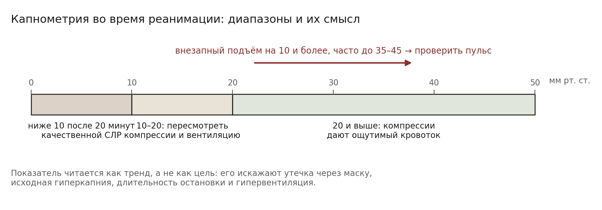
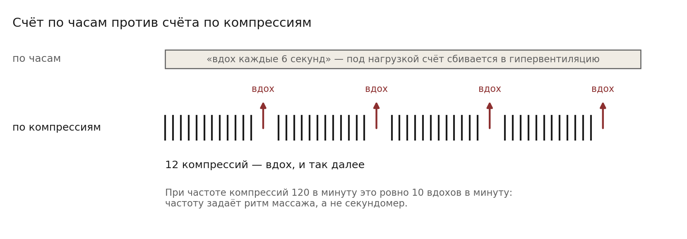
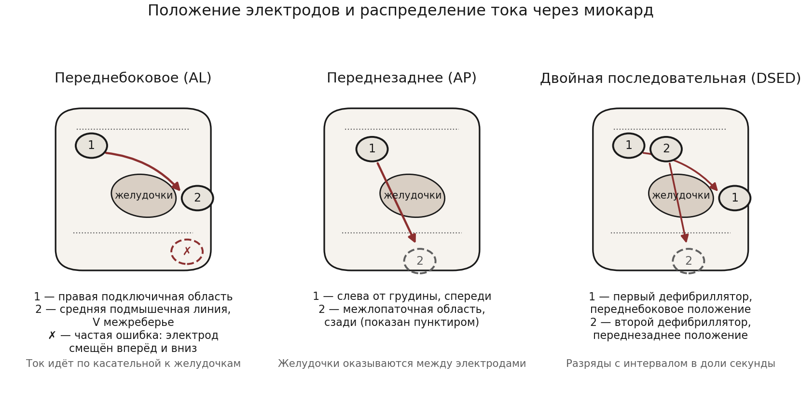
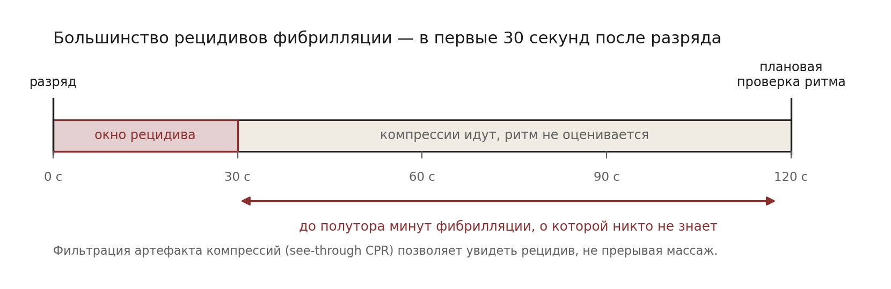

  
Журнальный клуб · выпуск 1

  
Остановка сердца: что изменилось после рекомендаций 2025 года

  
Разбор двух выпусков подкаста Emergency Medicine Cases — тезисы и вопросы к обсуждению

  

  
Тезисы составлены по письменным конспектам выпусков, опубликованным на сайте подкаста. Схемы подготовлены для этого материала.

  
Серия «Крещение поворотом» · версия 1.0 · 11 сентября 2026 · CC BY-NC-SA 4.0

Материал предназначен для обсуждения в коллективе. Первая часть — изложение источника: о чём говорят авторы, с какими оговорками и на каких данных. Она написана так, чтобы содержание было понятно без прослушивания выпусков. Вторая часть — вопросы для обсуждения; ответов на них здесь нет намеренно, они формулируются участниками. Итоги обсуждения предполагается добавить отдельным разделом после встречи.

# Источник

| Выпуск | Дата | Длительность | Тема |
|---|---|---|---|
| Эпизод 215. Cardiac Arrest Update: Beyond the 2025 Guidelines. Part 1: CPR, Defibrillation and Ventilation | март 2026 | 1 ч 53 мин | Компрессии, дефибрилляция, вентиляция, мониторинг |
| Эпизод 216. Cardiac Arrest Update: Beyond the 2025 ACLS Guidelines. Part 2: Medications, Airway, Termination and Post-ROSC Care | апрель 2026 | 1 ч 42 мин | Препараты, дыхательные пути, прекращение реанимации, период после восстановления кровообращения |

**Участники.** Ведущий — Антон Хелман (Anton Helman), Торонто. Приглашённые эксперты — Шелдон Ческес (Sheldon Cheskes), исследователь догоспитальной реанимации, руководитель исследования DOSE-VF, и Роб Симард (Rob Simard), специалист по ультразвуку в реанимации.

**Адреса:** [часть 1](https://emergencymedicinecases.com/cardiac-arrest-update-cpr-defibrillation-ventilation/) · [часть 2](https://emergencymedicinecases.com/cardiac-arrest-update-part-2/). Аудио и письменные конспекты выложены в открытый доступ; списки литературы к обоим выпускам приложены на тех же страницах.

**Раскрытие интересов, заявленное авторами.** Ш. Ческес входит в число лекторов компании Zoll, получал от неё гонорар за выступление по качеству СЛР и вентиляции и получал гранты Laerdal и Zoll на исследования. У А. Хелмана и Р. Симарда конфликтов интересов не заявлено. Обстоятельство существенно для разделов о приборах обратной связи и о двойной дефибрилляции, где речь идёт об оборудовании названных производителей.

**Что это за источник.** Emergency Medicine Cases — канадский образовательный проект неотложной медицины, выходящий с 2010 года; материалы бесплатны. Формат — обсуждение экспертами клинических вопросов с опорой на публикации. Это не клинические рекомендации и не нормативный документ: рекомендательный статус имеют указанные в выпусках руководства AHA и ILCOR 2025 года, а сами выпуски содержат в том числе мнения экспертов, выходящие за пределы этих руководств. В тезисах ниже такие места отмечены отдельно.

# Часть 1. Компрессии, дефибрилляция, вентиляция

## Общая рамка выпуска

Исходное положение авторов: рекомендации 2025 года не содержат принципиально новых средств, и рост выживаемости в сильных системах достигнут не новыми препаратами, а качеством исполнения — сокращением времени до вызова бригады, долей случаев с СЛР от очевидцев, ранним доступом к автоматическому дефибриллятору и слаженностью работы бригады. Основное содержание выпуска относится к тем точкам, где алгоритм заканчивается: фибрилляция желудочков, сохраняющаяся после трёх разрядов, адреналина и амиодарона, — состояние, для которого рекомендации 2025 года прямых указаний не дают.

## Цепочка выживания и организация системы

- В цепочку выживания добавлено шестое звено — восстановление и последующая жизнь пациента: помощь не заканчивается ни восстановлением кровообращения, ни выпиской.
- Отмечены организационные решения, сокращающие время до первого разряда: распознавание остановки кровообращения диспетчером, инструктаж очевидца по видеосвязи, приложения гражданских добровольцев с картой автоматических дефибрилляторов, доставка дефибриллятора беспилотником.
- Авторы высказываются в пользу тактики «работать на месте» вместо «грузить и везти» при большинстве внебольничных остановок: бригада на месте способна выполнить почти всё то же, что и приёмное отделение, а поступление в стационар без восстановления кровообращения связано с крайне плохим прогнозом.
- Предлагается направлять пациентов после восстановления кровообращения в стационары, регулярно принимающие таких больных и располагающие ангиографией, управлением температурой и профильной реанимацией.

## Качество компрессий

- Когда качество компрессий начали измерять объективно, оказалось, что высокого качества не обеспечивала практически ни одна система. Улучшение наступало только после введения измерения и обратной связи.
- Ухудшение компрессий начинается примерно через 45 секунд работы, поэтому смена выполняющего массаж каждые две минуты рассматривается как обязательная, а не желательная.
- Отдельно разбирается опора на грудную клетку: по мере утомления человек перестаёт полностью отпускать грудину, что препятствует наполнению желудочков. Предлагается, чтобы руководитель реанимации следил за этим глазами, а не полагался только на показатели частоты и глубины.
- Приборы обратной связи, встроенные в дефибриллятор, авторы считают предпочтительнее отдельных устройств: частота, глубина, ритм и параметры вентиляции оказываются на одном экране.
- Доказательная ценность приборов обратной связи оценивается сдержанно: влияние на показатели качества СЛР показано, влияние на выживаемость — нет. Наиболее оправданным считается их применение в программе анализа качества работы, а не как разовое средство у постели.

## Мониторинг: капнометрия и давление

<figure>
  
  <figcaption>Трактовка EtCO₂ в изложении выпуска. Значения приведены для взрослого при продолжающихся компрессиях.</figcaption>
</figure>

- Основное предостережение: EtCO₂ используется как тренд и как показатель качества компрессий, а не как самостоятельная цель или основание для решения.
- Значение ниже 10 мм рт. ст. после примерно 20 минут качественных компрессий связано с очень низкой вероятностью восстановления кровообращения — при условии, что обратимые причины исключены.
- Значение 20 мм рт. ст. и выше говорит о том, что компрессии создают ощутимый кровоток.
- Внезапный устойчивый подъём на 10 мм рт. ст. и более, часто до 35–45, служит поводом немедленно оценить пульс: такая картина часто отражает восстановление кровообращения.
- Значение искажают: утечка при масочной вентиляции и отсутствие герметичного контура, исходная задержка углекислого газа у пациента, длительность остановки, качество компрессий, массивная тромбоэмболия, введение соды.
- Узкокомплексная электрическая активность без пульса при высоком EtCO₂ может оказаться псевдо-ЭАБП, то есть сохранённым, но не пальпируемым кровотоком.
- При наличии артериального катетера он рассматривается как эталонный показатель: ориентир — диастолическое давление выше 25–30 мм рт. ст.; резкий подъём указывает на восстановление кровообращения, очень низкие значения — на плохой прогноз. Отдельно оговорено, что катетер — это монитор, а не лечение, и его установка не должна стоить качества компрессий; при бригаде из двух человек она вредна.

## Вентиляция

<figure>
  
  <figcaption>Вентиляция, привязанная к компрессиям: способ не сбиться на гипервентиляцию под нагрузкой.</figcaption>
</figure>

- Гипервентиляция названа одним из самых частых видов вреда, наносимого бригадой: повышение внутригрудного давления снижает венозный возврат, коронарное перфузионное давление падает, внутричерепное — растёт.
- После постановки надгортанного воздуховода или трубки рекомендованный режим прежний: один вдох каждые 6 секунд, продолжительность вдоха около секунды, объём — минимально достаточный для видимого подъёма грудной клетки.
- Практическое решение, предлагаемое авторами, — вентиляция, привязанная к компрессиям: один вдох после каждых 12 компрессий. При частоте компрессий около 120 в минуту это даёт те же 10 вдохов в минуту, но частоту задаёт счёт компрессий, а не секундомер.
- Обоснованность привычного дыхательного объёма 500–600 мл названа слабой; изучается, не предпочтительнее ли 300–400 мл. Идёт исследование OPTIVO, посвящённое оптимизации вентиляции при остановке кровообращения.
- Обсуждается раннее подключение аппарата ИВЛ в режиме для СЛР вместо ручной вентиляции мешком — как способ удержать заданную частоту и объём. Отмечено, что физиологическое обоснование есть, а данных об исходах пока нет.
- Приборы обратной связи по вентиляции, показывающие частоту и дыхательный объём, названы вероятным следующим направлением развития.

## Дефибрилляция: ток, а не энергия

<figure>
  
  <figcaption>Положение электродов определяет, какая доля тока проходит через желудочки. Схемы условные, анатомические ориентиры даны приблизительно.</figcaption>
</figure>

- Смысловой сдвиг, вокруг которого построен раздел: результат определяется током, прошедшим через миокард, а не выставленной энергией. Отсюда значение положения электродов.
- Частая техническая ошибка — боковой электрод, наложенный слишком кпереди и слишком низко; ток при этом идёт мимо сердца, в диафрагму и селезёнку.
- Переднезаднее положение может проводить через желудочки больший ток, чем переднебоковое, и по этой причине рассматривается как предпочтительное при фибрилляции желудочков; часть систем начинает реанимацию сразу с него. Наложить задний электрод предлагается при коротком повороте пациента на бок, не прекращая компрессий.
- Кардиоверсия фибрилляции предсердий отделена от дефибрилляции желудочков: там мишень — предсердный миокард, и выбор положения обсуждается отдельно. Здесь следует оговорка: в опубликованном конспекте выпуска сведения о положении электродов при фибрилляции предсердий противоречат друг другу — в перечне тезисов переднезаднее названо более эффективным, в тексте раздела более эффективным названо переднебоковое. Это расхождение источника, а не изложения.
- После нескольких безуспешных разрядов предлагается посмотреть ультразвуком, находится ли сердце действительно между электродами. Для первого разряда такая проверка не предполагается.
- Обсуждается стратегия высокой энергии с самого начала — то есть работа на максимальных значениях, доступных конкретному аппарату, вместо постепенного наращивания.
- У пациентов с обильным волосяным покровом описан приём: наклеить электроды, резко сорвать их вместе с волосами и наложить новые. Прижатие электродов рукой во время разряда названо безопасным для персонала и увеличивающим ток.
- Основной потерей времени названа пауза вокруг разряда: раннее прекращение компрессий, зарядка дефибриллятора уже после паузы, задержка возобновления компрессий после разряда.

## Время разряда: двухминутный цикл под вопросом

<figure>
  
  <figcaption>Расхождение между тем, когда возникает рецидив фибрилляции, и тем, когда его обнаруживают при жёстком двухминутном цикле.</figcaption>
</figure>

- Большинство рецидивов фибрилляции возникает в течение примерно 30 секунд после разряда, а не через две минуты.
- Отсюда довод: двухминутный цикл — удобный учебный приём, а не физиологическая закономерность; при жёстком следовании ему пациент может провести в фибрилляции до полутора минут, и никто об этом не узнает.
- Технически рецидив можно увидеть, не прерывая массаж: алгоритмы фильтрации артефакта компрессий отделяют ритм от помех. Речь идёт не о серии разрядов подряд с длинными паузами, а о том, чтобы не оставлять пациента в фибрилляции дольше необходимого при сохранении доли времени с компрессиями.

## Рефрактерная фибрилляция желудочков

- Предлагается различать три состояния: условно рефрактерную фибрилляцию, истинно устойчивую к разряду и рецидивирующую. Рецидивирующая фибрилляция, по мнению авторов, — не обязательно проблема препаратов или поражённой артерии, она может быть проблемой дефибрилляции.
- Двойная последовательная дефибрилляция: два аппарата, два набора электродов, два разряда с интервалом в доли секунды. Объяснение эффекта — не «больше джоулей», а более равномерное распределение тока по желудочку и изменённое состояние миокарда, которое встречает второй разряд.
- В исследовании DOSE-VF сравнивались обычная дефибрилляция, смена положения электродов и двойная последовательная дефибрилляция. И смена положения, и двойная дефибрилляция дали лучшие исходы по сравнению с обычной; авторы выпуска при наличии двух аппаратов предпочитают двойную.
- Опасение, что двойная дефибрилляция ухудшает качество СЛР из-за усложнения работы, данными исследования не подтвердилось: доля времени с компрессиями в группах не различалась. Вывод авторов: это вопрос обученности бригады, а не неизбежных пауз.
- Обсуждается более раннее применение — уже после первого или второго безуспешного разряда. Основание — небольшие европейские работы, показывающие сигнал пользы и отсутствие признаков вреда. Уровень доказательности авторы прямо называют предварительным.
- Блокада звёздчатого узла под контролем ультразвука описана как вмешательство при электрическом шторме: около 20 мл лидокаина или бупивакаина в фасциальное пространство ниже левой сонной артерии на уровне примерно шестого шейного позвонка, не прекращая компрессий. Ожидаемые нежелательные явления — преходящий синдром Горнера и осиплость; данные оцениваются как наблюдательные.

## Адреналин и сосудистый доступ

- Дозирование прежнее: 1 мг внутривенно или внутрикостно каждые 3–5 минут; высокие дозы пользы не показали.
- Мнение экспертов выпуска, выходящее за рамки рекомендаций: при фибрилляции желудочков число введений адреналина следует ограничивать, а при рефрактерной фибрилляции — прекращать введение, поскольку избыток катехоламинов поддерживает электрическую нестабильность.
- При электрической активности без пульса и асистолии раннее введение адреналина, напротив, связано с более частым восстановлением кровообращения, и продолжение введений оправдано при активном поиске обратимой причины.
- По сосудистому доступу приводится иерархия: внутривенный предпочтителен, внутрикостный — запасной. Причина не в том, что внутрикостный не работает, а в менее предсказуемом поступлении препарата и в возможности незаметной неудачи при установке.
- Отдельное мнение экспертов: при отсутствии внутривенного доступа они предпочитают внутримышечный адреналин внутрикостному, если нет возможности быстро подтвердить положение внутрикостной иглы ультразвуком. Доплеровское исследование во время промывания позволяет увидеть поступление раствора в костномозговой канал.
- Внутримышечное введение рассматривается как способ ввести адреналин раньше при задержке доступа; данные наблюдательные, о влиянии на неврологический исход судить рано.

## Механические устройства и приподнятое положение головы

- Механические компрессии не рекомендованы для рутинного применения: при возможности качественных ручных компрессий, включая короткую транспортировку, преимущества у устройства нет.
- Оговорённые показания — длительная транспортировка, нехватка людей, неудобные условия работы. Основное ограничение — время установки: цель составляет около 10 секунд, что требует отдельной тренировки.
- СЛР с приподнятым головным концом оценивается скептически. Это не отдельный приём, а сочетание подъёма, устройства порогового сопротивления вдоху и механических компрессий. Данные на животных убедительны, данные на людях — малочисленные и противоречивые; воспроизвести результаты центра, сообщившего об успехе, другим системам не удалось. Отмечена и техническая трудность: механическое устройство смещается на наклонной поверхности.

# Часть 2. Препараты, дыхательные пути, прекращение реанимации, период после ROSC

## Препараты вне адреналина

- Вазопрессин и стероиды: сведения о пользе сочетания с адреналином ограничены, рутинное применение авторы не поддерживают. Стероиды остаются оправданными после восстановления кровообращения при узких показаниях — известной надпочечниковой недостаточности, картине септического шока, устойчивой вазоплегии.
- Антиаритмические препараты: амиодарон и лидокаин равноприемлемы при фибрилляции желудочков и желудочковой тахикардии без пульса, устойчивых к разряду. Рекомендации предполагают первое введение после третьего разряда, но данные указывают на большую пользу при более раннем введении. Исследование ALPS (2016) не показало преимущества по выживаемости, а повторный анализ 2022 года связал более раннее введение амиодарона с более частым восстановлением кровообращения и лучшим неврологическим исходом. Для амиодарона предпочтителен внутривенный путь: при внутрикостном введении эффект может снижаться.
- Кальций: только при обоснованном подозрении на тяжёлую гиперкалиемию, гипокальциемию или отравление блокаторами кальциевых каналов. Систематический обзор 2025 года доказанной пользы при гиперкалиемии не выявил, исследование COCA (2021) указало на возможный вред при рутинном применении. Эксперты выпуска при убедительной картине гиперкалиемии кальций всё же вводят, ссылаясь на клинический опыт.
- Гидрокарбонат натрия: не вводится по одному лишь основанию, что реанимация затянулась и предполагается ацидоз — внутриклеточный ацидоз при этом усугубляется. Обсуждаемые показания: отравление препаратами, блокирующими натриевые каналы (трициклические антидепрессанты, кокаин), салицилатами, а также гиперкалиемия при диабетическом кетоацидозе.
- Магния сульфат: пируэтная тахикардия, значительное удлинение интервала QT до остановки, отравление препаратом, удлиняющим QT. Если остановка произошла на фоне инфузии магния, например при эклампсии, инфузия прекращается и вводится кальций.
- Кетамин: применяется при сознании, возникающем во время компрессий, — 0,5–1 мг/кг внутривенно, когда движения или пробуждение мешают проведению реанимации. Доказательств влияния на выживаемость нет; предположение о нейропротекции остаётся теоретическим.

## Дыхательные пути

- Выбор способа менее важен, чем отсутствие перерывов в компрессиях, отсутствие гипервентиляции и соответствие способа навыку конкретного исполнителя.
- В системах, где интубация выполняется редко, надгортанный воздуховод назван обычно лучшим выбором.
- В приёмном отделении при наличии опытного исполнителя предпочтительна интубация, но компрессии ради неё не прерываются.
- Если бригада доставила пациента с работающим надгортанным воздуховодом и вентиляция адекватна, разумно оставить его на время реанимации и заменить после восстановления кровообращения.

## Капнография как инструмент

- Перечислены пять применений: подтверждение положения трубки, обнаружение её смещения, контроль качества компрессий, обнаружение восстановления кровообращения, вклад в решение о прекращении реанимации.
- Нормальные значения указаны как 35–45 мм рт. ст. Исчезновение ранее имевшейся кривой, особенно после перекладывания пациента, рассматривается прежде всего как смещение трубки.

## Ультразвук и чреспищеводная эхокардиография

- Чреспищеводное исследование даёт непрерывное изображение во время компрессий, позволяет оценить положение рук и выявить обратимые причины. Данных рандомизированных исследований нет, а стоимость, обработка датчика и обучение делают метод возможностью отдельных центров, а не общей практикой.
- Обычное ультразвуковое исследование сохраняет основную роль при электрической активности без пульса: отличить истинную ЭАБП от псевдо-ЭАБП и найти немедленно устранимую причину.
- Общее ограничение: исследование не должно прерывать компрессии. Предложенный приём — записать 3–5 секунд изображения во время короткой паузы, возобновить компрессии и разбирать запись.

## Прекращение реанимации

- Решение предлагается принимать структурно и по нескольким основаниям сразу: проверка того, что случай не относится к потенциально обратимым (гипотермия, отравление, асфиксия при астме, тромбоэмболия, тампонада) и что пациент не является кандидатом на экстракорпоральную реанимацию; правило прекращения, действующее в данной системе; динамика EtCO₂, а не одно значение; данные ультразвука; зафиксированные пожелания пациента.
- Правило Университета Торонто применяется преимущественно для консультации бригады: остановка не при бригаде, СЛР очевидцами не проводилась, разрядов не было, кровообращение не восстанавливалось, обратимая причина не найдена — сочетание, склоняющее к прекращению.
- Отсутствие сокращений сердца на ультразвуке — сильный неблагоприятный признак, но согласие между исследователями низкое: слабые движения часто принимают за их отсутствие.

## Тромболизис и ангиография

- Рутинного места тромболизиса при остановке кровообращения нет. Рекомендации допускают его при тромбоэмболии, подтверждённой компьютерной томографией с контрастированием, и при инфаркте с подъёмом сегмента ST. Эксперты выпуска считают возможным расширять показания в отдельных случаях — при убедительном анамнезе и объективных данных ЭКГ или ультразвука, — оговаривая, что рандомизированными исследованиями это не подкреплено, и что вводить препарат следует рано, а не в качестве последнего средства. После тромболизиса реанимацию продолжают не менее часа.
- Показания к экстренной ангиографии: инфаркт с подъёмом сегмента ST, кардиогенный шок, рецидивирующие желудочковые аритмии.
- В комментариях к выпуску читатель отмечает, что не находит в рекомендациях 2025 года положения о тромболизисе при инфаркте с подъёмом ST во время остановки; ответа автора на этот вопрос на странице нет.

## После восстановления кровообращения

- Первые минуты названы периодом наибольшего риска повторной остановки. Приоритеты: стабилизация давления, поиск и устранение причины, недопущение гипотензии и гипоксии.
- Норэпинефрин — основной вазопрессор; его предлагается готовить заранее, ещё до восстановления кровообращения. В качестве промежуточной меры до начала инфузии применяются малые болюсные дозы адреналина.
- Лихорадка не допускается у всех пациентов; охлаждение до 32–34 °C рассматривается для наиболее тяжёлых, в зависимости от возможностей стационара.
- Компьютерная томография всего тела обсуждается для пациентов, которых не направляют сразу в рентгеноперационную или на экстракорпоральную поддержку. Исследование CT FIRST (2023) показало более высокую диагностическую результативность и более раннюю постановку диагноза, но не улучшение выживаемости и неврологического исхода.

| Показатель | Целевое значение |
|---|---|
| Насыщение крови кислородом | 90–98 %, гипероксия нежелательна |
| PaO₂ | 60–105 мм рт. ст. |
| PaCO₂ | 35–40 мм рт. ст., гипервентиляция нежелательна |
| Среднее артериальное давление | 65 мм рт. ст. и выше |
| Температура тела | без лихорадки; охлаждение — по показаниям |

# Границы применимости

Материал описывает канадскую практику приёмного отделения и догоспитального этапа. Существенная часть обсуждаемого требует оборудования и организационных условий, которых у выездной бригады может не быть: двух дефибрилляторов, артериального катетера, чреспищеводного датчика, экстракорпоральной поддержки, приборов обратной связи по качеству компрессий. Часть положений — прямо обозначенное мнение экспертов, расходящееся с текстом рекомендаций: ограничение числа введений адреналина при фибрилляции, предпочтение внутримышечного пути внутрикостному, расширение показаний к тромболизису, раннее применение двойной дефибрилляции. Объём помощи и показания в работе определяются действующими алгоритмами службы и клиническими рекомендациями, а не материалами подкаста.

# Вопросы для обсуждения

## Компрессии и их качество

1. Чем в условиях бригады измеряется качество компрессий и как об этом узнаёт тот, кто их выполняет?
2. Через какое время фактически происходит смена выполняющего массаж на вызовах и что определяет этот момент — усталость, счёт циклов или чьё-то указание?
3. Кто на вызове смотрит на полноту отпускания грудной клетки и в какой момент это вообще возможно заметить?
4. Что даёт разбор реанимации после вызова, если качество компрессий нигде не зафиксировано?

## Мониторинг

5. Как на практике используется капнометрия во время реанимации: как тренд, как подтверждение положения трубки, как что-то ещё?
6. Какие значения EtCO₂ на вызовах фактически влияли на решение и какое именно решение это было?
7. Насколько применимо на линии предостережение о псевдо-ЭАБП при высоком EtCO₂ и что с этим можно сделать без ультразвука?

## Вентиляция

8. Что чаще происходит на вызове — недостаточная вентиляция или избыточная, и по каким признакам об этом можно судить?
9. Насколько выполним счёт вдохов по компрессиям в составе бригады и кто должен его вести?
10. Какие возражения вызывает предложение снизить дыхательный объём до 300–400 мл?

## Дефибрилляция

11. Где фактически накладываются электроды в бригаде и совпадает ли это с тем, как описано в инструкции к аппарату?
12. Что мешает начинать с переднезаднего положения и сколько времени занимает поворот пациента для наложения заднего электрода?
13. Как поступают при ожирении, обильном волосяном покрове, влажной коже, имплантированном устройстве?
14. Что можно противопоставить доводу о рецидиве фибрилляции в первые 30 секунд, если аппарат не показывает ритм во время компрессий?
15. Какие из обсуждаемых приёмов при рефрактерной фибрилляции в принципе выполнимы одной бригадой, а какие требуют второй?

## Препараты

16. Как относиться к предложению ограничивать адреналин при фибрилляции, если алгоритм предписывает вводить его каждые 3–5 минут?
17. Что определяет срок введения амиодарона на вызовах — номер разряда, время или наличие доступа?
18. Какие случаи из практики оправдывали введение кальция, соды или магния, и как выглядело обоснование в карте вызова?
19. Встречалось ли сознание пациента во время компрессий и как бригада поступала?

## Организация и решения

20. Что означает «работать на месте» для условий конкретной бригады: где проходит граница между работой на месте и транспортировкой?
21. Как принимается решение о прекращении реанимации и что фиксируется в документах в качестве основания?
22. Какие из перечисленных приёмов можно освоить без нового оборудования, а какие требуют закупки и обучения?
23. Что из услышанного участники считают неприменимым в наших условиях и почему?

# Итоги обсуждения

Раздел заполняется после встречи: что коллектив принял, с чем не согласился, какие вопросы остались открытыми, что требует уточнения по действующим документам.

# Оговорка

Материал носит образовательный характер и передаёт содержание стороннего источника. Он не является клинической рекомендацией, не заменяет действующие приказы, алгоритмы и клинические рекомендации и не может служить основанием для клинического решения. Дозы, показания и тактика проверяются по первоисточникам, действующим на момент чтения. Тезисы составлены по письменным конспектам выпусков, опубликованным авторами подкаста; при расхождении изложения с источником верным считается источник.
