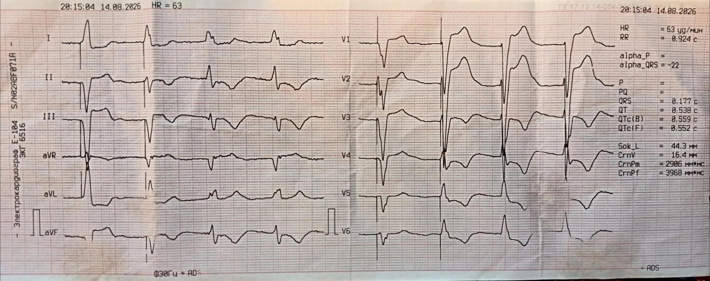
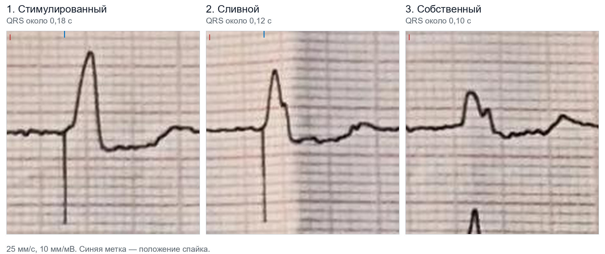
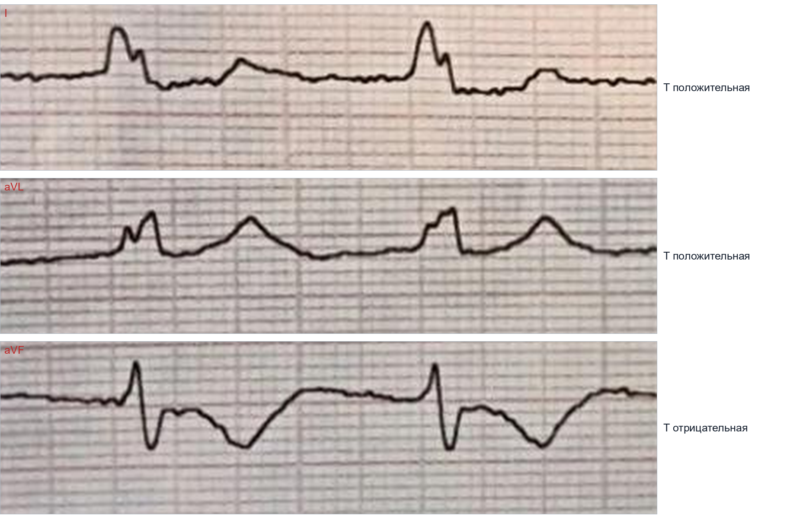

  
ЭКГ

  
Электрокардиостимулятор: сливной комплекс и память сердца

  
Как читать плёнку со стимулятором: захват, восприятие, слияние ритмов и ложная инверсия зубца T

  

  
Реальная плёнка с вызова: боль в животе у пациента с постоянным электрокардиостимулятором.

  
Серия «Крещение поворотом» · версия 1.1 · 24 августа 2026 · CC BY-NC-SA 4.0

# Случай

Повод к вызову — боль в животе. В анамнезе постоянный электрокардиостимулятор.

При осмотре: артериальное давление 160/90 мм рт. ст., пульс 63 в минуту. Одышки, перебоев и боли в груди нет. Электрокардиограмму записали потому, что увидели аппарат, а не потому что жаловались на сердце.

Аппарат вывел: частота 63 в минуту, интервал RR 0,924 с, QRS 0,177 с, QT 0,538 с, QTc по Базетту 0,559 с, QTc по Фридериции 0,552 с, ось QRS −22°. Поля зубца P, интервала PQ и оси зубца P пустые: алгоритм зубец P не выделил.

Диагноз бригады — острый холецистит. В стационаре диагноз подтверждён.

<figure class="ekg">

<figcaption>Рис. 1. Двенадцать отведений, 25 мм/с, 10 мм/мВ. В левой половине записи (I, II, III, aVR, aVL, aVF) — четыре комплекса: первые два идут за вертикальным артефактом стимуляции, третий и четвёртый узкие и артефакта не имеют. В правой половине (V1–V6) — три комплекса, все со стимуляцией. Фото автора.</figcaption>
</figure>

# Вопросы, которые возникают при взгляде на эту плёнку

1. За артефактом идёт широкий комплекс. Какая камера работает?
2. Первый и второй комплексы после спайка выглядят по-разному. Что случилось со вторым?
3. Третий и четвёртый комплексы идут без спайков. Аппарат сломался?
4. У собственных комплексов зубец T отрицательный внизу (II, III, aVF) и положительный вверху (I, aVL). Это инфаркт нижней стенки?
5. Прибор не измерил интервал PQ. Можно ли понять режим работы стимулятора?

Ответы — в конце, после возвращения к случаю.

# Азбука чтения плёнки с электрокардиостимулятором

Прежде чем искать ишемию, нужно найти **артефакт стимуляции (спайк)**. Это узкая вертикальная черта перед комплексом. Чтение начинается с неё: есть ли она и что следует сразу за ней.

При униполярной конфигурации электрода спайк крупный и хорошо виден. При биполярной он может быть почти незаметен. На этой записи артефакт отчётливо стоит перед первым и вторым комплексами: вертикальная линия «прошивает» сразу несколько дорожек. Перед третьим и четвёртым такой линии нет — там крутой фронт зубца R, но не спайк. В грудных отведениях артефакты стоят перед всеми тремя комплексами.

Интервал между двумя артефактами слева — около 0,96 с, то есть навязанная частота примерно 63 в минуту. Между собственными, третьим и четвёртым, комплексами — около 0,99 с, то есть собственный ритм около 61 в минуту. Разница две-три в минуту. Именно при таких близких частотах возникает конкуренция, из которой рождаются сливные комплексы.

# Захват и восприятие

Это два разных процесса, и на плёнке они проверяются раздельно.

**Захват (capture).** Сердце ответило на импульс? Если после спайка пошёл комплекс — даже широкий — захват есть.

**Восприятие (sensing).** Стимулятор увидел собственное сокращение? Если прошёл свой комплекс, а следующего спайка в положенный срок нет — восприятие работает.

На этой плёнке есть оба явления. Устройство работает.

# Три типа комплексов

В отведении I на этой записи видны три вида ударов.

| | Навязанный | Промежуточный | Собственный |
|---|---|---|---|
| Артефакт | есть | есть | нет |
| Ширина QRS | около 0,18 с | около 0,12 с | около 0,10 с |
| Зубец R в I | около 9 мм | около 7 мм | около 4,5 мм |
| Форма в II | глубокий QS | малый r и узкий S | высокий R и S |

<figure class="fragment">

<figcaption>Рис. 2. Три типа комплексов с одной плёнки в одинаковом масштабе, отведение I. Слева — полностью навязанный: широкий, высокоамплитудный. В центре — комплекс, который тоже идёт за артефактом, но заметно уже и ниже. Справа — собственный, артефакта перед ним нет. Вертикальная линия у первых двух — сам артефакт стимуляции. Небольшой пик у нижнего края правого фрагмента — вершина зубца R из соседней дорожки II: при большой амплитуде дорожки на плёнке частично перекрываются. Фрагменты фотографии автора.</figcaption>
</figure>

Промежуточный вариант — **сливной комплекс (fusion beat)**. Собственный ритм почти догнал частоту стимулятора: здесь 61 удар против 63. Собственное возбуждение пошло по проводящей системе, следом вышел стимул от электрода. Два фронта встретились внутри мышцы желудочка и сложились. Отсюда гибрид: шире собственного, уже полностью навязанного, по форме промежуточный.

И сливные, и так называемые **псевдосливные** комплексы — нормальная конкуренция ритмов, а не поломка аппарата.

| | Истинное слияние | Псевдослияние |
|---|---|---|
| Что произошло | стимул возбудил часть миокарда одновременно с собственным фронтом | артефакт наложился на уже развернувшийся собственный комплекс; миокард в этот момент рефрактерен, вклада нет |
| Ширина и форма | между собственной и полностью навязанной | равны собственной |
| Что это значит | захват есть; восприятие работает на грани цикла | захвата нет и не требуется; спайк лишь совпал по времени |

На этой плёнке второй комплекс — истинное слияние: он шире собственного, зубец R в I выше, зубец S в III глубже. Стимул внёс вклад в возбуждение.

Косвенный смысл для планового контроля, не для линейной бригады: пациент значительную часть времени идёт своим ритмом, и избыточная стимуляция правого желудочка сама по себе нежелательна. Решение о пересмотре настроек принимает специалист по устройствам.

# Память сердца

Главный подвох этой плёнки — инверсия зубца T. У собственных комплексов (без спайка) зубцы T глубоко отрицательные во II, III и aVF. Первая мысль — ишемия нижней стенки. Здесь виноват сам стимулятор.

Когда правый желудочек стимулируют долго, волна идёт от верхушки снизу вверх. Когда сердце бьётся само, деполяризация возвращается на обычный путь, а реполяризация ещё какое-то время идёт по старой последовательности.

**Правило Розенбаума (1982):** направление зубца T собственных комплексов повторяет направление вектора искусственного комплекса QRS.

Поскольку искусственный удар давал плюс в I и aVL и минус в нижние отведения, собственные удары делают то же самое с зубцом T. Это ложная инверсия. Удлинённый QTc (здесь 0,559 с) укладывается в ту же картину: реполяризация после длительной стимуляции длится дольше.

Дискордантные сегмент ST и зубец T у **навязанного** комплекса — отдельная норма: желудочек возбуждается не своим путём и восстанавливается не своим. Такие изменения появляются и исчезают вместе со стимуляцией. Память сердца — про зубец T у **собственных** комплексов после того, как аномальная активация уже прекратилась.

## Как отличить память от инфаркта

**Критерии Швилкина** (Circulation, 2005) в пользу памяти сердца:

1. зубец T положителен в aVL;
2. зубец T положителен или изоэлектрический в I;
3. максимальная инверсия зубца T в грудных отведениях глубже, чем инверсия в III.

На этой плёнке первые два выполнены. Третий сравнить нельзя: в грудных отведениях все комплексы навязаны.

Почему это работает. Электрод стоит у верхушки правого желудочка, навязанный комплекс положителен в I и aVL — и по правилу Розенбаума зубец T собственных комплексов в этих отведениях тоже становится положительным. Типичная ишемия левого желудочка уводит вектор инверсии вправо и даёт отрицательный зубец T именно в I и aVL.

Отдельная ловушка: ишемия по доминирующей правой коронарной артерии тоже даёт положительные зубцы T в I и aVL. Различает их как раз третий критерий: при такой ишемии инверсия глубже в **нижних** отведениях, при памяти — в грудных. На этой записи третьего критерия нет, поэтому по одним зубцам T память от нижней ишемии не закрывается.

**Главный вывод.** При боли в груди такую картину списывать на память нельзя — ни при каких критериях. Память объясняет инверсию у бессимптомного пациента; она не исключает ишемию и не имеет права ничего отменять при клинике коронарного события. Если пациент пришёл с больным животом, как здесь, — это классическая кардиологическая ловушка, а не инфаркт по умолчанию.

## Если бы болела грудь: критерии Сгарбоссы

Обычная оценка сегмента ST при навязанном комплексе невозможна: ST и T уже искажены стимуляцией. Оригинальные критерии Сгарбоссы (GUSTO-1, 1996) для стимулированного ритма: конкордантный подъём ST не менее 1 мм в любом отведении; депрессия ST не менее 1 мм в V1–V3; дискордантный подъём ST не менее 5 мм. Специфичность высокая, чувствительность низкая. Модифицированный вариант (Смит, 2012) заменяет порог 5 мм отношением подъёма ST к глубине предшествующего зубца S не менее 0,25; он выведен для блокады левой ножки и на стимуляцию переносится по аналогии.

Отрицательные критерии инфаркт не исключают. Ангинозная клиника при стимулированном ритме ведётся как острый коронарный синдром. Решение — по клинике, динамике плёнки и тропонину, а не по попытке разглядеть ишемию в заведомо искажённой реполяризации.

# Где предсердия

Аппарат зубец P не выделил. На плёнке его тоже не видно. Это совместимо с фибрилляцией предсердий и с однокамерным режимом VVI, который верхние отделы не слушает. Однокамерный желудочковый режим и двухкамерный с переключением режима на плёнке выглядят одинаково: один спайк перед широким комплексом. По одной записи точный режим назвать нельзя — нужен паспорт устройства.

# Магнит: стимулятор и дефибриллятор — разные вещи

| Устройство | Что делает магнит | Зачем это может понадобиться |
|---|---|---|
| Стимулятор | асинхронный режим (VOO, DOO): фиксированная частота, восприятие выключено | разорвать тахикардию, опосредованную устройством; обойти избыточное восприятие с паузами |
| Кардиовертер-дефибриллятор | отключает шоковую терапию, стимуляцию **не меняет** | прекратить повторные неоправданные разряды |

Путать эти два действия нельзя. Магнит на дефибрилляторе не улучшает стимуляцию и не помогает при брадикардии — он только выключает разряды. После снятия магнита шоковая терапия включается снова.

При остановке сердца реанимация и наружная дефибрилляция стандартные. Электроды не кладут непосредственно над корпусом устройства.

# Тактика бригады

Если часть комплексов свои, часть навязанные, а давление нормальное — лечить нечего. Действовать нужно, когда стимулятор перестал справляться и это видно по гемодинамике.

По Алгоритмам оказания скорой и неотложной медицинской помощи (приказ ДЗМ г. Москвы № 535 от 18.05.2023, раздел «Кардиология», внутренние страницы 44–45) при брадиаритмиях:

- частота более 40 в минуту, гемодинамика стабильна, приступов Морганьи — Эдамса — Стокса нет — лечения на этапе скорой помощи не требует;
- частота менее 40 в минуту при стабильной гемодинамике — мониторинг, **атропин 0,5–1 мг внутривенно**, эвакуация;
- частота менее 40 в минуту с нестабильной гемодинамикой или рецидивирующими приступами — венозный или внутрикостный доступ, натрия хлорид 0,9 % 250 мл, **атропин 0,5–1 мг внутривенно**, **допамин 5–7 мкг/кг/мин** в 250 мл натрия хлорида 0,9 %; при отсутствии эффекта и рецидивирующих приступах у больных без ишемической болезни сердца — **аминофиллин 240 мг внутривенно медленно**; временная кардиостимуляция силами бригады анестезиологии и реанимации; при недостаточном эффекте или невозможности временной стимуляции — **эпинефрин 0,5 мг внутривенно либо 1–4 мкг/кг/мин** капельно.

> **Расхождение с международной практикой.** ERC и AHA при симптомной брадикардии ставят атропин дробно до суммарных 3 мг, далее адреналин или изопреналин и чрескожную стимуляцию как ранний шаг для бригады с дефибриллятором. Алгоритмы ДЗМ ограничивают временную стимуляцию бригадами анестезиологии и реанимации и включают аминофиллин, которого в перечисленных международных алгоритмах нет.

При подозрении на потерю захвата у пациента с хронической болезнью почек или на диализе отдельно рассматривается гиперкалиемия: её коррекция может вернуть захват.

При любом контакте с пациентом, у которого стоит устройство, полезно получить паспорт: тип (стимулятор или дефибриллятор), камерность, режим, дата имплантации.

# Возвращение к случаю

**Что стимулируется.** Желудочек. Один спайк — один широкий комплекс QRS, без предшествующего зубца P. Ось −22°, высокий R в I, глубоко отрицательный комплекс в II, III и aVF — картина, совместимая со стимуляцией из правого желудочка.

**Второй комплекс.** Сливной. Доказательство: он шире своего (около 0,12 с против 0,10 с) и уже полностью навязанного (около 0,18 с). Стимул поучаствовал в возбуждении. Навязанная частота 63, собственная 61 — та самая узкая зона, где фазы двух ритмов сближаются.

**Где третий и четвёртый спайки.** Их нет, потому что стимулятор видит свои сокращения и молчит. Это исправное восприятие, а не отказ. Отказ выглядел бы как пауза без комплекса и без артефакта.

**Инверсия T — инфаркт?** Нет. Это память сердца. Искусственный удар шёл вниз, поэтому собственный даёт глубокий минус внизу (II, III, aVF) и плюс наверху (I, aVL). Первые два критерия Швилкина выполнены; третий на этой записи проверить нельзя. Плюс клиника абдоминальная, ангинозной боли нет.

<figure class="fragment">

<figcaption>Рис. 3. Собственные комплексы той же плёнки. В отведениях I и aVL зубец T положительный, в aVF — глубоко отрицательный. Направление зубца T повторяет направление комплекса QRS стимулированных комплексов. Первые два критерия Швилкина выполнены; третий проверить нельзя: в грудных отведениях все комплексы навязаны. Фрагменты фотографии автора.</figcaption>
</figure>

**Режим?** Неизвестен. Зубец P не выделен ни аппаратом, ни глазом. Нужен паспорт устройства или опрос программатором.

**Исход.** Давление 160/90 мм рт. ст. отдельной кардиологической тактики не требовало. Диагноз — острый холецистит — подтверждён.

Эта плёнка учит двум вещам: не называть нормальную конкуренцию ритмов поломкой и не принимать кардиологическую память за свежий инфаркт.

# Основные выводы

<table>
<colgroup><col class="nomer"><col class="vyvod"></colgroup>
<thead><tr><th>№</th><th>Вывод</th></tr></thead>
<tbody>
<tr><td>1</td><td>Чтение начинается со спайка: что следует за ним, то и стимулируется. Широкий комплекс — желудочек.</td></tr>
<tr><td>2</td><td>Захват — есть ли ответ за спайком. Восприятие — молчит ли аппарат после своего комплекса.</td></tr>
<tr><td>3</td><td>Часть комплексов навязана, часть своя — обычно норма при близких частотах, а не поломка.</td></tr>
<tr><td>4</td><td>Сливной комплекс уже полностью навязанного и по форме промежуточен. Псевдосливной равен собственному: стимул вклада не внёс.</td></tr>
<tr><td>5</td><td>Память сердца: зубец T своих комплексов повторяет направление навязанного QRS. Отсюда минус внизу и плюс в I и aVL.</td></tr>
<tr><td>6</td><td>Критерии Швилкина: T положителен в aVL, положителен или плоский в I, инверсия в грудных глубже, чем в III. Третий на этой плёнке проверить нельзя.</td></tr>
<tr><td>7</td><td>При боли в груди инверсию на память не списывают. Отрицательные критерии Сгарбоссы инфаркт не исключают.</td></tr>
<tr><td>8</td><td>Магнит на стимуляторе даёт асинхронный режим. Магнит на дефибрилляторе отключает разряды и стимуляцию не меняет.</td></tr>
</tbody>
</table>

# Источники иллюстраций

| Файл | Что изображено | Источник |
|---|---|---|
| `ekg_eks.png` | Двенадцать отведений, 25 мм/с, 10 мм/мВ | фото автора, CC BY-NC-SA 4.0 |
| `eks_tri_kompleksa.png` | Стимулированный, сливной и собственный комплексы в одном масштабе | фрагменты фотографии автора, CC BY-NC-SA 4.0 |
| `eks_pamyat_serdtsa.png` | Собственные комплексы в I, aVL и aVF | фрагменты фотографии автора, CC BY-NC-SA 4.0 |

# Источники

- Алгоритмы оказания скорой и неотложной медицинской помощи. Приказ ДЗМ г. Москвы № 535 от 18.05.2023 — раздел «Кардиология», брадиаритмии и нарушения проводимости (внутренние страницы 44–45).
- Rosenbaum M. B., Blanco H. H., Elizari M. V., Lázzari J. O., Davidenko J. M. Electrotonic modulation of the T wave and cardiac memory. *American Journal of Cardiology*, 1982; 50(2): 213–222.
- Shvilkin A., Ho K. K., Rosen M. R., Josephson M. E. T-vector direction differentiates postpacing from ischemic T-wave inversion in precordial leads. *Circulation*, 2005; 111(8): 969–974.
- Shvilkin A., Huang H. D., Josephson M. E. Cardiac memory: diagnostic tool in the making. *Circulation: Arrhythmia and Electrophysiology*, 2015; 8(2): 475–482.
- Sgarbossa E. B., Pinski S. L., Gates K. B., Wagner G. S. Early electrocardiographic diagnosis of acute myocardial infarction in the presence of ventricular paced rhythm. GUSTO-I investigators. *American Journal of Cardiology*, 1996; 77(5): 423–424.
- Smith S. W., Dodd K. W., Henry T. D., Dvorak D. M., Pearce L. A. Diagnosis of ST-elevation myocardial infarction in the presence of left bundle branch block with the ST-elevation to S-wave ratio in a modified Sgarbossa rule. *Annals of Emergency Medicine*, 2012; 60(6): 766–776.

# Выходные данные

**Материал:** «Электрокардиостимулятор: сливной комплекс и память сердца». Версия 1.1 от 24 августа 2026. Стилистическая переработка текста; измерения плёнки, рисунки и дозы без изменений.

**Серия:** «Крещение поворотом» — клинические разборы догоспитальной практики. Раздел «ЭКГ».

**Лицензия:** текст — Creative Commons «С указанием авторства — Некоммерческая — С сохранением условий» 4.0 (CC BY-NC-SA 4.0). Копировать, печатать и раздавать коллегам можно свободно; продавать — нельзя.

**Оговорка.** Материал носит учебный характер. Он не является нормативным документом, не заменяет действующие протоколы, клинические рекомендации и распоряжения службы и не может использоваться как единственное основание для клинического решения. Дозы, показания и маршрутизацию необходимо проверять по действующим первоисточникам. Ответственность за клинические решения несёт медицинский работник, а не автор материала.

**О клинических случаях.** Случаи обезличены: нет имён, дат вызовов, адресов, номеров карт вызова, названий стационаров, бытовые детали изменены. Совпадения с чужой практикой возможны и неизбежны.

**Нашли ошибку?** Сообщить можно через раздел Issues репозитория проекта; исправление выходит новой версией, а изменение фиксируется в журнале изменений.
