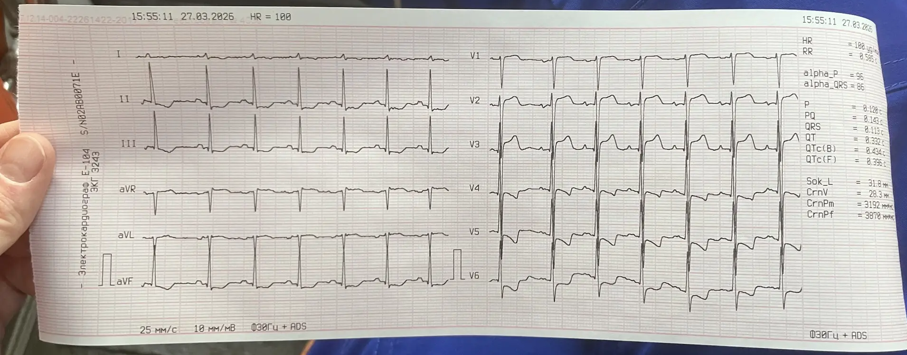

  
ЭКГ

  
Гипертрофия левого желудочка и strain

  
Дискордантные подъёмы и депрессии ST при гипертрофии: почему это не инфаркт — и когда за strain всё же прячется STEMI

  

  
Реальная плёнка с вызова. Сначала случай и вопросы, затем разбор.

  
Серия «Крещение поворотом» · версия 1.0 · 16 августа 2026 · CC BY-NC-SA 4.0

# Случай

Женщина 89 лет. Повод к вызову не сердечный: деменция, отказ от еды, не узнаёт родных. В анамнезе — хроническая сердечная недостаточность.

При осмотре: отёки нижних конечностей, шейные вены слегка набухшие, при аускультации сердца — ритм галопа (третий тон), хрипов в лёгких нет. Боли в груди и одышки нет. SpO₂ 98 %.

Электрокардиограмма снята в рамках осмотра. Аппарат: частота 100 в минуту, PQ 0,143 с, QRS 0,113 с, QTc (Bazett) 0,434 с, ось QRS 86°. Индекс Соколова–Лайона 31,8 мм; индекс Корнелла 28,3 мм; произведение Корнелла 3878.

<figure class="ekg">

<figcaption>Рис. 1. Двенадцать отведений, 25 мм/с, 10 мм/мВ. Частота, которую показывает аппарат, — 100 в минуту. Обратите внимание на депрессию сегмента ST с асимметричной инверсией зубца T в боковых отведениях (I, aVL, V5–V6) и дискордантный подъём ST в правых грудных (V1–V3). Фото автора.</figcaption>
</figure>

# Вопросы для размышления

Ответы — в конце материала, после возвращения к случаю.

1. Подъём сегмента ST в правых грудных отведениях и депрессия в боковых — это инфаркт? По каким признакам изменения при гипертрофии отличают от тока повреждения?
2. Что такое strain pattern (изменения по типу перегрузки) и каков его механизм?
3. Почему у этой пациентки гипертрофия подтверждается индексом Корнелла, но не проходит по Соколову–Лайону? Что это говорит о вольтажных критериях у пожилых?
4. Может ли strain скрыть или сымитировать настоящий инфаркт с подъёмом ST — и что тогда удерживает от ошибки?
5. Ритм галопа (третий тон) — о чём он и как связан с картиной на ЭКГ?
6. Нужно ли что-то делать с этими изменениями ST на догоспитальном этапе, если боли нет?

# Как читать эту плёнку

**Ритм.** Синусовый, частота около 100 в минуту. Зубцы P положительные, интервал PQ нормальный.

**Вольтаж и ширина QRS.** Комплекс QRS 0,113 с — на верхней границе нормы, слегка расширен. При увеличении массы миокарда деполяризация длится дольше, поэтому пограничное расширение при гипертрофии ожидаемо. Ось нормальная, вертикальная.

**Признаки гипертрофии.** Индекс Корнелла (сумма зубца S в V3 и зубца R в aVL) 28,3 мм при пороге 20 мм для женщин — критерий положителен. Произведение Корнелла 3878 при пороге 2440 — тоже. Индекс Соколова–Лайона 31,8 мм не дотягивает до порога 35 мм. Расхождение критериев здесь принципиально и разобрано ниже.

**Реполяризация.** В боковых отведениях с высоким зубцом R (I, aVL, V5–V6) — косонисходящая депрессия сегмента ST с асимметричной инверсией зубца T (пологое снижение, крутой возврат к изолинии). В правых грудных отведениях с глубоким зубцом S (V1–V3) — дискордантный подъём сегмента ST. Все смещения ST направлены противоположно основному зубцу комплекса QRS и пропорциональны его амплитуде.

**Что это в сумме.** Гипертрофия левого желудочка с вторичными изменениями реполяризации по типу перегрузки (strain). Не острый коронарный синдром.

# Гипертрофия: почему Корнелл, а не Соколов у пожилых

Вольтажные критерии гипертрофии измеряют амплитуду QRS, но амплитуда на поверхности тела зависит не только от массы миокарда, но и от того, что лежит между сердцем и электродом.

Индекс **Соколова–Лайона** (S в V1 + R в V5 или V6) опирается на грудные отведения. Их амплитуда закономерно падает с возрастом, при эмфиземе и хронической обструктивной болезни лёгких, при ожирении и изменениях грудной клетки — то есть ровно у той популяции, где гипертрофия наиболее вероятна. Отсюда низкая чувствительность Соколова у пожилых: критерий часто отрицателен при реально гипертрофированном желудочке.

Индекс **Корнелла** (S в V3 + R в aVL, с разными порогами для мужчин и женщин) и **произведение Корнелла** (индекс, умноженный на длительность QRS) меньше зависят от грудной геометрии и у пожилых работают надёжнее. В этом случае они и выявили гипертрофию, которую Соколов пропустил.

Практический смысл: отрицательный индекс Соколова у пожилого пациента гипертрофию не исключает. Опора только на один вольтажный критерий даёт ложное «сердце в норме».

# Strain pattern: механизм

Гипертрофия от хронической перегрузки давлением (артериальная гипертензия, аортальный стеноз) утолщает стенку левого желудочка. Утолщённый субэндокард хуже кровоснабжается: коронарный резерв исчерпан, развиваются хроническая субэндокардиальная ишемия и фиброз. Это меняет последовательность и направление реполяризации.

Вектор реполяризации (зубец T) разворачивается **прочь** от гипертрофированной стенки. Отсюда закономерная география:

- в отведениях, «смотрящих» на стенку левого желудочка, где комплекс QRS с высоким зубцом R (I, aVL, V5–V6), — депрессия сегмента ST и **асимметричная** инверсия зубца T: пологое нисходящее колено и более крутое восходящее;
- в отведениях с глубоким зубцом S (V1–V3) те же изменения выглядят зеркально — как **дискордантный подъём** сегмента ST с положительным зубцом T.

Ключевая черта strain — **дискордантность**: смещение ST направлено противоположно основному зубцу QRS и **пропорционально** его амплитуде. Чем выше зубец R, тем глубже депрессия; чем глубже зубец S, тем выше дискордантный подъём.

# Strain или инфаркт с подъёмом ST

Обе картины дают смещение сегмента ST, и обе способны напугать. Различают их по нескольким признакам.

| Признак | Strain при гипертрофии | Инфаркт с подъёмом ST |
|---|---|---|
| Отношение ST к QRS | Дискордантно (противоположно основному зубцу) | Часто конкордантно очагу; подъём в зоне, независимой от направления QRS |
| Пропорциональность | Пропорционально амплитуде QRS | Непропорционально, «избыточно» относительно QRS |
| Форма подъёма | Вогнутый, плавно переходит в зубец T | Часто выпуклый, «надгробие» (волна Пардэ) |
| Зубец T в боковых | Асимметричная инверсия (пологий спуск, крутой подъём) | Симметричная инверсия либо высокий острый T |
| География | Соответствует зонам высокого R и глубокого S | Коронарная территория + реципрокные изменения |
| Динамика | Стабильна, повторяет прежние плёнки | Меняется по минутам и часам |
| Клиника | Нет ангинозной боли | Боль, вегетативная реакция, нестабильность |

Ни один признак в одиночку не решает. Решает сумма: дискордантность, пропорциональность, форма, стабильность и — прежде всего — **клиника и сравнение с прежней плёнкой**.

# Strain может маскировать инфаркт

Вторичные изменения реполяризации при гипертрофии — это постоянный фон, на котором острый подъём ST труднее заметить: базовые смещения и скрадывают истинную элевацию, и имитируют её. Поэтому гипертрофия не индульгенция.

Ориентир, помогающий не пропустить окклюзию на фоне гипертрофии, — **чрезмерность** дискордантного подъёма: если подъём ST в правых грудных отведениях непропорционально велик относительно глубины предшествующего зубца S (условно — превышает примерно четверть его амплитуды), это аргумент в пользу острой окклюзии, а не strain. Тот же принцип избыточной дискордантности лежит в основе модифицированных критериев Сгарбоссы при блокаде левой ножки и ритме кардиостимулятора.

Практические предохранители при гипертрофии с изменениями ST: наличие ангинозной боли снижает порог трактовки в пользу инфаркта; сравнение с прежней электрокардиограммой отделяет хронический фон от острого; повторная запись в динамике ловит эволюцию. Стабильная картина без боли — за strain; новизна, боль или динамика — за острый коронарный синдром, пока не доказано обратное.

# Возвращение к случаю

**Заключение по плёнке.** Синусовый ритм, частота 100 в минуту. Гипертрофия левого желудочка (индекс и произведение Корнелла положительны; Соколов отрицателен, что у пожилых типично). Вторичные изменения реполяризации по типу перегрузки: депрессия ST с асимметричной инверсией зубца T в боковых отведениях, дискордантный подъём ST в правых грудных. Изменения дискордантны и пропорциональны комплексу QRS. Это не острый коронарный синдром.

**Что удержало от ошибки.** Подъёмы ST в правых грудных на плёнке выглядят тревожно, но клиника не коронарная: боли в груди нет, одышки нет, SpO₂ 98 %, изменения дискордантны и пропорциональны QRS. Трактовка как strain, а не как инфаркт, подтверждена консультацией по кардиопульту.

**Ритм галопа.** Третий тон у пожилой пациентки с отёками и набухшими шейными венами — признак объёмной перегрузки и декомпенсации хронической сердечной недостаточности. Он согласуется с электрокардиографической картиной гипертрофированного, работающего с перегрузкой желудочка, но острого коронарного события не означает.

**Исход.** Повод к вызову был не сердечный — деменция и отказ от еды. Электрокардиограмма снята попутно и правильно расценена как хроническая. Пациентка оставлена дома, ведение передано психиатрической службе. Изменения ST, которые при поверхностном чтении погнали бы бригаду с «инфарктом», к неотложной кардиологической тактике отношения не имели.

# Ответы на вопросы для размышления

**1.** Не инфаркт. Смещения ST дискордантны комплексу QRS (депрессия там, где высокий R; подъём там, где глубокий S) и пропорциональны его амплитуде; подъём вогнутый; инверсия зубца T в боковых асимметричная. Ток повреждения при инфаркте даёт непропорциональный, часто выпуклый подъём в коронарной территории с реципрокными изменениями и динамикой, обычно на фоне боли.

**2.** Strain — вторичные изменения реполяризации при гипертрофии от перегрузки давлением. Утолщённый субэндокард хронически ишемизирован; вектор зубца T разворачивается прочь от гипертрофированной стенки, давая депрессию ST и асимметричную инверсию T в отведениях с высоким R и зеркальный дискордантный подъём в отведениях с глубоким S.

**3.** Соколов–Лайон опирается на амплитуду грудных отведений, которая падает с возрастом, при эмфиземе, ожирении и изменениях грудной клетки, поэтому у пожилых часто ложно отрицателен. Корнелл и произведение Корнелла меньше зависят от грудной геометрии и надёжнее. Вывод: отрицательный Соколов гипертрофию не исключает; опираться на один вольтажный критерий нельзя.

**4.** Может: постоянный фон изменений реполяризации и скрадывает истинную элевацию, и имитирует её. Удерживают от ошибки чрезмерность дискордантного подъёма (непропорционально глубине зубца S — аргумент за окклюзию, принцип модифицированных критериев Сгарбоссы), наличие ангинозной боли, сравнение с прежней плёнкой и повторная запись в динамике.

**5.** Третий тон — признак объёмной перегрузки и декомпенсации хронической сердечной недостаточности. В сочетании с отёками и набухшими шейными венами он указывает на перегруженный желудочек и согласуется с электрокардиографической гипертрофией, но острого коронарного события не означает.

**6.** Нет. При отсутствии ангинозной боли, одышки и нестабильности дискордантные изменения ST по типу перегрузки не требуют неотложной кардиологической тактики и трактуются как хронический фон. Изменения фиксируют в документации; при любой клинической настороженности их ведут как острый коронарный синдром со сравнением плёнок и повторной записью.

# Основные выводы

<table>
<colgroup><col class="nomer"><col class="vyvod"></colgroup>
<thead><tr><th>№</th><th>Вывод</th></tr></thead>
<tbody>
<tr><td>1</td><td>Strain — дискордантные и пропорциональные QRS изменения ST: депрессия там, где высокий R, подъём там, где глубокий S.</td></tr>
<tr><td>2</td><td>Инфаркт даёт непропорциональный, часто выпуклый подъём в коронарной территории с реципрокными изменениями, динамикой и болью.</td></tr>
<tr><td>3</td><td>Отрицательный Соколов–Лайон у пожилого гипертрофию не исключает. Корнелл и произведение Корнелла надёжнее.</td></tr>
<tr><td>4</td><td>Гипертрофия не индульгенция: strain маскирует STEMI. Защищают чрезмерность дискордантного подъёма, боль, сравнение с прежней плёнкой и запись в динамике.</td></tr>
<tr><td>5</td><td>Третий тон с отёками и набухшими венами — декомпенсация ХСН, не признак острой ишемии.</td></tr>
<tr><td>6</td><td>Без боли и нестабильности дискордантные ST — хронический фон. Настораживает новизна, боль или динамика.</td></tr>
</tbody>
</table>

# Источники иллюстраций

| Файл | Что изображено | Источник |
|---|---|---|
| `ekg_glzh_strain.png` | Двенадцать отведений, 25 мм/с, 10 мм/мВ | фото автора, CC BY-NC-SA 4.0 |

# Источники

- Oxford Handbook of Emergency Medicine — гипертрофия левого желудочка, изменения реполяризации, дифференциальный диагноз подъёма ST.
- Tintinalli's Emergency Medicine: A Comprehensive Study Guide — ЭКГ-имитаторы инфаркта, гипертрофия и strain.
- Критерии гипертрофии левого желудочка: Sokolow M., Lyon T. (1949); Casale P. et al. Cornell voltage и Cornell product.
- Smith S. W. et al. Модифицированные критерии Сгарбоссы (пропорциональная дискордантность) для распознавания окклюзии на фоне изменённого комплекса QRS.
- Алгоритмы оказания скорой медицинской помощи (Департамент здравоохранения города Москвы, 2025) — раздел «Острый коронарный синдром» (маршрутизация и объём при подозрении на инфаркт).

# Выходные данные

**Материал:** «Гипертрофия левого желудочка и strain». Версия 1.0 от 16 августа 2026.

**Серия:** «Крещение поворотом» — клинические разборы догоспитальной практики. Раздел «ЭКГ».

**Лицензия:** текст и фотографии — Creative Commons «С указанием авторства — Некоммерческая — С сохранением условий» 4.0 (CC BY-NC-SA 4.0). Копировать, печатать и раздавать коллегам можно свободно, включая печать для подстанции; продавать — нельзя; при переработке сохраняется та же лицензия и указывается источник.

**О фотографии.** Снимок бумажной плёнки сделан автором. Авторские права на фотографию принадлежат автору. В тексте нет имени, адреса, номера карты и названия стационара; на самой плёнке видны дата, время и служебные данные аппарата без сведений о пациенте.

**Оговорка.** Материал учебный. Он не является нормативным документом, не заменяет действующие протоколы, клинические рекомендации и распоряжения службы и не может использоваться как единственное основание для клинического решения. Дозы, показания и маршрутизацию проверять по первоисточникам, действующим на момент чтения. Ответственность за решения у постели больного несёт медицинский работник, а не автор материала.

**Нашли ошибку?** Ошибка в дозе, сроке или механизме — не мелочь: материал читают перед сменой. Сообщить можно через раздел Issues репозитория проекта; исправление выходит новой версией, а изменение фиксируется в журнале изменений.
