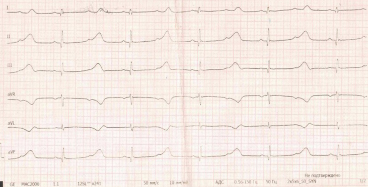
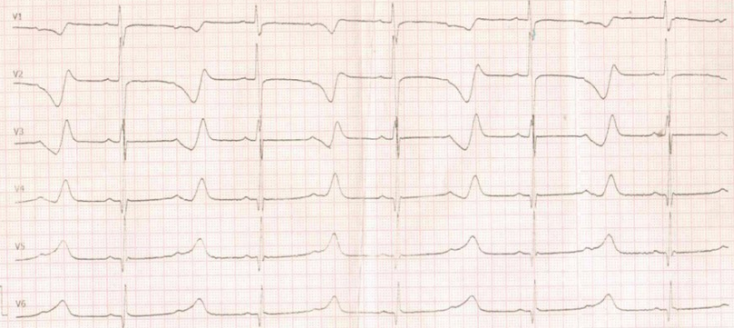
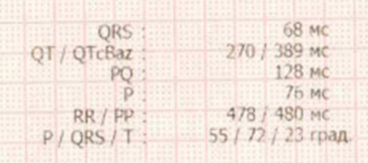
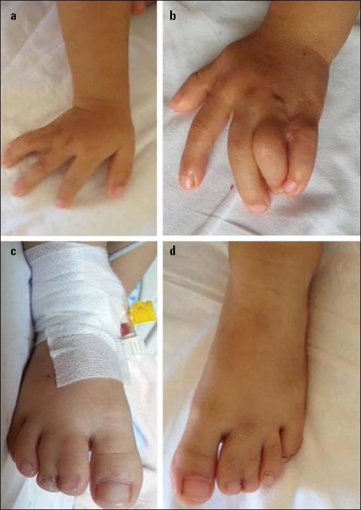

  
ЭКГ

  
Удлинённый QT и АВ-блокада 2:1 у ребёнка

  
Почему очередной зубец P не проводится: реполяризация желудочков длиннее предсердного цикла. Измерение QT на плёнке 50 мм/с, функциональная блокада 2:1, синдром Тимоти

  

  
Реальная плёнка с вызова. Сначала случай и вопросы, затем разбор.

  
Серия «Крещение поворотом» · версия 1.0 · 22 августа 2026 · CC BY-NC-SA 4.0

# Слово бригаде

> «Вызов был в какое-то учреждение, типа детского дома, только девочка, к которой мы приехали там находилась не постоянно, а только днем, вечером родители забирали ее домой. Ребенок потерял сознание во время рисования, активно не двигался, не кричал, не плакал, ни на что перед обмороком не жаловался. К нашему приезду девочка в сознании. Психический статус и когнитивное развитие оценить было сложно, девочка раскачивалась вперед-назад, на контакт не шла. В медицинской карте: синдром удлиненного интервала QT, синдром Тимоти, гетерозиготная мутация в 8 экзоне гена CACNA1C».

Обморок случился в покое, за столом, без нагрузки, без испуга, без крика и без предвестников. Записана электрокардиограмма.

<figure class="ekg">

<figcaption>Рис. 1. Стандартные отведения I, II, III, aVR, aVL, aVF. В служебной строке внизу записи: GE MAC2000, алгоритм 12SL v241, <strong>50 мм/с</strong>, 10 мм/мВ, фильтр 0,56–150 Гц, режекция 50 Гц, режим 2x5+5_SYN.</figcaption>
</figure>

<figure class="ekg">

<figcaption>Рис. 2. Грудные отведения V1–V6 той же записи, та же скорость. Обратить внимание на протяжённость участка от комплекса QRS до окончания зубца T в V2–V3 и на второе отклонение, укладывающееся в этот участок.</figcaption>
</figure>

# Вопросы для размышления

Ответы — в конце материала, после возвращения к случаю.

1. Скорость записи 50 мм/с. Чему равны малая и большая клетки и сколько миллиметров занимает интервал QT длительностью 620 мс?
2. Зубцов P на плёнке 125 в минуту, комплексов QRS — 64 в минуту. Как такое возможно при неповреждённой проводящей системе?
3. Почему очередной зубец P не проводится, а следующий за ним проводится, причём с нормальным интервалом PQ 128 мс?
4. Почему проведение 2:1 при таком QT считают признаком тяжёлой формы, а не отдельной проблемой проведения?
5. Показан ли здесь атропин? Частота желудочковых комплексов 64 в минуту, ребёнок только что был без сознания.
6. Панель автоматических измерений вывела QT 270 мс и QTc 389 мс — норму для ребёнка, причём формулу применила верно. Что именно она измерила?
7. Обморок случился в покое, за рисованием, без нагрузки и без испуга. Как это соотносится с типами врождённого удлинения QT и что подсказывает про генотип?
8. В медицинской карте — синдром Тимоти, мутация в 8 экзоне гена CACNA1C. Что из этого следует для бригады прямо на вызове: чего нельзя вводить и чего нельзя делать?

# Первое: измерить интервалы по плёнке

Скорость записи — **50 мм/с**, вдвое быстрее привычной. Пересчёт клеток:

| Скорость | Малая клетка (1 мм) | Большая клетка (5 мм) | 1 секунда |
|---|---|---|---|
| 25 мм/с | 40 мс | 200 мс | 25 мм |
| **50 мм/с** | **20 мс** | **100 мс** | **50 мм** |

Комплексы QRS узкие: 3,4 мм, то есть 68 мс. Участок от начала комплекса QRS до окончания зубца T занимает 31 мм — больше шести больших клеток, **620 мс**. Измерение по трём последовательным проведённым комплексам в отведении, где зубец T отчётлив:

| Комплекс | QT | RR | QTc по Базетту |
|---|---|---|---|
| 1 | 620 мс | 960 мс | 632 мс |
| 2 | 610 мс | 940 мс | 629 мс |
| 3 | 610 мс | 950 мс | 626 мс |

Отношение, которое не зависит ни от скорости записи, ни от выбора формулы коррекции: **QT в сравнении с интервалом RR**. Здесь 620 / 960 = 0,65 — интервал QT занимает две трети цикла, тогда как при частоте около 60 в минуту он обычно укладывается в половину или меньше.

# Второе: почему зубец P приходит раньше, чем заканчивается реполяризация

Между соседними комплексами QRS на плёнке прослеживается лишний зубец P, не сопровождаемый комплексом QRS: в V2–V3 он виден как второе отклонение внутри длинного участка ST–T, наложенное на зубец T. Интервал между зубцами P — 480 мс: предсердный ритм синусовый, 125 в минуту. Интервал между комплексами QRS — 960 мс, то есть 64 желудочковых комплекса в минуту.

Проверка арифметикой: 480 × 2 = 960. Желудочковый цикл ровно вдвое длиннее предсердного — на два зубца P один комплекс QRS, проведение **2:1**.

Теперь причина. Интервал QT — это длительность электрической систолы желудочков: время, пока миокард деполяризован и восстанавливается. Пока не закончился зубец T, он рефрактерен и на новый импульс не отвечает. Сравниваем два измеренных числа:

- реполяризация желудочков заканчивается через **620 мс** от начала комплекса QRS;
- очередной зубец P приходит через **480 мс** от предыдущего.

Зубец P приходит на **140 мс раньше**, чем желудочки закончили восстанавливаться. Импульс застаёт их рефрактерными и до желудочков не доходит — на плёнке остаётся одинокий зубец P без комплекса QRS. Следующий зубец P, через 960 мс от последнего проведённого, приходит по восстановленному миокарду и проводится обычным путём: интервал PQ проведённых комплексов нормальный, 128 мс.

Отсюда слово **функциональная**: проводящая система не повреждена, блокируется не она, а желудочек, который ещё не восстановился.

| Признак | Функциональная блокада 2:1 при удлинённом QT | АВ-блокада II степени за счёт поражения проводящей системы |
|---|---|---|
| Причина | реполяризация желудочков длиннее предсердного цикла | нарушение проведения в АВ-узле или системе Гиса |
| Интервал QT | резко удлинён, часто длиннее интервала PP | обычно нормальный |
| Интервал PQ проведённых комплексов | нормальный | часто удлинён или нарастает (тип Мобитц I) |
| Отношение QT к PP | QT ≥ PP | QT существенно меньше PP |
| Что лечится | реполяризация: причина удлинения QT | само проведение: стимуляция |
| Реакция на ускорение предсердного ритма | ухудшение: импульсы ещё чаще попадают в рефрактерность | обычно без принципиальной разницы |

Из этой таблицы следует главное для бригады: перед нами не проблема проведения, а **удлинение QT такой степени, что оно уже не пускает каждый второй импульс**. Частота желудочковых комплексов 64 в минуту — следствие удлинённой реполяризации, а не собственный ритм синусового узла: узел работает на 125 в минуту.

## Почему это грозный признак, а не курьёз

Функциональная блокада 2:1 у ребёнка с врождённым удлинением QT — маркер очень тяжёлой формы. Она означает, что реполяризация растянута сверх длительности предсердного цикла, а именно в растянутой реполяризации возникают ранние постдеполяризации, из которых рождается тахикардия типа «пируэт». В обзорной работе по синдрому Тимоти (Jiang, Zhang, *Expert Reviews in Molecular Medicine*, 2023) удлинённый QTc, низкая частота желудочковых сокращений за счёт блокады 2:1 и альтернация зубца T перечислены как ядро кардиального фенотипа, а желудочковые тахиаритмии названы ведущей причиной смерти.

Отдельно стоит помнить о **альтернации зубца T** — чередовании его амплитуды или формы от комплекса к комплексу при неизменном ритме. Это признак нестабильной реполяризации и предвестник «пируэта». На плёнке 2:1 её оценка затруднена: комплексов немного, и часть зубцов T сливается с блокированными зубцами P.

# Азбука: QT, QTc и детские отсечки

Интервал QT измеряется от начала комплекса QRS до окончания зубца T; при двугорбом или сливающемся с волной U зубце T конец определяют по касательной к нисходящему колену. Измерять надо в отведении, где зубец T наиболее отчётлив, и брать наибольшее значение, а не среднее по плёнке.

Коррекция по частоте нужна потому, что QT физиологически укорачивается при тахикардии.

| Формула | Вид | Особенность |
|---|---|---|
| Базетт | QT / √RR | стандарт де-факто; переоценивает при тахикардии, недооценивает при брадикардии |
| Фридериция | QT / ∛RR | устойчивее на крайних частотах |
| Ходжес, Фрамингем | линейные поправки | применяются в исследованиях |

Отсечки, принятые для детей и подростков младше 15 лет:

| QTc | Оценка |
|---|---|
| менее 440 мс | норма |
| 440–460 мс | пограничные значения |
| более 460 мс | удлинён |
| 480 мс и более | достаточно для диагноза при отсутствии другой причины |
| **500 мс и более** | **высокий риск «пируэта»; препараты, удлиняющие QT, недопустимы** |

Число 500 — стоп-цифра. У этого ребёнка QTc 632 мс, то есть отсечка превышена на 132 мс.

Важная оговорка о самой коррекции: формулы выведены для проведения 1:1 при устойчивой частоте, а при блокаде 2:1 желудочковый цикл искусственно удвоен. Значит, QTc здесь — величина приблизительная. Но выводу это не мешает: **абсолютный QT 620 мс превышает любой порог при любой формуле**, а отношение QT к RR равно 0,65.

# Отдельно: что вывел аппарат

Всё изложенное выше получено из самой плёнки, и этого для разбора достаточно. На панель автоматических измерений стоит посмотреть по другой причине — как выглядит верная арифметика на неверных исходных числах.

<figure class="fragment">

<figcaption>Рис. 3. Панель автоматических измерений с той же плёнки: QRS 68 мс, QT / QTcBaz 270 / 389 мс, PQ 128 мс, P 76 мс, RR / PP 478 / 480 мс, оси P / QRS / T 55 / 72 / 23°.</figcaption>
</figure>

Аппарат вывел QT 270 мс и QTcBaz 389 мс, то есть норму для ребёнка. Формула Базетта на его же числах: 0,270 / √0,478 = 0,389 — сходится, вычисление безупречно.

Неверны исходные числа, и это видно по строке `RR / PP: 478 / 480 мс`. По плёнке эти два интервала различаются вдвое — 960 и 480 мс; равенство означает, что алгоритм принял зубцы P за желудочковые комплексы и посчитал предсердный цикл дважды. Дальше ошибка развивается сама: внутри цикла 478 мс зубец T закончиться не может, и он обрезан на границе цикла — отсюда QT 270 мс вместо 620 мс.

> **Практическое правило.** Строка QTc из аппарата проверяется двумя вопросами: совпадает ли выведенный RR с реальным расстоянием между комплексами QRS и там ли алгоритм закончил зубец T.

# Врождённое удлинение QT: типы и триггеры

Каналопатия — это генетическое нарушение работы ионных каналов кардиомиоцита при структурно нормальном сердце. Эхокардиография норму не опровергает, а электрокардиограмма покоя при некоторых формах бывает нормальной. Опасность реализуется на триггере.

| Тип | Ген, ток | Характерный триггер |
|---|---|---|
| LQT1 | KCNQ1, IKs | физическая нагрузка, особенно плавание |
| LQT2 | KCNH2, IKr | резкий звук, испуг, эмоция, послеродовый период |
| LQT3 | SCN5A, поздний INa | сон, покой, низкая частота сокращений |
| **LQT8 (Тимоти)** | **CACNA1C, ICa,L** | покой, низкая частота сокращений; блокада 2:1 и альтернация T |

Мнемоника для первых трёх: «1 — спорт, 2 — ор, 3 — храп».

Механизм удлинения одинаков по результату и различен по пути. Длительность интервала QT задаётся фазой плато потенциала действия, где входящий кальциевый ток уравновешивается выходящим калиевым. Ослабление выходящего калиевого тока (LQT1, LQT2) или усиление входящего — натриевого (LQT3) либо кальциевого (LQT8) — растягивает плато.

# Синдром Тимоти

**Ген:** CACNA1C на 12p13.33, кодирующий порообразующую субъединицу Cav1.2 — кальциевого канала L-типа. Мутация относится к типу усиления функции (gain-of-function): канал не инактивируется вовремя, кальций продолжает входить в фазу плато, потенциал действия удлиняется. Отсюда и удлинённый QT, и склонность к ранним постдеполяризациям.

Классическая замена — p.Gly406Arg, и она встречается в двух альтернативно сплайсируемых экзонах, что определяет два клинических типа:

| Тип | Локализация | Особенности |
|---|---|---|
| Тимоти 1 (TS1) | экзон 8A | характерная синдактилия, кардиальный фенотип в среднем мягче |
| **Тимоти 2 (TS2)** | **экзон 8** | **синдактилия часто отсутствует, кардиальные и когнитивные нарушения тяжелее** |
| Атипичный | иные варианты CACNA1C | описан как CACNA1C-ассоциированное расстройство |

Мутация в 8 экзоне из медицинской карты этого ребёнка соответствует второму типу: транскрипт с экзоном 8 обильно представлен в сердце и головном мозге, поэтому кардиальные и нейропсихические проявления выражены сильнее, а синдактилии может не быть вовсе.

**Внесердечные проявления:** нарушения нейропсихического развития, включая расстройства аутистического спектра; синдактилия (при TS1); характерные черты лица и раннее выпадение волос; аномалии зубов; иммунные нарушения с повторными инфекциями; эпизоды гипогликемии. Распространённость — менее 1 на 1 000 000.

<figure class="foto">

<figcaption>Рис. 4. Синдактилия при синдроме Тимоти 1 типа: сращение между 4-м и 5-м пальцами кисти и между 2-м и 3-м пальцами стопы у девочки 2,5 лет. У пациентки из разбираемого случая мутация в 8 экзоне, то есть тип 2, при котором синдактилии чаще нет. Ergul Y. et al., *Anatolian Journal of Cardiology*, 2015, CC BY 4.0 (см. «Источники иллюстраций»).</figcaption>
</figure>

Что из этого важно бригаде на вызове: **ребёнок с расстройством развития, который не жалуется, не рассказывает о предвестниках и не идёт на контакт, лишён обычного канала предупреждения.** Единственным сообщением о жизнеугрожающей аритмии остаётся сам обморок. Поэтому «потерял сознание, ни на что не жаловался» здесь не успокаивающая деталь, а тревожная.

## Лечение — для понимания, а не для введения

Терапия синдрома Тимоти ведётся кардиологами, но её логика объясняет, почему бригаде нельзя импровизировать.

- **Блокаторы кальциевых каналов**, казалось бы, подходят по механизму, но на практике разочаровали: верапамил не всегда снижает QTc и не всегда сдерживает аритмии, дилтиазем в описанных случаях усиливал альтернацию T и блокаду 2:1, у части детей верапамил ухудшал «пируэт». Мутация меняет состояние-зависимое связывание препарата с каналом.
- **Бета-блокаторы** (пропранолол, надолол, атенолол) остаются основой терапии, но в многоцентровых сериях сами по себе от внезапной смерти не защитили; у детей с этим синдромом они чаще дают гипогликемию.
- **Мексилетин** как блокатор позднего натриевого тока в отдельных наблюдениях укорачивал QTc, убирал альтернацию T и устранял блокаду 2:1.
- **Имплантируемый кардиовертер-дефибриллятор** и стимуляция — основной способ защиты от внезапной смерти при таком фенотипе.

# Чего нельзя при удлинённом QT

Список запоминается группами, а не названиями.

| Группа | Примеры |
|---|---|
| Антиаритмики IA и III класса | прокаинамид, амиодарон, соталол |
| Нейролептики | галоперидол, дроперидол, рисперидон |
| Трициклические антидепрессанты | амитриптилин |
| Макролиды | эритромицин, азитромицин, кларитромицин |
| Фторхинолоны | ципрофлоксацин, левофлоксацин |
| Противогрибковые азолы | флуконазол, кетоконазол |
| Противорвотные | ондансетрон, метоклопрамид в больших дозах |
| Прочее | метадон, кокаин |

Актуальный перечень ведётся на crediblemeds.org.

Отдельно — **кислородный вопрос электролитов**: гипокалиемия, гипомагниемия и гипокальциемия удлиняют QT дополнительно и делают «пируэт» вероятнее. Это довод не вводить ребёнку с таким диагнозом ничего сверх необходимого и передать стационару полный список введённого.

# Догоспитальная тактика

Отдельной строки для врождённого синдрома удлинённого QT в Алгоритмах нет. Действия строятся по тому нарушению ритма, которое есть на плёнке. Ссылки — на приказ ДЗМ г. Москвы № 535 от 18.05.2023, раздел 18 «Детская кардиология», внутренние страницы 193–194.

## Если аритмии нет, а есть блокада 2:1

Проведение 2:1 — это атриовентрикулярная блокада II степени. Соответствующая строка Алгоритмов:

> **I44 АВ блокады I–II ст. Состояние средней степени тяжести без нарушений сознания.** Не требует лечения на этапе оказания скорой медицинской помощи. 1. Медицинская эвакуация в больницу, транспортировка на носилках. 2. При отказе от медицинской эвакуации — актив на «103» через 2 часа. 3. При повторном отказе — актив в поликлинику.

То есть протокол здесь предписывает не препарат, а **носилки и стационар**. Мониторинг электрокардиограммы при этом — не формальность: единственная реальная угроза по дороге состоит в переходе в «пируэт», и увидеть его можно только на мониторе.

Строка про брадисистолические нарушения (I49) начинается со слов «при ЧСС < 60»; здесь частота желудочков 64 в минуту, и под неё случай формально не попадает. Атропин в детском разделе предусмотрен при синдроме слабости синусового узла с приступом Морганьи — Эдамса — Стокса и при полной блокаде, то есть при ситуациях, когда медленно работает сам синусовый узел или полностью прервано проведение. Здесь синусовый узел выдаёт 125 в минуту.

> **Почему это важнее формальной цифры.** Ускорение предсердного ритма при функциональной блокаде 2:1 не восстанавливает проведение, а укорачивает интервал PP, из-за чего очередной зубец P попадает в рефрактерность ещё надёжнее. Низкая желудочковая частота здесь — следствие удлинённой реполяризации, а не её причина, и «разгонять» её на догоспитальном этапе нечем и незачем.

## Если развился «пируэт»

Строка Алгоритмов для полиморфной желудочковой тахикардии типа «пируэт» у детей при тяжёлом состоянии и нестабильной гемодинамике (снижение систолического давления более 20 % от возрастной нормы):

- оксигенотерапия при SpO₂ ≤ 94 % — FiO₂ 0,5;
- катетеризация вены или внутрикостный доступ;
- вводная анестезия: **мидазолам 0,3 мг/кг (0,06 мл/кг) внутривенно** (для бригад АиР) и **фентанил 1–4 мкг/кг (0,02–0,08 мл/кг) внутривенно**, либо **диазепам 0,3–0,5 мг/кг (0,06–0,1 мл/кг)** и фентанил в той же дозе, либо **пропофол 2–4 мг/кг (0,2–0,4 мл/кг)** для бригад АиР;
- **синхронизированная электрокардиоверсия 1–2 Дж/кг**, при отсутствии эффекта — **4 Дж/кг**;
- при тахикардии типа «пируэт» — **магния сульфат 250 мг/мл, 13 мл в разведении натрия хлорида 0,9 % 250 мл внутривенно капельно, 2–3 капли/кг в минуту, строго 30 минут во время медицинской эвакуации**.

Медицинская эвакуация в больницу на носилках; для общепрофильных и специализированных педиатрических бригад — вызов бригады анестезиологии и реанимации.

Две оговорки к цифрам, которые стоит держать в голове.

**О дозе магния.** В строке Алгоритмов рядом с режимом «2–3 капли/кг в минуту» стоит пометка «(50 мг/кг)». Вся ёмкость содержит 3250 мг магния сульфата, то есть за 30 минут вводится не весь объём, а часть его, определяемая заданной скоростью в каплях на килограмм. Скорость считается по весу, а не «на глаз».

**О пороге QT 0,48 с.** Единственное место в Алгоритмах, где магния сульфат привязан прямо к длительности интервала QT, — раздел токсикологии: «при QT > 0,48 сек» при отравлении препаратами, действующими на сердечно-сосудистую систему. Это **не** критерий детской кардиологии, и переносить его на врождённое удлинение QT как формальное показание нельзя.

**О возрастной норме давления.** Приложение 10 приказа (внутренняя страница 379) даёт ориентиры в покое: 6 лет — частота 90–95, давление 100/60; 8 лет — 80–85 и 100/65; 10 лет — 78–80 и 105/70. Предсердный ритм 125 в минуту выходит за верхнюю границу для любого из этих возрастов, и это дополнительный довод, что 64 в минуту на плёнке — не собственный ритм синусового узла.

> **Расхождение с международной практикой.** Руководства Европейского совета по реанимации и Американской кардиологической ассоциации при тахикардии типа «пируэт» предусматривают **болюсное** введение магния сульфата (у детей 25–50 мг/кг, максимум 2 г, в течение нескольких минут), тогда как Алгоритмы задают исключительно капельный режим на 30 минут во время эвакуации. При остановке кровообращения у пациента с подозрением на каналопатию международные рекомендации предпочитают лидокаин амиодарону, поскольку амиодарон сам удлиняет QT; российский протокол реанимации амиодарон сохраняет. Отдельной строки для врождённого удлинения QT и для функциональной блокады 2:1 в Алгоритмах нет.

# Возвращение к случаю

**Что на плёнке.** Скорость 50 мм/с. Комплексы QRS узкие — 68 мс. Интервал от начала комплекса до окончания зубца T составляет 610–620 мс в трёх последовательных измерениях, что при желудочковом цикле 940–960 мс даёт QTc по Базетту 626–632 мс. Желудочковая частота 64 в минуту. Между желудочковыми комплексами прослеживается второй зубец P, не сопровождаемый комплексом QRS; предсердный ритм синусовый, 125 в минуту, интервал PP 480 мс. Проведение 2:1: 480 × 2 = 960.

**Почему блокада функциональная.** Интервал QT 620 мс длиннее предсердного цикла 480 мс. Каждый второй зубец P приходит в момент, когда желудочки ещё рефрактерны, и не проводится; следующий застаёт их восстановившимися и проводится с нормальным интервалом PQ 128 мс. Проводящая система не повреждена — блокируется желудочек, не успевающий восстановиться. Диагноз, таким образом, не нарушение проведения, а крайняя степень удлинения реполяризации.

**Что вывел аппарат.** QT 270 мс, QTcBaz 389 мс, RR 478 мс, PP 480 мс. Практическое равенство RR и PP выдаёт ошибку распознавания: зубцы P приняты за желудочковые комплексы, установлен ложный цикл 478 мс, зубец T обрезан на его границе. Сама арифметика верна и потому особенно обманчива: 0,270 / √0,478 действительно равно 0,389.

**Как это связано с диагнозом из карты.** Мутация в 8 экзоне CACNA1C — синдром Тимоти 2 типа. Усиление функции кальциевого канала L-типа удлиняет плато потенциала действия, а функциональная блокада 2:1 и альтернация зубца T описаны как характерная часть этого фенотипа. Обморок в покое, за рисованием, без нагрузки и без испуга, согласуется с формами, реализующимися в покое и при низкой желудочковой частоте, и не соответствует картине LQT1, где триггером служит нагрузка.

**Почему обморок нужно расценивать как прерванную внезапную смерть.** Потеря сознания без предвестников, без нагрузки и без внешней причины у ребёнка с QTc 632 мс — это, с большой вероятностью, короткая самокупировавшаяся пробежка «пируэта»: несколько секунд отсутствия эффективного выброса, потеря сознания, самостоятельное восстановление ритма. Такой эпизод — сильнейший предиктор повторного, и он не рассказан пациенткой, потому что рассказать она не может.

**Что делала бригада.** Мониторинг, готовность к дефибрилляции, отказ от препаратов, удлиняющих QT, транспортировка на носилках. Ребёнок эвакуирован в стационар.

**Исход.** В стационаре девочке имплантирован кардиовертер-дефибриллятор.

Учебная ценность плёнки в том, что удлинение QT здесь само себя выдало проведением 2:1: реполяризация оказалась длиннее предсердного цикла. Каждый непроведённый зубец P — отметка о том, что к его приходу желудочки ещё не восстановились.

# Ответы на вопросы для размышления

**1.** При 50 мм/с малая клетка равна 20 мс, большая — 100 мс, секунда занимает 50 мм. Интервал QT 620 мс занимает 31 мм, то есть больше шести больших клеток. Не зависит от скорости отношение QT к RR: 620 / 960 = 0,65 — две трети цикла вместо примерно половины.

**2.** Это проведение 2:1: предсердный цикл 480 мс, желудочковый ровно вдвое длиннее — 960 мс. Каждый второй зубец P до желудочков не доходит, потому что приходит в момент, когда они ещё рефрактерны. Проведение при этом сохранно: интервал PQ проведённых комплексов нормальный, 128 мс.

**3.** Потому что решает не проводящая система, а состояние желудочков. Реполяризация заканчивается через 620 мс от начала комплекса QRS, а очередной зубец P приходит через 480 мс — на 140 мс раньше, в рефрактерную фазу. Следующий зубец P, через 960 мс от последнего проведённого, застаёт миокард восстановившимся и проводится с нормальным интервалом PQ.

**4.** Потому что блокада 2:1 означает: реполяризация растянута сверх длительности предсердного цикла. Именно в растянутой реполяризации возникают ранние постдеполяризации, из которых рождается «пируэт». Вместе с альтернацией зубца T это признаки тяжёлого фенотипа, а не отдельная находка в проведении, и стимуляция проводящей системы здесь ничего не решает.

**5.** Не показан. Синусовый узел работает на 125 в минуту; замедлены не импульсы, а их проведение через ещё не восстановившийся желудочек. Ускорение предсердного ритма укоротит интервал PP и заставит зубцы P попадать в рефрактерность ещё надёжнее. В детском разделе Алгоритмов атропин предусмотрен при синдроме слабости синусового узла с приступом Морганьи — Эдамса — Стокса и при полной блокаде, а строка о брадисистолических нарушениях начинается с частоты менее 60 в минуту. Строка I44 для блокад I–II степени лечения на этапе скорой помощи не предусматривает и предписывает эвакуацию на носилках.

**6.** Алгоритм принял зубцы P за желудочковые комплексы: отсюда RR 478 мс при PP 480 мс, то есть один и тот же предсердный цикл, посчитанный дважды. Внутри цикла 478 мс зубец T закончиться не может, и он обрезан на границе цикла — отсюда QT 270 мс. Формула применена корректно (0,270 / √0,478 = 0,389); неверны исходные числа, а не вычисление.

**7.** Обморок в покое, без нагрузки и без резкого звука, не укладывается в LQT1 (нагрузка, плавание) и в LQT2 (звук, испуг, эмоция) и согласуется с формами, реализующимися в покое и при низкой желудочковой частоте — LQT3 и LQT8. Диагноз из карты подтверждает второе: синдром Тимоти, то есть LQT8, где функциональная блокада 2:1 и альтернация зубца T входят в характерную картину.

**8.** Мутация в 8 экзоне соответствует синдрому Тимоти 2 типа: усиление функции кальциевого канала L-типа Cav1.2, тяжёлый кардиальный и нейропсихический фенотип, синдактилия часто отсутствует. Для бригады из этого следует: не вводить ничего, удлиняющего QT (антиаритмики IA и III класса, включая амиодарон, нейролептики, макролиды, фторхинолоны, ондансетрон, метоклопрамид в больших дозах); мониторировать электрокардиограмму и быть готовой к «пируэту» с магния сульфатом по протоколу и разрядом при нестабильности; не пытаться «поднять» частоту атропином; эвакуировать на носилках. И отдельно — учитывать, что ребёнок с расстройством развития не сообщит ни о предвестниках, ни о повторном эпизоде, поэтому наблюдение ведётся глазами бригады и монитором, а не расспросом.

# Основные выводы

<table>
<colgroup><col class="nomer"><col class="vyvod"></colgroup>
<thead><tr><th>№</th><th>Вывод</th></tr></thead>
<tbody>
<tr><td>1</td><td>При 50 мм/с малая клетка равна 20 мс, большая — 100 мс, секунда занимает 50 мм; интервал QT 620 мс — это 31 мм.</td></tr>
<tr><td>2</td><td>Отношение QT к интервалу RR не зависит ни от скорости записи, ни от формулы коррекции: 620 / 960 = 0,65 — две трети цикла вместо примерно половины.</td></tr>
<tr><td>3</td><td>Непроведённый зубец P ищут внутри длинного участка ST–T: в V2–V3 он виден как второе отклонение, наложенное на зубец T.</td></tr>
<tr><td>4</td><td>Проведение 2:1 при удлинённом QT функционально: интервал QT длиннее интервала PP, каждый второй зубец P попадает в рефрактерность, проведённые комплексы имеют нормальный PQ.</td></tr>
<tr><td>5</td><td>Желудочковая частота 64 в минуту — следствие удлинённой реполяризации, а не работы синусового узла, который выдаёт 125 в минуту. Атропин её не исправляет, а укорочением PP усугубляет.</td></tr>
<tr><td>6</td><td>Строка QTc из аппарата проверяется двумя вопросами: совпадает ли выведенный RR с реальным расстоянием между комплексами QRS и там ли алгоритм закончил зубец T.</td></tr>
<tr><td>7</td><td>Практическое равенство RR и PP в панели измерений при разной частоте предсердий и желудочков означает, что алгоритм принял зубцы P за комплексы QRS. Верная формула на ложных числах даёт правдоподобный ответ: 0,270 / √0,478 = 0,389.</td></tr>
<tr><td>8</td><td>Функциональная блокада 2:1 и альтернация зубца T — маркеры тяжёлой формы удлинения QT и предвестники тахикардии типа «пируэт».</td></tr>
<tr><td>9</td><td>QTc более 460 мс у ребёнка — удлинение, 500 мс и более — стоп-цифра для любых препаратов, удлиняющих QT. Здесь 632 мс.</td></tr>
<tr><td>10</td><td>Синдром Тимоти — мутация усиления функции CACNA1C (канал Cav1.2). Экзон 8 (тип 2) даёт тяжёлый кардиальный и когнитивный фенотип без обязательной синдактилии.</td></tr>
<tr><td>11</td><td>Порог «QT более 0,48 с» встречается в Алгоритмах только в разделе токсикологии и не является критерием детской кардиологии.</td></tr>
<tr><td>12</td><td>Обморок в покое без предвестников при QTc 632 мс расценивается как прерванная внезапная смерть, даже если ребёнок к приезду в сознании и спокоен.</td></tr>
<tr><td>13</td><td>Ребёнок с расстройством развития не сообщит о предвестниках и повторном эпизоде. Наблюдение ведётся монитором и глазами бригады, а не расспросом.</td></tr>
</tbody>
</table>

# Источники иллюстраций

| Файл | Что изображено | Источник |
|---|---|---|
| `timoti_sindaktiliya.jpg` | Синдактилия 4–5 пальцев кисти и 2–3 пальцев стопы при синдроме Тимоти | Ergul Y. et al. A rare association with suffered cardiac arrest, long QT interval, and syndactyly: Timothy syndrome (LQT-8). *Anatolian Journal of Cardiology*, 2015; 15(8): 672–674. PMC5336871, лицензия CC BY 4.0, через Wikimedia Commons |

# Источники

- Алгоритмы оказания скорой и неотложной медицинской помощи бригадами скорой медицинской помощи детям. Приказ ДЗМ г. Москвы № 535 от 18.05.2023 — раздел 18 «Детская кардиология» (внутренние страницы 193–194), раздел 28 «Детская токсикология» (внутренняя страница 261), Приложение 10 «Физиологические возрастные нормы у детей» (внутренняя страница 379).
- Jiang C., Zhang Y. Current updates on arrhythmia within Timothy syndrome: genetics, mechanisms and therapeutics. *Expert Reviews in Molecular Medicine*, 2023; 25: e17.
- Splawski I., Timothy K. W., Sharpe L. M. et al. Cav1.2 calcium channel dysfunction causes a multisystem disorder including arrhythmia and autism. *Cell*, 2004; 119(1): 19–31.
- Splawski I., Timothy K. W., Decher N. et al. Severe arrhythmia disorder caused by cardiac L-type calcium channel mutations. *PNAS*, 2005; 102(23): 8089–8096.
- Dufendach K. A., Timothy K., Ackerman M. J. et al. Clinical outcomes and modes of death in Timothy syndrome: a multicenter international study of a rare disorder. *JACC: Clinical Electrophysiology*, 2018; 4(4): 459–466.
- Walsh M. A., Turner C., Timothy K. W. et al. A multicentre study of patients with Timothy syndrome. *Europace*, 2018; 20(2): 377–385.
- Gao Y., Xue X., Hu D. et al. Inhibition of late sodium current by mexiletine: a novel pharmotherapeutical approach in Timothy syndrome. *Circulation: Arrhythmia and Electrophysiology*, 2013; 6(3): 614–622.
- Ergul Y. et al. A rare association with suffered cardiac arrest, long QT interval, and syndactyly: Timothy syndrome (LQT-8). *Anatolian Journal of Cardiology*, 2015; 15(8): 672–674.
- Zeltser D., Justo D., Halkin A. et al. Torsade de pointes due to noncardiac drugs: most patients have easily identifiable risk factors. *Medicine*, 2003 — факторы риска и роль электролитов.
- Priori S. G., Blomström-Lundqvist C., Mazzanti A. et al. Рекомендации Европейского общества кардиологов по желудочковым аритмиям и профилактике внезапной сердечной смерти — диагностические отсечки QTc.
- CredibleMeds (crediblemeds.org) — актуальный перечень препаратов, удлиняющих интервал QT.
- LITFL ECG Library — long QT syndrome, torsades de pointes, QT interval measurement.

# Выходные данные

**Материал:** «Удлинённый QT и АВ-блокада 2:1 у ребёнка». Версия 1.0 от 22 августа 2026.

**Серия:** «Крещение поворотом» — клинические разборы догоспитальной практики. Раздел «ЭКГ».

**Лицензия:** текст материала — Creative Commons «С указанием авторства — Некоммерческая — С сохранением условий» 4.0 (CC BY-NC-SA 4.0). Копировать, печатать и раздавать коллегам можно свободно, включая печать для подстанции; продавать — нельзя; при переработке сохраняется та же лицензия и указывается источник. Изображение синдактилии распространяется под собственной лицензией CC BY 4.0, указанной в разделе «Источники иллюстраций».

**О случае.** В тексте нет имени, возраста, даты вызова, адреса, номера карты вызова, номера бригады и названия стационара; название учреждения, где произошёл случай, также не приводится. Клинические детали изложены в объёме, необходимом для разбора плёнки.

**Об измерениях.** Интервалы (QT 610–620 мс, RR 940–960 мс, PP 480 мс, PQ 128 мс) измерены по плёнке с учётом скорости 50 мм/с; QTc по Фридериции и Базетту рассчитан из них. Значения панели автоматических измерений аппарата приведены как есть.

**Оговорка.** Материал учебный. Он не является нормативным документом, не заменяет действующие протоколы, клинические рекомендации и распоряжения службы и не может использоваться как единственное основание для клинического решения. Дозы, показания и маршрутизацию проверять по первоисточникам, действующим на момент чтения. Ответственность за решения у постели больного несёт медицинский работник, а не автор материала.

**Нашли ошибку?** Ошибка в дозе, сроке или механизме — не мелочь: материал читают перед сменой. Сообщить можно через раздел Issues репозитория проекта; исправление выходит новой версией, а изменение фиксируется в журнале изменений.
