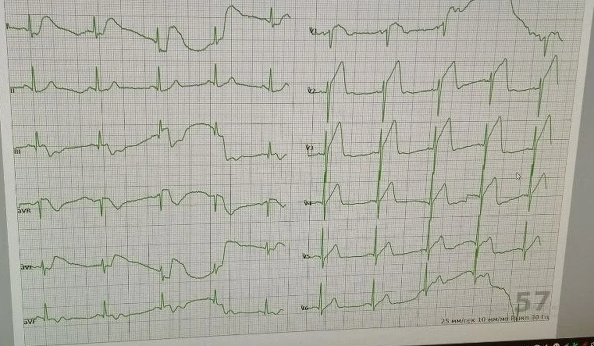

  
ЭКГ

  
Проксимальная окклюзия ПМЖВ

  
Волна Пардэ, aVR против V1 и то, что не является инфарктом правого желудочка

  

  
Реальная плёнка с вызова. Сначала случай и вопросы, затем разбор.

  
Серия «Крещение поворотом» · версия 1.0 · 16 августа 2026 · CC BY-NC-SA 4.0

# Случай

Мужчина, 49 лет. Повод — боль в грудной клетке, потливость. ЭКГ снята в покое, 25 мм/с, 10 мм/мВ. Частота, которую показывает аппарат, — 57 в минуту.

На этой записи двенадцати стандартных отведений. Правые грудные отведения на кадр не попали; бригада сообщила, что V4R снимали и в нём был подъём сегмента ST.

<figure class="ekg">

<figcaption>Рис. 1. ЭКГ в покое. Шапка монитора с идентификаторами срезана. Скорость 25 мм/с, калибровка 10 мм/мВ. Число 57 в правом нижнем углу — частота, которую показывает аппарат.</figcaption>
</figure>

# Вопросы для размышления

Ответы — после теории, в возвращении к случаю.

1. Это ранняя реполяризация, перикардит или трансмуральная ишемия — и по какому признаку сегмента ST это решается за одну секунду?
2. Где большинство подъёмов и что это говорит о сосуде? Как трактовать подъём в aVR относительно подъёма в V1?
3. Почему сохранённый зубец R в V2 не позволяет назвать морфологию «тромбстоуном» — и почему это важно для прогноза реперфузии?
4. Бригада сообщила о подъёме в V4R. Это инфаркт правого желудочка от правой коронарной артерии или другой анатомический вариант — и чем они различаются на этой плёнке?
5. Синусовая брадикардия 57 в минуту при переднем инфаркте: вагус или повреждение проводящей системы? Что из этого следует для атропина и для наружной стимуляции?
6. Что делается до отъезда и чего ждать в дороге?

# Как читать эту плёнку

Систематический проход по записи, без ярлыков.

**Ритм.** Синусовый. Комплексы QRS узкие.

**Интервалы.** Интервал PR удлинён — атриовентрикулярная блокада I степени. При переднем инфаркте это уже сигнал: страдают септальные перфоранты, проводящая система начинает сбоить. Интервал QT не удлинён.

**Зубцы T.** В V2–V3 — высокие, симметричные, с широким основанием: гиперострые. В III — инверсия T: реципрокная к передней территории.

**Сегмент ST.**

- V1: подъём около 5 мм, выпуклый кверху, сегмент сливается с зубцом T — **волна Пардэ** («кошачья спинка»).
- V2: комплекс rS (R около 5 мм), точка J приподнята, сегмент ST восходящий, зубец T высокий.
- V3–V6: подъём продолжается, территория широкая.
- I, aVL: подъём — боковая стенка тоже в зоне.
- aVR: подъём около 1 мм.
- III: сегмент ST у изолинии, зубец T инвертирован.

**Комплекс QRS.** Узкий. Зубцы R в V2–V3 сохранены. Это не морфология «тромбстоуна» (для неё нужен исчезнувший R или QS) и не «акулья плавник» (зубец S здесь чёткий).

**Частота.** Около 57 в минуту — синусовая брадикардия. При переднем инфаркте это не «спокойный ритм».

# Волна Пардэ и то, чем она не является

Выпуклый кверху сегмент ST, сливающийся с зубцом T, — волна Пардэ, признак трансмуральной ишемии. Вогнутый сегмент ST («улыбка») при ранней реполяризации и перикардите выглядит иначе.

Ранняя реполяризация на этой плёнке исключается по четырём независимым признакам:

- подъём сегмента ST в aVR — при ранней реполяризации его не бывает;
- реципрокная инверсия зубца T в III — реципрока при ранней реполяризации нет;
- выпуклая, а не вогнутая форма сегмента ST;
- клиника боли в груди у мужчины 49 лет.

Перикардит даёт диффузный вогнутый подъём и часто депрессию сегмента PR. Реципрокной инверсии зубца T при нём нет. Картина пациента — не перикардит.

Паттерн de Winter требует восходящей депрессии сегмента ST в точке J и высокого зубца T. Здесь сегмент ST поднят, не опущен.

# Проксимальная ПМЖВ, а не ствол левой коронарной артерии

Подъём сегмента ST в aVR при переднем инфаркте означает проксимальное поражение, а не «просто переднюю стенку». Дальше решает сравнение aVR и V1.

По данным Yamaji (2001) и разбору LITFL:

- подъём в aVR, равный подъёму в V1 или превышающий его, чаще указывает на ствол левой коронарной артерии;
- подъём в V1, превышающий подъём в aVR, чаще указывает на проксимальную переднюю межжелудочковую ветвь выше первой септальной;
- острая окклюзия ствола обычно даёт диффузную депрессию сегмента ST в грудных отведениях, а не массивные подъёмы.

| Признак | Этот случай | Ствол ЛКА | Проксимальная ПМЖВ |
|---|---|---|---|
| Подъём aVR | около 1 мм | часто высокий, ≥ V1 | часто есть, меньше V1 |
| Подъём V1 | около 5 мм | малый или отсутствует | типичен |
| aVR против V1 | V1 много больше aVR | aVR ≥ V1 | V1 > aVR |
| Грудные отведения | подъёмы V1–V6 | диффузная депрессия | подъёмы |

Три признака из трёх указывают на **проксимальную ПМЖВ выше первой септальной ветви**. Это не ствол.

Engelen (1999): любой подъём сегмента ST в aVR при переднем инфаркте специфичен примерно на 95 % для окклюзии передней межжелудочковой ветви выше первой септальной.

Проксимальная ПМЖВ выше первой септальной снабжает переднюю стенку левого желудочка, передние две трети межжелудочковой перегородки вместе с системой Гиса, часть боковой стенки и верхушку. Зона — около 40 % массы левого желудочка. Без реперфузии в первые часы падает фракция выброса, развивается кардиогенный шок, желудочковые аритмии, атриовентрикулярная блокада; на 3–7-е сутки — риск разрыва межжелудочковой перегородки.

# Wrap-around LAD и подъём в V4R

У 30–50 % людей передняя межжелудочковая ветвь длиннее обычного: она заворачивает за верхушку и снабжает часть нижней стенки левого желудочка и **верхушку правого желудочка**. Проксимальная окклюзия такой артерии даёт огромную зону: передняя и боковая стенки, перегородка, верхушка правого желудочка и иногда часть нижней стенки.

Подъём в V4R при массивном переднем инфаркте в этой анатомии — вовлечение верхушки правого желудочка через wrap-around, а не классический инфаркт правого желудочка от правой коронарной артерии.

| Признак | Wrap-around LAD | Инфаркт ПЖ от ПКА |
|---|---|---|
| Подъём в нижних (II, III, aVF) | лёгкий или отсутствует | обязателен, ≥ 1 мм |
| Подъём в передних (V2–V6) | массивный | нет или реципрокная депрессия |
| Подъём aVR | часто | нет или небольшая депрессия |
| Подъём V4R | может быть | обязателен, ≥ 1 мм |
| Где большинство подъёмов | в передних | в нижних |

На этой плёнке большинство подъёмов — в передних отведениях. Нижние не дают картины нижнего инфаркта. Значит сосуд — передняя межжелудочковая ветвь, а сообщённый подъём в V4R не переписывает локализацию на правую коронарную артерию.

Изолированный инфаркт правого желудочка без нижнего подъёма сегмента ST — казуистика, менее 1 % всех инфарктов правого желудочка.

Зона некроза при wrap-around больше, чем при обычной проксимальной окклюзии передней межжелудочковой ветви: выше риск кардиогенного шока, фракции выброса ниже 30 % после реперфузии и позднего ремоделирования. Норматив «дверь — баллон» здесь ещё жёстче.

# Брадикардия при переднем инфаркте

При **нижнем** инфаркте брадикардия чаще вагусная и отвечает на атропин.

При **переднем** инфаркте брадикардия — повреждение проводящей системы через септальные перфоранты. Атропин здесь малоэффективен. Нужна готовность к наружной электрокардиостимуляции. Атриовентрикулярная блокада I степени на этой плёнке — тот же сигнал: блок может нарасти за минуты.

# Тромбстоун — это не любой большой подъём

Морфология «тромбстоуна» требует исчезновения зубца R: R меньше 2 мм или комплекс QS. У пациента R в V2 около 5 мм, в V3 зубец R тоже есть. Это более ранняя стадия, чем тромбстоун. Реперфузия ещё имеет смысл. Ярлык «тромбстоун» по одному только размеру подъёма — ошибка прочтения.

# Возвращение к случаю

**Заключение по плёнке.** Острый инфаркт миокарда с подъёмом сегмента ST в бассейне проксимальной передней межжелудочковой ветви выше первой септальной, тип wrap-around: передняя и боковая стенки, верхушка, вовлечение верхушки правого желудочка по сообщению о V4R. Ранняя, гиперострая стадия: зубцы R сохранены, точка J приподнята, зубцы T гиперострые, волна Пардэ в V1. Реципрокная инверсия зубца T в III. Синусовая брадикардия около 57 в минуту. Атриовентрикулярная блокада I степени. Это не ствол левой коронарной артерии, не инфаркт правого желудочка от правой коронарной артерии, не ранняя реполяризация, не перикардит и не тромбстоун.

**Что делается до отъезда.**

| Шаг | Действие | Зачем именно здесь |
|---|---|---|
| 1 | Красная дорожка в центр чрескожного коронарного вмешательства | Зона около 40 % массы левого желудочка; норматив «дверь — баллон» максимально жёсткий |
| 2 | Кислород при SpO₂ ниже 90 % | — |
| 3 | Ацетилсалициловая кислота 250 мг разжевать | По алгоритму ОКС с подъёмом ST |
| 4 | Тикагрелор 180 мг или клопидогрел 600 мг | Двойная антиагрегация |
| 5 | Гепарин натрия внутривенно, болюс 70–100 МЕ/кг | По алгоритму |
| 6 | Два внутривенных доступа не тоньше 18G | Катехоламины в дороге |
| 7 | Электроды дефибриллятора наклеены до отъезда | Риск фибрилляции желудочков выше обычного |
| 8 | Готовность к наружной стимуляции через дефибриллятор | Брадикардия плюс проксимальная ПМЖВ: блок нарастает за минуты; атропин малоэффективен |
| 9 | Нитроглицерин внутривенно при систолическом давлении ≥ 100 мм рт. ст., осторожно | Передний инфаркт: преднагрузка может рухнуть |
| 10 | Морфин 2–4 мг внутривенно дробно при боли ≥ 6 | — |
| 11 | Бета-блокатор не вводить при шоке или брадикардии | — |

Конкретные дозы и выбор второго антиагреганта сверяются с действующим алгоритмом службы на момент вызова.

**Чего ждать в дороге, по приоритету.**

1. Фибрилляция желудочков или желудочковая тахикардия без пульса — дефибрилляция 200 Дж бифазно.
2. Полная атриовентрикулярная блокада или асистолия — наружная стимуляция; атропин не сработает.
3. Кардиогенный шок — норадреналин 0,05–0,5 мкг/кг·мин.
4. Отёк лёгких — положение сидя, нитроглицерин, неинвазивная вентиляция по показаниям.
5. Разрыв межжелудочковой перегородки или свободной стенки — не лечится на догоспитальном этапе; решает скорость доставки.

# Основные выводы

<table>
<colgroup><col class="nomer"><col class="vyvod"></colgroup>
<thead><tr><th>№</th><th>Вывод</th></tr></thead>
<tbody>
<tr><td>1</td><td>Выпуклый сегмент ST, сливающийся с зубцом T, — волна Пардэ, трансмуральная ишемия. Вогнутый сегмент ST — не инфаркт с подъёмом.</td></tr>
<tr><td>2</td><td>При любом переднем подъёме смотреть aVR. aVR больше V1 — думать о стволе. V1 больше aVR — проксимальная ПМЖВ.</td></tr>
<tr><td>3</td><td>Тромбстоун требует исчезновения зубца R. Сохранённый R при большом подъёме — более ранняя стадия, реперфузия ещё имеет смысл.</td></tr>
<tr><td>4</td><td>Подъём в V4R при массивном переднем инфаркте чаще wrap-around LAD, а не инфаркт правого желудочка от правой коронарной артерии. Решает, где большинство подъёмов.</td></tr>
<tr><td>5</td><td>Брадикардия при переднем инфаркте — повреждение проводящей системы, не вагус. Атропин не работает. Готовить наружную стимуляцию.</td></tr>
<tr><td>6</td><td>Реципрокная инверсия зубца T подтверждает ишемию и исключает раннюю реполяризацию и перикардит.</td></tr>
</tbody>
</table>

# Источники иллюстраций

| Файл | Что изображено | Источник |
|---|---|---|
| `ekg_proksimalnaya_pmzhv.png` | Двенадцатиканальная ЭКГ, фото экрана монитора | фото автора, CC BY-NC-SA 4.0. Шапка с идентификаторами срезана |

# Выходные данные

**Материал:** «Проксимальная окклюзия ПМЖВ». Версия 1.0 от 16 августа 2026.

**Серия:** «Крещение поворотом» — клинические разборы догоспитальной практики. Раздел «ЭКГ».

**Лицензия:** текст и фотография — Creative Commons «С указанием авторства — Некоммерческая — С сохранением условий» 4.0 (CC BY-NC-SA 4.0). Копировать, печатать и раздавать коллегам можно свободно, включая печать для подстанции; продавать — нельзя; при переработке сохраняется та же лицензия и указывается источник.

**О фотографии.** Снимок экрана монитора сделан автором. Авторские права на фотографию принадлежат автору. Шапка записи содержала идентификаторы пациента и номер исследования; они срезаны. В тексте нет имени, адреса, номера карты и названия стационара.

**Оговорка.** Материал учебный. Он не является нормативным документом, не заменяет действующие протоколы, клинические рекомендации и распоряжения службы и не может использоваться как единственное основание для клинического решения. Дозы, показания и маршрутизацию проверять по первоисточникам, действующим на момент чтения. Ответственность за решения у постели больного несёт медицинский работник, а не автор материала.

**Нашли ошибку?** Ошибка в дозе, сроке или механизме — не мелочь: материал читают перед сменой. Сообщить можно через раздел Issues репозитория проекта; исправление выходит новой версией, а изменение фиксируется в журнале изменений.
