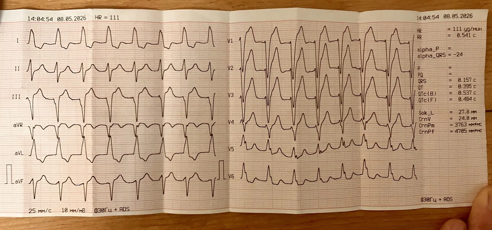
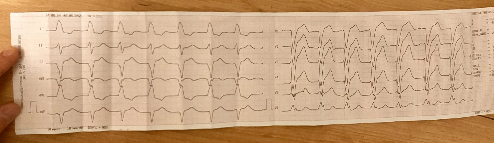

  
ЭКГ

  
Трепетание и аллапинин

  
Регулярный широкий комплекс, класс IC и риск проведения 1:1

  

  
Реальная плёнка с вызова. Сначала случай и вопросы, затем разбор.

  
Серия «Крещение поворотом» · версия 1.1 · 16 августа 2026 · CC BY-NC-SA 4.0

# Случай

Женщина. Повод — «низкое давление». На месте АД 110 мм рт. ст., затем 120 мм рт. ст. Жалоб на гемодинамическую нестабильность нет.

Принимает аллапинин (лаппаконитина гидробромид, антиаритмик класса IC). В день вызова приняла суточную дозу 25 мг.

Две плёнки стандартных отведений: 25 мм/с и 50 мм/с, калибровка 10 мм/мВ. Аппарат: частота 111 в минуту, R–R 0,541 с, QRS 0,157 с, ось QRS −24°, QTc (Bazett) 0,537 с. Зубец P и интервал PQ аппарат не определил.

Дополнительные отведения — Lewis, правые, высокие, 50 мм/с — были записаны и не распечатаны. На Lewis зубцов P не было.

<figure class="ekg">

<figcaption>Рис. 1. Стандартные отведения, 25 мм/с, 10 мм/мВ. Частота, которую показывает аппарат, — 111 в минуту. Фото автора.</figcaption>
</figure>

<figure class="ekg">

<figcaption>Рис. 2. Та же запись, 50 мм/с. На этой скорости комплексы выглядят «крупнее»; морфология и регулярность те же. Фото автора.</figcaption>
</figure>

# Вопросы для размышления

Ответы — в конце материала, после возвращения к случаю.

1. Почему это не фибрилляция предсердий и не синусовая тахикардия с блокадой ножки?
2. Левая ножка или правая — и по каким отведениям это решается? Достаточно ли смотреть только V1?
3. Что делает препарат класса IC с частотой трепетания и почему проведение 1:1 здесь не теория, а рабочий риск?
4. Можно ли добавить пропафенон? Показан ли амиодарон при АД 110–120 мм рт. ст. и частоте 111 в минуту?
5. Что из алгоритма фибрилляции и трепетания (I48) подходит к этой пациентке и что — нет?
6. Зачем отведение Lewis и что значит «на Lewis ничего не видно»?

# Как читать эти плёнки

**Ритм.** Регулярный: интервалы R–R одинаковые, «как метроном». Это сразу исключает фибрилляцию предсердий.

**Зубцы P.** В стандартных отведениях их нет. Между комплексами QRS в нижних отведениях и в V1 есть подозрение на пилообразную базовую линию, но волны F частично скрыты широким QRS и реполяризацией. На Lewis синусовой активности тоже не было.

**Комплекс QRS.** 0,157 с — широкий. V1 преимущественно отрицательный (QS или rS). V5–V6 — широкие монофазные зубцы R без зубца S. Это полная блокада левой ножки пучка Гиса. Ось −24° — левограмма; при блокаде левой ножки это часть самой блокады, а не отдельный блок передней ветви.

**Сегмент ST.** Дискордантен комплексу QRS: ожидаемая картина при блокаде левой ножки. На скорости 50 мм/с дискордантность выглядит драматичнее. Это не повод переименовать запись в инфаркт с подъёмом сегмента ST.

**Частота.** 111 в минуту. При трепетании с проведением 2:1 желудочковая частота обычно около 150. Здесь она ниже, потому что аллапинин замедлил предсердный цикл.

# Нет P плюс регулярный R–R — это трепетание

Фибрилляция предсердий даёт нерегулярные R–R. Здесь R–R фиксированы. Значит проведение из предсердий на желудочки идёт с постоянным коэффициентом.

Синусовая тахикардия требует зубца P перед каждым QRS. Зубцов P нет ни в стандартных отведениях, ни в Lewis.

Остаётся трепетание предсердий с фиксированным проведением. Расчёт: класс IC замедляет предсердную частоту примерно до 220–250 в минуту; проведение 2:1 даёт желудочковую частоту 110–125. Это совпадает с 111.

# V5–V6 решают, какая ножка

V1 в изоляции путает. При блокаде левой ножки V1 отрицательный; при блокаде правой — в V1 часто rsR′. Решающие отведения — левые грудные: широкие монофазные R без S в V5–V6 означают левую ножку. QRS 0,157 с это подтверждает.

# Класс IC и проведение 1:1

Аллапинин — лаппаконитина гидробромид, класс IC: блокирует натриевый канал, замедляет проведение в предсердии. Предсердный цикл трепетания удлиняется. Атриовентрикулярный узел, который не проводил каждую волну F при частоте 300, при частоте 220–250 «успевает». Проведение становится 1:1. Желудочки получают полную предсердную частоту — 200 и выше. Гемодинамика может рухнуть за минуты.

Возможно, аллапинин это трепетание и спровоцировал: класс IC умеет организовать фибрилляцию в трепетание, а затем открыть проведение 1:1.

Отсюда запрет: второй препарат класса IC (пропафенон) не добавляют. Два препарата одного класса на этой плёнке — путь к 1:1.

# Что подходит из алгоритма I48

Алгоритм фибрилляции и трепетания начинается с вопроса о давности. Давность здесь не уточнена.

При давности больше 48 часов или неуточнённой, без гипотонии и без застойной сердечной недостаточности, задача догоспитального этапа — урежение частоты, а не кардиоверсия. Метопролол 12,5–25 мг внутрь или 5–15 мг внутривенно — по алгоритму Москвы 2025. На вызове выбран метопролол. АД 110–120 мм рт. ст., частота 111 в минуту, жалоб на нестабильность нет.

Что не подходит:

- пропафенон — класс IC, и QRS уже 0,157 с (в алгоритме пропафенон указан при QRS меньше 0,12 с);
- амиодарон как эскалация при стабильной гемодинамике и частоте 111 — избыточен;
- электрическая кардиоверсия — нет гипотонии, нет отёка лёгких, нет затяжного ангинозного приступа.

Гепарин до попытки восстановить ритм обязателен, если ритм собираются восстанавливать, а антикоагулянт пациентка не принимает. Здесь ритм не восстанавливали.

Впервые выявленный пароксизм — показание к госпитализации, даже если стало легче. Пересмотр аллапинина и вопрос об абляции — уже стационар и плановая кардиология.

# Отведение Lewis

Цель — усилить предсердную активность, когда на стандартных отведениях зубцы P или волны F не читаются.

Техника: электрод правой руки — на рукоятку грудины у правого края; электрод левой руки — в четвёртое–пятое межреберье справа от грудины; смотрят отведение I. Это не отведения Fontaine: те ищут эпсилон-волну при аритмогенной кардиомиопатии правого желудочка.

«Ничего не видно» на Lewis — тоже данные: синусовой активности нет, предсердия не в синусовом ритме. Запись, которую не распечатали, для передачи в стационар не существует. Копию печатают всегда.

# Возвращение к случаю

**Заключение по плёнке.** Трепетание предсердий с проведением 2:1: предсердная частота около 220–250 в минуту, замедленная аллапинином; желудочковая частота 111 в минуту. Полная блокада левой ножки пучка Гиса, QRS 0,157 с. Гемодинамика стабильна. Это не фибрилляция предсердий и не синусовая тахикардия.

**Что сделано верно.** Метопролол для урежения частоты. Пропафенон не вводили. Амиодарон не эскалировали. Пациентке нужна плановая кардиология: отмена или замена аллапинина, вопрос об абляции.

**Чего ждать, пока она на аллапинине.** Срыв проведения 2:1 в 1:1 — частота желудочков 200 и выше, коллапс. Монитор до передачи. Электроды дефибриллятора имеют смысл не потому, что сейчас нестабильно, а потому что класс IC этот сценарий умеет открыть.

# Ответы на вопросы для размышления

**1.** Фибрилляция предсердий даёт нерегулярные интервалы R–R. Здесь R–R одинаковые, 0,541 с. Синусовая тахикардия требует зубца P перед каждым QRS; зубцов P нет ни в стандартных отведениях, ни в Lewis. Остаётся трепетание с фиксированным проведением. Предсердная частота при классе IC около 220–250 в минуту, проведение 2:1 даёт желудочковую частоту 110–125 — это совпадает с 111.

**2.** Левая. V1 преимущественно отрицательный (QS или rS); V5–V6 — широкие монофазные зубцы R без зубца S; QRS 0,157 с. Одного V1 недостаточно: в изоляции он путает с правой ножкой. Решают левые грудные.

**3.** Класс IC блокирует натриевый канал и замедляет проведение в предсердии. Цикл трепетания удлиняется, атриовентрикулярный узел начинает проводить каждую волну F. Проведение 1:1 даёт частоту желудочков 200 и выше. Пациентка уже на аллапинине; этот риск у неё рабочий, а не учебный.

**4.** Пропафенон нельзя: это второй препарат класса IC, и QRS уже 0,157 с (в алгоритме пропафенон указан при QRS меньше 0,12 с). Амиодарон при АД 110–120 мм рт. ст. и частоте 111 в минуту не показан — это эскалация без нестабильности.

**5.** Давность не уточнена, гипотонии и застойной сердечной недостаточности нет — подходит урежение частоты: метопролол 12,5–25 мг внутрь или 5–15 мг внутривенно. Не подходят пропафенон, амиодарон «на всякий случай» и электрическая кардиоверсия. Гепарин обязателен только если ритм собираются восстанавливать. Впервые выявленный пароксизм — госпитализация.

**6.** Lewis усиливает предсердную активность, когда на стандартных отведениях зубцы P или волны F не читаются: правая рука на рукоятку грудины у правого края, левая — в четвёртое–пятое межреберье справа от грудины, смотрят отведение I. «Ничего не видно» означает, что синусовой активности нет. Нераспечатанная запись для стационара не существует.

# Основные выводы

<table>
<colgroup><col class="nomer"><col class="vyvod"></colgroup>
<thead><tr><th>№</th><th>Вывод</th></tr></thead>
<tbody>
<tr><td>1</td><td>Нет зубца P и регулярный R–R — трепетание с фиксированным проведением, не фибрилляция.</td></tr>
<tr><td>2</td><td>V5–V6 решают, какая ножка. Широкие монофазные R без S — левая. V1 в изоляции путает.</td></tr>
<tr><td>3</td><td>Класс IC плюс трепетание — риск проведения 1:1. Второй IC не добавляют.</td></tr>
<tr><td>4</td><td>Стабильное давление и частота около 110 — урежение, не кардиоверсия и не амиодарон «на всякий случай».</td></tr>
<tr><td>5</td><td>На Lewis отсутствие зубца P — данные. Нераспечатанная запись для стационара не существует.</td></tr>
<tr><td>6</td><td>Дискордантный сегмент ST при блокаде левой ножки на скорости 50 мм/с выглядит крупнее. Это не инфаркт с подъёмом, пока не доказано иное.</td></tr>
</tbody>
</table>

# Источники иллюстраций

| Файл | Что изображено | Источник |
|---|---|---|
| `ekg_25.png` | Стандартные отведения, 25 мм/с | фото автора, CC BY-NC-SA 4.0 |
| `ekg_50.png` | Та же запись, 50 мм/с | фото автора, CC BY-NC-SA 4.0 |

# Выходные данные

**Материал:** «Трепетание и аллапинин». Версия 1.1 от 16 августа 2026. Добавлены нумерованные ответы на шесть вопросов.

**Серия:** «Крещение поворотом» — клинические разборы догоспитальной практики. Раздел «ЭКГ».

**Лицензия:** текст и фотографии — Creative Commons «С указанием авторства — Некоммерческая — С сохранением условий» 4.0 (CC BY-NC-SA 4.0). Копировать, печатать и раздавать коллегам можно свободно, включая печать для подстанции; продавать — нельзя; при переработке сохраняется та же лицензия и указывается источник.

**О фотографиях.** Снимки бумажных плёнок сделаны автором. Авторские права на фотографии принадлежат автору. В тексте нет имени, адреса, номера карты и названия стационара.

**Оговорка.** Материал учебный. Он не является нормативным документом, не заменяет действующие протоколы, клинические рекомендации и распоряжения службы и не может использоваться как единственное основание для клинического решения. Дозы, показания и маршрутизацию проверять по первоисточникам, действующим на момент чтения. Ответственность за решения у постели больного несёт медицинский работник, а не автор материала.

**Нашли ошибку?** Ошибка в дозе, сроке или механизме — не мелочь: материал читают перед сменой. Сообщить можно через раздел Issues репозитория проекта; исправление выходит новой версией, а изменение фиксируется в журнале изменений.
