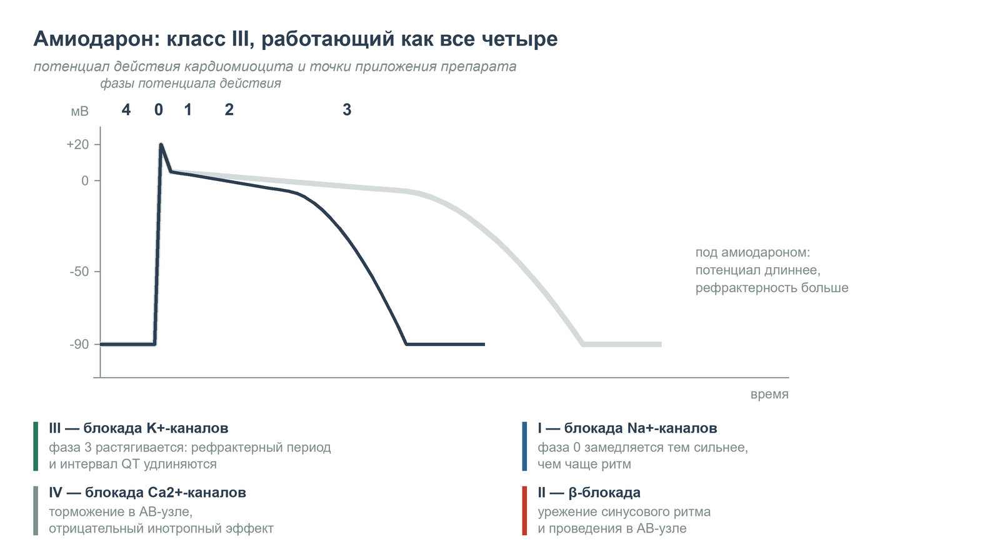

  
Фармакология укладки

  
Амиодарон

  
Антиаритмик с четырьмя механизмами действия, единственным допустимым растворителем и ограниченными доказательствами эффективности при остановке сердца

  

  
Разбор препарата от механизма к дозе. Дозы приведены в соответствии с приказом Департамента здравоохранения г. Москвы № 535 от 18.05.2023.

  
Серия «Крещение поворотом» · версия 1.1 · 24 августа 2026 · CC BY-NC-SA 4.0

# Что находится в ампуле

Амиодарон 5 % — раствор объёмом 3 мл содержит **150 мг** действующего вещества (**50 мг/мл**) (Алгоритмы, приложение 44, внутренняя страница 431). Две ампулы (6 мл) составляют 300 мг, три ампулы (9 мл) — 450 мг.

Помимо самого антиаритмика состав включает **полисорбат 80** и **бензиловый спирт**. Эти сорастворители обладают собственными клиническими эффектами и во многом определяют профиль побочных реакций при внутривенном введении. Молекула также содержит йод (около 56 мг на ампулу 150 мг) — это часть структуры и основа тиреоидной токсичности препарата.

# Класс III, который объединяет все четыре класса

Согласно классификации Вогана — Уильямса, амиодарон относится к блокаторам калиевых каналов (III класс). Функционально он обладает свойствами всех четырёх классов одновременно, что объясняет как терапевтическую широту, так и спектр нежелательных явлений.

| Класс | Мишень | Клиническое следствие |
|---|---|---|
| III | калиевые каналы фазы 3 реполяризации | удлинение потенциала действия, рефрактерного периода и интервала QT |
| I | быстрые натриевые каналы (преимущественно в инактивированном состоянии) | замедление проведения, зависящее от частоты: сильнее при тахикардии, слабее в покое |
| II | β-адренорецепторы (неконкурентная блокада) | отрицательный хронотропный эффект, замедление проведения через предсердно-желудочковый узел |
| IV | медленные кальциевые каналы | дополнительное замедление АВ-узла, отрицательный инотропный эффект |

<figure class="fragment">

<figcaption>Рис. 1. Потенциал действия кардиомиоцита и точки приложения амиодарона. Тёмная кривая — исходный потенциал, светлая — удлинённый под действием препарата. Основное действие приходится на фазу 3: блокада выхода калия растягивает реполяризацию, отсюда удлинение рефрактерного периода и интервала QT. Остальные три класса действия объясняют брадикардию и гипотензию при сочетании с β-блокаторами и верапамилом.</figcaption>
</figure>

Дополнительно отмечается вазодилатация коронарных и периферических артерий (в значительной мере за счёт полисорбата 80 при внутривенном пути) и удлинение рефрактерного периода дополнительных путей проведения.

Одновременное воздействие на узел, проводимость и рефрактерность делает препарат применимым при желудочковых и наджелудочковых тахикардиях. То же свойство диктует осторожность при сочетании с β-блокаторами и верапамилом: суммация даёт брадикардию и гипотензию.

# Фармакокинетика: почему это препарат-долгожитель

Три параметра определяют тактику:

- **объём распределения** — около 60 л/кг (для пациента массой 70 кг это более 4000 литров). Препарат стремительно покидает кровь, депонируясь в жировой ткани, миокарде, печени и лёгких;
- **связывание с белками плазмы** — более 96 %;
- **период полувыведения** — 40–55 суток при длительном приёме (до 100 суток у отдельных пациентов); активный метаболит дезэтиламиодарон живёт ещё дольше.

Клинические следствия:

- при пероральном приёме эффект развивается днями и неделями; при внутривенном — минуты (за счёт перераспределения, а не насыщения тканей);
- пациент, прекративший приём месяц назад, остаётся под влиянием препарата. Это учитывают при оценке удлинённого QT или брадиаритмий;
- тканевые побочные эффекты сохраняются месяцами после отмены.

# Растворитель: только декстроза 5 %

Амиодарон физически несовместим с 0,9 % натрия хлоридом. Смешивание вызывает выпадение осадка. Последствия: недополучение дозы, химическое раздражение вены и риск эмболии микрочастицами.

- **Недопустимо разведение ниже 0,6 мг/мл.** Концентрации ниже этой величины нестабильны. Стандартное разведение для инфузии — 150 мг (3 мл) на 250 мл декстрозы 5 %, что и даёт 0,6 мг/мл. Менее двух ампул на 500 мл декстрозы применять нельзя.
- **Полисорбат 80 искажает размер капли.** При использовании обычных гравитационных систем погрешность может достигать 30 % недостающей дозы. Инфузию вводят волюметрическим насосом или шприцевым дозатором.
- **Адсорбция на ПВХ.** Полисорбат вымывает пластификаторы из поливинилхлоридных систем. Для длительных инфузий требуется отдельная линия.

> **Красная строка.** Амиодарон вводится исключительно в растворе декстрозы 5 %. Использование натрия хлорида 0,9 % недопустимо, кроме болюсного введения неразведённым препаратом в ходе реанимации с последующей промывкой линии.

# Дозирование по Алгоритмам ДЗМ: взрослые

Основание: приказ ДЗМ г. Москвы № 535 от 18.05.2023. Страницы — по внутренней нумерации.

| Ситуация | Доза и скорость | Внутр. стр. |
|---|---|---|
| Фибрилляция желудочков / желудочковая тахикардия без пульса (после третьего разряда) | **300 мг (6 мл)** в/в струйно одновременно с эпинефрином 1 мг; альтернатива — лидокаин 100 мг | 11 |
| Повторно при сохраняющейся аритмии | **150 мг (3 мл)** в/в однократно; альтернатива — лидокаин 50 мг | 12 |
| Тахикардия с широким комплексом, стабильная гемодинамика | **150–300 мг (3–6 мл)** в декстрозе 5 % до 20 мл, в/в струйно | 42 |
| Тахикардия с широким комплексом, нестабильная гемодинамика | **150 мг (3 мл)** в 250 мл декстрозы 5 % капельно фоном вместе с синхронизированной кардиоверсией 50 → 200 Дж | 43 |
| Тахикардия с узким комплексом при хронической сердечной недостаточности | **300–450 мг (6–9 мл)** в 250 мл декстрозы 5 % капельно | 42 |
| Фибрилляция или трепетание предсердий < 48 ч (противопоказания к пропафенону и прокаинамиду) | **5 мг/кг** (максимум 450 мг, 9 мл) в 250 мл декстрозы 5 % капельно; ожидание эффекта не более 20 минут | 43 |
| Тахисистолия при фибрилляции предсердий на фоне застойной ХСН без гипотонии | **300–450 мг (6–9 мл)** в декстрозе 5 % до 20 мл через шприцевой насос за 20 минут | 44 |

При фибрилляции предсердий амиодарон — резервный препарат. Он применяется либо при противопоказаниях к пропафенону и прокаинамиду, либо при сердечной недостаточности, где препараты класса IC опасны из-за отрицательного инотропного эффекта. При тахикардии с узким комплексом амиодарон появляется только в связке с сердечной недостаточностью — там, где верапамил и β-блокаторы противопоказаны.

Скорость введения различается принципиально: реанимационный болюс быстрый; вне остановки те же 300 мг вводят за 20 минут во избежание коллапса.

# Дозирование по Алгоритмам ДЗМ: дети

| Ситуация | Доза | Внутр. стр. |
|---|---|---|
| Тахисистолические нарушения ритма при отсутствии эффекта через 20 минут или при манифестном синдроме WPW | **5 мг/кг (0,1 мл/кг)** в/в капельно не менее 30 минут или через шприцевой дозатор | 186 |
| Тахикардия с широким комплексом после неэффективной кардиоверсии 2 Дж/кг | **5 мг/кг (0,1 мл/кг)** в/в капельно не менее 30 минут; альтернатива — прокаинамид 15 мг/кг | 187 |
| Разведение для шприцевого дозатора (приложение 40) | 150 мг (3 мл) в 47 мл декстрозы 5 % = 50 мл (**3 мг/мл**); таблица скоростей на 5, 10 и 15 мкг/кг/мин | 426 |

**Осторожность у новорождённых.** Бензиловый спирт в составе (22,2 мг в 1 мл) связан с «gasping syndrome». Новорождённые и недоношенные относятся к противопоказаниям, за исключением жизнеугрожающих аритмий, устойчивых к другим средствам.

# Эффективность при остановке сердца

Применение амиодарона десятилетиями считалось стандартом, однако данные о влиянии на выживаемость до выписки неоднозначны.

**ARREST (1999)** и **ALIVE (2002)** показали повышение выживаемости до момента госпитализации, но не повлияли на выписку из стационара.

**ALPS** (Kudenchuk et al., *New England Journal of Medicine*, 2016) — крупнейшее исследование: 3026 пациентов. Выживаемость до выписки составила 24,4 % (амиодарон), 23,7 % (лидокаин) и 21,0 % (плацебо). Разница амиодарон против плацебо — 3,2 процентных пункта (95 % ДИ от −0,4 до 7,0; p = 0,08) и статистической значимости не достигла. Неврологические исходы при выписке были сходны (18,8 %, 17,5 %, 16,6 %).

Два следствия ALPS:

- антиаритмики повышали выживаемость преимущественно при остановке на глазах свидетелей (где ещё есть что спасать);
- в группе амиодарона чаще требовалась временная электрокардиостимуляция из-за подавления автоматизма.

Амиодарон включён в алгоритмы ERC, AHA и ДЗМ как средство повышения шансов доставки живого пациента. Качество компрессий, минимизация пауз и своевременный разряд имеют несопоставимо больший вес. Препарат не выигрывает реанимацию — его вводят параллельно с действиями, которые её выигрывают.

# Побочные эффекты внутривенного введения

**Гипотензия** (около 16 % случаев) — результат вазодилатации от полисорбата 80 и отрицательного инотропного действия. Прямо зависит от скорости введения.

**Брадикардия и блокады** — суммация β-блокирующего и кальций-блокирующего компонентов. Опасны при сочетании с другими препаратами этих групп и при исходной дисфункции синусового узла.

**Удлинение QT** — ожидаемый эффект основного механизма. Torsades de pointes возникают редко (< 1 %) благодаря относительно однородному действию на реполяризацию, но требуют контроля калия и магния.

**Флебит** — концентрация для периферических вен не выше порядка 2 мг/мл; для длительных инфузий предпочтителен центральный доступ.

Отложенные эффекты: тиреоидная дисфункция в обе стороны (следствие йодной нагрузки), лёгочный фиброз, гепатотоксичность, отложения в роговице и синеватая пигментация кожи.

# Лекарственные взаимодействия

| Группа препаратов | Результат взаимодействия |
|---|---|
| β-блокаторы, верапамил, дилтиазем | суммация угнетающего действия: тяжёлая брадикардия, АВ-блокада, гипотензия |
| Препараты, удлиняющие QT (макролиды, антипсихотики, фторхинолоны, антидепрессанты) | риск torsades de pointes; инструкция относит такое сочетание к противопоказаниям |
| Дигоксин | увеличение концентрации дигоксина примерно вдвое |
| Варфарин | усиление антикоагуляции, рост МНО |
| Симвастатин и другие статины | рост концентрации статина, риск рабдомиолиза |
| Гипокалиемия / гипомагниемия | потенцирование проаритмогенного действия |

# Особые ситуации

## Фибрилляция предсердий с синдромом WPW

При проведении возбуждения по дополнительному пути замедление АВ-узла может увеличить долю импульсов, идущих по быстрому пути, вплоть до фибрилляции желудочков. Международные рекомендации относят внутривенный амиодарон к потенциально опасным препаратам в этой ситуации. Предпочтительны прокаинамид или немедленная кардиоверсия.

Систематический обзор 2026 года (*Circulation: Arrhythmia and Electrophysiology*) оценил риск ускорения ритма или фибрилляции желудочков как низкий (0,12–0,68 %) и подчеркнул необходимость готовности к дефибрилляции. Широкая нерегулярная тахикардия с меняющейся формой комплексов — ситуация, где приоритет отдаётся кардиоверсии, а не подбору антиаритмика.

> **Расхождение РФ ↔ международная практика.** Детский раздел Алгоритмов ДЗМ предписывает амиодарон 5 мг/кг при манифестном WPW (внутренняя страница 186) — речь идёт о суправентрикулярной тахикардии, а не о фибрилляции предсердий с предвозбуждением. Для предвозбуждённой фибрилляции предсердий международные рекомендации амиодарон не поддерживают.

## Полиморфная желудочковая тахикардия типа «пируэт»

Препарат противопоказан: сам удлиняет интервал QT. Лечение начинается с магния сульфата; далее — коррекция электролитов, отмена виновного препарата, при нестабильности — дефибрилляция.

# Чего нельзя делать

- Использовать натрия хлорид в качестве растворителя.
- Вводить болюсом пациентам вне клинической смерти (риск тяжёлой гипотензии).
- Рассчитывать дозу капельным методом вместо насоса (полисорбат искажает объём капли).
- Комбинировать с верапамилом и β-блокаторами без готовности к брадикардии и гипотензии.
- Применять при пируэтной тахикардии (там работает магния сульфат).
- Прерывать компрессии грудной клетки ради введения препарата.
- Считать амиодарон, отменённый месяц назад, уже не действующим.
- Смешивать в одном шприце и в одной линии с другими препаратами; линию промывать декстрозой.

# Сверка доз

| Параметр | Значение | Источник |
|---|---|---|
| Содержание в ампуле | 5 % — 3 мл: 150 мг (50 мг/мл) | Алгоритмы, приложение 44, стр. 431 |
| Реанимация (желудочковая тахикардия / фибрилляция желудочков без пульса) | 300 мг (6 мл), затем 150 мг (3 мл) однократно | Алгоритмы, стр. 11–12 |
| Стабильная ширококомплексная тахикардия | 150–300 мг (3–6 мл) струйно в декстрозе 5 % до 20 мл | Алгоритмы, стр. 42 |
| Нестабильная ширококомплексная тахикардия | 150 мг в 250 мл декстрозы 5 % капельно | Алгоритмы, стр. 43 |
| Фибрилляция предсердий < 48 ч | 5 мг/кг (макс. 450 мг) в 250 мл декстрозы 5 % | Алгоритмы, стр. 43 |
| Дети | 5 мг/кг (0,1 мл/кг) капельно не менее 30 мин | Алгоритмы, стр. 186–187 |
| Разведение для дозатора у детей | 150 мг в 47 мл декстрозы 5 % = 3 мг/мл | Алгоритмы, приложение 40, стр. 426 |
| Минимальная стабильная концентрация | не ниже 0,6 мг/мл | инструкция производителя |

# Источники

- Алгоритмы оказания скорой и неотложной медицинской помощи. Приказ ДЗМ г. Москвы № 535 от 18.05.2023 — разделы «Анестезиология и реаниматология», «Кардиология», «Детская кардиология», приложения 40 и 44.
- Amiodarone Hydrochloride 50 mg/ml Concentrate for Solution for Injection/Infusion — Summary of Product Characteristics: несовместимость с солевым раствором, нестабильность разведений ниже 0,6 мг/мл, полисорбат 80 и размер капли, бензиловый спирт и «gasping syndrome», содержание йода.
- Kudenchuk P. J., Brown S. P., Daya M. et al. Amiodarone, lidocaine, or placebo in out-of-hospital cardiac arrest. *New England Journal of Medicine*, 2016; 374(18): 1711–1722 (ALPS).
- Kudenchuk P. J., Cobb L. A., Copass M. K. et al. Amiodarone for resuscitation after out-of-hospital cardiac arrest due to ventricular fibrillation. *New England Journal of Medicine*, 1999; 341: 871–878 (ARREST).
- Dorian P., Cass D., Schwartz B. et al. Amiodarone as compared with lidocaine for shock-resistant ventricular fibrillation. *New England Journal of Medicine*, 2002; 346: 884–890 (ALIVE).
- Intravenous amiodarone in preexcited atrial fibrillation: a systematic review. *Circulation: Arrhythmia and Electrophysiology*, 2026 — оценка риска фибрилляции желудочков.
- Panchal A. R. et al. Adult advanced cardiovascular life support: American Heart Association guidelines; European Resuscitation Council Guidelines 2021: Adult advanced life support — место антиаритмиков в алгоритме.
- Vaughan Williams E. M. Classification of antiarrhythmic drugs.

# Выходные данные

**Материал:** «Амиодарон». Версия 1.1 от 24 августа 2026.

**Серия:** «Крещение поворотом» — клинические разборы догоспитальной практики. Раздел «Фармакология укладки».

**Лицензия:** текст — Creative Commons «С указанием авторства — Некоммерческая — С сохранением условий» 4.0 (CC BY-NC-SA 4.0). Копировать, печатать и раздавать коллегам можно свободно; продавать — нельзя.

**Оговорка.** Материал носит учебный характер. Он не является нормативным документом, не заменяет действующие протоколы, клинические рекомендации и распоряжения службы и не может использоваться как единственное основание для клинического решения. Дозы, показания и маршрутизацию необходимо проверять по действующим первоисточникам. Ответственность за клинические решения несёт медицинский работник, а не автор материала.

**О клинических случаях.** Случаи обезличены: нет имён, дат вызовов, адресов, номеров карт вызова, названий стационаров, бытовые детали изменены. Совпадения с чужой практикой возможны и неизбежны.

**Нашли ошибку?** Сообщить можно через раздел Issues репозитория проекта; исправление выходит новой версией, а изменение фиксируется в журнале изменений.
