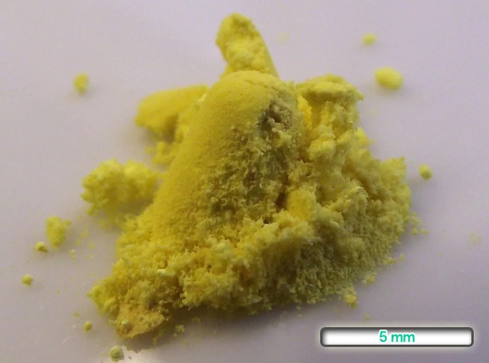

  
Фармакология укладки

  
Нифедипин

  
Блокатор кальциевых каналов, который снижает давление и сохраняет беременность одним и тем же механизмом — и как его испугалась та, кому он был нужен больше всего

  

  
Разбор препарата от механизма к клинике. Дозы приведены в соответствии с приказом Департамента здравоохранения г. Москвы № 535 от 18.05.2023 (раздел 9 — акушерство). Кратко — метилдопа (Допегит).

  
Серия «Крещение поворотом» · версия 1.1 · 2 сентября 2026 · CC BY-NC-SA 4.0

Нифедипин — производное 1,4-дигидропиридина, первый препарат этого ряда, внедрённый в клиническую практику. В акушерстве применяется в двух качествах: как антигипертензивное средство при тяжёлой преэклампсии и как токолитик при угрозе преждевременных родов. Отношение к нему, правда, бывает разным...

> **Слово бригаде:** «Беременная, вся в слезах, от нифедипина наотрез отказалась. У кого-то из её знакомых после нифедипина прервалась беременность на 28-й неделе: "Нет! Только не этот препарат!" Взывать к логике было бесполезно. Катетер, магнезия. Повезло — давление снизилось. А могла бы магнезия и не сработать. Ну или, скажем так, сработать непредсказуемо. И грустно: нифедипин-то обладает токолитической активностью — он беременность *сохраняет*, а ему тут приписали свойства прям как у мизопростола.» — *Ю.Н.*

# История создания

Концепция кальциевого антагонизма сформулирована A. Fleckenstein. В 1964 году им было показано, что верапамил и прениламин воспроизводят на миокарде эффекты удаления кальция из среды: снижают кальций-зависимую утилизацию высокоэнергетических фосфатов, силу сокращения и потребление кислорода, не влияя при этом на натрий-зависимые параметры потенциала действия. Эффекты устранялись повышением концентрации кальция, катехоламинами и сердечными гликозидами, что отличало их от β-адреноблокады. Термин «кальциевый антагонист» введён в 1969 году.

Синтез 1,4-дигидропиридинов проводился в Bayer AG (Вупперталь) группой F. Bossert и W. Vater; первый патент относится к 1964 году, фармакологические свойства класса опубликованы в 1971 году (Bossert, Vater, *Naturwissenschaften*). Нифедипин, разрабатывавшийся под лабораторным обозначением **BAY a 1040**, представляет собой диметиловый эфир 4-(2′-нитрофенил)-2,6-диметил-1,4-дигидропиридин-3,5-дикарбоновой кислоты; его фармакология описана в 1972 году (Vater et al., *Arzneimittelforschung*). В том же году G. Grün и A. Fleckenstein показали, что коронародилатирующее действие препарата реализуется через электромеханическое разобщение гладкой мускулатуры.

<figure class="fragment">

<figcaption>Рис. 1. Структурная формула нифедипина. Центральное ядро — 1,4-дигидропиридин; в положении 4 расположен 2-нитрофенильный радикал, в положениях 3 и 5 — метоксикарбонильные группы, в положениях 2 и 6 — метильные. Симметрия молекулы относительно положения 4 определяется способом синтеза.</figcaption>
</figure>

Молекула получается по реакции Ганча (Hantzsch, 1882): конденсацией 2-нитробензальдегида с двумя эквивалентами метилацетоацетата в присутствии аммиака. Этим объясняется симметричное строение — дигидропиридиновое ядро несёт две одинаковые метоксикарбонильные и две метильные группы, а арильный радикал в положении 4 происходит из альдегида.

<figure class="fragment">

<figcaption>Рис. 2. Субстанция нифедипина — кристаллический порошок жёлтого цвета. Окраска и светочувствительность обусловлены нитрофенильным радикалом: под действием света происходит внутримолекулярное окислительно-восстановительное превращение с образованием нитрозофенилпиридина, лишённого фармакологической активности. Этим определяются требования к светозащитной упаковке.</figcaption>
</figure>

Клиническое применение под торговым наименованием Adalat началось в середине 1970-х годов; в США препарат одобрен в 1981 году по показанию «стенокардия». Токолитическое действие впервые описано в 1980 году (Ulmsten, Andersson, Wingerup, *Archives of Gynecology*), что на два десятилетия предшествовало включению нифедипина в акушерские руководства.

# Что находится в упаковке

В укладке бригады находятся таблетки нифедипина **10 мг** немодифицированного высвобождения (immediate-release). Торговые наименования: Коринфар, Кордафлекс, Нифекард, Фенигидин.

Формы пролонгированного действия (ретард, 20–60 мг: Коринфар ретард, Нифекард ХЛ, Кордипин ХЛ) предназначены для планового лечения хронической артериальной гипертензии; на догоспитальном этапе при остром подъёме артериального давления не применяются вследствие отсроченного начала действия.

Внутри группы блокаторов кальциевых каналов нифедипин принадлежит к дигидропиридиновому ряду (вместе с амлодипином, никардипином, нимодипином), действующему преимущественно на гладкую мускулатуру сосудов. Недигидропиридиновые производные — верапамил (фенилалкиламин) и дилтиазем (бензотиазепин) — действуют преимущественно на проводящую систему сердца.

# Механизм действия

Нифедипин — селективный блокатор потенциал-зависимых кальциевых каналов **L-типа** (long-lasting). Связывание происходит с дигидропиридиновым участком α₁-субъединицы канала (Ca_v1.2). Блокада уменьшает трансмембранный вход ионов Ca²⁺ в гладкомышечную клетку, вследствие чего не активируется комплекс кальмодулин — киназа лёгких цепей миозина, и сокращение не реализуется. Каналы L-типа экспрессируются в гладкой мускулатуре как сосудов, так и миометрия; этим определяются два клинически используемых эффекта препарата.

## Действие на артериолы

Расслабление гладкой мускулатуры артериол снижает общее периферическое сопротивление сосудов и, следовательно, артериальное давление. Влияние на венозное русло минимально: преднагрузка существенно не изменяется, что отличает нифедипин от нитратов.

## Действие на миометрий

Блокада входа кальция прерывает конечный общий путь сокращения гладкомышечной клетки независимо от инициирующего стимула — окситоцина, простагландинов или механического растяжения. Экспрессия каналов L-типа и чувствительность миометрия к утеротоническим влияниям нарастают в третьем триместре, что определяет эффективность препарата именно в этот период. Результатом является токолитическое действие: снижение частоты и амплитуды сокращений матки.

**Данные об эффективности токолиза.** Систематический обзор Кокрейновского сотрудничества (Flenady et al., 2014; 38 рандомизированных исследований, 3550 женщин) сравнивал блокаторы кальциевых каналов, преимущественно нифедипин, с β-адреномиметиками (ритодрин, тербуталин, гексопреналин) при угрозе преждевременных родов. Получены следующие результаты: пролонгирование беременности на 48 часов превосходит отсутствие токолитической терапии и сопоставимо с β-адреномиметиками; частота нежелательных реакций у матери (тахикардия, тремор, гипергликемия, отёк лёгких) ниже, чем при применении β-адреномиметиков; частота респираторного дистресс-синдрома новорождённых ниже (ОР 0,63; 95 % ДИ 0,46–0,88), как и частота некротизирующего энтероколита и госпитализации в отделение реанимации новорождённых. Клиническое значение 48-часовой отсрочки состоит в обеспечении времени для проведения курса антенатальной профилактики респираторного дистресс-синдрома и для транспортировки в перинатальный центр соответствующего уровня.

> **Регуляторный нюанс.** В Российской Федерации нифедипин не зарегистрирован в качестве токолитического средства. Применение с этой целью относится к назначению off-label и требует оформления информированного согласия; решение принимается на уровне стационара.

## Рефлекторная тахикардия

Снижение общего периферического сопротивления активирует барорецепторный рефлекс, следствием которого является компенсаторное увеличение частоты сердечных сокращений. В отличие от урапидила, обладающего центральным компонентом действия (агонизм в отношении 5-HT_1A-рецепторов), нифедипин этот рефлекс не подавляет. Прирост частоты при дозе 10 мг составляет в среднем 10–15 уд/мин.

## Фармакокинетика

| Параметр | Значение |
|---|---|
| Биодоступность при приёме внутрь | 45–68 % (эффект первого прохождения) |
| Начало действия (форма немедленного высвобождения) | 10–20 минут |
| Время достижения максимальной концентрации | 30–60 минут |
| Период полувыведения | 2–5 часов |
| Связывание с белками плазмы | 92–98 % |
| Метаболизм | печёночный, изофермент CYP3A4 |
| Выведение | почечное, до 80 % в виде неактивных метаболитов |

Препарат проникает через плаценту и определяется в грудном молоке в незначительных количествах. Ингибиторы CYP3A4 (кларитромицин, кетоконазол, грейпфрутовый сок) повышают его концентрацию в плазме, индукторы (рифампицин, карбамазепин, фенитоин) снижают.

# Нифедипин при артериальной гипертензии беременных

## Положение в клинических руководствах

| Руководство | Позиция нифедипина |
|---|---|
| **ACOG** (Committee Opinion 767, 2019) | первая линия наравне с лабеталолом и гидралазином при остром тяжёлом подъёме артериального давления |
| **NICE** (NG133, 2019) | альтернатива лабеталолу; препарат выбора при противопоказаниях к β-адреноблокаторам |
| **ISSHP** (2018, 2021) | первая линия для планового контроля давления при хронической гипертензии беременных |
| **ВОЗ** (2011) | рекомендован при тяжёлой гипертензии беременных |
| **ESC** (2018) | рекомендован; пролонгированная форма для плановой терапии, немедленного высвобождения — для острых состояний |
| **Алгоритмы ДЗМ** (приказ 535, раздел 9) | первый выбор на догоспитальном этапе при тяжёлой преэклампсии |

## Доступность альтернативных препаратов в Российской Федерации

**Лабеталол** (Трандат) — комбинированный α₁- и β-адреноблокатор. Зарегистрирован в ГРЛС, однако фактическая доступность в аптечной сети ограничена, а в стандартную укладку бригады скорой медицинской помощи препарат не входит. Инъекционная форма для внутривенного введения в обороте практически отсутствует.

**Гидралазин** — прямой артериолярный вазодилататор. Инъекционная форма в Российской Федерации не зарегистрирована; таблетированная форма (Апрессин) в текущем обороте отсутствует.

Таким образом, из трёх препаратов, составляющих первую линию в международных руководствах, на догоспитальном этапе в Москве доступен только нифедипин. Характеристики препарата — пероральный путь введения, предсказуемая кинетика, объём накопленных данных о безопасности — позволяют считать такой выбор клинически состоятельным.

> **Расхождение РФ ↔ международная практика.** Международные протоколы предлагают три равноценные первые линии с возможностью перехода на внутривенный препарат при неэффективности перорального. Алгоритмы ДЗМ закрепляют нифедипин как единственный пероральный антигипертензивный препарат при тяжёлой преэклампсии на догоспитальном этапе. При неэффективности двух доз возможности эскалации на догоспитальном этапе отсутствуют.

## Путь введения

Препарат назначается внутрь. Сублингвальное применение, широко практиковавшееся в 1980–90-е годы для быстрого снижения артериального давления, из практики исключено.

Фармакокинетическое обоснование: при сублингвальном введении, в том числе при раскусывании или проколе капсулы, абсорбция происходит преимущественно после проглатывания препарата, однако максимальная концентрация достигается быстрее и оказывается выше и менее предсказуемой, чем при приёме внутрь. Описаны случаи неконтролируемой гипотензии, ишемии миокарда, инфаркта миокарда, мозгового инсульта и летальных исходов; обзор этих наблюдений послужил основанием для постановки вопроса о запрете такого способа применения (Grossman, Messerli et al., *JAMA*, 1996).

При беременности дополнительным фактором является отсутствие ауторегуляции маточно-плацентарного кровотока: его перфузия прямо зависит от системного артериального давления, и быстрое неконтролируемое снижение приводит к гипоперфузии плода.

Действующие документы содержат прямое указание: Алгоритмы ДЗМ (раздел 9) предписывают приём внутрь; ACOG формулирует «capsules should be administered orally and not punctured or otherwise administered sublingually»; российские клинические рекомендации указывают, что сублингвальное применение нифедипина противопоказано.

# Дозы по Алгоритмам ДЗМ

Основание: приказ ДЗМ г. Москвы № 535 от 18.05.2023, раздел 9 (акушерство и гинекология).

| Клиническая ситуация | Режим дозирования | Цель |
|---|---|---|
| Тяжёлая преэклампсия (САД ≥ 160 и/или ДАД ≥ 110 мм рт. ст.) | **нифедипин 10 мг** внутрь; при недостаточном эффекте повторно через 20–30 минут | **130–150 / 80–95** мм рт. ст. |
| Нижняя граница снижения | — | **не ниже 100/80** мм рт. ст. |
| Магния сульфат (одновременно) | 25 % — 16 мл (**4 г**) внутривенно медленно в течение 10–15 минут | профилактика эклампсии |

Магния сульфат в данной схеме антигипертензивным средством не является. Его назначение имеет противосудорожную цель — предотвращение перехода преэклампсии в эклампсию. Снижение артериального давления возможно как сопутствующий эффект (вазодилатация вследствие антагонизма в отношении кальция и прямого действия на гладкую мускулатуру), однако выраженность этого эффекта непредсказуема и показанием к назначению не является. Схема, в которой магния сульфат применяется вместо нифедипина для контроля давления, не соответствует ни Алгоритмам, ни международным протоколам: снижение давления в этом случае представляет вероятностное событие, а не управляемый результат.

## Протокол ACOG для сопоставления

| Шаг | Действие |
|---|---|
| 1 | Нифедипин немедленного высвобождения **10 мг** внутрь |
| 2 (через 20 минут при сохранении САД ≥ 160 или ДАД ≥ 110) | Нифедипин немедленного высвобождения **20 мг** внутрь |
| 3 (через 20 минут при сохранении) | Лабеталол **20 мг** внутривенно либо повторно нифедипин 20 мг |
| 4 | Консультация специалиста |

Третий шаг в условиях догоспитального этапа в Российской Федерации нереализуем вследствие отсутствия лабеталола. При неэффективности двух доз нифедипина тактика ограничивается продолжением магнезиальной терапии, вызовом реанимационной бригады и эвакуацией.

# Мнемоника New Mums Love Hugs

Четыре антигипертензивных препарата, применимых при беременности:

| Буква | Препарат | Механизм | Доступность в РФ |
|---|---|---|---|
| **N** — New | Нифедипин | блокатор Ca²⁺-каналов L-типа | в укладке |
| **M** — Mums | Метилдопа (Допегит) | центральный α₂-адреномиметик | в аптечной сети |
| **L** — Love | Лабеталол | α₁- и β-адреноблокатор | зарегистрирован, доступность ограничена |
| **H** — Hugs | Гидралазин | прямой артериолярный вазодилататор | инъекционная форма не зарегистрирована |

Мнемоника отражает принципиальное положение: антигипертензивная терапия беременных использует отдельный набор средств. Ингибиторы АПФ (эналаприл, каптоприл) и блокаторы рецепторов ангиотензина II (лозартан, валсартан) при беременности абсолютно противопоказаны — описаны олигогидрамнион, почечная недостаточность плода, гипоплазия костей черепа, антенатальная гибель. Тиазидные диуретики усугубляют характерную для преэклампсии гиповолемию.

# Метилдопа (Допегит)

Метилдопа рассматривается в связи с нифедипином как второй антигипертензивный препарат, реально доступный беременной в Российской Федерации.

## Механизм действия

Метилдопа является пролекарством. В центральной нервной системе она метаболизируется до α-метилнорадреналина, стимулирующего пресинаптические α₂-адренорецепторы ствола мозга. Следствием является снижение симпатического оттока из сосудодвигательного центра, уменьшение периферического сопротивления и артериального давления. Механизм аналогичен механизму клонидина при меньшей выраженности эффекта.

## Профиль безопасности

Метилдопа относится к наиболее изученным антигипертензивным препаратам при беременности. Исходное контролируемое исследование опубликовано в 1976 году (Redman et al., *Lancet*); в последующем накоплены данные по тысячам беременностей. Отдалённые наблюдения за детьми до 7,5 лет не выявили неблагоприятного влияния на развитие.

## Ограничения

- **Отсроченное начало действия.** Максимальный эффект разовой дозы развивается через 4–6 часов, полный антигипертензивный эффект при регулярном приёме — через 2–3 суток. Для купирования острого подъёма артериального давления препарат непригоден.
- **Седация** — наиболее частая нежелательная реакция.
- Сухость во рту, депрессивные состояния при длительном приёме.
- Положительная проба Кумбса у 10–20 % пациенток; гемолитическая анемия — менее 1 %.
- Гепатотоксичность — редко; при длительном приёме показан контроль трансаминаз.

## Дозирование

Начальная доза — 250 мг 2–3 раза в сутки, максимальная суточная — 2 г. Назначается терапевтом или акушером-гинекологом. В алгоритм экстренной помощи при гипертензии беременных на догоспитальном этапе не входит вследствие отсроченного начала действия.

Метилдопа применяется для планового контроля артериального давления, нифедипин — для острого снижения. Препараты действуют в различных временных интервалах и не являются взаимозаменяемыми.

# Нежелательные реакции

## Профиль безопасности

Нифедипин относится к наиболее изученным препаратам, применяемым при беременности. Метаанализ Magee et al. (*Pregnancy Hypertension*, 2015) не выявил увеличения перинатальной смертности, частоты преждевременных родов и низкой массы тела при рождении у женщин, получавших нифедипин, в сравнении с другими антигипертензивными средствами. Кокрейновский обзор антигипертензивной терапии при беременности (Abalos et al., 2018) показал, что применение блокаторов кальциевых каналов ассоциировано с меньшей частотой персистирующей тяжёлой гипертензии в сравнении с гидралазином при сопоставимой с лабеталолом безопасности.

Опасения пациенток в отношении препарата, как правило, связаны не с его фактическим профилем безопасности, а с единичным негативным опытом знакомых (post hoc ergo propter hoc — как в вышеприведённом случае, с которым столкнулась бригада) либо с сохранившимися представлениями о сублингвальном способе применения, действительно сопряжённом с риском и из практики исключённом.

## Частые нежелательные реакции

**Рефлекторная тахикардия.** Механизм рассмотрен выше. У пациенток с преэклампсией тахикардия нередко присутствует исходно; прирост частоты при дозе 10 мг умерен, клинически значимая тахикардия свыше 120 уд/мин наблюдается редко.

**Головная боль.** Отмечается у 15–20 % пациенток, обусловлена вазодилатацией менингеальных артерий, регрессирует самостоятельно. У пациентки с преэклампсией возникает необходимость разграничения с нарастанием основного процесса: головная боль, связанная с препаратом, развивается в первые 30–60 минут после приёма и в дальнейшем ослабевает, тогда как головная боль при прогрессирующей преэклампсии нарастает и сопровождается зрительными нарушениями, болью в эпигастрии, гиперрефлексией.

**Приливы, гиперемия лица.** Следствие вазодилатации кожных сосудов, клинического значения не имеют.

## Редкие нежелательные реакции

**Артериальная гипотензия.** При пероральном приёме 10 мг выраженная гипотензия наблюдается нечасто; вероятность возрастает при гиповолемии (рвота, кровопотеря, дегидратация) и на фоне ранее введённых антигипертензивных препаратов. Контроль артериального давления через 20 минут после приёма является обязательным элементом ведения.

**Снижение маточно-плацентарного кровотока.** Возникает при избыточном снижении системного давления вследствие отсутствия ауторегуляции в этом бассейне. Наблюдения, лежащие в основе представлений о вреде препарата для плода, относятся к сублингвальному применению с неконтролируемым падением давления.

**Нервно-мышечная блокада при сочетании с магния сульфатом.** Описаны нарушение глотания, миастеноподобная слабость, угнетение дыхания. Механизм — суммация эффектов двух средств, ограничивающих доступность кальция для нервно-мышечной передачи различными путями. Контроль коленных рефлексов при транспортировке позволяет выявить гипермагниемию; при угнетении рефлексов введение магния сульфата прекращают, антидотом является кальция глюконат 10 % — 10 мл внутривенно медленно.

## Данные о тератогенности

В экспериментах на крысах и кроликах при дозах, многократно превышающих терапевтические, описаны эмбриотоксические и фетотоксические эффекты, включая аномалии развития конечностей и пальцев. У человека увеличения частоты врождённых пороков в обсервационных исследованиях и регистрах не выявлено. По отменённой в 2015 году классификации FDA препарат относился к категории C. Текущая позиция руководств ACOG, NICE, ESC и ВОЗ состоит в допустимости применения нифедипина при беременности.

## Взаимодействие с магния сульфатом

Оба препарата ограничивают доступность кальция для сократительного аппарата: нифедипин блокирует каналы L-типа, магний действует как физиологический антагонист кальция. Совместное применение может приводить к избыточной гипотензии и нервно-мышечной блокаде. Алгоритмы ДЗМ предусматривают их параллельное назначение с различными целями (нифедипин — контроль давления, магния сульфат — профилактика судорог) при условии контроля артериального давления, частоты сердечных сокращений и сухожильных рефлексов.

> **Расхождение РФ ↔ международная практика.** NICE и RCOG указывают, что одновременное назначение нифедипина и магния сульфата требует расширенного мониторинга и предпочтительно в условиях стационара. Алгоритмы ДЗМ допускают такое сочетание на догоспитальном этапе; при этом предполагается контроль сухожильных рефлексов и артериального давления с интервалом порядка 5 минут в ходе транспортировки.

## Сопоставление распространённых представлений с данными исследований

| Представление | Данные |
|---|---|
| Препарат прерывает беременность | Механизм действия на миометрий токолитический. Данных о повышении частоты прерывания беременности не получено. |
| Давление снижается неконтролируемо | При пероральном приёме 10 мг и контроле давления через 20 минут выраженная гипотензия редка. Риск документирован для сублингвального применения, из практики исключённого. |
| Препарат повреждает плод | Тератогенность у человека не подтверждена; препарат рекомендован ACOG, NICE, ESC, ВОЗ. |
| Нежелательные реакции тяжелы | Наиболее частые реакции — тахикардия и головная боль, преходящие. Гипотензия возникает при гиповолемии и превышении дозы. |
| Препарат несовместим с магния сульфатом | Совместное применение предусмотрено протоколом при контроле сухожильных рефлексов и артериального давления. |
| Тяжёлая преэклампсия без лечения | Единственная позиция перечня с документированной летальностью: эклампсия, HELLP-синдром, отслойка плаценты, мозговой инсульт, гибель матери и плода. |

# Ограничения применения

Нифедипин не заменяет магния сульфат в профилактике эклампсии: снижение артериального давления не предотвращает развитие судорожного синдрома, эта задача решается введением магния.

При изолированном гипертоническом кризе вне беременности нифедипин не является средством первого выбора на догоспитальном этапе: урапидил обеспечивает более быстрое и управляемое снижение давления при внутривенном введении и не вызывает рефлекторной тахикардии.

Форма немедленного высвобождения не предназначена для плановой терапии. Для длительного контроля артериального давления при беременности применяется пролонгированная форма (20–60 мг), назначаемая в условиях стационара или амбулаторно.

# Источники

- Алгоритмы оказания скорой и неотложной медицинской помощи. Приказ ДЗМ г. Москвы № 535 от 18.05.2023 — раздел 9 (акушерство и гинекология); приложение 44.
- Fleckenstein A. History of calcium antagonists. *Circulation Research*, 1983; 52 (Suppl I): 3–16 — концепция кальциевого антагонизма; введение термина в 1969 году.
- Bossert F., Vater W. 1,4-Dihydropyridine. *Naturwissenschaften*, 1971; 58(11): 578 — первое сообщение о фармакологических свойствах класса.
- Vater W., Kroneberg H.G., Hoffmeister F. et al. Zur Pharmakologie von 4-(2′-Nitrophenyl)-2,6-dimethyl-1,4-dihydropyridin-3,5-dicarbonsäure-dimethylester (Nifedipin, BAY a 1040). *Arzneimittelforschung*, 1972; 22: 1–14.
- Grün G., Fleckenstein A. Die elektromechanische Entkoppelung der glatten Muskulatur als Grundprinzip der Coronardilatation durch Nifedipin. *Arzneimittelforschung*, 1972; 22: 334–344.
- Ulmsten U., Andersson K.E., Wingerup L. Treatment of premature labour with the calcium antagonist nifedipine. *Archives of Gynecology*, 1980; 229(1): 1–5 — первое описание токолитического применения.
- ACOG Committee Opinion No. 767 (2019). Emergent Therapy for Acute-Onset, Severe Hypertension During Pregnancy and the Postpartum Period.
- Regitz-Zagrosek V. et al. 2018 ESC Guidelines for the management of cardiovascular diseases during pregnancy. *European Heart Journal*, 2018; 39: 3165–3241.
- NICE Guideline NG133 (2019). Hypertension in pregnancy: diagnosis and management.
- Magee L.A. et al. The ISSHP classification, diagnosis and management of the hypertensive disorders of pregnancy. *Pregnancy Hypertension*, 2018; 13: 291–310.
- Flenady V., Wojcieszek A.M., Papatsonis D.N.M. et al. Calcium channel blockers for inhibiting preterm labour and birth. *Cochrane Database of Systematic Reviews*, 2014; (6): CD002255 — 38 РКИ, 3550 женщин.
- Conde-Agudelo A., Romero R., Kusanovic J.P. Nifedipine in the management of preterm labor: a systematic review and metaanalysis. *American Journal of Obstetrics and Gynecology*, 2011; 204(2): 134.e1–20.
- Grossman E., Messerli F.H., Grodzicki T., Kowey P. Should a moratorium be placed on sublingual nifedipine capsules given for hypertensive emergencies and pseudoemergencies? *JAMA*, 1996; 276(16): 1328–1331.
- Abalos E., Duley L., Steyn D.W., Gialdini C. Antihypertensive drug therapy for mild to moderate hypertension during pregnancy. *Cochrane Database of Systematic Reviews*, 2018; (10): CD002252.
- Redman C.W.G., Beilin L.J., Bonnar J., Ounsted M.K. Fetal outcome in trial of antihypertensive treatment in pregnancy. *Lancet*, 1976; 2(7989): 753–756.
- Инструкции производителей (Коринфар, Кордафлекс): фармакокинетика, противопоказания, взаимодействия, светочувствительность.
- Материалы серии «Крещение поворотом»: «Урапидил», «Магния сульфат».

# Источники иллюстраций

| Файл | Что изображено | Источник и лицензия |
|---|---|---|
| `molekula.png` | Структурная формула нифедипина | Wikimedia Commons; структурные формулы химических соединений не являются объектом авторского права |
| `substantsiya.png` | Субстанция нифедипина, кристаллический порошок | Wikimedia Commons; авторство и лицензия — по странице файла |

# Выходные данные

**Материал:** «Нифедипин». Версия 1.1 от 2 сентября 2026.

**Серия:** «Крещение поворотом» — клинические разборы догоспитальной практики. Раздел «Фармакология укладки».

**Лицензия:** текст — Creative Commons «С указанием авторства — Некоммерческая — С сохранением условий» 4.0 (CC BY-NC-SA 4.0). Копировать, печатать и раздавать коллегам можно свободно; продавать — нельзя.

**Оговорка.** Материал носит учебный характер. Он не является нормативным документом, не заменяет действующие протоколы, клинические рекомендации и распоряжения службы и не может использоваться как единственное основание для клинического решения. Дозы, показания и маршрутизацию необходимо проверять по действующим первоисточникам. Ответственность за клинические решения несёт медицинский работник, а не автор материала.

**О клинических случаях.** Случаи обезличены: нет имён, дат вызовов, адресов, номеров карт вызова, названий стационаров, бытовые детали изменены. Совпадения с чужой практикой возможны и неизбежны.

**Нашли ошибку?** Сообщить можно через раздел Issues репозитория проекта; исправление выходит новой версией, а изменение фиксируется в журнале изменений.
