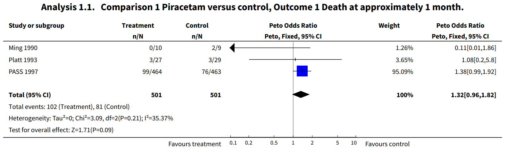
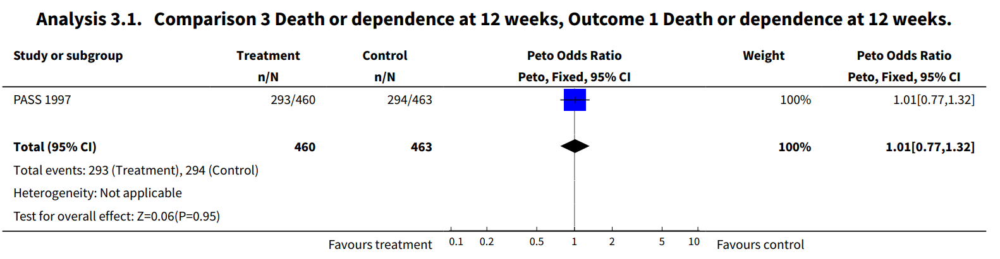
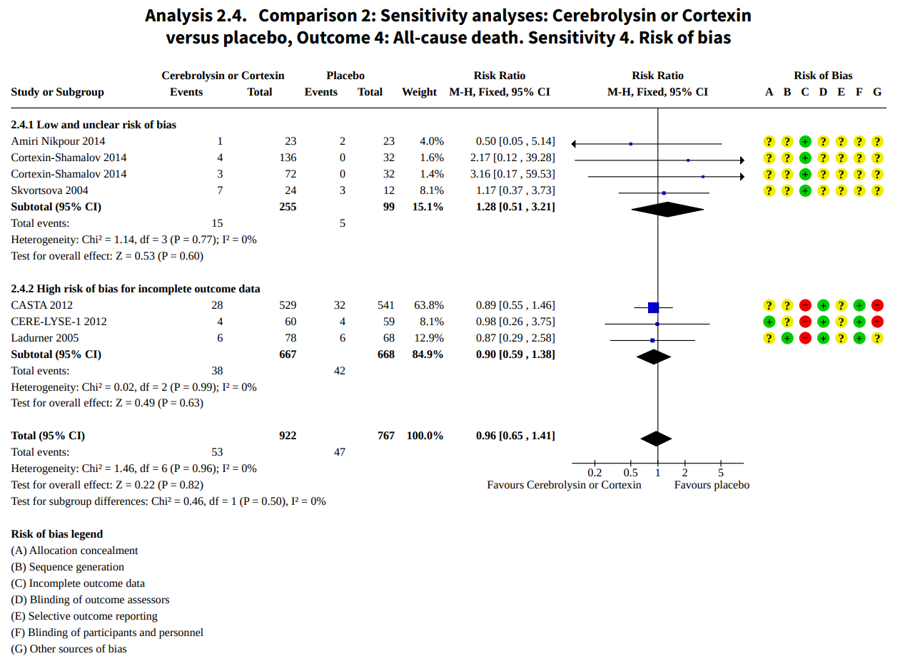
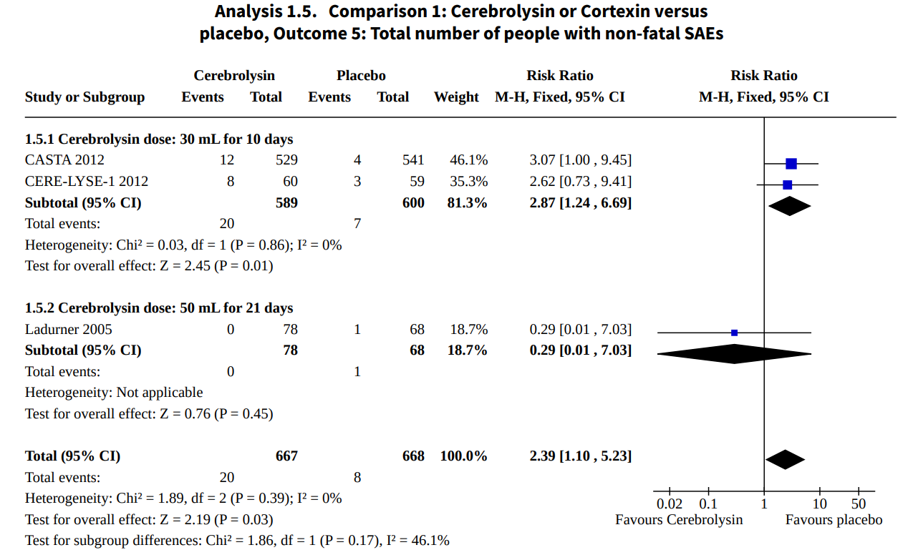
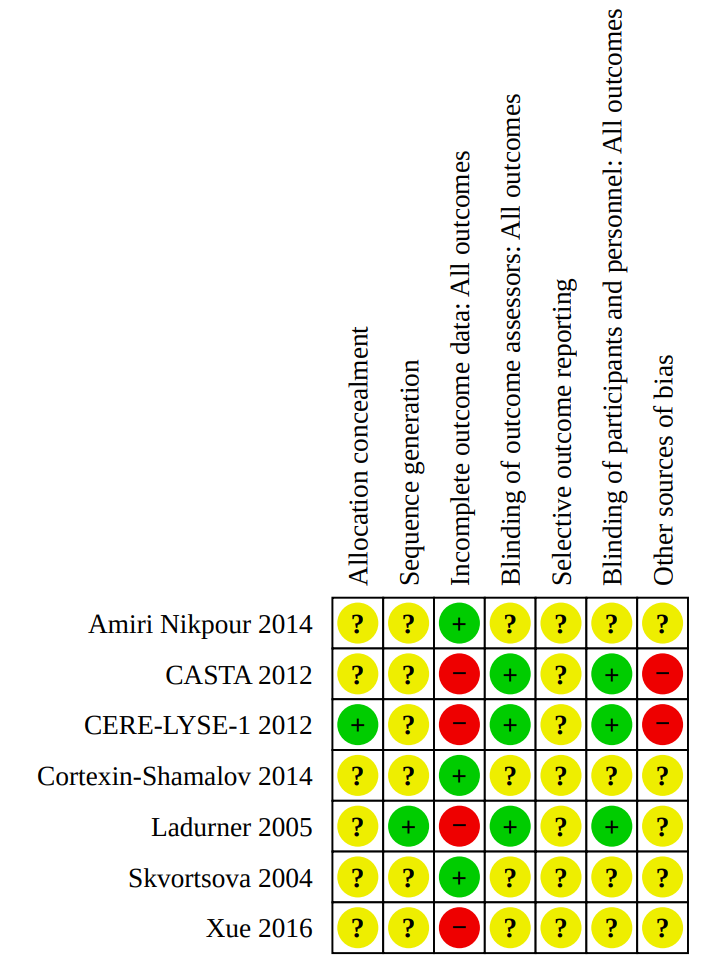
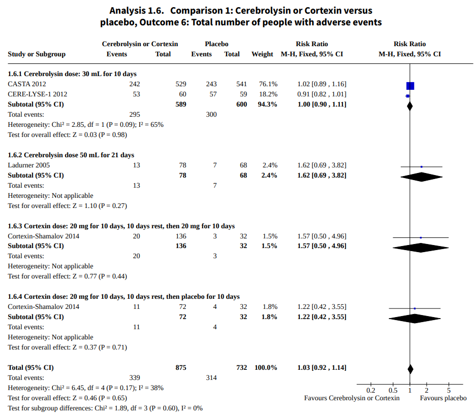

  
Фармакология укладки (и не только!)

  
Ноотропы и нейропротекция

  
Тысяча препаратов, ни одного доказательства: пирацетам, церебролизин, мексидол, семакс, цитофлавин и фенибут глазами Кокрейна, FDA и AHA

  

  
Обзор доказательной базы препаратов, которые есть в российских протоколах и укладке скорой помощи, но отсутствуют в международных руководствах AHA/ASA, ESO и перечне ВОЗ.

  
Серия «Крещение поворотом» · версия 1.0 · 31 августа 2026 · CC BY-NC-SA 4.0

Пирацетам, церебролизин, мексидол, семакс, цитофлавин, фенибут — препараты, которые есть в российских клинических рекомендациях, в укладке бригад СМП и в стационарной неврологии. Пациенты нередко говорят, что чувствуют от них пользу. Коллеги назначают их с уверенностью. Международные руководства AHA/ASA, ESO и ВОЗ их не включают. Кокрейновские обзоры не подтверждают клиническую пользу.

> **Слово бригаде:** «Ну да, доказательная медицина, всё это понятно. Но вот прокапаешь бабке курсом мексидол — и она после инсульта встаёт и ходит. Ну вот и что тут скажешь, если я эффект своими глазами вижу?» — *А.Г.*

Между «пациенту стало лучше» и «препарат эффективен» — дистанция, которую должно пройти контролируемое исследование. Субъективное улучшение реально: человеку действительно лучше. Но его причины могут быть разными — плацебо-ответ, регрессия к среднему, естественное течение болезни, эффект внимания и заботы, сопутствующая терапия. Доказательная медицина не отрицает субъективную пользу — она спрашивает: остаётся ли эффект, если убрать эти факторы? Для этого нужно двойное слепое плацебо-контролируемое РКИ. Возможно ли, что реальный эффект есть, но база просто не собрана? Да, возможно — и это тоже рассмотрено ниже для каждого препарата.

Каждый препарат разобран по одной схеме: что это за молекула, какова доказательная база, что говорят Кокрейновские обзоры и каков регуляторный статус в мире.

# Кладбище нейропротекции?

## Почему идея казалась очевидной

Нейропротекция — это не чья-то выдумка, а логичная гипотеза. При ишемическом инсульте вокруг зоны инфаркта существует пенумбра — ткань, которая ещё жива, но гибнет в ближайшие часы от каскада эксайтотоксичности, оксидативного стресса и апоптоза. Если можно прервать каскад фармакологически — клетки выживут, и пациент восстановится лучше. Эта логика работала в пробирке и на животных моделях. Десятки лабораторий по всему миру — не только в СССР/России, но и в США, Европе, Японии — десятилетиями искали молекулу, которая защитит пенумбру.

## Масштаб поиска

В 2006 году O'Collins и соавторы (*Annals of Neurology*) провели систематический поиск и нашли **1 026 потенциальных нейропротективных агентов**, протестированных экспериментально при остром инсульте. Из них **114 дошли до клинических испытаний на людях**. Ни один не стал стандартом терапии.

К 2016 году Ginsberg (*Stroke*, AHA/ASA) обновил картину: «Более 1 000 доклинических исследований идентифицировали нейропротективные соединения, более 100 из них дошли до клинических испытаний. Ни одно не продемонстрировало эффективность у человека». Редакционная статья *Immunology & Cell Biology* назвала нейропротекцию «терапевтическим кладбищем».

## NXY-059 и испытания SAINT

Самый показательный пример — западный. NXY-059 (Cerovive, AstraZeneca) — ловушка свободных радикалов — был идеальным кандидатом: соответствовал критериям STAIR, прошёл доклиническую валидацию, показал положительный результат в фазе III (SAINT I).

STAIR (Stroke Therapy Academic Industry Roundtable) — набор рекомендаций, разработанных в 1999 году, чтобы повысить качество доклинических исследований нейропротекторов и снизить число ложноположительных переходов в клинику. Требования: воспроизведение эффекта в нескольких лабораториях, адекватное терапевтическое окно, исследование на нескольких видах животных, оценка дозозависимости, функциональные (а не только гистологические) конечные точки. NXY-059 был первым препаратом, прошедшим все эти требования, — и всё равно провалился в человеке.

**SAINT II** (Shuaib et al., *NEJM* 2007): 3 196 пациентов, двойное слепое, плацебо-контролируемое. Результат: **никакого различия** по модифицированной шкале Рэнкина на 90-й день (OR 0,94; 95 % ДИ 0,83–1,06; p = 0,33). AstraZeneca закрыла программу. Это не российская история — это глобальная: даже при идеальном дизайне и миллиардных вложениях молекула не работает в человеке так, как в модели.

## Почему препараты всё же существуют и назначаются

Если более тысячи молекул провалились, почему нейропротективные препараты до сих пор производятся, регистрируются и включаются в клинические рекомендации? Причин несколько, и ни одна из них не сводится к заговору или невежеству:

- **Историческая изоляция.** Советская и российская нейрофармакологическая школа развивалась параллельно западной и имела собственные методологические традиции. Многие препараты были зарегистрированы до внедрения стандартов GCP (Good Clinical Practice — международные требования к проведению клинических испытаний, принятые ICH в 1996 году) и до того, как двойное слепое плацебо-контролируемое РКИ стало обязательным требованием.
- **Инерция регуляторной системы.** Отозвать регистрацию препарата, который уже в обращении, методологически и юридически сложнее, чем не допустить новый. Для дерегистрации нужны доказательства вреда, а не просто отсутствие доказательств пользы.
- **Клинический опыт врачей.** Субъективный опыт реален: врач видит пациентов, которым «стало лучше» на фоне назначения. Как обсуждалось во введении, это может быть плацебо, регрессия к среднему или естественное течение — но для врача, который наблюдает конкретного пациента, а не группу с контролем, улучшение выглядит убедительно.
- **Спрос пациентов.** Пациенты и родственники хотят «что-то, что восстановит мозг». Препарат, даже с недоказанной эффективностью, воспринимается лучше, чем отсутствие лечения. Отказ назначать воспринимается как бездействие.
- **Экономический фактор.** Производители, которые вложились в разработку, регистрацию и производство, заинтересованы в сохранении рынка.

## Позиция AHA/ASA

Руководство AHA/ASA по раннему ведению острого ишемического инсульта (2019, обновлено 2026): «Ни один нейропротективный агент не рекомендован для рутинной терапии ОИИ. Все являются экспериментальными и должны применяться только в рамках клинических испытаний» (класс III, уровень доказательности A).

Российские клинические рекомендации занимают другую позицию — ряд нейропротективных препаратов допускается. Этот разрыв и разбирается ниже.

# Пирацетам

## Что это

Циклическое производное ГАМК, синтезировано в 1964 году Corneliu Giurgea (румынский нейрофармаколог, работавший в бельгийской UCB Pharma). Торговое наименование Ноотропил. Именно для описания эффектов пирацетама Giurgea в 1972 году ввёл термин «ноотроп» — вещество, улучшающее когнитивные функции без седации и стимуляции. Молекула дала название целому классу и остаётся его самым изученным представителем.

В Советском Союзе пирацетам стал культовым. Производился он в Западной Европе, но в страны Восточного блока попадал в том числе через Венгрию (Richter Gedeon).

> **Слово бригаде:** «О, пирацетам, а как же без него! В Союзе все пытались достать его, особенно через наших военных лётчиков, которые летали туда, в Южную группу войск. У меня дед работал на таможне военного аэродрома, и вот у меня это название постоянно было на слуху.» — *Ю.Н.*

## Кокрейновские обзоры

### Пирацетам при деменции и когнитивных нарушениях (CD001011)

Flicker & Grimley Evans, обновлён 2011. 24 исследования, **11 959 участников**. Большинство — старые, перекрёстные, низкого качества. UCB Pharma отказалась предоставить данные нескольких неопубликованных исследований.

Единственный показатель, который удалось объединить в мета-анализ, — Global Impression of Change (субъективное общее впечатление). Но объективные когнитивные тесты, показатели зависимости и депрессии — без эффекта.

Заключение: **«Опубликованные данные не поддерживают применение пирацетама в лечении пациентов с деменцией или когнитивными нарушениями»**.

### Пирацетам при остром ишемическом инсульте (CD000419)

Обновлён 2011. 3 РКИ, **1 002 пациента**. 93 % данных — из одного исследования (PASS 1997).

Результат: незначимое **повышение смертности на 31 %** в группе пирацетама (95 % ДИ: от 81 % повышения до 5 % снижения). Никакого различия по функциональному исходу.

Заключение: **«Имеющиеся данные не поддерживают рутинное применение пирацетама при остром ишемическом инсульте»**.

### Пирацетам при постинсультной афазии (CD000424)

10 исследований, 6 препаратов. Пирацетам — единственный с намёком на пользу, но доказательства **слабые** и с вопросами безопасности. «Необходимы дальнейшие исследования, прежде чем его можно будет рекомендовать для рутинного применения».

## Ключевое отрицательное РКИ: PASS

De Deyn et al., *Stroke* 1997. 927 пациентов, двойное слепое, плацебо-контролируемое. 12 г в/в болюсно, затем 12 г/сут 4 недели, затем 4,8 г/сут 8 недель.

- Шкала Orgogozo на 4-й неделе: пирацетам **57,7** против плацебо **57,6**.
- Индекс Бартела на 12-й неделе: пирацетам **55,8** против плацебо **53,1**.
- Смертность на 12-й неделе: пирацетам **23,9 %** против плацебо **19,2 %** (RR 1,24; 95 % ДИ 0,97–1,59; p = 0,15).

Авторы объяснили тренд к повышению смертности дисбалансом при рандомизации: в группу пирацетама попали более тяжёлые пациенты. После коррекции на тяжесть инсульта тренд исчезает. Однако Кокрейновские рецензенты оговариваются: различие в тяжести между группами само по себе статистически незначимо (p = 0,2), поэтому объяснение не бесспорно. Планировалось исследование PASS II с ранним введением — но UCB Pharma отказалась предоставить промежуточные результаты для Кокрейновского обзора, и данные так и не были опубликованы.

Положительные «тренды» — только post hoc, в подгруппе раннего лечения (менее 7 часов).

<figure>
  
  <figcaption>Forest plot: смертность на ~1 месяц. Пирацетам vs контроль. Незначимое повышение на 31 % (OR 1,31; 95 % ДИ 0,95–1,81). 93 % данных — PASS. Источник: Cochrane CD000419, 2012.</figcaption>
</figure>

<figure>
  
  <figcaption>Forest plot: смерть или зависимость на 12 недель. Пирацетам vs контроль. Нет различий (OR 1,03; близко к единице). Источник: Cochrane CD000419, 2012.</figcaption>
</figure>

## Регуляторный статус

| Регулятор | Статус |
|---|---|
| **FDA (США)** | **Не одобрен.** Не является разрешённой биодобавкой. FDA (2004) определило, что пирацетам исключён из определения диетической добавки. Компании, продающие его как добавку, получают предупреждения |
| **EMA (Европа)** | Нет централизованного разрешения. Национальные регистрации (Великобритания, Германия, Италия, Польша) — **только для кортикального миоклонуса**. Основание: работы C. D. Marsden и J. Obeso (1988–1993). Двойной слепой crossover: 21 пациент с тяжёлым кортикальным миоклонусом получал поочерёдно 14 дней пирацетама (до 24 г/сут) и 14 дней плацебо. При переходе на плацебо у 10 из 21 миоклонус вернулся настолько тяжело, что их пришлось досрочно вернуть на препарат; из фазы пирацетама не потребовалось спасать никого. Механизм здесь другой: не «улучшение когниции», а подавление кортикальной гипервозбудимости. UK MHRA зарегистрировало пирацетам в 1992 году, NICE включило в гайдлайн по эпилепсии (CG137). Это единственное показание пирацетама, подтверждённое в контролируемых испытаниях |
| **Россия** | Зарегистрирован. Входит в перечень ЖНВЛП. Показания: «симптоматическое лечение интеллектуально-мнестических нарушений при недоказанной деменции», кортикальный миоклонус |
| **Перечень ВОЗ** | Не включён |

# Церебролизин

## Что это

Пептидный препарат из мозга свиней (гидролизат белков мозга). Производитель — EVER Neuro Pharma (Австрия, ранее Ebewe Pharma).

Идея возникла в послевоенной Вене. Австрийский психиатр и невролог Gerhart Harrer (1917–2011) начал использовать гидролизат свиного мозга в клинической практике около 1951 года. Логика была донаучной, но по-своему последовательной: мозг повреждён — значит, нужно дать ему строительный материал из мозговой ткани. Harrer полагал, что внутривенное введение аминокислот и пептидов, полученных из ткани-мишени, обеспечит нейротрофическую поддержку. Свиньи оказались удачным выбором — их мозг доступен, а позже выяснилось, что они устойчивы к прионным заболеваниям.

Современная технология: мозговую ткань измельчают и обрабатывают ферментативным гидролизом, затем ультрафильтрацией выделяют фракцию пептидов ниже 10 кДа — мелкие фрагменты, которые теоретически проникают через гематоэнцефалический барьер. В составе обнаружены фрагменты BDNF, GDNF, NGF и CNTF — нейротрофических факторов. Однако «содержит фрагменты нейротрофинов» и «работает как нейротрофин» — не одно и то же: для клинического эффекта нужны контролируемые испытания.

## Кокрейновские обзоры

### Церебролизин при остром ишемическом инсульте (CD007026, обновлён 2023)

Ziganshina et al. 7 РКИ, **1 773 участника**.

- **Смертность:** вероятно, практически не отличается от плацебо (RR 0,96; 95 % ДИ 0,65–1,41; 6 РКИ, 1 689 пациентов; **умеренная достоверность**).
- **Нефатальные серьёзные нежелательные явления:** повышены в 2,4 раза (RR 2,39; 95 % ДИ 1,10–5,23; 3 РКИ, 1 335 пациентов). При дозе 30 мл × 10 дней — RR 2,87 (95 % ДИ 1,24–6,69). Что это были за события: в исследовании CERE-LYSE-1 (единственном, где природа НЯ описана) в группе церебролизина зафиксированы острый коронарный синдром, фибрилляция предсердий, сердечная недостаточность, язва желудка, пневмония (3 случая), аспирационная пневмония (2), плевральный выпот, церебральная гематома, ТЭЛА. Какие из этих событий связаны с препаратом, а какие — с самим инсультом и его осложнениями, установить невозможно: крупнейшее исследование CASTA не описывает природу серьёзных НЯ вовсе.
- Общее число людей с **любыми** НЯ — без различий (RR 1,03; 95 % ДИ 0,92–1,14).
- Три многоцентровых исследования спонсированы производителем (предоставление препарата, рандомизационных кодов, грантов, статистиков).

Заключение: нет доказанной пользы при остром инсульте. Есть статистически значимое увеличение нефатальных серьёзных НЯ, но их природа и связь с препаратом не установлены.

<figure>
  
  <figcaption>Forest plot: смертность (все причины). Церебролизин/Кортексин vs плацебо. Нет различий (RR 0,96). Источник: Ziganshina et al., Cochrane CD007026, 2023.</figcaption>
</figure>

<figure>
  
  <figcaption>Forest plot: нефатальные серьёзные НЯ. Церебролизин vs плацебо. RR 2,39 (95 % ДИ 1,10–5,23). Источник: Ziganshina et al., Cochrane CD007026, 2023.</figcaption>
</figure>

<figure>
  
  <figcaption>Risk of bias summary: оценка риска предвзятости для каждого включённого исследования. Зелёный — низкий риск, жёлтый — неясный, красный — высокий. Источник: Ziganshina et al., Cochrane CD007026, 2023.</figcaption>
</figure>

<figure>
  
  <figcaption>Forest plot: общее число людей с любыми нежелательными явлениями. Церебролизин vs плацебо. Без различий (RR 1,03). Источник: Ziganshina et al., Cochrane CD007026, 2023.</figcaption>
</figure>

### Церебролизин при сосудистой деменции (CD008900, обновлён 2019)

6 РКИ, **597 участников** (Xiao 1999 и Xiao 2000 — Китай; Vereshchagin 1991 — Россия; Guekht 2011 — Россия; Muresanu 2008 — Румыния; шестое — Китай, детали минимальны). Курсы церебролизина улучшали когнитивные шкалы и общую функцию. Качество доказательств по GRADE — «очень низкое».

Почему «очень низкое», если все 6 — РКИ? GRADE начинает с «высокого» для любого РКИ, но понижает за каждую проблему:

- **Риск предвзятости:** в большинстве исследований не описано, как проводилась рандомизация и скрывалось ли распределение по группам (allocation concealment). Ослепление оценщиков — неясно.
- **Гетерогенность:** дозы, длительность курсов и конечные точки различались в каждом исследовании — объединять их в мета-анализ статистически натянуто.
- **Малые выборки:** 597 человек на 6 исследований, в среднем ~100 на каждое.
- **Спонсорство:** где финансирование известно — производитель (EVER Neuro Pharma).

Два понижения GRADE — «низкое» качество, три — «очень низкое». Здесь понизили за risk of bias, гетерогенность и imprecision.

При этом крупнейшее из шести — Guekht 2011 (242 пациента, двойное слепое, плацебо-контролируемое, Россия) — показало статистически значимое улучшение по ADAS-cog+ и CIBIC+. Это реальные данные, но одного исследования недостаточно, чтобы поднять GRADE.

Заключение Кокрейна: «Если польза церебролизина и существует, эффекты могут быть слишком малы, чтобы быть клинически значимыми. Необходимы крупные методологически строгие исследования».

## Ключевые отрицательные РКИ

### CASTA (Cerebrolysin in Acute Stroke in Asia)

~1 070 пациентов, 52 центра (Китай, Гонконг, Южная Корея, Мьянма). 30 мл в/в 10 дней, начало в пределах 12 часов. Спонсор — EVER Neuro Pharma.

**Результат:** первичная конечная точка не достигнута. «Группового различия не обнаружено.»

### CARS (Cerebrolysin and Recovery After Stroke)

208 пациентов, фаза II, двойное слепое. **Положительный** результат по моторному восстановлению (Action Research Arm Test). Однако авторы сами называют исследование **«предварительным»** и рекомендуют подтверждение в крупном испытании.

## Регуляторный статус

| Регулятор | Статус |
|---|---|
| **FDA (США)** | **Не одобрен.** Нет NDA/BLA. FDA выпустило предупреждение компаундирующей аптеке за использование церебролизина (2020) |
| **EMA (Европа)** | Нет центрального разрешения. Национальная регистрация в Австрии |
| **Россия** | Зарегистрирован. Включён в клинические рекомендации Минздрава по ишемическому инсульту (30 мл в/в 10 дней) |
| **Перечень ВОЗ** | **Не включён** |
| **Зарегистрирован** | ~44–50 стран, в основном Восточная Европа, СНГ, Азия, Латинская Америка |

## Конфликт интересов

Кокрейновский обзор 2023 года явно указывает, что три из семи включённых многоцентровых РКИ **спонсированы производителем**. Расследование For Better Science (2024) документирует вопросы к качеству публикаций, связанных с бывшим генеральным директором EVER Pharma. Анализ LessWrong показывает, что опубликованная частота положительных результатов статистически маловероятна без publication bias.

# Мексидол

## Что это

Этилметилгидроксипиридина сукцинат. Торговые названия: Мексидол, Мексикор, Мексиприм, Нейрокс. Производитель оригинального препарата — ООО «НПК ФАРМАСОФТ» (Россия). Структурно похож на пиридоксин (витамин B₆). Заявленный механизм: антиоксидант (ингибирование перекисного окисления липидов) и антигипоксант (активация сукцинатдегидрогеназы в дыхательной цепи митохондрий).

## История

В 1956 году Николай Семёнов (совместно с Сирилом Хиншелвудом) получил Нобелевскую премию по химии за изучение механизма цепных реакций, включая образование свободных радикалов. Это исследование стало теоретической основой для всего направления антиоксидантной фармакологии в СССР.

В начале 1980-х годов в НИИ фармакологии РАМН фармакологи **Л. Д. Смирнов** и **В. И. Кузьмин** под руководством академика **А. В. Вальдмана** синтезировали 2-этил-6-метил-3-гидроксипиридина сукцинат. Провели доклинические исследования — токсикологию, фармакокинетику, фармакодинамику. Зарегистрировали препарат в Минздраве СССР. Первые клинические испытания и внедрение в практику — там же.

31 декабря 1996 года — приказ Минздрава РФ №432 «О разрешении медицинского применения». Мексидол стал первым зарегистрированным препаратом этилметилгидроксипиридина сукцината. В 2003 году группе разработчиков (руководитель — К. М. Дюмаев; Верещагин, Воронина, Суслина, Федин, Шмырёв и др.) присуждена Премия Правительства РФ в области науки и техники «за создание и внедрение антиоксидантных препаратов для лечения и профилактики цереброваскулярных заболеваний».

Мексидол — один из самых назначаемых нейропротекторов в российской неврологии и скорой помощи. Он в укладке СМП и в клинических рекомендациях Минздрава.

## Почему нет Кокрейновских обзоров и западных исследований

Молекула не зарегистрирована ни в одной стране за пределами России и стран ЕАЭС. У неё нет кода АТХ (ATC) ВОЗ, нет записи в Европейской фармакопее или USP. Ни одно независимое от производителя исследование механизма действия не опубликовано в индексируемых международных журналах.

Причин несколько:

- **Патентная и коммерческая логика.** Для регистрации в FDA или EMA нужны клинические испытания фазы I–III по стандартам ICH/GCP в международных центрах. Это сотни миллионов долларов. Производитель (ФАРМАСОФТ) — российская компания среднего размера. Внутренний рынок покрывает расходы; международный — потребовал бы инвестиций, несопоставимых с масштабом компании.
- **Языковой барьер.** Основные исследования опубликованы на русском языке. Журнал неврологии и психиатрии им. Корсакова (основан в 1901 году) индексируется в PubMed/MEDLINE, Scopus и Web of Science — но статьи преимущественно на русском, и международные систематические обзоры их, как правило, не включают.
- **Методологический барьер.** Российская критическая рецензия (Ehrlich, Rational Pharmacotherapy in Cardiology) заключила: «Большинство клинических исследований мексидола — малые, нерандомизированные, с "мягкими" конечными точками. Результаты во многих работах представлены без адекватных статистических сравнений. Корреляция между применением мексидола и снижением смертности после инсульта не показана ни в одном исследовании».
- **Кокрейн не может написать обзор без данных.** Для Кокрейновского обзора нужны РКИ, зарегистрированные в международных реестрах (ClinicalTrials.gov, ISRCTN), с доступными данными. Таких исследований по мексидолу практически нет.

## Доказательная база

Самое сильное на сегодня исследование — **MIR** (NCT06437626): 304 пациента, многоцентровое, двойное слепое, плацебо-контролируемое, острый ишемический инсульт. Результат: статистически значимое улучшение по NIHSS (p < 0,001) и mRS (p = 0,003).

Но:

- Спонсор — ФАРМАСОФТ (производитель).
- Опубликовано в Журнале неврологии и психиатрии им. Корсакова (индексируется в PubMed/MEDLINE и Scopus, но основная аудитория — российская).
- Мета-анализ Вознюк 2023 (11 исследований, 1 976 пациентов): 2 РКИ + 9 нерандомизированных когортных. Значимое снижение NIHSS и mRS. Но: значительная статистическая гетерогенность, и сами авторы признают, что доказательства «на данный момент» не окончательны.
- Ни одного независимого от производителя РКИ за пределами России.

Это не означает, что мексидол не работает. Это означает, что мы не можем это утверждать по международным стандартам доказательной медицины.

## Регуляторный статус

| Регулятор | Статус |
|---|---|
| **FDA (США)** | Не одобрен. Заявка не подавалась |
| **EMA (Европа)** | Не одобрен. Нет регистрации ни в одной стране ЕС |
| **WHO** | Нет кода АТХ. Не включён в перечень основных лекарственных средств |
| **Россия** | Зарегистрирован. Включён в клинические рекомендации, в укладку СМП |
| **Международные гайдлайны** | AHA/ASA, ESO — не упоминается |

# Семакс

## Что это

Синтетический гептапептид, аналог фрагмента АКТГ(4–10). Назальный спрей. Структура: Met-Glu-His-Phe-Pro-Gly-Pro (MEHFPGP).

## Идея и история создания

Адренокортикотропный гормон (АКТГ) — гормон гипофиза, управляющий надпочечниками. Но ещё в 1970-х голландский нейрофизиолог David de Wied обнаружил, что короткие фрагменты АКТГ (в частности, аминокислоты 4–10) влияют на обучение, внимание и мотивацию у животных — без гормонального эффекта на надпочечники. Это были первые данные о том, что пептидные фрагменты гормонов могут действовать на мозг напрямую.

Проблема: природный АКТГ(4–10) (Met-Glu-His-Phe-Arg-Trp-Gly) живёт в организме минуты — протеазы крови и тканей разрушают его почти мгновенно. Использовать такой пептид как лекарство невозможно.

Задачу поставило **Министерство обороны СССР**: создать препарат для адаптации мозга в экстремальных ситуациях. Работы начались на **биологическом факультете МГУ** и в **Институте молекулярной генетики РАН**. Академик РАМН **Игорь Петрович Ашмарин** (заведующий кафедрой физиологии человека и животных биофака МГУ, 1986–2006) предложил идею: использовать регуляторные пептиды.

Под руководством академика РАН **Николая Фёдоровича Мясоедова** (ИМГ РАН) была синтезирована молекула Семакса. Ключевое решение: три аминокислоты C-конца природного АКТГ(4–10) заменены на трипептид Pro-Gly-Pro (PGP) — последовательность, устойчивую к протеолизу. Результат: нейротропные свойства АКТГ сохранились, а время жизни молекулы в организме увеличилось с минут до часов. В работе также участвовали **А. А. Каменский** (биофак МГУ) и другие сотрудники кафедры.

> **Слово бригаде:** «Я Каменского, кстати, лично знала — он нам рассказывал про Семакс, что они его после крыс на себе испытывали. Говорил: молекулу по типу регуляторного пептида, которая не распадается за минуты, мы создали, а как её воспримет мозг — время покажет, потому что мы космос или Марианскую впадину сейчас знаем лучше, чем свой мозг.» — *Ю.Н.*

Был предложен интраназальный путь введения — показано, что часть молекул достигает мозга неразрушенными. Клинические испытания проводились при участии **В. И. Скворцовой** (будущий министр здравоохранения РФ).

## Семакс на скорой помощи

Семакс был включён в **стандарт скорой медицинской помощи при инсульте** (приказ Минздравсоцразвития №643 от 05.09.2006): МНН «метионил-глутамил-гистидил-фенилаланил-пролил-глицил-пролин», частота назначения 1, доза 3 мг. Рядом — актовегин (1000 мг).

В **обновлённом стандарте 2012 года** (приказ Минздрава №1282н от 20.12.2012) Семакса и актовегина уже нет. Из «нейропротекторов» в стандарте остался только глицин. Стандарт 2016 года (приказ №466н) подтвердил исключение.

Причины не объяснены в тексте приказа — стандарты не содержат обоснований. Вероятная логика: при пересмотре стандартов в 2012 году Минздрав ориентировался на доказательную базу, а по Семаксу к тому моменту не было ни одного крупного РКИ.

## Доказательная база

Все опубликованные клинические испытания — российские/СНГ. Международных многоцентровых РКИ не существует.

Самое крупное — Гусев и соавт., 2018: 110 пациентов, постинсультная когорта, не рандомизированное, не плацебо-контролируемое по современным стандартам FDA/EMA. Опубликовано в Журнале неврологии и психиатрии им. Корсакова.

Доклинические данные (повышение BDNF в базальном переднем мозге крыс) подтверждены независимой лабораторией (Dolotov et al., *Journal of Neurochemistry*, 2006). Механизм правдоподобен. Клинических доказательств эффективности у человека — нет.

## Регуляторный статус

| Регулятор | Статус |
|---|---|
| **FDA (США)** | Не одобрен. Не является ЛС. В июле 2026 консультативный комитет FDA проголосовал 8:5 за включение в список 503A (компаундирование) — это не одобрение |
| **EMA (Европа)** | Не одобрен. Нет национальных регистраций в ЕС |
| **Россия** | Зарегистрирован. Входит в перечень ЖНВЛП. Был в стандарте СМП при инсульте (2006–2012), исключён |
| **Международные гайдлайны** | Не упоминается ни в одном международном руководстве по инсульту или деменции |

# Цитофлавин

## Что это

Комбинированный метаболический препарат: инозин + никотинамид + рибофлавин + янтарная кислота. Производитель — ООО «НТФФ ПОЛИСАН» (Санкт-Петербург).

## Доказательная база

Из всех российских ноотропов/нейропротекторов у цитофлавина **наиболее сильная доказательная база** — единственного из перечисленных с публикациями в англоязычных рецензируемых журналах:

- **MITRA** (NCT04631484): 166 пациентов, ЧМТ средней степени, многоцентровое, рандомизированное, **одностороннее слепое**, плацебо-контролируемое, фаза III. Полное восстановление (GOS-E 8): **73 % против 30 %** (OR 6,53; 95 % ДИ 3,30–13,41). Опубликовано в *Frontiers in Neurology* (2025). **Остановлено досрочно** по эффективности.

- **CYLINDER** (NCT04649203): 216 пациентов, диабетическая полинейропатия, двойное слепое, плацебо-контролируемое, фаза III. Опубликовано в *BMJ Open Diabetes Research & Care* (2022). Положительный результат.

Однако:

- MITRA — **одностороннее слепое** (не двойное), остановлено досрочно (завышает размер эффекта).
- Оба исследования — **спонсированы ПОЛИСАН**.
- Ни одно не реплицировано независимо.
- Ни одно не привело к включению в международные гайдлайны.
- Данные по инсульту — из российских журналов, без плацебо-контроля.

## Регуляторный статус

| Регулятор | Статус |
|---|---|
| **FDA (США)** | **Не одобрен** |
| **EMA (Европа)** | **Не одобрен** |
| **Россия** | Зарегистрирован (2022) |
| **Индонезия** | Одобрен BPOM (2022) — единственная регистрация за пределами СНГ |

# Актовегин

## Что это

Депротеинизированный гемодериват телячьей крови — смесь низкомолекулярных пептидов, аминокислот, нуклеозидов и электролитов (> 200 компонентов, все < 5 кДа). Конкретного действующего вещества нет, фармакокинетика не изучена. По сути — родственник церебролизина: тот — экстракт свиного мозга, этот — ультрафильтрат телячьей крови.

## История

Создан в 1950-х компанией Hormon-Chemie (Мюнхен). С 1976 года выпускался как Актовегин (Nycomed, затем Takeda). Родственный препарат Солкосерил производился в Швейцарии, но был снят с рынка в связи с теоретическим риском прионного заражения (BSE/губчатая энцефалопатия) — для биологического препарата из крови телят это принципиальный вопрос регуляторов.

## Доказательная база

Систематический обзор 2022 года (PLoS ONE): из 220 записей отобрано 5 исследований (4 наблюдательных с контролем + 1 РКИ), всего 3 879 пациентов. Мета-анализ не проведён из-за гетерогенности. Вывод: **нет последовательных доказательств улучшения выживаемости, качества жизни, неврологических симптомов или инвалидизации**.

Единственное крупное РКИ — **ARTEMIDA** (Guekht et al., *Stroke* 2017): 503 пациента ≥60 лет с постинсультным когнитивным снижением. Актовегин 2 000 мг/сут в/в 20 дней → 1 200 мг/сут per os 6 месяцев vs плацебо. Первичная точка (ADAScog+) на 6 месяцев: разница −2,3 балла в пользу актовегина (p = 0,005). Однако: клиническая значимость этой разницы неясна, рецидив ишемического инсульта чаще в группе актовегина (незначимо), исследование спонсировано Takeda. Cochrane Students' Journal критикует дизайн и отмечает отсутствие репликации.

## Регуляторный статус

| Регулятор | Статус |
|---|---|
| **FDA (США)** | **Не одобрен, запрещён к ввозу** |
| **EMA (Европа)** | **Не зарегистрирован** (нац. регистрации в Австрии; снят в Швейцарии) |
| **Россия, СНГ** | Зарегистрирован, входит в ЖНВЛП |
| **AHA/ASA, AAN, WHO** | **Не упоминается ни в одном руководстве** |

# Глицин

## Что это

Глицин (аминоуксусная кислота) — простейшая аминокислота, заменимая, содержится в обычной пище (~2 г/сут в рационе). В ЦНС — тормозной нейромедиатор (в спинном мозге и стволе) и ко-агонист NMDA-рецепторов (в коре). Именно вторая роль — основание для «ноотропных» заявлений: NMDA-рецепторы участвуют в долговременной потенциации (LTP), а LTP — клеточная основа обучения и памяти.

## Проблема дозы

Российский глицин — таблетки 100 мг сублингвально. Для реального влияния на NMDA-рецепторы мозга в исследованиях по шизофрении используются дозы **0,4–0,8 г/кг/сут** (30–60 г/сут для взрослого). Даже в единственном позитивном исследовании на здоровых (File et al., 1999, Bioglycin) эффект на эпизодическую память обнаружен при 1 г сублингвально — в 10 раз больше российской разовой дозы.

Фармакокинетика проста: глицин легко всасывается, но так же легко метаболизируется (глициноксидаза → вода + CO₂). При пероральном приёме 100 мг бо́льшая часть утилизируется ещё до того, как сколько-нибудь значимое количество достигнет синаптической щели.

## Доказательная база

Кокрейновских обзоров по глицину как ноотропу нет. Есть обзоры по глицину при шизофрении (как ко-агонист NMDA), но это совершенно другие дозы и другие показания. По российским показаниям (стресс, когнитивное снижение, инсульт) доказательная база ограничена исследованиями, не соответствующими стандартам GCP.

В стандарте скорой помощи при инсульте (приказ Минздрава №1282н от 2012) глицин оставался в перечне, когда семакс и актовегин были исключены — но это отражает, скорее, его безвредность и дешевизну, чем доказанную эффективность.

> **Слово бригаде:** «Ещё один известный физиолог, Дубынин Вячеслав Альбертович, читал нам как-то популярную лекцию про мозг, и вот он говорил, что глицин хорошо помогает от похмелья, но в размере как минимум одной упаковки.» — *Ю.Н.*

Это, кстати, не лишено смысла: 50 таблеток × 100 мг = 5 г — доза, при которой глицин начинает оказывать измеримое действие. Но тогда проще купить банку пищевого глицина (пищевая добавка E640) за долю стоимости.

# Фенибут

## Что это

Аминофенилмасляная кислота — производное ГАМК с фенильной группой. Агонист ГАМК-B-рецепторов (как баклофен) и модулятор α2-δ кальциевых каналов (как габапентин). Разработан в СССР (1960-е) в рамках программы фармакологического обеспечения космонавтов. Зарегистрирован как анксиолитик и ноотроп.

Фенибут не является ноотропом в классическом понимании — это транквилизатор с ГАМК-ергическим механизмом. Он включён в этот обзор потому, что в российской клинической практике его нередко относят к ноотропам и назначают с ожиданием когнитивного улучшения.

## Доказательная база

Критический обзор WHO ECDD (44-я сессия): **«Рандомизированные контролируемые испытания фенибута по любому из его предполагаемых показаний отсутствуют»**.

Систематический обзор 2020 года: 11 клинических исследований, 583 пациента — нежелательные явления у 5,66 % в терапевтических дозах (преимущественно сонливость). Ни одно из исследований не соответствует современным стандартам двойного слепого плацебо-контролируемого РКИ.

## Зависимость и токсичность

Серии случаев описывают применение фенибута в дозах 1–100 г/сут (рекреационное использование): **тяжёлая интоксикация, делирий, психоз, судороги, госпитализация в ОРИТ**. Синдром отмены требует терапии бензодиазепинами или баклофеном, по аналогии с отменой ГАМК-ергических препаратов.

## Регуляторный статус

| Страна / регулятор | Статус |
|---|---|
| **Россия, Украина, Беларусь, Казахстан, Латвия** | Зарегистрированный ЛС (анксиолитик) |
| **FDA (США)** | **Не одобрен.** FDA: «не является разрешённым диетическим ингредиентом»; использование в добавках и продуктах питания незаконно |
| **Австралия** | **Schedule 9 — запрещённое вещество** (только для исследований) |
| **Германия** | NpSG — разрешён только для промышленного и научного использования |
| **Великобритания** | Не лицензирован; MHRA изымает нелицензированные продукты; возможно подпадает под Psychoactive Substances Act 2016 |
| **WHO/ООН** | Не под международным контролем; под наблюдением ECDD с 2017 года |

# Итоговая таблица

| Препарат | Кокрейновский обзор | Лучшее РКИ | FDA | EMA | Перечень ВОЗ | AHA/ASA |
|---|---|---|---|---|---|---|
| **Пирацетам** | 3 обзора: деменция — нет эффекта; инсульт — нет эффекта, тренд к ↑ смертности; афазия — слабые данные | PASS (n=927): нет пользы, RR смерти 1,24 | Не одобрен | Нац. регистрации (миоклонус) | Нет | Не упоминается |
| **Церебролизин** | 2 обзора: инсульт — нет пользы, ↑ НЯ; деменция — очень низкая достоверность | CASTA (n≈1 070): провал первичной точки | Не одобрен | Нац. рег. в Австрии | Нет | Не упоминается |
| **Мексидол** | Нет | MIR (n=304), спонсор-производитель | Не одобрен | Не одобрен | Нет | Не упоминается |
| **Семакс** | Нет | 110 пациентов, нерандомизированное | Не одобрен | Не одобрен | Нет | Не упоминается |
| **Цитофлавин** | Нет | MITRA (n=166, ЧМТ); CYLINDER (n=216, нейропатия) | Не одобрен | Не одобрен | Нет | Не упоминается |
| **Актовегин** | Нет | ARTEMIDA (n=503): −2,3 балла ADAScog+, спонсор Takeda | Не одобрен | Нац. рег. в Австрии; снят в Швейцарии | Нет | Не упоминается |
| **Глицин** | Нет | Нет РКИ по российским дозам (100 мг) | Пищевая добавка (E640) | Пищевая добавка | Нет | Не упоминается |
| **Фенибут** | Нет | **Нет РКИ** | Не одобрен | Не одобрен | Нет | Не упоминается |

# Закономерность

Восемь препаратов — восемь вариаций одной и той же истории:

1. Правдоподобный механизм в пробирке или на животной модели.
2. Небольшие исследования с положительным результатом, опубликованные в журналах с ограниченным рецензированием, спонсированные производителем.
3. Когда проводится крупное, методологически строгое испытание (PASS, CASTA, SAINT II) — результат отрицательный или нейтральный.
4. Ни одно из этих средств не зарегистрировано FDA или EMA по неврологическим показаниям.
5. Ни одно не включено в перечень основных лекарственных средств ВОЗ.
6. Ни одно не рекомендовано ни в одном международном руководстве по инсульту или деменции.

Это не заговор FDA против российской фармакологии. Это воспроизводимый результат: молекулы, эффективные в пробирке, не работают в человеке. Пенумбра слишком гетерогенна, окно слишком узко, барьер слишком непроницаем, а мозг — не клеточная культура.

Российские клинические рекомендации по инсульту (Минздрав, 2024) фокусируются на **реперфузии** (тромболизис rt-PA) и вторичной профилактике, но допускают ряд ноотропных препаратов — церебролизин, мексидол, цитофлавин — как часть нейропротективной терапии. Это включение расходится с данными Кокрейновских обзоров, которые не показали убедительной пользы; в случае церебролизина зафиксировано увеличение нефатальных серьёзных нежелательных явлений.

> **Ни один ноотроп или нейропротектор не улучшает исход инсульта, деменции или когнитивных нарушений на уровне доказательности, достаточном для международного стандарта лечения. Это не мнение — это итог трёх десятилетий испытаний, включающих более 1 000 молекул и десятки тысяч пациентов.**

# Источники

- O'Collins VE et al. 1,026 experimental treatments in acute stroke. *Annals of Neurology* 2006; DOI: 10.1002/ana.20741.
- Ginsberg MD. The science of cerebral ischemia and the quest for neuroprotection. *Stroke* 2016; PMC4652647.
- Shuaib A et al. NXY-059 for the treatment of acute ischemic stroke (SAINT II). *NEJM* 2007; DOI: 10.1056/NEJMoa070240.
- AHA/ASA. Guidelines for the Early Management of Acute Ischemic Stroke. *Stroke* 2019, 2026; DOI: 10.1161/STR.0000000000000211, 10.1161/STR.0000000000000513.
- Flicker L, Grimley Evans G. Piracetam for dementia or cognitive impairment. *Cochrane Database Syst Rev* 2011; CD001011.
- Ricci S et al. Piracetam for acute ischaemic stroke. *Cochrane Database Syst Rev* 2011; CD000419.
- De Deyn PP et al. Treatment of acute ischemic stroke with piracetam (PASS). *Stroke* 1997; DOI: 10.1161/01.STR.28.12.2347.
- Ziganshina LE et al. Cerebrolysin for acute ischaemic stroke. *Cochrane Database Syst Rev* 2023; CD007026.
- Cui S et al. Cerebrolysin for vascular dementia. *Cochrane Database Syst Rev* 2019; CD008900.
- Heiss WD et al. Cerebrolysin in patients with acute ischemic stroke in Asia (CASTA). *Stroke* 2012.
- Muresanu DF et al. Cerebrolysin and Recovery After Stroke (CARS). *Stroke* 2016; DOI: 10.1161/STROKEAHA.115.009416.
- WHO Expert Committee on Drug Dependence. Critical review report: Phenibut (advance copy, 44th ECDD).
- ClinicalTrials.gov: NCT06437626 (MIR), NCT04631484 (MITRA), NCT04649203 (CYLINDER).

# Выходные данные

**Материал:** «Ноотропы и нейропротекция». Версия 1.0 от 31 августа 2026.

**Серия:** «Крещение поворотом» — клинические разборы догоспитальной практики. Раздел «Фармакология укладки (и не только!)».

**Лицензия:** текст — Creative Commons «С указанием авторства — Некоммерческая — С сохранением условий» 4.0 (CC BY-NC-SA 4.0). Копировать, печатать и раздавать коллегам можно свободно, включая печать для подстанции; продавать — нельзя; при переработке сохраняется та же лицензия и указывается источник.

**Оговорка.** Материал носит учебный характер. Он не является нормативным документом, не заменяет действующие протоколы, клинические рекомендации и распоряжения службы и не может использоваться как единственное основание для клинического решения. Ответственность за клинические решения несёт медицинский работник, а не автор материала.

**Нашли ошибку?** Ошибка в дозе, ссылке или выводе — не мелочь: материал используется в дискуссии. Сообщить можно через раздел Issues репозитория проекта; исправление выходит новой версией, а изменение фиксируется в журнале изменений.
