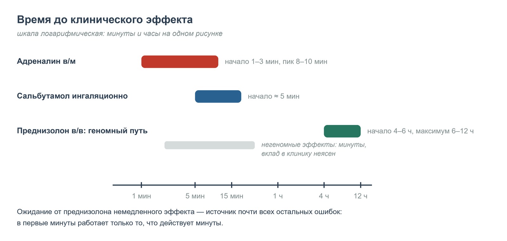

  
Фармакология укладки

  
Преднизолон

  
Чего глюкокортикоид не может в первые минуты, что он делает через четыре часа и где Алгоритмы ДЗМ расходятся с международными рекомендациями

  

  
Разбор препарата от механизма к дозе. Дозы — по приказу ДЗМ г. Москвы № 535 от 18.05.2023.

  
Серия «Крещение поворотом» · версия 1.0 · 19 августа 2026 · CC BY-NC-SA 4.0

# Что в ампуле

Преднизолон 3 % — 1 мл: **30 мг в ампуле, 30 мг в 1 мл** (Алгоритмы, приложение 44, внутренняя страница 432). Отсюда простая арифметика, которую стоит держать в голове раньше, чем считать: 90 мг — это 3 мл, 120 мг — 4 мл, 150 мг — 5 мл.

Раствор для инъекций — это преднизолона натрия фосфат или гемисукцинат, то есть водорастворимый эфир, который в крови гидролизуется до собственно преднизолона. Преднизолон, в свою очередь, является активным метаболитом преднизона: в печени преднизон превращается в преднизолон, поэтому при печёночной недостаточности предпочтителен именно преднизолон, а не преднизон.

# Механизм: два пути с разным временем

Понимание преднизолона на линии сводится к одному вопросу: **сколько времени пройдёт до эффекта.** Ответ на него следует из механизма, поэтому механизм здесь не украшение, а расчёт времени.

## Геномный путь — основной, медленный

Молекула липофильна и свободно проходит через мембрану клетки. В цитоплазме она связывается с глюкокортикоидным рецептором, который до этого удерживался белками теплового шока. Комплекс «гормон — рецептор» освобождается, переходит в ядро и работает там двумя способами:

- **трансактивация** — связывание с глюкокортикоид-отвечающими элементами ДНК и включение синтеза противовоспалительных белков. Ключевой из них — **аннексин А1 (липокортин-1)**, который подавляет фосфолипазу А₂. Без фосфолипазы А₂ из мембранных фосфолипидов не высвобождается арахидоновая кислота, а значит, не образуются простагландины и лейкотриены — оба каскада разом, и циклооксигеназный, и липоксигеназный;
- **трансрепрессия** — подавление провоспалительных транскрипционных факторов NF-κB и AP-1. Отсюда падение синтеза интерлейкинов, тумор-некротического фактора, молекул адгезии, индуцибельной NO-синтазы.

Оба механизма работают через синтез белка на матричной РНК. Это принципиально: **транскрипция, трансляция и накопление белка требуют часов, а не минут.** Клинически значимый эффект системного глюкокортикоида при бронхиальной обструкции наступает через 4–6 часов, максимум — к 6–12 часам. Никакая скорость введения и никакой венозный доступ этого не ускоряют.

## Негеномный путь — быстрый, но не тот, на который рассчитывают

Есть и быстрые эффекты, развивающиеся за минуты: мембранные и митохондриальные взаимодействия, влияние на мембранный глюкокортикоидный рецептор, стабилизация лизосомальных мембран. К ним же относят **разрешающее (permissive) действие на катехоламины**: глюкокортикоиды поддерживают чувствительность адренорецепторов и синтез адренорецепторных белков, а при истощении этого механизма вазопрессоры работают хуже.

Практический вывод из негеномного пути ровно один: при **рефрактерном** шоке глюкокортикоид имеет смысл как средство восстановления реакции на катехоламины. Он не заменяет катехоламин и не действует как катехоламин.

<figure class="fragment">

<figcaption>Рис. 1. Время до клинического эффекта у препаратов, которые вводят в одном и том же вызове. Адреналин и β₂-агонист работают в пределах минут, преднизолон — в пределах часов. Ошибка, из которой вытекают почти все остальные, состоит в ожидании от преднизолона того, что может дать только адреналин.</figcaption>
</figure>

# Место в ряду: преднизолон, дексаметазон, гидрокортизон

На линии выбор обычно стоит между преднизолоном и дексаметазоном, потому что оба есть в укладке. Различает их не «сила», а профиль: соотношение противовоспалительной и минералокортикоидной активности и длительность действия.

| Препарат | Эквивалентная доза | Противо­воспалительная активность | Минерало­кортикоидная активность | Длительность действия |
|---|---|---|---|---|
| Гидрокортизон | 20 мг | 1 | 1 | 8–12 ч |
| Преднизолон | 5 мг | 4 | 0,8 | 12–36 ч |
| Метилпреднизолон | 4 мг | 5 | 0,5 | 12–36 ч |
| Дексаметазон | 0,75 мг | 25–30 | ≈ 0 | 36–72 ч |

Что из этой таблицы следует практически:

- **90 мг преднизолона ≈ 12–16 мг дексаметазона** по противовоспалительному действию. Алгоритмы предлагают их как альтернативу друг другу в дозах 90 мг и 8 мг, то есть дексаметазон там идёт скорее в нижнем эквиваленте;
- **минералокортикоидная активность** — это задержка натрия и воды и потеря калия. У преднизолона она есть, у дексаметазона практически отсутствует. При декомпенсированной сердечной недостаточности и при гипокалиемии это аргумент в пользу дексаметазона;
- **гидрокортизон** — препарат выбора, когда нужна именно замещающая доза при недостаточности коры надпочечников, потому что он ближе всего к физиологическому кортизолу и обладает минералокортикоидным действием. В детских алгоритмах он и появляется — при анафилактическом шоке, в дозах по возрасту, для бригад анестезиологии и реанимации;
- при **отёке мозга** и в онкологической практике предпочитают дексаметазон: минимальная задержка воды при максимальной противовоспалительной активности.

# Где преднизолон работает, а где только кажется, что работает

## Бронхиальная астма и обострение ХОБЛ — работает

Здесь доказательная база есть и она однозначна: системный глюкокортикоид, введённый в первые часы обострения астмы, снижает частоту госпитализаций и частоту рецидивов. Механизм — восстановление чувствительности β₂-адренорецепторов к бронхолитику и подавление воспалительного отёка слизистой; ни то, ни другое не происходит мгновенно, поэтому глюкокортикоид вводят **вместе** с ингаляционным бронхолитиком, а не вместо него, и не ждут от него немедленного расширения бронхов.

Важная деталь, которая часто удивляет: при обострении астмы **пероральный преднизолон не уступает внутривенному**. Внутривенный путь оправдан при тяжёлом обострении, когда пациент не может проглотить, при рвоте и при нарушенном сознании, а не сам по себе.

## Анафилаксия — не первая линия и, по современным данным, не рутинно

Это главное расхождение, которое нужно знать наизусть.

**Что говорят Алгоритмы ДЗМ.** Преднизолон 90–120 мг входит в алгоритм анафилактического шока (внутренняя страница 15) и аллергического отёка верхних дыхательных путей (внутренняя страница 14). Существенно, что он стоит там **после** внутримышечного адреналина, кислорода, венозного доступа и инфузии — в ветке «при сохранении САД < 80 мм рт. ст.», а не первым пунктом.

**Что говорят международные рекомендации.** Обновление Европейского совета по реанимации 2021 года (Resuscitation, 2021) прямо рекомендует **против рутинного применения глюкокортикоидов** при анафилаксии. Обоснование: обзор Cochrane 2012 года не нашёл доказательной базы; последующие систематические обзоры не подтвердили ни снижения тяжести реакции, ни предотвращения двухфазных реакций. Более того, в канадском регистре C-CARE догоспитальное введение глюкокортикоида оказалось связано с госпитализацией и переводом в реанимацию (отношение шансов 2,84; 95 % ДИ 1,55–6,97) даже с поправкой на тяжесть реакции и введённые препараты. Причина связи неясна; одна из гипотез — что введение стероида отвлекает от адреналина.

Рекомендации EAACI 2021 года формулируют мягче: доказательства эффективности ограничены, а у детей глюкокортикоиды могут быть вредны.

**Где глюкокортикоид при анафилаксии всё же уместен** — две ситуации, названные в том же документе ERC: рефрактерная анафилаксия (сохраняющаяся после двух адекватных доз внутримышечного адреналина) и анафилаксия у пациента с плохо контролируемой астмой. И даже там — только как дополнение, никогда вместо адреналина или вазопрессора.

> **Расхождение РФ ↔ международная практика.** Алгоритмы ДЗМ включают преднизолон в анафилаксию как обязательный компонент; ERC 2021 рекомендует против его рутинного применения. На вызове работает Алгоритм — но порядок действий совпадает в главном: **адреналин внутримышечно первым, немедленно, до всего остального.** Разночтение касается того, нужен ли стероид вообще, и никогда не касается приоритета адреналина.

## Ложный круп у детей — работает, но обычно дексаметазон

При стенозирующем ларинготрахеите глюкокортикоид — основа терапии, и стандартом мировой практики является дексаметазон (0,15–0,6 мг/кг). Алгоритмы ДЗМ допускают и преднизолон 3–5 мг/кг, и дексаметазон 0,6–1,2 мг/кг (внутренняя страница 180).

## Черепно-мозговая травма — противопоказан

Исследование CRASH (2004, свыше 10 000 пациентов) показало, что метилпреднизолон при травме головы **увеличивает смертность**. С тех пор глюкокортикоиды при черепно-мозговой травме не применяются. Это надо знать твёрдо: отёк мозга опухолевого происхождения и травматический отёк ведутся принципиально по-разному, хотя на плёнке и в жалобах могут выглядеть похоже.

## Острая травма спинного мозга — второе расхождение

Алгоритмы ДЗМ при переломе позвоночника с неврологической симптоматикой предписывают **преднизолон 150 мг (5 мл) внутривенно** (внутренняя страница 75).

Международная практика от стероидов при острой травме спинного мозга отказалась: исследования NASCIS-2 и NASCIS-3 с высокодозным метилпреднизолоном подверглись методологической критике, положительный эффект оказался результатом анализа подгрупп, а осложнения — пневмония, сепсис, раневые инфекции — реальными. Руководства нейрохирургических обществ с 2013 года применение метилпреднизолона при травме спинного мозга не рекомендуют.

> **Расхождение РФ ↔ международная практика** помечено явно: эта позиция Алгоритмов не имеет поддержки в современных международных рекомендациях. На линии выполняется Алгоритм; знать про расхождение нужно, чтобы не удивляться, когда в стационаре стероид не продолжат.

# Дозы по Алгоритмам ДЗМ: взрослые

Все дозы — приказ ДЗМ г. Москвы № 535 от 18.05.2023, страницы указаны по внутренней нумерации документа. Везде, где приведён преднизолон, Алгоритмы допускают дексаметазон как альтернативу; здесь выписан преднизолон.

| Состояние | Доза | Путь | Внутр. стр. |
|---|---|---|---|
| Аллергический отёк верхних дыхательных путей | 90–120 мг (3–4 мл) | в/в | 14 |
| Анафилактический шок (в ветке при сохранении САД < 80 мм рт. ст.) | 90–120 мг (3–4 мл) | в/в | 15 |
| Инфекционно-токсический шок | 90 мг (3 мл) | в/в | 16 |
| Крапивница и ангионевротический отёк, генерализованная форма | 60–90 мг (2–3 мл) | в/в или в/м | 34 |
| Обострение ХОБЛ при недостаточном эффекте ингаляции | 90 мг (3 мл) | в/в | 36 |
| Бронхиальная астма при недостаточном эффекте ингаляции | 90 мг (3 мл) | в/в | 36–37 |
| Дифтерия, токсические формы | 90–120 мг (3–4 мл) | в/в | 63 |
| Травма гортани, глотки, трахеи; перелом хрящей гортани | 90 мг (3 мл) | в/в | 74 |
| Перелом позвоночника с неврологической симптоматикой | 150 мг (5 мл) | в/в | 75 |
| Отравление трициклическими антидепрессантами | 90 мг (3 мл) | в/в | 126 |
| Отравление антагонистами кальция; сердечными гликозидами | 60–90 мг (2–3 мл) | в/в | 128 |
| Отравление газами раздражающего и удушающего действия | 120 мг (4 мл) | в/в | 132 |
| Бронхообструктивный синдром при отравлении газами | 90–120 мг (3–4 мл) | в/в | 132 |
| Поражение электрическим током | 120–150 мг (4–5 мл) | в/в | 23 |
| Бактериальный менингит | 120–150 мг (4–5 мл) | в/в | 69 |

Видно, что рабочий диапазон у взрослых укладывается в три значения: **60–90, 90–120 и 150 мг** — то есть от двух до пяти миллилитров. Ниже 60 мг и выше 150 мг разовых доз на догоспитальном этапе Алгоритмы не предусматривают.

# Дозы по Алгоритмам ДЗМ: дети

| Состояние | Доза | Путь | Внутр. стр. |
|---|---|---|---|
| Аллергический отёк верхних дыхательных путей | 3–5 мг/кг (0,1–0,16 мл/кг) | в/в | 160 |
| Анафилактический шок | 3–5 мг/кг (0,1–0,16 мл/кг); альтернатива — гидрокортизона натрия сукцинат по возрасту (25 / 50 / 100 / 200 мг) | в/в | 162 |
| Септический шок | 10 мг/кг (0,33 мл/кг) | в/в | 159 |
| Стенозирующий ларинготрахеит | 3–5 мг/кг (0,1–0,17 мл/кг) | в/в | 180 |
| Бронхиальная астма при недостаточном эффекте ингаляции | 1–2 мг/кг, не более 60 мг | в/в | 181 |
| Жизнеугрожающая астма (астматический статус) | 1–2 мг/кг, не более 60 мг | в/в | 181 |
| Отёк мозга при опухолях головного мозга | 10 мг/кг (0,33 мл/кг) | в/в | 172 |

Обратите внимание на разницу: при аллергических состояниях у детей доза 3–5 мг/кг, а при астме — 1–2 мг/кг с потолком 60 мг. Это не опечатка Алгоритмов, а разные показания.

> **Опечатка первоисточника.** На внутренней странице 181 доза при астме напечатана как «1–2 мг/кг в/венно (0,03–0,6 мл/кг)». При концентрации 30 мг/мл 2 мг/кг — это 0,067 мл/кг, то есть верно **0,03–0,06 мл/кг**; в соседнем абзаце той же страницы так и напечатано. Пересчитывать нужно от миллиграммов на килограмм, а объём получать делением на 30 мг/мл, а не брать из скобок доверчиво.

# Практика введения

**Скорость.** Внутривенно медленно, струйно; при больших дозах — в разведении капельно. Сверхбыстрое введение больших доз глюкокортикоидов описано как причина аритмий и внезапной смерти (наблюдения относятся в основном к пульс-дозам метилпреднизолона порядка 500–1000 мг, то есть к дозам, которых на линии не бывает, но привычка вводить медленно от этого не становится лишней).

**Внутримышечно** — законный путь при генерализованной крапивнице (Алгоритмы прямо допускают его, внутренняя страница 34) и там, где вены нет. Начало действия при этом отодвигается, но поскольку эффект и так ожидается через часы, потеря невелика.

**Совместимость.** Не смешивать в одном шприце с другими препаратами. Гепарин при смешивании с глюкокортикоидами даёт осадок. Между введениями разных препаратов промывать линию физиологическим раствором.

**Порядок в вызове.** Глюкокортикоид почти всегда не первый препарат. При анафилаксии до него — адреналин внутримышечно, кислород, положение, доступ, инфузия. При астме до него — ингаляционный бронхолитик. Это правило удобно проверять вопросом: *что я жду от этого препарата и когда я это увижу.* Если ответ «через четыре часа», значит, есть что-то, что нужно было ввести раньше.

# Побочные эффекты и осторожность

Однократная доза глюкокортикоида на догоспитальном этапе безопасна для большинства пациентов, и бояться её не следует. Но три группы эффектов проявляются уже от одной дозы.

**Гипергликемия.** Глюкокортикоиды повышают глюконеогенез и снижают чувствительность к инсулину. У пациента с диабетом одна доза 90–120 мг способна дать значимый подъём гликемии, а при диабетическом кетоацидозе ухудшить течение. Отсюда практическое следствие: **глюкометрия у пациента, которому вводят стероид, а не только у пациента с нарушенным сознанием.**

**Гипокалиемия и задержка натрия.** Следствие минералокортикоидной активности, которая у преднизолона сохраняется. Значима при исходной гипокалиемии, на фоне диуретиков, при сердечной недостаточности и при отравлении сердечными гликозидами — где гипокалиемия сама усиливает токсичность дигоксина. В таких ситуациях дексаметазон предпочтительнее.

**Психические эффекты.** Возбуждение, бессонница, эмоциональная неустойчивость, в тяжёлых случаях — стероидный психоз. Развиваются обычно на курсовом приёме, но у пожилых и при психиатрическом анамнезе возможны и после одной дозы.

Из курсовых эффектов, которые важны для понимания анамнеза, а не для одного вызова: язвы желудка, стероидный диабет, остеопороз, миопатия, надпочечниковая недостаточность при резкой отмене, маскировка инфекции. Последнее объясняет, почему пациент на длительной стероидной терапии может иметь тяжёлую инфекцию без лихорадки и без выраженных перитонеальных признаков.

**Отдельный сюжет — резкая отмена.** У пациента, длительно получающего глюкокортикоиды, прекращение приёма даёт надпочечниковую недостаточность, а иногда и обострение основного заболевания в тяжёлой форме. Классический пример — генерализованный пустулёзный псориаз фон Цумбуша после отмены преднизолона.

# Что нельзя

- **Нельзя ждать от преднизолона немедленного эффекта.** Ни при анафилаксии, ни при астме. Первые минуты — это адреналин, кислород, бронхолитик, объём.
- **Нельзя вводить преднизолон вместо адреналина** при анафилаксии, отсрочивая адреналин на время подготовки стероида.
- **Нельзя применять глюкокортикоиды при черепно-мозговой травме** — CRASH показал рост смертности.
- **Нельзя смешивать в одном шприце** с другими препаратами, особенно с гепарином.
- **Нельзя забывать про глюкозу крови** у пациента с диабетом, получившего стероид.
- **Нельзя считать дозу «на глаз» по миллилитрам у детей.** Считать в мг/кг, затем делить на 30 мг/мл, помня про потолок 60 мг при астме.
- **Нельзя резко отменять** длительную стероидную терапию по совету бригады — вопрос отмены решает лечащий врач.

# Когда думать о глюкокортикоиде

Короткий список триггеров, при которых стероид на этом вызове, скорее всего, понадобится, — чтобы не вспоминать его в последний момент:

- обструкция дыхательных путей любого происхождения: астма, ХОБЛ, аллергический отёк, ларинготрахеит, ожог и токсическое поражение дыхательных путей;
- генерализованная аллергическая реакция; анафилаксия — в рамках Алгоритма и после адреналина;
- шок, не отвечающий на объём и катехоламины (рефрактерный) — как средство восстановления чувствительности к вазопрессорам;
- отёк мозга опухолевого происхождения — но не травматический;
- пациент, длительно принимающий глюкокортикоиды, у которого их приём прервался: здесь стероид вводят как замещение, и это самостоятельное показание.

# Сверка доз

| Что | Значение | Источник |
|---|---|---|
| Содержание в ампуле | 3 % — 1 мл: 30 мг, в 1 мл 30 мг | Алгоритмы, приложение 44, внутр. стр. 432 |
| Взрослые, типовая доза | 60–90 / 90–120 / 150 мг (2–5 мл) в/в | Алгоритмы, внутр. стр. 14–16, 34, 36–37, 75 |
| Дети, аллергические состояния | 3–5 мг/кг (0,1–0,16 мл/кг) в/в | Алгоритмы, внутр. стр. 160, 162, 180 |
| Дети, астма | 1–2 мг/кг в/в, не более 60 мг | Алгоритмы, внутр. стр. 181 |
| Дети, септический шок и отёк мозга при опухолях | 10 мг/кг (0,33 мл/кг) в/в | Алгоритмы, внутр. стр. 159, 172 |
| Эквивалент по противовоспалительному действию | преднизолон 5 мг ≈ дексаметазон 0,75 мг ≈ гидрокортизон 20 мг ≈ метилпреднизолон 4 мг | классические таблицы эквивалентных доз глюкокортикоидов |

# Источники

- Алгоритмы оказания скорой и неотложной медицинской помощи. Приказ ДЗМ г. Москвы № 535 от 18.05.2023 — разделы «Анестезиология и реаниматология», «Терапия», «Травматология», «Токсикология», «Общая педиатрия», приложение 44.
- Dodd A., Hughes A., Sargant N. et al. Evidence update for the treatment of anaphylaxis. *Resuscitation*, 2021; 163: 86–96 — рекомендация против рутинного применения глюкокортикоидов при анафилаксии, данные регистра C-CARE.
- Muraro A., Worm M., Alviani C. et al. EAACI guidelines: Anaphylaxis (2021 update). *Allergy*, 2022; 77(2): 357–377.
- Choo K. J. L., Simons F. E. R., Sheikh A. Glucocorticoids for the treatment of anaphylaxis. *Cochrane Database of Systematic Reviews*, 2012 — отсутствие доказательной базы.
- Rowe B. H., Spooner C. H., Ducharme F. et al. Early emergency department treatment of acute asthma with systemic corticosteroids. *Cochrane Database of Systematic Reviews* — снижение частоты госпитализаций при раннем введении.
- CRASH trial collaborators. Effect of intravenous corticosteroids on death within 14 days in 10 008 adults with clinically significant head injury. *Lancet*, 2004; 364: 1321–1328.
- Hurlbert R. J., Hadley M. N., Walters B. C. et al. Pharmacological therapy for acute spinal cord injury. *Neurosurgery*, 2013; 72 (suppl 2): 93–105 — отказ от рекомендации метилпреднизолона.
- Rhen T., Cidlowski J. A. Antiinflammatory action of glucocorticoids — new mechanisms for old drugs. *New England Journal of Medicine*, 2005; 353: 1711–1723 — геномные и негеномные механизмы.

# Источники иллюстраций

| Файл | Что изображено | Источник |
|---|---|---|
| `hronologiya.png` | Время до клинического эффекта: адреналин, β₂-агонист, преднизолон | схема автора, CC BY-NC-SA 4.0 |

# Выходные данные

**Материал:** «Преднизолон». Версия 1.0 от 19 августа 2026.

**Серия:** «Крещение поворотом» — клинические разборы догоспитальной практики. Раздел «Фармакология укладки».

**Лицензия:** текст и схемы — Creative Commons «С указанием авторства — Некоммерческая — С сохранением условий» 4.0 (CC BY-NC-SA 4.0). Копировать, печатать и раздавать коллегам можно свободно, включая печать для подстанции; продавать — нельзя; при переработке сохраняется та же лицензия и указывается источник.

**Оговорка.** Материал учебный. Он не является нормативным документом, не заменяет действующие протоколы, клинические рекомендации и распоряжения службы и не может использоваться как единственное основание для клинического решения. Дозы, показания и маршрутизацию проверять по первоисточникам, действующим на момент чтения. Ответственность за решения у постели больного несёт медицинский работник, а не автор материала.

**Нашли ошибку?** Ошибка в дозе, сроке или механизме — не мелочь: материал читают перед сменой. Сообщить можно через раздел Issues репозитория проекта; исправление выходит новой версией, а изменение фиксируется в журнале изменений.
