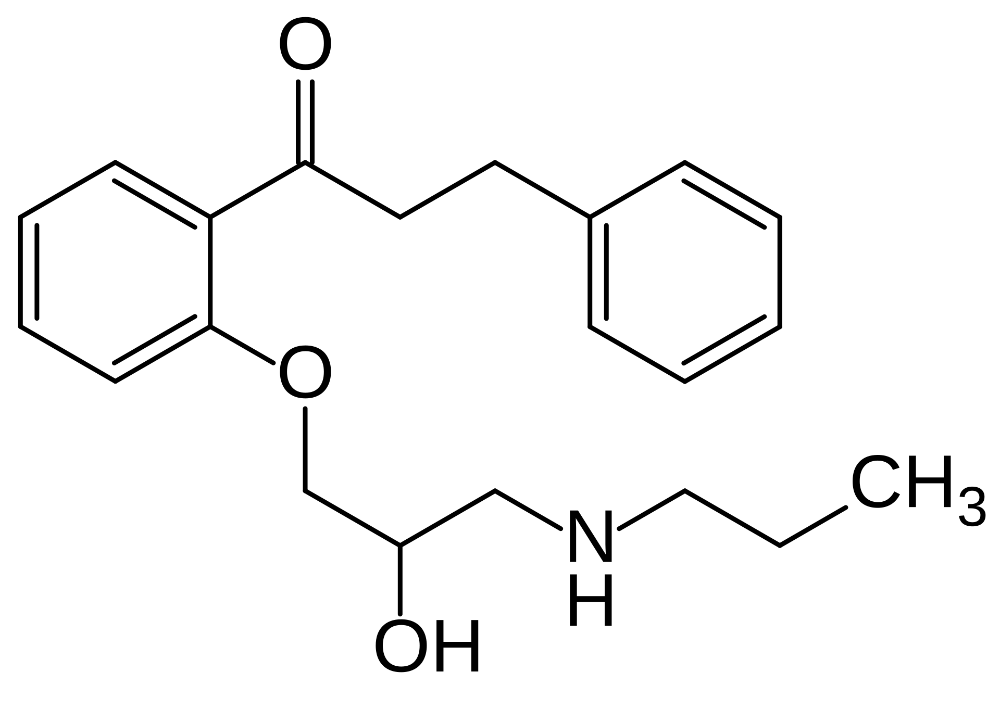
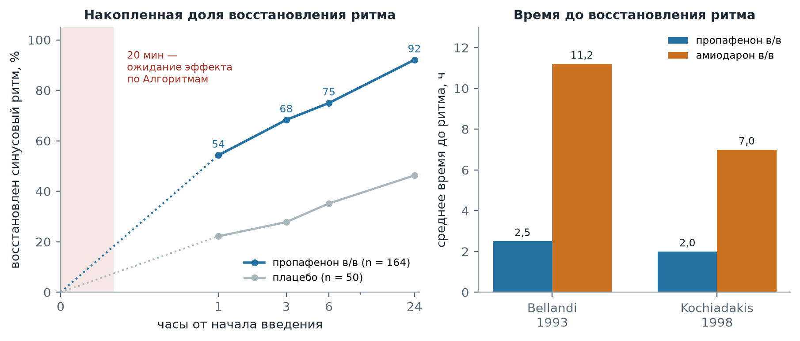

  
Фармакология укладки

  
Пропафенон

  
Антиаритмический препарат класса IC для фармакологической кардиоверсии фибрилляции предсердий: механизм, место среди антиаритмиков, скорость восстановления ритма в сравнении с амиодароном, ограничения применения

  

  
Разбор препарата от механизма к дозе. Дозы приведены в соответствии с приказом Департамента здравоохранения г. Москвы № 535 от 18.05.2023.

  
Серия «Крещение поворотом» · версия 1.0 · 8 октября 2026 · CC BY-NC-SA 4.0

Пропафенон — блокатор быстрых натриевых каналов, отнесённый к классу IC классификации Вогана — Уильямса, со слабым β-адреноблокирующим действием. На догоспитальном этапе в Москве он входит в число трёх препаратов фармакологической кардиоверсии пароксизма фибрилляции и трепетания предсердий давностью менее 48 часов — вместе с прокаинамидом и амиодароном — и является из них препаратом с наиболее быстрым наступлением эффекта при сохранной функции левого желудочка.

> **Слово бригаде:** «Мы тут вводили пропафенон женщине с пароксизмальной ФП. До этого ей делали только амиодарон, и восстанавливалась она через два раза на третий, очень сложно, несколько раз её стреляли. Вен почти не было, ставили в ногу, в подкожную в итоге. Доктор тогда сказал, что амиодарон жжёт вены. А мы сделали пропафенон — и на половине банки восстановили синус.» — *Ю.Н.*

Разбор случая приведён в конце материала.

# История создания

Пропафенон синтезирован в фармацевтической компании Helopharm W. Petrik & Co. (Западный Берлин) в ряду 2′-(2-гидрокси-3-алкиламинопропокси)-β-фенилпропиофенонов; соединения ряда защищены патентом ФРГ № 2 001 431. При исследовании на изолированном сердце морской свинки все соединения ряда увеличивали коронарный кровоток, однако антиаритмическое действие обнаружило только производное с н-пропиламиногруппой, получившее название пропафенон. Антиаритмический эффект на экспериментальных моделях аритмий у собак, кошек и кроликов при внутривенном (1 мг/кг) и пероральном (2–10 мг/кг) введении описан H. J. Hapke и E. Prigge (*Arzneimittelforschung*, 1976). Препарат применяется в ФРГ под торговым наименованием Rytmonorm с конца 1970-х годов; в США одобрен в 1989 году.

<figure>

<figcaption>Рис. 1. Структурная формула пропафенона: 2′-[2-гидрокси-3-(пропиламино)пропокси]-3-фенилпропиофенон. Арилоксипропаноламиновая цепь с вторичной аминогруппой, аналогичная цепи β-адреноблокаторов, объясняет β-блокирующее действие молекулы; фенилпропиофеноновый фрагмент несёт мембраностабилизирующее действие. Атом углерода, связанный с гидроксильной группой, асимметричен: препарат применяется в виде рацемата.</figcaption>
</figure>

Структурное сходство с β-адреноблокаторами определяет двойственность фармакологического профиля: молекула сочетает свойства местного анестетика и блокатора натриевых каналов со слабой β-адреноблокадой. Энантиомеры различаются по второму свойству: β-адреноблокирующей активностью обладает преимущественно S-энантиомер, тогда как натрий-блокирующее действие у обоих энантиомеров сопоставимо.

# Что находится в ампуле

Пропафенон 0,35 % — раствор объёмом 10 мл содержит **35 мг** действующего вещества (**3,5 мг/мл**) (Алгоритмы, приложение 44, внутренняя страница 437). В Российской Федерации раствор для внутривенного введения зарегистрирован под торговым наименованием Пропанорм (PRO.MED.CS Praha, Чешская Республика).

Вспомогательным веществом является декстрозы моногидрат (48,5 мг/мл), которым раствор доводится до изотонической осмолярности (инструкция по применению Пропанорма; Fachinformation Rytmonorm). Иных сорастворителей, консервантов и поверхностно-активных веществ раствор не содержит. Для разведения допускается только раствор декстрозы 5 %: при смешивании с натрия хлоридом 0,9 % возможно образование осадка, зависящее от температуры и концентрации. Разведённый в декстрозе 5 % раствор химически стабилен 72 часа при 25 °C, однако с микробиологической точки зрения используется немедленно.

При массе тела 70 кг доза 1,5–2 мг/кг составляет 105–140 мг, то есть 30–40 мл раствора — три-четыре ампулы.

# Механизм действия

## Блокада быстрых натриевых каналов

Пропафенон блокирует быстрые натриевые каналы кардиомиоцитов и уменьшает скорость нарастания и амплитуду фазы 0 потенциала действия. Следствием является дозозависимое замедление проведения в предсердиях, атриовентрикулярном узле, системе Гиса — Пуркинье, рабочем миокарде желудочков и дополнительных путях проведения; рефрактерный период предсердий, атриовентрикулярного узла, желудочков и дополнительных путей удлиняется. Электрофизиологические эффекты более выражены в ишемизированном миокарде, чем в интактном.

Отличительный признак класса IC — медленная кинетика связывания с каналом и отсоединения от него. Препарат не успевает освободить канал между сокращениями, и блокада накапливается тем сильнее, чем выше частота: эффект зависит от частоты (use-dependence). При тахиаритмии замедление проведения выражено больше, чем при синусовом ритме. На электрокардиограмме это проявляется удлинением интервала PQ и расширением комплекса QRS; интервал QT изменяется незначительно и в основном за счёт расширения QRS. Расширение QRS является маркёром насыщения натриевых каналов и служит критерием прекращения введения.

Прекращение фибрилляции предсердий связывают с замедлением проведения и удлинением рефрактерности в предсердиях: длина волны возбуждения увеличивается, и множественные волны re-entry перестают помещаться в массе предсердного миокарда. Тот же механизм лежит в основе нежелательного эффекта: при замедлении предсердного проведения фибрилляция может организоваться в трепетание предсердий с удлинённым циклом, который атриовентрикулярный узел способен проводить 1:1 (раздел «Ограничения применения»).

## β-адреноблокирующий компонент и полиморфизм CYP2D6

Пропафенон метаболизируется в печени преимущественно изоферментом CYP2D6 до активного метаболита 5-гидроксипропафенона, не обладающего β-блокирующим действием; вспомогательные пути (CYP3A4, CYP1A2) образуют N-депропилпропафенон. Активность CYP2D6 определена генетически: у менее чем 10 % пациентов европеоидной популяции метаболизм медленный, и 5-гидроксипропафенон не образуется или образуется в незначительных количествах. У таких пациентов концентрация исходного вещества выше, период полувыведения удлиняется до 17 часов против 2,8–11 часов при быстром метаболизме, и β-адреноблокада становится клинически значимой: в исследовании Lee et al. (*New England Journal of Medicine*, 1990) снижение нагрузочной тахикардии при приёме пропафенона определялось типом метаболизма по CYP2D6.

Клиническое значение β-блокирующего компонента двояко. Он дополнительно замедляет проведение через атриовентрикулярный узел и частично защищает от проведения 1:1 при трепетании; одновременно он обусловливает противопоказание при тяжёлой обструктивной болезни лёгких и осторожность при бронхиальной астме.

## Фармакокинетика

| Параметр | Значение |
|---|---|
| Максимальная концентрация при внутривенном введении | В течение первой минуты |
| Биодоступность при приёме внутрь | 5–50 %, нелинейно возрастает с дозой вследствие насыщения пресистемного метаболизма |
| Начало действия при приёме внутрь | Через 1 ч, максимум через 2–3 ч, продолжительность 8–12 ч |
| Объём распределения | 3–4 л/кг |
| Связывание с белками плазмы | 85–97 % |
| Период полувыведения | 2,8–11 ч при быстром метаболизме; около 17 ч при медленном |
| Метаболизм | Печёночный: CYP2D6, CYP3A4, CYP1A2; активные метаболиты 5-гидроксипропафенон и N-депропилпропафенон |
| Выведение | С желчью 53 %, почками 38 % в виде метаболитов; менее 1 % в неизменённом виде |

Источник: инструкция по применению Пропанорма. Через плаценту препарат проникает ограниченно: концентрация в пуповинной крови составляет около 30 % материнской. При печёночной недостаточности выведение снижается, и возможна кумуляция при обычных дозах.

# Место в ряду антиаритмических препаратов

## Классификация

| Класс по Вогану — Уильямсу | Основной механизм | Препараты, применяемые в Российской Федерации |
|---|---|---|
| IA | Блокада натриевых каналов с промежуточной кинетикой и удлинением реполяризации | Прокаинамид |
| IB | Блокада натриевых каналов с быстрой кинетикой, укорочение реполяризации | Лидокаин |
| IC | Блокада натриевых каналов с медленной кинетикой, выраженное замедление проведения без существенного изменения реполяризации | Пропафенон, лаппаконитина гидробромид (Аллапинин), этацизин |
| II | Блокада β-адренорецепторов | Метопролол, эсмолол, пропранолол |
| III | Блокада калиевых каналов, удлинение реполяризации | Амиодарон (свойства всех четырёх классов), соталол, кавутилид (Рефралон) |
| IV | Блокада кальциевых каналов L-типа | Верапамил, дилтиазем |

В обновлённой классификации (Lei et al., *Circulation*, 2018) класс IC сохранён в прежнем определении. Пропафенон занимает в нём промежуточное положение между «чистыми» блокаторами натриевых каналов и препаратами со смешанным действием за счёт β-адреноблокирующего компонента. Флекаинид — второй препарат класса IC, на котором основана бо́льшая часть международных данных, — в Российской Федерации не зарегистрирован.

## Препараты фармакологической кардиоверсии фибрилляции предсердий

| Препарат | Доза и путь | Доля восстановления ритма и время | Основные ограничения |
|---|---|---|---|
| Пропафенон | 1,5–2 мг/кг в/в за 10 мин | 43–89 %, до 6 ч | Выраженная гипертрофия левого желудочка, сердечная недостаточность со сниженной фракцией выброса, ишемическая болезнь сердца, синдром Бругада, нарушения проводимости |
| Пропафенон | 450–600 мг внутрь однократно | 45–55 % через 3 ч, 69–78 % через 8 ч | То же |
| Флекаинид | 1–2 мг/кг в/в за 10 мин | 52–95 %, до 6 ч | То же; в Российской Федерации не зарегистрирован |
| Амиодарон | 300 мг в/в за 30–60 мин, далее 900–1200 мг за 24 ч | 44 %, от 8–12 ч до нескольких суток | Флебит, гипотензия, брадикардия, удлинение QT, тиреотоксикоз, взаимодействия |
| Вернакалант | 3 мг/кг в/в за 10 мин, повторно 2 мг/кг | 50 % в течение 10 мин | Гипотензия, недавний острый коронарный синдром, сердечная недостаточность III–IV ФК, аортальный стеноз; в Российской Федерации не зарегистрирован |
| Ибутилид | 1 мг в/в за 10 мин, повторно | 31–51 % за 30–90 мин | Риск пируэтной тахикардии, мониторинг не менее 4 ч; в Российской Федерации не зарегистрирован |

Источник: ESC 2024, таблица 13 (Van Gelder et al., *European Heart Journal*, 2024). Прокаинамид в таблицу ESC не включён; в рандомизированном исследовании RAFF2 (Stiell et al., *Lancet*, 2020) внутривенный прокаинамид восстановил синусовый ритм у 52 % пациентов с фибрилляцией предсердий в отделении неотложной помощи. При интерпретации всех показателей учитывается, что пароксизм давностью менее 48 часов прекращается спонтанно у 10–18 % пациентов в первые 3 часа и у 55–66 % в течение 24 часов (ESC 2024).

Метаанализ ESC 2024 оценивает препараты класса IC как превосходящие амиодарон по доле восстановления ритма в первые 12 часов; эффективность амиодарона реализуется отсроченно, в пределах 24 часов. Метаанализ Chevalier et al. (*Journal of the American College of Cardiology*, 2003) показал то же соотношение: в первые 8 часов препараты класса IC восстанавливают ритм чаще амиодарона, к 24 часам различие исчезает.

<figure>

<figcaption>Рис. 2. Скорость восстановления синусового ритма. Слева — накопленная доля восстановления ритма при внутривенном пропафеноне (n = 164) и плацебо (n = 50) через 1, 3, 6 и 24 часа (Romano et al., 2001); отрезок от 0 до 1 часа не измерялся и показан пунктиром, заливкой выделен 20-минутный интервал ожидания эффекта по Алгоритмам ДЗМ. Справа — среднее время до восстановления ритма при внутривенном пропафеноне и амиодароне в двух рандомизированных исследованиях (Bellandi et al., 1993; Kochiadakis et al., 1998).</figcaption>
</figure>

В исследовании Bellandi et al. (*Giornale Italiano di Cardiologia*, 1993; 196 пациентов) ритм восстановлен у 90,8 % пациентов при пропафеноне и у 80,6 % при амиодароне (различие незначимо), однако среднее время до восстановления составило 2,5 ± 2,8 часа против 11,2 ± 4,3 часа (p < 0,0005). В плацебо-контролируемом исследовании Kochiadakis et al. (*Pacing and Clinical Electrophysiology*, 1998; 143 пациента) доля восстановления составила 78,2 % при пропафеноне, 83,3 % при амиодароне и 55,1 % при плацебо, среднее время — 2 ± 3, 7 ± 5 и 13 ± 9 часов соответственно; у двух пациентов группы пропафенона введение прекращено из-за избыточного расширения QRS. В обоих исследованиях восстановлению ритма препятствовали увеличенный размер левого предсердия и большая давность аритмии.

## Положение в клинических руководствах

| Руководство | Позиция пропафенона |
|---|---|
| ESC 2024 | Внутривенный флекаинид или пропафенон рекомендован для фармакологической кардиоверсии фибрилляции предсердий недавнего начала, за исключением пациентов с выраженной гипертрофией левого желудочка, сердечной недостаточностью со сниженной фракцией выброса и ишемической болезнью сердца (класс I, уровень A). Однократный самостоятельный приём внутрь («таблетка в кармане») — у отобранных пациентов с редкими пароксизмами после оценки эффективности и безопасности (класс IIa, уровень B). Длительный приём — для профилактики рецидивов при тех же исключениях (класс I, уровень A) |
| ESC 2024, амиодарон | Внутривенный амиодарон рекомендован при выраженной гипертрофии левого желудочка, сердечной недостаточности со сниженной фракцией выброса и ишемической болезни сердца с допущением отсроченного восстановления ритма (класс I, уровень A) |
| ESC 2024, сопутствующая терапия | При длительном приёме флекаинида или пропафенона рекомендуется сочетание с β-адреноблокатором, дилтиаземом или верапамилом для предупреждения проведения 1:1 при трансформации в трепетание предсердий (класс IIa, уровень C) |
| Алгоритмы ДЗМ (приказ № 535) | Препарат первого ряда наравне с прокаинамидом при пароксизме давностью менее 48 часов, отсутствии сердечной недостаточности и QRS менее 0,12 с; амиодарон — при противопоказаниях к ним |

Источники: Van Gelder et al., *European Heart Journal*, 2024, стр. 3356, 3358; Алгоритмы, внутренняя страница 47.

Порядок выбора в Алгоритмах ДЗМ совпадает с логикой ESC 2024: решающим критерием является наличие структурного заболевания сердца. Препараты класса IC применяются при сохранной функции левого желудочка, амиодарон — при её нарушении, когда отсроченное наступление эффекта принимается как цена безопасности.

# Дозы по Алгоритмам ДЗМ

Основание: приказ ДЗМ г. Москвы № 535 от 18.05.2023, раздел «Кардиология», I48 «Фибрилляция — трепетание предсердий», внутренняя страница 47.

| Клиническая ситуация | Доза и способ введения |
|---|---|
| Пароксизм фибрилляции или трепетания предсердий давностью менее 48 часов, в том числе впервые возникший; отсутствие сердечной недостаточности; QRS менее 0,12 с | **1,5–2 мг/кг (0,4–0,6 мл/кг)** в/в капельно или через шприцевой дозатор в разведении декстрозой 5 % в течение **10 минут**; альтернатива — прокаинамид 500–1000 мг в/в в разведении натрия хлоридом 0,9 % в течение 20 минут |
| Противопоказания к пропафенону и прокаинамиду | Амиодарон 5 мг/кг (максимум 450 мг) в 250 мл декстрозы 5 % в/в капельно |
| Ожидание эффекта | Не более 20 минут |
| Антикоагуляция | Гепарин натрия 5000 МЕ в/в или эноксапарин натрия 1 мг/кг п/к; при приёме антикоагулянтов гепарин не вводится |
| Давность более 48 часов или неуточнённая | Пропафенон не применяется; при неосложнённой тахисистолии — урежение частоты (метопролол, эсмолол, пропранолол, верапамил) |

| Масса тела, кг | 1,5 мг/кг | 2 мг/кг |
|---|---|---|
| 50 | 75 мг — 21 мл | 100 мг — 29 мл |
| 60 | 90 мг — 26 мл | 120 мг — 34 мл |
| 70 | 105 мг — 30 мл | 140 мг — 40 мл |
| 80 | 120 мг — 34 мл | 160 мг — 46 мл |
| 90 | 135 мг — 39 мл | 180 мг — 51 мл |
| 100 | 150 мг — 43 мл | 200 мг — 57 мл |

Объём раствора рассчитан по концентрации 3,5 мг/мл и округлён до целого миллилитра. Объём разведения Алгоритмами не регламентирован. При разведении дозы декстрозой 5 % до 50 мл в шприце дозатора скорость 300 мл/ч обеспечивает введение за 10 минут. Максимальная суточная доза по инструкции — 560 мг; при отсутствии эффекта инструкция допускает повторное введение той же дозы через 90–120 минут, что выходит за пределы временно́го интервала догоспитального этапа.

Введение проводится под непрерывным мониторингом электрокардиограммы и артериального давления. По инструкции инфузия немедленно прекращается при расширении QRS на 25 % и более, значительном изменении частоты сердечных сокращений или удлинении QT более чем на 20 %. Электроды дефибриллятора при введении препарата класса IC находятся в готовности: сценарий проведения трепетания 1:1 развивается в пределах минут.

В детском разделе Алгоритмов пропафенон не предусмотрен; по инструкции Пропанорма применение до 18 лет противопоказано, поскольку эффективность и безопасность не установлены.

# Нежелательные реакции

## Профиль безопасности

У пациентов без структурного заболевания сердца кратковременное внутривенное введение для кардиоверсии переносится удовлетворительно: в исследовании Romano et al. нежелательные реакции отмечены приблизительно у 10 % пациентов в группах пропафенона и флекаинида и у 4 % в группе плацебо, злокачественных желудочковых аритмий не зарегистрировано. Безопасность препаратов класса IC определяется отбором пациентов: при структурном заболевании сердца соотношение риска и пользы меняется на противоположное.

Основание для этого ограничения получено в исследовании CAST (Echt et al., *New England Journal of Medicine*, 1991). У пациентов, перенёсших инфаркт миокарда, подавление бессимптомной желудочковой эктопии препаратами класса IC энкаинидом и флекаинидом сопровождалось ростом общей смертности до 7,7 % против 3,0 % при плацебо (56 из 730 и 22 из 725 пациентов) за счёт аритмической смерти. Пропафенон в CAST не изучался, однако результаты распространены на весь класс: применение при ишемической болезни сердца и сниженной сократимости левого желудочка исключено.

## Сердечно-сосудистые реакции

**Нарушения проводимости** — очень частая реакция: удлинение PQ, расширение QRS, синоатриальная и атриовентрикулярная блокада, блокада ножек пучка Гиса. Расширение QRS служит количественным критерием прекращения введения.

**Трансформация фибрилляции в трепетание предсердий с проведением 2:1 или 1:1** с частотой желудочковых сокращений более 180 в минуту. Механизм рассмотрен выше. При проведении 1:1 комплексы QRS дополнительно расширяются из-за частотно-зависимой блокады, и картина имитирует желудочковую тахикардию.

**Брадикардия и артериальная гипотензия** — следствие отрицательного инотропного действия и β-адреноблокады; вероятность возрастает при исходной дисфункции синусового узла и после ранее введённых средств, замедляющих проведение.

**Проаритмическое действие** — желудочковая тахикардия и фибрилляция желудочков; риск сосредоточен у пациентов со структурным заболеванием сердца.

**Ухудшение течения сердечной недостаточности** у пациентов со сниженной сократительной функцией левого желудочка.

## Внесердечные реакции

Головокружение (очень часто), нарушение вкусовых ощущений с металлическим привкусом, сухость во рту, диспепсия, нечёткость зрения, бронхоспазм как следствие β-адреноблокады. Реакции в месте инъекции и флебит в перечне нежелательных реакций инструкции не приводятся.

## Беременность

Адекватных контролируемых исследований у беременных не проводилось; применение возможно, когда ожидаемая польза превышает риск для плода, особенно в I триместре (инструкция Пропанорма). ESC 2024 допускает длительный приём флекаинида или пропафенона при беременности, если препараты, урежающие частоту, неэффективны или плохо переносятся (класс IIb, уровень C). Пропафенон выделяется с грудным молоком.

# Ограничения применения

## Противопоказания

По инструкции Пропанорма внутривенное введение противопоказано при:

- синдроме Бругада;
- синдроме слабости синусового узла, синоатриальной и атриовентрикулярной блокаде II–III степени, внутрижелудочковых блокадах и блокаде ножек пучка Гиса у пациентов без электрокардиостимулятора;
- удлинении интервала QT и одновременном приёме препаратов, удлиняющих QT;
- остром коронарном синдроме;
- тяжёлой брадикардии и тяжёлой артериальной гипотензии;
- выраженных нарушениях водно-электролитного баланса, в том числе калиевого;
- тяжёлой хронической обструктивной болезни лёгких;
- значительных органических изменениях миокарда, в том числе хронической сердечной недостаточности с фракцией выброса левого желудочка менее 35 %;
- кардиогенном шоке, за исключением аритмического;
- миастении;
- одновременном применении ритонавира;
- возрасте до 18 лет.

## Синдром Бругада

Блокада натриевого тока подавляет фазу 0 потенциала действия в эпикарде выносящего тракта правого желудочка и способна выявить скрытый синдром Бругада с характерным подъёмом сегмента ST в V1–V2 и спровоцировать фибрилляцию желудочков. Препараты класса IC используются для диагностической провокации синдрома и относятся к перечню средств, которых следует избегать при этом синдроме (brugadadrugs.org). Седловидный подъём ST в правых грудных отведениях, обмороки и внезапная смерть родственников в молодом возрасте исключают введение пропафенона.

## Трепетание предсердий и ширина QRS

Препараты класса IC для кардиоверсии трепетания предсердий ESC не рекомендует. Условие Алгоритмов о QRS менее 0,12 с исключает введение пропафенона при исходной блокаде ножек пучка Гиса, при широком QRS на фоне ранее принятого препарата класса IC (например, лаппаконитина гидробромида) и при тахикардии с широкими комплексами неуточнённого генеза. Сочетание двух препаратов класса IC не допускается: суммация замедления проведения создаёт условия для проведения трепетания 1:1.

## Фибрилляция предсердий с предвозбуждением

Инструкция допускает применение при наджелудочковых тахикардиях на фоне синдрома WPW: пропафенон удлиняет рефрактерный период дополнительного пути. Для фибрилляции предсердий с предвозбуждением ESC 2024 рекомендует ибутилид или флекаинид, а пропафенон — с осторожностью из-за его влияния на атриовентрикулярный узел; амиодарона при этом следует избегать из-за отсроченного действия. Широкая нерегулярная тахикардия с меняющейся формой комплексов на догоспитальном этапе относится к показаниям для электрической кардиоверсии.

## Лекарственные взаимодействия

| Препарат или группа | Результат взаимодействия |
|---|---|
| β-адреноблокаторы, верапамил, дилтиазем | Суммация отрицательного хроно-, дромо- и инотропного действия; одновременно — защита от проведения 1:1 при длительной терапии |
| Метопролол, пропранолол | Рост их концентрации вследствие конкуренции за CYP2D6 |
| Другие антиаритмики класса I, амиодарон | Нарушения проводимости и реполяризации, проаритмическое действие |
| Местные анестетики (лидокаин) | Усиление побочного действия на проводимость |
| Дигоксин | Рост концентрации дигоксина; доза снижается на 25 % |
| Варфарин, фенпрокумон | Усиление антикоагуляции, контроль протромбинового времени |
| Ингибиторы CYP2D6 и CYP3A4 (хинидин, флуоксетин, пароксетин, кетоконазол, эритромицин, циметидин), грейпфрутовый сок | Рост концентрации пропафенона |
| Ритонавир | Противопоказан |
| Рифампицин | Снижение концентрации и эффективности пропафенона |
| Препараты, удлиняющие QT (фенотиазины, трициклические антидепрессанты, макролиды) | Сочетание не рекомендуется |

Источник: инструкция по применению Пропанорма.

# Возвращение к клиническому случаю

**Соответствие выбора препарата алгоритму.** Алгоритмы ДЗМ ставят пропафенон и прокаинамид в первый ряд при пароксизме давностью менее 48 часов, отсутствии сердечной недостаточности и QRS менее 0,12 с; амиодарон предусмотрен при противопоказаниях к ним. Предшествующие эпизоды у этой пациентки купировались амиодароном — препаратом, который алгоритм отводит на случай противопоказаний к препаратам первого ряда.

**Отсроченное действие амиодарона и электрическая кардиоверсия.** Амиодарон восстанавливает ритм при фибрилляции предсердий недавнего начала в течение 8–12 часов и более (ESC 2024), в рандомизированных исследованиях среднее время составило 7–11 часов. Алгоритм ограничивает ожидание эффекта 20 минутами. Внутри этого интервала вероятность восстановления ритма амиодароном мала, и эпизоды, не купированные медикаментозно, переходят к электрической кардиоверсии. Описанная бригадой последовательность — восстановление ритма амиодароном в одном случае из трёх и повторные разряды — согласуется с фармакокинетикой препарата и не требует предположения об индивидуальной резистентности пациентки к лечению.

**Восстановление ритма на половине инфузии.** Максимальная концентрация пропафенона при внутривенном введении достигается в течение первой минуты. Восстановление ритма во время введения около половины подготовленного раствора соответствует, при расчёте дозы 1,5–2 мг/кг, приблизительно 0,75–1 мг/кг. Ранняя конверсия согласуется с опубликованными данными: в исследовании Romano et al. ритм восстановлен у 54 % пациентов в течение первого часа, а среднее время в двух сравнительных исследованиях с амиодароном составило 2–2,5 часа.

**Венозный доступ и раздражающее действие амиодарона.** Высказывание врача о том, что амиодарон «жжёт вены», соответствует документированной нежелательной реакции. В систематическом обзоре 20 исследований (Oragano et al., *Critical Care Nurse*, 2019) частота флебита при периферическом введении амиодарона составила от 0 до 85 %, и она возрастала с концентрацией раствора (с 1,2 до 1,8 мг/мл) и с суммарной дозой выше 1 г. В проспективном исследовании Brørs et al. (*European Journal of Cardiovascular Nursing*, 2023; 124 пациента) флебит развился у 44 %, причём у половины из них — уже после окончания инфузии. ESC 2024 указывает на необходимость введения амиодарона в крупную периферическую вену. Раздражающее действие связывают с самим веществом и с сорастворителями — полисорбатом 80 и бензиловым спиртом (материал серии «Амиодарон»). Раствор пропафенона изотоничен за счёт декстрозы и сорастворителей не содержит; флебит в перечне его нежелательных реакций не приводится. Катетеризация вен нижней конечности у взрослых сопряжена с более высоким риском тромбофлебита и тромбоза, чем вен верхней конечности, и рассматривается как вынужденная мера при отсутствии иного доступа (Infusion Nurses Society, 2021).

**Тактика, следующая из наблюдения.** Повторяющиеся пароксизмы фибрилляции предсердий с необходимостью электрической кардиоверсии являются основанием для планового обращения к кардиологу. ESC 2024 рассматривает у пациентов без структурного заболевания сердца длительный приём флекаинида или пропафенона, а при редких пароксизмах — стратегию однократного самостоятельного приёма после проверки эффективности и безопасности в стационаре, а также катетерную аблацию. Задокументированное восстановление ритма пропафеноном относится к сведениям, значимым для этого решения, и фиксируется в карте вызова.

# Сверка доз

| Параметр | Значение | Источник |
|---|---|---|
| Содержание в ампуле | 0,35 % — 10 мл: 35 мг (3,5 мг/мл) | Алгоритмы, приложение 44, стр. 437 |
| Доза при фибрилляции предсердий менее 48 ч | 1,5–2 мг/кг (0,4–0,6 мл/кг) за 10 мин | Алгоритмы, стр. 47 |
| Растворитель | Декстроза 5 %; натрия хлорид 0,9 % — осадок | Алгоритмы, стр. 47; инструкция Пропанорма |
| Условия применения | Отсутствие сердечной недостаточности, QRS менее 0,12 с | Алгоритмы, стр. 47 |
| Ожидание эффекта | Не более 20 мин | Алгоритмы, стр. 47 |
| Критерий прекращения введения | Расширение QRS на 25 % и более, удлинение QT более чем на 20 % | Инструкция Пропанорма |
| Максимальная суточная доза | 560 мг | Инструкция Пропанорма |
| Доза ESC | 1,5–2 мг/кг в/в за 10 мин; 450–600 мг внутрь однократно | ESC 2024, таблица 13 |

# Источники

- Алгоритмы оказания скорой и неотложной медицинской помощи. Приказ ДЗМ г. Москвы № 535 от 18.05.2023 — раздел «Кардиология» (I48), приложение 44.
- Пропанорм (пропафенона гидрохлорид), раствор для внутривенного введения 3,5 мг/мл. Инструкция по медицинскому применению; PRO.MED.CS Praha a.s. — фармакокинетика, режим дозирования, противопоказания, побочное действие, взаимодействия, несовместимость с раствором натрия хлорида.
- Rytmonorm Injektionslösung. Fachinformation — состав раствора и изотоничность за счёт глюкозы, несовместимость с физиологическим раствором.
- Van Gelder I.C., Rienstra M., Bunting K.V. et al. 2024 ESC Guidelines for the management of atrial fibrillation developed in collaboration with EACTS. *European Heart Journal*, 2024; 45(36): 3314–3414 — рекомендации по фармакологической кардиоверсии, таблица 13.
- Hapke H.J., Prigge E. Zur Pharmakologie des Antiarrhythmikums Propafenon. *Arzneimittelforschung*, 1976; 26(10): 1849–1857 — первое описание антиаритмического действия.
- Lee J.T., Kroemer H.K., Silberstein D.J. et al. The role of genetically determined polymorphic drug metabolism in the beta-blockade produced by propafenone. *New England Journal of Medicine*, 1990; 322: 1764–1768.
- Lei M., Wu L., Terrar D.A., Huang C.L.-H. Modernized classification of cardiac antiarrhythmic drugs. *Circulation*, 2018; 138: 1879–1896.
- Bellandi F., Cantini F., Pedone T. et al. The efficacy of intravenous propafenone and amiodarone in the conversion of recent-onset atrial fibrillation. A 1-year follow-up with oral treatment. *Giornale Italiano di Cardiologia*, 1993; 23(3): 261–271 — 196 пациентов.
- Kochiadakis G.E., Igoumenidis N.E., Simantirakis E.N. et al. Intravenous propafenone versus intravenous amiodarone in the management of atrial fibrillation of recent onset: a placebo-controlled study. *Pacing and Clinical Electrophysiology*, 1998; 21: 2475–2479 — 143 пациента.
- Romano S., Fattore L., Toscano G. et al. Effectiveness and side effects of the treatment with propafenone and flecainide for recent-onset atrial fibrillation. *Italian Heart Journal Supplement*, 2001; 2(1): 41–45 — 352 пациента.
- Chevalier P., Durand-Dubief A., Burri H. et al. Amiodarone versus placebo and class Ic drugs for cardioversion of recent-onset atrial fibrillation: a meta-analysis. *Journal of the American College of Cardiology*, 2003; 41: 255–262.
- Stiell I.G., Sivilotti M.L.A., Taljaard M. et al. Electrical versus pharmacological cardioversion for emergency department patients with acute atrial fibrillation (RAFF2). *Lancet*, 2020; 395: 339–349.
- Echt D.S., Liebson P.R., Mitchell L.B. et al. Mortality and morbidity in patients receiving encainide, flecainide, or placebo. The Cardiac Arrhythmia Suppression Trial. *New England Journal of Medicine*, 1991; 324: 781–788.
- Oragano C.A., Patton D., Moore Z. Phlebitis in intravenous amiodarone administration: incidence and contributing factors. *Critical Care Nurse*, 2019; 39(1): e1–e12.
- Brørs G., Gjeilo K.H., Lund T. et al. Amiodarone-induced phlebitis: incidence and adherence to a clinical practice guideline. *European Journal of Cardiovascular Nursing*, 2023.
- Gorski L.A., Hadaway L., Hagle M.E. et al. Infusion Therapy Standards of Practice, 8th Edition. *Journal of Infusion Nursing*, 2021; 44(1S): S1–S224 — выбор вены для периферического катетера.
- Brugada Drugs: перечень препаратов, которых следует избегать при синдроме Бругада (brugadadrugs.org).
- Материалы серии «Крещение поворотом»: «Амиодарон», «Трепетание и аллапинин».

# Источники иллюстраций

| Файл | Что изображено | Источник и лицензия |
|---|---|---|
| `formula.png` | Структурная формула пропафенона | Wikimedia Commons, файл Propafenone.svg, автор Snubcube; общественное достояние (структурные формулы химических соединений не являются объектом авторского права) |
| `skorost_vosstanovleniya.png` | Накопленная доля восстановления ритма при пропафеноне и плацебо; время до восстановления ритма при пропафеноне и амиодароне | Собственная схема по данным Romano et al., 2001; Bellandi et al., 1993; Kochiadakis et al., 1998 |

Схема построена скриптом `images/postroit.py`.

# Выходные данные

**Материал:** «Пропафенон». Версия 1.0 от 8 октября 2026.

**Серия:** «Крещение поворотом» — клинические разборы догоспитальной практики. Раздел «Фармакология укладки».

**Лицензия:** текст — Creative Commons «С указанием авторства — Некоммерческая — С сохранением условий» 4.0 (CC BY-NC-SA 4.0). Копировать, печатать и раздавать коллегам можно свободно; продавать — нельзя.

**Оговорка.** Материал носит учебный характер. Он не является нормативным документом, не заменяет действующие протоколы, клинические рекомендации и распоряжения службы и не может использоваться как единственное основание для клинического решения. Дозы, показания и маршрутизацию необходимо проверять по действующим первоисточникам. Ответственность за клинические решения несёт медицинский работник, а не автор материала.

**О клинических случаях.** Случаи обезличены: нет имён, дат вызовов, адресов, номеров карт вызова, названий стационаров, бытовые детали изменены. Совпадения с чужой практикой возможны и неизбежны.

**Нашли ошибку?** Сообщить можно через раздел Issues репозитория проекта; исправление выходит новой версией, а изменение фиксируется в журнале изменений.
