

  
Учебный материал

  
Аппарат ИВЛ Comen V1

  
Устройство, подготовка к работе, режимы вентиляции, уставки и сигналы тревоги

  

  
Транспортный турбинный аппарат искусственной вентиляции лёгких: органы управления и порты, питание и газоснабжение, сборка дыхательного контура, обязательная проверка перед работой, ввод пациента и расчёт производных уставок от идеальной массы тела, восемь режимов вентиляции с перечнем задаваемых параметров, полные диапазоны и шаги уставок, система сигналов тревоги с пределами по умолчанию и действиями по каждому сигналу, автоматические защитные состояния аппарата. Сводный порядок действий от включения до начала вентиляции — в конце материала.

  
Серия «Крещение поворотом» · версия 1.0 · 23 сентября 2026 · CC BY-NC-SA 4.0

Материал составлен по руководству по эксплуатации аппарата искусственной вентиляции лёгких V1 (Shenzhen Comen Medical Instruments Co., Ltd., Китай; редакция 2022.05, издание на русском языке 2023 г., 269 страниц). Ссылки вида «РЭ, стр. N» указывают страницу этого руководства. Числовые значения сверены с изображениями соответствующих страниц, поскольку распознанный текст руководства искажает цифры.

Порядок изложения соответствует последовательности действий у аппарата: устройство и порты, питание и газ, сборка контура, проверка, ввод пациента, выбор режима, уставки, сигналы тревоги. Разделы о режимах и об уставках содержат полные перечни параметров и диапазонов и предназначены для обращения к ним во время работы, а не для однократного прочтения.

# Назначение и границы применения

Изделие предназначено для вентиляции лёгких положительным давлением и для мониторинга SpO₂ и CO₂ у взрослых, детей и новорождённых. Область применения по руководству — отделения интенсивной терапии и послеоперационной реанимации, отделения неотложной медицинской помощи, учреждения первичной и неотложной помощи, а также транспортировка пациентов внутри медицинского учреждения и за его пределами (РЭ, стр. 32).

Группа пациентов определяется ростом от 30 до 250 см и идеальной массой тела от 3 до 139 кг (РЭ, стр. 98). При массе выше 139 кг дыхательный объём, частота дыхания и частота при апноэ устанавливаются оператором самостоятельно, автоматический расчёт для этого диапазона не предусмотрен (РЭ, стр. 32).

| Номинальная группа | Диапазон массы | Дыхательный контур |
|---|---|---|
| Взрослый | 10–139 кг | Для взрослых |
| Детский | 3–35 кг | Для взрослых, для детей или для новорождённых |
| Новорождённый | 3–15 кг | Для детей или для новорождённых |

Источник: РЭ, стр. 99. Взрослые пациенты вентилируются только контурами для детей и взрослых, новорождённые — только контурами для детей и новорождённых (РЭ, стр. 47).

Применение исключено при гипербарической оксигенации: использование в барокамере способно причинить вред пациенту и повредить изделие (РЭ, стр. 39). Неинвазивная вентиляция не применяется у пациентов без спонтанного дыхания и с нерегулярным спонтанным дыханием, а также у интубированных пациентов (РЭ, стр. 100).

Изделие рассчитано на эксплуатацию при температуре окружающей среды 0–40 °C. При температуре ниже 5 °C функция мониторинга кислорода отключается. Время приведения аппарата в готовность после хранения при предельных температурах составляет два часа (РЭ, стр. 39). При работе на высоте дыхательный объём возрастает; предел, до которого руководство описывает поведение изделия, — 4500 м (РЭ, стр. 39).

# Устройство аппарата

## Передняя панель

Нумерация соответствует руководству (РЭ, стр. 33–34).

<figure>
  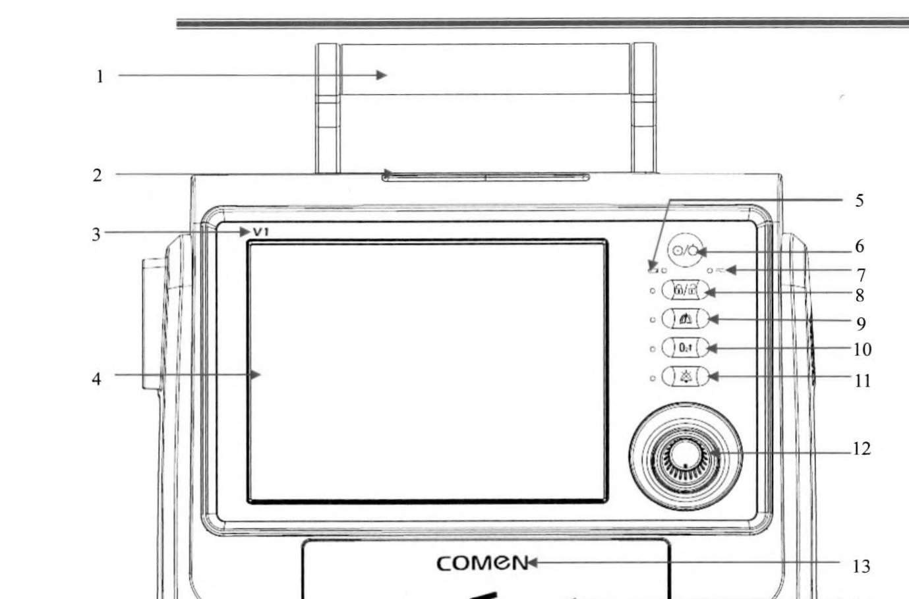
  <figcaption>Рис. 1. Передняя панель. Выноски соответствуют нумерации таблицы: 1 — рукоятка, 2 — индикатор тревоги, 4 — сенсорный экран, 5 — индикатор аккумулятора, 6 — кнопка питания, 7 — индикатор внешнего питания, 8 — блокировка экрана, 9 — ручная вентиляция и удержание вдоха, 10 — обогащение кислородом и отсасывание, 11 — приостановка звукового сигнала, 12 — поворотная ручка. Четыре аппаратные клавиши и поворотная ручка расположены справа от экрана и сохраняют работоспособность при заблокированном сенсорном экране.</figcaption>
</figure>

| № | Орган управления или индикатор | Функция |
|---|---|---|
| 1 | Рукоятка | Перенос аппарата |
| 2 | Индикатор тревоги | Цвет и частота мигания соответствуют приоритету тревоги |
| 3 | Обозначение модели | — |
| 4 | Сенсорный экран | Отображение интерфейсов и ввод уставок |
| 5 | Индикатор аккумулятора | Мигание — заряд от внешнего источника; горит — заряжен либо питание от аккумулятора; не горит — аккумулятор отсутствует, неисправен или внешнее питание не подключено |
| 6 | Кнопка питания | Кратковременное нажатие при выключенном аппарате — включение и самопроверка; кратковременное нажатие во время вентиляции — запрос перехода в режим ожидания; нажатие в режиме ожидания — запрос выключения с обратным отсчётом 3 с; удержание более 10 с во время вентиляции — выключение |
| 7 | Индикатор внешнего питания | Горит при подключении сети переменного или постоянного тока |
| 8 | Блокировка экрана | Блокирует и разблокирует сенсорный экран; при активной блокировке горит зелёным |
| 9 | Ручная вентиляция и удержание вдоха | Нажатие в фазе выдоха вызывает принудительный вдох |
| 10 | Обогащение кислородом и отсасывание мокроты | Принудительный вдох с последующей задержкой на время удержания кнопки, продление до 15 с в конце заданного времени вдоха |
| 11 | Приостановка звукового сигнала | Отключение звука на 120 с; новый сигнал тревоги отменяет приостановку; повторное нажатие отменяет её вручную |
| 12 | Поворотная ручка | Вращение — перебор пунктов и изменение значений, нажатие — выбор и подтверждение |
| 13 | Логотип изготовителя | — |
| 14 | Отсек аккумулятора | До двух аккумуляторов |

## Правая сторона, задняя и левая панели

<figure>
  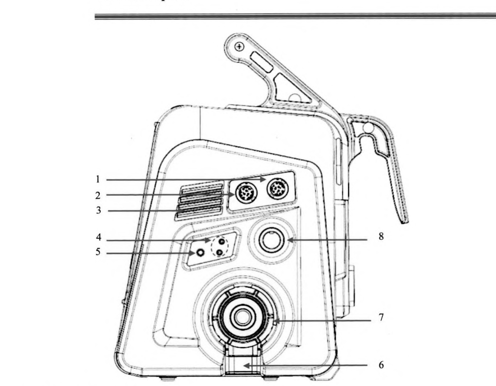
  <figcaption>Рис. 2. Правая сторона. 1 — разъём SpO₂, 2 — разъём CO₂, 3 — динамик, 4 — порт датчика потока, 5 — порт небулайзера, 6 — отверстие выдоха, 7 — порт выдоха, 8 — порт вдоха. Съёмный узел клапана выдоха устанавливается в отверстие дыхательной трубки на этой же стороне.</figcaption>
</figure>
<figure>
  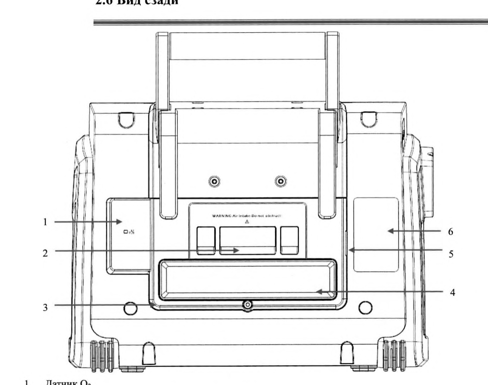
  <figcaption>Рис. 3. Задняя панель. 1 — датчик O₂, 2 — воздухозаборник с одноразовым фильтром, 3 — задняя крышка для замены фильтра HEPA и датчика O₂, 4 — фильтр HEPA, 5 — аварийный воздухозаборник, 6 — табличка с маркировкой. Через аварийный воздухозаборник поступает воздух при переходе аппарата в состояние окружающей среды.</figcaption>
</figure>
<figure>
  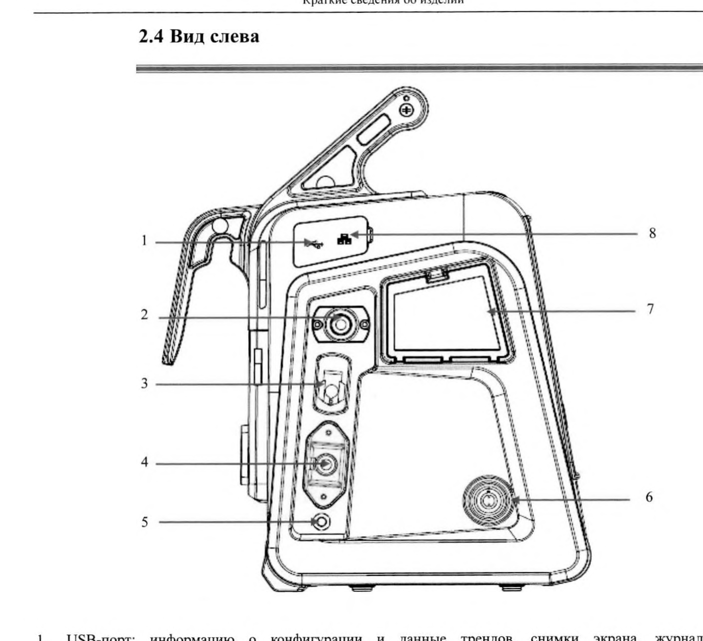
  <figcaption>Рис. 4. Левая сторона. 1 — USB-порт, 2 — порт O₂ высокого давления, 3 — порт O₂ низкого давления, 4 — порт питания переменного тока, 5 — эквипотенциальный вывод, 6 — порт питания постоянного тока, 7 — воздухозаборник вентилятора, 8 — сетевой порт. Порты кислорода высокого и низкого давления расположены рядом; одновременное подключение к ним не допускается.</figcaption>
</figure>

| Сторона | Порты и элементы |
|---|---|
| Правая (РЭ, стр. 36) | Разъём кабеля SpO₂, разъём кабеля CO₂, динамик, порт датчика потока, порт небулайзера, отверстие выдоха, порт выдоха, порт вдоха |
| Задняя (РЭ, стр. 37) | Датчик O₂, воздухозаборник с одноразовым фильтром, задняя крышка для замены фильтра HEPA и датчика O₂, фильтр HEPA, аварийный воздухозаборник, табличка с маркировкой |
| Левая и разъёмы (РЭ, стр. 35) | USB-порт, порт O₂ высокого давления, порт O₂ низкого давления, порт питания переменного тока, эквипотенциальный вывод, порт питания постоянного тока, воздухозаборник вентилятора, сетевой порт (только для обслуживания изготовителем) |

Воздухозаборники на задней и боковой поверхностях не перекрываются: это отверстия охлаждающего вентилятора (РЭ, стр. 38). Аварийный воздухозаборник обеспечивает поступление воздуха к пациенту при отказе, при котором аппарат переходит в состояние окружающей среды.

## Основной интерфейс

Верхняя строка экрана содержит тип пациента и уровень триггера вдоха, тип вентиляции (инвазивная либо неинвазивная), область подсказки обогащения кислородом и отсасывания, сообщения о тревоге с их количеством, доступ к данным за прошедшие периоды, значок неактивных тревог, снимок экрана, отсчёт приостановки звука, приостановку обновления кривых, значки сети, USB, состояния аккумулятора и внешнего питания (РЭ, стр. 61–62).

<figure>
  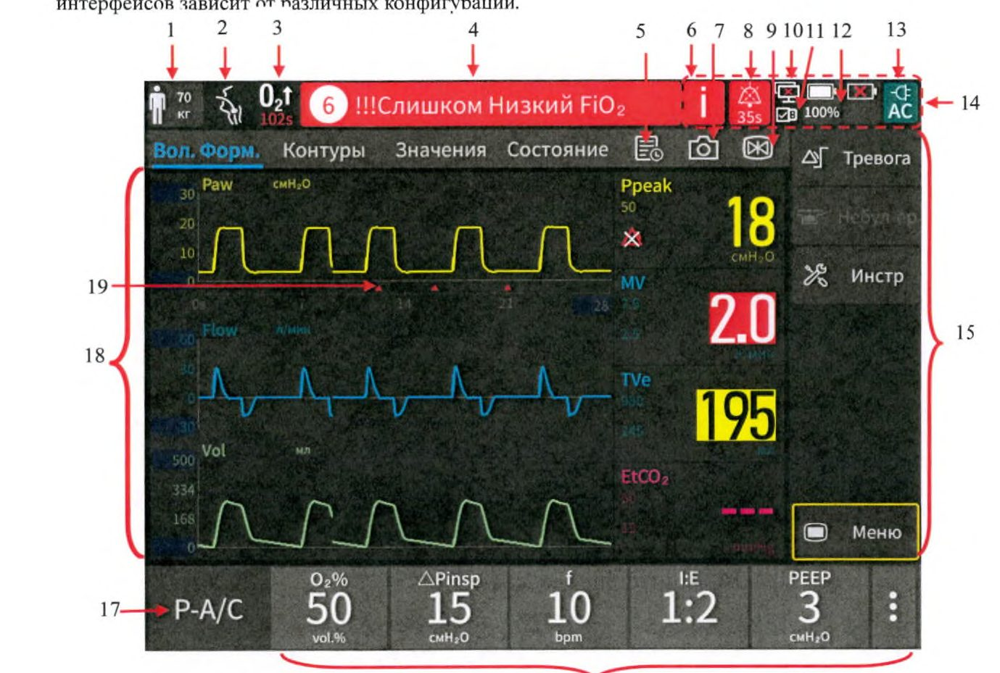
  <figcaption>Рис. 5. Основной интерфейс во время вентиляции. Верхняя строка: тип пациента и триггер вдоха (1), тип вентиляции (2), область обогащения кислородом (3), сообщение о тревоге с их количеством (4), данные за прошедшие периоды (5), неактивные тревоги (6), снимок экрана (7), отсчёт приостановки звука (8), приостановка обновления (9), сеть (10), USB (11), аккумулятор (12), внешнее питание (13). Слева кривые давления, потока и объёма (18, 19), в центре числовые значения, справа доступ к тревогам, инструментам и меню (15). Нижняя строка: текущий режим (17) и область быстрой настройки уставок (16) — концентрация кислорода, инспираторное давление, частота, отношение вдоха к выдоху, PEEP.</figcaption>
</figure>

Нижняя строка содержит текущий режим вентиляции и область быстрой настройки параметров: значения концентрации кислорода, инспираторного давления либо дыхательного объёма, частоты, отношения вдоха к выдоху и PEEP. Параметр устанавливается либо выбором в этой области, либо через интерфейс настройки режима (РЭ, стр. 102).

# Питание

Аппарат работает от сети переменного тока, от внешнего источника постоянного тока и от встроенных аккумуляторов, число которых не превышает двух; поддерживается замена аккумулятора без прерывания работы. При эксплуатации в условиях неотложной помощи кабель питания фиксируется ограничителем розетки во избежание случайного отсоединения (РЭ, стр. 40).

При подключении к внешнему источнику постоянного тока изделие классифицируется как оборудование класса II без защитного заземления. Требуется кабель, поставленный изготовителем; защита от обратной полярности не обеспечивается самим аппаратом. При недостаточной мощности или выходе напряжения за допустимые пределы аппарат переходит на питание от внутреннего аккумулятора и формирует техническую тревогу. При использовании автомобильной розетки постоянного тока запуск двигателя во время работы аппарата исключается (РЭ, стр. 41).

Настройки пациента и настройки сигналов тревоги сохраняются при отключении питания независимо от его длительности (РЭ, стр. 38).

# Газоснабжение

Аппарат имеет два порта подачи кислорода: высокого и низкого давления. Одновременное подключение источников высокого и низкого давления не допускается (РЭ, стр. 42).

| Характеристика | O₂ высокого давления | O₂ низкого давления |
|---|---|---|
| Давление или расход | 280–600 кПа | Расход не более 15 л/мин |
| Источник | Централизованная подача, баллон, стационарная ёмкость с жидким кислородом | Баллон, концентратор кислорода |
| Установка концентрации O₂ на аппарате | Доступна | **Недопустима** |
| Контроль концентрации O₂ | Активен | **Не активируется**, контроль возложен на оператора |
| Пределы тревоги O₂% по умолчанию | По заданному значению | 100 % и 21 % |

Источники: РЭ, стр. 42–43, 229. Подача менее 280 кПа влияет на работу аппарата и способна прекратить вентиляцию. Давление 1000 кПа влияет на работу, но угрозы для пациента не создаёт.

Перед вводом в эксплуатацию устанавливается датчик O₂ (РЭ, стр. 38). Порт подачи проверяется на отсутствие утечки: утечка повышает концентрацию кислорода вблизи изделия и создаёт обогащённую кислородом среду. При появлении необычного звука после подключения источника кислорода эксплуатация прекращается (РЭ, стр. 42).

При специализированной транспортировке состояние баллонов проверяется перед каждым применением; при работе от кислорода низкого давления предусматривается аварийный источник (РЭ, стр. 42).

# Сборка дыхательного контура

## Клапан выдоха

Съёмный узел собирается из мембраны клапана выдоха, сердечника и ручки, после чего совмещается с отверстием дыхательной трубки на правой стороне аппарата; фиксация — поворотом ручки по часовой стрелке (РЭ, стр. 44).

<figure>
  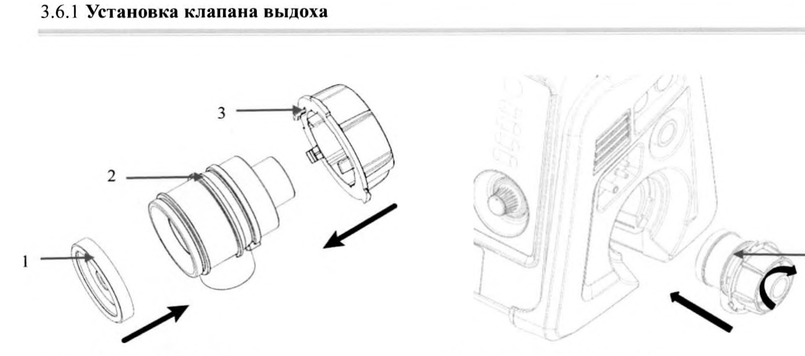
  <figcaption>Рис. 6. Клапан выдоха. 1 — мембрана, 2 — сердечник, 3 — ручка, 4 — съёмный узел в сборе. Слева порядок сборки узла, справа установка узла в отверстие на правой стороне аппарата с фиксацией поворотом ручки по часовой стрелке.</figcaption>
</figure>

Мембрана клапана выдоха относится к деталям, состояние которых проверяется регулярно: распыление лекарственных препаратов способно её загрязнить и вызвать залипание клапана (РЭ, стр. 50).

## Конфигурации контура

Руководство описывает четыре конфигурации (РЭ, стр. 45–47).

| Конфигурация | Состав | Применение |
|---|---|---|
| Двойной патрубок с увлажнителем | Патрубки вдоха и выдоха, увлажнитель с входом и выходом, инспираторный водосборник и водосборник линии выдоха, Y-образный тройник, датчик потока, небулайзер | Взрослые и дети, продолжительная вентиляция |
| Коаксиальный с тепловлагообменником | Коаксиальный патрубок вдоха и выдоха, фильтр с тепловлагообменником HMEF, датчик потока, датчик и адаптер CO₂ | Взрослые и дети, транспортировка |
| Одиночный патрубок при высокопоточной оксигенотерапии | Патрубок вдоха, увлажнитель, назальная канюля | Оксигенотерапия |
| Двойные патрубки при высокопоточной оксигенотерапии | Патрубки вдоха и выдоха, увлажнитель, водосборники, назальная канюля | Оксигенотерапия |

<figure>
  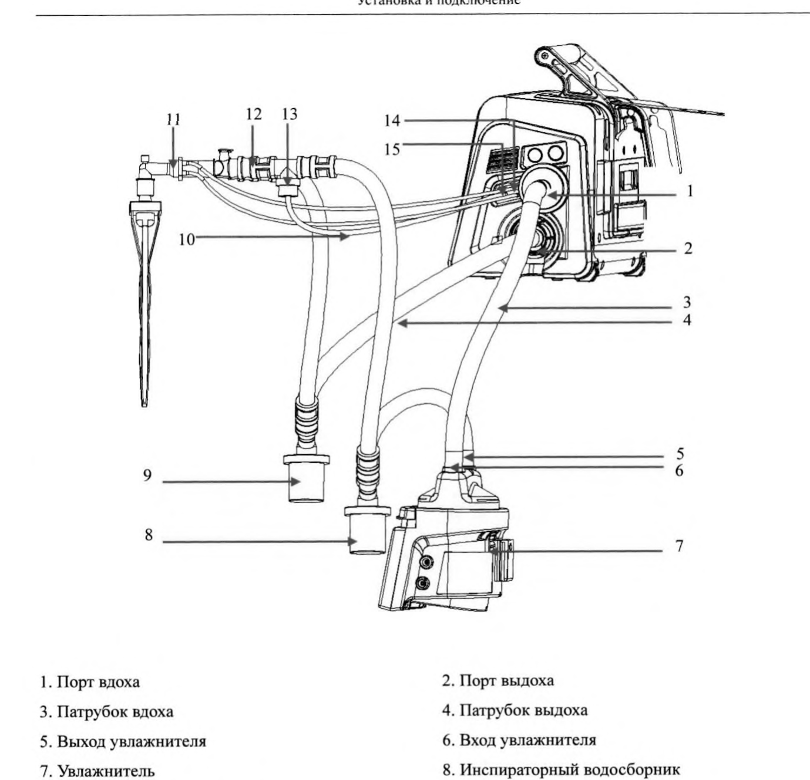
  <figcaption>Рис. 7. Двухпатрубковый контур с увлажнителем для взрослых и детей. 1 — порт вдоха, 2 — порт выдоха, 3 и 4 — патрубки вдоха и выдоха, 5 и 6 — выход и вход увлажнителя, 7 — увлажнитель, 8 — инспираторный водосборник, 9 — водосборник линии выдоха, 10 — заборная трубка небулайзера, 11 — датчик потока, 12 — Y-образный тройник, 13 — небулайзер, 14 — порт датчика потока, 15 — порт небулайзера.</figcaption>
</figure>
<figure>
  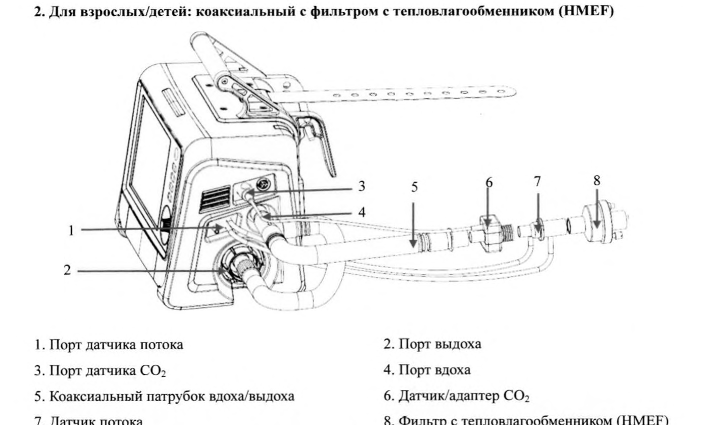
  <figcaption>Рис. 8. Коаксиальный контур с фильтром-тепловлагообменником для взрослых и детей. 1 — порт датчика потока, 2 — порт выдоха, 3 — порт датчика CO₂, 4 — порт вдоха, 5 — коаксиальный патрубок вдоха и выдоха, 6 — датчик и адаптер CO₂, 7 — датчик потока, 8 — фильтр с тепловлагообменником. Конфигурация не содержит увлажнителя и водосборников.</figcaption>
</figure>
<figure>
  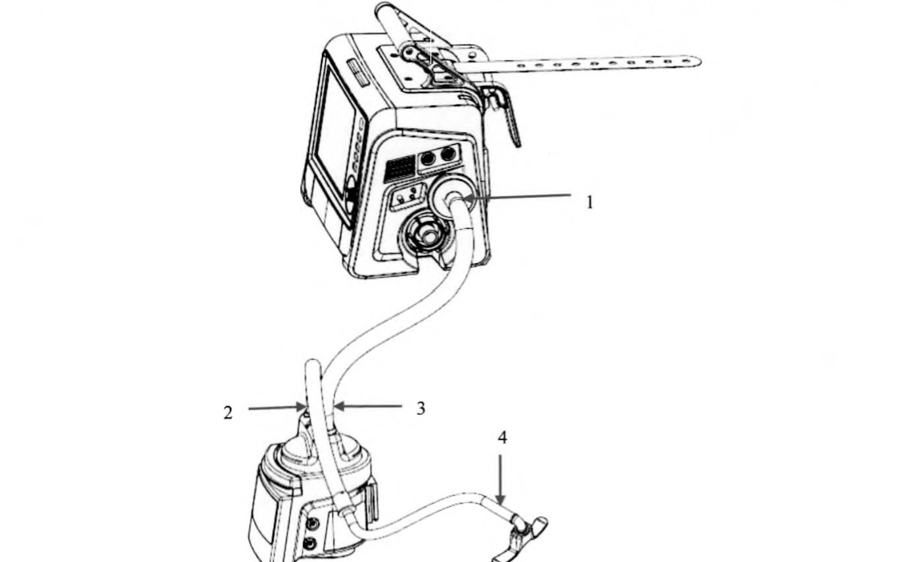
  <figcaption>Рис. 9. Однопатрубковый контур при высокопоточной оксигенотерапии. 1 — порт вдоха, 2 — выход увлажнителя, 3 — вход увлажнителя, 4 — назальная канюля.</figcaption>
</figure>
<figure>
  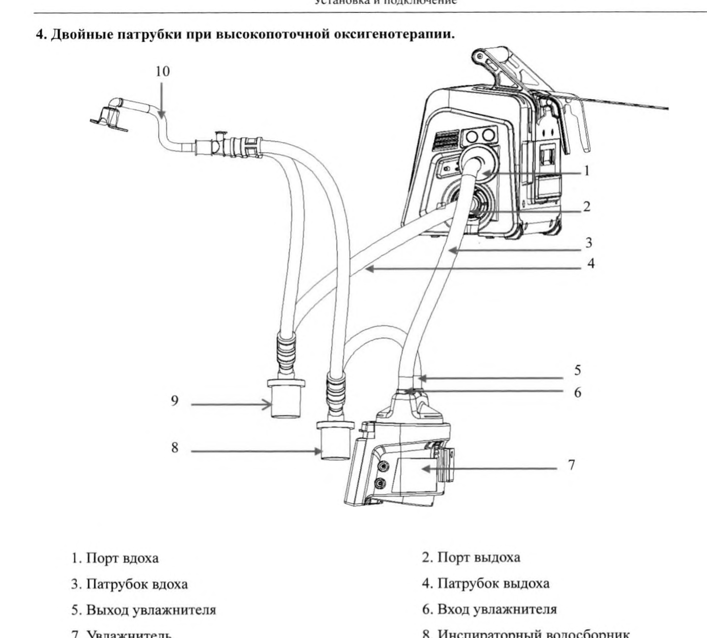
  <figcaption>Рис. 10. Двухпатрубковый контур при высокопоточной оксигенотерапии. 1 — порт вдоха, 2 — порт выдоха, 3 и 4 — патрубки вдоха и выдоха, 5 и 6 — выход и вход увлажнителя, 7 — увлажнитель, 8 — инспираторный водосборник, 9 — водосборник линии выдоха, 10 — назальная канюля.</figcaption>
</figure>

Фильтр устанавливается между аппаратом и патрубком вдоха пациента всегда: его отсутствие ведёт к загрязнению дыхательной смеси и аппарата. Одновременно учитывается обратное следствие: фильтр увеличивает сопротивление выдоха, а чрезмерное сопротивление увеличивает работу дыхания пациента и внутреннее PEEP (РЭ, стр. 43).

Датчик потока чувствителен к направлению газового потока и устанавливается в соответствии с маркировкой; то же относится к внутреннему датчику потока (РЭ, стр. 48).

Небулайзер присоединяется к патрубку вдоха. Установка его между отверстием для присоединения пациента и трахеальной трубкой увеличивает мёртвое пространство. Во время распыления фильтр и тепловлагообменник из контура пациента исключаются: аэрозоль засоряет фильтр линии выдоха, что резко увеличивает сопротивление (РЭ, стр. 50).

Увлажнитель включается только после выполнения калибровки и проверки аппарата (РЭ, стр. 48).

Держатель дыхательных контуров устанавливается на направляющую с левой или правой стороны; предельная нагрузка на опорный рычаг — 2,5 кг. Перед перемещением аппарата держатель снимается (РЭ, стр. 52).

# Проверка перед началом работы

Полная предоперационная проверка выполняется перед подключением пациента. Аппарат, не прошедший любой из тестов, к клиническому применению не допускается до завершения ремонта и повторного прохождения всех тестов (РЭ, стр. 56).

На время проверки пациент отсоединяется от аппарата, и обеспечивается альтернативный способ вентиляции (РЭ, стр. 57).

## Состав и повод для проверок

| Повод | Проверка или калибровка |
|---|---|
| Перед применением у нового пациента | Предоперационная проверка |
| После установки новых или продезинфицированных дыхательных трубок и компонентов, включая датчики потока и трубки мониторинга давления | Проверка системы, калибровка датчика потока, тест контура |
| После установки нового датчика O₂ либо при соответствующей тревоге | Калибровка O₂% |
| После установки нового датчика CO₂, при соответствующей тревоге, а также при смене типа порта дыхательных путей | Калибровка датчика и порта CO₂ |

Источник: РЭ, стр. 56.

## Последовательность предоперационной проверки

1. Подключение аппарата к источнику питания и к подаче O₂, сборка дыхательного контура пациента.
2. Включение питания. Во время самопроверки при включении поочерёдно мигают красная и жёлтая сигнальные лампы и подаётся звуковой сигнал.
3. В режиме ожидания выбирается [Проверка системы] и выполняется проверка системы.
4. В режиме ожидания выбирается [Проверка контура] и выполняется тест контура. При пройденной проверке системы тест контура не требуется.
5. При необходимости выполняется калибровка датчика O₂.
6. Формируется сигнал тревоги и проверяется его отображение в информационной строке.
7. Состояние тревоги устраняется, сигнал сбрасывается.

Источник: РЭ, стр. 57.

## Проверка системы

Перед запуском по подсказке на экране перекрывается Y-образный тройник, после чего выбирается [Продолжить]. Проверяемые элементы (РЭ, стр. 58):

- тест вентилятора — частота вращения;
- проверка датчика потока O₂;
- проверка датчика потока воздуха на вдохе;
- проверка датчиков давления на конце вдоха и выдоха;
- испытание клапана выдоха;
- тест предохранительного клапана;
- утечка, мл/мин;
- растяжимость, мл/см вод. ст.;
- сопротивление трубки, см вод. ст./(л/с);
- проверка датчика O₂.

Результаты по каждому элементу: выдерживает, не выдерживает, отменено, недостаточная подача кислорода, функция мониторинга выключена.

| Итог проверки системы | Значение для работы |
|---|---|
| Выдерживает | Все элементы пройдены |
| Частично выдерживает | Часть элементов не пройдена, механическая вентиляция допустима |
| Механическая вентиляция отключена | Часть элементов не пройдена, вентиляция не разрешена |
| Значительная утечка, механическая вентиляция отключена | Не выдержали датчик давления, клапан выдоха и предохранительный клапан; вентиляция не допускается |
| Отменено | Часть элементов отменена, остальные пройдены |

Источник: РЭ, стр. 59. При неудаче проверки датчика O₂ на экране появляется клавиша калибровки концентрации O₂.

## Тест контура

Проверяемые элементы: утечка (мл/мин), растяжимость (мл/см вод. ст.), сопротивление контура (см вод. ст./(л/с)). Итог формулируется как «выдерживает», «частично выдерживает», «ошибка» либо «отменено» (РЭ, стр. 60). Тест повторяется после каждой замены дыхательной трубки, увлажнителя или фильтра.

# Ввод пациента

В режиме ожидания доступны три пути начала вентиляции (РЭ, стр. 98–99).

## Быстрая вентиляция

Предусмотрены три преднастройки для неотложной ситуации. Режим — только PRVC; выбор иного режима требует входа через [Новый пациент].

| Преднастройка | Режим | TV | f | PEEP | I:E | O₂% |
|---|---|---|---|---|---|---|
| IBW 70 кг | PRVC | 490 мл | 10/мин | 3 см вод. ст. | 1:2 | 50 % |
| IBW 25 кг | PRVC | 180 мл | 15/мин | 3 см вод. ст. | 1:2 | 50 % |
| IBW 10 кг | PRVC | 70 мл | 20/мин | 3 см вод. ст. | 1:2 | 50 % |

Источник: РЭ, стр. 226. Все три соответствуют отношению дыхательного объёма к идеальной массе тела 7 мл/кг.

## Новый пациент

Устанавливаются режим вентиляции, тип пациента, пол, рост либо идеальная масса тела, после чего выбирается [Начать вентиляцию]. При вводе роста идеальная масса тела вычисляется автоматически с учётом пола. Изменение пола, роста или массы изменяет значения TV, TV апноэ, f и f апноэ, а также верхний и нижний пределы тревоги по дыхательному и минутному объёму (РЭ, стр. 99).

Настройки по умолчанию для нового пациента: режим P-A/C, ΔДавл Вдоха 15 см вод. ст., f 10/мин, PEEP 3 см вод. ст., I:E 1:2, O₂ 50 %, триггер помощи включён, триггер потока 5,0 л/мин, время наклона 0,20 с, вздох выключен (РЭ, стр. 228).

## Тот же пациент

Доступны изменения пола, роста и идеальной массы тела. В отличие от режима нового пациента значения TV, TV апноэ, f, f апноэ и пределы тревоги при этом сохраняются прежними (РЭ, стр. 99).

## Производные уставки, рассчитываемые от идеальной массы тела

| IBW, кг | f и f апноэ, 1/мин | Thigh (DuoVent), Ti и Ti апноэ, с |
|---|---|---|
| 3 ≤ IBW < 6 | 35 | 0,57 |
| 6 ≤ IBW < 9 | 25 | 0,80 |
| 9 ≤ IBW < 20 | 20 | 1,00 |
| 20 ≤ IBW < 30 | 15 | 1,30 |
| 30 ≤ IBW < 40 | 14 | 1,40 |
| 40 ≤ IBW < 60 | 12 | 1,70 |
| 60 ≤ IBW ≤ 139 | 10 | 2,00 |

| IBW, кг | Thigh (APRV), с | Tlow (APRV), с |
|---|---|---|
| 3 ≤ IBW ≤ 5 | 1,7 | 0,3 |
| 5 < IBW ≤ 8 | 2,1 | 0,3 |
| 8 < IBW ≤ 20 | 2,6 | 0,4 |
| 20 < IBW < 40 | 3,5 | 0,5 |
| 40 ≤ IBW < 60 | 4,4 | 0,6 |
| 60 ≤ IBW ≤ 139 | 5,4 | 0,6 |

| IBW, кг | Exp % | IBW, кг | Выс Давл, см вод. ст. |
|---|---|---|---|
| 3 ≤ IBW < 9 | 10 % | 3 ≤ IBW < 90 | 20 |
| 9 ≤ IBW < 15 | 15 % | 90 ≤ IBW < 100 | 23 |
| 15 ≤ IBW ≤ 30 | 20 % | 100 ≤ IBW ≤ 139 | 25 |
| 0 < IBW ≤ 139 | 25 % | — | — |

Дыхательный объём и объём при апноэ вычисляются как произведение идеальной массы тела на заданное отношение TV/IBW; верхний предел тревоги по TVe устанавливается как двукратный дыхательный объём, нижний — как половина дыхательного объёма (РЭ, стр. 99–100).

Источники таблиц: РЭ, стр. 99. Правильная установка массы определяет корректность пределов тревоги по дыхательному и минутному объёму.

# Типы вентиляции

Аппарат поддерживает инвазивную и неинвазивную вентиляцию. Тип задаётся в меню [Тот же пациент] либо [Новый пациент] в режиме ожидания и отображается значком в верхней строке экрана (РЭ, стр. 100–101).

| Тип | Доступные режимы |
|---|---|
| Инвазивная | P-A/C, P-SIMV, DuoVent, APRV, CPAP/PSV, PRVC, PRVC-SIMV |
| Неинвазивная | P-A/C, P-SIMV, CPAP/PSV, DuoVent, APRV, PSV-S/T |

Конкретное изделие может быть сконфигурировано не на все режимы. При переключении с неинвазивной вентиляции на инвазивную пределы сигналов тревоги проверяются заново (РЭ, стр. 100).

При неинвазивной вентиляции измеренные объём выдоха и выдыхаемый CO₂ отличаются от действительных вследствие утечки вокруг маски (РЭ, стр. 100).

# Общие механизмы, действующие во всех режимах

## Ограничение давления

Максимальное ограниченное давление составляет 80 см вод. ст., максимальный минутный объём — 60 л/мин. При установке инспираторного давления или верхнего предела тревоги по давлению выше 60 см вод. ст. требуется подтверждение нажатием поворотной ручки (РЭ, стр. 101).

В фазе вдоха давление ограничивается на уровне «верхний предел тревоги по давлению минус 10 см вод. ст.»: при достижении этого значения инспираторное давление не повышается далее. При достижении самого верхнего предела тревоги формируется сигнал высокого приоритета, клапан выдоха открывается, и аппарат переходит в фазу выдоха. При превышении верхнего предела на 5 см вод. ст. открывается предохранительный клапан. Отрицательного давления в фазе выдоха аппарат не создаёт (РЭ, стр. 101).

Рекомендованный руководством верхний предел тревоги по давлению — до 60 см вод. ст., за исключением особых случаев (РЭ, стр. 89).

## Вентиляция при апноэ

Резервный режим активируется при отсутствии дыхания дольше заданного времени апноэ в режимах DuoVent, APRV, P-SIMV, PRVC-SIMV и CPAP/PSV. Прекращается при обнаружении двух последовательных спонтанных вдохов, при смене режима вентиляции либо при отключении функции (РЭ, стр. 102–103).

| Тип вентиляции | Режим вентиляции при апноэ | Задаваемые параметры |
|---|---|---|
| Инвазивная | С регулируемым объёмом, выполняется как PRVC | TV апноэ, f апноэ, I:E либо Ti апноэ |
| Неинвазивная | С регулируемым давлением, выполняется как P-A/C | ΔДавление апноэ, f апноэ, I:E либо Ti апноэ |

Время вентиляции при апноэ по умолчанию — 15 с (РЭ, стр. 90).

## Компенсация утечки

Объём утечки обновляется после каждого дыхательного цикла по разнице объёмов вдоха и выдоха и используется для расчёта скорости утечки в следующем цикле; скорость утечки пропорциональна давлению в дыхательных путях. В фазе выдоха аппарат увеличивает основной поток, предотвращая снижение PEEP из-за утечки; поток, по которому оценивается инспираторная попытка, также компенсируется (РЭ, стр. 103).

В режимах с регулируемым давлением компенсация ограничена максимальной производительностью подачи газа и верхним пределом тревоги по дыхательному объёму. При появлении сигнала [Ограничение объёма] дальнейшая компенсация достигается повышением верхнего предела тревоги по TV либо отключением этого сигнала (РЭ, стр. 103).

## Вздох

Функция доступна в режимах P-A/C, P-SIMV, PRVC и PRVC-SIMV. Задаются включение функции, интервал между вздохами, число циклов вздоха и дополнительное PEEP, добавляемое в цикл вздоха (РЭ, стр. 104–110).

# Режимы вентиляции

## Сводная таблица

| Режим | Управляемая величина | Задаёт оператор | Обеспечивает аппарат |
|---|---|---|---|
| P-A/C | Давление | O₂%, ΔPinsp, f, Ti либо I:E, PEEP, помощь, триггер, Tslope | Подъём давления до заданного уровня за время Tslope и удержание до конца вдоха; синхронизация с попыткой вдоха |
| P-SIMV | Давление | O₂%, ΔPinsp, Ti, f SIMV, Tslope, PEEP, Exp %, ΔPsupp, триггер, параметры апноэ | Заданное число принудительных вдохов с регулируемым давлением, между ними спонтанное дыхание или поддержка давлением |
| PRVC | Объём при регулируемом давлении | O₂%, TV, Ti либо I:E, f, PEEP, помощь, триггер, Tslope | Достижение заданного объёма минимально возможным давлением; пробный первый цикл, затем пошаговая подстройка |
| PRVC-SIMV | Объём при регулируемом давлении | O₂%, TV, Ti либо I:E, f SIMV, ΔPsupp, PEEP, триггер, Exp %, Tslope, параметры апноэ | Принудительные вдохи по PRVC, между ними спонтанное дыхание или поддержка давлением |
| CPAP/PSV | Давление | O₂%, ΔPsupp, PEEP, триггер вдоха, Exp %, Tslope, параметры апноэ; при неинвазивной вентиляции дополнительно Timax | Постоянное положительное давление; поддержка давлением каждой инспираторной попытки |
| DuoVent | Два уровня давления | O₂%, Phigh, Thigh либо f, Plow, Thigh либо Ti либо I:E, ΔPsupp, триггер, Exp %, Tslope, параметры апноэ | Попеременное переключение двух уровней давления с возможностью спонтанного дыхания на обоих |
| APRV | Два уровня давления с коротким сбросом | O₂%, Phigh, Thigh, Plow, Tlow, Tslope, триггер, параметры апноэ | CPAP с периодическим кратковременным сбросом давления |
| PSV-S/T | Давление, неинвазивная вентиляция | O₂%, ΔPinsp, PEEP, f, Ti, триггер, Tslope | Поддержка давлением инспираторных попыток с гарантированной частотой при их отсутствии |

Источники: РЭ, стр. 102–113.

## Особенности отдельных режимов

**P-A/C.** Скорость подачи газа в фазе удержания давления изменяется в зависимости от сопротивления и податливости. Переключение в фазу выдоха происходит немедленно, если поданный объём превысил верхний предел тревоги по дыхательному объёму (РЭ, стр. 103–104).

<figure>
  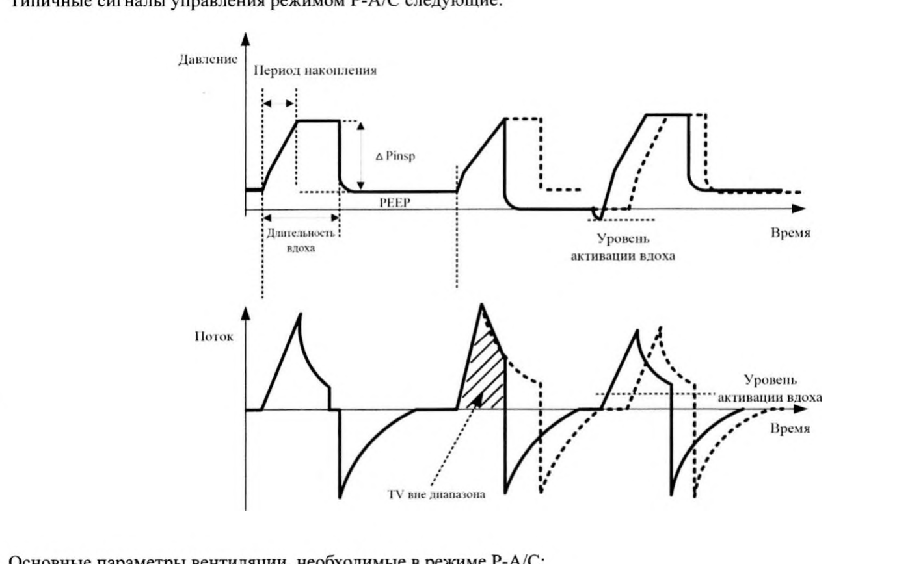
  <figcaption>Рис. 11. Кривые давления и потока в режиме P-A/C. Давление нарастает за время Tslope до уровня ΔPinsp над PEEP и удерживается до конца вдоха; инспираторный поток убывает по мере выравнивания давления. Пунктиром показан цикл, запущенный инспираторной попыткой пациента.</figcaption>
</figure>

**P-SIMV и PRVC-SIMV.** Окно триггера составляет 5 с для взрослых и 1,5 с для детей и новорождённых. Если время выдоха короче окна триггера, окном триггера является вся фаза выдоха. Инспираторная попытка внутри окна вызывает принудительный вдох; при её отсутствии принудительный вдох подаётся в конце окна (РЭ, стр. 105, 109).

<figure>
  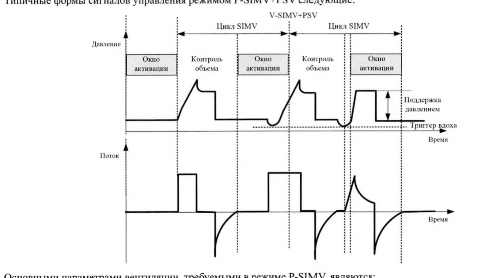
  <figcaption>Рис. 12. Кривые в режиме P-SIMV с поддержкой давлением. Показаны окна активации, внутри которых инспираторная попытка вызывает принудительный вдох, циклы с регулируемым давлением и спонтанные вдохи с поддержкой давлением между ними.</figcaption>
</figure>

**PRVC.** Первый цикл является пробным: газ подаётся при давлении 5 см вод. ст. плюс PEEP для расчёта податливости и сопротивления, результат используется для выбора уровня давления. В первых трёх циклах прирост давления не превышает 10 см вод. ст., далее — 3 см вод. ст. за цикл. Максимальное давление не превышает верхнего предела тревоги минус 10 см вод. ст. Аппарат обеспечивает равенство заданному объёму среднего значения объёмов вдоха и выдоха (РЭ, стр. 107–108).

<figure>
  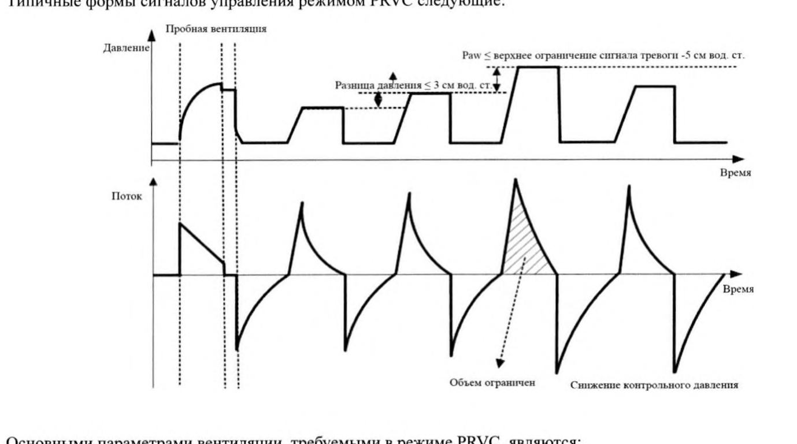
  <figcaption>Рис. 13. Кривые в режиме PRVC. Первый цикл пробный: газ подаётся при давлении 5 см вод. ст. над PEEP для расчёта податливости и сопротивления. В последующих циклах уровень давления подбирается пошагово до достижения заданного объёма и не превышает верхнего предела тревоги по давлению минус 10 см вод. ст.</figcaption>
</figure>
<figure>
  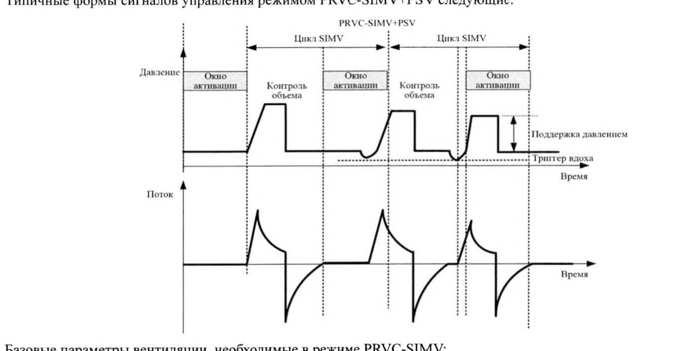
  <figcaption>Рис. 14. Кривые в режиме PRVC-SIMV с поддержкой давлением. Принудительные циклы выполняются по алгоритму PRVC, между ними доступны спонтанные вдохи с поддержкой давлением.</figcaption>
</figure>

**CPAP/PSV.** Вдох завершается при достижении потоком уровня, заданного параметром Exp %. При отсутствии спонтанного дыхания дольше заданного предела апноэ активируется резервная вентиляция при апноэ (РЭ, стр. 106–107).

<figure>
  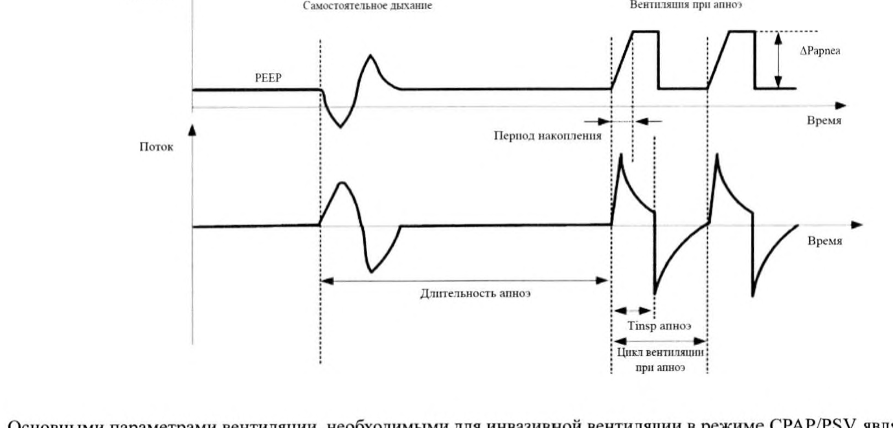
  <figcaption>Рис. 15. Кривые в режиме CPAP/PSV. Слева спонтанное дыхание на постоянном уровне давления с поддержкой ΔPsupp: вдох завершается при снижении потока до уровня Exp %. Справа истечение времени апноэ и переход в резервную вентиляцию при апноэ.</figcaption>
</figure>

**DuoVent.** Окно триггера на ступени низкого давления составляет 5 с после времени низкого давления, на ступени высокого давления — последнюю четверть времени высокого давления. Поддержка давлением задаётся для фазы низкого давления (РЭ, стр. 110–111).

<figure>
  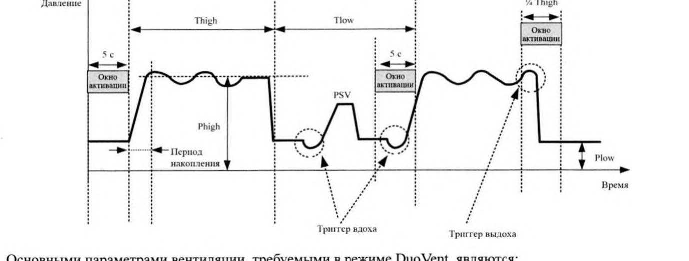
  <figcaption>Рис. 16. Кривые в режиме DuoVent. Аппарат попеременно поддерживает два уровня давления: Phigh в течение Thigh и Plow в течение Tlow. На обеих ступенях возможно спонтанное дыхание, на нижней к нему добавляется поддержка давлением. Окно активации нижней ступени — 5 с после времени низкого давления, верхней — последняя четверть времени высокого давления.</figcaption>
</figure>

**APRV.** Режим рассматривается руководством как CPAP с периодическим кратковременным сбросом давления; ограничение инспираторного давления действует так же, как в остальных режимах с регулируемым давлением (РЭ, стр. 111).

<figure>
  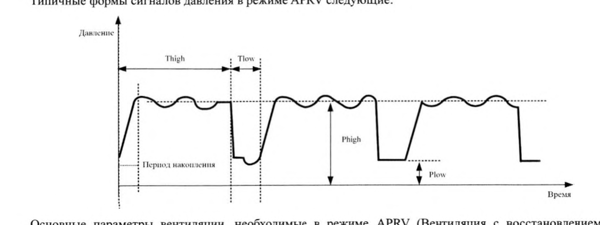
  <figcaption>Рис. 17. Кривые в режиме APRV. Высокое давление удерживается в течение Thigh, сброс до Plow занимает короткое время Tlow; спонтанное дыхание сохраняется преимущественно на уровне высокого давления.</figcaption>
</figure>
<figure>
  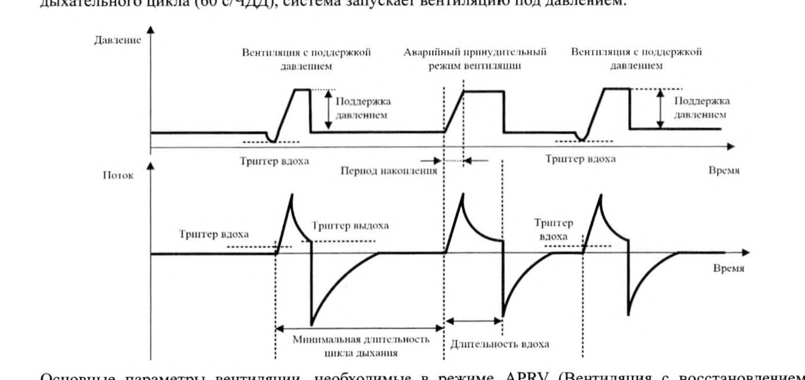
  <figcaption>Рис. 18. Кривые в режиме PSV-S/T, применяемом при неинвазивной вентиляции. Инспираторная попытка получает поддержку давлением; при её отсутствии в пределах заданного цикла аппарат подаёт принудительный вдох с регулируемым давлением, чем обеспечивается заданная частота.</figcaption>
</figure>

# Диапазоны и шаги уставок

Значения сверены с изображениями страниц РЭ, стр. 199–201.

| Параметр | Диапазон | Шаг | Режимы |
|---|---|---|---|
| Дыхательный объём TV | 20–2200 мл | 5 мл в диапазоне 20–100 мл; 10 мл в 100–1000 мл; 50 мл в 1000–2200 мл | PRVC, PRVC-SIMV |
| Инспираторное давление ΔPinsp | 3–65 см вод. ст. | 1 см вод. ст. | P-A/C, P-SIMV, PSV-S/T |
| Поддерживающее давление ΔPsupp | 0–65 см вод. ст. | 1 см вод. ст. | CPAP/PSV, P-SIMV, PRVC-SIMV, DuoVent |
| PEEP | 0–40 см вод. ст. | 1 см вод. ст. | P-A/C, P-SIMV, CPAP/PSV, PRVC, DuoVent, PRVC-SIMV, PSV-S/T |
| Концентрация O₂ | 21–100 объёмных % | 1 % | Все режимы |
| Частота дыхания f | 1–80 1/мин | 1 | P-A/C, P-SIMV, DuoVent, PRVC, PRVC-SIMV, PSV-S/T |
| Время вдоха Ti | 0,10–12,00 с | 0,01 с в 0,10–1,00 с; 0,05 с в 1,00–3,00 с; 0,1 с в 3,00–12,00 с | P-SIMV, PRVC-SIMV, PSV-S/T |
| Отношение I:E | 1:10–4:1 | 1 в диапазоне 1:10–1:4; 0,1 в 1:4–4:1 | P-A/C, PRVC |
| Время нарастания Tslope | 0–2000 мс | 50 мс | Все режимы |
| Высокое давление Phigh | 0–65 см вод. ст. | 1 см вод. ст. | DuoVent, APRV |
| Низкое давление Plow | 0–40 см вод. ст. | 1 см вод. ст. | APRV |
| Время высокого давления Thigh | 0,10–40,00 с | 0,01–0,1 с по поддиапазонам | DuoVent, APRV |
| Триггер по потоку | Выключен, 1,0–20,0 л/мин | 0,5 л/мин | Все режимы, где предусмотрен триггер |
| Уровень завершения вдоха Exp % | Авто, 5–80 % | 5 % | CPAP/PSV, P-SIMV, PRVC-SIMV, DuoVent |
| Максимальное время вдоха Timax | 1,00–3,00 с | 0,05 с | CPAP/PSV при неинвазивной вентиляции |
| Дыхательный объём при апноэ | 20–2200 мл | Как для TV | Режимы с вентиляцией при апноэ |
| Давление при апноэ | 3–65 см вод. ст. | 1 см вод. ст. | Режимы с вентиляцией при апноэ |
| Частота при апноэ | 1–80 1/мин | 1 | Режимы с вентиляцией при апноэ |
| Время вдоха при апноэ | 0,10–12,00 с | Как для Ti | Режимы с вентиляцией при апноэ |
| I:E при апноэ | 1:10–4:1 | Как для I:E | Режимы с вентиляцией при апноэ |
| Поток при высокопоточной оксигенотерапии | 2–60 л/мин | 1 л/мин | Оксигенотерапия |

Рекомендованные значения дыхательного объёма: 100–2200 мл для взрослых, 20–300 мл для детей и новорождённых (РЭ, стр. 199).

# Мониторируемые величины

Аппарат отображает давление в дыхательных путях с его составляющими (пиковое, плато, среднее, PEEP, внутреннее PEEP в диапазоне 0–85 см вод. ст.), объёмы вдоха и выдоха, минутный объём, отношение выдыхаемого объёма к идеальной массе тела в диапазоне 2,0–20,0 мл/кг, общую и спонтанную частоту, долю спонтанных вдохов и долю утечки в диапазоне 0–100 %, податливость и сопротивление, показатель P0.1 в диапазоне от −20 до 0 см вод. ст., индекс частого поверхностного дыхания RSBI в диапазоне 0–999, концентрацию кислорода, SpO₂, частоту пульса и капнометрические величины (РЭ, стр. 203).

Отношение выдыхаемого дыхательного объёма к идеальной массе тела и доля утечки относятся к величинам, по которым проверяется соответствие заданных уставок фактической вентиляции; оба отображаются в интерфейсе значений.

# Сигналы тревоги

## Приоритеты и индикация

| Приоритет | Световая индикация | Фон параметра |
|---|---|---|
| Высокий | Красный | Красный мигающий |
| Средний | Жёлтый | Жёлтый мигающий |
| Низкий | Жёлтый | Жёлтый мигающий |

При одновременных тревогах разных приоритетов световая и звуковая индикация соответствуют наивысшему приоритету, сообщения отображаются поочерёдно (РЭ, стр. 88).

Приостановка звука выполняется отдельной кнопкой на 120 с. Приостановка отменяется по истечении отсчёта, повторным нажатием кнопки и появлением нового сигнала тревоги. В состоянии приостановки звука остальная часть системы сигнализации остаётся активной (РЭ, стр. 91–92).

Отключение сигнала тревоги допускается для нижнего предела давления в дыхательных путях, верхнего и нижнего пределов TV и нижнего предела общей частоты. При отключении в области предела отображается соответствующий значок, а текстовое сообщение, световая и звуковая индикация по этому параметру не формируются (РЭ, стр. 92).

## Пределы тревоги по умолчанию и автоматическая установка

| Параметр | По умолчанию | Автоматическая установка по измеренному значению |
|---|---|---|
| Высокий предел TVe | TV × 2 | 1,5 × TVe |
| Низкий предел TVe | TV / 2 | 0,5 × TVe |
| Высокий предел MV | TV × f × 1,5 | 1,5 × MV |
| Низкий предел MV | TV × f × 0,5 | 0,6 × MV |
| Верхний предел давления в дыхательных путях | 50 см вод. ст. | Среднее пиковое давление + 10 см вод. ст. либо 35 см вод. ст. — большее из двух |
| Нижний предел давления в дыхательных путях | Выключен | Измеренное PEEP |
| Верхний предел общей частоты | Взрослые и дети 40 1/мин; новорождённые 70 1/мин | 1,4 × измеренная частота, не более 160 1/мин |
| Нижний предел общей частоты | Выключен | 0,6 × измеренная частота |
| Пределы O₂% при подаче O₂ низкого давления | 100 % и 21 % | — |
| Высокий и низкий пределы EtCO₂ | Взрослые и дети 50 мм рт. ст.; новорождённые 45 мм рт. ст. Нижний: взрослые 15, дети 20, новорождённые 30 мм рт. ст. | — |
| Пределы SpO₂ | 100 % и 90 % | — |
| Время вентиляции при апноэ | 15 с | — |

Источники: РЭ, стр. 90, 228–229. Среднее значение в формулах автоматической установки — среднее за последние восемь дыхательных циклов либо за одну минуту, в зависимости от того, какая величина меньше. Пределы тревоги по CO₂ и SpO₂ автоматической установке не подлежат.

Задержка сигналов тревоги по концентрации кислорода превышает 10 с (РЭ, стр. 89).

## Основные сигналы тревоги и действия

Физиологические сигналы (РЭ, стр. 231–233); Н — высокий приоритет, М — средний, L — низкий.

| Сигнал | Приоритет | Условие формирования | Действия по руководству |
|---|---|---|---|
| Слишком высокое давление в дыхательных путях | Н | Давление превысило верхний предел | Проверка пациента; проверка уставок вентиляции; проверка пределов тревоги; проверка контура на окклюзию |
| Слишком низкое давление в дыхательных путях | Н | Давление ниже нижнего предела в течение двух циклов | Проверка пациента; проверка уставок; проверка пределов; проверка контура на утечку и отсоединение |
| Слишком высокий FiO₂ | Н | Превышение предела не менее 30 с | Проверка уставок; проверка пределов; проверка фильтра HEPA на окклюзию; калибровка датчика O₂ |
| Слишком низкий FiO₂ | Н | Ниже предела не менее 30 с либо ниже 18 % немедленно | Проверка уставок; проверка пределов; проверка подачи O₂; калибровка датчика O₂ |
| Слишком высокий TVe | М | Превышение верхнего предела в трёх последовательных циклах | Проверка уставок; проверка пределов |
| Слишком низкий TVe | М | Ниже нижнего предела в трёх последовательных циклах | Проверка пациента; проверка уставок; проверка пределов; проверка контура на утечку и закупорку; проверка системы на утечку |
| Слишком высокий MV | Н | Превышение верхнего предела | Проверка уставок; проверка пределов |
| Слишком низкий MV | Н | Ниже нижнего предела | Проверка уставок; проверка пределов; проверка контура на утечку и закупорку; проверка системы на утечку |
| Апноэ | Н | Отсутствие дыхания дольше заданного времени апноэ | Проверка пациента; ручная вентиляция; проверка времени апноэ; проверка контура на отсоединение |
| Вентиляция при апноэ | Н | То же, с запуском резервного режима | Проверка уставок вентиляции при апноэ |
| Вентиляция при апноэ завершена | L | Резервный режим прекращён | Проверка уставок вентиляции при апноэ |
| Слишком высокая общая частота | М | Превышение предела в трёх последовательных циклах | Проверка пациента; проверка уставок; проверка пределов |
| Слишком низкая общая частота | М | Ниже предела в трёх последовательных циклах | Проверка пациента; проверка уставок; проверка пределов |
| Слишком высокое PEEP | М | Измеренное PEEP выше заданного более чем на 5 см вод. ст. в течение двух циклов | Проверка уставок; проверка контура на окклюзию |
| Слишком низкое PEEP | М | Измеренное PEEP ниже заданного более чем на 3 см вод. ст. | Проверка уставок; проверка контура на утечку и отсоединение |

Технические сигналы содержат, помимо перечисленных, сообщения о состоянии аккумуляторов и внешнего питания, отказе подачи кислорода, неисправностях датчиков потока, давления, O₂ и CO₂, засорении фильтров, неисправности клапана выдоха и предохранительного клапана, а также нумерованные технические ошибки. По каждому сигналу руководство приводит меры противодействия (РЭ, стр. 231–247). Сохранение сигнала после выполнения мер служит основанием для обращения к обслуживающему персоналу.

# Автоматические защитные состояния

## Безопасная вентиляция

Состояние активируется при технической неисправности, препятствующей штатной работе, и предоставляет время для корректирующих мер, включая замену аппарата. Функция датчика на стороне пациента отключается; аппарат продолжает создавать давление, а клапан выдоха переключает уровень давления между PEEP и давлением вдоха (РЭ, стр. 96).

Если до входа в это состояние был установлен режим PRVC или PRVC-SIMV, уставки безопасной вентиляции устанавливаются автоматически по таблице. Если был установлен режим с регулируемым давлением — P-A/C, DuoVent, APRV, CPAP/PSV, P-SIMV, PSV-S/T, — безопасная вентиляция продолжается с параметрами этого режима.

| IBW, кг | ΔДавл Вдоха, см вод. ст. | f, 1/мин | I:E |
|---|---|---|---|
| < 3 | 15 | < 35 | 1:3 |
| 3–5 | 15 | 30 | 1:4 |
| 6–8 | 15 | 25 | 1:4 |
| 9–20 | 15 | 20 | 1:4 |
| 21–29 | 15 | 15 | 1:4 |
| 30–39 | 15 | 14 | 1:4 |
| 40–59 | 15 | 12 | 1:4 |
| 60–89 | 15 | 10 | 1:4 |
| 90–99 | 15 | 10 | 1:4 |
| > 99 | 15 | 10 | 1:4 |

PEEP и концентрация кислорода в этом состоянии остаются предустановленными значениями предыдущего режима; концентрация кислорода превышает 21 % (РЭ, стр. 96–97).

При устранении неисправности аппарат способен автоматически возобновить нормальную вентиляцию.

## Состояние окружающей среды

Если техническая неисправность угрожает самой безопасной вентиляции — например, отказ питания при самотестировании, — аппарат переходит в состояние окружающей среды: открываются предохранительный клапан и клапан выдоха, что обеспечивает возможность самостоятельного дыхания пациента и предотвращает апноэ. **Выход из этого состояния достигается только выключением и повторным запуском аппарата** после устранения неисправности (РЭ, стр. 96).

<figure>
  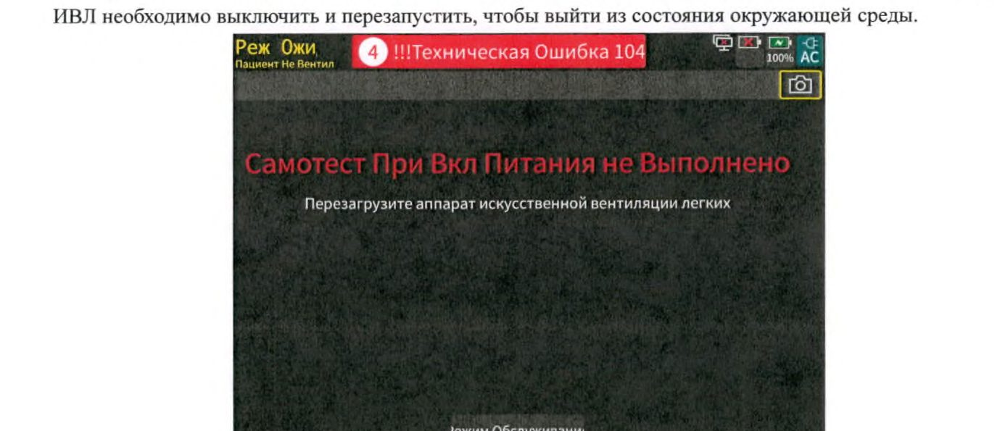
  <figcaption>Рис. 19. Экран в состоянии окружающей среды. В строке тревоги — номер технической ошибки, в поле экрана — сообщение о невыполненном самотесте при включении питания и требование перезапуска. Вентиляция в этом состоянии не проводится: оба клапана открыты, пациент дышит самостоятельно через аварийный воздухозаборник.</figcaption>
</figure>

## Порядок действий при сигнале тревоги

Руководство задаёт последовательность: проверка состояния пациента; подтверждение типа и параметра сигнала; определение причины; устранение причины; проверка того, что сигнал снят (РЭ, стр. 97). Предел тревоги корректируется только в том случае, если его настройка действительно не соответствует состоянию пациента.

# Отдельные функции

| Функция | Содержание | Значения по умолчанию |
|---|---|---|
| Обогащение кислородом | Повышение концентрации кислорода на заданное время | Взрослые 60 объёмных %, дети 60 %, новорождённые 40 %; продолжительность 120 с |
| Отсасывание мокроты | Режим для санации дыхательных путей | Продолжительность 120 с |
| Ручной вдох | Принудительный вдох по нажатию кнопки в фазе выдоха | — |
| Удержание вдоха | Задержка в конце вдоха на время удержания кнопки | Продление не более 15 с |
| Блокировка экрана | Исключение случайного изменения уставок; при активной блокировке индикатор горит зелёным | — |
| Высокопоточная оксигенотерапия | Подача через назальную канюлю | Поток 2–60 л/мин |
| Данные за прошедшие периоды | Табличные и графические тренды, журнал событий, обзор сигналов и циклов | — |
| Экспорт через USB | Конфигурация, тренды, снимки экрана, журнал, калибровочные формы | — |

Источники: РЭ, стр. 33–34, 62, 201, 227.

Отношение TVe/IBW по умолчанию составляет 7 мл/кг; режим инвазивного апноэ по умолчанию — с регулировкой объёма; мониторинг датчиков O₂ и CO₂ по умолчанию включён; компенсация O₂ для капнометрии — 16 %; барометрическое давление — 760 мм рт. ст. (РЭ, стр. 227).

# Ограничения и запрещённые действия

- Гипербарическая оксигенация исключена (РЭ, стр. 39).
- Одновременное подключение источников кислорода высокого и низкого давления не допускается (РЭ, стр. 42).
- При подаче кислорода низкого давления установка концентрации кислорода на аппарате недопустима, контроль концентрации не активируется (РЭ, стр. 42).
- Расход кислорода низкого давления не превышает 15 л/мин (РЭ, стр. 42).
- Неинвазивная вентиляция не применяется при отсутствии или нерегулярности спонтанного дыхания, а также у интубированных пациентов (РЭ, стр. 100).
- Вентиляция без фильтра между аппаратом и патрубком вдоха не проводится (РЭ, стр. 43).
- Фильтр и тепловлагообменник исключаются из контура на время распыления лекарственных препаратов (РЭ, стр. 50).
- Увлажнитель не включается до завершения калибровки и проверки аппарата (РЭ, стр. 48).
- Воздухозаборники на задней и боковой поверхностях не перекрываются (РЭ, стр. 38).
- Аппарат, не прошедший любой из тестов, к клиническому применению не допускается (РЭ, стр. 56).
- Проверка системы и тест контура выполняются при отсоединённом пациенте и при наличии альтернативного способа вентиляции (РЭ, стр. 57–58).
- Установка предела тревоги на предельное значение выводит систему сигнализации из строя (РЭ, стр. 89).
- Запуск двигателя автомобиля во время работы аппарата от автомобильной розетки постоянного тока исключается (РЭ, стр. 41).
- Перемещение аппарата с установленным держателем дыхательных контуров не производится (РЭ, стр. 52).

# Сводный порядок действий от включения до вентиляции

Последовательность составлена по разделам 3, 4 и 8 руководства и предназначена для использования у аппарата.

**1. Сборка.** Установка мембраны, сердечника и ручки в съёмный узел клапана выдоха; фиксация узла поворотом по часовой стрелке. Присоединение контура по выбранной конфигурации. Установка фильтра на линию вдоха, датчика потока — по направлению потока. Подключение датчиков SpO₂ и CO₂ при необходимости.

**2. Питание и газ.** Подключение к сети переменного или постоянного тока, проверка индикатора внешнего питания и состояния аккумуляторов. Подключение кислорода: высокого давления при 280–600 кПа либо низкого давления с расходом не более 15 л/мин. Одновременное подключение обоих источников исключено. Проверка наличия датчика O₂.

**3. Включение.** Кратковременное нажатие кнопки питания. Во время самопроверки поочерёдно мигают красная и жёлтая лампы и подаётся звуковой сигнал. По завершении аппарат переходит в режим ожидания.

**4. Проверка системы.** В режиме ожидания — [Проверка системы], перекрытие Y-образного тройника по подсказке, [Продолжить]. Итог «выдерживает» разрешает работу; «частично выдерживает» допускает механическую вентиляцию; «механическая вентиляция отключена» и «значительная утечка» её запрещают.

**5. Тест контура.** Выполняется при замене элементов контура и в случаях, когда проверка системы не пройдена полностью: утечка, растяжимость, сопротивление.

**6. Калибровка датчика O₂** — при соответствующем результате проверки или сигнале тревоги.

**7. Ввод пациента.** Неотложная ситуация — [Быстрая Вент] с выбором преднастройки по массе: PRVC, TV 490, 180 или 70 мл, f 10, 15 или 20 1/мин, PEEP 3 см вод. ст., I:E 1:2, O₂ 50 %. Плановое начало — [Новый пациент]: тип вентиляции (инвазивная либо неинвазивная), тип пациента, пол, рост или идеальная масса тела, режим вентиляции.

**8. Уставки.** Установка параметров выбранного режима: концентрация кислорода, давление или дыхательный объём, частота, PEEP, отношение вдоха к выдоху либо время вдоха, триггер, время нарастания. Проверка производных величин, рассчитанных аппаратом от идеальной массы тела.

**9. Пределы тревоги.** Проверка верхнего предела давления (по умолчанию 50 см вод. ст., рекомендованный руководством максимум 60 см вод. ст.), пределов TVe и MV, времени апноэ (по умолчанию 15 с), параметров вентиляции при апноэ. При необходимости — автоматическая установка пределов по измеренным значениям с последующей проверкой их пригодности.

**10. Начало вентиляции** клавишей [Начать вентиляцию]; присоединение пациента.

**11. Контроль после начала.** Давление (пиковое, плато, PEEP), выдыхаемый дыхательный объём и его отношение к идеальной массе тела, минутный объём, общая и спонтанная частота, доля утечки, концентрация кислорода, SpO₂ и EtCO₂ при подключённых датчиках. Сопоставление измеренных величин с заданными уставками и с пределами тревоги.

# Сопоставление с Oxylog 3000 plus

| Признак | Comen V1 | Oxylog 3000 plus |
|---|---|---|
| Основной способ задания вдоха | Давление: ΔPinsp в P-A/C и P-SIMV; объём задаётся в PRVC и PRVC-SIMV | Объём: VT в IPPV и SIMV; давление — в BIPAP и CPAP/ASB |
| Названия режимов | P-A/C, P-SIMV, PRVC, PRVC-SIMV, CPAP/PSV, DuoVent, APRV, PSV-S/T | IPPV, SIMV, BIPAP, CPAP/ASB, PCV |
| Обязательные проверки перед работой | Проверка системы (десять элементов) и тест контура из интерфейса ожидания | Проверка устройства и калибровка датчика потока |
| Поведение при технической неисправности | Безопасная вентиляция с уставками по идеальной массе тела; при более тяжёлом отказе — состояние окружающей среды с открытыми клапанами, выход только перезапуском | Тревога и переход на резервные режимы в пределах конфигурации аппарата |

# Источники иллюстраций

Девятнадцать рисунков воспроизведены из руководства по эксплуатации аппарата V1 (Shenzhen Comen Medical Instruments Co., Ltd.): рис. 1 — стр. 33, рис. 2 — стр. 36, рис. 3 — стр. 37, рис. 4 — стр. 35, рис. 5 — стр. 61, рис. 6 — стр. 44, рис. 7 — стр. 45, рис. 8 и 9 — стр. 46, рис. 10 — стр. 47, рис. 11 — стр. 104, рис. 12 — стр. 105, рис. 13 — стр. 108, рис. 14 — стр. 109, рис. 15 — стр. 107, рис. 16 — стр. 110, рис. 17 — стр. 111, рис. 18 — стр. 112, рис. 19 — стр. 96. Правообладатель изображений — изготовитель изделия. Подписи под рисунками составлены для настоящего материала.

# Источник и порядок сверки

Руководство по эксплуатации аппарата искусственной вентиляции лёгких V1, Shenzhen Comen Medical Instruments Co., Ltd. (Китай), редакция 2022.05, издание на русском языке 2023 г., 269 страниц. Разделы, использованные при составлении: 2 (краткие сведения об изделии), 3 (установка и подключение), 4 (тест и калибровка), 5 (интерфейс), 7 (сигналы тревоги), 8 (запуск вентиляции), приложения III (спецификация изделия), IV (настройки по умолчанию) и V (сигналы тревоги системы).

Издание на русском языке подготовлено сканированием с распознаванием текста, при котором цифры воспроизводятся с ошибками. Числовые значения настоящего материала сверены с изображениями страниц 96, 99, 199–203 и 228–229. При расхождении настоящего материала с руководством по эксплуатации преимущество имеет руководство; при расхождении руководства с действующими алгоритмами и распоряжениями службы преимущество имеют последние.
