

  
Учебный материал

  
Аппарат ИВЛ Comen V1

  
Режимы вентиляции, устройство и подготовка к работе, уставки, сигналы тревоги и специальные функции

  

  
Транспортный турбинный аппарат искусственной вентиляции лёгких серии V: органы управления и порты, питание и газоснабжение, сборка дыхательного контура, обязательная проверка перед работой, ввод пациента и расчёт производных уставок от идеальной массы тела, семнадцать режимов вентиляции с перечнем задаваемых параметров, включая вентиляцию с управляемым объёмом и режим сердечно-лёгочной реанимации, диапазоны уставок, система сигналов тревоги с пределами по умолчанию, специальные функции и автоматические защитные состояния аппарата, правила эксплуатации на станции. Сводный порядок действий от включения до начала вентиляции — в конце материала.

  
Серия «Крещение поворотом» · версия 2.0 · 3 октября 2026 · CC BY-NC-SA 4.0

Материал составлен по руководству по эксплуатации медицинского изделия «Аппарат искусственной вентиляции лёгких для экстренной помощи и транспортировки серии V, в вариантах исполнения: V1, V1D» (Shenzhen Comen Medical Instruments Co., Ltd., Китай; документ № 046-00000566-01, дата пересмотра 08/2024, 304 страницы; регистрационное удостоверение РЗН 2025/25059 от 21.03.2025). Ссылки вида «РЭ, стр. N» указывают номер страницы файла этого руководства. Руководство доступно на сайте поставщика: <https://cordismed.ru/image/pdf/comen-v1-manual-rus_compressed.pdf>. Сведения, относящиеся к аппаратам станции, приведены по практическому занятию на аппарате и по инструкции поставщика для инструктажа медицинского персонала и собраны в разделе «Эксплуатация на станции».

Исполнения V1 и V1D различаются комплектацией: мониторинг CO₂ и пневматическое распыление предусмотрены только для исполнения V1 (РЭ, стр. 162, 181).

# Обозначения параметров

В материале принято сокращение из описания режимов; надпись, которую оператор видит на экране, приведена во второй графе.

| Обозначение в материале | Надпись на экране | Значение |
|---|---|---|
| TV | [TV] | Дыхательный объём, мл |
| TV апноэ | [TVапноэ] | Дыхательный объём резервной вентиляции при апноэ |
| TVe, TVi | TVe, TVi | Измеренные выдыхаемый и вдыхаемый дыхательные объёмы |
| MV | MV | Минутный объём |
| f | [f] | Частота дыхания, 1/мин |
| f SIMV | [fsimv] | Частота принудительных вдохов в режимах SIMV |
| f апноэ | [fапноэ] | Частота резервной вентиляции при апноэ |
| ΔPinsp | [ΔPinsp], [ΔДавл Вдоха] | Инспираторное давление: превышение над PEEP, до которого поднимается давление на вдохе |
| ΔPsupp | [ΔPsupp] | Поддерживающее давление: превышение над PEEP, которым аппарат поддерживает собственный вдох пациента |
| ΔP апноэ | [ΔД.апноэ] | Инспираторное давление резервной вентиляции при апноэ |
| PEEP | [PEEP] | Положительное давление в конце выдоха |
| Phigh, Plow | [Phigh], [Plow] | Верхний и нижний уровни давления в режимах DuoVent и APRV |
| Thigh, Tlow | [Thigh], [Tlow] | Длительность удержания верхнего и нижнего уровней давления |
| Tinsp | [Tinsp] | Время вдоха |
| I:E | [I:E] | Отношение времени вдоха к времени выдоха |
| Tslope | [Tslope] | Время нарастания давления до заданного уровня в начале вдоха |
| Tпауза | [Тпауза(%)] | Пауза вдоха в процентах от времени вдоха |
| Поток вдоха | [Пот.] | Инспираторный поток в режимах с управляемым объёмом |
| Тип потока | [Тип течения] | Прямоугольная либо нисходящая форма инспираторного потока |
| Exp % | [Выдох %] | Порог завершения вдоха: доля от пикового инспираторного потока, при снижении до которой аппарат переключается на выдох |
| Ti max | [Макс. Tinsp], [Ti max] | Предельная длительность вдоха с переключением по потоку |
| O₂% | [O₂%] | Заданная концентрация кислорода во вдыхаемой смеси |
| IBW | IBW | Идеальная масса тела, от которой аппарат рассчитывает производные уставки |
| F-Trig, P-Trig | [F-Trig], [P-Trig] | Порог срабатывания триггера вдоха по потоку либо по давлению |
| Поддержка | [Подд.] | Разрешение пациенту запускать принудительный вдох в конце выдоха |
| Синхронизация | [Синх.под.] | Адаптивная подстройка чувствительности триггеров вдоха и выдоха |
| MV% | [MV%] | Целевой минутный объём в режиме AMV в процентах от нормального |
| f компрессий | [f сжатия] | Частота компрессий в режиме CPRV |

Источник обозначений: РЭ, стр. 149–152.

# Назначение и границы применения

Изделие предназначено для вентиляции лёгких положительным давлением с мониторингом SpO₂ и CO₂ у взрослых, детей и новорождённых массой от 3 до 139 кг. Оно применяется в медицинских учреждениях и службах экстренной медицинской помощи, в том числе при транспортировке внутри учреждения и за его пределами; применение в условиях магнитно-резонансной томографии исключено (РЭ, стр. 38–39). Абсолютных противопоказаний руководство не устанавливает; в качестве нежелательных эффектов названы пролежни лица при неинвазивной вентиляции, вентилятор-ассоциированное повреждение лёгких, вентилятор-ассоциированная пневмония и кислородная токсичность (РЭ, стр. 39). При массе выше 139 кг дыхательный объём, частота и частота при апноэ устанавливаются оператором самостоятельно (РЭ, стр. 40).

| Номинальная группа | Рост, см | Диапазон массы | Масса по умолчанию: новый пациент / быстрая вентиляция | Дыхательный контур |
|---|---|---|---|---|
| Взрослый | 80–250 | 10–139 кг | 70 / 70 кг | Для взрослых |
| Ребёнок | 30–136 | 3–35 кг | 15,4 / 25 кг | Для взрослых, для детей или для новорождённых |
| Новорождённый | — | 0,2–15 кг | 3 / 10 кг | Для детей или для новорождённых |

Источники: РЭ, стр. 118, 265.

Рабочий диапазон температуры блока аппарата составляет от −20 до +50 °C, для датчика кислорода — от 0 до +50 °C; относительная влажность 5–95 %, атмосферное давление 37,6–110,0 кПа (РЭ, стр. 243). Нормальным руководство называет диапазон 0–40 °C: за его пределами сопутствующие опасности проявляются не сразу, а при температуре ниже 5 °C мониторинг кислорода отключается (РЭ, стр. 46, 97). При температуре от −18 до −5 °C и от 45 до 50 °C зарядка аккумулятора не рекомендуется (РЭ, стр. 203). Время приведения аппарата в готовность после хранения при предельных температурах составляет два часа (РЭ, стр. 46). Предельная высота применения — 7620 м; с подъёмом дыхательный объём возрастает, и избыточное давление в лёгких предупреждается оператором (РЭ, стр. 22, 46). Степень защиты блока — IP34 (РЭ, стр. 240). Применение в гипербарической камере исключено (РЭ, стр. 45).

# Типы вентиляции

Аппарат поддерживает инвазивную и неинвазивную вентиляцию. Тип задаётся в меню [Тот же пац.] либо [Новый пац.] в режиме ожидания и отображается значком в верхней строке экрана (РЭ, стр. 119–121).

| Тип и категория пациента | Доступные режимы |
|---|---|
| Инвазивная, взрослый | V-A/C, P-A/C, V-SIMV, P-SIMV, CPAP/PSV, PRVC, PRVC-SIMV, DuoVent, APRV, VS, PPS, AMV, CPRV |
| Инвазивная, ребёнок | V-A/C, P-A/C, V-SIMV, P-SIMV, CPAP/PSV, PRVC, PRVC-SIMV, DuoVent, APRV, VS, PPS, AMV |
| Инвазивная, новорождённый | P-A/C, P-SIMV, CPAP/PSV, PRVC, PRVC-SIMV, DuoVent, APRV, VS |
| Неинвазивная, взрослый и ребёнок | P-A/C, P-SIMV, CPAP/PSV, DuoVent, APRV, PPS, PSV-S/T |
| Неинвазивная, новорождённый | P-A/C, CPAP/PSV, PSV-S/T, NCPAP, NIPPV, SNIPPV |

Источник: РЭ, стр. 119–120. Конкретное изделие может быть сконфигурировано не на все режимы; в области выбора отображаются только режимы, выбранные в настройке (РЭ, стр. 119, 122). При переключении с неинвазивной вентиляции на инвазивную пределы сигналов тревоги проверяются заново. Неинвазивная вентиляция не применяется у пациентов без спонтанного дыхания и с нерегулярным спонтанным дыханием, а также у интубированных пациентов; измеренные объём выдоха и выдыхаемый CO₂ при ней отличаются от действительных вследствие утечки вокруг маски (РЭ, стр. 120).

<figure>
  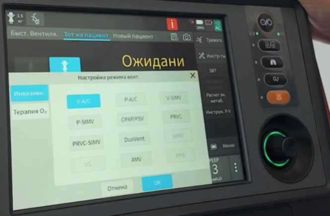
  <figcaption>Рис. 1. Окно выбора режима инвазивной вентиляции на аппарате станции для ребёнка массой 3,5 кг: V-A/C, P-A/C, V-SIMV, P-SIMV, CPAP/PSV, PRVC, PRVC-SIMV, DuoVent, APRV, VS, AMV, PPS. Режимы APRV, VS и PPS выделены серым и недоступны для выбора; CPRV для детей не предусмотрен. Справа — меню инструментов с пробой самостоятельного дыхания, задержкой выдоха, расчётом энергетического метаболизма и инструментом P-V.</figcaption>
</figure>

# Режимы вентиляции

## Сводная таблица

| Режим | Управляемая величина | Задаёт оператор | Обеспечивает аппарат |
|---|---|---|---|
| V-A/C | Объём | O₂%, TV, Tinsp либо I:E, f, PEEP, поддержка, триггер, Tпауза либо поток вдоха, синхронизация, тип потока | Заданный объём за заданное время при постоянном либо нисходящем потоке; давление — производная величина |
| P-A/C | Давление | O₂%, ΔPinsp, f, Tinsp либо I:E, PEEP, поддержка, триггер, Tslope, синхронизация | Подъём давления до заданного уровня за время Tslope и удержание до конца вдоха |
| V-SIMV | Объём | O₂%, TV, Tinsp, f SIMV, Tпауза либо поток, ΔPsupp, PEEP, триггер, Exp %, Tslope, параметры апноэ, тип потока, синхронизация | Заданное число принудительных вдохов с управляемым объёмом, между ними спонтанное дыхание или поддержка давлением |
| P-SIMV | Давление | O₂%, ΔPinsp, f SIMV, Tinsp, ΔPsupp, PEEP, триггер, Exp %, Tslope, параметры апноэ, синхронизация | То же с принудительными вдохами с регулируемым давлением |
| CPAP/PSV | Давление | O₂%, PEEP, ΔPsupp, триггер, Exp %, Tslope, параметры апноэ, синхронизация; при неинвазивной вентиляции дополнительно Ti max | Постоянное положительное давление; поддержка давлением каждой инспираторной попытки |
| PRVC | Объём при регулируемом давлении | O₂%, TV, f, Tinsp либо I:E, PEEP, поддержка, триггер, Tslope, синхронизация | Достижение заданного объёма минимально возможным давлением с пошаговой подстройкой |
| PRVC-SIMV | Объём при регулируемом давлении | O₂%, TV, f SIMV, Tinsp, ΔPsupp, PEEP, триггер, Exp %, Tslope, параметры апноэ, синхронизация | Принудительные вдохи по PRVC, между ними спонтанное дыхание или поддержка давлением |
| DuoVent | Два уровня давления | O₂%, Phigh, Plow, Thigh либо f, Tlow либо Tinsp либо I:E, ΔPsupp, триггер, Exp %, Tslope, параметры апноэ, синхронизация | Попеременное переключение двух уровней давления с возможностью спонтанного дыхания на обоих |
| APRV | Два уровня давления с коротким сбросом | O₂%, Phigh, Plow, Thigh, Tlow, Tslope, триггер, параметры апноэ | CPAP с периодическим кратковременным сбросом давления |
| VS | Объём при поддержке давлением | O₂%, TV, PEEP, триггер, Exp %, Tslope, параметры апноэ, синхронизация, Ti max | Поддержка каждой попытки вдоха давлением, подбираемым для достижения заданного объёма |
| PSV-S/T | Давление, неинвазивная вентиляция | O₂%, ΔPsupp, f, Tinsp, PEEP, Ti max, триггер, Exp %, Tslope, синхронизация | Поддержка давлением инспираторных попыток с гарантированной частотой при их отсутствии |
| AMV | Целевой минутный объём | O₂%, MV%, PEEP, триггер, Exp %, Tslope, синхронизация | Подбор частоты и объёма с наименьшей работой дыхания при заданном минутном объёме |
| CPRV | Объём, триггер выключен | TV, f, O₂%, Tinsp либо I:E, PEEP, Tпауза либо поток, подсказка компрессий, f компрессий, тип потока | Вентиляция по V-A/C без синхронизации с пациентом на фоне компрессий |
| PPS | Давление, пропорциональное усилию | O₂%, параметры апноэ, PEEP, триггер, Exp %, PPV%, предельные давление, объём, эластичность и сопротивление | Поддержка, пропорциональная дыхательному усилию пациента |
| NCPAP, NIPPV, SNIPPV | Давление, неинвазивная вентиляция новорождённых | См. РЭ, стр. 142–145 | Постоянное либо перемежающееся положительное давление через назальный интерфейс |

Источник: РЭ, стр. 122–146.

## Особенности отдельных режимов

**V-A/C.** Аппарат подаёт заданный дыхательный объём за заданное время вдоха. Форма потока задаётся прямоугольной (по умолчанию) либо нисходящей; при нисходящей форме конечный поток вдоха устанавливается в долях от пикового в диапазоне 0–75 %, по умолчанию 25 % (РЭ, стр. 124, 254). Пауза вдоха задаётся в процентах от времени вдоха (5–60 %) либо вместо неё задаётся поток вдоха — выбор производится в меню [Настр.] → [Вентиляция] (РЭ, стр. 95). В фазе выдоха поддерживается синхронный запуск: обнаруженная попытка вдоха запускает следующий принудительный цикл раньше расчётного момента (РЭ, стр. 122–123). Давление в дыхательных путях в этом режиме является производной величиной: при снижении податливости или повышении сопротивления объём сохраняется, а давление растёт, и вдох прерывается при достижении верхнего предела тревоги по давлению.

<figure>
  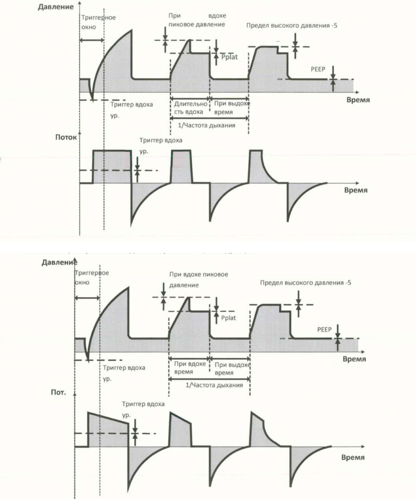
  <figcaption>Рис. 2. Кривые давления и потока в режиме V-A/C. Вверху — прямоугольная форма потока, внизу — нисходящая. Отмечены окно триггера, пиковое давление и давление плато при паузе вдоха, а также ограничение давления на уровне верхнего предела тревоги минус 5 см вод. ст.</figcaption>
</figure>

**P-A/C.** Давление поднимается до заданного уровня за время Tslope и удерживается до конца вдоха; скорость подачи газа в фазе удержания изменяется в зависимости от сопротивления и податливости. Переключение в фазу выдоха происходит немедленно, если поданный объём превысил верхний предел тревоги по дыхательному объёму. При превышении ограничения давления (верхний предел тревоги минус 5 см вод. ст.) инспираторное давление удерживается на уровне ограничения (РЭ, стр. 124–125). При использовании закрытого аспирационного катетера руководство рекомендует режимы P-A/C или P-SIMV (РЭ, стр. 121).

<figure>
  
  <figcaption>Рис. 3. Кривые давления и потока в режиме P-A/C. Давление нарастает за время Tslope до уровня ΔPinsp над PEEP и удерживается до конца вдоха; инспираторный поток убывает по мере выравнивания давления. Пунктиром показан цикл, запущенный инспираторной попыткой пациента.</figcaption>
</figure>

**V-SIMV, P-SIMV и PRVC-SIMV.** Окно триггера составляет 5 с для взрослых и 1,5 с для детей и новорождённых; если время выдоха короче окна, окном триггера является вся фаза выдоха. Инспираторная попытка внутри окна вызывает принудительный вдох; при её отсутствии принудительный вдох подаётся в конце окна. Вне окна триггера пациент дышит спонтанно либо с поддержкой давлением (РЭ, стр. 126–133). Принудительный вдох в V-SIMV выполняется с управляемым объёмом, в P-SIMV — с регулируемым давлением, в PRVC-SIMV — по алгоритму PRVC. Заданная частота f SIMV определяет только число принудительных вдохов и составляет нижнюю границу частоты вентиляции: общая частота может быть выше за счёт собственных вдохов пациента.

Словом «спонтанный» руководство обозначает вдох, который начинает и заканчивает сам пациент: его объём определяется усилием и механикой лёгких, а не уставкой. Если ΔPsupp больше нуля, каждый собственный вдох получает поддержку: аппарат по триггеру поднимает давление на ΔPsupp над PEEP и завершает вдох при снижении инспираторного потока до порога Exp %. Если ΔPsupp равно нулю, пациент дышит на уровне PEEP, а аппарат подаёт газ по потребности. Принудительный вдох, вызванный попыткой пациента внутри окна триггера, собственным не считается: пациент задаёт только момент его начала, а давление или объём и длительность заданы уставками. В режимах с собственным дыханием фаза вдоха на кривой окрашивается красным, указывая на спонтанный вдох либо вдох с поддержкой давлением (РЭ, стр. 121).

<figure>
  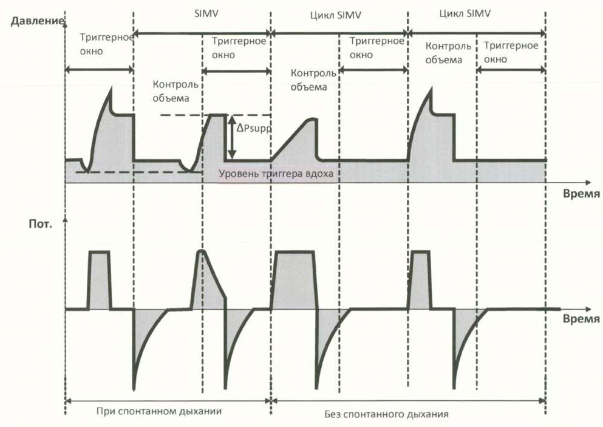
  <figcaption>Рис. 4. Кривые в режиме V-SIMV с поддержкой давлением. Внутри окон триггера подаются принудительные вдохи с управляемым объёмом, вне окон — спонтанные вдохи с поддержкой ΔPsupp; слева показано дыхание при сохранённой спонтанной активности, справа — при её отсутствии, когда принудительный вдох подаётся в конце окна.</figcaption>
</figure>
<figure>
  
  <figcaption>Рис. 5. Кривые в режиме P-SIMV с поддержкой давлением. Показаны окна активации, внутри которых инспираторная попытка вызывает принудительный вдох, циклы с регулируемым давлением и спонтанные вдохи с поддержкой давлением между ними.</figcaption>
</figure>

**CPAP/PSV.** Аппарат поддерживает заданное положительное давление на протяжении всего цикла; каждая попытка вдоха, достигшая порога триггера, получает поддержку ΔPsupp, и вдох завершается при снижении потока до уровня Exp %. При отсутствии спонтанного дыхания дольше заданного времени апноэ активируется резервная вентиляция при апноэ (РЭ, стр. 129–131).

<figure>
  
  <figcaption>Рис. 6. Кривые в режиме CPAP/PSV. Слева спонтанное дыхание на постоянном уровне давления с поддержкой ΔPsupp: вдох завершается при снижении потока до уровня Exp %. Справа истечение времени апноэ и переход в резервную вентиляцию при апноэ.</figcaption>
</figure>

**PRVC.** Первый цикл является пробным и служит для расчёта податливости и сопротивления системы «аппарат — лёгкие»; результат используется для выбора уровня давления. В первых трёх циклах прирост давления не превышает 10 см вод. ст., далее — 3 см вод. ст. за цикл; максимальное давление не превышает верхнего предела тревоги по давлению минус 5 см вод. ст. Аппарат обеспечивает равенство заданному объёму среднего значения объёмов вдоха и выдоха (РЭ, стр. 131).

<figure>
  
  <figcaption>Рис. 7. Кривые в режиме PRVC. Первый цикл пробный и служит для расчёта податливости и сопротивления. В последующих циклах уровень давления подбирается пошагово до достижения заданного объёма. Изображение воспроизведено из редакции руководства 2022.05, где верхней границей давления указан предел тревоги минус 10 см вод. ст.; в редакции 08/2024 граница составляет предел тревоги минус 5 см вод. ст.</figcaption>
</figure>
<figure>
  
  <figcaption>Рис. 8. Кривые в режиме PRVC-SIMV с поддержкой давлением. Принудительные циклы выполняются по алгоритму PRVC, между ними доступны спонтанные вдохи с поддержкой давлением.</figcaption>
</figure>

**DuoVent.** Окно триггера на ступени низкого давления составляет 5 с после времени низкого давления, на ступени высокого давления — последнюю четверть времени высокого давления. Триггер вдоха в окне нижней ступени переключает аппарат на верхний уровень, триггер выдоха в окне верхней ступени — на нижний. Поддержка давлением задаётся для фазы низкого давления (РЭ, стр. 134). Временные параметры задаются парой Thigh и Tlow либо частотой с Tinsp или I:E — по выбору в меню [Настр.] → [Вентиляция] (РЭ, стр. 95–96).

<figure>
  
  <figcaption>Рис. 9. Кривые в режиме DuoVent. Аппарат попеременно поддерживает два уровня давления: Phigh в течение Thigh и Plow в течение Tlow. На обеих ступенях возможно спонтанное дыхание, на нижней к нему добавляется поддержка давлением. Окно активации нижней ступени — 5 с после времени низкого давления, верхней — последняя четверть времени высокого давления.</figcaption>
</figure>

**APRV.** Режим рассматривается руководством как CPAP с периодическим кратковременным сбросом давления; ограничение инспираторного давления действует так же, как в остальных режимах с регулируемым давлением (РЭ, стр. 135).

<figure>
  
  <figcaption>Рис. 10. Кривые в режиме APRV. Высокое давление удерживается в течение Thigh, сброс до Plow занимает короткое время Tlow; спонтанное дыхание сохраняется преимущественно на уровне высокого давления.</figcaption>
</figure>

**VS.** Каждая попытка вдоха, достигшая порога триггера, получает поддержку давлением, уровень которого аппарат подбирает так, чтобы обеспечить заданный дыхательный объём; длительность вдоха и выдоха полностью определяется пациентом. Первый цикл пробный и выполняется при давлении 10 см вод. ст. над PEEP; прирост давления ограничен так же, как в PRVC, а максимальное давление не превышает верхнего предела тревоги минус 5 см вод. ст. При отсутствии попыток вдоха дольше времени апноэ включается резервная вентиляция (РЭ, стр. 136–137).

<figure>
  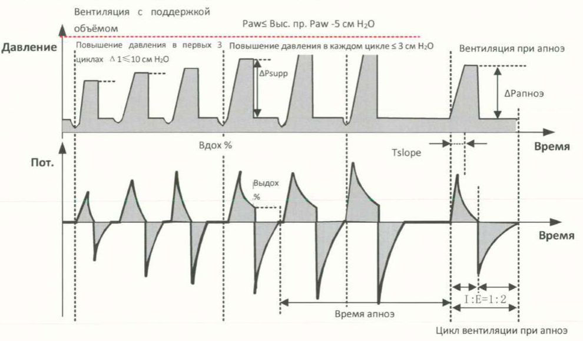
  <figcaption>Рис. 11. Кривые в режиме VS. Поддержка давлением подбирается от цикла к циклу: прирост не более 10 см вод. ст. в первых трёх циклах и не более 3 см вод. ст. далее, давление не выше верхнего предела тревоги минус 5 см вод. ст. Справа — переход в резервную вентиляцию после истечения времени апноэ.</figcaption>
</figure>

**PSV-S/T.** Инспираторная попытка получает поддержку давлением; если в пределах максимального дыхательного цикла (60 с, делённые на заданную частоту) попытка не обнаружена, автоматически подаётся принудительный вдох с заданными частотой и временем вдоха (РЭ, стр. 137–138).

<figure>
  
  <figcaption>Рис. 12. Кривые в режиме PSV-S/T, применяемом при неинвазивной вентиляции. Инспираторная попытка получает поддержку давлением; при её отсутствии в пределах заданного цикла аппарат подаёт принудительный вдох с регулируемым давлением, чем обеспечивается заданная частота.</figcaption>
</figure>

**AMV.** Оператор задаёт целевой минутный объём в процентах от нормального (MV%, 25–350 %); нормальный минутный объём рассчитывается от идеальной массы тела. Частота и дыхательный объём подбираются по уравнению Отиса так, чтобы работа дыхания при целевом минутном объёме была минимальной, а I:E корректируется по измеренной постоянной времени выдоха. Первые три цикла пробные, с регулируемым давлением; далее аппарат проводит принудительную вентиляцию при отсутствии собственного дыхания и поддерживающую — при его восстановлении. Режим применяется только у взрослых и детей; соотношение объёма и частоты отображается в окне [Статус] как AMV-Вид (РЭ, стр. 85, 139–141).

**CPRV.** Режим построен на V-A/C: триггер вдоха выключен, по умолчанию O₂ 100 %, I:E 1:2, PEEP 0 см вод. ст. Вентиляция начинается сразу после выбора категории пациента и идеальной массы тела; дыхательный объём и частота могут быть изменены. Дополнительно задаются подсказка о компрессиях и их частота (90–130 в минуту) (РЭ, стр. 141–142, 254). Режим доступен только для взрослых; верхний предел тревоги по давлению в нём по умолчанию составляет 60 см вод. ст. (РЭ, стр. 119, 268). Задержка выдоха в CPRV недоступна (РЭ, стр. 181).

<figure>
  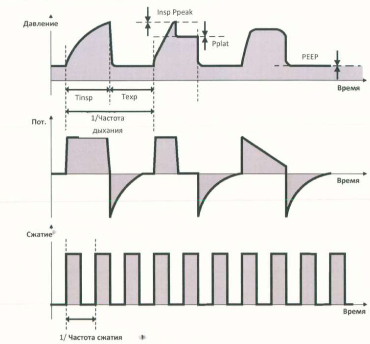
  <figcaption>Рис. 13. Кривые в режиме CPRV. Принудительные вдохи с управляемым объёмом при прямоугольной либо нисходящей форме потока; нижняя кривая — метка компрессий с периодом, равным единице, делённой на частоту компрессий.</figcaption>
</figure>
<figure>
  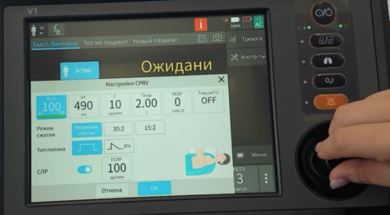
  <figcaption>Рис. 14. Окно настройки режима CPRV на аппарате станции. Верхний ряд — O₂ 100 %, TV 490 мл, f 10/мин, Tinsp 2,00 с, PEEP 0 см вод. ст., пауза вдоха выключена; ниже — схема компрессий (непрерывные, 30:2, 15:2), форма потока (прямоугольная либо нисходящая) и частота компрессий 100/мин.</figcaption>
</figure>

Значения по умолчанию соответствуют рекомендациям Европейского совета по реанимации для вентиляции при обеспеченной проходимости дыхательных путей: 10 вдохов в минуту на фоне непрерывных компрессий, максимально доступная концентрация кислорода, дыхательный объём около 6–7 мл/кг (Soar et al., Resuscitation, 2021). Нулевое PEEP по умолчанию исключает дополнительное повышение внутригрудного давления, препятствующее венозному возврату во время компрессий.

**PPS.** Пропорциональная поддержка давлением: создаваемое давление пропорционально дыхательному усилию пациента, а начало и окончание вдоха определяет пациент. Задаются процент поддержки PPV% и предельные значения давления (5–40 см вод. ст.), дыхательного объёма, эластичности и сопротивления, компенсируемых аппаратом (РЭ, стр. 145–146, 253).

# Общие механизмы, действующие во всех режимах

## Ограничение давления

Максимальное ограниченное давление составляет 80 см вод. ст., максимальный минутный объём — 60 л/мин. При установке ΔPinsp или верхнего предела тревоги по давлению выше 60 см вод. ст. требуется подтверждение нажатием поворотной ручки (РЭ, стр. 121).

В режимах с регулируемым давлением инспираторное давление ограничивается уровнем «верхний предел тревоги по давлению минус 5 см вод. ст.» (РЭ, стр. 125, 128, 134–135). Максимальным рабочим давлением является сам верхний предел тревоги: при его достижении формируется сигнал высокого приоритета, клапан выдоха открывается и аппарат переходит в фазу выдоха до снижения давления до PEEP. При превышении предела на 5 см вод. ст. открывается предохранительный клапан и сбрасывает давление до 0 см вод. ст. Отрицательного давления в фазе выдоха аппарат не создаёт, однако при спонтанном дыхании пациента оно возможно (РЭ, стр. 121). Рекомендованный руководством верхний предел тревоги по давлению — до 60 см вод. ст., за исключением особых случаев (РЭ, стр. 108).

## Вентиляция при апноэ

Резервный режим активируется при отсутствии дыхания дольше заданного времени апноэ в режимах V-SIMV, P-SIMV, CPAP/PSV, DuoVent, APRV, PRVC-SIMV, VS и PPS. Прекращается при обнаружении двух последовательных спонтанных вдохов, при смене режима вентиляции либо при отключении функции (РЭ, стр. 146–147).

| Тип вентиляции | Режим вентиляции при апноэ | Задаваемые параметры |
|---|---|---|
| Инвазивная, настройка [Конт.объема] (по умолчанию) | V-A/C | TV апноэ, f апноэ, Tinsp апноэ либо I:E апноэ |
| Инвазивная, настройка [Конт.давл.] | P-A/C | ΔP апноэ, f апноэ, Tinsp апноэ либо I:E апноэ |
| Неинвазивная | P-A/C | ΔP апноэ, f апноэ, Tinsp апноэ либо I:E апноэ |

Источники: РЭ, стр. 96, 147. Остальные уставки при переходе в резервный режим сохраняются. Время апноэ по умолчанию — 15 с (РЭ, стр. 269).

## Компенсация утечки

Объём утечки обновляется после каждого дыхательного цикла по разнице объёмов вдоха и выдоха и используется для расчёта скорости утечки в следующем цикле; скорость утечки пропорциональна давлению в дыхательных путях. В фазе выдоха аппарат увеличивает основной поток, компенсируя утечку, чтобы давление в конце выдоха не оказалось ниже заданного PEEP; поток, по которому оценивается инспираторная попытка, также компенсируется. Отображаемые поток, объём, TV и MV приводятся с учётом компенсации (РЭ, стр. 147).

Увеличение основного потока не повышает давление выше заданного, поскольку PEEP задаётся клапаном выдоха: клапан удерживает давление на заданном уровне, выпуская наружу избыток газа. Утечка отводит часть газа мимо клапана, и аппарат восполняет утраченный объём; излишек по-прежнему сбрасывается клапаном выдоха.

В режимах с управляемым объёмом аппарат подаёт заданный объём плюс объём утечки; при инвазивной вентиляции компенсация не превышает 80 % заданного дыхательного объёма. В режимах с регулируемым давлением компенсация ограничена максимальной производительностью подачи газа и верхним пределом тревоги по дыхательному объёму; при сигнале [Огр объема] дальнейшая компенсация достигается повышением верхнего предела тревоги по TV либо отключением этого сигнала (РЭ, стр. 147).

## Синхронизация

При включённой функции [Синх.под.] в режимах V-A/C, P-A/C, V-SIMV, P-SIMV, CPAP/PSV, PRVC, PRVC-SIMV, DuoVent, VS, AMV, PPS и PSV-S/T аппарат анализирует кривые потока и давления и адаптивно изменяет чувствительность триггеров вдоха и выдоха и время нарастания давления: при затруднённом запуске вдоха порог снижается, при ложных срабатываниях — повышается. Функция применяется у взрослых и детей и не применяется у новорождённых (РЭ, стр. 147–148).

## Вздох

Функция доступна в режимах V-A/C, P-A/C, V-SIMV, P-SIMV, PRVC, PRVC-SIMV и AMV; в цикле вздоха PEEP периодически повышается на заданное приращение. Задаются включение функции, интервал между вздохами (20 с — 180 мин, по умолчанию 1 мин), число циклов вздоха (1–20, по умолчанию 3) и приращение давления (1–40 см вод. ст.); по умолчанию функция выключена (РЭ, стр. 201, 254, 267).

# Устройство аппарата

## Передняя панель

Нумерация соответствует руководству (РЭ, стр. 40–42).

<figure>
  
  <figcaption>Рис. 15. Передняя панель. Выноски соответствуют нумерации таблицы: 1 — рукоятка, 2 — индикатор тревоги, 4 — сенсорный экран, 5 — индикатор аккумулятора, 6 — кнопка питания, 7 — индикатор внешнего питания, 8 — блокировка экрана, 9 — ручная вентиляция и удержание вдоха, 10 — обогащение кислородом и отсасывание, 11 — приостановка звукового сигнала, 12 — поворотная ручка. При заблокированном экране часть аппаратных клавиш сохраняет работоспособность.</figcaption>
</figure>

| № | Орган управления или индикатор | Функция |
|---|---|---|
| 1 | Рукоятка | Перенос аппарата |
| 2 | Индикатор тревоги | Высокий приоритет — красный, частое мигание; средний — жёлтый, редкое мигание; низкий — жёлтый, горит постоянно |
| 3 | Обозначение модели | — |
| 4 | Сенсорный экран | Отображение интерфейсов и ввод уставок |
| 5 | Индикатор аккумулятора | Мигание — заряд от внешнего источника; горит — заряжен либо питание от аккумулятора; не горит — аккумулятор отсутствует, неисправен или внешнее питание не подключено |
| 6 | Кнопка питания и режима ожидания | Нажатие при выключенном аппарате — включение и самопроверка; нажатие во время вентиляции — запрос перехода в режим ожидания; нажатие с удержанием в режиме ожидания — запрос выключения |
| 7 | Индикатор внешнего питания | Горит при подключении сети переменного или постоянного тока |
| 8 | Блокировка экрана | Блокирует и разблокирует сенсорный экран и поворотную ручку; при активной блокировке горит зелёным |
| 9 | Ручная вентиляция и удержание вдоха | Нажатие и отпускание в фазе выдоха вызывает принудительный вдох; удержание кнопки задерживает вдох не более чем на 30 с у взрослых и детей и 5 с у новорождённых |
| 10 | Обогащение кислородом и отсасывание мокроты | Запуск вентиляции с повышенной концентрацией кислорода на заданное время и подготовка к санации дыхательных путей; повторное нажатие завершает функцию |
| 11 | Приостановка звукового сигнала | Отключение звука на 120 с; повторное нажатие отменяет приостановку |
| 12 | Поворотная ручка | Вращение — перебор пунктов и изменение значений, нажатие — выбор и подтверждение |
| 13 | Логотип изготовителя | — |
| 14 | Отсек аккумулятора | До двух аккумуляторов |

Источники: РЭ, стр. 40–42, 93, 107, 158, 180.

## Правая сторона, задняя и левая панели

<figure>
  
  <figcaption>Рис. 16. Правая сторона. 1 — разъём SpO₂, 2 — разъём CO₂, 3 — динамик, 4 — порт датчика потока, 5 — порт распылителя, 6 — порт выпуска газа, 7 — порт выдоха, 8 — порт вдоха. Съёмный узел клапана выдоха устанавливается в отверстие дыхательной трубки на этой же стороне.</figcaption>
</figure>
<figure>
  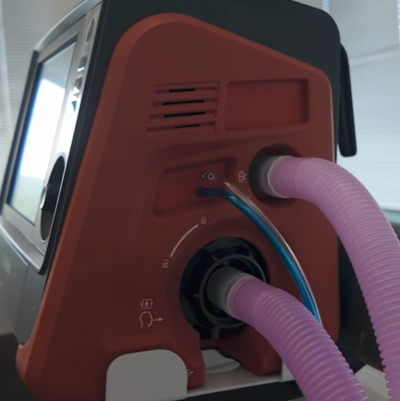
  <figcaption>Рис. 17. Правая сторона аппарата станции с подключённым дыхательным контуром: порт вдоха, трубки датчика потока, клапан выдоха с портом выдоха. Над портами — заглушка на месте разъёмов SpO₂ и CO₂, представленных на рис. 16.</figcaption>
</figure>
<figure>
  
  <figcaption>Рис. 18. Задняя панель. 1 — датчик O₂, 2 — воздухозаборник с пылевым фильтром, через который турбина забирает воздух помещения для вентиляции (на корпусе нанесено предупреждение не загораживать его), 3 — задняя крышка для замены фильтра HEPA и датчика O₂, 4 — фильтр HEPA под крышкой, 5 — запасное отверстие для впуска воздуха, через которое пациент дышит атмосферным воздухом самостоятельно, когда аппарат прекратил вентиляцию и открыл клапаны, 6 — паспортная табличка.</figcaption>
</figure>
<figure>
  
  <figcaption>Рис. 19. Левая сторона. 1 — USB-порт, 2 — порт O₂ высокого давления, 3 — порт O₂ низкого давления, 4 — порт питания переменного тока, 5 — проводник уравнивания потенциалов, 6 — порт питания постоянного тока, 7 — вентиляционное отверстие вентилятора, 8 — сетевой порт. Одновременное подключение к портам кислорода высокого и низкого давления не допускается.</figcaption>
</figure>

| Сторона | Порты и элементы |
|---|---|
| Правая (РЭ, стр. 43) | Разъём кабеля SpO₂, разъём кабеля CO₂, динамик, разъём датчика потока, разъём пневматического распылителя, порт выпуска газа, порт выдоха, порт вдоха |
| Задняя (РЭ, стр. 44) | Датчик O₂, воздухозаборник с пылевым фильтром, задняя крышка, фильтр HEPA, запасное отверстие для впуска воздуха, паспортная табличка |
| Левая (РЭ, стр. 42–43) | USB-порт (экспорт данных и конфигурации, обновление программного обеспечения, питание внешних USB-устройств без передачи данных), вход O₂ высокого давления, вход O₂ низкого давления, вход питания переменного тока, проводник уравнивания потенциалов, вход питания постоянного тока, вентиляционное отверстие вентилятора, сетевой порт (центральная система мониторинга Comen, монитор, калибровка при обслуживании изготовителем) |

| Отверстие | Где находится | Назначение |
|---|---|---|
| Воздухозаборник с пылевым фильтром | Задняя панель, выноска 2 на рис. 18 | Забор воздуха помещения турбиной для вентиляции пациента; блокировать его запрещают руководство и маркировка на корпусе (РЭ, стр. 44) |
| Запасное отверстие для впуска воздуха | Задняя панель, выноска 5 на рис. 18 | Самостоятельное дыхание пациента атмосферным воздухом, когда аппарат прекратил вентиляцию и открыл предохранительный клапан и клапан выдоха (РЭ, стр. 44, 157) |
| Вентиляционное отверстие вентилятора | Левая сторона, выноска 7 на рис. 19 | Охлаждение аппарата; с дыхательным контуром не связано |

Отверстия на задней и боковых сторонах аппарата закрывать запрещено (РЭ, стр. 45). Аппарат не ставится вплотную к стенке салона, к матрасу или к сумке, не накрывается и не укладывается задней панелью на поверхность.

## Основной интерфейс

Верхняя строка экрана собирает индикаторы состояния, нижняя — режим и уставки. Нумерация в таблице соответствует выноскам на рис. 20 и руководству (РЭ, стр. 79–81).

| № | Элемент | Что показывает |
|---|---|---|
| 1 | Тип пациента и триггер вдоха | Силуэт с числом — категория пациента и заданная масса тела в килограммах. Рядом значок триггера вдоха, вспыхивающий на 1 с при срабатывании триггера |
| 2 | Тип вентиляции | Значок инвазивной либо неинвазивной маски; нажатие на значок инвазивной вентиляции открывает настройку TRC |
| 3 | Обогащение кислородом и отсасывание мокроты | Значок и обратный отсчёт оставшегося времени работы функции |
| 4 | Сообщение о тревоге | Текст текущего сообщения и число одновременных сообщений; нажатие открывает время возникновения, продолжительность и приоритет |
| 5 | Данные за прошедшие периоды | Табличные и графические тренды, настройки и журнал событий |
| 6 | Неактивные тревоги | Значок появляется, когда условия тревоги исчезли, а сообщения сохранены: до 10 записей |
| 7 | Снимок экрана | Сохранение изображения экрана в формате png |
| 8 | Приостановка звука | Обратный отсчёт 120 с; наличие отсчёта означает, что есть по меньшей мере один действующий сигнал тревоги |
| 9 | Стоп-кадр | Остановка обновления кривых и петель спирометрии |
| 10 | Сеть | Состояние проводного и беспроводного сетевого подключения |
| 11 | USB | Появляется при распознанном USB-устройстве |
| 12 | Аккумулятор | Состояние и заряд в процентах |
| 13 | Внешнее питание | AC — переменный ток, DC — постоянный; при одновременном подключении отображается AC |
| 14 | Область быстрого сообщения | Текущая системная подсказка |
| 15 | Функциональные клавиши | Тревоги, распылитель, инструменты, меню |
| 16 | Клавиши настройки параметров | Уставки, соответствующие выбранному режиму |
| 17 | Настройка режима вентиляции | Название текущего режима; нажатие открывает выбор режима |
| 18 | Область кривых, петель, значений и состояния | По выбранной вкладке [Осц-мы], [Циклы], [Зн-я], [Статус] |
| 19 | Значок триггера спонтанного вдоха | Отображается при спонтанном вдохе пациента |

<figure>
  
  <figcaption>Рис. 20. Основной интерфейс во время вентиляции; выноски 1–19 разобраны в таблице выше. На снимке: взрослый пациент 70 кг, инвазивная вентиляция, идёт обогащение кислородом с остатком 102 с, шесть одновременных сообщений тревоги с выведенным «Слишком низкий FiO₂», режим P-A/C с уставками O₂ 50 %, ΔPinsp 15 см вод. ст., f 10/мин, I:E 1:2, PEEP 3 см вод. ст.</figcaption>
</figure>

Вкладка [Циклы] отображает до двух петель спирометрии из P-V, F-V, F-P и V-CO₂; до 10 петель сохраняются как эталонные для последующего сравнения (РЭ, стр. 81–83). Вкладка [Статус] содержит калькулятор расхода кислорода с расчётом оставшегося времени по заданным объёму и давлению баллона, пульмограмму («динамические лёгкие»), кратковременный тренд за 30 мин либо AMV-Вид и значения мониторинга (РЭ, стр. 84–85, 183–185).

Стоп-кадр останавливает обновление кривых и петель: для просмотра доступны кривые за 2 мин до нажатия и петля последнего дыхательного цикла, числовые значения продолжают обновляться. Выход — повторным нажатием, без действий оператора — автоматически через 3 мин (РЭ, стр. 91–92). Блокировка экрана отключает сенсорный экран, поворотную ручку и часть клавиш; действующими остаются клавиши, перечисленные в разделе 5.10 руководства (РЭ, стр. 93).

# Питание

Аппарат работает от сети переменного тока 100–240 В, от источника постоянного тока 12–30,3 В и от одного или двух встроенных литий-ионных аккумуляторов ёмкостью 6600 мА·ч; замена аккумулятора возможна без прерывания работы. Шнур питания переменного тока фиксируется ограничительным основанием на винтах (РЭ, стр. 47, 245). При подключении к источнику постоянного тока изделие относится к классу II без защитного заземления; защита от обратной полярности самим аппаратом не обеспечивается, используется только кабель изготовителя. При недостаточной мощности источника аппарат переходит на аккумулятор с технической тревогой. Запуск двигателя автомобиля во время работы от автомобильной розетки исключается (РЭ, стр. 48–49).

| Характеристика | Значение |
|---|---|
| Время работы от одного нового аккумулятора | Более 300 мин |
| Время работы от двух новых аккумуляторов | Более 600 мин |
| Условия измерения | Тестовое лёгкое R = 20 см вод. ст./(л/с), C = 50 мл/см вод. ст.; P-A/C, ΔPinsp 10 см вод. ст., f 10/мин, I:E 1:4, PEEP 5 см вод. ст., O₂ 21 % |
| Полная зарядка | Около 4 ч для одного и 8 ч для двух аккумуляторов |
| «Используется батарея», низкий приоритет | Около 2 ч до отключения |
| «Низкий заряд», средний приоритет (11–19 %) | Около 10 мин до отключения |
| «Аккумулятор разряжается», высокий приоритет (менее 11 %) | Около 5 мин, затем безопасное отключение |
| Потеря питания без достаточного заряда | Звуковой сигнал зуммером не менее 120 с без световой индикации и изображения |

Источники: РЭ, стр. 104, 202–203, 245. Время до отключения указано для одного нового аккумулятора при 25 °C и максимальном энергопотреблении. Срок службы аккумулятора — 300 циклов заряда и разряда; оптимизация полным циклом рекомендуется каждые три месяца (РЭ, стр. 203, 205).

Настройки пациента и сигналов тревоги сохраняются при отключении питания независимо от его длительности. При неожиданном отключении питания во время вентиляции и его восстановлении аппарат включается автоматически и возобновляет вентиляцию с последней конфигурацией; при перезапуске в течение 30 с восстанавливаются и настройки тревоги (РЭ, стр. 45, 105–106).

# Газоснабжение

Аппарат имеет два порта подачи кислорода: высокого и низкого давления. Одновременное подключение источников высокого и низкого давления не допускается (РЭ, стр. 50).

| Характеристика | O₂ высокого давления | O₂ низкого давления |
|---|---|---|
| Давление или расход | 280–600 кПа, поток до 200 л/мин | Давление менее 100 кПа, расход не более 15 л/мин |
| Источник | Централизованная подача, баллон через редуктор, стационарная ёмкость с жидким кислородом | Баллон, концентратор кислорода |
| Установка концентрации O₂ на аппарате | Доступна | **Недопустима** |
| Контроль концентрации O₂ | Активен | **Не активируется**, контроль возложен на оператора; пределы тревоги FiO₂ устанавливаются вручную |
| Обогащение кислородом, распыление, кислородотерапия | Доступны | **Отключены** |

Источники: РЭ, стр. 50–51, 98, 109, 182, 195, 247–248. Подача менее 280 кПа влияет на работу аппарата и способна прекратить вентиляцию; давление 1000 кПа влияет на работу, но угрозы для пациента не создаёт (РЭ, стр. 51). Кислород концентратора с концентрацией 93 % во вход высокого давления не подаётся: точность контроля концентрации при этом не сохраняется (РЭ, стр. 18). Тип подачи (высокое либо низкое давление) устанавливается в меню [Настр.] → [Тип O₂] до начала вентиляции (РЭ, стр. 98).

Перед вводом в эксплуатацию устанавливается датчик O₂; порт подачи проверяется на отсутствие утечки, создающей обогащённую кислородом среду вблизи изделия; при необычном звуке после подключения источника эксплуатация прекращается. При транспортировке с подачей низкого давления предусматривается аварийный источник кислорода (РЭ, стр. 50). Аппарат комплектуется химическим датчиком кислорода со сроком службы около года и ежедневной калибровкой либо ультразвуковым датчиком, устанавливаемым на заводе (РЭ, стр. 68–70).

# Сборка дыхательного контура

## Клапан выдоха

Съёмный узел собирается из мембраны клапана выдоха, сердечника и ручки, после чего совмещается с отверстием дыхательной трубки на правой стороне аппарата; фиксация — поворотом ручки по часовой стрелке. Клапан выбирается по категории пациента: несоответствие вызывает сигнал [ошибка экспираторного клапана], у новорождённых используется неонатальный клапан (РЭ, стр. 53–54).

<figure>
  
  <figcaption>Рис. 21. Клапан выдоха. 1 — мембрана, 2 — сердечник, 3 — ручка, 4 — съёмный узел в сборе. Слева порядок сборки узла, справа установка узла в отверстие на правой стороне аппарата с фиксацией поворотом ручки по часовой стрелке.</figcaption>
</figure>

Мембрана клапана выдоха проверяется регулярно: распыление лекарственных препаратов способно её загрязнить и вызвать залипание клапана (РЭ, стр. 63). Конденсат выдыхаемого газа может скапливаться в клапане выдоха; признаками являются неправильная форма кривой потока и нестабильный дыхательный объём. Скопившаяся вода удаляется при снятом клапане, а установка бактериального фильтра между трубкой выдоха и клапаном выдоха предотвращает её накопление (РЭ, стр. 230).

## Конфигурации контура

| Конфигурация | Состав | Применение |
|---|---|---|
| Двойной патрубок с увлажнителем | Патрубки вдоха и выдоха, увлажнитель, инспираторный водосборник и водосборник линии выдоха, тройник, датчик потока, распылитель | Взрослые и дети, продолжительная вентиляция |
| Коаксиальный с тепловлагообменником | Коаксиальный патрубок вдоха и выдоха, фильтр с тепловлагообменником HMEF, датчик потока, датчик и адаптер CO₂ | Взрослые и дети, транспортировка |
| Двойной патрубок с увлажнителем для новорождённых | Патрубки, увлажнитель, водосборники, тройник, неонатальный датчик потока, датчик CO₂ | Новорождённые |
| Неинвазивный одиночный патрубок | Одиночный патрубок, генератор давления, линия отбора давления, назальный катетер | Неинвазивная вентиляция новорождённых |
| Контур для кислородотерапии | Порт вдоха, увлажнитель, высокопоточная назальная канюля | Кислородотерапия |

Источник: РЭ, стр. 55–61.

<figure>
  
  <figcaption>Рис. 22. Двухпатрубковый контур с увлажнителем для взрослых и детей. 1 — порт вдоха, 2 — порт выдоха, 3 и 4 — патрубки вдоха и выдоха, 5 и 6 — выход и вход увлажнителя, 7 — увлажнитель, 8 — инспираторный водосборник, 9 — водосборник линии выдоха, 10 — трубка распылителя, 11 — датчик потока, 12 — тройник, 13 — распылитель, 14 — порт датчика потока, 15 — порт распылителя.</figcaption>
</figure>
<figure>
  
  <figcaption>Рис. 23. Коаксиальный контур с фильтром-тепловлагообменником для взрослых и детей. 1 — порт датчика потока, 2 — порт выдоха, 3 — порт датчика CO₂, 4 — порт вдоха, 5 — коаксиальный патрубок вдоха и выдоха, 6 — датчик и адаптер CO₂, 7 — датчик потока, 8 — фильтр с тепловлагообменником. Конфигурация не содержит увлажнителя и водосборников.</figcaption>
</figure>
<figure>
  
  <figcaption>Рис. 24. Контур для кислородотерапии. 1 — порт вдоха, 2 — выход увлажнителя, 3 — вход увлажнителя, 4 — высокопоточная назальная канюля.</figcaption>
</figure>

Бактериальный фильтр устанавливается между аппаратом и патрубком вдоха всегда; фильтр HEPA из аппарата не удаляется. Одновременно учитывается обратное следствие: экспираторный фильтр увеличивает сопротивление выдоха, а чрезмерное сопротивление увеличивает работу дыхания пациента и внутреннее PEEP (РЭ, стр. 52). Датчик потока чувствителен к направлению газового потока и устанавливается в соответствии с маркировкой; неонатальный датчик располагается контуром вверх, при активном увлажнении — под углом более 30° к полу (РЭ, стр. 52, 56).

Распылитель присоединяется к патрубку вдоха; установка его между отверстием для присоединения пациента и трахеальной трубкой увеличивает мёртвое пространство. Во время распыления фильтр выдоха и тепловлагообменник из контура исключаются: аэрозоль засоряет фильтр, что резко увеличивает сопротивление (РЭ, стр. 63). Увлажнитель включается только после выполнения калибровки и проверки аппарата и выключается при переходе в режим ожидания (РЭ, стр. 61, 156).

Опорный рычаг держателя контуров устанавливается на направляющую с левой или правой стороны; предельная нагрузка — 2,5 кг. Перед перемещением аппарата рычаг снимается. Номинальная нагрузка аппарата с принадлежностями при установке на крепление в автомобиле скорой медицинской помощи — 7,5 кг (РЭ, стр. 66, 70).

# Проверка перед началом работы

Полная предоперационная проверка выполняется перед подключением пациента. Аппарат, не прошедший любой из тестов, к клиническому применению не допускается до завершения ремонта и повторного прохождения всех тестов. На время проверки пациент отсоединяется от аппарата, и обеспечивается альтернативный способ вентиляции (РЭ, стр. 73, 75).

## Состав и повод для проверок

| Повод | Проверка или калибровка |
|---|---|
| Перед применением у нового пациента | Предоперационная проверка |
| После установки новых или продезинфицированных дыхательных трубок и компонентов, включая датчики потока и трубки мониторинга давления | Проверка системы, калибровка датчика потока, тест контура |
| После установки нового датчика O₂ либо при соответствующей тревоге | Калибровка O₂% |
| При необходимости | Проверка состояния сигналов тревоги |

Источник: РЭ, стр. 73.

## Последовательность предоперационной проверки

1. Подключение аппарата к источнику питания и к подаче O₂, сборка дыхательного контура пациента.
2. Включение питания. Во время самопроверки поочерёдно мигают красная и жёлтая сигнальные лампы и подаётся звуковой сигнал; при их неисправности аппарат не применяется.
3. В режиме ожидания выбирается [Пров.системы] и выполняется проверка системы.
4. В режиме ожидания выбирается [Тест контура] и выполняется тест контура. При пройденной проверке системы тест контура не требуется.
5. При необходимости выполняется проверка и калибровка датчика O₂.
6. Формируется сигнал тревоги и проверяется его отображение в информационной строке.
7. Состояние тревоги устраняется, сигнал сбрасывается.

Источники: РЭ, стр. 74, 105.

## Проверка системы

По подсказке на экране перекрывается Y-образный тройник, после чего выбирается [Прод-ть]. Проверяемые элементы: частота вращения вентилятора, датчик потока O₂, датчик потока воздуха на вдохе, датчики давления на концах вдоха и выдоха, клапан выдоха, предохранительный клапан, утечка (мл/мин), податливость (мл/см вод. ст.) и сопротивление контура (см вод. ст./(л/с)). Результаты по каждому элементу: пройдено, не пройдено, отменено, ошибка подачи O₂, подача газа отключена, числовое значение (РЭ, стр. 75).

| Итог проверки системы | Значение для работы |
|---|---|
| Выдерживает | Все элементы пройдены |
| Частично пройдено | Часть элементов не пройдена, механическая вентиляция допустима |
| Механическая вентиляция отключена | Часть элементов не пройдена, вентиляция не разрешена |
| Большая утечка, механическая вентиляция отключена | Не выдержали датчик давления, клапан выдоха и предохранительный клапан; вентиляция не допускается |
| Отменено | Часть элементов отменена, остальные пройдены |

Источник: РЭ, стр. 75–76. При итогах, запрещающих вентиляцию, доступны повтор проверки и переход в меню обслуживания изготовителя.

<figure>
  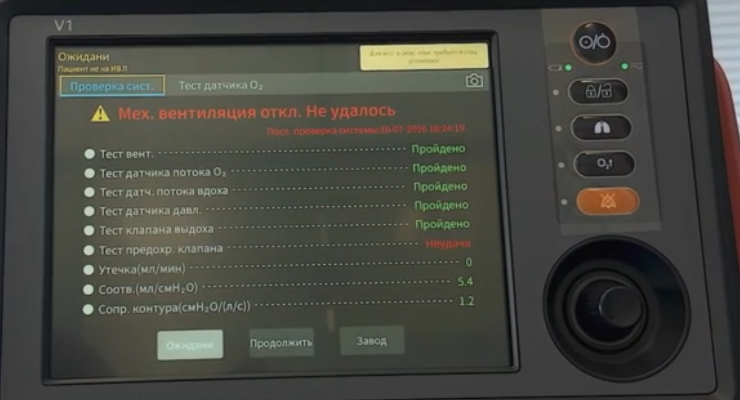
  <figcaption>Рис. 25. Результат проверки системы на аппарате станции с итогом «Механическая вентиляция отключена». Тест вентилятора, датчиков потока O₂ и вдоха, датчика давления и клапана выдоха пройден; тест предохранительного клапана не пройден. Утечка 0 мл/мин, податливость 5,4 мл/см вод. ст., сопротивление контура 1,2 см вод. ст./(л/с).</figcaption>
</figure>

Испытание датчика O₂ выполняется отдельно клавишей [Тест датч. O₂] при включённом мониторинге кислорода; при неудаче появляется клавиша [Калиб. O₂] для калибровки концентрации (РЭ, стр. 76–77). Результаты самопроверки при включении по блокам VCM, VPM, клавиатуры и платы питания доступны в меню [Меню] → [Проверка] (РЭ, стр. 104).

## Тест контура

Проверяемые элементы: утечка (мл/мин), податливость (мл/см вод. ст.), сопротивление контура (см вод. ст./(л/с)). Итог формулируется как «выдерживает», «частично пройдено», «не удалось» либо «отменено» (РЭ, стр. 77–78). Проверка повторяется после каждой замены дыхательной трубки, увлажнителя или фильтра.

## Калибровка датчика потока

На занятии калибровка датчика потока выполнялась в перевёрнутом положении датчика, подключённого через переходник из комплекта поставки: калибровка запускается клавишей «Пуск», а по достижении 50 % датчик возвращается в рабочее положение. Порядок калибровки расхода приведён в разделе 15.5 руководства (РЭ, стр. 228).

# Ввод пациента

В режиме ожидания доступны три пути начала вентиляции (РЭ, стр. 117–118). Явно неправильный рост приводит к неверному расчёту идеальной массы тела и частоты, поэтому значения на экране ожидания проверяются до подключения пациента.

## Быстрая вентиляция

По умолчанию в режиме ожидания открыт интерфейс быстрой вентиляции с тремя преднастройками по массе: 70, 25 и 10 кг (РЭ, стр. 117). Для взрослого пациента преднастройка по умолчанию включает режим V-A/C, TV 490 мл, f 10/мин, I:E 1:2, PEEP 3 см вод. ст., O₂ 50 %, триггер по потоку 2,0 л/мин, прямоугольную форму потока, выключенную паузу вдоха (РЭ, стр. 267); отношение объёма к идеальной массе тела составляет 7 мл/кг. Для остальных преднастроек объём и частота рассчитываются по правилам раздела «Производные уставки». В тексте раздела 8.5 руководства сохранилось указание, что быстрая вентиляция поддерживает только PRVC (РЭ, стр. 119); приложение III и экран аппаратов станции указывают V-A/C.

<figure>
  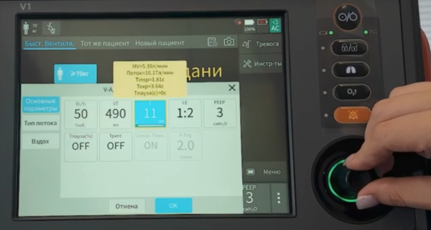
  <figcaption>Рис. 26. Окно настройки режима V-A/C, открытое из быстрой вентиляции на аппарате станции. Заданы O₂ 50 %, TV 490 мл, f 11/мин, I:E 1:2, PEEP 3 см вод. ст., пауза вдоха и триггер выключены. В подсказке — производные величины: минутный объём 5,39 л/мин, инспираторный поток 16,17 л/мин, время вдоха 1,81 с, время выдоха 3,64 с, время паузы 0 с.</figcaption>
</figure>

Отношение дыхательного объёма ко времени вдоха на рис. 26 (0,49 л за 1,82 с, то есть 16,2 л/мин) совпадает с отображаемым инспираторным потоком: при прямоугольной форме поток постоянен на протяжении всего вдоха.

## Новый пациент

Устанавливаются режим вентиляции, тип вентиляции, категория пациента, пол, рост либо идеальная масса тела, после чего выбирается [Н-ть вент]. При вводе роста идеальная масса тела вычисляется автоматически с учётом пола. Изменение пола, роста или массы изменяет значения TV, TV апноэ, f и f апноэ, а также пределы тревоги по дыхательному и минутному объёму (РЭ, стр. 117–118). Настройки по умолчанию для нового пациента: режим P-A/C, O₂ 50 %, ΔPinsp 15 см вод. ст., f 10/мин, I:E 1:2, PEEP 3 см вод. ст., поддержка включена, Tslope 0,20 с, вздох выключен, синхронизация включена (РЭ, стр. 267). Пользовательские значения по умолчанию сохраняются клавишей [Использовать текущее] и загружаются для каждого нового пациента; заводские восстанавливаются клавишей [Вос-ть по умол.] (РЭ, стр. 100).

<figure>
  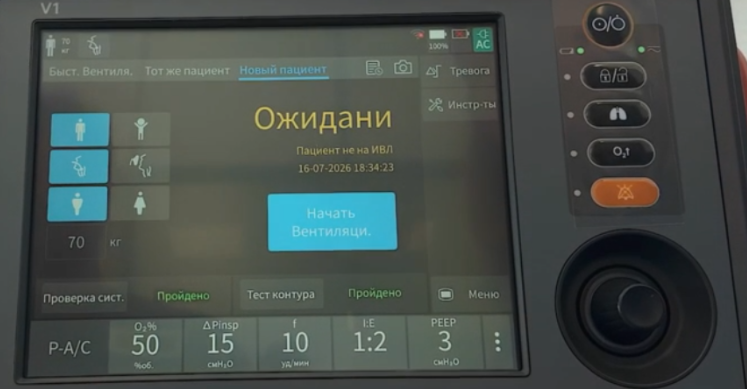
  <figcaption>Рис. 27. Ввод нового пациента на аппарате станции: категория пациента, тип вентиляции, пол, масса тела 70 кг. В нижней строке — режим P-A/C с уставками по умолчанию: O₂ 50 %, ΔPinsp 15 см вод. ст., f 10/мин, I:E 1:2, PEEP 3 см вод. ст.; над ней — результаты проверки системы и теста контура.</figcaption>
</figure>

## Тот же пациент

Доступны изменения пола, роста и идеальной массы тела. В отличие от режима нового пациента значения TV, TV апноэ, f, f апноэ и пределы тревоги при этом сохраняются прежними. Во время вентиляции меню [Новый пац.] недоступно (РЭ, стр. 118).

## Производные уставки, рассчитываемые от идеальной массы тела

| IBW, кг | f и f апноэ, 1/мин | Thigh (DuoVent), Tinsp и Tinsp апноэ, с |
|---|---|---|
| 3 ≤ IBW < 6 | 35 | 0,57 |
| 6 ≤ IBW < 9 | 25 | 0,80 |
| 9 ≤ IBW < 20 | 20 | 1,00 |
| 20 ≤ IBW < 30 | 15 | 1,30 |
| 30 ≤ IBW < 40 | 14 | 1,40 |
| 40 ≤ IBW < 60 | 12 | 1,70 |
| 60 ≤ IBW ≤ 139 | 10 | 2,00 |

| IBW, кг | Thigh (APRV), с | Tlow (APRV), с |
|---|---|---|
| 3 ≤ IBW ≤ 5 | 1,7 | 0,3 |
| 5 < IBW ≤ 8 | 2,1 | 0,3 |
| 8 < IBW ≤ 20 | 2,6 | 0,4 |
| 20 < IBW < 40 | 3,5 | 0,5 |
| 40 ≤ IBW < 60 | 4,4 | 0,6 |
| 60 ≤ IBW ≤ 139 | 5,4 | 0,6 |

| IBW, кг | Exp % | IBW, кг | Phigh, см вод. ст. |
|---|---|---|---|
| 3 ≤ IBW < 9 | 10 % | 3 ≤ IBW < 90 | 20 |
| 9 ≤ IBW < 15 | 15 % | 90 ≤ IBW < 100 | 23 |
| 15 ≤ IBW < 30 | 20 % | 100 ≤ IBW ≤ 139 | 25 |
| 30 ≤ IBW ≤ 139 | 25 % | — | — |

Дыхательный объём и объём при апноэ вычисляются как произведение идеальной массы тела на отношение TV/IBW (6–12 мл/кг, по умолчанию 7 мл/кг); верхний предел тревоги по TVe устанавливается как двукратный дыхательный объём, нижний — как половина дыхательного объёма (РЭ, стр. 95, 118–119). Правильная установка массы определяет корректность пределов тревоги по дыхательному и минутному объёму.

# Диапазоны и шаги уставок

| Параметр | Диапазон | Шаг |
|---|---|---|
| O₂% | 21–100 % | 1 % |
| TV и TV апноэ | Взрослые 100–4000 мл; дети 20–300 мл; новорождённые 2,0–300 мл | 0,1 мл в 2–10 мл; 0,5 мл в 10–50 мл; 1 мл в 50–100 мл; 10 мл в 100–4000 мл |
| f, f апноэ | Взрослые и дети 1–100/мин; новорождённые 1–150/мин | 1/мин |
| f SIMV | 1–60/мин | 1/мин |
| Tinsp, Tinsp апноэ | 0,10–12,00 с | 0,01 с в 0,10–1,00 с; 0,05 с в 1,00–3,00 с; 0,10 с в 3,00–12,00 с |
| I:E, I:E апноэ | 4:1–1:10 | 0,5 |
| Tslope | 0,00–2,00 с | 0,05 с |
| PEEP | Взрослые и дети 0–50 см вод. ст.; новорождённые 0–25 см вод. ст. | 1 см вод. ст. |
| ΔPinsp | Взрослые и дети 0–65 см вод. ст.; новорождённые 1–45 см вод. ст. | 1 см вод. ст. |
| ΔPsupp | 0–65 см вод. ст. | 1 см вод. ст. |
| ΔP апноэ | Взрослые и дети 1–65 см вод. ст.; новорождённые 1–45 см вод. ст. | 1 см вод. ст. |
| Phigh | 0–65 см вод. ст. | 1 см вод. ст. |
| Plow | 0–50 см вод. ст. | 1 см вод. ст. |
| Thigh | 0,10–40,0 с | По поддиапазонам, как для Tinsp |
| Tlow | 0,20–40,0 с | По поддиапазонам |
| F-Trig | Взрослые и дети 0,5–20,0 л/мин; новорождённые 0,1–5,0 л/мин | 0,1 л/мин |
| P-Trig | От −20,0 до −0,5 см вод. ст. | 0,5 см вод. ст. |
| Exp % | Авто, 1–85 % | 1 % в 1–5 %; 5 % в 5–85 % |
| Ti max | 0,10–10,00 с | 0,01 с в 0,10–1,00 с; 0,05 с в 1,00–10,0 с |
| Поток вдоха | Взрослые 5,0–180,0 л/мин; дети 5,0–40,0 л/мин | 0,1 л/мин в 5–10 л/мин; 1,0 л/мин в 10–180 л/мин |
| Tпауза | Выкл., 5–60 % | 5 % |
| Конечный поток при нисходящей форме | 0–75 % пикового, по умолчанию 25 % | — |
| MV% (AMV) | 25–350 % | 1 % |
| f компрессий (CPRV) | 90–130/мин | 1/мин |
| Поток при кислородотерапии | Взрослые и дети 2,0–100,0 л/мин; новорождённые 2,0–20,0 л/мин | 0,5 л/мин в 2–10 л/мин; 1,0 л/мин в 10–100 л/мин |

Источник: РЭ, стр. 250–254.

# Мониторируемые величины

Аппарат отображает давление в дыхательных путях и его составляющие (Ppeak, Pplat, Pmean, PEEP, PEEPi), объёмы вдоха и выдоха (TVi, TVe, TVe spn), минутные объёмы (MV, MVspn, минутный объём утечки и долю утечки), отношение TVe/IBW, общую, спонтанную и принудительную частоту и долю спонтанных вдохов, сопротивление вдоха и выдоха, статическую и динамическую податливость, пиковые потоки вдоха и выдоха, постоянную времени выдоха RCexp, индекс частого поверхностного дыхания RSBI, P0.1, произведение давления на время PTP, общую работу дыхания, индексы C20/C и стресс-индекс, концентрацию кислорода, а при наличии модулей — SpO₂, частоту пульса, индекс перфузии, EtCO₂ и производные капнометрические величины. Объёмы приводятся в условиях BTPS; RSBI отображается, только если не менее 80 % из последних 25 вдохов были спонтанными (РЭ, стр. 149–156).

Отношение выдыхаемого дыхательного объёма к идеальной массе тела и доля утечки относятся к величинам, по которым проверяется соответствие заданных уставок фактической вентиляции; оба отображаются во вкладке [Зн-я].

# Сигналы тревоги

## Приоритеты и индикация

| Приоритет | Световой индикатор | Звуковой сигнал | Фон параметра |
|---|---|---|---|
| Высокий | Красный, частое мигание | Серия из десяти сигналов | Красный мигающий |
| Средний | Жёлтый, редкое мигание | Серия из трёх сигналов | Жёлтый мигающий |
| Низкий | Жёлтый, горит постоянно | Одиночный сигнал | Жёлтый мигающий |

Источник: РЭ, стр. 106–107. При одновременных тревогах разных приоритетов световая и звуковая индикация соответствуют наивысшему приоритету, сообщения отображаются поочерёдно. Уровень звукового давления — 45–85 дБ(А), по умолчанию для сигнала высокого приоритета не менее 60 дБ(А); громкость по умолчанию и минимальная громкость — 6 из 10 (РЭ, стр. 107, 267). Громкость устанавливается выше уровня фонового шума, а при нескольких аппаратах в одной зоне для них выбираются разные тоны сигнала (РЭ, стр. 110–111).

Приостановка звука выполняется отдельной кнопкой на 120 с и отменяется по истечении отсчёта либо повторным нажатием кнопки; появление нового сигнала тревоги во время приостановки звук не восстанавливает. Остальная часть системы сигнализации в состоянии приостановки остаётся активной (РЭ, стр. 41–42, 111).

Отключение сигнала тревоги допускается для нижнего предела давления в дыхательных путях, верхнего и нижнего пределов TV и нижнего предела общей частоты. При отключении в области предела отображается соответствующий значок, а текстовое сообщение, световая и звуковая индикация по этому параметру не формируются; установка предела на крайнее значение также отключает сигнал (РЭ, стр. 112). Журнал системы сигнализации оператором не удаляется и не изменяется (РЭ, стр. 90).

## Пределы тревоги по умолчанию и автоматическая установка

| Параметр | По умолчанию | Автоматическая установка по измеренному значению |
|---|---|---|
| Высокий предел TVe | TV × 2 | 1,5 × TVe |
| Низкий предел TVe | TV / 2 | 0,5 × TVe |
| Высокий предел MV | TV × f × 1,5 | 1,5 × MV |
| Низкий предел MV | TV × f × 0,5 | 0,5 × MV |
| Верхний предел давления в дыхательных путях | 40 см вод. ст.; в CPRV 60 см вод. ст. | Среднее пиковое давление + 10 см вод. ст. либо 35 см вод. ст. — большее из двух |
| Нижний предел давления в дыхательных путях | Выключен | PEEP + 4 см вод. ст. |
| Верхний предел общей частоты | Взрослые и дети 40/мин; новорождённые 70/мин | 1,4 × измеренная частота, не более 160/мин |
| Нижний предел общей частоты | Выключен | 0,6 × измеренная частота |
| Пределы O₂% при подаче O₂ низкого давления | 100 % и 21 % | — |
| Пределы O₂% при кислородотерапии | 57 % и 43 % | — |
| Высокий и низкий пределы EtCO₂ | Взрослые и дети 50 мм рт. ст., новорождённые 45 мм рт. ст.; нижний: взрослые 15, дети 20, новорождённые 30 мм рт. ст. | — |
| Пределы SpO₂ | 100 % и 90 % | — |
| Пределы частоты пульса | Взрослые 50–120/мин, дети 75–160/мин, новорождённые 100–200/мин | — |
| Время апноэ | 15 с | — |

Источники: РЭ, стр. 109, 267–269. Среднее значение в формулах автоматической установки — среднее за последние восемь дыхательных циклов либо за одну минуту, в зависимости от того, какая величина меньше; если рассчитанный предел выходит за диапазон установки, используется граница диапазона. Автоматическая установка доступна только во время инвазивной вентиляции в режимах V-A/C, P-A/C и PRVC; пределы по CO₂ и SpO₂ автоматической установке не подлежат (РЭ, стр. 109–110). При подаче кислорода низкого давления пределы FiO₂ устанавливаются вручную, при подаче высокого давления сигнал формируется относительно заданной концентрации (РЭ, стр. 109). Задержка сигналов тревоги по концентрации кислорода превышает 30 с, задержка технического сигнала [Трубка отс.?] — 8 с (РЭ, стр. 105, 108).

## Основные сигналы тревоги и действия

Физиологические сигналы (РЭ, стр. 270–272); Н — высокий приоритет, М — средний, L — низкий.

| Сигнал | Приоритет | Условие формирования | Действия по руководству |
|---|---|---|---|
| Слишком высокое давление в дыхательных путях | Н | Давление превысило верхний предел | Проверка пациента; проверка уставок вентиляции; проверка пределов тревоги; проверка контура на окклюзию |
| Слишком низкое давление в дыхательных путях | Н | Давление ниже нижнего предела в течение двух циклов | Проверка пациента; проверка уставок; проверка пределов; проверка контура на утечку и отсоединение |
| Слишком высокий FiO₂ | Н | Превышение предела не менее 30 с | Проверка уставок; проверка пределов; проверка фильтра HEPA на окклюзию; калибровка датчика O₂ |
| Слишком низкий FiO₂ | Н | Ниже предела не менее 30 с либо ниже 18 % немедленно | Проверка уставок; проверка пределов; проверка подачи O₂; калибровка датчика O₂ |
| Слишком высокий TVe | М | Превышение верхнего предела в трёх последовательных циклах | Проверка уставок; проверка пределов |
| Слишком низкий TVe | М | Ниже нижнего предела в трёх последовательных циклах | Проверка пациента; проверка уставок; проверка пределов; проверка контура на утечку и закупорку; проверка системы на утечку |
| Слишком высокий MV | Н | Превышение верхнего предела | Проверка уставок; проверка пределов |
| Слишком низкий MV | Н | Ниже нижнего предела | Проверка уставок; проверка пределов; проверка контура на утечку и закупорку; проверка системы на утечку |
| Апноэ | Н | Отсутствие дыхания дольше заданного времени апноэ | Проверка пациента; ручная вентиляция; проверка времени апноэ; проверка контура на отсоединение |
| Вентиляция при апноэ | Н | То же, с запуском резервного режима | Проверка уставок вентиляции при апноэ |
| Вентиляция при апноэ завершена | L | Резервный режим прекращён | Проверка уставок вентиляции при апноэ |
| Слишком высокая общая частота | М | Превышение предела в трёх последовательных циклах | Проверка пациента; проверка уставок; проверка пределов |
| Слишком низкая общая частота | М | Ниже предела в трёх последовательных циклах | Проверка пациента; проверка уставок; проверка пределов |
| Слишком высокое PEEP | М | Измеренное PEEP выше заданного более чем на 5 см вод. ст. в течение двух циклов | Проверка пациента; проверка уставок; проверка клапана выдоха на окклюзию |
| Слишком низкое PEEP | М | Измеренное PEEP ниже заданного более чем на 3 см вод. ст. в течение двух циклов | Проверка уставок; проверка контура на утечку |
| Обратное отношение вдоха к выдоху | L | Заданное I:E больше 1:1 | Проверка пациента; проверка уставок |

Технические сигналы содержат, помимо перечисленных, сообщения о состоянии аккумуляторов и внешнего питания, отказе подачи кислорода, неисправностях датчиков потока, давления, O₂ и CO₂, засорении фильтров, неисправности клапана выдоха и предохранительного клапана, а также нумерованные ошибки связи, питания и клавиатуры. По каждому сигналу руководство приводит меры противодействия (РЭ, стр. 273–287). Сохранение сигнала после выполнения мер служит основанием для обращения к обслуживающему персоналу.

Руководство описывает проверку каждого сигнала на тестовом лёгком. Для сигнала высокого давления верхний предел устанавливается на текущее Ppeak + 5 см вод. ст., на вдохе тестовое лёгкое сдавливается; сигнал считается работающим, если он сформирован, а цикл переведён в выдох со снижением давления до PEEP (РЭ, стр. 112–115).

# Автоматические защитные состояния

## Безопасная вентиляция

Состояние активируется при технической неисправности, препятствующей штатной работе, и предоставляет время для корректирующих мер, включая замену аппарата. Функция датчика на стороне пациента отключается; турбина продолжает создавать давление, а клапан выдоха переключает уровень давления между PEEP и давлением вдоха (РЭ, стр. 157).

Если до входа в это состояние был установлен режим PRVC или PRVC-SIMV, уставки безопасной вентиляции устанавливаются автоматически по таблице. Если был установлен режим с регулируемым давлением — P-A/C, DuoVent, APRV, CPAP/PSV, P-SIMV, PSV-S/T, — безопасная вентиляция продолжается с параметрами этого режима.

| IBW, кг | ΔPinsp, см вод. ст. | f, 1/мин | I:E |
|---|---|---|---|
| < 3 | 15 | 35 | 1:3 |
| 3–5 | 15 | 30 | 1:4 |
| 6–8 | 15 | 25 | 1:4 |
| 9–20 | 15 | 20 | 1:4 |
| 21–29 | 15 | 15 | 1:4 |
| 30–39 | 15 | 14 | 1:4 |
| 40–59 | 15 | 12 | 1:4 |
| 60–99 | 15 | 10 | 1:4 |
| > 99 | 15 | 10 | 1:4 |

PEEP и концентрация кислорода в этом состоянии остаются предустановленными значениями предыдущего режима; концентрация кислорода не ниже 21 %. При устранении неисправности аппарат способен автоматически возобновить нормальную вентиляцию (РЭ, стр. 157–158).

## Состояние окружающей среды: прекращение вентиляции с открытыми клапанами

«Состояние окружающей среды» — термин руководства, обозначающий состояние самого аппарата, а не условия вокруг него: аппарат прекращает вентиляцию и соединяет дыхательный контур с атмосферным воздухом. Открываются предохранительный клапан и клапан выдоха, и пациент получает возможность дышать самостоятельно через запасное отверстие для впуска воздуха, что предотвращает апноэ при сохранённом собственном дыхании.

Аппарат переходит в это состояние, когда техническая неисправность угрожает даже безопасной вентиляции. **Выход из этого состояния достигается только выключением и повторным запуском аппарата** после устранения неисправности (РЭ, стр. 157). Для пациента без собственного дыхания это означает переход на ручную вентиляцию мешком на время перезапуска.

<figure>
  
  <figcaption>Рис. 28. Экран в состоянии окружающей среды. В строке тревоги — номер технической ошибки, в поле экрана — сообщение о невыполненном самотесте при включении питания и требование перезапуска. Вентиляция в этом состоянии не проводится: оба клапана открыты, пациент дышит самостоятельно через запасное отверстие для впуска воздуха.</figcaption>
</figure>

## Порядок действий при сигнале тревоги

Руководство задаёт последовательность: проверка состояния пациента; подтверждение типа и параметра сигнала; определение причины; устранение причины; проверка того, что сигнал снят (РЭ, стр. 115). Предел тревоги корректируется только в том случае, если его настройка не соответствует состоянию пациента (РЭ, стр. 116). При любой неисправности аппарата вентиляция немедленно переводится на ручную (РЭ, стр. 148).

# Специальные функции

| Функция | Содержание | Значения и ограничения |
|---|---|---|
| Ручной вдох | Принудительный вдох по нажатию и отпусканию клавиши в фазе выдоха; в фазе вдоха не запускается | Недоступен в CPAP и в режиме ожидания (РЭ, стр. 180) |
| Задержка вдоха | Удержание клавиши продлевает вдох; рассчитываются статическая податливость и давление плато | Не более 30 с у взрослых и детей, 5 с у новорождённых; недоступна в режиме ожидания, при кислородотерапии и в CPAP (РЭ, стр. 180) |
| Задержка выдоха | [Ин-ты] → [Баз.] → [Зад.выд.]; рассчитывается и отображается PEEPtot | Не более 30 с у взрослых и детей, 5 с у новорождённых; недоступна в режиме ожидания, при кислородотерапии, в NCPAP, CPRV и CPAP (РЭ, стр. 180–181) |
| Обогащение кислородом (O₂↑) | Вентиляция с концентрацией «заданная + приращение», но не выше 100 %, на заданное время; в области уставок отображается O₂ 100 % | Приращение по умолчанию: взрослые и дети 60 объёмных %, новорождённые 40 %; длительность 30, 60, 90 или 120 с (по умолчанию 120 с); недоступно в режиме ожидания, при кислородотерапии, при измерении P-V и при подаче O₂ низкого давления (РЭ, стр. 96, 182, 266) |
| Отсасывание мокроты | Той же клавишей запускается обогащение кислородом, затем контур отсоединяется; аппарат сам обнаруживает отсоединение, прекращает вентиляцию и блокирует тревоги, а после обратного подключения снова вентилирует с повышенной концентрацией кислорода. Аспирацию аппарат не выполняет: отсос готовится заранее | Длительность 30, 60, 90 или 120 с (РЭ, стр. 182–183) |
| Распыление | Пневматический распылитель, время 1–60 мин | Только исполнение V1; недоступно у новорождённых, у детей в режимах с управляемым объёмом, при кислородотерапии и при подаче O₂ низкого давления (РЭ, стр. 181–182) |
| Компенсация сопротивления трубки (TRC) | Регулировка давления подачи так, чтобы давление на дистальном конце трубки соответствовало заданному; отображается кривая давления в трахее Ptrach | Только инвазивная вентиляция; трубка эндотрахеальная либо трахеостомическая, внутренний диаметр у взрослых 5,0–12,0 мм, у детей 2,5–8,0 мм, компенсация 1–100 %, отдельный переключатель для фазы выдоха; функция способна вызвать автоматическое срабатывание триггера (РЭ, стр. 198–199, 254–255) |
| Проба самостоятельного дыхания (SBT) | Вентиляция с поддержкой давлением с контролем показателей отлучения; при выходе показателя за пределы дольше времени выносливости аппарат возвращается к прежнему режиму | Длительность 20–240 мин, выносливость 100–300 с; недоступна в режиме ожидания, при кислородотерапии, неинвазивной вентиляции и апноэ (РЭ, стр. 186–188) |
| Инструмент P-V | Построение статической петли «давление — объём» для выбора PEEP | Только взрослые; недоступен в CPAP/PSV, VS, CPRV, PPS, при неинвазивной вентиляции и спонтанном дыхании (РЭ, стр. 188–189) |
| Продолжительная инсуффляция (SI) | Однократный манёвр рекрутирования постоянным давлением | Давление 20–60 см вод. ст., длительность 10–40 с; по умолчанию у взрослых 35 см вод. ст. и 30 с; недоступна у новорождённых и при кислородотерапии (РЭ, стр. 189–190, 255, 269) |
| Кислородотерапия | Высокопоточная подача нагретой увлажнённой смеси через назальную канюлю или кислородную маску; таймер с напоминанием | Поток 2–100 л/мин у взрослых; только при подаче O₂ высокого давления и регулярном спонтанном дыхании; маски для неинвазивной вентиляции не применяются; физиологические тревоги, кроме тревоги по концентрации O₂, не формируются (РЭ, стр. 194–196) |
| Расчёт альвеолярной вентиляции, энергетического метаболизма | Расчёт мёртвого пространства и альвеолярной вентиляции по PaCO₂ и PaO₂; расход энергии по массе тела либо по формуле Харриса — Бенедикта | Альвеолярная вентиляция — при модуле CO₂ основного потока (РЭ, стр. 196–198) |
| Компенсация высоты | Отслеживание атмосферного давления внутренним датчиком | Автоматически (РЭ, стр. 201) |
| Подключение монитора | Передача параметров, уставок и тревог на монитор через модуль K-Link; протокол HL7 для передачи на сервер | Первичная настройка — персоналом изготовителя (РЭ, стр. 103, 199–200) |

PEEPi руководство относит к показателям динамической гиперинфляции и называет условия её возникновения: избыточный дыхательный объём, короткое время выдоха либо высокая частота, повышенное сопротивление трубки или обструкция на выдохе (РЭ, стр. 183).

# Хранение данных

Табличные и графические тренды хранятся за 72 ч непрерывной работы; интервал по умолчанию — 1 мин, значения, вызвавшие сигнал тревоги, отмечаются цветом приоритета, а данные в режиме ожидания не записываются (РЭ, стр. 86–88). Журнал событий содержит до 6000 записей, из них не менее 1000 сигналов тревоги; при переполнении перезаписываются наиболее ранние. При аварийном отключении питания сохраняются записи за 3 с до отключения; время внезапного отключения в журнал не вносится (РЭ, стр. 90). Без USB-накопителя сохраняется не менее 50 снимков экрана и до 10 видеозаписей экрана по 30 с в формате GIF; экспорт данных пациента, трендов и пределов тревоги на USB-накопитель выполняется в формате html, пользовательские настройки экспортируются и импортируются отдельно (РЭ, стр. 92–93, 101–102, 247).

<figure>
  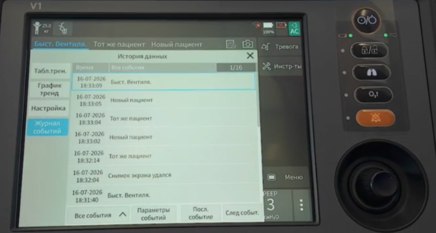
  <figcaption>Рис. 29. Журнал событий на аппарате станции: дата и время, тип события (быстрая вентиляция, новый пациент, тот же пациент, снимок экрана); слева — вкладки табличного и графического трендов и настроек.</figcaption>
</figure>

# Ограничения и запрещённые действия

- Гипербарическая оксигенация и применение в условиях магнитно-резонансной томографии исключены (РЭ, стр. 39, 45).
- Одновременное подключение источников кислорода высокого и низкого давления не допускается (РЭ, стр. 50).
- Кислород концентратора с концентрацией 93 % во вход высокого давления не подаётся (РЭ, стр. 18).
- При подаче кислорода низкого давления установка концентрации кислорода на аппарате недопустима, контроль концентрации не активируется, расход не превышает 15 л/мин (РЭ, стр. 50).
- Оборудование, загрязнённое маслом, с аппаратом не используется; при кислородотерапии применяются только лосьоны и мази на водной основе, совместимые с кислородом (РЭ, стр. 21, 23).
- Неинвазивная вентиляция не применяется при отсутствии или нерегулярности спонтанного дыхания, а также у интубированных пациентов (РЭ, стр. 120).
- Вентиляция без бактериального фильтра между аппаратом и патрубком вдоха не проводится (РЭ, стр. 52).
- Фильтр выдоха и тепловлагообменник исключаются из контура на время распыления лекарственных препаратов (РЭ, стр. 63).
- Увлажнитель не включается до завершения калибровки и проверки аппарата (РЭ, стр. 61).
- Отверстия на задней и боковых поверхностях не перекрываются (РЭ, стр. 45).
- Аппарат, не прошедший любой из тестов, к клиническому применению не допускается (РЭ, стр. 73).
- Проверка системы и тест контура выполняются при отсоединённом пациенте и при наличии альтернативного способа вентиляции (РЭ, стр. 75, 77).
- Установка предела тревоги на крайнее значение выводит систему сигнализации из строя (РЭ, стр. 108).
- Запуск двигателя автомобиля во время работы аппарата от автомобильной розетки постоянного тока исключается (РЭ, стр. 49).
- Перемещение аппарата с установленным опорным рычагом держателя контуров не производится (РЭ, стр. 66).
- Одноразовые принадлежности повторно не используются и не обрабатываются (РЭ, стр. 208).

# Эксплуатация на станции

Раздел составлен по практическому занятию на аппарате станции и по инструкции поставщика для инструктажа медицинского персонала; снимки экрана на рис. 1, 14, 17 и 25–27, 29 получены в ходе занятия.

## Мониторинг и разъёмы

На аппаратах станции разъёмы SpO₂ и CO₂ отсутствуют (рис. 17); сатурация и выдыхаемый CO₂ контролируются монитором-дефибриллятором. Рабочие части аппарата защищены от разряда дефибриллятора, и после разряда аппарат продолжает работать по назначению (РЭ, стр. 22, 26). Передача данных через сетевой порт в информационные системы станции на момент составления материала не осуществляется. Разъём контура совместим со стандартным разъёмом кислородной маски; при кислородотерапии руководство допускает только кислородную маску или назальную канюлю и запрещает маски для неинвазивной вентиляции (РЭ, стр. 195).

## Правила эксплуатации

| Правило | Содержание |
|---|---|
| Гарантийное обслуживание | Аппарат находится на гарантии; о неисправности сообщается в установленном порядке. Руководство по эксплуатации хранится в сумке аппарата; перечень сигналов тревоги с мерами по каждому — приложение IV руководства |
| Пожарная безопасность | Масла, кремы и мази на масляной основе не применяются ни на аппарате, ни на коже пациента при кислородотерапии. Курение вблизи аппарата исключено |
| Температура | На занятии рекомендовано применение при температуре не ниже 18 °C. Нормальный диапазон по руководству — 0–40 °C, допустимый — от −20 до +50 °C; ниже 5 °C мониторинг O₂ отключается |
| Вентиляционные отверстия | Отверстия задней и боковых панелей не закрываются |
| Громкость тревоги | Не снижается до минимального значения; при транспортировке устанавливается выше уровня фонового шума |
| Дыхательные контуры | Многоразовые контуры после применения передаются на стерилизацию. Если фильтр не был установлен, контур снимается, устанавливается новый, загрязнённый передаётся на стерилизацию |
| Водосборники | Опорожняются после каждого применения при наличии любого количества конденсата; руководство предусматривает проверку водосборников и трубок несколько раз в день (РЭ, стр. 224) |
| Фильтр на клапане выдоха | При длительной вентиляции и при инфекциях с аэрогенным механизмом передачи, в том числе туберкулёзе, дополнительно устанавливается бактериальный фильтр между трубкой выдоха и клапаном выдоха; руководство рекомендует его и для предотвращения накопления воды в клапане (РЭ, стр. 230) |
| Проверка перед применением | Проверка системы с контролем сопротивления и утечки — перед каждым применением или после двух недель непрерывного использования (РЭ, стр. 224) |

# Сводный порядок действий от включения до вентиляции

Последовательность составлена по главам 3, 4 и 8 руководства и предназначена для использования у аппарата.

**1. Сборка.** Установка мембраны, сердечника и ручки в съёмный узел клапана выдоха; фиксация узла поворотом по часовой стрелке. Присоединение контура по выбранной конфигурации. Установка бактериального фильтра на линию вдоха, датчика потока — по направлению потока.

**2. Питание и газ.** Подключение к сети переменного или постоянного тока, проверка индикатора внешнего питания и состояния аккумуляторов. Подключение кислорода: высокого давления при 280–600 кПа либо низкого давления с расходом не более 15 л/мин; установка соответствующего типа подачи в меню. Одновременное подключение обоих источников исключено. Проверка наличия датчика O₂.

**3. Включение.** Нажатие кнопки питания. Во время самопроверки поочерёдно мигают красная и жёлтая лампы и подаётся звуковой сигнал. По завершении аппарат переходит в режим ожидания с интерфейсом быстрой вентиляции.

**4. Проверка системы.** В режиме ожидания — [Пров.системы], перекрытие Y-образного тройника по подсказке, [Прод-ть]. Итог «выдерживает» разрешает работу; «частично пройдено» допускает механическую вентиляцию; «механическая вентиляция отключена» и «большая утечка» её запрещают.

**5. Тест контура.** Выполняется при замене элементов контура и в случаях, когда проверка системы не пройдена полностью: утечка, податливость, сопротивление.

**6. Датчик O₂** — тест и калибровка при соответствующем результате или сигнале тревоги.

**7. Ввод пациента.** Неотложная ситуация — быстрая вентиляция с выбором преднастройки по массе: для взрослого V-A/C, TV 490 мл, f 10/мин, PEEP 3 см вод. ст., I:E 1:2, O₂ 50 %. Плановое начало — [Новый пац.]: тип вентиляции, категория пациента, пол, рост или идеальная масса тела, режим вентиляции. При остановке кровообращения у взрослого — режим CPRV.

**8. Уставки.** Установка параметров выбранного режима: концентрация кислорода, давление или дыхательный объём, частота, PEEP, отношение вдоха к выдоху либо время вдоха, триггер, время нарастания, форма потока. Проверка производных величин, рассчитанных аппаратом от идеальной массы тела.

**9. Пределы тревоги.** Проверка верхнего предела давления (по умолчанию 40 см вод. ст., в CPRV 60 см вод. ст.; рекомендованный руководством максимум 60 см вод. ст.), пределов TVe и MV, времени апноэ (по умолчанию 15 с), параметров вентиляции при апноэ. При необходимости — автоматическая установка пределов по измеренным значениям с последующей проверкой их пригодности.

**10. Начало вентиляции** клавишей [Н-ть вент]; присоединение пациента.

**11. Контроль после начала.** Давление (пиковое, плато, PEEP), выдыхаемый дыхательный объём и его отношение к идеальной массе тела, минутный объём, общая и спонтанная частота, доля утечки, концентрация кислорода; SpO₂ и EtCO₂ — по монитору-дефибриллятору. Сопоставление измеренных величин с заданными уставками и с пределами тревоги.

# Сопоставление с Oxylog 3000 plus

Данные по V1 приведены по страницам руководства, указанным в соответствующих разделах настоящего материала; данные по Oxylog 3000 plus — по руководству по эксплуатации и технической спецификации изделия (Dräger).

| Признак | Comen V1 | Oxylog 3000 plus |
|---|---|---|
| Способы задания вдоха | Объём (V-A/C, V-SIMV, CPRV), давление (P-A/C, P-SIMV, PSV-S/T), адаптивное управление давлением по объёму (PRVC, PRVC-SIMV, VS, AMV), пропорциональная поддержка (PPS) | Объём (VC-CMV, VC-AC, VC-SIMV), давление (PC-BIPAP, Spn-CPAP) |
| Вентиляция с управляемым объёмом | V-A/C и V-SIMV с прямоугольной либо нисходящей формой потока и паузой вдоха 5–60 % | VC-CMV и VC-AC с постоянным потоком |
| Объём как цель при управлении давлением | PRVC, PRVC-SIMV, VS — в базовом перечне режимов | AutoFlow, опция для VC-CMV, VC-AC и VC-SIMV |
| Дыхательный объём | Взрослые 100–4000 мл; дети 20–300 мл; новорождённые 2–300 мл | 50–2000 мл |
| Частота дыхания | 1–100/мин; у новорождённых до 150/мин | 5–60/мин в VC-CMV и VC-AC; 2–60/мин в VC-SIMV и PC-BIPAP; 12–60/мин при вентиляции по апноэ |
| PEEP | 0–50 см вод. ст. | 0–20 мбар |
| Инспираторное давление | ΔPinsp 0–65 см вод. ст. над PEEP | Pinsp от PEEP + 3 до PEEP + 55 мбар |
| Поддержка давлением | ΔPsupp 0–65 см вод. ст. | ΔPsupp 0–35 мбар |
| Время нарастания давления | Tslope 0–2,00 с с шагом 0,05 с | Slope тремя ступенями: медленно, стандартно, быстро |
| Триггер по потоку | 0,5–20,0 л/мин | 1–15 л/мин |
| Вентиляция при апноэ | В режимах V-SIMV, P-SIMV, CPAP/PSV, DuoVent, APRV, PRVC-SIMV, VS, PPS | Только в режиме Spn-CPAP |
| Манёвры оценки механики | Задержка вдоха до 30 с с расчётом Cstat и Pplat; задержка выдоха до 30 с с расчётом PEEPtot; инструмент P-V | Удержание вдоха, ручной вдох |
| Обязательные проверки перед работой | Проверка системы (девять элементов), тест датчика O₂ и тест контура из интерфейса ожидания | Проверка устройства и калибровка датчика потока |
| Поведение при технической неисправности | Безопасная вентиляция с уставками по идеальной массе тела; при более тяжёлом отказе — состояние окружающей среды с открытыми клапанами, выход только перезапуском | Тревога и переход на резервные режимы в пределах конфигурации аппарата |

## Вентиляция с управляемым объёмом

В режимах V-A/C, V-SIMV и CPRV задаются дыхательный объём, время вдоха и форма потока, а давление является производной величиной. Пауза вдоха позволяет измерить давление плато в каждом цикле: разность пикового давления и давления плато отражает сопротивление дыхательных путей, а отношение объёма к разности давления плато и PEEP — статическую податливость. Поскольку объём поддерживается независимо от механики лёгких, нарастание обструкции, смещение трубки или снижение податливости проявляются ростом пикового давления, а единственным ограничителем является верхний предел тревоги по давлению, при достижении которого вдох прерывается. Поэтому при переходе к вентиляции по объёму значение этого предела проверяется до начала вентиляции.

## Объёмные ограничения в режимах с регулируемым давлением

В режимах, управляемых давлением, аппарат содержит три механизма, связанных с объёмом; ни один из них управлением не является. Первый — ограничение инспираторного давления на уровне «верхний предел тревоги по давлению минус 5 см вод. ст.». Второй — немедленное переключение в фазу выдоха в режиме P-A/C, если поданный объём превысил верхний предел тревоги по дыхательному объёму (РЭ, стр. 124–125); это объёмный предохранитель, прекращающий вдох, а не средство достижения заданного объёма. Третий — компенсация утечки, ограниченная верхним пределом тревоги по дыхательному объёму и максимальной производительностью подачи газа (РЭ, стр. 147).

## Зависимость достижимого объёма в PRVC и VS от предела тревоги по давлению

В PRVC и VS прирост давления не превышает 10 см вод. ст. в первых трёх циклах и 3 см вод. ст. в последующих, а максимальное давление равно верхнему пределу тревоги по давлению минус 5 см вод. ст. (РЭ, стр. 131, 137).

Отсюда два следствия. Заданный объём гарантируется как средняя величина, а не в каждом отдельном цикле: при внезапном снижении податливости — смещении трубки, нарастании отёка, повышении внутрибрюшного давления — объём остаётся ниже заданного в течение нескольких циклов, пока аппарат повышает давление разрешёнными шагами. И достижимость заданного объёма определяется значением верхнего предела тревоги по давлению: при значении по умолчанию 40 см вод. ст. давление не превысит 35 см вод. ст. независимо от того, какой объём задан. Уставка, относящаяся по назначению к системе сигнализации, тем самым ограничивает вентиляцию.

## Форма инспираторного потока и оценка механики дыхания

В режимах с убывающим потоком пиковое и плато давление сближаются, и разность между ними как показатель сопротивления дыхательных путей теряет чувствительность; при прямоугольной форме потока в V-A/C эта разность сохраняет диагностическое значение. Для раздельной оценки сопротивления и податливости в любом режиме предусмотрены задержка вдоха до 30 с с расчётом статической податливости и давления плато и задержка выдоха до 30 с с расчётом PEEPtot (РЭ, стр. 180–181).

## Предельные характеристики

Аппарат ограничивает давление 80 см вод. ст. и минутный объём 60 л/мин; пиковый инспираторный поток превышает 260 л/мин (РЭ, стр. 121, 248). Установка ΔPinsp или верхнего предела тревоги по давлению выше 60 см вод. ст. требует подтверждения поворотной ручкой.

# Источники

- Руководство по эксплуатации медицинского изделия «Аппарат искусственной вентиляции лёгких для экстренной помощи и транспортировки серии V, в вариантах исполнения: V1, V1D». Shenzhen Comen Medical Instruments Co., Ltd., Китай; № 046-00000566-01, версия B00, дата пересмотра 08/2024; 304 страницы. Регистрационное удостоверение РЗН 2025/25059 от 21.03.2025.
- Инструкция поставщика для инструктажа медицинского персонала по аппарату ИВЛ Comen V1: ознакомительная часть, техника безопасности, органы управления, подключение принадлежностей, подготовка к работе, практическая часть.
- Soar J., Böttiger B.W., Carli P. et al. European Resuscitation Council Guidelines 2021: Adult advanced life support. *Resuscitation*, 2021; 161: 115–151 — вентиляция при обеспеченной проходимости дыхательных путей: 10 вдохов в минуту на фоне непрерывных компрессий.
- Руководство по эксплуатации и техническая спецификация Oxylog 3000 plus (Dräger) — для раздела о сопоставлении.

# Источники иллюстраций

Рисунки 2, 4, 11 и 13 воспроизведены из руководства по эксплуатации редакции 08/2024: рис. 2 — стр. 123, рис. 4 — стр. 126, рис. 11 — стр. 137, рис. 13 — стр. 142. Рисунки 3, 5–10, 12, 15, 16, 18–24 и 28 воспроизведены из предыдущей редакции руководства (V1, редакция 2022.05) ввиду более высокого качества исходных изображений; в редакции 08/2024 те же изображения приведены в соответствующих разделах. Правообладатель изображений — изготовитель изделия. Рисунки 1, 14, 17, 25–27 и 29 — кадры видеозаписи и фотографии практического занятия на аппарате станции; кадры обрезаны по границе экрана или аппарата, элементы интерфейса проигрывателя удалены. Подписи под рисунками составлены для настоящего материала.

# Источник и порядок сверки

Разделы руководства, использованные при составлении: 1 (безопасность), 2 (краткие сведения об изделии), 3 (установка и подключение), 4 (тест и калибровка), 5 (интерфейс), 6 (основные операции), 7 (сигналы тревоги), 8 (начало вентиляции), 12 (особые функции), 13 (аккумулятор), 15 (техническое обслуживание), приложения II (спецификация изделия), III (настройки по умолчанию) и IV (сигналы тревоги системы). Версии материала 1.0–1.4 составлялись по предыдущей редакции руководства (V1, № 046-00000566-00, редакция 2022.05), в которой описаны восемь режимов вентиляции.

При расхождении настоящего материала с руководством по эксплуатации преимущество имеет руководство; при расхождении руководства с действующими алгоритмами и распоряжениями службы преимущество имеют последние.
