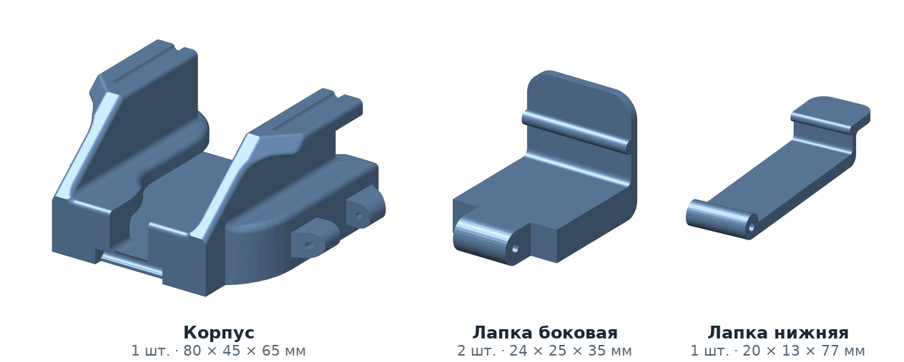

# Скоба для фонендоскопа

Держатель фонендоскопа для печати на 3D-принтере. Конструкция состоит из корпуса и трёх подвижных лапок на осях, за счёт которых скоба подходит к любой модели фонендоскопа. Архив содержит модели для печати в формате STL и исходные файлы SolidWorks, пригодные для изменения геометрии.

**Автор модели** — ведущий инженер АО «ИТТ» Геннадий Хохлов. Модель передана автором для свободного распространения.

**Файл:** [skoba_fonendoskopa.zip](skoba_fonendoskopa.zip) — 1,05 МБ.

## Состав архива

| Файл | Что внутри |
|---|---|
| `Модели для печати.zip` | `Корпус.STL`, `Лапка боковая.STL`, `Лапка нижняя.STL` — готовые к нарезке модели |
| `Исходные модели.zip` | `Корпус.SLDPRT`, `Лапка боковая.SLDPRT`, `Лапка нижняя.SLDPRT`, `Сборка скобы.SLDASM` |
| `Прочитай меня.txt` | Примечания автора о печати, осях и доработке отверстий |

Исходные файлы выполнены в SolidWorks 2014 и открываются любой более новой версией программы. В более ранних версиях они не открываются.

## Детали и габариты

| Деталь | Количество | Габариты, мм |
|---|---|---|
| Корпус | 1 | 80 × 45 × 65 |
| Лапка боковая | 2 | 24 × 25 × 35 |
| Лапка нижняя | 1 | 20 × 13 × 77 |

Габариты измерены по моделям STL; изображения — программный рендер этих же моделей, а не фотография напечатанной скобы.

## Крепёж

Оси лапок — стандартные штифты DIN:

| Штифт | Количество | Назначение |
|---|---|---|
| 2 × 30 мм | 2 | боковые лапки |
| 3 × 40 мм | 1 | нижняя лапка |

Альтернативный вариант, использованный автором в исходной детали: вместо металлических штифтов в отверстия устанавливается филамент и закрепляется сплавлением с корпусом. Такой вариант быстрее и не требует доработки отверстий, но менее надёжен при длительной эксплуатации.

## Сборка

После печати отверстия под оси обычно требуют доработки: 3D-принтер воспроизводит круглое отверстие с отклонением от круглости, и штифт в него либо не входит, либо садится с перекосом. Отверстия проходятся сверлом, диаметр сверла должен совпадать с диаметром штифта — при большем диаметре штифты выпадают в работе. При затруднённой посадке штифта отверстия смазываются маслом, включая растительное.

## Лицензия

Авторские права на конструкцию принадлежат автору модели. Материалы страницы распространяются на условиях, указанных в разделе [«Лицензии»](../../README.md#litsenzii) основного файла проекта. Скоба не является медицинским изделием: применение под ответственность пользователя, на работу оборудования влиять не должно.
