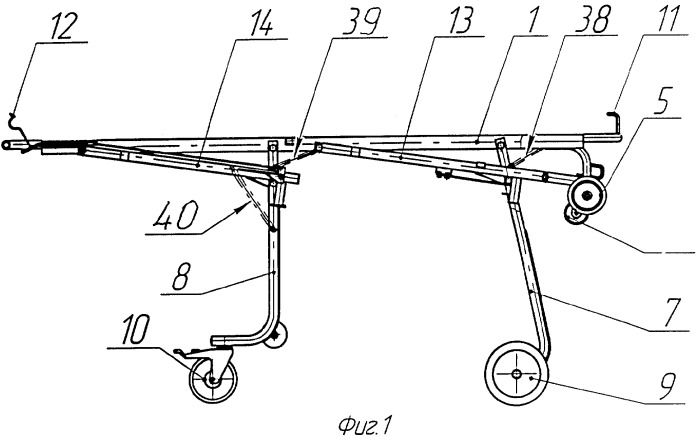
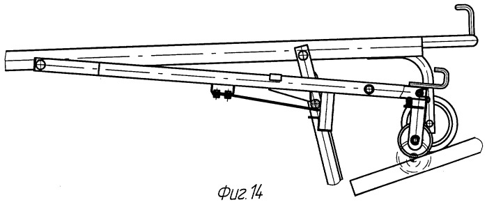

  
Оборудование и оснащение

  
Тележка-каталка ТНС-01ММ

  
Автоматическая расфиксация шасси: как она устроена, при каких условиях не срабатывает и что проверяется перед тем, как поставить каталку на землю. Правила изготовителя и информационное письмо Росздравнадзора

  

  
С разбором случая складывания шасси под пациентом при въезде в приёмное отделение. Причина — ремни безопасности, пропущенные так, что они связали переднее и заднее шасси и заблокировали кинематику автоматической расфиксации.

  
Серия «Крещение поворотом» · версия 1.0 · CC BY-NC-SA 4.0

# Случай

## Слово бригаде

«Да уж, это был действительно epic fail: ножки нашей многострадальной каталки сложились прямо во время въезда на скорости в шоковый зал. Представьте себе: монитор пикает, пациентка задыхается, кислород шипит, три человека, включая водителя, толкают носилки и... баа-бааах! Сначала складывается передняя ножка, потом задняя. Фельдшера хватаются за раму и путем травмирования собственных запястий смягчают падение, но не сильно. Эпично, да, действительно. А причина, по которой передняя стойка не вышла, как потом выяснилось, была еще эпичнее — кто-то (не будем показывать пальцем, хорошо?) так умудрился просунуть ремни безопасности, что прификсировал ими обе стойки. Как? Ну, очумелые ручки...»

# Идентификация изделия

Описанная конструкция — тележка-каталка **ТНС-01ММ**, входящая в состав медицинского изделия «Комплект средств перемещения и перевозки пациентов КСППП-ММ» по ТУ 9451-009-10660186-2006, регистрационное удостоверение № ФСР 2010/09084 от 01.11.2010, изготовитель — ООО «НПП «Микромонтаж», Нижний Новгород.

Состав комплекта: тележка-каталка ТНС-01ММ, носилки мягкие НМ-ММ, носилки кресельные НК-ММ, носилки ковшовые НКРЖ-ММ, носилки плащевые НП-ММ, носилки продольно складные НПС-ММ, носилки продольно и поперечно складные НППС-ММ, устройство приёмное УП-ММ.

Существенное для дальнейшего обстоятельство: по описанию изготовителя автоматическая расфиксация шасси при загрузке и выгрузке **обеспечивается только совместно с приёмным устройством УП-ММ из состава того же комплекта**. Там же указано наличие системы страховки от падения при выгрузке, также работающей только в паре с УП-ММ. Автоматика является свойством не тележки самой по себе, а пары «тележка — приёмное устройство».

Ремни безопасности конструктивно относятся к носилкам, а не к тележке: у носилок НМ-ММ модели 0602 это три регулируемых двухточечных ремня с замком. Грузоподъёмность комплекта — 165 кг.

Терминология, используемая ниже, задана ГОСТ Р 56330-2016: **тележка-каталка** — изделие для транспортировки пациента с устройством фиксации съёмных носилок на шасси колёсных опор и механизмом управления складыванием; **шасси** — складные или нескладные опоры тележки-каталки с колёсами; **устройство приёмное** — изделие для приёма, размещения, фиксации и перемещения носилок и тележек-каталок в салоне транспортного средства.

# Устройство тележки-каталки

Конструкция состоит из несущей рамы с продольной направляющей балкой, на которой подвижно закреплены переднее и заднее складные шасси с колёсными опорами.

<figure>
  
  <figcaption>Тележка-каталка в рабочем положении. Обозначения: 1 — несущая рама; 5 — первая пара опорных колёс несущей рамы (головная часть); 7 — переднее шасси; 8 — заднее шасси; 9 — вторая пара опорных колёс (переднего шасси); 10 — третья пара опорных колёс (заднего шасси); 11 и 12 — задняя и передняя ручки устройства ручной расфиксации; 13 — переднее фиксирующее устройство; 14 — заднее фиксирующее устройство; 38, 39, 40 — пружины растяжения. Головная часть — справа. Чертёж из описания изобретения к патенту RU 2321383 C1, патентообладатель ООО НПП «Микромонтаж».</figcaption>
</figure>

Три пары колёсных опор на подшипниковых узлах с антистатическими шинами различаются по назначению:

| Колёсная пара | Расположение | Назначение |
|---|---|---|
| Первая (5) | головная часть несущей рамы | первичная опора и элемент качения при погрузке тележки в санитарный автомобиль; однонаправленные колёса Ø 200 мм |
| Вторая (9) | переднее шасси | опора в рабочем положении; колёса Ø 150 мм |
| Третья (10) | заднее шасси | опора в рабочем положении, самоориентирующиеся колёса с тормозом |

В головной и ножной частях рамы расположены ручки управления с фиксаторами положений, которыми регулируются высота панели и её наклоны в ручном режиме — при перекладывании пациента и оказании помощи. При такой регулировке шасси раскладываются в разные стороны. В торцевых частях рамы находятся передний жёсткий и задний пружинный упоры для продольной фиксации носилок. В салоне автомобиля тележка-каталка фиксируется в приёмном устройстве.

# Как работает автоматическая расфиксация

Механизм описан в патенте RU 2321383 C1, принадлежащем изготовителю. Понимание его устройства объясняет, почему посторонний предмет в кинематике приводит к отказу.

Каждое шасси удерживается в рабочем положении собственным фиксирующим устройством — вилообразным кронштейном-укосиной с П-образной частью, шарнирно связанной с рамой, и штангой, на которой закреплён ложемент. Фиксация происходит за счёт захвата **стопорной перемычки**, неподвижно закреплённой в верхней части шасси, **зубом-зацепом** ложемента.

<figure>
  
  <figcaption>Момент, с которого начинается автоматическая расфиксация при загрузке: качающееся колесо-копир переднего фиксирующего устройства набегает на приёмный лоток устройства приёмного (наклонная планка справа внизу). Чертёж из описания изобретения к патенту RU 2321383 C1.</figcaption>
</figure>

**Последовательность при загрузке в автомобиль.** Колесо-копир переднего фиксирующего устройства набегает на приёмный лоток; штанга поднимается, зуб-зацеп выходит из зацепления со стопорной перемычкой, и переднее шасси расфиксируется и складывается назад. При дальнейшем продвижении тележки ось второй колёсной пары — то есть колёс уже сложившегося переднего шасси — нажимает на жёсткую стойку второго ложемента, поднимает штангу заднего фиксирующего устройства и расфиксирует заднее шасси, которое складывается следом.

Из этой схемы следует, что **заднее шасси расфиксируется не приёмным устройством, а сложившимся передним шасси**. Переднее шасси в этой кинематике служит исполнительным звеном для заднего, и очерёдность здесь не условна: она встроена в конструкцию.

**Последовательность при выгрузке** обратная. Сначала расфиксируется заднее шасси: оно отбрасывается вниз под собственным весом и действием пружины, доходит до вертикального рабочего положения и захватывается задним фиксирующим устройством. Затем раскладывается и фиксируется переднее шасси.

Заявленной целью конструкции, прямо сформулированной в патенте, было «свести к минимуму риск непредвиденных самопроизвольных сложений шасси с пациентом» и обеспечить управление шасси независимо от оператора. Автоматика, таким образом, задумана как замена человеческому контролю — и при её отказе никакого дублирующего механизма, кроме визуальной проверки, не остаётся.

# Правила эксплуатации изготовителя

22 сентября 2015 года Росздравнадзор письмом № 01и-1542/15 довёл до субъектов обращения медицинских изделий правила эксплуатации этого комплекта, приложив информационное письмо изготовителя № 293 от 15.09.2015. В письме Росздравнадзора указано, что оно подготовлено «на основании поступивших сведений», и что нарушение правил «создаёт угрозу причинения вреда жизни и здоровью граждан». Ниже приведены пункты письма изготовителя, относящиеся к разбираемому отказу.

| Пункт | Содержание |
|---|---|
| 2 | К работе с тележкой допускается только специально обученный персонал; необходимо **не менее двух обученных операторов**. Неумелые действия неподготовленных людей могут привести к травмам и повреждениям |
| 3 | Перед началом смены ответственный за эксплуатацию **проводит тщательный осмотр тележки и проверку работоспособности механизмов** |
| 4 | Не реже раза в три месяца — очистка и обработка подшипниковых узлов, осей колёсных опор, направляющих и фиксаторов силиконовыми смазками |
| 5 | При транспортировке пациента: проверить фиксацию носилок на тележке; зафиксировать пациента на носилках ремнями безопасности; зафиксировать боковые ограждения в верхнем положении |
| 6 | Для погрузки на приёмное устройство тележка ручками управления устанавливается в **крайнее верхнее положение** |
| 7 | «**ВНИМАНИЕ! Расфиксация шасси при загрузке и выгрузке тележки из автомобиля осуществляется автоматически**» — без ручного управления механизмом расфиксации. Погрузка, выгрузка и транспортировка вне автомобиля тележки с пациентом выполняется **как минимум двумя операторами**: один со стороны ножной секции, второй поддерживает раму головной секции, контролирует точность совмещения колёс рамы с приёмным устройством и обеспечивает безопасность |
| 8 | При выгрузке для свободного раскладывания и четкой фиксации переднего шасси **зазор между колесом и грунтом должен быть не менее 50 мм**. «**ВНИМАНИЕ! Переднее шасси должно быть разложено и фиксировано до установки на грунт. Проверить надёжность фиксации и устойчивость тележки на дорожном покрытии!**» |
| 9 | Не оставлять тележку на незаторможенных колёсах |

Требование о зазоре не менее 50 мм независимо закреплено и в ГОСТ Р 56330-2016: совместимость компонентов комплекта определяется в том числе высотой панели приёмного устройства, обеспечивающей беспрепятственное раскладывание шасси тележки-каталки до его полной фиксации при гарантированном зазоре между колесом и грунтом не менее 50 мм.

# Условия, при которых автоматика не срабатывает

| Условие | Следствие | Источник |
|---|---|---|
| Погрузка не в строго горизонтальном положении | нарушается порядок расфиксации шасси | руководство по эксплуатации |
| Поднятая ножная часть | **нарушается работа автоматики, складывание заднего шасси запрещается** | руководство по эксплуатации |
| Тележка не выведена в крайнее верхнее положение перед погрузкой | колёса рамы не совмещаются с приёмным устройством, колесо-копир не набегает на лоток | письмо изготовителя, п. 6 |
| Зазор между колесом и грунтом при выгрузке менее 50 мм | переднее шасси не успевает свободно разложиться и четко фиксироваться | письмо изготовителя п. 8; ГОСТ Р 56330-2016 |
| Приёмное устройство не из состава комплекта | автоматическая расфиксация и система страховки от падения не обеспечиваются | описание изготовителя |
| Загрязнение и отсутствие смазки направляющих и фиксаторов | затруднённый ход штанг и зубьев-зацепов | письмо изготовителя, п. 4 |
| **Посторонний предмет в кинематике шасси или фиксирующих устройств** | шасси не доходит до рабочего положения либо стопорная перемычка не захватывается зубом-зацепом | разбираемый случай |

# Разбор случая

**Механизм отказа.** Ремни безопасности носилок были пропущены так, что связали переднее и заднее шасси между собой. Для кинематики это означает, что шасси перестали быть двумя независимыми звеньями: переднее шасси не могло свободно опуститься в вертикальное рабочее положение и подвести стопорную перемычку под зуб-зацеп переднего фиксирующего устройства. Соответственно при выгрузке оно либо не разложилось вовсе, либо разложилось не полностью и не зафиксировалось.

**Почему падение произошло не сразу, а при разгоне.** Незафиксированное шасси, находящееся близко к вертикали, способно нести вертикальную нагрузку: зуб-зацеп не удерживает его, но геометрия и трение позволяют опоре какое-то время стоять. Разрушает это равновесие горизонтальная составляющая — толчок при разгоне, порог, поворот. Поэтому каталка прошла от автомобиля до приёмного отделения и сложилась при въезде, а не в момент выгрузки.

**Почему следом сложилось заднее шасси.** Ремень связывал оба шасси, поэтому складывание переднего передалось на заднее механически. Дополнительно заднее фиксирующее устройство по конструкции взаимодействует с осью колёсной пары переднего шасси: движение переднего шасси штатно служит сигналом для расфиксации заднего. Последовательность «сначала передняя ножка, потом задняя», описанная бригадой, воспроизводит проектную очерёдность механизма — с той разницей, что происходило это не на приёмном лотке, а на полу приёмного отделения.

**Где отказ был бы обнаружен.** Пункт 8 письма изготовителя требует, чтобы переднее шасси было разложено и фиксировано **до установки на грунт**, и отдельно — проверить надёжность фиксации и устойчивость тележки. Эта проверка выполняется в момент, когда тележка ещё частично опирается на приёмное устройство и удерживается двумя операторами, то есть падение с пациентом в этот момент исключено. Проверка занимает секунды и является единственным звеном, которое отделяет заблокированную автоматику от падения.

**Роль числа операторов.** Пункты 2 и 7 требуют не менее двух обученных операторов, причём второй, поддерживая раму головной секции, обеспечивает безопасность. В описанном эпизоде каталку толкали три человека, включая водителя, — то есть людей было достаточно; распределение задач, при котором кто-то отвечает за состояние шасси, а не только за толкание, письмом не обеспечивается автоматически.

**Данные, оставшиеся невыясненными.** Из описания не следует, на каком этапе ремни оказались пропущены через шасси и проходила ли каталка осмотр перед сменой, предусмотренный пунктом 3. Не установлено также, была ли ранее нарушена смазка направляющих и фиксаторов: затруднённый ход зуба-зацепа снижает порог, при котором постороннее препятствие приводит к отказу фиксации.

# Проверка перед установкой на грунт

Порядок следует из пунктов 6–8 письма изготовителя и из описанного механизма отказа.

| Этап | Что оценивается |
|---|---|
| До погрузки в автомобиль | ремни безопасности заведены только через раму носилок и тело пациента; свободный ход обоих шасси; тележка выведена в крайнее верхнее положение; положение строго горизонтальное, ножная часть не поднята |
| При выгрузке | зазор между колёсами и грунтом не менее 50 мм до момента раскладывания; тележка удерживается двумя операторами |
| **До установки на грунт** | **переднее шасси разложено полностью и фиксировано; заднее шасси разложено полностью и фиксировано**; фиксация проверена нагрузкой на раму при сохранении опоры на приёмное устройство |
| После установки на грунт | устойчивость на дорожном покрытии; отсутствие люфта и перекоса; при остановке — колёса заторможены |

Признак, на который опирается проверка: разложенное и зафиксированное шасси не имеет свободного хода назад при покачивании рамы вдоль продольной оси. Шасси, дошедшее до вертикали, но не захваченное зубом-зацепом, при таком покачивании подаётся.

# Заправка ремней безопасности

Ремни безопасности принадлежат носилкам и предназначены для фиксации пациента на панели носилок: у носилок НМ-ММ это три двухточечных ремня с замком. Штатный путь ремня — через раму носилок и поверх пациента; шасси тележки-каталки, фиксирующие устройства, штанги, ложементы и колёсные оси в трассе ремня не участвуют.

Практическое следствие: ремень, заведённый ниже плоскости панели носилок, потенциально попадает в зону хода шасси. Проверить это можно вне вызова — при переводе каталки из транспортного положения в рабочее и обратно ремни не должны натягиваться, менять положение и препятствовать ходу шасси. Если при складывании шасси ремень натягивается, его трасса проложена неверно.

Отдельно стоит отметить, что письмо изготовителя требует фиксировать пациента ремнями (пункт 5.2), но не описывает трассу ремня и не предупреждает о её влиянии на работу шасси. Разбираемый случай показывает, что такое предупреждение в эксплуатационной документации было бы уместно.

И конечно же надо помнить, что пациент во время транспортировки ВСЕГДА должен быть фиксирован ремнями безопасности!

<figure class="mem">
  
  <figcaption>Хорошо зафиксированный пациент в транспортировке не нуждается.</figcaption>
</figure>

# Источники

- Информационное письмо ООО «НПП «Микромонтаж» № 293 от 15.09.2015 по эксплуатации медицинского изделия «Комплект средств перемещения и перевозки пациентов КСППП-ММ» по ТУ 9451-009-10660186-2006, РУ № ФСР 2010/09084 от 01.11.2010; подписано директором Л. Н. Кузьминым — правила эксплуатации, пункты 1–9.
- Письмо Федеральной службы по надзору в сфере здравоохранения № 01и-1542/15 от 22.09.2015 «О правилах эксплуатации медицинского изделия», подписано руководителем М. А. Мурашко — доведение правил изготовителя до субъектов обращения медицинских изделий.
- Патент RU 2321383 C1 «Тележка-каталка под съёмные носилки для санитарного транспортного средства», патентообладатель ООО НПП «Микромонтаж», авторы В. А. Попов, Т. Н. Шхиян, Ю. П. Иванов, С. А. Береснев, Л. Н. Кузьмин — устройство фиксирующих механизмов, последовательность автоматической расфиксации при загрузке и выгрузке, заявленные задачи конструкции.
- ГОСТ Р 56330-2016 «Изделия медицинские. Технические средства размещения и перемещения больных и пострадавших на догоспитальном этапе. Общие технические требования и методы испытаний» — определения тележки-каталки, шасси и устройства приёмного; требования к механизму автоматического складывания; требование к зазору между колесом и грунтом не менее 50 мм.
- Руководство по эксплуатации на комплект средств перемещения и перевозки — устройство комплекта, нумерация узлов, требования к горизонтальному положению при погрузке и указание о влиянии подъёма ножной части на работу автоматики.
- Описание изделия изготовителя — состав комплекта, характеристики носилок НМ-ММ, условие работы автоматической расфиксации только совместно с приёмным устройством УП-ММ, грузоподъёмность.

# Источники иллюстраций

| Файл | Что изображено | Источник |
|---|---|---|
| `fig01_obshchiy_vid.jpg` | Тележка-каталка в рабочем положении, нумерация узлов | Фиг. 1 описания изобретения к патенту RU 2321383 C1, патентообладатель ООО НПП «Микромонтаж» |
| `fig14_kontakt_s_lotkom.jpg` | Контакт колеса-копира с приёмным лотком | Фиг. 14 того же описания изобретения |
| `fiksirovannyy_kot.jpeg` | Забинтованный кот | Интернет-мем; происхождение и условия использования не установлены. Изображение приведено без изменений, включая впечатанную подпись и водяной знак сервиса, на котором оно собрано |

Чертежи воспроизведены из официальной публикации описания изобретения в информационных целях, с указанием патента и патентообладателя.

# Выходные данные

**Материал:** «Тележка-каталка ТНС-01ММ», инструкция и разбор отказа. Версия 1.0.

**Серия:** «Крещение поворотом» — материалы по оборудованию и оснащению.

**Лицензия:** текст — Creative Commons «С указанием авторства — Некоммерческая — С сохранением условий» 4.0 (CC BY-NC-SA 4.0). Копировать, печатать и раздавать коллегам можно свободно; продавать — нельзя.

**Оговорка.** Материал носит учебный характер. Он не заменяет руководство по эксплуатации изделия, информационные письма изготовителя и распоряжения службы. Перед работой с изделием следует пользоваться действующей эксплуатационной документацией на конкретную модель: модификации ТНС-01ММ различаются числом уровней регулировки и составом носилок, а состав комплекта и конструкция приёмного устройства влияют на работу автоматики.

**О клинических случаях.** Случай приведён обезличенно: без имён, даты вызова, адреса, номера карты вызова, названий стационара и подразделения.

**Нашли ошибку?** Сообщить можно через раздел Issues репозитория проекта; исправление выходит новой версией, а изменение фиксируется в журнале изменений.
