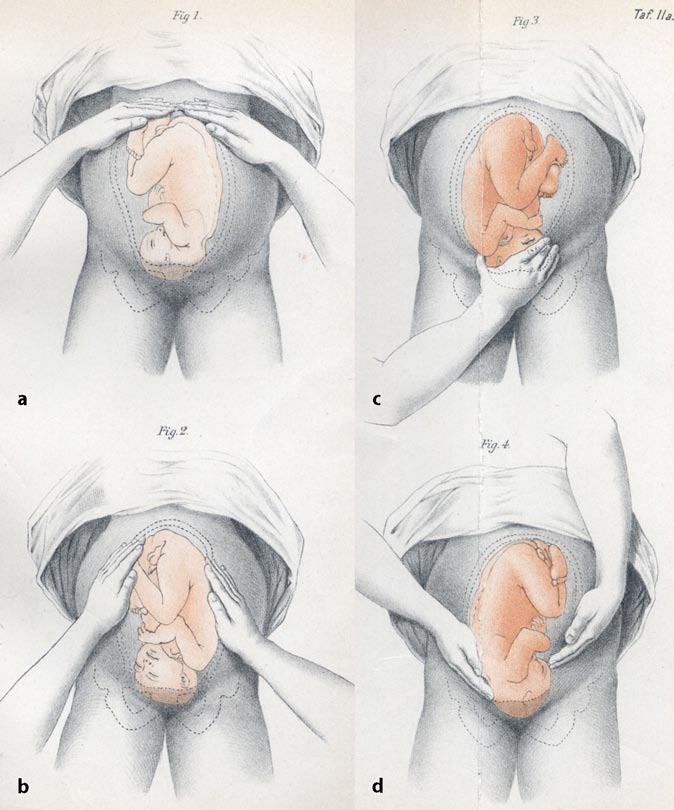

  
Клинический справочный материал

  
Акушерство на линии

  
Кровотечения, разрывы, гипертензия, ТЭЛА и решение «рожать здесь или везти»

  

  
По практическому занятию на Центральной подстанции СМП Москвы (август 2026) и Алгоритмам СМП 2025, раздел 9.

  
Клинические эпизоды — из разбора на занятии, обезличены.

  
Серия «Крещение поворотом» · версия 1.0 · 23 августа 2026 · CC BY-NC-SA 4.0

# Два эпизода с занятия

**Десять недель и «простуда».** Беременность 10 недель. Кровохарканье, слабость, были обмороки, боль в ягодичной области. Гемодинамика стабильна. SpO₂ 95 %, частота дыхания 22 в минуту, синусовая тахикардия 110, электрокардиограмма без ишемических изменений. В медцентре назначен мукалтин. В инфекционном стационаре — судороги и клиническая смерть. Диагноз — тромбоэмболия лёгочной артерии.

**Двадцать семь недель и «встать на учёт».** Женщина впервые пришла становиться на учёт в 27 недель. В разошедшийся рубец на матке провалилась пяточка плода. Ногу сохранить не удалось: шёл некроз. Клиники свершившегося разрыва — кинжальной боли и шока — до этого не было.

Разбор обоих эпизодов — в конце материала.

# Вопросы для размышления

Ответы — в конце материала.

1. Чем прогрессирующая внематочная беременность отличается от нарушенной по типу трубного аборта и по типу разрыва трубы — и почему задержки менструации может не быть?
2. Почему головная боль, нарушение зрения или боль в эпигастрии при артериальном давлении ниже 160/110 мм рт. ст. меняют объём помощи при преэклампсии?
3. Как по боли и наружному кровотечению различить краевую, центральную и смешанную отслойку плаценты?
4. Чем угрожающий и свершившийся разрыв матки отличаются от «тихого» расхождения рубца и что даёт симптом Вастена?
5. Что проверяет признак Пискачека и какое решение он принимает на вызове?
6. Почему стабильная гемодинамика и «нормальная» электрокардиограмма не снимают тромбоэмболию лёгочной артерии у беременной с кровохарканьем и обмороками?

# Аномальные маточные кровотечения

По Алгоритмам СМП 2025 (N92, N93, N95) аномальное маточное кровотечение — показание к эвакуации: катетеризация вены, транексамовая кислота 1000 мг внутривенно, транспортировка на носилках. При шоке — протокол геморрагического шока.

На занятии отдельно разобрана рабочая развилка линии. Скудные мажущие выделения без признаков кровопотери не закрываются как «неотложное кровотечение»: это может быть патология эндометрия, перименопаузальное кровотечение и другие состояния, связанные с циклом. В такой ситуации согласование идёт через акушерский пункт — направление и обратный звонок акушеров, а не самостоятельное «отпускание» без маршрута. Код, которым на занятии называли эту группу, — 2885, N90.8; в алгоритме госпитализируемые кровотечения стоят под N92–N93 и N95.

# Апоплексия яичника

Три клинических варианта: болевой, анемический и смешанный.

Боль наступает внезапно, чаще односторонняя, с иррадиацией в крестец, копчик, нижние конечности. Эпизод возможен на фоне полного благополучия, в том числе среди ночи. Срок цикла не обязан быть серединой: апоплексия случается в любую фазу. Дифференциал — овуляторный синдром (mittelschmerz): там боль короче, гемодинамики нет, живот не даёт картины внутрибрюшного кровотечения.

По алгоритму (N83: апоплексия, разрыв или перекрут кисты) — венозный доступ, натрия хлорид 250–500 мл, транексамовая кислота 1000 мг или этамзилат 500 мг, эвакуация на носилках.

# Внематочная беременность

Две большие группы: **прогрессирующая** и **нарушенная**.

**Прогрессирующая.** Периодически повторяющиеся выделения и боли. Заподозрить можно по анамнезу и первому дню последней менструации, но задержки менструации нет почти у половины пациенток: кровянистые выделения принимаются за «очередные месячные». Лечения на догоспитальном этапе алгоритм не требует; эвакуация обязательна.

**Нарушенная по типу трубного аборта.** Стертая картина: выделения, болевой синдром, который сам по себе затихает. Женщина может ходить так до месяца. Это не «прошло», а медленное кровотечение в трубу и брюшную полость.

**Нарушенная по типу разрыва трубы.** Обморочное состояние, холодный липкий пот, резкая кинжальная боль. При осмотре патология в нижних отделах живота. По алгоритму: пульсоксиметрия, венозный доступ, натрия хлорид 250–500 мл, транексамовая кислота 1000 мг, эвакуация на носилках; при шоке — протокол геморрагического шока.

Живот осматривается целиком, не только «над лоном». Внематочная, тяжёлая преэклампсия и разрыв матки по дну на занятии разбирались как состояния, которые дают картину острого живота. Если клиника удерживает оба диагноза — в карте фиксируется двойной, а не «более удобный» один. Звонок на акушерский пункт при любой из этих картин у беременной или у женщины с возможным сроком.

# Тромбоэмболия лёгочной артерии при беременности

Беременность — тромбогенное состояние с первого триместра, не «с третьего». Кровохарканье, необъяснимая одышка, тахикардия, обмороки, боль в ягодичной или тазовой области (эмбол из тазовых и проксимальных вен) складываются в сосудистый, а не «простудный» диагноз. Мукалтин на кровохарканье не отвечает.

Электрокардиограмма при субмассивной тромбоэмболии часто не показывает перегрузку правых отделов. Стабильное артериальное давление означает лишь то, что компенсация ещё держит системное давление; оно не измеряет тромботическую нагрузку. Кардиопульту передаётся клиника целиком, включая обмороки и кровохарканье, а не только «плёнка без изменений».

Судороги и остановка в стационаре в разобранном эпизоде — исход эмболии, а не «нейроинфекции», под которую пациентку успели маршрутизировать.

# Гипертензивные расстройства

Три сущности, которые не заменяют друг друга.

| Состояние | Срок появления | Суть |
|---|---|---|
| Хроническая артериальная гипертензия | До 20 недель либо существовала ранее | Гипертензия, которую беременность застала, а не создала |
| Гестационная артериальная гипертензия | После 20 недель | Повышение давления без критериев преэклампсии |
| Преэклампсия | Обычно после 20 недель, возможна послеродовая | Гипертензия плюс органное поражение; на линии — по давлению и симптомам |

Объём помощи задаёт не одно число на манжете.

| Картина | По Алгоритмам СМП 2025 |
|---|---|
| Умеренная преэклампсия, АД 140–160 / 90–110, **без** головной боли, зрительных нарушений, тошноты, рвоты, боли в эпигастрии или правом подреберье | Нифедипин 10 мг **внутрь**. Сублингвально противопоказан |
| Та же цифра АД, но **есть** любой из перечисленных симптомов | Нифедипин 10 мг внутрь **и** магния сульфат: 4000 мг (16 мл) внутривенно за 10–15 мин, затем 1000 мг/ч |
| Тяжёлая: АД ≥ 160/110 независимо от симптомов | Тот же объём, что при умеренной с симптомами |
| Целевое давление | САД 130–150, ДАД 80–95 мм рт. ст. Ниже 100/80 не снижать: риск нарушения плацентарной перфузии |

На занятии формулировка совпала с алгоритмом: «только нифедипин» — это умеренная преэклампсия без субъективной симптоматики. Головная боль, нарушение зрения, головокружение, боль в эпигастрии при давлении «ещё не 160» уже переводят случай в тяжёлый по объёму помощи — нифедипин плюс магнезия как профилактика судорог.

# Преждевременная отслойка нормально расположенной плаценты

Три геометрических варианта, от которых зависит, будет ли кровь снаружи.

<figure>

<figcaption>Рис. 1. Сверху — краевая (revealed) отслойка: кровь находит путь наружу. Снизу — центральная (concealed): ретроплацентарная гематома без выделений. Смешанная форма сочетает оба пути и на рисунке не показана. Bonnie Urquhart Gruenberg, Wikimedia Commons, CC BY-SA 4.0.</figcaption>
</figure>

| Форма | Кровь снаружи | Боль | Что происходит |
|---|---|---|---|
| Краевая | Есть наружное кровотечение | Болевого синдрома может не быть | Отслойка с края, кровь стекает по оболочкам |
| Центральная | Выделений нет | Выраженная боль | Формируется ретроплацентарная гематома; матка напряжена, «деревянная» |
| Смешанная | Есть и гематома, и наружное кровотечение | Боль плюс выделения | Сочетание обоих путей |

Объём наружной крови не равен объёму кровопотери. При центральной отслойке женщина бледнеет и входит в шок при «сухих» простынях. Влагалищное исследование противопоказано. По алгоритму (O45): венозный доступ, натрия хлорид 250–500 мл, транексамовая кислота 1000 мг, эвакуация на носилках.

# Разрыв матки

На занятии разделяли «тихий» и свершившийся разрыв.

**Гистопатический (гистохимический) разрыв, расхождение рубца.** Может идти бессимптомно. Возможны покалывания, симптом ниши в области рубца. Область рубца осматривается прицельно, сердцебиение плода выслушивается. Эпизод с пяточкой в разошедшемся рубце в 27 недель — край этого спектра: плод уже в дефекте, а картины «кинжала и шока» ещё нет.

**Свершившийся разрыв.** Дикая кинжальная боль, шок. Предлежащая часть может уйти вверх. Положительный симптом Вастена (головка не прижимается ко входу в таз / «нависает» над лоном при несоответствии размеров) позволяет заподозрить препятствие и угрозу разрыва ещё до катастрофы.

По алгоритму (O71: угрожающий, начавшийся, свершившийся): пульсоксиметрия, венозный доступ, натрия хлорид 250–500 мл; при начавшемся и свершившемся — транексамовая кислота 1000 мг; эвакуация на носилках.

# Роды: осмотр и решение «здесь или в стационар»

## Приёмы Леопольда

Четыре наружных приёма отвечают на четыре вопроса: что в дне, где спинка, что предлежит, насколько предлежащая часть вошла во вход в таз. Третий приём — захват предлежащей части над лоном — может быть болезненным; выполняется осторожно.

<figure class="portrait">

<figcaption>Рис. 2. Приёмы Леопольда. Fig. 1 — дно матки. Fig. 2 — стороны матки (спинка и мелкие части). Fig. 3 — предлежащая часть над входом в таз, одной рукой (приём может быть болезненным). Fig. 4 — отношение предлежащей части ко входу в таз, руки направлены к тазу. Christian Gerhard Leopold, 1894; общественное достояние.</figcaption>
</figure>

## Признак Пискачека

Решение «рожать на месте или везти» на занятии завязано на этот признак, а не на ощущение «уже не успеем».

Техника: два пальца и стерильная салфетка; через большую половую губу достигают головки, **не входя во влагалище**. Если головка пальпируется — она на тазовом дне, потужной период состоялся, эвакуация в этом положении невыполнима. Если головки нет — машина едет.

Открытой лицензионной схемы именно этого приёма нет. Классический «признак Пискачека» в учебниках — другое: асимметрия матки в ранние сроки беременности (Piskaček, 1899). Название на занятии относится к приёму определения стояния головки, а не к этому раннему знаку.

На станции домашние роды закрываются кодом, который на занятии называли 1641 (в алгоритме — O80, «домашние роды» / «роды вне родильного дома»). Если роды принимаются на месте, объём — по разделу «Домашние роды»: аускультация сердцебиения плода, венозный доступ, акушерское пособие, лоток под половые пути, окситоцин 10 МЕ внутримышечно в бедро после рождения ребёнка, осмотр последа и доставка его в роддом, контроль каждые 15 минут в течение двух часов.

# Пособие в родах: что называть по имени

На занятии перечислены приёмы, которые алгоритм требует знать по названию. Здесь — только роль каждого, без «выучить руками по абзацу».

| Приём | Когда |
|---|---|
| Пособие при переднем виде затылочного предлежания | Типичные головные роды: защита промежности, сдерживание разгибания головки, рождение переднего, затем заднего плечика |
| Цовьянов I | Чисто ягодичное предлежание: ножки удерживаются прижатыми, пока не родится туловище до нижнего угла лопаток |
| Цовьянов II | Ножное предлежание: ножки «удерживаются» до рождения ягодиц, чтобы не родиться ножками слишком рано |
| Классическое ручное пособие / приём Ловсета | После рождения до нижнего угла лопаток, если ручки запрокинулись |
| Морисо–Левре–Ляшапель (в алгоритме — Морисо–Смелли–Вайт) | Последующая головка не рождается самостоятельно: сгибание головки, ребёнка не тянуть на себя |

По алгоритму при тазовом предлежании пособие не оказывается до самостоятельного рождения ребёнка до уровня пупка. Тянуть ребёнка на себя запрещено.

# Возвращение к эпизодам

**Десять недель.** Кровохарканье плюс обмороки плюс тахикардия 110 плюс частота дыхания 22 плюс SpO₂ 95 % у беременной — это лёгочная эмболия в дифференциале, пока не доказано иное. «Нормальная» плёнка и стабильное давление эмболию не исключают. Мукалтин закрыл дыхательную жалобу и убрал пациентку с сосудистого маршрута. Судороги и остановка в инфекционном стационаре — цена этого маршрута, а не отдельная болезнь.

**Двадцать семь недель.** Отсутствие кинжальной боли не исключает расхождения рубца. Покалывания, ниша, «не так шевелится», поздняя постановка на учёт при рубце на матке — повод смотреть область рубца и слушать сердцебиение, а не ждать шока. Когда пяточка уже в дефекте, катастрофа свершилась анатомически, даже если гемодинамика ещё держится.

# Ответы на вопросы для размышления

**1.** Прогрессирующая — повторяющиеся боли и выделения при целой трубе; задержки менструации может не быть, потому что кровянистые выделения принимаются за цикл. Трубный аборт — стертая, волнообразная боль, женщина ходит днями и неделями. Разрыв трубы — кинжальная боль, холодный пот, обморок, картина внутрибрюшного кровотечения. Объём помощи на линии есть только у нарушенной: доступ, кристаллоид, транексам, носилки.

**2.** Алгоритм считает умеренную преэклампсию «без субъективной симптоматики» и «с симптоматикой» разными строками. Симптомы (голова, зрение, диспепсия, эпигастрий) при АД 140–160 / 90–110 добавляют магния сульфат 4000 мг с поддержкой 1000 мг/ч к нифедипину 10 мг внутрь — тот же объём, что при АД ≥ 160/110. Цифра 160 не является единственным порогом тяжести.

**3.** Краевая — наружное кровотечение, боли может не быть. Центральная — ретроплацентарная гематома, наружных выделений нет, боль выражена, матка напряжена. Смешанная — и гематома, и кровь снаружи. Объём видимой крови не равен кровопотере.

**4.** «Тихий» разрыв идёт по рубцу: покалывания, ниша, иногда пролабирование части плода без шока. Свершившийся — кинжальная боль и шок, предлежащая часть уходит. Симптом Вастена положительный при несоответствии головки и входа в таз — маркер угрозы, а не доказанный разрыв.

**5.** Признак Пискачека отвечает на вопрос, достигла ли головка тазового дна. Два пальца со стерильной салфеткой через большую половую губу, без влагалищного исследования. Головка пальпируется — роды принимаются на месте. Не пальпируется — эвакуация.

**6.** Субмассивная эмболия часто оставляет системное давление и электрокардиограмму без «классики». Кровохарканье, обмороки, тахипноэ, тахикардия и беременность весят больше, чем спокойная плёнка. Кардиопульту передаётся эта клиника, а не заключение «ЭКГ норма».

# Источники

- Практическое занятие по акушерству, Центральная подстанция скорой медицинской помощи Москвы, август 2026 (рабочие формулировки линии: акушерский пункт, признак Пискачека, коды повода).
- Алгоритмы оказания скорой медицинской помощи (Департамент здравоохранения города Москвы, 2025), раздел 9 «Акушерство и гинекология»: N83, N92–N95, O00, O10–O16, O14, O15, O44, O45, O71, O80.
- Клинические рекомендации: внематочная беременность; преэклампсия, эклампсия, гипертензивные расстройства во время беременности; преждевременная отслойка нормально расположенной плаценты; роды вне стационара.

# Источники иллюстраций

| Файл | Что изображено | Источник |
|---|---|---|
| `otsloyka_marginal_concealed.jpg` | Краевая (revealed) и центральная (concealed) отслойка | Bonnie Urquhart Gruenberg, Wikimedia Commons, [CC BY-SA 4.0](https://creativecommons.org/licenses/by-sa/4.0/) |
| `leopold_1894.jpg` | Четыре приёма Леопольда | Christian Gerhard Leopold, 1894; Leopold und Spörlin, *Arch Gynäkol* 45: 337–368; Wikimedia Commons, общественное достояние |

Сгенерированные схемы из версии 1.0 сняты: на них были латинская транслитерация вместо кириллицы и неверное положение рук при третьем приёме Леопольда.

# Выходные данные

**Материал:** «Акушерство на линии». Версия 1.1 от 23 августа 2026. Иллюстрации заменены на лицензионные первоисточники.

**Серия:** «Крещение поворотом» — клинические разборы догоспитальной практики.

**Лицензия:** текст и схемы — Creative Commons «С указанием авторства — Некоммерческая — С сохранением условий» 4.0 (CC BY-NC-SA 4.0). Копировать, печатать и раздавать коллегам можно свободно, включая печать для подстанции; продавать — нельзя; при переработке сохраняется та же лицензия и указывается источник.

**Оговорка.** Материал учебный. Он не является нормативным документом, не заменяет действующие протоколы, клинические рекомендации и распоряжения службы. Дозы, показания и маршрутизацию проверять по первоисточникам, действующим на момент чтения. Коды повода (2885, 1641) приведены как рабочие формулировки занятия; при расхождении с действующим справочником станции приоритет у справочника и у Алгоритмов СМП.

**О клинических эпизодах.** Эпизоды рассказаны на занятии и обезличены: нет имён, дат, адресов, номеров карт и названий стационаров. Совпадения с чужой практикой возможны.

**Нашли ошибку?** Ошибка в дозе, сроке или механизме — не мелочь. Сообщить можно через раздел Issues репозитория проекта; исправление выходит новой версией.
