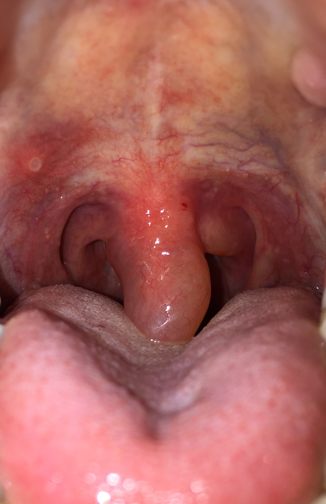

  
Клинический разбор

  
Аллергический отёк верхних дыхательных путей

  
Анафилаксия без шока. Три алгоритма для одного кода T78.3. Арифметика эпинефрина: концентрации, дозы, четыре разведения. Доказательность глюкокортикоидов и хлоропирамина. Ангиоотёк, при котором адреналин не работает

  

  
С разбором клинического наблюдения: женщина 47 лет, остро возникшее стридорозное дыхание и осиплость, отёк небного язычка и сужение просвета ротоглотки, систолическое давление 160 мм рт. ст. Эпинефрин внутримышечно, преднизолон, затем эпинефрин внутривенно в разведении. Интубации не потребовалось.

  
Серия «Крещение поворотом» · версия 1.0 · CC BY-NC-SA 4.0

# Клинический случай

## Слово бригаде

«Вызов на затруднение дыхания с угрозой жизни. Обычно на таких вызовах (почему-то!) угрозы жизни нет. Но тут все немного не по плану пошло. Приезжаем: на кровати сидит женщина, видно, что испугана. Дыхание стридорозное. Началось все остро 10 мин назад, почувствовала затруднение дыхания, ощущение кома в горле. Посмотрели горло: все сужено, отечно, ма-а-ленький просвет зева.
Первый номер мне, упавшим голосом:
- Мы тут ничего не заинтубируем.
Поддерживаю товарища:
- Не... Вообще не заинтубируем ничего...
Переглянулись, и оба молча принялись работать. Адреналин в бедро, катетер, гормоны (120 преднизолона, почти без разведения, чем вызвали веселые ощущения у пациентки, которую уже затрясло от адреналина), адреналин в разведении по вене... Ну, в общем, довезли под монитором до больницы, сразу в реанимацию, понятно, обошлось без интубации. Да, САД было 160 мм.рт.ст. Ну, хоть не шок...»

## Данные карты вызова

Женщина 47 лет. Повод к вызову — нарушение дыхания с угрозой жизни. Бригада фельдшерская, из двух фельдшеров.

**Жалобы:** внезапно возникший приступ удушья, осиплость голоса, ощущение неполного вдоха.

**Анамнез:** около десяти минут назад в покое внезапно отметила быстрое нарастание жалоб. Самостоятельно лекарственные препараты не принимала. Подобное состояние впервые. Связывает с использованием электронной сигареты. В анамнезе гипертоническая болезнь 2-й стадии. Аллергию, в том числе на медикаменты, отрицает. Постменопауза.

**Объективно:** состояние средней тяжести, сознание ясное, 15 баллов по шкале комы Глазго, положение активное. Кожа влажная, бледная. Сыпи нет. Зев: стенки не гиперемированы, миндалины не увеличены, без налётов. Отёков нет, температура 36,6 °C. Частота дыхания 24 в минуту, одышка инспираторная; дыхание везикулярное во всех отделах, хрипов нет, кашель сухой. Пульс 102, ритмичный, дефицит пульса 0; артериальное давление 160/90 при привычном 140/80 и максимальном 200/110. Поведение беспокойное, контактна, ориентирована. Рост 174 см, масса тела около 84 кг.

**Локальный статус:** слизистая полости рта и ротоглотки отёчна, гиперемирована. Язычок мягкого нёба увеличен в объёме, отёчен. Небные дужки и миндалины умеренно отёчны. Просвет ротоглотки сужен за счёт отёка мягких тканей. Голос осипший.

**Инструментально:** сатурация 97 %, на мониторе синусовая тахикардия с частотой 102.

**Оказанная помощь:** эпинефрин 1 мг/мл — 0,5 мг внутримышечно в переднебоковую поверхность левого бедра; ингаляция кислорода 10 л/мин; катетеризация периферической вены катетером G18; преднизолон 30 мг/мл — 4 мл (120 мг) внутривенно в разведении натрия хлорида 0,9 % 10 мл; мониторинг. Далее дважды зафиксировано «без изменений»: давление 160/90, частота сердечных сокращений 100 и 108, частота дыхания 24, сатурация 97 %. Затем эпинефрин 1 мг/мл — 1 мг внутривенно в разведении натрия хлорида 0,9 % 9 мл, от полученного раствора введено 0,5 мл. После этого выраженность отёка уменьшилась, одышка купирована, осиплость сохранялась; давление 160/90, частота сердечных сокращений 98, частота дыхания 20, сатурация 98 %.

**Диагноз:** T78.3, ангионевротический отёк; в текстовой части — аллергический отёк верхних дыхательных путей. Медицинская эвакуация; в приёмном отделении давление 150/90, частота дыхания 20, сатурация 98 %. Хлоропирамин не вводился.

Разбор случая приведён в конце материала.

# Вопросы для размышления

Ответы — в конце материала.

1. Систолическое давление 160 мм рт. ст. — шока нет. Означает ли это, что и анафилаксии нет? По каким критериям это решается?
2. Код T78.3 встречается в Алгоритмах трижды, в двух разных разделах. Чем различаются эти алгоритмы и как выбрать нужный?
3. На ампуле указано «1 мг/мл», в отечественных источниках прежних лет — «0,1 %», в англоязычных — «1:1000». Как связаны эти три записи и сколько миллиграммов в ампуле 1 мл?
4. Внутримышечная доза для взрослого — 0,5 мг, внутривенная — 50 мкг, в десять раз меньше. Откуда берётся эта разница?
5. Бригадой 1 мг эпинефрина разведён в 9 мл натрия хлорида и введено 0,5 мл раствора. Сколько микрограммов получил пациент, сколько осталось в шприце и предусмотрено ли такое разведение Алгоритмами?
6. Что известно об эффективности глюкокортикоидов при анафилаксии и почему рекомендации и Алгоритмы расходятся в том, когда их вводить?
7. При каких проявлениях показан хлоропирамин и почему его немедленное введение бесполезно?
8. Какое положение показано пациенту с отёком верхних дыхательных путей — горизонтальное или сидя?
9. Почему при аллергическом отёке верхних дыхательных путей надгортанное герметизирующее устройство противопоказано, тогда как при анафилактическом шоке оно предусмотрено?
10. У какого отёка гортани адреналин, гормоны и антигистаминные неэффективны и по каким признакам его заподозрить?

# Анафилаксия и анафилактический шок

Термины «анафилаксия» и «анафилактический шок» не являются синонимами; их разграничение определяет объём оказываемой помощи.

Клинические рекомендации «Анафилактический шок» определяют их так:

- **анафилаксия** — жизнеугрожающая системная реакция гиперчувствительности немедленного типа, характеризующаяся быстрым развитием потенциально жизнеугрожающих изменений гемодинамики **и/или** нарушениями со стороны дыхательной системы;
- **анафилактический шок** — острая недостаточность кровообращения в результате анафилаксии, проявляющаяся снижением систолического давления ниже 90 мм рт. ст. или на 30 % от рабочего уровня.

В рекомендациях это положение сформулировано непосредственно: «Без выраженных гемодинамических нарушений диагноз шока неправомерен: например, жизнеугрожающий бронхоспазм в сочетании с крапивницей — анафилаксия, но не АШ».

Из приведённых определений следует, что жизнеугрожающий компонент анафилаксии может быть респираторным либо гемодинамическим, и наличие одного из них не предполагает наличия другого. Пациент с нормальным или повышенным артериальным давлением и нарастающим отёком гортани соответствует критериям анафилаксии; причиной смерти в подобных случаях становится обструкция дыхательных путей, развивающаяся в отсутствие гемодинамических нарушений.

## Диагностические критерии

Для анафилаксии характерно наличие **одного** из трёх критериев.

| | Критерий |
|---|---|
| **1** | Острое начало (от нескольких минут до нескольких часов) с вовлечением кожи и/или слизистых — генерализованная крапивница, зуд или гиперемия, **отёк губ, языка, небного язычка** — в сочетании с: **А)** респираторными нарушениями (диспноэ, бронхоспазм, свистящие хрипы, снижение скорости потока, гипоксемия) либо **Б)** снижением давления или симптомами поражения органов-мишеней |
| **2** | Два или более симптома, возникших остро после контакта с возможным аллергеном, при обязательном наличии жизнеугрожающих нарушений дыхания и/или кровообращения: поражение кожи и слизистых; респираторные проявления (затруднение дыхания, одышка, кашель, стридор, гипоксемия); внезапное снижение давления с коллапсом или синкопе; персистирующие гастроинтестинальные нарушения |
| **3** | Снижение давления после контакта с известным для данного пациента аллергеном |

Первый критерий содержит два положения, существенных для разбираемого наблюдения. Вовлечение слизистых оболочек учитывается наравне с кожными проявлениями, причём **отёк небного язычка включён в перечень явным образом**; следовательно, наличие крапивницы не является обязательным условием диагноза. Формулировка «и/или» означает, что сочетание поражения слизистых с респираторными нарушениями является достаточным, а снижение артериального давления не требуется.

<figure class="portrait">
  
  <figcaption>Отёчный язычок мягкого нёба: увеличен в объёме, полупрозрачен, оттеснён вниз и лежит на корне языка, просвет ротоглотки сужен. Именно эта находка названа в первом диагностическом критерии анафилаксии наравне с крапивницей; в разбираемом наблюдении локальный статус описан теми же словами — «язычок мягкого нёба увеличен в объёме, отёчен». Иллюстрация; к разбираемому наблюдению снимок отношения не имеет.</figcaption>
</figure>

## Степени тяжести шока

Если гемодинамические нарушения всё же есть, тяжесть градуируется по давлению: при 1-й степени нарушения незначительны, при 3-й — потеря сознания и давление 60–40/0 мм рт. ст., при 4-й давление не определяется, тоны сердца и дыхание не выслушиваются. Данная классификация относится к шоку и к пациенту с отёком гортани при систолическом давлении 160 мм рт. ст. неприменима; степень угрозы в подобном случае определяется не состоянием гемодинамики, а проходимостью дыхательных путей.

# Что предписывают Алгоритмы

Код T78.3 присутствует в Алгоритмах в трёх подразделах с различным объёмом помощи; выбор подраздела представляет собой первое тактическое решение.

| Где | Формулировка | Когда применяется |
|---|---|---|
| Раздел «Терапия» | T78.3 Ангионевротический отёк, L50 Крапивница | Локализованная и генерализованная формы без вовлечения дыхательных путей и без гипотензии |
| Раздел «Анестезиология и реаниматология» | T78.3 Аллергический отёк верхних дыхательных путей | При признаках отёка верхних дыхательных путей |
| Раздел «Анестезиология и реаниматология» | T78.0, T78.2, Т80.5, T88.6 Анафилактический шок | При снижении систолического давления |

Подраздел раздела «Терапия» содержит отсылки: при признаках отёка верхних дыхательных путей он отправляет к алгоритму аллергического отёка, при снижении систолического давления на 30 % от привычных цифр — к алгоритму анафилактического шока. Алгоритм аллергического отёка, в свою очередь, при систолическом давлении ниже 100 мм рт. ст. отправляет к алгоритму шока.

## Аллергический отёк верхних дыхательных путей

Объём по Алгоритмам, для взрослых:

- устранение контакта с аллергеном, прекращение поступления аллергена в организм;
- **эпинефрин 0,01 мг/кг внутримышечно в переднебоковую поверхность бедра, разовая доза не более 0,5 мг (0,5 мл)**;
- пульсоксиметрия; ингаляция кислорода; катетеризация вены или внутрикостный доступ;
- **преднизолон 90–120 мг (3–4 мл) или дексаметазон 8–20 мг (2–5 мл) внутривенно**;
- ЭКГ-мониторинг;
- при сохранении признаков обструкции верхних дыхательных путей, через 5 минут от предыдущего введения, — **повторно эпинефрин 0,01 мг/кг внутримышечно, не более 0,5 мг**;
- при сохранении признаков обструкции — **эпинефрин 1 мг (1 мл) в разведении натрия хлорида 0,9 % 9 мл, от полученного раствора ввести 0,5 мл внутривенно**;
- при сохранении признаков обструкции: **применение надгортанного герметизирующего устройства противопоказано**; санация верхних дыхательных путей; интубация трахеи; капнометрия-капнография для бригад анестезиологии-реанимации с целевыми значениями EtCO₂ 35–45 мм рт. ст.;
- при невозможности интубации трахеи — **коникотомия**, ИВЛ или вспомогательная вентиляция;
- при систолическом давлении ниже 100 мм рт. ст. — переход к алгоритму анафилактического шока.

Тактика: медицинская эвакуация в больницу, транспортировка на носилках. При отказе — актив на «103» через 2 часа, при повторном отказе — актив в поликлинику.

Раздел для детей построен аналогично, с возрастными дозами: эпинефрин 0,01 мг/кг внутримышечно с максимумом 0,15 мг до 6 лет, 0,3 мг с 6 до 12 лет и 0,5 мг с 12 лет; преднизолон 3–5 мг/кг или дексаметазон 0,6–1,2 мг/кг внутривенно. Присутствует указание, отсутствующее в разделе для взрослых: **попытка интубации трахеи должна быть однократной**.

<strong>Расхождение, требующее сверки с печатным изданием.</strong> Внутривенная доза из разведения 1 мг на 9 мл во взрослом разделе составляет 0,5 мл, то есть 50 мкг. В детском разделе из того же разведения предписано вводить 1,5 мл до 6 лет, 3 мл с 6 до 12 лет и 5 мл с 12 лет, что соответствует 150, 300 и 500 мкг. Таким образом, внутривенная доза для подростка оказывается в десять раз больше, чем для взрослого, при меньшей массе тела. Фармакологического обоснования такому соотношению не имеется. До выяснения указанные значения подлежат сверке с печатным изданием Алгоритмов; в разделе о расчёте доз ниже рассматривается только схема для взрослых.

## Анафилактический шок

Объём по Алгоритмам, для взрослых:

- устранение контакта с аллергеном;
- **положение с приподнятым ножным концом**;
- эпинефрин 0,01 мг/кг внутримышечно в переднебоковую поверхность бедра, не более 0,5 мг;
- пульсоксиметрия; ингаляция кислорода; катетеризация вены или внутрикостный доступ; ЭКГ-мониторинг; ЭКГ при подозрении на коронарную патологию;
- при сохранении систолического давления ниже 80 мм рт. ст.: повторно эпинефрин внутримышечно через 5 минут; натрия хлорид 0,9 % 1000 мл внутривенно либо полиионный раствор 1000 мл; преднизолон 90–120 мг или дексаметазон 8–20 мг внутривенно;
- при сохранении давления ниже 80 мм рт. ст. — эпинефрин 1 мг в разведении натрия хлорида 0,9 % 9 мл, ввести 0,5 мл внутривенно;
- при сохранении давления ниже 80 мм рт. ст. — **инфузия эпинефрина 0,1–1 мкг/кг/мин** (приложение 37);
- при бронхоспазме — сальбутамол 2,5 мг (2,5 мл) в разведении натрия хлорида 0,9 % 3 мл через небулайзер;
- **при кожных проявлениях и стабилизации систолического давления** — хлоропирамин 20–40 мг (1–2 мл) внутривенно или дифенгидрамин 10 мг (1 мл) внутривенно;
- при дыхательной недостаточности III–IV степени и при коме: санация верхних дыхательных путей, **интубация трахеи или применение надгортанного герметизирующего устройства**, ИВЛ, капнография.

## Сравнительная характеристика алгоритмов отёка верхних дыхательных путей и анафилактического шока

| | Аллергический отёк ВДП | Анафилактический шок |
|---|---|---|
| Положение | Не задано | С приподнятым ножным концом |
| Что запускает эскалацию | Сохранение признаков обструкции | Сохранение САД ниже 80 мм рт. ст. |
| Инфузия растворов | Не предусмотрена | 1000 мл при САД ниже 80 |
| Надгортанное устройство | **Противопоказано** | **Предусмотрено наравне с интубацией** |
| Хлоропирамин | Не предусмотрен | При кожных проявлениях после стабилизации давления |
| Резерв при неудаче | Коникотомия | ИВЛ через надгортанное устройство или трубку |

Различие в отношении надгортанного устройства имеет патофизиологическое обоснование. Ларингеальная маска или ларингеальная трубка устанавливается в гортаноглотку слепо и герметизируется за счёт прилегания к отёчным тканям. При отёке верхних дыхательных путей она не обеспечивает проходимости ниже уровня препятствия, а установка способна усилить отёк и превратить частичную обструкцию в полную. При шоке без отёка гортани препятствие на этом уровне отсутствует, и устройство обеспечивает вентиляцию.

## Ангионевротический отёк и крапивница в разделе «Терапия»

Данный алгоритм применяется при отсутствии вовлечения дыхательных путей и гемодинамических нарушений:

- прекращение контакта с аллергеном; пульсоксиметрия; ЭКГ при подозрении на кардиальную патологию;
- при **локализованной** форме — хлоропирамин 20–40 мг (1–2 мл) внутривенно или внутримышечно;
- при **генерализованной** форме — преднизолон 60–90 мг (2–3 мл) внутримышечно или внутривенно;
- при сатурации 90 % и ниже — ингаляция кислорода с FiO₂ 0,5;
- при бронхоспазме — эпинефрин 0,5 мг (0,5 мл) внутримышечно и далее раздел о бронхиальной астме.

Медицинская эвакуация в данном подразделе предусмотрена при отсутствии эффекта от терапии при генерализованной форме, тогда как в алгоритме отёка верхних дыхательных путей она является безусловной.

# Положение пациента

Алгоритмы задают положение только для анафилактического шока — с приподнятым ножным концом. Для аллергического отёка верхних дыхательных путей положение не указано; в этой части применимы клинические рекомендации, содержащие два раздельных указания, каждое из которых при неверном применении сопряжено с риском для жизни.

| Ситуация | Положение | Обоснование по рекомендациям |
|---|---|---|
| Анафилактический шок | Лежа; нельзя поднимать и переводить в положение сидя | Подъём «в течение нескольких секунд может привести к фатальному исходу» |
| Анафилаксия с удушьем вследствие бронхоспазма или ангиоотёка верхних дыхательных путей | **Сидя** | «Если не дать сесть пациенту с удушьем от бронхоспазма или ангиоотёка верхних дыхательных путей, то он может погибнуть» |
| Беременные | На левом боку с обеспечением проходимости дыхательных путей | Отдельная рекомендация |

Различие объясняется характером угрозы. При шоке горизонтальное положение поддерживает венозный возврат, и вертикализация обескровливает сердце. При обструкции верхних дыхательных путей положение сидя остаётся единственным, в котором сохраняется дыхание. Положение, принятое пациентом с отёком гортани самостоятельно, изменению не подлежит.

# Эпинефрин: вся арифметика

Эпинефрин является единственным вмешательством с установленным влиянием на исход анафилаксии; вместе с тем с ним связана большая часть ошибок дозирования.

## Обозначения концентрации

Первые три записи обозначают одну и ту же концентрацию — раствор в ампуле; четвёртая относится к разведению, которое готовят для внутривенного введения.

| Запись | Что означает | Концентрация |
|---|---|---|
| **0,1 %** | 0,1 г в 100 мл | 1 мг/мл |
| **1 : 1000** | 1 г в 1000 мл | 1 мг/мл |
| **1 мг/мл** | прямая запись, на современных ампулах | 1 мг/мл |
| **1 : 10 000** | 1 г в 10 000 мл | 0,1 мг/мл, то есть 100 мкг/мл |

<strong>Пересчёт процентной концентрации в массовую.</strong> Процентная концентрация в фармакопее выражает массу вещества в граммах на 100 мл раствора. Раствор 0,1 % содержит 0,1 г, то есть 100 мг, в 100 мл, что соответствует <strong>1 мг в 1 мл</strong>. Ампула объёмом 1 мл содержит 1 мг эпинефрина — разовую дозу для внутривенного введения при остановке кровообращения. В Алгоритмах используются обе записи: «Эпинефрин 1 мг (0,1 % — 1 мл)». Разведение ампулы в десять раз переводит 1 : 1000 в 1 : 10 000, то есть 1 мг/мл в 100 мкг/мл; именно эта концентрация используется для внутривенного введения.

## Внутримышечная доза

Алгоритмы и клинические рекомендации в этом пункте совпадают: **0,01 мг/кг, разовая доза не более 0,5 мг (0,5 мл)** для взрослого. Для детей максимум 0,15 мг до 6 лет, 0,3 мг с 6 до 12 лет, 0,5 мг с 12 лет.

<strong>Расчёт для пациентки из наблюдения (84 кг).</strong> 0,01 мг/кг × 84 кг = 0,84 мг. Это больше разрешённой разовой дозы, поэтому вводится не расчётная, а предельная — <strong>0,5 мг</strong>. При концентрации 1 мг/мл это <strong>0,5 мл</strong>, то есть половина ампулы.

У взрослых с массой тела свыше 50 кг расчётная доза превышает разрешённую разовую, и вводимая доза оказывается фиксированной — 0,5 мг (0,5 мл). Расчёт по массе тела сохраняет значение у детей и у взрослых с малой массой тела.

Повторная доза — через 5 минут от предыдущего введения, если признаки обструкции сохраняются. Место введения — переднебоковая поверхность бедра; по клиническим рекомендациям эта локализация предпочтительнее дельтовидной мышцы и подкожного введения, и данный пункт имеет уровень убедительности B при уровне достоверности доказательств 2 — один из немногих в теме, опирающийся не только на мнение экспертов. Причина в кровоснабжении: латеральная широкая мышца бедра массивна и обильно кровоснабжается, всасывание из неё быстрее и предсказуемее.

## Почему внутривенная доза в десять раз меньше

Различие обусловлено не свойствами препарата, а фармакокинетикой путей введения.

При внутримышечном введении препарат поступает в кровь постепенно: концентрация нарастает за минуты, пик сглажен, сосудистая реакция развивается плавно. При внутривенном введении весь болюс оказывается в кровотоке сразу, и пиковая концентрация при той же дозе многократно выше. Поэтому 0,5 мг, безопасные в бедро, при введении в вену дают гипертензивный криз, тахиаритмию и ишемию миокарда.

Вследствие этого внутривенные дозы эпинефрина при анафилаксии измеряются десятками микрограммов, а не долями миллиграмма, и клинические рекомендации допускают внутривенное введение только при кардиореспираторном мониторинге.

<strong>Ошибка с наибольшими последствиями.</strong> Внутривенное введение неразведённого содержимого ампулы — 1 мг эпинефрина — пациенту с сохранённым кровообращением. Данная доза предназначена для остановки кровообращения; у пациента с систолическим давлением 160 мм рт. ст. она способна вызвать гипертензивный криз, разрыв сосуда, желудочковую аритмию и инфаркт миокарда. Внутримышечная доза 0,5 мг и внутривенная доза 0,05 мг различаются десятикратно.

## Схемы разведения

| Что готовим | Как | Итоговая концентрация | Что вводим |
|---|---|---|---|
| Внутримышечно | не разводим, из ампулы | 1 мг/мл | 0,5 мл = 0,5 мг |
| Внутривенно болюсно по Алгоритмам | 1 мг (1 мл) + 9 мл натрия хлорида 0,9 % = 10 мл | 100 мкг/мл | 0,5 мл = 50 мкг |
| Инфузия шприцевым дозатором взрослым, приложение 37 | 1 мг (1 мл) + 19 мл натрия хлорида 0,9 % = 20 мл | 50 мкг/мл | по таблице приложения, мл/ч |
| Инфузия шприцевым дозатором детям, приложение 38 | 1 мг (1 мл) + 49 мл натрия хлорида 0,9 % = 50 мл | 20 мкг/мл | по таблице приложения, мл/ч |

<strong>Расчёт введённой дозы по данным карты вызова.</strong> Запись в карте: «эпинефрин 1 мг/мл — 1 мг, внутривенно в разведении натрия хлорида 0,9 % — 9 мл. От полученного раствора 0,5 мл». Схема совпадает с предписанной Алгоритмами при сохранении признаков обструкции.

К 1 мл раствора, содержащему 1 мг, добавлено 9 мл растворителя; полученные 10 мл содержат 1000 мкг, концентрация составляет 1000 ÷ 10 = <strong>100 мкг/мл</strong>. Введено 0,5 мл, то есть 100 × 0,5 = <strong>50 мкг</strong> (0,05 мг) — десятая часть введённой ранее внутримышечной дозы.

В шприце при этом остаётся 9,5 мл раствора, то есть <strong>950 мкг эпинефрина</strong> — практически полная ампула в разведённом виде. При сохранении признаков обструкции этот остаток позволяет ввести следующую дозу сразу, без повторного разведения: одной разведённой ампулы хватает на девятнадцать доз по 50 мкг. По окончании вызова остаток утилизируется в отходы класса Б.

<strong>Проверка расчёта по таблице приложения 37.</strong> Разведение — 1 мг в 19 мл, итого 20 мл с концентрацией 50 мкг/мл. В таблице по массе тела и заданной скорости в мкг/кг/мин приведено значение, устанавливаемое в дозаторе, — <strong>мл/ч</strong>.

Для пациента массой 80 кг при скорости 0,5 мкг/кг/мин доза составляет 0,5 × 80 = 40 мкг/мин, или 2400 мкг/ч; при концентрации 50 мкг/мл это соответствует 2400 ÷ 50 = <strong>48 мл/ч</strong>, что совпадает со значением таблицы на пересечении строки «80» и столбца «0,5».

## Типичные расчётные ошибки

| Ошибка | Последствие |
|---|---|
| Спутать миллилитры с миллиграммами | Для неразведённого раствора 1 мл и 1 мг совпадают, для разведённого уже нет: 1 мл болюсного разведения — это 0,1 мг |
| Спутать 1 : 1000 и 1 : 10 000 | Десятикратная ошибка дозы |
| Ввести внутривенно внутримышечную дозу | Гипертензивный криз, аритмия, ишемия миокарда |
| Считать проценты как миллиграммы на миллилитр | 0,1 % — это 1 мг/мл, а не 0,1 мг/мл: расхождение в десять раз |
| Взять разведение из приложения для дозатора и ввести болюсом | Приложение 37 даёт 50 мкг/мл, болюсная схема — 100 мкг/мл: доза разойдётся вдвое |
| Считать по массе тела у крупного взрослого | Расчёт даёт 0,84 мг, а разовая доза ограничена 0,5 мг |

# Глюкокортикоиды: что показывают данные

Расхождение между клинической практикой и доказательной базой в этом вопросе выражено сильнее, чем в других разделах неотложной аллергологии.

**Рандомизированных исследований не существует.** Кокрейновский обзор (Choo, Simons, Sheikh) искал их дважды, в 2009 и 2011 году, просмотрел свыше 1700 публикаций, обращался к экспертам и производителям и не нашёл ни одного рандомизированного или квазирандомизированного исследования. Авторы обзора заключают, что не могут ни поддержать, ни опровергнуть применение глюкокортикоидов при анафилаксии.

**Наблюдательные данные противоречивы.** Систематический обзор Alqurashi и Ellis (31 исследование) показал, что бифазные реакции чаще возникают при среднетяжёлой и тяжёлой анафилаксии и при позднем введении эпинефрина, а не при отказе от гормонов; авторы не поддерживают рутинное применение. Ретроспективное исследование Michelson (5203 госпитализированных ребёнка) обнаружило обратную связь введения глюкокортикоидов с длительностью госпитализации свыше двух суток и с потребностью в повторном эпинефрине, но не с повторными обращениями после выписки. Обзор Liyanage приходит к сходному выводу: гормоны, по-видимому, сокращают длительность пребывания в стационаре, но не влияют на повторные обращения, а консенсуса о влиянии на бифазные реакции нет.

**Международные руководства уходят от рутинного применения.** Resuscitation Council UK в обновлении 2021 года исключил гидрокортизон из рутинного лечения анафилаксии. EAACI в руководстве 2021 года отмечает ограниченность данных об эффективности и возможный вред у детей.

**Российские документы гормоны сохраняют, но расходятся в сроке введения.** Клинические рекомендации предписывают системные кортикостероиды «после стабилизации артериального давления и устранения респираторных проявлений после введения эпинефрина» — для снижения риска продлённой фазы респираторных проявлений; уровень убедительности C, уровень достоверности доказательств 5. Алгоритмы же включают преднизолон 90–120 мг или дексаметазон 8–20 мг в первоначальный объём помощи при аллергическом отёке верхних дыхательных путей — до повторной внутримышечной дозы эпинефрина и до перехода к внутривенному введению.

| Препарат | Взрослым при отёке ВДП по Алгоритмам | Эквивалент по клиническим рекомендациям |
|---|---|---|
| Преднизолон | **90–120 мг (3–4 мл)** | 60–120 мг |
| Дексаметазон | **8–20 мг (2–5 мл)** | 8–16 мг |
| Метилпреднизолон | не указан | 50–100 мг |
| Гидрокортизон | не указан | 200 мг |

Расхождение касается не показаний к глюкокортикоидам как таковым, а их места в последовательности вмешательств: в первоначальном объёме либо после стабилизации. Клиническое значение имеет иное обстоятельство: действие преднизолона развивается через десятки минут, и на просвет гортани в первые минуты он не влияет. Введение глюкокортикоида вместо эпинефрина или до него задерживает единственное вмешательство, определяющее исход в этом интервале; введение после эпинефрина, предусмотренное Алгоритмами, такой задержки не создаёт.

# Антигистаминные и хлоропирамин

Доказательная база аналогична: рандомизированные исследования отсутствуют. Кокрейновский обзор H1-блокаторов при анафилаксии (Sheikh, ten Broek, Brown, Simons) не нашёл ни одного подходящего исследования и заключил, что дать рекомендации для практики невозможно. Обзор отдельно отмечает фармакологическую сторону: антигистаминные средства снимают зуд, крапивницу и ринорею, но **не влияют на обструкцию дыхательных путей, гастроинтестинальные симптомы и шок** и не прекращают высвобождение медиаторов тучными клетками в клинически применяемых дозах. EAACI формулирует то же: доказано лишь влияние на кожные симптомы.

Место хлоропирамина в Алгоритмах соответствует этим данным: препарат входит в алгоритм локализованного ангионевротического отёка и крапивницы и в алгоритм анафилактического шока — при кожных проявлениях и после стабилизации систолического давления. **В алгоритме аллергического отёка верхних дыхательных путей хлоропирамина нет.**

| Препарат | Доза для взрослого |
|---|---|
| Хлоропирамин | 20–40 мг (1–2 мл) внутривенно или внутримышечно |
| Дифенгидрамин | 10 мг (1 мл) внутривенно по Алгоритмам; 25–50 мг внутривенно медленно, не менее 5 минут, по клиническим рекомендациям |
| Клемастин | 2 мг (2 мл) внутривенно или внутримышечно по клиническим рекомендациям |

Комментарий клинических рекомендаций к соответствующему пункту формулирует это непосредственно: «Начало действия антигистаминных препаратов существенно превышает начало действия эпинефрина, поэтому в данном случае **нет пользы их немедленного введения** после возникновения эпизода анафилаксии/АШ». Там же указано на возможное усугубление гипотензии при быстром внутривенном введении.

Таким образом, хлоропирамин при анафилаксии показан при кожных проявлениях и не показан при их отсутствии. Риск, связанный с его назначением в первые минуты, обусловлен не свойствами препарата, а задержкой введения эпинефрина.

# Ангиоотёк, при котором адреналин не работает

Отёк гортани не всегда опосредован гистамином. Второй механизм — брадикининовый; он не отвечает ни на эпинефрин, ни на глюкокортикоиды, ни на антигистаминные препараты. Разграничение существенно, поскольку внешне эти формы схожи, а тактика при них различается.

| Признак | Гистаминовый (аллергический) | Брадикининовый (ИАПФ, наследственный) |
|---|---|---|
| Крапивница, зуд | Часто | **Отсутствуют** |
| Скорость развития | Минуты | Часы, нарастает медленнее |
| Локализация | Любая, часто с системными проявлениями | Лицо, губы, язык, гортань |
| Ответ на эпинефрин | Есть | Отсутствует или минимальный |
| Провокатор | Аллерген | Приём ИАПФ; при наследственной форме — травма, стресс, иногда без причины |

**Ангиоотёк на ингибиторы АПФ.** Встречается у 0,1–0,7 % принимающих препараты этого класса, то есть примерно у одного из 150–1000, и составляет заметную долю всех ангиоотёков, попадающих в приёмные отделения. Развивается преимущественно в области лица, шеи и верхних дыхательных путей, **без крапивницы**, и может возникнуть в любой момент — от недели до нескольких лет после начала приёма. Длительный анамнез приёма препарата без осложнений диагноз не исключает.

Механизм: ингибитор АПФ блокирует фермент, расщепляющий не только ангиотензин, но и брадикинин; брадикинин накапливается и даёт отёк. Препараты, действующие на гистаминовый путь, при этом механизме неэффективны, что подтверждено клинически: в рандомизированном исследовании (Baş и соавт., *N Engl J Med*, 2015) при ангиоотёке верхних дыхательных путей на ИАПФ полное разрешение отёка на стандартной терапии преднизолоном 500 мг с клемастином заняло в среднем 27,1 часа против 8,0 часов при введении икатибанта — антагониста брадикининовых B2-рецепторов; одному пациенту из группы стандартной терапии потребовалась трахеотомия.

Следует отметить, что более поздние исследования икатибанта дали противоречивые результаты, и клиническое заявление Американской академии экстренной медицины считает данные недостаточными как для рутинного применения эпинефрина, антигистаминных и гормонов при этом состоянии, так и для икатибанта, экалантида, концентрата C1-ингибитора, транексамовой кислоты и свежезамороженной плазмы. Согласованными остаются приоритет обеспечения дыхательных путей, пожизненная отмена препарата и информирование пациента о классовом характере эффекта, вследствие которого противопоказаны все ингибиторы АПФ.

Для догоспитального этапа из этого следует, что при подозрении на брадикининовый отёк эпинефрин вводится в любом случае: разграничение механизмов на месте ненадёжно, а последствия нераспознанной анафилаксии тяжелее. Отсутствие ответа на эпинефрин при брадикининовом отёке является ожидаемым и не служит основанием для наращивания дозы; оно служит основанием для ускорения эвакуации в стационар, располагающий возможностью обеспечения проходимости дыхательных путей.

# Угроза дыхательным путям

В наблюдении представлен полный набор признаков вовлечения гортани: **стридор, осиплость голоса, ощущение кома в горле, инспираторная одышка, отёк небного язычка и видимое сужение просвета ротоглотки**. Каждый из них указывает на распространение отёка до уровня гортани, а не на изолированное поражение слизистой полости рта.

Оценка, приведённая в рассказе бригады, соответствует структуре алгоритма: интубация трахеи в нём является предпоследним шагом, коникотомия — последним, а надгортанное устройство противопоказано. При отёке гортани прямая ларингоскопия сталкивается с отсутствием анатомических ориентиров, а сама попытка способна усилить отёк, вызвать ларингоспазм и превратить частичную обструкцию в полную; в разделе для детей это отражено требованием однократности попытки. Вследствие этого при нарастающем аллергическом отёке верхних дыхательных путей задача догоспитального этапа состоит не в инструментальном обеспечении проходимости, а в медикаментозном уменьшении отёка и сохранении самостоятельного дыхания на время эвакуации в стационар, располагающий возможностью хирургического доступа к дыхательным путям.

Сатурация в этой ситуации малоинформативна. У пациентки она составляла 97 %, что при стридоре и сужении просвета ротоглотки ничего не гарантирует: при обструкции верхних дыхательных путей насыщение падает поздно, уже при срыве компенсации. Ориентирами служат работа дыхания, характер стридора, изменение голоса и способность говорить.

# Возвращение к клиническому случаю

**Соответствие критериям анафилаксии.** Состояние соответствует первому диагностическому критерию. Начало острое: от появления первых жалоб до осмотра прошло около десяти минут. Вовлечение слизистых оболочек представлено отёком небного язычка, отёчностью дужек и миндалин и сужением просвета ротоглотки, причём отёк небного язычка включён в формулировку критерия явным образом. Респираторные нарушения представлены стридором, инспираторной одышкой с частотой дыхания 24 в минуту и осиплостью. Поскольку критерий требует сочетания поражения слизистых с респираторными нарушениями, а оба компонента присутствуют, диагноз анафилаксии обоснован. Отсутствие крапивницы его не исключает: в критерии она перечислена через «или» наряду с отёком слизистых.

**Выбор алгоритма.** Код T78.3 присутствует как в разделе «Терапия», так и в разделе «Анестезиология и реаниматология». При признаках отёка верхних дыхательных путей раздел «Терапия» содержит отсылку к алгоритму аллергического отёка, и карта вызова фиксирует именно этот выбор: помощь оказана по разделу «Анестезиология и реаниматология». Переход к алгоритму анафилактического шока при систолическом давлении 160 мм рт. ст. не требовался, поскольку предусмотрен при значениях ниже 100 мм рт. ст.

**Отсутствие шока и степень угрозы.** Артериальное давление 160/90 мм рт. ст. при привычном 140/80 не соответствует определению шока и превышает рабочий уровень. Диагноз анафилактического шока в наблюдении неправомерен, что не характеризует тяжесть состояния, поскольку угроза носит респираторный характер. Формулировка «хоть не шок» в рассказе бригады отражает распространённое представление об анафилаксии без гипотензии как о более лёгком варианте; в действительности это вариант с иной точкой приложения угрозы, и объём помощи по Алгоритмам при нём не меньше, а в части обеспечения дыхательных путей — строже.

**Положение.** Пациентка находилась в положении сидя, что в карте отражено записью «положение активное». Алгоритмы положение при отёке верхних дыхательных путей не регламентируют, тогда как клинические рекомендации предписывают именно положение сидя. Существенно, что горизонтальное положение ей не придавалось: указание о приподнятом ножном конце относится к алгоритму шока и при отёке гортани сопряжено с риском обструкции.

**Внутримышечный эпинефрин.** Введён первым действием, до обеспечения венозного доступа, в дозе 0,5 мг в переднебоковую поверхность бедра. Расчёт по массе тела для 84 кг даёт 0,84 мг, однако разовая доза ограничена 0,5 мг, и введена предельная. Доза, путь введения, локализация и очерёдность полностью соответствуют Алгоритмам.

**Преднизолон 120 мг.** Соответствует Алгоритмам: при аллергическом отёке верхних дыхательных путей предусмотрен преднизолон 90–120 мг внутривенно, и 120 мг — верхняя граница этого диапазона. По Алгоритмам гормон входит в первоначальный объём, то есть вводится до повторной внутримышечной дозы эпинефрина и до перехода к внутривенному введению, — именно так он и введён. Клинические рекомендации ставят гормоны после стабилизации, но бригада работает по Алгоритмам, и последовательность в карте им отвечает. Упомянутая в рассказе бригады реакция пациентки на введение относится к скорости и разведению: 120 мг в 10 мл вызывают ощутимую местную реакцию, и большее разведение является вопросом переносимости, а не эффективности.

**Внутривенный эпинефрин: 50 мкг.** Разведение 1 мг на 9 мл натрия хлорида с введением 0,5 мл полученного раствора — дословно та схема, которую Алгоритмы предписывают при сохранении признаков обструкции после внутримышечного введения. Арифметика разобрана выше: 100 мкг/мл, введено 50 мкг, десятая часть внутримышечной дозы. Кардиореспираторный мониторинг, которого требуют клинические рекомендации, был обеспечен: в карте ЭКГ-мониторинг и мониторинг витальных функций.

**Выбор пути при второй дозе.** Последовательность Алгоритмов предполагает, что при сохранении признаков обструкции через 5 минут от предыдущего введения вводится повторная внутримышечная доза, а внутривенное введение следует за ней. В наблюдении второй дозой стал внутривенный эпинефрин 50 мкг, и такой выбор имеет самостоятельное обоснование. К этому моменту венозный доступ был установлен, ЭКГ-мониторинг налажен, а состояние гемодинамики — давление 160/90, частота сердечных сокращений 108 и описанный в рассказе бригады тремор — указывало на выраженный адренергический эффект первой дозы. Внутримышечное введение при таких условиях означало бы ещё 0,5 мг фиксированной дозы, изменить которую после инъекции невозможно, тогда как внутривенный путь допускает дозирование десятками микрограммов под контролем монитора и повторное введение по потребности. Обе позиции — предписанная последовательность и управляемость дозы — в данном случае указывали на внутривенный путь, и ответ на введённые 50 мкг подтвердил достаточность этой дозы.

**Хлоропирамин не вводился.** В алгоритме аллергического отёка верхних дыхательных путей хлоропирамин не предусмотрен; в алгоритме шока он предусмотрен при кожных проявлениях после стабилизации давления, а кожных проявлений в наблюдении не было: в карте «сыпи нет», кожа влажная и бледная. Отсутствие антигистаминного препарата в объёме помощи соответствует и Алгоритмам, и клиническим рекомендациям.

**Данные, оставшиеся несобранными.** В карте зафиксировано, что пациентка не принимала лекарственные препараты самостоятельно в день заболевания, однако постоянная антигипертензивная терапия не описана. При гипертонической болезни 2-й стадии вопрос о том, получает ли пациентка ингибитор АПФ, имеет прямое отношение к диагнозу: ангиоотёк на ИАПФ развивается без крапивницы, преимущественно в области лица и верхних дыхательных путей, и может возникнуть спустя годы после начала приёма. Крапивницы не было, отёк локализовался в ротоглотке, а привычное давление 140/80 при максимальном 200/110 предполагает лечение. Перечень принимаемых препаратов, установленный по упаковкам, разрешил бы этот вопрос. На объём догоспитальной помощи он не влияет — эпинефрин вводится в любом случае, — однако ограничивает ретроспективную интерпретацию и определяет рекомендации при выписке: при подтверждении роли ингибитора АПФ препарат отменяется пожизненно вместе со всем классом.

**Связь с использованием электронной сигареты** остаётся предположением пациентки. Оно согласуется с ингаляционным путём и внезапностью начала, однако не может быть подтверждено или отвергнуто на догоспитальном этапе и не исключает возможной роли ингибитора АПФ.

**Исход.** После внутривенного эпинефрина выраженность отёка уменьшилась, одышка купирована, осиплость сохранялась. Частота дыхания снизилась с 24 до 20, сатурация выросла до 98 %, тахикардия уменьшилась с 108 до 98. На месте бригада провела около получаса; в стационар пациентка доставлена менее чем через час от начала заболевания и передана в отделение реанимации. Интубация не потребовалась.

**Соответствие выполненного объёма Алгоритмам.** Диагноз установлен по локальному статусу и характеру дыхания без ожидания кожных проявлений и снижения артериального давления, из трёх алгоритмов с кодом T78.3 выбран соответствующий клинической картине. Эпинефрин введён первым действием в предписанной дозе, предписанным путём и в предписанную локализацию; преднизолон введён в дозе, соответствующей верхней границе диапазона, и на месте, отведённом ему в последовательности Алгоритмов; схема внутривенного разведения и объём введённого раствора совпадают с предписанными. Антигистаминный препарат при отсутствии показаний не вводился. Второй дозой эпинефрина стало внутривенное введение 50 мкг при уже установленном доступе и налаженном мониторинге, что при выраженном адренергическом эффекте первой дозы обеспечивало управляемость дозирования. Медицинская эвакуация выполнена под мониторингом в отделение реанимации, как предусмотрено тактической частью алгоритма.

# Ответы на вопросы для размышления

**1.** Нет. Анафилактический шок — острая недостаточность кровообращения при анафилаксии, с систолическим давлением ниже 90 мм рт. ст. или снижением на 30 % от рабочего уровня. Анафилаксия определяется через жизнеугрожающие изменения гемодинамики **и/или** нарушения дыхания. Согласно клиническим рекомендациям, без выраженных гемодинамических нарушений диагноз шока неправомерен, однако состояние соответствует анафилаксии. Решается по трём критериям; в данном случае выполнен первый — острое начало с вовлечением слизистых в сочетании с респираторными нарушениями.

**2.** Трижды: в разделе «Терапия» как ангионевротический отёк и крапивница, и дважды в разделе «Анестезиология и реаниматология» — как аллергический отёк верхних дыхательных путей и, под другими кодами, как анафилактический шок. Выбор задан самими Алгоритмами через переадресации: при признаках отёка верхних дыхательных путей раздел «Терапия» отправляет к алгоритму аллергического отёка, при снижении систолического давления на 30 % от привычного — к алгоритму шока; алгоритм аллергического отёка при давлении ниже 100 мм рт. ст. также отправляет к алгоритму шока. Различия между ними существенны: эвакуация в терапевтическом алгоритме предусмотрена не всегда, а в алгоритме отёка верхних дыхательных путей безусловна; надгортанное устройство при отёке противопоказано, а при шоке предусмотрено.

**3.** Три записи обозначают одну концентрацию. 0,1 % означает 0,1 г на 100 мл, то есть 100 мг на 100 мл, то есть 1 мг в 1 мл. Запись 1 : 1000 означает 1 г на 1000 мл — снова 1 мг/мл. Запись «1 мг/мл» выражает ту же концентрацию непосредственно. **В ампуле 1 мл содержится 1 мг эпинефрина.**

**4.** Из разницы фармакокинетики. При внутримышечном введении концентрация нарастает постепенно, пик сглажен, сосудистая реакция развивается плавно. При внутривенном введении весь болюс попадает в кровоток сразу, и пиковая концентрация при той же дозе многократно выше. Поэтому доза, безопасная в бедро, в вене даёт гипертензивный криз, тахиаритмию и ишемию миокарда. Этим обусловлено требование клинических рекомендаций проводить внутривенное введение только при кардиореспираторном мониторинге.

**5.** 1 мг в 1 мл плюс 9 мл растворителя дают 10 мл, содержащих 1000 мкг, то есть 100 мкг/мл. Введено 0,5 мл — значит **50 мкг**, или 0,05 мг. В шприце остаётся 9,5 мл, то есть **950 мкг** — запас для повторного введения в пределах того же вызова, без повторного разведения; по окончании вызова остаток утилизируется в отходы класса Б. Разведение предписано Алгоритмами: при сохранении признаков обструкции верхних дыхательных путей — эпинефрин 1 мг (1 мл) в разведении натрия хлорида 0,9 % 9 мл, от полученного раствора ввести 0,5 мл внутривенно.

**6.** Рандомизированных исследований нет: кокрейновский обзор искал их дважды и не нашёл ни одного, заключив, что применение глюкокортикоидов нельзя ни поддержать, ни опровергнуть. Наблюдательные данные противоречивы: обзор Alqurashi и Ellis не поддерживает рутинное применение, тогда как исследование Michelson у госпитализированных детей нашло связь гормонов с меньшей длительностью пребывания и меньшей потребностью в повторном эпинефрине. Resuscitation Council UK с 2021 года не рекомендует гидрокортизон рутинно, EAACI отмечает ограниченность данных и возможный вред у детей. Расхождение российских документов таково: клинические рекомендации предписывают гормоны после стабилизации давления и устранения респираторных проявлений, а Алгоритмы включают преднизолон 90–120 мг в первоначальный объём при аллергическом отёке верхних дыхательных путей. Клиническое значение имеет то, что действие глюкокортикоида развивается через десятки минут и на просвет гортани в первые минуты не влияет, вследствие чего его введение не должно задерживать введение эпинефрина.

**7.** Показание — проявления со стороны кожи и слизистых: крапивница, зуд, гиперемия. По Алгоритмам хлоропирамин входит в алгоритм локализованного ангионевротического отёка и крапивницы и в алгоритм анафилактического шока при кожных проявлениях после стабилизации давления; в алгоритме аллергического отёка верхних дыхательных путей его нет. Немедленное введение не приносит пользы, что отмечено в клинических рекомендациях: начало действия антигистаминных существенно превышает начало действия эпинефрина. Фармакологически они снимают зуд, крапивницу и ринорею, но не влияют на обструкцию дыхательных путей, гастроинтестинальные симптомы и шок. Дополнительное ограничение — возможное усугубление гипотензии при быстром внутривенном введении.

**8.** Сидя. Алгоритмы задают положение только для анафилактического шока — с приподнятым ножным концом. Клинические рекомендации содержат оба указания раздельно: при шоке пациента нельзя поднимать или переводить в положение сидя, поскольку это в течение секунд может привести к фатальному исходу; но при анафилаксии с удушьем вследствие бронхоспазма или ангиоотёка верхних дыхательных путей рекомендовано положение сидя, и указано, что отказ в положении сидя такому пациенту может привести к его гибели. Различие определяется характером угрозы: при шоке горизонтальное положение поддерживает венозный возврат, при обструкции гортани положение сидя — единственное, в котором сохраняется дыхание.

**9.** Надгортанное устройство устанавливается в гортаноглотку слепо и герметизируется прилеганием к тканям. При отёке верхних дыхательных путей оно не обеспечивает проходимости ниже уровня препятствия, а установка способна усилить отёк и превратить частичную обструкцию в полную. Поэтому в алгоритме аллергического отёка оно прямо противопоказано, а резервом при невозможности интубации служит коникотомия. При анафилактическом шоке без отёка гортани препятствия на этом уровне нет, и устройство решает задачу вентиляции наравне с интубационной трубкой.

**10.** У брадикининового: ангиоотёка на ингибиторы АПФ и наследственного ангиоотёка. Заподозрить позволяют отсутствие крапивницы и зуда, локализация в области лица, губ, языка и гортани, более медленное нарастание и отсутствие ответа на эпинефрин. Для формы, связанной с ингибиторами АПФ, существенно, что она встречается у 0,1–0,7 % принимающих и может развиться спустя годы после начала приёма, поэтому длительный анамнез приёма диагноз не исключает. Эпинефрин на догоспитальном этапе вводится в любом случае, поскольку разграничение механизмов ненадёжно, а последствия нераспознанной анафилаксии тяжелее; отсутствие ответа служит основанием для ускорения эвакуации, а не для наращивания дозы. Приоритетом является обеспечение дыхательных путей; препарат отменяется пожизненно, противопоказан весь класс.

# Источники

- Алгоритмы оказания скорой и неотложной медицинской помощи, Москва, 2025 — раздел «Анестезиология и реаниматология»: T78.3 «Аллергический отёк верхних дыхательных путей», T78.0, T78.2, Т80.5, T88.6 «Анафилактический шок»; раздел «Терапия»: T78.3, L50 «Ангионевротический отёк, крапивница»; соответствующие разделы для детей; приложение 37 «Инфузия эпинефрина шприцевым дозатором с использованием шприца 20 мл (у взрослых)»; приложение 38 «Инфузия эпинефрина шприцевым дозатором с использованием шприца 50 мл (у детей)».
- Клинические рекомендации «Анафилактический шок» (2-й пересмотр), рубрикатор клинических рекомендаций Минздрава России — определения анафилаксии и анафилактического шока, диагностические критерии, степени тяжести, положение пациента, дозы и путь введения эпинефрина, кортикостероиды, антигистаминные препараты, объёмы инфузионной терапии, уровни убедительности и достоверности.
- Choo K. J., Simons F. E. R., Sheikh A. Glucocorticoids for the treatment of anaphylaxis. *Cochrane Database of Systematic Reviews*, 2012, Art. No.: CD007596 — отсутствие рандомизированных исследований.
- Sheikh A., ten Broek V. M., Brown S. G. A., Simons F. E. R. H1-antihistamines for the treatment of anaphylaxis with and without shock. *Cochrane Database of Systematic Reviews*, 2007, Art. No.: CD006160 — отсутствие рандомизированных исследований; фармакологические ограничения H1-блокаторов.
- Alqurashi W., Ellis A. K. Do Corticosteroids Prevent Biphasic Anaphylaxis? *Journal of Allergy and Clinical Immunology: In Practice*, 2017.
- Michelson K. A., Monuteaux M. C., Neuman M. I. Glucocorticoids and Hospital Length of Stay for Children with Anaphylaxis. *The Journal of Pediatrics*, 2015; 167(3): 719–724.
- Muraro A. et al. EAACI guidelines: Anaphylaxis (2021 update). *Allergy*, 2022; 77(2).
- Evidence update for the treatment of anaphylaxis. *Resuscitation*, 2021 — обновление Resuscitation Council UK.
- Baş M. et al. A Randomized Trial of Icatibant in ACE-Inhibitor-Induced Angioedema. *New England Journal of Medicine*, 2015; 372: 418–425.
- American Academy of Emergency Medicine. Clinical Practice Statement: Angioedema.
- Карта вызова по описываемому наблюдению — первичный документ: жалобы, анамнез, объективный и локальный статус, перечень оказанной помощи, динамика показателей.

# Источники иллюстраций

| Файл | Что изображено | Источник и лицензия |
|---|---|---|
| `otek_yazychka.jpg` | Отёчный язычок мягкого нёба | Diss 50, Wikimedia Commons, файл `Swollen Uvula.jpg`, CC BY-SA 4.0. Изменения: удалены метаданные съёмки, включая географические координаты |

Иллюстрация распространяется на условиях CC BY-SA 4.0 и не подпадает под лицензию текста материала.

# Выходные данные

**Материал:** «Аллергический отёк верхних дыхательных путей», клинический разбор. Версия 1.0.

**Серия:** «Крещение поворотом» — клинические разборы догоспитальной практики.

**Лицензия:** текст — Creative Commons «С указанием авторства — Некоммерческая — С сохранением условий» 4.0 (CC BY-NC-SA 4.0). Копировать, печатать и раздавать коллегам можно свободно; продавать — нельзя.

**Оговорка.** Материал носит учебный характер. Он не является нормативным документом, не заменяет действующие протоколы, клинические рекомендации и распоряжения службы и не может использоваться как единственное основание для клинического решения. Дозы, показания и маршрутизацию необходимо проверять по действующим первоисточникам. Ответственность за клинические решения несёт медицинский работник, а не автор материала.

**О клинических случаях.** Случаи обезличены: нет имён, дат вызовов, адресов, номеров карт вызова, названий стационаров и подразделений; демографические и антропометрические данные изменены, хронометраж приведён в относительных величинах. Совпадения с чужой практикой возможны и неизбежны.

**Нашли ошибку?** Сообщить можно через раздел Issues репозитория проекта; исправление выходит новой версией, а изменение фиксируется в журнале изменений.
