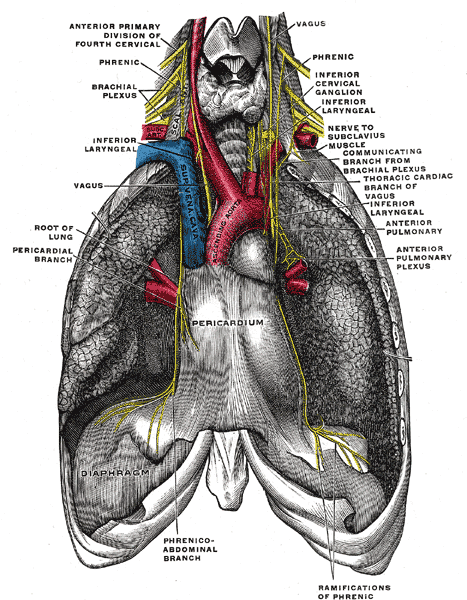

<div class="titlepage">
  <div class="kicker">Клинический справочный материал</div>
  <div class="maintitle">Боль в груди после инвазивного вмешательства на сердце</div>
  <div class="subtitle">Катетерная аблация, ЧКВ, имплантация устройств: маршруты доступа, осложнения по срокам, распознавание на догоспитальном этапе</div>
  <div class="rule"></div>
  <div class="source">Анатомия вмешательства как основа дифференциального диагноза.</div>
  <div class="source">Сроки появления симптома, осложнения по группам вмешательств, объём обследования, доступный выездной бригаде.</div>
  <div class="source src-last">Серия «Крещение поворотом» · версия 1.2 · 16 августа 2026 · CC BY-NC-SA 4.0</div>
</div>

# Клинический случай

Этот вызов с любимым всеми поводом «боль в груди, настороженность на ОКС» поступил нам около половины первого ночи. Пациент, м52 (кстати, итальянец, безбожно мешающий в кучу русскую и родную речь) меньше суток назад выписался из больницы, где проходил процедуру радиочастотной аблации по поводу постоянной формы фибрилляции предсердий. Беспокоить его начала боль в груди довольно неопределённого характера: больно лежать, больно двигаться, больно глубоко вдыхать, больно дотрагиваться до вовлечённых областей, и вообще всё ему «fa male» — больно. Область тоже довольно размытая — от сосков до уха, отдаёт в лопатку, больше с правой стороны, чем с левой. Боли эти начались практически сразу после операции, но ему сказали, что это нормально. Он поверил — что говорит о том, что итальянцы в целом похожи на нас по менталитету. Но на следующий день боли усилились, он терпел весь день (как всегда почему-то) и ночью вызвал скорую.

Согласно выписке, доступ у него был через обе бедренные вены. Интубации не было, процедура выполнялась под местной анестезией.

Объективно: сознание ясное, положение вынужденное — сидит, ложится неохотно, по необходимости. Кожа обычной окраски, тёплая, сухая. Мы щупали его грудь и шею очень внимательно, в какой-то момент нам обоим (что странно, но бывают же массовые помешательства) показалось, что есть крепитация, что-то типа подкожной эмфиземы, но вот это ощущение оказалось невоспроизводимым. Температура 36,9 °С. ЧД 17 в минуту, дыхание проводится с обеих сторон, относительно симметрично, хотя дышал он плохо, и когда его начинали просить дышать поглубже, появлялась ожидаемая асимметрия дыхания, хрипов не было. SpO₂ 99 % на воздухе. ЧСС 74 в минуту, ритм правильный, АД 128/78 мм рт. ст. Шейные вены не набухшие. Тоны сердца ясные. Живот мягкий, безболезненный. Места пункции в обеих бедренных областях без гематом и пульсирующих образований, дистальный пульс сохранён. ЭКГ в 12 отведениях: синусовый ритм, без динамики по сравнению с плёнкой, выданной при выписке.

Пневмоторакс мы ему поставить не смогли: всё-таки с эмфиземой было очень сомнительно, подключичного катетера у него не было, интубации не было — откуда взяться повреждению плевры, непонятно. Да и дыхание мы всё-таки сочли симметричным, хотя и сомневались. Участие обеих половин грудной клетки в акте дыхания тоже наблюдали. На перикардит не тянула ЭКГ. Ну и в целом, кроме вот этих болей, он был совершенно стабилен. Второпях открыв интернет и начитавшись про всякие атриоэзофагеальные фистулы, мы запутались окончательно. Но что-то было не так, несчастного иностранца в любом случае следовало отвезти туда, где ему эту операцию и делали. А там уже предоставить врачам с оборудованием разбираться в этом вопросе.

Разбор случая, данные эхокардиографии из медицинской карты и исход приведены в конце материала.

# Вопросы для размышления

Ответы — в конце материала.

1. Одна и та же запись в выписке — «аблация по поводу аритмии» — может означать вмешательства с совершенно разной анатомией. От чего тогда зависит перечень осложнений, которые стоит держать в голове у такого пациента?
2. Что на вызове информативнее: характер боли или число суток, прошедших после вмешательства?
3. Какие структуры лежат в миллиметрах от задней стенки левого предсердия и какие осложнения из этого соседства вытекают?
4. Какое осложнение аблации самое летальное, в какие сроки оно появляется и с какого симптома чаще всего начинается?
5. Чем различаются осложнения венозного и артериального доступа и какое из них не видно в месте пункции?
6. О чём говорят ритмичные подёргивания в подреберье у пациента с недавно имплантированным стимулятором?
7. Что нужно передать принимающему стационару, чтобы диагностический поиск не начинался там с нуля?

# Почему повод требует отдельного разбора

Число катетерных вмешательств растёт, а длительность госпитализации сокращается: после изоляции лёгочных вен пациент нередко выписывается в первые сутки, после планового чрескожного коронарного вмешательства (ЧКВ) — на следующий день, после имплантации устройства — в течение первых суток. Следствие организационное: осложнение с отсроченным дебютом развивается вне стационара, и первым его видит не оператор, выполнявший процедуру, а выездная бригада.

Спектр возможных осложнений определяется не диагнозом в выписке, а **маршрутом инструмента и типом использованной энергии**. Одна и та же формулировка «аблация по поводу аритмии» описывает вмешательства с принципиально разной анатомией: изоляция лёгочных вен требует пункции межпредсердной перегородки и работы в левом предсердии, аблация каво-трикуспидального перешейка проходит целиком в правых отделах, аблация желудочковой тахикардии нередко выполняется ретроградно через аорту.

Второй определяющий фактор — **интервал между вмешательством и появлением симптома**. Осложнения имеют характерные сроки дебюта, и для большинства из них этот интервал информативнее, чем характер боли: перикардит манифестирует в первые сутки, повреждение электродом устройства — преимущественно в первый месяц, атриоэзофагеальная фистула — на третьей неделе. Сбор анамнеза, в котором зафиксированы дата вмешательства, его вид, тип доступа и тип энергии, определяет дифференциальный ряд точнее, чем любой физикальный признак.

# Что выполняется в рентгеноперационной

## Изоляция лёгочных вен при фибрилляции предсердий

Цель вмешательства — электрическая изоляция устьев лёгочных вен от миокарда левого предсердия. Маршрут инструмента:

```
     бедренная вена (чаще правая, ниже пупартовой связки)
                          │
                  нижняя полая вена
                          │
                  ПРАВОЕ ПРЕДСЕРДИЕ
                          │
        ТРАНССЕПТАЛЬНАЯ ПУНКЦИЯ (овальная ямка)
                          │
                  ЛЕВОЕ ПРЕДСЕРДИЕ ──── ушко левого предсердия
                          │
        устья лёгочных вен: ЛВЛВ · ЛНЛВ · ПВЛВ · ПНЛВ
```

Обозначения устьев: ЛВЛВ — левая верхняя, ЛНЛВ — левая нижняя, ПВЛВ — правая верхняя, ПНЛВ — правая нижняя лёгочная вена.

Применяются три типа энергии, и они различаются профилем осложнений:

| Энергия | Принцип | Особенности профиля осложнений |
|---|---|---|
| **Радиочастотная (РЧ)** | точечное термическое повреждение, аппликации формируют линию | наибольшая доля термических повреждений соседних структур: пищевод, диафрагмальный нерв, вагусное сплетение |
| **Криобаллон** | охлаждение до −40…−50 °С, изоляция вены баллоном | лидирует по повреждению правого диафрагмального нерва; пищеводные фистулы существенно реже, чем при РЧ |
| **Импульсное электрическое поле (PFA)** | необратимая электропорация, преимущественно тканеспецифичная | термические повреждения соседних структур минимальны; частота перикардита сопоставима с РЧ |

## Анатомические соседи левого предсердия

Раздел объясняет большинство специфических осложнений: все они возникают в структурах, лежащих в миллиметрах от зоны аппликации.

```
                     ВПЕРЕДИ
         аорта, ствол лёгочной артерии

   ┌────────────────────────────────────────────────┐
   │                                                │
   │  правый диафрагмальный     левый диафраг-      │
   │  нерв: вдоль ВПВ и         мальный нерв:       │
   │  правой верхней ЛВ         у ушка ЛП и         │
   │                            левой верхней ЛВ    │
   │                                                │
   │            ЛЕВОЕ ПРЕДСЕРДИЕ                    │
   │                                                │
   └────────────────────────────────────────────────┘

        ПИЩЕВОД — по задней стенке предсердия
        околопищеводное вагусное сплетение — рядом
                     СЗАДИ

   митральный перешеек: рядом огибающая артерия
   и коронарный синус
```

Практические следствия анатомии:

- задняя стенка левого предсердия и пищевод разделены слоем ткани, толщина которого у части пациентов не превышает нескольких миллиметров, — отсюда термическое повреждение стенки пищевода вплоть до фистулы;
- правый диафрагмальный нерв проходит непосредственно вблизи правой верхней лёгочной вены, поэтому подавляющее большинство его повреждений происходит при обработке именно этой вены;
- околопищеводные ветви блуждающего нерва иннервируют желудок, и их термическое повреждение проявляется гастропарезом;
- аблация в области митрального перешейка технически ближе всего к огибающей артерии и коронарному синусу, и это независимый предиктор тампонады.

### Диафрагмальный нерв: ход и клиническое значение

Нерв формируется из передних ветвей C3–C5, спускается по передней поверхности передней лестничной мышцы, входит в грудную клетку между подключичной артерией и веной и далее идёт в переднем средостении, между перикардом и медиастинальной плеврой, до диафрагмы. Правый нерв прилежит к латеральной стенке верхней полой вены, затем к правому предсердию, и на этом участке проходит в непосредственной близости к устью правой верхней лёгочной вены — анатомическая основа того, что 84 % его повреждений при криобаллонной изоляции происходит при обработке именно этой вены. Левый нерв огибает дугу аорты, идёт по перикарду над левым желудочком, вблизи ушка левого предсердия и левой верхней лёгочной вены.

Нерв смешанный. Двигательные волокна — единственная моторная иннервация диафрагмы, поэтому повреждение даёт паралич купола: одышка в положении лёжа, высокое стояние купола на рентгенограмме. Чувствительные волокна идут от перикарда, медиастинальной и диафрагмальной плевры и от центральной части диафрагмы; их раздражение проецируется в дерматомы C3–C5 — шея, надплечье, область трапециевидного гребня. Этим объясняется характерная иррадиация при перикардите и при раздражении диафрагмальной плевры, разобранная ниже.

<figure class="portrait">
  
  <figcaption>Диафрагмальный нерв и его отношения с блуждающим нервом, вид спереди. Видны формирование из передних ветвей C3–C5, вход в грудную клетку, ход в средостении по перикарду, перикардиальная ветвь, разветвление на диафрагме и диафрагмально-брюшные ветви; рядом — блуждающий нерв с возвратным гортанным и сердечными ветвями. Обратите внимание на ход правого нерва по латеральной стенке верхней полой вены и правого предсердия — именно этот участок объясняет преобладание правосторонних повреждений при изоляции правой верхней лёгочной вены. Источник: Gray’s Anatomy, план 806, издание 1918 года, public domain.</figcaption>
</figure>

## Вмешательства в правых отделах

Аблация каво-трикуспидального перешейка при типичном трепетании предсердий выполняется в правом предсердии, в области между нижней полой веной и кольцом трикуспидального клапана. Транссептальная пункция не требуется, левое предсердие не инструментируется — следовательно, пищеводные и диафрагмальные осложнения для этого вмешательства неактуальны. Вблизи зоны аппликации проходят правая коронарная артерия и, при аблации медиальнее, компактный атриовентрикулярный узел: последнее определяет риск атриовентрикулярной блокады.

## Аблация желудочковых тахикардий

При левожелудочковой локализации субстрата доступ нередко **артериальный, ретроградный через бедренную артерию и аорту**. Это меняет дифференциальный ряд: добавляются осложнения артериального доступа, ретроградного проведения инструмента через аортальный клапан и системная эмболия.

## Чрескожное коронарное вмешательство

```
  РАДИАЛЬНЫЙ ДОСТУП                    БЕДРЕННЫЙ ДОСТУП
  радиальная артерия                   общая бедренная артерия
        │                                    │
  плечевая → подмышечная                наружная подвздошная
        │                                    │
  подключичная → дуга аорты            брюшная аорта → дуга
        │                                    │
        └──────── устья коронарных артерий ──┘
                          │
              ЛКА (ПМЖВ, ОВ) · ПКА
```

Ключевые технические точки, определяющие осложнения доступа: пункция бедренной артерии **выше** пупартовой связки открывает путь кровотечению в забрюшинное пространство, где компрессия неэффективна; пункция ниже бифуркации способствует формированию ложной аневризмы и артериовенозной фистулы.

## Имплантация электрокардиостимулятора и кардиовертера-дефибриллятора

```
   пункция подключичной или подмышечной вены
                    │
            верхняя полая вена
                    │
         ПРАВОЕ ПРЕДСЕРДИЕ ── электрод предсердия
                    │
         ПРАВЫЙ ЖЕЛУДОЧЕК ── электрод желудочка
                              (верхушка или перегородка)

   альтернатива доступа: выделение цефалической вены

   корпус устройства — в ложе под кожей или под большой
   грудной мышцей в подключичной области

   при трёхкамерной системе третий электрод проводится
   через коронарный синус к вене боковой стенки
   левого желудочка
```

Подключичная пункция выполняется в непосредственной близости к куполу плевры — отсюда пневмоторакс как осложнение самого доступа. Продвижение электрода к верхушке правого желудочка, стенка которого тоньше левожелудочковой, определяет риск перфорации с развитием гемоперикарда либо со стимуляцией диафрагмы.

# Осложнения по срокам появления симптома

Таблица построена по признаку, доступному бригаде: сколько времени прошло от вмешательства. Частоты приведены по регистрам и консенсусным документам (ссылки — в разделе «Источники»).

| Срок | Осложнение | Частота | Что заставляет думать |
|---|---|---|---|
| Часы, первые сутки | Тампонада сердца (аблация) | 0,4–1,3 % | Гипотензия, набухшие шейные вены, глухие тоны, парадоксальный пульс |
| Часы, первые сутки | Пневмоторакс (имплантация устройства) | 0,4–2,8 % | Боль, одышка, асимметрия дыхания на стороне имплантации |
| Часы, первые сутки | Кровотечение и гематома доступа | венозный доступ при аблации 1–4 %; бедренный артериальный 2–12 % | Локальная припухлость, пульсирующее образование, шум над областью пункции |
| Часы — 30 суток | Тромбоз стента (ЧКВ) | редко; острый до 24 ч, подострый до 1 месяца | Картина ОКС, чаще с подъёмом ST; летальность высокая |
| 1–5 суток | Постаблационный перикардит | 3,4–10,2 % | Плевритическая боль, усиление лёжа, облегчение сидя; медиана дебюта — 1 сутки после РЧА, 4 суток после PFA |
| 1–5 суток | Дислокация электрода устройства | 1,2–3,3 % | Возврат симптомов аритмии, нарушение стимуляции; чаще 1–2-е сутки |
| 1–30 суток | Перфорация электродом, подострая | 0,1–1,5 % | Боль, стимуляция диафрагмы, шум трения, нарушение захвата |
| До 30 суток и позже | Отсроченная тампонада | около 0,2 % | Нарастающая слабость, гипотензия при внешне спокойном течении |
| 1–4 недели | **Атриоэзофагеальная фистула** | 0,02–0,25 % | **Лихорадка**, боль в груди, одинофагия, неврологическая симптоматика; медиана дебюта 18 суток |
| 1–4 недели | Синдром постповреждения сердца | входит в 3,7–10 % | Плевритическая боль, лихорадка, плевральный выпот, инфильтраты в лёгких |
| Недели | Инфекция ложа устройства | 0,6–3,4 % | Локальная болезненность, гиперемия, флюктуация, лихорадка |
| Недели — месяцы | Гастропарез (вагусное сплетение) | редко | Тошнота, рвота, раннее насыщение, боль в эпигастрии |
| Месяцы | Стеноз лёгочных вен | < 1–2 % | Одышка при нагрузке, кашель, кровохарканье, рецидивирующие «пневмонии» |
| Месяцы — годы | Поздний и очень поздний тромбоз стента | около 0,6 % в год | Картина ОКС у пациента с прекращённой антиагрегантной терапией |

# Разбор ключевых осложнений

## Тампонада сердца и отсроченная тампонада

Механизм: перфорация тонкостенных структур — ушка предсердия, области транссептальной пункции, зоны аппликации; при работе в правом желудочке — перфорация электродом. Кровь поступает в полость перикарда; критично не абсолютное количество, а темп накопления, поскольку нерастянутый перикард при быстром поступлении становится неподатливым уже при небольшом объёме.

Частота тампонады при аблации фибрилляции предсердий — 0,4–1,3 % по консенсусному документу 2024 года; в современных когортах 0,64–0,68 %. Около пятой части случаев приходится на отсроченные формы, а среди фатальных исходов, связанных с процедурой, тампонада составляет примерно четверть, причём каждый восьмой такой случай регистрируется позднее 30 суток после вмешательства. Дренирование выполняется в подавляющем большинстве случаев перикардиоцентезом, к хирургическому вмешательству прибегают редко.

Физикальные признаки: гипотензия, набухшие шейные вены, глухие тоны, парадоксальный пульс (снижение систолического давления более чем на 10 мм рт. ст. на вдохе), тахикардия. Существенная оговорка: **тахикардия может отсутствовать**. Пациент после аблации по поводу аритмии, как правило, получает бета-адреноблокатор или антиаритмический препарат, что ограничивает хронотропный ответ; кроме того, растяжение стенок и раздражение механорецепторов при гемоперикарде запускают вагусные рефлекторные реакции с брадикардией. Отсутствие ускорения ритма при гипотензии у такого пациента не снижает вероятность тампонады, а повышает настороженность.

Тактика бригады: венозный доступ, кислород по показаниям, положение с приподнятым головным концом, экстренная эвакуация с предупреждением стационара; инфузионная поддержка носит характер временной меры, поскольку решает вопрос только дренирование.

## Постаблационный перикардит и синдром постповреждения сердца

Механизм: воспалительная реакция перикарда на термическое или электропорационное повреждение прилежащего миокарда. Частота по данным крупных центров — от 3,4 до 10,2 %; при аблации импульсным полем 4,3 %, что сопоставимо с радиочастотной. Медиана дебюта симптомов — первые сутки после радиочастотной аблации и около четырёх суток после импульсной.

Клиническая картина: плевритическая боль, наиболее ранний и самый частый симптом; усиление в положении лёжа и на вдохе, облегчение в положении сидя с наклоном вперёд. Иррадиация в шею и область трапециевидного гребня объясняется иннервацией перикарда диафрагмальным нервом (корешки C3–C5) и относится к наиболее специфичным признакам перикардита. Шум трения перикарда выслушивается непостоянно, лучше — в положении сидя с наклоном вперёд, на выдохе.

Два свойства этого состояния определяют диагностические ошибки:

- **выпот в перикарде для диагноза не требуется и в большинстве случаев отсутствует.** Среди пациентов с клинически диагностированным постаблационным перикардитом новый выпот выявляется примерно в 9 %, изменения ЭКГ — в 20–60 % случаев. Заключение эхокардиографии «жидкость в полости перикарда не визуализируется» исключает тампонаду, но не исключает перикардит: диагноз клинический;
- при синдроме постповреждения сердца в клинической картине присутствуют лихорадка (около трёх четвертей описанных случаев), плевральный выпот и **инфильтраты в лёгких почти у трети**, что регулярно трактуется как пневмония; антибактериальная терапия в таких случаях эффекта не даёт, состояние отвечает на противовоспалительное лечение.

Диффузный подъём сегмента ST с депрессией сегмента PR и умеренное повышение тропонина при перикардите имитируют острый коронарный синдром. На догоспитальном этапе разграничение по одной плёнке невозможно, и тактика определяется в пользу более опасного диагноза.

## Атриоэзофагеальная фистула

Наиболее летальное осложнение аблации и главная причина, по которой пациента, обратившегося в течение месяца после вмешательства, нельзя оценивать вне связи с процедурой.

Механизм: термическое повреждение стенки пищевода, прилежащей к задней стенке левого предсердия, с формированием язвы и последующим сообщением между пищеводом и предсердием. Через дефект в системный кровоток поступают воздух и содержимое пищевода — отсюда воздушная эмболия, инсульт и сепсис.

Данные международного регистра POTTER-AF (553 729 процедур): частота 0,025 % в целом, при радиочастотной аблации 0,038 %, при криобаллонной 0,0015 %. Медиана времени до первых симптомов — 18 суток (интерквартильный интервал 8–25; диапазон от 0 до 60 суток), до постановки диагноза — 21 сутки. Первым симптомом чаще всего оказывается **лихорадка** — 59 % случаев; боль и одинофагия — 54 %; неврологическая симптоматика — 44 %, а по данным систематического обзора клинических наблюдений — до 75 %. Диагноз устанавливается компьютерной томографией груди в 80 % случаев, при этом первичное исследование оказывается неизменённым примерно у четверти пациентов. Общая летальность 65,8 %, при консервативном лечении — до 89,5 %.

Практические положения для догоспитального этапа:

- лихорадка, боль при глотании или неврологический эпизод в течение двух месяцев после аблации левого предсердия требуют рассмотрения фистулы в первую очередь, а не диагноза острой респираторной инфекции;
- сочетание лихорадки с очаговой неврологической симптоматикой у такого пациента укладывается в воздушную эмболию;
- на этапе подозрения избегают манипуляций, повышающих давление в пищеводе: установки назогастрального зонда, а в стационаре — эндоскопии с инсуффляцией воздуха;
- эвакуация экстренная, предпочтительно в центр, где выполнялось вмешательство, с прямым информированием о характере подозрения: диагностический путь здесь начинается с компьютерной томографии, а не с приёмного отделения общего профиля.

## Повреждение диафрагмального нерва

Механизм: термическое, чаще холодовое, повреждение правого диафрагмального нерва при обработке правой верхней лёгочной вены. По данным регистра YETI (17 356 пациентов, криобаллонная изоляция) частота периоперационного повреждения составляет 4,2 %, причём в 84 % случаев оно возникает при обработке именно правой верхней вены. Более половины повреждений разрешаются до конца процедуры, 97 % — в течение 12 месяцев; стойкое повреждение отмечается у 0,1 %, стойкое и симптомное — у 0,06 % пациентов.

Клиническая картина: одышка при нагрузке и в положении лёжа, икота, боль в правом надплечье; при рентгенографии — высокое стояние купола диафрагмы. Для догоспитального этапа значение раздела в основном дифференциальное: наличие правостороннего плечевого и шейного болевого синдрома после аблации правых лёгочных вен имеет объяснение, не требующее экстренного вмешательства, но требующее документирования и консультации оператора.

## Повреждение околопищеводного вагусного сплетения

Механизм: термическое повреждение ветвей блуждающего нерва, идущих вдоль пищевода к желудку. Проявляется гастропарезом: тошнота, рвота, раннее насыщение, боль и вздутие в эпигастрии в течение недель после вмешательства. Состояние доброкачественное и обратимое, однако его клиническая картина полностью перекрывается с началом атриоэзофагеальной фистулы, поэтому появление на этом фоне лихорадки меняет трактовку.

## Стеноз лёгочных вен

Механизм: рубцовое сужение устья вены после аппликаций внутри неё. Современная техника аблации выполняется в антральной зоне, что сделало осложнение редким. Дебют отсроченный, месяцы: одышка при нагрузке, кашель, кровохарканье, повторные эпизоды, трактуемые как пневмония. Значение для бригады: пациент с одышкой и кровохарканьем в анамнезе с аблацией лёгочных вен требует упоминания этого факта при передаче — иначе диагностический поиск идёт по стандартному пути между пневмонией и тромбоэмболией.

## Инсульт и воздушная эмболия

Механизмы: тромбоэмболия из зоны аппликации или из левого предсердия при недостаточной антикоагуляции; воздушная эмболия через транссептальный интродьюсер; при атриоэзофагеальной фистуле — поступление воздуха из пищевода. Частота острых церебральных событий при аблации фибрилляции предсердий — порядка 0,1 % и ниже.

Особенность распознавания: у пациента после вмешательства неврологический дефицит часто трактуется как последствие седации или общей слабости. Для клинической оценки применяется тот же порядок, что при любом подозрении на инсульт, включая обязательное определение глюкозы крови как единственного немедленно устранимого имитатора.

## Осложнения доступа

| Осложнение | Доступ | Клиническая картина |
|---|---|---|
| Гематома | любой | Припухлость, болезненность; при бедренном артериальном доступе частота 2–12 % |
| Ложная аневризма | артериальный | Пульсирующее образование, систолический шум; бедренная 0,05–8 %, радиальная 0,02–0,09 % |
| Артериовенозная фистула | артериальный | Непрерывный шум над областью пункции |
| **Забрюшинная гематома** | бедренный артериальный | Боль в спине, боку, животе; гипотензия и анемизация **без видимой наружной гематомы**; частота 0,025–0,9 %, летальность существенно выше остальных осложнений доступа |
| Окклюзия радиальной артерии | радиальный | Отсутствие пульса, обычно без ишемии кисти за счёт коллатералей; частота 1–10 % |
| Тромбоз подключичной вены | имплантация устройства | Отёк и цианоз руки на стороне устройства, расширение подкожных вен |

Забрюшинная гематома заслуживает отдельного внимания: это единственное осложнение доступа, которое проявляется гиповолемией при полностью спокойном виде места пункции, и его следует предполагать у любого пациента с гипотензией в первые сутки после бедренного артериального доступа.

## Осложнения, специфичные для ЧКВ

**Тромбоз стента** классифицируется по срокам: острый — в первые 24 часа, подострый — от суток до месяца, поздний — от месяца до года, очень поздний — позднее года. Клинически проявляется картиной острого коронарного синдрома, чаще с подъёмом сегмента ST, летальность высока. Ключевой элемент анамнеза — приём двойной антиагрегантной терапии: самостоятельное прекращение приёма или пропуск связаны с резким возрастанием риска, и этот вопрос задаётся прямо.

**Перфорация коронарной артерии** с гемоперикардом и тампонадой развивается интраоперационно либо в ближайшие часы. **Контраст-ассоциированное острое повреждение почек** манифестирует на 2–3-и сутки и к болевому синдрому отношения не имеет, но объясняет слабость и уменьшение диуреза у пациента, обратившегося в эти сроки.

## Осложнения, специфичные для имплантированных устройств

**Пневмоторакс** — следствие пункции подключичной вены; частота 0,4–2,8 %, дренирование требуется примерно в 0,7 % случаев. Проявляется в первые часы, однако описаны и отсроченные случаи, в том числе у пациентов, использующих аппараты неинвазивной вентиляции.

**Перфорация электродом** делится на острую (до 24 часов), подострую (от суток до месяца, чаще 5–29-е сутки) и хроническую (позднее месяца). Признаки, помимо боли: **стимуляция диафрагмы** — ритмичные сокращения, синхронные с работой устройства, шум трения перикарда, нарушение навязывания ритма. Нормальные параметры стимуляции и импеданса перфорацию не исключают.

**Дислокация электрода** возникает преимущественно в первые двое суток, но описана до 120-х суток; проявляется возвратом исходной симптоматики и нарушением стимуляции на ЭКГ.

**Инфекция ложа** развивается в сроки от недель до месяцев: локальная болезненность, гиперемия, флюктуация, лихорадка; при вовлечении электродов — картина инфекционного эндокардита. **Синдром Твиддлера** — смещение электродов вследствие вращения корпуса устройства пациентом в ложе.

## Причины, не связанные с процедурой

Боль в груди у пациента после вмешательства нередко имеет внепроцедурное происхождение, и эти причины остаются в дифференциальном ряду:

- **скелетно-мышечная боль** после многочасового вынужденного положения на столе с фиксированными руками; воспроизводится пальпацией, усиливается при движениях, наиболее часто в области грудино-ключичных сочленений и межрёберных мышц;
- **гастроэзофагеальный рефлюкс**, в том числе на фоне термического раздражения пищевода;
- **острый коронарный синдром** обычного, непроцедурного генеза — пациент с аритмией и ожирением, как правило, имеет и коронарный атеросклероз;
- **тромбоэмболия лёгочной артерии** — гиподинамия в дни после вмешательства, пункция вен, сопутствующие факторы;
- **тревожное расстройство**, распространённое после кардиологических вмешательств; принимается во внимание только после исключения перечисленного выше.

# Осмотр, доступный выездной бригаде

Ни одно из перечисленных осложнений не диагностируется на догоспитальном этапе окончательно. Задача осмотра — разделить состояния, требующие экстренной эвакуации в специализированный центр, и состояния, допускающие плановый маршрут, а также передать принимающей стороне набор находок, сокращающий диагностический путь.

| Приём | Находка | Интерпретация |
|---|---|---|
| Осмотр шейных вен | Набухание в положении полусидя | Повышенное давление в правых отделах: тампонада, тромбоз, правожелудочковая недостаточность |
| Измерение АД на вдохе и выдохе | Снижение систолического > 10 мм рт. ст. на вдохе | Парадоксальный пульс: тампонада |
| Аускультация сидя с наклоном вперёд | Шум трения перикарда | Перикардит; непостоянен, отсутствие шума диагноз не снимает |
| АД на обеих руках | Разница более 15–20 мм рт. ст. | Аргумент в пользу поражения аорты; при радиальном доступе учитывают возможную окклюзию артерии |
| Сравнительная аускультация и перкуссия | Асимметрия дыхания на стороне имплантации | Пневмоторакс, гемоторакс |
| Осмотр и пальпация места пункции | Гематома, пульсирующее образование, шум | Осложнение доступа |
| Пальпация живота и боковых областей | Болезненность, притупление, гипотензия без наружной гематомы | Забрюшинная гематома |
| Термометрия | Лихорадка в течение двух месяцев после аблации ЛП | Атриоэзофагеальная фистула, синдром постповреждения сердца, инфекция устройства |
| Неврологический осмотр, глюкометрия | Очаговый дефицит, спутанность | Эмболия, в том числе воздушная; гипогликемия как устранимый имитатор |
| Наблюдение за грудной стенкой | Ритмичные сокращения диафрагмы, синхронные со стимуляцией | Перфорация или дислокация электрода |
| ЭКГ в 12 отведениях | Диффузный подъём ST с депрессией PR | Перикардит; при локальных изменениях — коронарное событие |
| Пальпация грудной стенки | Полное воспроизведение боли | Скелетно-мышечный компонент; сопутствующий перикардит не исключает |

# Особенности интерпретации у этой группы пациентов

- Бета-адреноблокатор или антиаритмический препарат ограничивает хронотропный ответ: нормальная частота сердечных сокращений при гипотензии или кровопотере не является успокаивающим признаком. Информативна разница с привычной для пациента частотой, а не расстояние до формальной границы тахикардии.
- Отсутствие выпота в перикарде исключает тампонаду, но не перикардит: при клинически диагностированном постаблационном перикардите выпот выявляется примерно у одного пациента из одиннадцати, а изменения ЭКГ — у 19,5–60 %. Неизменённая плёнка работает против коронарного события, а не против перикардита.
- Нормальная эхокардиограмма не исключает расслоения аорты: чувствительность трансторакального исследования для проксимального расслоения составляет порядка трёх четвертей, метод верификации — компьютерная томография с контрастированием.
- Нормальные параметры стимуляции не исключают перфорации электродом.
- Лихорадка в течение месяца после аблации левого предсердия рассматривается как симптом осложнения вмешательства до момента его исключения; первичная компьютерная томография у четверти пациентов с фистулой оказывается неизменённой, что не отменяет диагноза при сохраняющемся клиническом подозрении.
- Инфильтраты в лёгких и лихорадка после аблации могут отражать синдром постповреждения сердца, а не пневмонию, и в этом случае не отвечают на антибактериальную терапию.
- Серийные эхокардиограммы сравнивают по факту наличия или отсутствия выпота, а не по значению фракции выброса: межоператорская вариабельность метода составляет несколько процентов, и разница в 2–3 % между двумя исследованиями динамики не отражает.

# Маршрут и передача

Пациента с болью в груди после инвазивного вмешательства целесообразно эвакуировать в стационар, где вмешательство выполнялось: там доступны исходные данные процедуры, ангиограммы и протоколы, а оператор способен оценить вероятность специфического осложнения за минуты. При признаках тампонады, подозрении на фистулу или на тромбоз стента маршрут определяется как экстренный в центр с рентгеноперационной и кардиореанимацией.

Содержание передачи, сокращающее диагностический путь:

- вид вмешательства, дата и тип доступа, тип энергии, если известен;
- интервал между вмешательством и появлением симптома;
- характер боли и её зависимость от положения тела, воспроизводимость пальпацией;
- наличие или отсутствие лихорадки, одинофагии, неврологической симптоматики;
- состояние шейных вен, парадоксальный пульс, АД на обеих руках;
- состояние места пункции и данные осмотра живота;
- принимаемые препараты, отдельно — двойная антиагрегантная терапия и антикоагулянты, факт пропуска приёма;
- сравнение с ЭКГ, выданной при выписке.

Симптоматическое лечение на этапе эвакуации проводится в соответствии с действующими Алгоритмами оказания скорой и неотложной медицинской помощи города Москвы.

# Возвращение к клиническому случаю

Интервал — вторые сутки после радиочастотной аблации в левом предсердии. Это исключает по срокам атриоэзофагеальную фистулу как первоочередную версию (медиана дебюта 18 суток, при этом самые ранние случаи описаны с первых суток, поэтому появление лихорадки изменит трактовку) и делает маловероятным стеноз лёгочных вен, дебютирующий месяцами позже.

Гемодинамика стабильна, шейные вены не набухшие, тоны ясные — данных за тампонаду нет. Доступ венозный бедренный: инструментирование аорты не выполнялось, места пункции спокойны, дистальный пульс сохранён, живот безболезненный — осложнения артериального доступа и забрюшинное кровотечение маловероятны. Дыхание проводится с обеих сторон, SpO₂ 99 % на воздухе — против пневмоторакса, который к тому же не характерен для этого типа доступа.

Характер боли складывается в перикардиальный: усиление в положении лёжа, облегчение в положении сидя, иррадиация в шею и лопатку, соответствующая иннервации перикарда диафрагмальным нервом, усиление на глубоком вдохе. Срок дебюта — первые часы — совпадает с медианой дебюта постаблационного перикардита после радиочастотной аблации. Воспроизводимость боли при пальпации перикардит не исключает: после многочасового вынужденного положения на столе скелетно-мышечный компонент присутствует у значительной части пациентов и наслаивается на перикардиальную боль. Правосторонняя локализация с иррадиацией в шею дополнительно допускает раздражение правого диафрагмального нерва, проходящего вблизи правой верхней лёгочной вены.

Итоговая формулировка для передачи: вторые сутки после радиочастотной аблации левого предсердия, болевой синдром перикардиального характера при стабильной гемодинамике, признаков тампонады нет, лихорадки нет, очаговой неврологической симптоматики нет, ЭКГ без динамики к плёнке при выписке; целесообразна эвакуация в стационар, выполнявший вмешательство, для эхокардиографии, оценки маркёров воспаления и решения о противовоспалительной терапии.

## Разбор решений бригады

**«На перикардит не тянула ЭКГ».** Это единственное место, где рассуждение уходит в сторону, и уходит закономерно: диффузный подъём ST с депрессией PR описан в учебниках как признак перикардита, поэтому его отсутствие читается как аргумент против диагноза. Данные говорят обратное: при клинически диагностированном постаблационном перикардите изменения ЭКГ выявляются у 19,5–60 % пациентов, то есть у большинства плёнка нормальная или неотличима от прежней. Диагноз здесь клинический и строится на характере боли и её зависимости от положения тела; ЭКГ и эхокардиография в нём нужны для другого — исключить коронарное событие и тампонаду. Правило короткое: **нормальная ЭКГ снимает подозрение на инфаркт, но не снимает перикардит.**

**Крепитация, которая не воспроизвелась.** Ощущение подкожной эмфиземы у пациента после аблации левого предсердия — находка не рядовая, и настороженность была уместной: воздух в мягких тканях шеи означал бы пневмомедиастинум, а его источниками в этой ситуации служат перфорация пищевода и атриоэзофагеальная фистула, то есть самое летальное осложнение вмешательства. Что делает эту версию неправдоподобной здесь: нормальная температура, отсутствие одинофагии и неврологической симптоматики, стабильность в течение двух суток и срок — медиана дебюта фистулы 18 суток. Правильный вывод из невоспроизводимой находки — не строить на ней диагноз, но и не молчать о ней: одна фраза в передаче («пальпаторно казалась крепитация, при повторном осмотре не подтвердилась») стоит того, чтобы в приёмном отделении посмотрели шею и средостение целенаправленно.

**Асимметрия дыхания на глубоком вдохе.** Она объясняется самой болью: пациент щадит болезненную сторону, экскурсия уменьшается, дыхание выслушивается хуже. Это не находка в пользу пневмоторакса, а следствие того же плевритического компонента. Различает их не аускультация на глубоком вдохе, а совокупность: перкуторный звук, положение трахеи, шейные вены, гемодинамика и SpO₂ — здесь всё это было в норме.

**Отказ от диагноза пневмоторакса по механизму — верно.** Бригада рассудила от анатомии: не было ни подключичной пункции, ни интубации, доступ венозный бедренный, значит и путь воздуха в плевральную полость взяться неоткуда. Это ровно тот способ рассуждения, которому посвящён весь материал: спектр осложнений задаётся маршрутом инструмента, а не поводом к вызову.

**Решение эвакуировать в центр, выполнявший вмешательство, — верно, и оно не требовало установленного диагноза.** Задача догоспитального этапа здесь не в том, чтобы выбрать между перикардитом, повреждением диафрагмального нерва и скелетно-мышечной болью, а в том, чтобы не пропустить состояние, требующее рентгеноперационной, и доставить пациента туда, где есть протокол процедуры, исходные снимки и оператор. Формулировка «что-то не так, пусть разбираются те, у кого есть оборудование» с точки зрения маршрутизации безупречна; недостаёт ей только структурированной передачи — перечень того, что стоит сказать принимающей стороне, приведён выше в разделе «Маршрут и передача».

## Эхокардиография из медицинской карты

В карте пациента доступны два протокола эхокардиографии — подробный и краткий, выполненные на аппаратах разных производителей. Датировка в выдержках отсутствует, поэтому какое из исследований раньше, из самих протоколов не следует; для разбора существеннее не порядок, а то, что каждая строка позволяет и не позволяет утверждать.

| Показатель | Подробный протокол (Philips EPIQ 7) | Краткий протокол (аппарат GE) |
|---|---|---|
| Аорта | Корень 31 мм, восходящая часть 30 мм (норма до 40 мм), стенки незначительно уплотнены | Атеросклеротические изменения корня |
| Отслоённый лоскут | Не описан | Не описан |
| Аортальный клапан | Три створки, уплотнены, раскрытие удовлетворительное; **регургитация не выявлена**; Vmax 1,3 м/с, максимальный градиент 7 мм рт. ст.; обструкции выносящего тракта нет | Не описан |
| Перикард | **Жидкость отсутствует** | **Жидкость не визуализируется** |
| Нижняя полая вена | 17 мм (норма < 21 мм), на вдохе спадается более 50 % | Не описана |
| Левый желудочек: объёмы | КДО 110 мл, КСО 53 мл, УО 57 мл, ФВ 52 % (Simpson) | КДО 106 мл, КСО 53 мл, УО 53 мл, ФВ 50 % |
| Геометрия левого желудочка | МЖП 13–14 мм, задняя стенка 11 мм, индекс массы миокарда 108 г/м², относительная толщина стенок 0,45 — концентрическое ремоделирование | Нарушений глобальной и локальной сократимости нет |
| Левое предсердие | 35 мм, объём 60 мл, индексированный объём 27 мл/м² (норма ≤ 34) | Не описано |
| Правые отделы | Базальный размер ПЖ 37 мм, TAPSE 23 мм, СДЛА ≈ 23 мм рт. ст., признаков лёгочной гипертензии нет | Лёгочной гипертензии нет |
| Клапанные регургитации | Митральная 1 степени, трикуспидальная 1 степени, лёгочная 1 степени | Не описаны |
| Диастолическая функция | Трансмитральное соотношение E/A 1,4 | Не описана |
| Антропометрия в протоколе | 176 см, 106 кг, ППТ 2,21 м², ИМТ 34,2 кг/м² | 175 см, 107 кг, ППТ 2,21 м², ИМТ 34,9 кг/м² |

**Перикард.** Отсутствие жидкости в обоих исследованиях исключает тампонаду и гемоперикард — и не исключает постаблационный перикардит, диагноз которого клинический: новый выпот выявляется примерно у одного пациента из одиннадцати. Строка про перикард здесь закрывает опасное состояние и не закрывает вероятное.

**Расслоение аорты.** Это тот пункт, по которому эхокардиографию обычно и цитируют, поэтому вес каждой строки стоит развести.

| Строка протокола | Что это за признак | Сколько весит |
|---|---|---|
| Лоскут не описан | Единственный прямой признак | Чувствительность трансторакального исследования для вовлечения восходящей аорты 77–80 %, специфичность 93–96 % (ESC, 2014): примерно каждый пятый случай пропускается |
| Аортальной регургитации нет | Косвенный: при типе A регургитация встречается у 40–76 % | Существенно снижает вероятность, но сама по себе диагноз не снимает |
| Жидкости в перикарде нет | Косвенный | Как «исключатель» почти бесполезен: гемоперикард есть примерно у пятой части пациентов с типом A |
| Корень 31 мм, восходящая 30 мм | Косвенный | По данным IRAD средний диаметр при типе A — 5,3 см, но у 59 % он был меньше 5,5 см, а у 40 % — меньше 5,0 см. Нормальный диаметр расслоение не исключает |
| Уплотнение корня и восходящей аорты | Атеросклероз | К расслоению отношения не имеет; строка регулярно читается как тревожная и таковой не является |
| НПВ 17 мм, спадение более 50 % | К расслоению не относится | Это про давление наполнения и физиологию тампонады |

Механизмы аортальной регургитации при расслоении объясняют, почему её отсутствие информативно: расширение корня и кольца лишает створки смыкания; лоскут отрывает створку или комиссуру от стенки, давая пролапс; сам лоскут в диастолу пролабирует через клапан. Все три требуют вовлечения корня — то есть того самого типа A, который при двух сутках стабильной гемодинамики и так неправдоподобен.

Формально трансторакальное исследование расслоение не исключает: в рекомендациях ESC прямо указано, что оно не может быть единственным методом при подозрении на острый аортальный синдром, и вопрос закрывает компьютерная томография с контрастированием. Закрывают версию в этом случае не строки протокола, а механизм и течение: доступ венозный, аорту инструментом не проходили вовсе, а нелеченый острый тип A убивает порядка 1–2 % пациентов в час в первые двое суток — двое суток стабильной гемодинамики с болью, воспроизводимой пальпацией, в это течение не укладываются.

**Фракция выброса 52 % и 50 %.** Разница между двумя исследованиями лежит внутри воспроизводимости метода и никакой динамики не означает. Серийные эхокардиограммы у такого пациента сравнивают по появлению или отсутствию выпота, а не по значению фракции выброса.

**Правые отделы.** TAPSE 23 мм, СДЛА 23 мм рт. ст., нормальный базальный размер правого желудочка — против гемодинамически значимой тромбоэмболии лёгочной артерии, которая при таком объёме поражения давала бы перегрузку правых отделов. Немассивную тромбоэмболию нормальная эхокардиограмма не исключает.

**Чего в этих протоколах нет и быть не может.** Атриоэзофагеальную фистулу эхокардиография не показывает — это компьютерная томография груди. Стеноз лёгочных вен трансторакально не оценивается. Перикардит, как сказано выше, клинический диагноз. То есть ни одно из трёх осложнений, за которыми у этого пациента следят по срокам, эхокардиографией не снимается.

**Что протоколы объясняют дополнительно.** Концентрическое ремоделирование левого желудочка с индексом массы миокарда 108 г/м², уплотнение створок и индекс массы тела 34 кг/м² — это субстрат фибрилляции предсердий, по поводу которой и выполнялась аблация. Индексированный объём левого предсердия при этом нормальный (27 мл/м²), что для исхода аблации прогностически благоприятно.

## Исход

На момент выпуска этой версии материала окончательный диагноз неизвестен: пациент передан в стационар, выполнявший вмешательство, результат наблюдения и заключительный диагноз ещё не получены. Исход будет добавлен отдельным разделом в следующей версии, с указанием даты — включая тот случай, если он разойдётся с изложенной здесь рабочей версией. Материал написан так, чтобы его ценность не зависела от того, чем закончилось: разбирается порядок рассуждения при боли в груди после вмешательства, а не угадывание диагноза одного пациента.

# Резюме

- Дифференциальный ряд после кардиологического вмешательства определяется маршрутом инструмента и типом энергии, а не формулировкой диагноза в выписке: венозный доступ и работа в левом предсердии, артериальный ретроградный доступ и имплантация устройства дают три разных набора осложнений.
- Интервал от вмешательства до симптома — основной диагностический инструмент догоспитального этапа: перикардит дебютирует в первые сутки, перфорация электродом преимущественно в первый месяц, атриоэзофагеальная фистула — на третьей неделе, стеноз лёгочных вен — месяцами позже.
- Тампонада возможна при нормальной частоте сердечных сокращений: бета-адреноблокатор и вагусные рефлексы ограничивают тахикардический ответ.
- Отсутствие выпота в перикарде исключает тампонаду, но не перикардит; неизменённая ЭКГ не исключает его тем более: изменения плёнки есть лишь у 19,5–60 % пациентов. Диагноз перикардита клинический.
- Лихорадка в течение месяца после аблации левого предсердия — симптом осложнения вмешательства до момента исключения фистулы; при подозрении избегают повышения давления в пищеводе и информируют центр, выполнявший процедуру.
- Гипотензия в первые сутки после бедренного артериального доступа при спокойном месте пункции требует исключения забрюшинного кровотечения.
- Стимуляция диафрагмы у пациента с имплантированным устройством — признак смещения или перфорации электродом, в том числе при нормальных параметрах стимуляции.
- Скелетно-мышечная боль и воспроизводимость боли при пальпации распространены после многочасового вмешательства и не исключают перикардиальную природу болевого синдрома.

# Ответы на вопросы для размышления

**1.** От маршрута инструмента и типа использованной энергии. Изоляция лёгочных вен — это венозный доступ, транссептальная пункция и работа в левом предсердии, поэтому в перечень входят пищевод, диафрагмальные нервы, околопищеводное вагусное сплетение, огибающая артерия и коронарный синус. Аблация каво-трикуспидального перешейка идёт целиком в правых отделах: пищеводных и диафрагмальных осложнений там нет, зато рядом правая коронарная артерия и компактный атриовентрикулярный узел. Аблация желудочковой тахикардии нередко выполняется ретроградно через аорту — добавляются осложнения артериального доступа, проведение инструмента через аортальный клапан и системная эмболия. Энергия меняет профиль внутри одной и той же процедуры: радиочастотная даёт больше термических повреждений соседних структур, криобаллон лидирует по повреждению правого диафрагмального нерва, импульсное поле почти лишено термических осложнений, но перикардит даёт с той же частотой.

**2.** Чаще — число суток. У осложнений характерные сроки: тампонада, пневмоторакс и кровотечение из места доступа — часы и первые сутки; перикардит — 1–5 суток; дислокация электрода — преимущественно первые двое суток; перфорация электродом — первый месяц; атриоэзофагеальная фистула — медиана 18 суток; стеноз лёгочных вен — месяцы. Характер боли гораздо менее специфичен: перикардиальная, плевральная и скелетно-мышечная боль после многочасового вмешательства выглядят похоже и часто присутствуют одновременно.

**3.** Сзади к задней стенке левого предсердия прилежит пищевод, местами через слой ткани в несколько миллиметров — отсюда термическая язва и атриоэзофагеальная фистула; рядом идут околопищеводные ветви блуждающего нерва, их повреждение даёт гастропарез. Правый диафрагмальный нерв проходит по латеральной стенке верхней полой вены и правого предсердия вблизи устья правой верхней лёгочной вены — отсюда 84 % его повреждений при криобаллонной изоляции. Левый нерв идёт у ушка левого предсердия и левой верхней вены. В области митрального перешейка близко лежат огибающая артерия и коронарный синус — это независимый предиктор тампонады. Впереди предсердия — аорта и ствол лёгочной артерии.

**4.** Атриоэзофагеальная фистула. Частота по регистру POTTER-AF — 0,025 % (радиочастотная аблация 0,038 %, криобаллонная 0,0015 %), медиана времени до первых симптомов 18 суток при разбросе от 0 до 60, летальность 65,8 %. Начинается чаще всего с лихорадки — 59 % случаев; боль и одинофагия — 54 %, неврологическая симптоматика — 44 % по регистру и до 75 % по обзору наблюдений. Практическое следствие: лихорадка в течение двух месяцев после аблации левого предсердия рассматривается как осложнение вмешательства, а не как респираторная инфекция; при подозрении нельзя повышать давление в пищеводе (назогастральный зонд, эндоскопия с инсуффляцией воздуха), а диагностический путь начинается с компьютерной томографии груди.

**5.** Венозный доступ даёт гематому места пункции, а при имплантации устройства — тромбоз подключичной вены. Артериальный добавляет ложную аневризму, артериовенозную фистулу, окклюзию радиальной артерии и забрюшинное кровотечение. Именно забрюшинная гематома в месте пункции не видна: она проявляется гиповолемией при полностью спокойной паховой области, встречается в 0,025–0,9 % случаев и по летальности превосходит остальные осложнения доступа. Искать боль в спине, боку и животе, притупление, анемизацию.

**6.** О перфорации или дислокации электрода: подострая перфорация приходится преимущественно на 5–29-е сутки, дислокация — на первые двое, но описана и позже. Сокращения диафрагмы синхронны с работой устройства, могут сопровождаться шумом трения перикарда и нарушением навязывания ритма. Нормальные параметры стимуляции и импеданса перфорацию не исключают, поэтому находка требует оценки в центре имплантации.

**7.** Вид вмешательства, его дату, тип доступа и тип энергии, если он известен; интервал между вмешательством и появлением симптома; характер боли и её зависимость от положения тела, воспроизводимость пальпацией; наличие или отсутствие лихорадки, одинофагии и неврологической симптоматики; состояние шейных вен, парадоксальный пульс, давление на обеих руках; состояние места пункции и данные осмотра живота; принимаемые препараты — отдельно двойную антиагрегантную терапию и антикоагулянты, с уточнением пропусков приёма; сравнение с ЭКГ, выданной при выписке.

# Источники

- 2024 EHRA/HRS/APHRS/LAHRS Expert Consensus Statement on Catheter and Surgical Ablation of Atrial Fibrillation — частоты осложнений: сосудистые 1–4 %, тампонада 0,4–1,3 %, перфорация пищевода 0,02–0,1 %.
- Tilz R. R. et al. POTTER-AF: a worldwide survey on incidence, management, and prognosis of oesophageal fistula formation following atrial fibrillation catheter ablation. *European Heart Journal*, 2023 — 553 729 процедур, частота 0,025 %, сроки дебюта, структура симптомов, летальность 65,8 %.
- Della Rocca D. G. et al. Clinical presentation, diagnosis, and treatment of atrioesophageal fistula resulting from atrial fibrillation ablation. *Journal of Cardiovascular Electrophysiology*, 2021 — систематический обзор: медиана 21 сутки, неврологическая симптоматика 75 %, неизменённая первичная томография у 24 %.
- Severe Periprocedural Complications After Ablation for Atrial Fibrillation. *JACC: Clinical Electrophysiology*, 2024 — 33 879 процедур: тампонада 0,68 %, инсульт 0,097 %, фистула 0,021 %, летальность 0,021 %; доля отсроченных тампонад.
- Incidence and Predictors of Cardiac Tamponade in Contemporary Thermal Catheter Ablation of Atrial Fibrillation. *Journal of Cardiovascular Electrophysiology*, 2025 — 12 820 процедур: тампонада 0,64 %, предикторы, объём дренирования.
- Concise Guidelines of the European Cardiac Arrhythmias Society on Catheter Ablation of Atrial Fibrillation, 2025 — суммарная частота осложнений 5,1–7,5 %, структура фатальных событий, поздние тампонады.
- Heeger C.-H. et al. Phrenic Nerve Injury During Cryoballoon-Based Pulmonary Vein Isolation: Results of the Worldwide YETI Registry. *Circulation: Arrhythmia and Electrophysiology*, 2022 — 17 356 пациентов: частота 4,2 %, восстановление 97 % в течение года, стойкое повреждение 0,1 %.
- Pericarditis After Catheter Ablation for Atrial Fibrillation. *JACC: Clinical Electrophysiology*, 2023 — 1540 пациентов, частота 3,7 %, медиана дебюта 1 сутки.
- Acute pericarditis after atrial fibrillation ablation: incidence, characteristics, and risk factors. *Heart Rhythm*, 2022 — 2215 пациентов, частота 10,2 %, новый выпот у 9,3 %, изменения ЭКГ у 19,5 %.
- Risk of acute pericarditis after pulsed-field ablation pulmonary vein isolation. *Heart Rhythm O2*, 2025 — PFA 4,3 % против РЧ 3,4 %, медиана дебюта 4 и 1 сутки соответственно.
- Clinical Features of Post Cardiac Injury Syndrome Following Catheter Ablation of Arrhythmias: Systematic Review, 2018 — структура синдрома: плевритическая боль и лихорадка по 76 %, инфильтраты в лёгких 28,6 %, неэффективность антибактериальной терапии.
- 2025 ESC Guidelines — диагностические критерии синдрома постповреждения сердца, оценочная частота после аблации фибрилляции предсердий 3,7–10 %.
- Burri H. et al. EHRA consensus statement on optimal implantation technique for conventional pacemakers and implantable cardioverter-defibrillators — пневмоторакс 0,4–2,8 %, перфорация 0,1–1,5 %, тампонада 0,5–1,5 %, дислокация электрода 1,2–3,3 %, инфекция 0,6–3,4 %.
- Navigating Complications in Cardiac Pacemakers: A Comprehensive Review and Management Strategies. *Reviews in Cardiovascular Medicine*, 2024 — классификация перфораций по срокам, сроки дислокации электрода, пневмоторакс с дренированием 0,66 %.
- Percutaneous Coronary Intervention and vascular access complications: a contemporary review. *npj Cardiovascular Health*, 2025 — гематома радиального доступа 1,2–2,6 %, бедренного 2–12 %; ложная аневризма 0,02–0,09 % и 0,05–8 %; забрюшинное кровотечение 0,025–0,9 %.
- 2014 ESC Guidelines on the diagnosis and treatment of aortic diseases. *European Heart Journal*, 2014 — чувствительность трансторакальной эхокардиографии для вовлечения восходящей аорты 77–80 %, специфичность 93–96 %; положение о невозможности использовать её как единственный метод при подозрении на острый аортальный синдром.
- Pape L. A. et al. Aortic diameter ≥ 5.5 cm is not a good predictor of type A aortic dissection: observations from the International Registry of Acute Aortic Dissection (IRAD). *Circulation*, 2007 — средний диаметр 5,3 см, у 59 % пациентов менее 5,5 см, у 40 % менее 5,0 см.
- Movsowitz H. D., Levine R. A., Hilgenberg A. D., Isselbacher E. M. Transesophageal echocardiographic description of the mechanisms of aortic regurgitation in acute type A aortic dissection: implications for aortic valve repair. *Journal of the American College of Cardiology*, 2000 — механизмы регургитации при интактных створках: неполное смыкание из-за натяжения створок в расширенном корне, пролапс створки при отрыве её прикрепления, пролабирование лоскута через отверстие клапана.
- Алгоритмы оказания скорой и неотложной медицинской помощи больным и пострадавшим бригадами службы скорой медицинской помощи города Москвы, 2025 — объём симптоматической помощи и маршрутизация.

# Источники иллюстраций

| Файл | Что изображено | Источник и лицензия |
|---|---|---|
| `gray806_phrenic_vagus.png` | Диафрагмальный нерв и его отношения с блуждающим нервом | Gray H. Anatomy of the Human Body, 1918, план 806. Public domain, через Викисклад |
| Схемы в виде текстовых блоков | Маршруты доступа, анатомия соседей левого предсердия, сроки осложнений | Составлены для настоящего материала. CC BY-NC-SA 4.0 |

# Выходные данные

**Материал:** «Боль в груди после инвазивного вмешательства на сердце». Версия 1.2 от 16 августа 2026.

**Серия:** «Крещение поворотом» — клинические разборы догоспитальной практики.

**Лицензия:** текст и оригинальные схемы — Creative Commons «С указанием авторства — Некоммерческая — С сохранением условий» 4.0 (CC BY-NC-SA 4.0). Копировать, печатать и раздавать коллегам можно свободно, включая печать для подстанции; продавать — нельзя; при переработке сохраняется та же лицензия и указывается источник.

**Оговорка.** Материал учебный. Он не является нормативным документом, не заменяет действующие протоколы, клинические рекомендации и распоряжения службы и не может использоваться как единственное основание для клинического решения. Дозы, показания и маршрутизацию проверять по первоисточникам, действующим на момент чтения. Ответственность за решения у постели больного несёт медицинский работник, а не автор материала.

**О клиническом случае.** Случай рассказан от лица бригады и обезличен: нет имени, даты вызова, адреса, номера карты вызова и названия стационара, бытовые детали изменены. Числовые данные инструментальных исследований приведены в том виде, в каком они значатся в протоколах, — иначе разбор терял бы смысл. Совпадения с чужой практикой возможны и неизбежны: такие вызовы происходят ежедневно.

**Нашли ошибку?** Ошибка в дозе, сроке или механизме — не мелочь: материал читают перед сменой. Сообщить можно через раздел Issues репозитория проекта; исправление выходит новой версией, а изменение фиксируется в журнале изменений.

