<div class="titlepage">
  <div class="kicker">Клинический справочный материал</div>
  <div class="maintitle">Детские экзантемы</div>
  <div class="subtitle">Сыпь и лихорадка: что решает диаскопия, что решает локализация и что решают лекарства</div>
  <div class="rule"></div>
  <div class="source">Классические инфекционные экзантемы, геморрагические сыпи, лекарственные экзантемы.</div>
  <div class="source">Два вызова: небледнеющая сыпь, которая не была менингококцемией, и сыпь, которую три дня объясняли инфекцией.</div>
  <div class="source src-last">Серия «Крещение поворотом» · версия 1.0 · 16 августа 2026 · CC BY-NC-SA 4.0</div>
</div>

# Два клинических случая

Детские экзантемы — вопрос слишком многогранный и непростой, чтобы на нашем пути встречалось много специалистов, разбирающихся в них как следует. Запомнились два случая необычных сыпей.

## Слово бригаде

## Случай первый. Сыпь в стакане


"Мальчик, лет восемь. ОРВИ в течение двух дней: температура до 39,5 °С, жидкий стул, рвота. Отец, консультировавшийся у доктора Гугла, вызвал скорую на «геморрагическую сыпь, не бледнеет при надавливании стаканом». Приехали: мальчик вполне активный. На момент осмотра температура 37,3 °С, сбивается парацетамолом, горло красноватое, насморк. Рвота была в течение двух дней, жидкий стул тоже. Пьёт регидрон. Больше всего это походило на кишечную инфекцию, может быть ротавирус. За границу не выезжал.

Но по лицу и немного справа на шее — мелкоточечная сыпь, не возвышается, не сливается, и действительно не бледнеет при надавливании стаканом, который отец пихал бригаде в руки с порога. Он прочитал про менингит, проверил — да, сыпь не исчезает, геморрагическая по природе. Мальчик был полностью раздет, осмотрен предельно внимательно. Нигде, кроме лица и шеи, сыпи не было. Менингеальные знаки отрицательные."

## Случай второй. Парад диагнозов


"Второй случай был парадом неверных диагнозов — или, как в сериале «Интерны»: «Ну, судя по вашим жалобам, у вас, возможно, малярия, лептоспироз, гепатит A, B, C, D, E, острый описторхоз, инфекционный мононуклеоз, синдром Жильбера, аскаридоз, холелитиаз, иерсиниоз или просто отравление ядами».

Девочка 17 лет, уже почти что и не ребёнок. Мама привела её в частную клинику, название которой по понятным причинам упоминать не будем. Врач этой клиники вызвала скорую с поводом «сальмонеллёз».

У девочки три дня назад поднялась температура до 38 °С, была рвота. Жидкого стула не было и вообще больше ничего не беспокоило: горло не болело, насморка не было. Девочке мама давала всё, что нашла в аптечке; известно со слов, что как минимум была комбинация ибупрофена с нимесулидом. Температура сбивалась плохо. На следующий день появилась сыпь на руках, на ногах, на шее. Присоединились ноющие боли в эпигастрии. Вот девочку и привели в эту клинику, где врач поставила ей этот сальмонеллёз.

— На каком основании сальмонеллёз ставите?

— Ну что-то же с ней не так, — отвечает врач.

Действительно. Начинаем осматривать девушку с ног до головы — и в процессе понимаем, что на сальмонеллёз становится похоже всё меньше и меньше. Температура на момент осмотра 37,9 °С, уже третий день. Катаральных явлений нет. ЧСС 92 в минуту, ЧД 18, SpO₂ 99 %, АД 118/72 мм рт. ст. Живот болезненный в эпигастрии и правом подреберье.

Сыпь — пятнисто-папулёзная экзантема: розовые и красноватые пятна и мелкие папулы на руках, ногах и шее, местами сливающиеся в неправильные поля, без волдырей. При диаскопии сыпь бледнеет. Чешется она или нет — было непонятно: если чесать — вроде чешется, если не трогать — вроде нет.

Отвезли её в инфекционку: пусть разбираются."

# Вопросы для размышления

Ответы — в конце материала.

1. Что именно разделяет диаскопия, почему она выполняется раньше, чем начинается перечисление нозологий, и в какую сторону трактуется сомнительный результат?
2. Правило «небледнеющая сыпь плюс лихорадка — это менингококцемия до её исключения» остаётся в силе. Какие признаки при этом реально повышают вероятность менингококковой инфекции, а какие оказались бесполезными в исследованиях, и почему нормальная температура на момент осмотра ничего не исключает?
3. Откуда берутся петехии после рвоты, кашля и натуживания, почему они располагаются выше уровня сосков и какие условия должны совпасть, чтобы эта трактовка была принята?
4. Чем менингококцемия отличается от IgA-васкулита, если и там и там небледнеющая сыпь на ногах и ягодицах?
5. Через какой срок от начала приёма препарата появляется пятнисто-папулёзная лекарственная сыпь и что меняет повторный контакт с тем же препаратом?
6. Как отличить лекарственную пятнисто-папулёзную сыпь от крапивницы и почему при первой антигистаминные препараты не дают ожидаемого эффекта?
7. Почему непереносимость НПВС часто оказывается перекрёстной — на препараты совершенно разных химических групп — и что из этого следует при выборе жаропонижающего в дальнейшем?
8. Какие признаки превращают «простую» лекарственную сыпь в неотложное состояние и в какие сроки от начала приёма препарата эти состояния развиваются?
9. Чем корь отличается от лекарственной экзантемы и почему подозрение на корь меняет действия бригады ещё до постановки диагноза?
10. Бывает ли сыпь при сальмонеллёзе — и если бывает, то при каком, в какие сроки и как она выглядит?

# Общие положения

Сыпь на фоне лихорадки — один из самых частых поводов обращения в педиатрической практике. Большинство детских экзантем имеют вирусную природу, доброкачественное течение и разрешаются самостоятельно. Вместе с тем ряд состояний, манифестирующих сыпью, относится к неотложным: менингококцемия, болезнь Кавасаки, тяжёлые лекарственные реакции с поражением слизистых и внутренних органов. В дебюте их картина может быть неотличима от банальной вирусной инфекции, а темп развития измеряется часами.

Два вызова, приведённых выше, показывают две противоположные ошибки, которые на этом материале совершаются. Первая — принять безобидную сыпь за смертельную: небледнеющие элементы формально запускают правило о менингококцемии, и правило это верное, но кроме факта «не бледнеет» существует ещё локализация, перфузия и динамика. Вторая — искать инфекцию там, где сыпь принесли с собой из домашней аптечки: лекарственная экзантема не имеет ни продрома, ни эпидемиологического анамнеза, зато имеет дату начала приёма препарата, о которой нужно спросить.

Материал построен так: морфология элементов и методика осмотра, разделение сыпей на сосудистые и геморрагические, отдельные нозологии, лекарственные экзантемы и признаки, определяющие маршрут.

# Оценка сыпи: морфология и методика осмотра

## Первичные элементы

| Элемент | Характеристика |
|---|---|
| **Пятно** (macula) | Ограниченное изменение цвета кожи без изменения рельефа |
| **Папула** | Приподнятый элемент до 1 см без полости |
| **Везикула** | Полостной элемент с прозрачным содержимым |
| **Пустула** | Полостной элемент с гнойным содержимым |
| **Волдырь** (urtica) | Приподнятый отёчный элемент, существующий менее 24 часов |
| **Петехия** | Точечное кровоизлияние в кожу до 3 мм |
| **Пурпура / экхимоз** | Кровоизлияние более 3 мм |

Описания «мелкая красная сыпь» недостаточно для дифференциального диагноза: одни и те же слова подходят и к ранней петехиальной сыпи, и к вирусной пятнистой экзантеме, и к лекарственной сыпи первого дня. Различают их четыре характеристики: поведение под давлением, локализация, время жизни отдельного элемента и динамика за часы наблюдения.

## Условия осмотра

Осмотр проводится при полностью раздетом ребёнке и при достаточном освещении: элементы в области ягодиц, промежности, подошв и волосистой части головы нередко остаются незамеченными, а именно они меняют трактовку. Отдельно оцениваются слизистые оболочки — полость рта, конъюнктивы, область гениталий, — поскольку их вовлечение выводит и инфекционные, и лекарственные сыпи в другую категорию тяжести.

Полный осмотр даёт не только положительные находки, но и документированный отрицательный результат: «элементов вне лица и шеи нет» — это факт, на который можно опираться, тогда как «сыпь, кажется, только на лице» фактом не является.

## Диаскопия

Диаскопия — надавливание на элемент сыпи прозрачным предметом (дном стакана, стеклом, прозрачной линейкой) с осмотром элемента через него. Методика разделяет экзантемы на два патогенетически различных класса.

| Результат | Наблюдаемая картина | Патогенетическая трактовка |
|---|---|---|
| **Элемент бледнеет** | Исчезает или заметно светлеет под давлением | Кровь находится в просвете расширенных сосудов и вытесняется при компрессии → **сосудистая** сыпь: эритема, макулопапулёзная экзантема, крапивница, лекарственная сыпь |
| **Элемент не бледнеет** | Остаётся видимым через стекло | Эритроциты находятся в дерме экстравазально, вытеснять нечего → **геморрагическая** сыпь: петехии, пурпура |

Ограничения методики: на смуглой и загорелой коже, а также при крупных сливных элементах результат менее демонстративен. Сомнительный результат трактуется в пользу геморрагического характера сыпи — цена ошибки в эту сторону несопоставима с ценой ошибки в обратную.

Небледнеющая сыпь не специфична для менингококковой инфекции: она встречается при IgA-васкулите, тромбоцитопениях, механическом повышении давления в системе верхней полой вены, при травме и после наложения жгута. Однако сочетание небледнеющей сыпи с лихорадкой рассматривается как менингококцемия до момента её исключения, и порядок здесь такой: сначала действия по этому предположению, затем его пересмотр, а не наоборот.

<figure>
  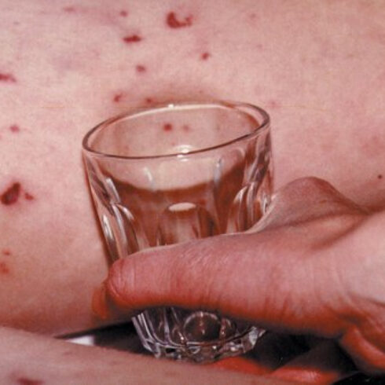
  <figcaption>Диаскопия: прозрачный предмет прижат к элементам сыпи. Геморрагические элементы (петехии, пурпура) остаются видны через стекло; сосудистая сыпь под давлением бледнеет.</figcaption>
</figure>

# Схема дифференциальной диагностики

```
                СЫПЬ + ЛИХОРАДКА У РЕБЁНКА
                          │
                   ДИАСКОПИЯ (стекло)
          ┌───────────────┴───────────────┐
     БЛЕДНЕЕТ                        НЕ БЛЕДНЕЕТ
   (сосудистая)                    (геморрагическая)
        │                                 │
   ┌────┴─────┐                ┌──────────┴──────────┐
элемент      элемент       тяжёлое состояние,     состояние
живёт        живёт          пурпура > 2 мм,      удовлетворительное,
< 24 ч,      сутками,        ВКН > 2 с,          сыпь не нарастает
мигрирует    фиксирован     новые элементы            │
   │            │           за время осмотра    ┌─────┴─────┐
КРАПИВНИЦА      │                 │          только      пальпируемая
             ┌──┴───┐      МЕНИНГОКОКЦЕМИЯ   выше уровня  пурпура,
        инфекционная│      (действовать, не    сосков,     ягодицы,
         экзантема  │       ждать подтверж-   есть рвота,  голени,
         (продром,  │       дения)            кашель,      живот,
      контакт, этап-│                         натуживание  суставы
      ность сыпи)   │                             │            │
              лекарственная                 ПЕТЕХИИ БАССЕЙНА  IgA-
              экзантема                     ВЕРХНЕЙ ПОЛОЙ    ВАСКУЛИТ
              (новый препарат               ВЕНЫ
               4–14 дней назад,             (наблюдение;
               нет продрома)                 пересмотр при
                                             любом ухудшении)
```

# Сосудистые (макулопапулёзные) экзантемы

Составляют основную массу детских экзантем. Общее состояние ребёнка, как правило, удовлетворительное или средней тяжести, сыпь бледнеет при диаскопии. Дифференциация проводится по характеру продромального периода, морфологии элементов, распространению и наличию патогномоничных признаков.

| Болезнь | Возбудитель | Продром | Сыпь и распространение | Ключевой признак |
|---|---|---|---|---|
| **Корь** | вирус кори | 3–4 дня: лихорадка, кашель, насморк, конъюнктивит | Пятнисто-папулёзная, **с лица и границы роста волос вниз**, сливается; угасает с буроватым прокрашиванием и отрубевидным шелушением | **Пятна Коплика** на слизистой щёк (за 1–2 дня до сыпи) |
| **Краснуха** | вирус краснухи | Слабый или отсутствует | Мелкие розовые пятна, **с лица вниз**, несливные, регрессируют за ~3 дня | Болезненные **заушные и затылочные** лимфоузлы |
| **Скарлатина** | β-гемолитический стрептококк группы А | Лихорадка, тонзиллит, рвота | Мелкоточечная «наждачная», бледнеющая; со сгибов, шеи, паха с последующей генерализацией; **бледный носогубный треугольник** | **«Малиновый» язык**; линии Пастиа в складках; шелушение ладоней и подошв в исходе |
| **Инфекционная эритема** (пятая болезнь) | парвовирус B19 | Лёгкий, часто субклинический | **«Нашлёпанные щёки»**, затем **кружевная** (сетчатая) сыпь на разгибательных поверхностях конечностей | К моменту появления сыпи пациент не контагиозен |
| **Внезапная экзантема** (розеола) | HHV-6/7 | **Высокая лихорадка 3–5 дней** при относительно удовлетворительном состоянии | Бледно-розовые пятна и папулы на **туловище**, появляются **после нормализации температуры** | Возраст **6 мес – 2 года**; ассоциация с фебрильными судорогами |
| **Ветряная оспа** | VZV | Умеренная лихорадка, недомогание | Зудящая; толчкообразно: пятно → папула → **везикула («капля росы»)** → корочка; поражаются и слизистые | **Полиморфизм**: элементы всех стадий одновременно |
| **Энтеровирусная экзантема «рука-нога-рот»** | вирусы Коксаки, энтеровирусы | Лихорадка, недомогание | Везикулы и эрозии **в полости рта**; везикулы на **кистях и стопах**, иногда на ягодицах | Сочетание локализаций кисти + стопы + полость рта |

<figure>
  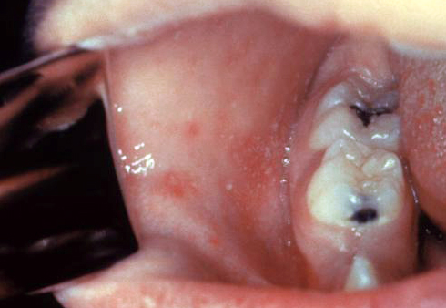
  <figcaption>Пятна Коплика: мелкие бело-голубоватые точки на ярко-красной слизистой щёк напротив коренных зубов — патогномоничный признак кори, появляются за 1–2 дня до экзантемы.</figcaption>
</figure>

<figure>
  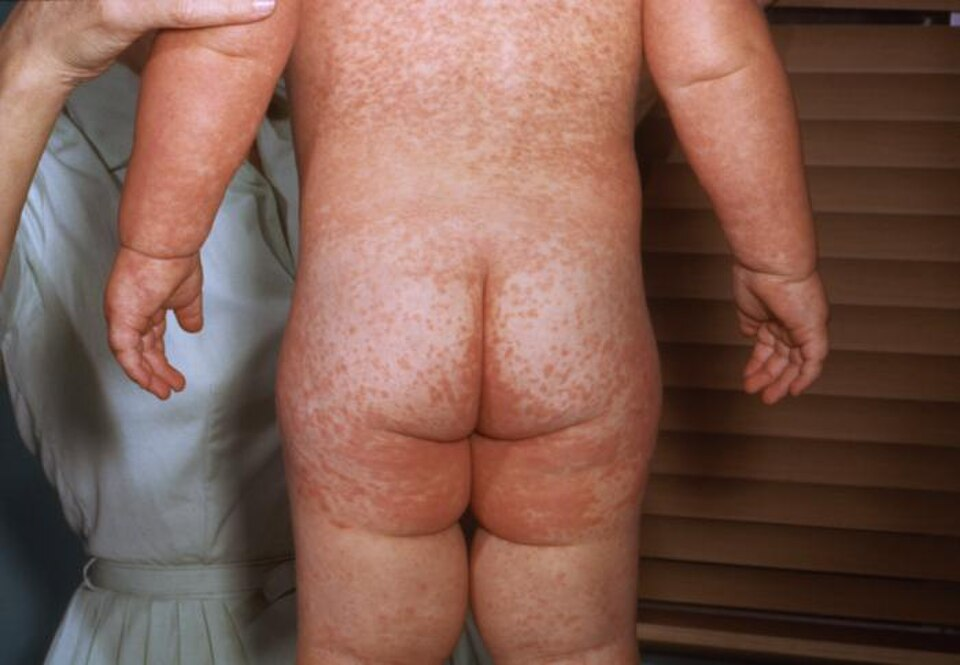
  <figcaption>Пятнисто-папулёзная сыпь при кори: элементы местами сливаются в поля, между которыми остаётся кожа обычного цвета.</figcaption>
</figure>

<figure>
  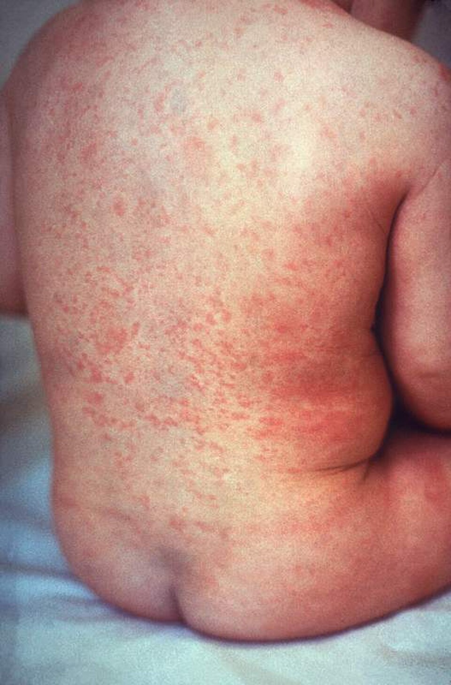
  <figcaption>Краснуха: мелкие бледно-розовые несливающиеся пятна; сопровождается болезненной заушной и затылочной лимфаденопатией.</figcaption>
</figure>

<figure>
  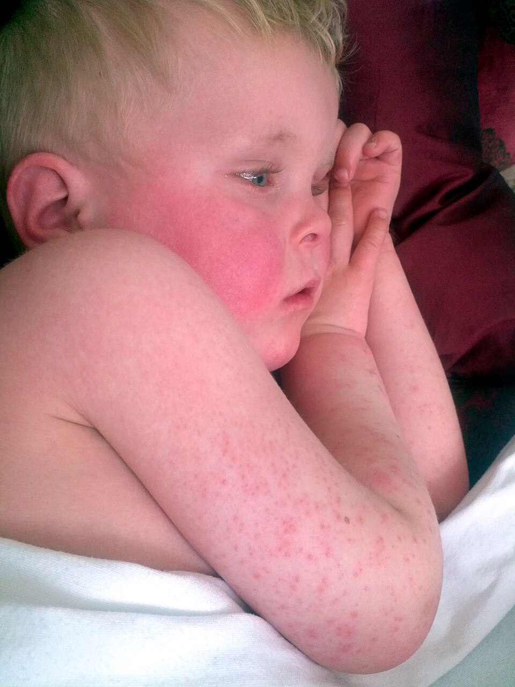
  <figcaption>Скарлатина: мелкоточечная «наждачная» эритема на фоне общей гиперемии кожи.</figcaption>
</figure>

<figure>
  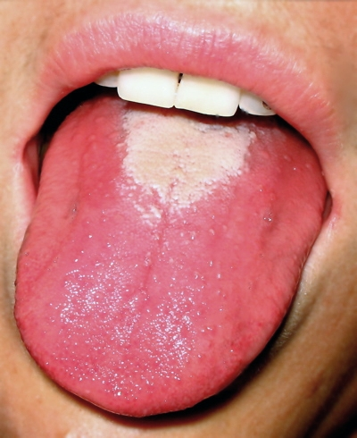
  <figcaption>Ранняя стадия изменений языка при скарлатине: язык обложен белым налётом, сквозь который выступают набухшие красные сосочки.</figcaption>
</figure>

<figure>
  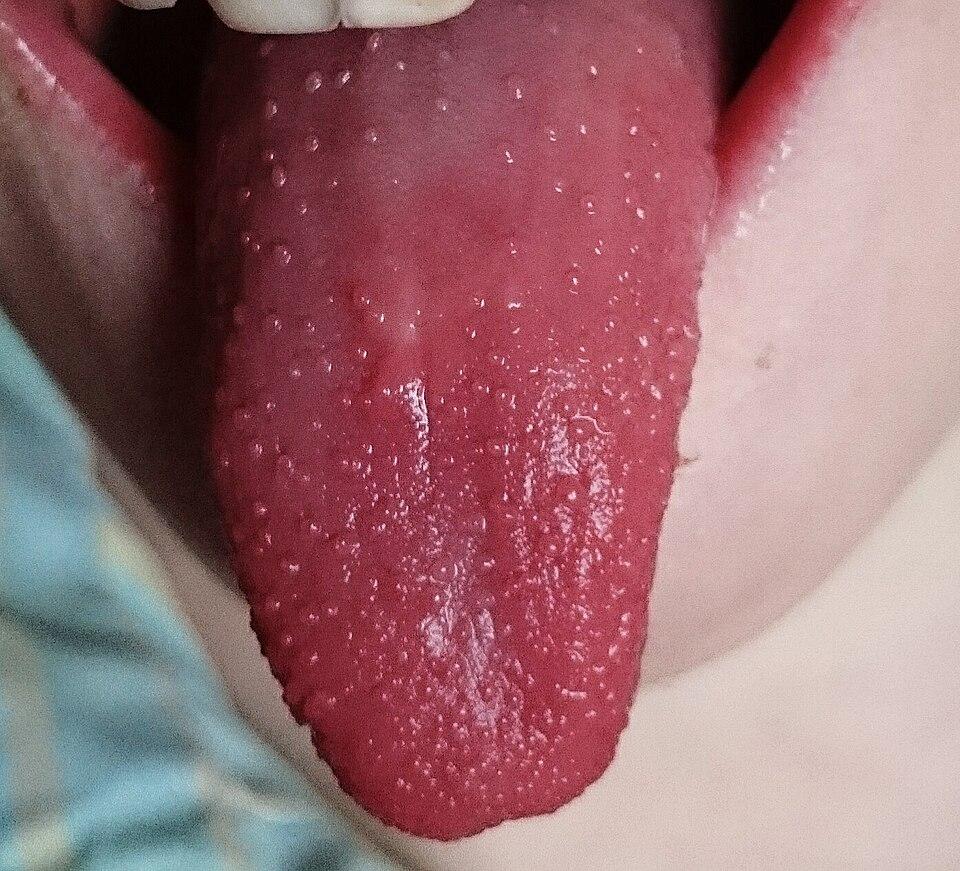
  <figcaption>«Малиновый» язык: после отхождения налёта — ярко-красный язык с гипертрофированными сосочками. Наблюдается при скарлатине и при болезни Кавасаки.</figcaption>
</figure>

<figure>
  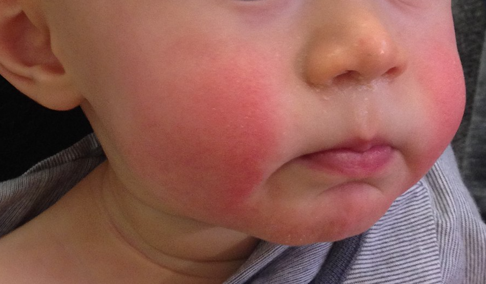
  <figcaption>Инфекционная эритема (парвовирус B19): яркая эритема щёк — «нашлёпанные щёки» — с бледным носогубным треугольником.</figcaption>
</figure>

<figure>
  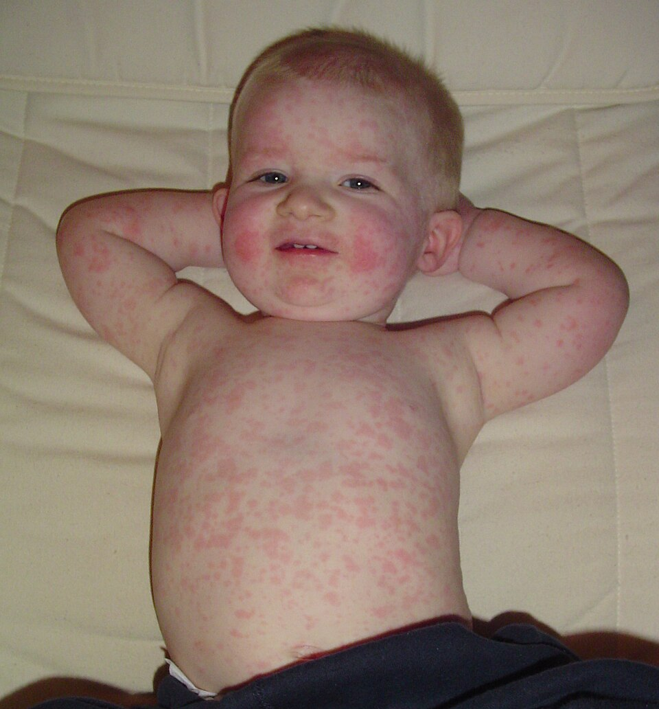
  <figcaption>Инфекционная эритема (парвовирус B19): яркая эритема щёк и пятнисто-папулёзная сыпь на туловище. Вторая фаза даёт сетчатый, «кружевной» рисунок за счёт просветлений в центре элементов; на этом кадре видны обе фазы сразу.</figcaption>
</figure>

<figure>
  
  <figcaption>Внезапная экзантема (розеола): бледно-розовые пятна на туловище, появляющиеся после нормализации температуры; типичный возраст 6 мес – 2 года.</figcaption>
</figure>

<figure>
  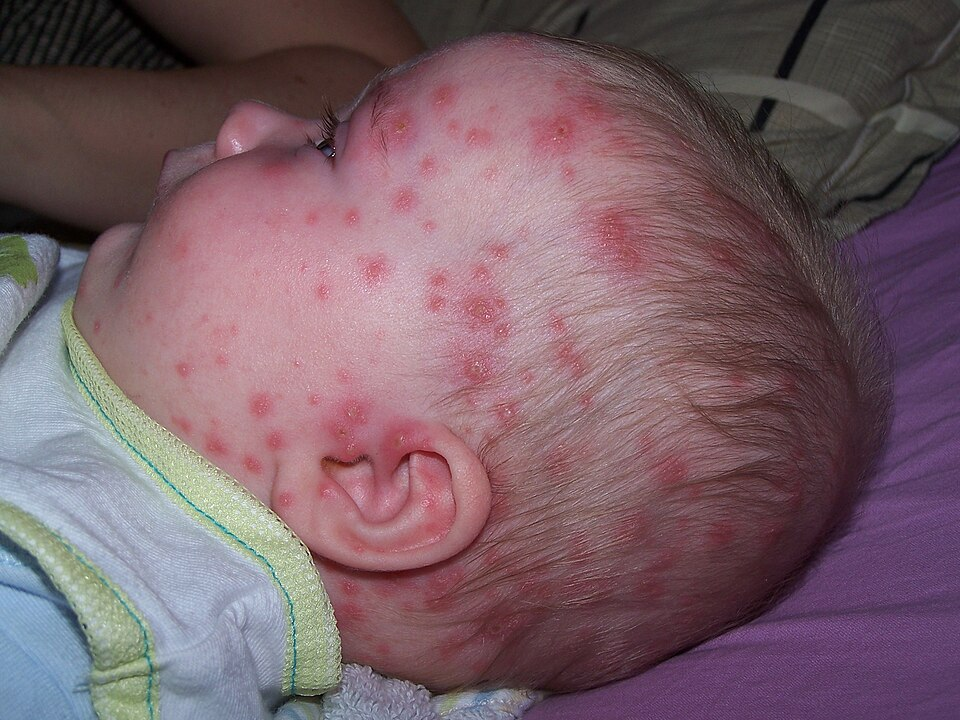
  <figcaption>Ветряная оспа: на лице и волосистой части головы одновременно пятна, папулы, везикулы («капля росы») и корочки — полиморфизм сыпи.</figcaption>
</figure>

<figure>
  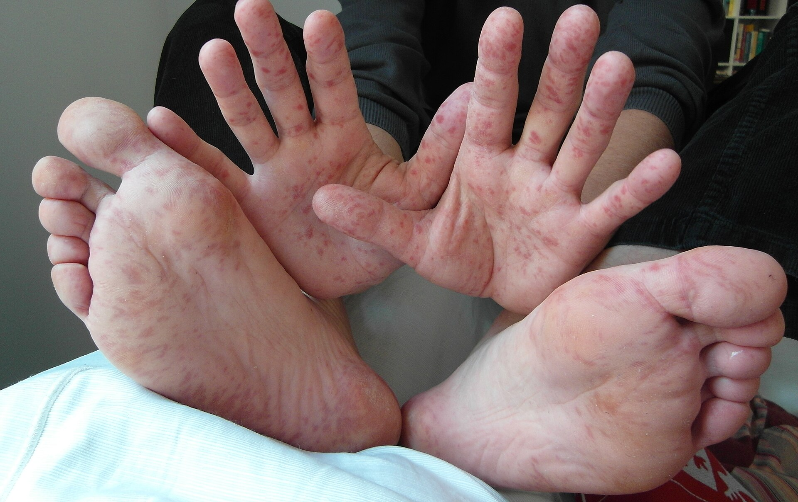
  <figcaption>Энтеровирусная экзантема «рука-нога-рот»: плотные элементы на ладонях и подошвах. Снимок взрослого (36 лет); у детей картина та же, плюс эрозии в полости рта, которых на этом кадре нет.</figcaption>
</figure>

# Геморрагические (небледнеющие) сыпи

## Менингококцемия

Генерализованная форма менингококковой инфекции. Характеризуется высокой летальностью и быстрым темпом развития; в первые часы клиническая картина может соответствовать нетяжёлой респираторной инфекции.

- **Сыпь:** петехии и пурпура, не бледнеющие при диаскопии; элементы плоские или незначительно приподнятые, багрово-фиолетовые. Первичная локализация — бёдра, ягодицы, голени, нижние отделы живота, с последующим распространением на туловище, верхние конечности и лицо.
- **Общее состояние:** тяжёлое, с быстрым ухудшением: лихорадка, вялость, тахикардия, удлинение времени капиллярного наполнения, холодные конечности. Артериальная гипотензия у детей — поздний признак декомпенсации.
- **Пурпура фульминанс:** сливная пурпура и экхимозы с некрозом кожи на фоне ДВС-синдрома и септического шока.

Значение диаскопии состоит в раннем выявлении геморрагического характера сыпи — на этапе, когда элементы ещё немногочисленны, а состояние ребёнка не отражает тяжести процесса.

> Небледнеющая сыпь у ребёнка с лихорадкой рассматривается как проявление менингококковой инфекции до её исключения.

<figure>
  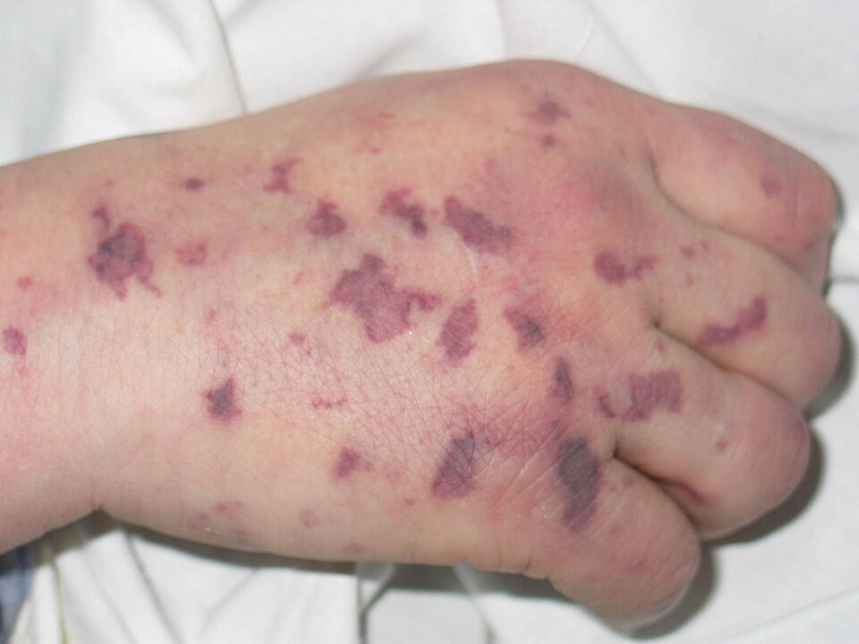
  <figcaption>Менингококцемия: геморрагическая сыпь (пурпура и экхимозы), не бледнеющая при диаскопии; сливные багрово-фиолетовые элементы различного размера.</figcaption>
</figure>

Догоспитальные мероприятия при подозрении на менингококцемию включают осмотр полностью раздетого ребёнка, оксигенотерапию, венозный доступ и инфузионную терапию при признаках шока, введение антибактериального препарата (цефтриаксон) в дозе по массе тела, оповещение принимающего стационара и экстренную госпитализацию в отделение реанимации. Дозировки и объём инфузии — по действующему протоколу; вопрос экстренной профилактики контактным лицам решается отдельно.

## Что показали исследования небледнеющей сыпи

Правило «небледнеющая сыпь плюс лихорадка равно менингококцемия до исключения» не отменяется приведёнными ниже данными. Данные говорят о другом: какие признаки внутри этой группы действительно смещают вероятность.

**Wells и соавт., Ноттингем, 2001** — 12 месяцев наблюдения, 233 ребёнка до 15 лет с небледнеющей сыпью, после исключения очевидных альтернативных диагнозов в анализ вошли 218. Подтверждённая менингококковая инфекция — у 24 (11 %).

| Находка | Что показала работа |
|---|---|
| Характер элементов | Только петехии (< 2 мм) — 175 детей (80 %), из них менингококковая инфекция у 4. Петехии **и пурпура** (> 2 мм) — 43 ребёнка (20 %), из них инфекция у 20 |
| Общее состояние | Дети с менингококковой инфекцией достоверно чаще выглядели больными |
| Температура | Чаще > 38,5 °С, **однако у 5 детей с подтверждённой инфекцией аксиллярная температура была ниже 37,5 °С** |
| Время капиллярного наполнения | Чаще более 2 секунд |
| Локализация | **Ни у одного ребёнка** с сыпью, ограниченной бассейном верхней полой вены, менингококковой инфекции не было |
| Лабораторные показатели | Менее полезны; при C-реактивном белке < 6 мг/л инфекции не было ни у одного ребёнка, но специфичность повышенного значения низкая |

**Mandl и соавт., Бостон, 1997** — 411 детей с температурой ≥ 38 °С и петехиями. Бактериемия или клинический сепсис — у 8 (1,9 %), инвазивная бактериемия — у 6. Ни у одного из 357 детей, которые **не выглядели больными**, инвазивной бактериемии не было; все 6 тяжёлых случаев оказались среди 53 детей, оценённых как «выглядит больным». У всех детей с менингококцемией была пурпура, а не изолированные петехии.

**Валидация алгоритмов, 2016** — три когорты, 625 детей с небледнеющей сыпью, подтверждённая или вероятная менингококковая инфекция у 145 (23 %). Алгоритм Newcastle — Birmingham — Liverpool выявил всех детей с инфекцией (чувствительность 100 %, специфичность 82 %), алгоритм NICE — 141 из 145 (чувствительность 97 %, специфичность 50 %). Единственная значимая задержка лечения произошла там, где алгоритм не применили.

Практический вывод для догоспитального этапа, где нет ни анализа крови, ни C-реактивного белка: работают четыре клинических признака — **общий вид ребёнка, размер элементов (пурпура тяжелее петехий), время капиллярного наполнения и появление новых элементов за время осмотра**. Нормальная температура на момент осмотра менингококковую инфекцию не исключает: жаропонижающее, данное до приезда бригады, снижает цифру на термометре, а не риск.

## IgA-васкулит (геморрагический васкулит, болезнь Шёнляйна — Геноха)

Наиболее частый системный васкулит детского возраста. Сопровождается небледнеющей сыпью с локализацией на нижних конечностях и ягодицах, что определяет необходимость дифференциальной диагностики с менингококцемией.

| Признак | Менингококцемия | IgA-васкулит |
|---|---|---|
| Общее состояние | Тяжёлое, с быстрым ухудшением | Как правило, относительно удовлетворительное |
| Характер сыпи | Петехии и пурпура, плоские | **Пальпируемая** пурпура |
| Локализация | Бёдра, ягодицы, голени → генерализация | Симметрично ягодицы и разгибательные поверхности голеней |
| Сопутствующие проявления | Лихорадка, шок, ДВС-синдром | Абдоминальный синдром, артралгии, поражение почек |
| Динамика | Часы | Дни–недели, волнообразно |

Морфология сыпи сама по себе эти состояния не разграничивает: определяющее значение имеют общее состояние ребёнка и темп развития картины.

<figure>
  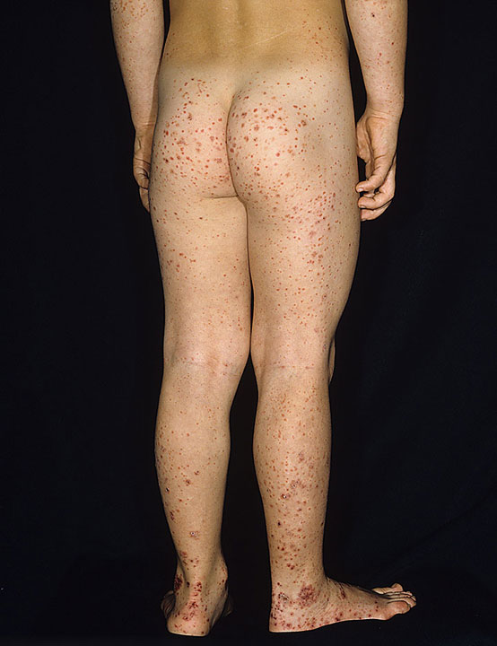
  <figcaption>IgA-васкулит (болезнь Шёнляйна — Геноха): симметричная пальпируемая пурпура на ягодицах и разгибательных поверхностях голеней со сгущением элементов в дистальных отделах.</figcaption>
</figure>

## Петехии в бассейне верхней полой вены

Механизм. При кашле, рвоте, натуживании и продолжительном крике внутригрудное давление резко возрастает. Клапанный аппарат вен головы и шеи этому препятствует плохо: в системе верхней полой вены он развит слабо и при резких скачках давления несостоятелен. Волна давления передаётся ретроградно, и капилляры дермы лица, периорбитальной области, шеи и верхней части груди рвутся. Крайняя степень того же механизма — травматическая асфиксия при сдавлении грудной клетки, с цианотичной «маской» и субконъюнктивальными кровоизлияниями.

Отсюда границы распространения: элементы располагаются **выше уровня сосков** и ниже этой границы отсутствуют. Именно этот признак и разделяет два случая небледнеющей сыпи, которые на глаз одинаковы: менингококцемия начинается снизу — бёдра, ягодицы, голени, низ живота — и генерализуется, а петехии от повышения давления снизу не бывают вовсе.

Условия, при которых такая трактовка правомерна, должны совпасть все:

- есть провокация в анамнезе — рвота, приступообразный кашель, натуживание, длительный крик;
- элементы ограничены бассейном верхней полой вены, при полном осмотре раздетого ребёнка ниже ничего нет;
- размер элементов — петехии, не пурпура;
- общее состояние удовлетворительное, перфузия сохранена, ребёнок не выглядит больным;
- количество элементов стабильно, новых за время наблюдения не появляется;
- нет других признаков нарушения гемостаза: спонтанных синяков в нетипичных местах, кровоточивости слизистых, носовых кровотечений.

Если выпадает хотя бы одно условие, трактовка возвращается к исходной. Лихорадка при этом сама по себе трактовку не отменяет: ребёнок может одновременно болеть вирусной инфекцией с высокой температурой и иметь механические петехии от рвоты — это и есть самая частая реальная комбинация. Что она не отменяет — так это необходимость повторной оценки: любое ухудшение, появление элементов ниже уровня сосков или увеличение их размера означает пересмотр решения, а не подтверждение прежнего.

# Лекарственные экзантемы

Лекарственная сыпь в дифференциальном ряду детских экзантем занимает особое место: у неё нет ни продрома, ни эпидемиологического анамнеза, ни этапности, зато есть дата начала приёма препарата — то есть признак, который выявляется исключительно вопросом. Если вопрос не задан, признак отсутствует.

## Пятнисто-папулёзная (кореподобная) лекарственная сыпь

Самая частая форма лекарственной экзантемы. Механизм — замедленная реакция с участием T-лимфоцитов, а не IgE, поэтому и сроки, и клиника отличаются от крапивницы.

- **Сроки:** 4–14 дней от начала приёма нового препарата, чаще 7–10-е сутки. При повторном контакте с препаратом, к которому организм уже сенсибилизирован, — от нескольких часов до 1–2 суток.
- **Морфология:** симметричные пятна и папулы, довольно однотипные, местами сливающиеся; между полями сохраняется кожа обычного цвета.
- **Распространение:** обычно туловище и проксимальные отделы конечностей, далее генерализация; ладони и подошвы вовлекаются реже.
- **Поведение элементов:** элемент фиксирован — он остаётся на своём месте сутками, а не мигрирует.
- **Диаскопия:** бледнеет.
- **Зуд:** часто есть, но может быть слабым или неопределённым.
- **Исход:** регресс за 1–2 недели после отмены препарата, нередко с шелушением.

## Отличие от крапивницы

Различие принципиально, потому что за ним стоит разный механизм и разный ответ на лечение.

| Признак | Крапивница | Пятнисто-папулёзная лекарственная сыпь |
|---|---|---|
| Элемент | Волдырь, приподнятый, отёчный | Пятно и папула |
| Время жизни элемента | Менее 24 часов, исчезает бесследно | Сутки и более, остаётся на месте |
| Миграция | Есть: элементы появляются в новых местах | Нет |
| Зуд | Как правило выраженный | Разный, вплоть до сомнительного |
| Ангиоотёк | Возможен | Не характерен |
| Антигистаминные препараты | Эффективны | Существенного эффекта не дают |

Фиксированная, немигрирующая сыпь, на которую антигистаминные не действуют, крапивницей не является — и попытка усилить антигистаминную терапию при ней лишь оттягивает главное действие, отмену препарата.

## НПВС: почему непереносимость оказывается перекрёстной

У реакций на НПВС два разных механизма, и практическое различие между ними существеннее, чем кажется.

**Иммунологический** — истинная аллергия: замедленная T-клеточная (пятнисто-папулёзная сыпь, тяжёлые формы) или IgE-опосредованная (крапивница, анафилаксия). Направлена против конкретной молекулы, поэтому реакция избирательная: другие НПВС переносятся.

**Фармакологический, неиммунный** — следствие самого действия препарата. Блокада циклооксигеназы-1 уменьшает синтез простагландина E₂ и снимает его тормозящее влияние на 5-липоксигеназный путь; продукция цистеиниловых лейкотриенов растёт. Реакция воспроизводится любым сильным ингибитором ЦОГ-1 — независимо от химического строения препарата. Отсюда перекрёстная непереносимость между веществами, не имеющими друг с другом ничего общего, кроме механизма действия.

Классификация реакций на НПВС (EAACI) различает пять типов, из которых **перекрёстными** являются три — обострение респираторного заболевания, обострение хронической крапивницы и крапивница/ангиоотёк у исходно здорового человека, — а **избирательными** два: немедленные реакции на один препарат и замедленные реакции на один препарат.

Практическое следствие: после реакции на НПВС замена одного традиционного НПВС на другой — не решение, а повторение эксперимента. Жаропонижающим выбора становится парацетамол как слабый ингибитор ЦОГ-1; вопрос о селективных ингибиторах ЦОГ-2 и о том, была ли реакция избирательной, решается аллергологом, а не в приёмном покое.

## Два НПВС одновременно

Комбинация двух НПВС не увеличивает обезболивающий и жаропонижающий эффект, поскольку они конкурируют за одну и ту же точку приложения, но суммирует нежелательные эффекты: блокада ЦОГ-1 в слизистой желудка лишает её защитных простагландинов, снижается продукция слизи и бикарбоната, ухудшается кровоток — и появляются боли в эпигастрии, эрозии, реже кровотечение. Домашняя аптечка эту комбинацию создаёт легко: препараты продаются под десятками торговых названий, и «ибупрофен» с «нимесулидом» на упаковках выглядят как два разных лекарства.

Отдельно о нимесулиде. Европейское агентство по лекарственным средствам по итогам пересмотра признало у него повышенный по сравнению с другими НПВС риск гепатотоксичности и ограничило применение: только острая боль и первичная дисменорея, только как средство второй линии, курс не более 15 дней, детям до 12 лет противопоказан. Практическое следствие для осмотра: боль в правом подреберье у пациента, принимающего нимесулиде­содержащий препарат, требует проверки на признаки поражения печени — желтушность кожи и склер, потемнение мочи, размеры печени, — а не списывается на гастрит по умолчанию.

## Красные флаги: когда лекарственная сыпь становится неотложным состоянием

| Состояние | Сроки от начала приёма | Что настораживает |
|---|---|---|
| **DRESS** (лекарственная реакция с эозинофилией и системными проявлениями) | 2–8 недель | Отёк лица, лихорадка, увеличение лимфоузлов, распространённая сыпь, эозинофилия, повышение трансаминаз, вовлечение почек и лёгких |
| **Синдром Стивенса — Джонсона и токсический эпидермальный некролиз** | 4–28 дней | Боль в коже, багрово-сероватые пятна и атипичные мишени, эрозии слизистых в двух и более местах (рот, глаза, гениталии), положительный симптом Никольского, отслойка эпидермиса |
| **Острый генерализованный экзантематозный пустулёз** | Часы – 2 суток | Десятки мелких стерильных пустул на фоне разлитой эритемы, чаще в складках, высокая лихорадка |
| **Анафилаксия** | Минуты – часы | Крапивница и ангиоотёк в сочетании с нарушением дыхания, гипотензией или упорной рвотой и болью в животе |

Пятнисто-папулёзная сыпь без этих признаков не требует экстренных вмешательств, но требует двух вещей: отмены препарата и наблюдения — именно потому, что перечисленные состояния начинаются как «простая сыпь».

## Лекарственная экзантема и корь

Кореподобная сыпь — не фигура речи: две сыпи действительно похожи, и разграничивают их не элементы, а окружение.

| Признак | Корь | Лекарственная экзантема |
|---|---|---|
| Продром | 3–4 дня: кашель, насморк, конъюнктивит, светобоязнь | Отсутствует |
| Слизистые | Пятна Коплика за 1–2 дня до сыпи; конъюнктивит | Как правило чистые (вовлечение слизистых — признак тяжёлой формы) |
| Отношение сыпи к температуре | Сыпь появляется на пике лихорадки, температура держится ещё 2–3 суток | Связи с температурной кривой нет; сыпь нередко появляется, когда лихорадка уже спадает |
| Распространение | Строгая этапность: лицо и граница роста волос → туловище → конечности | Туловище и проксимальные отделы конечностей, без выраженной этапности |
| Исход | Буроватое прокрашивание, отрубевидное шелушение | Регресс после отмены препарата, шелушение возможно |
| Анамнез | Контакт, отсутствие вакцинации, поездка | Новый препарат за 4–14 дней (или повторный приём) |

Подозрение на корь меняет действия ещё до подтверждения: заболевание высокозаразно и подлежит регистрации, поэтому надеваются маски, ограничиваются контакты, стационар оповещается заранее, а пациент минует общие потоки приёмного отделения. Ретроспективно такое поведение всегда выглядит избыточным — ровно до случая, когда корь подтверждается.

# Состояния, требующие особого внимания

## Болезнь Кавасаки

Системный васкулит с преимущественным поражением коронарных артерий и риском формирования аневризм. Экзантема полиморфна и неспецифична, диагноз основывается на совокупности критериев.

Лихорадка продолжительностью **не менее 5 дней** в сочетании с 4 из 5 признаков:

1. Двусторонний негнойный конъюнктивит.
2. Изменения губ и полости рта: сухость и трещины губ, «малиновый» язык.
3. Полиморфная сыпь на туловище.
4. Изменения конечностей: отёк и эритема ладоней и подошв, в последующем — шелушение в периунгвальной области.
5. Шейная лимфаденопатия (≥ 1,5 см), как правило односторонняя.

Дифференциально-диагностическое значение имеют стойкая лихорадка длительностью 5 суток и более и выраженная раздражительность ребёнка, не соответствующая тяжести респираторных проявлений. Родителям, остающимся с ребёнком дома, длительность лихорадки как отдельный повод для повторного обращения обычно неизвестна.

<figure>
  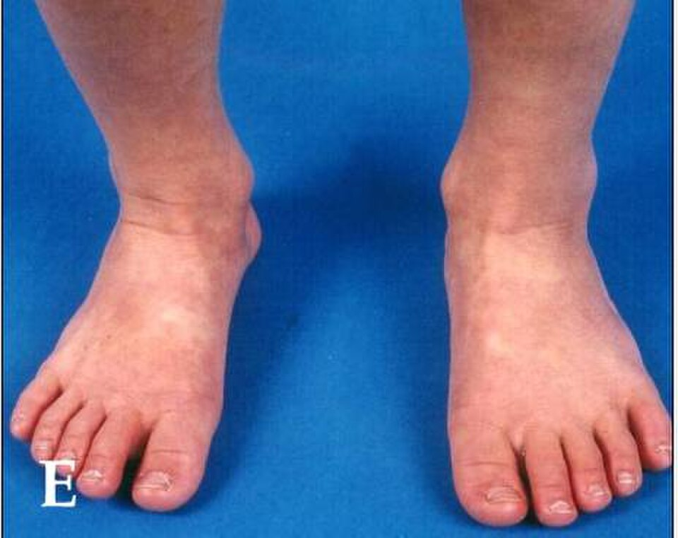
  <figcaption>Болезнь Кавасаки, изменения конечностей: плотный отёк и эритема стоп в острой фазе; в периоде реконвалесценции — шелушение в периунгвальной области.</figcaption>
</figure>

## Сыпь и «сальмонеллёз»

Сальмонеллёзный гастроэнтерит, вызванный нетифоидными сальмонеллами, экзантемы не даёт: его картина — лихорадка, рвота, водянистый стул, боль в животе. Сыпь есть у другого представителя рода — *Salmonella* Typhi, возбудителя брюшного тифа, и выглядит она характерно: скудные, единичные (обычно менее 10–20) розеолы 2–4 мм на коже живота и боковых поверхностей груди, появляющиеся на 7–10-е сутки болезни, **бледнеющие при надавливании**, с феноменом «подсыпания» — старые элементы угасают, новые появляются. Сопутствуют им нарастающая по дням лихорадка, головная боль, заторможенность, относительная брадикардия, увеличение печени и селезёнки.

Иными словами, словосочетание «сальмонеллёз с сыпью» осмысленно только применительно к брюшному тифу, картина которого другая с первого дня. Диагноз, поставленный по формуле «что-то же с пациентом не так», удобен тем, что не требует ни одного положительного признака — и именно поэтому он ничего не даёт ни принимающему стационару, ни пациенту.

# Признаки, определяющие показания к экстренной госпитализации

| Признак | Клиническая интерпретация |
|---|---|
| Сыпь не бледнеет при диаскопии на фоне лихорадки | Менингококцемия до её исключения |
| Пурпура (элементы > 2 мм), а не только петехии | Наиболее весомый признак менингококковой инфекции среди небледнеющих сыпей |
| Элементы ниже уровня сосков при небледнеющей сыпи | Механическая трактовка исключается |
| Признаки интоксикации: вялость, снижение реакции на осмотр, «выглядит больным» | Сепсис, шок — независимо от характера сыпи |
| Быстрое распространение сыпи, появление новых элементов в течение осмотра | Молниеносное течение инфекции |
| Время капиллярного наполнения > 2 с, холодные конечности, тахикардия | Шок; у детей предшествует гипотензии |
| Ригидность затылочных мышц, светобоязнь, нарушение сознания, судороги | Менингит, энцефалит |
| Лихорадка длительностью ≥ 5 дней | Болезнь Кавасаки |
| Поражение слизистых, боль в коже, отслойка эпидермиса, положительный симптом Никольского | Синдром Стивенса — Джонсона, токсический эпидермальный некролиз |
| Отёк лица, лимфаденопатия, сыпь и лихорадка на фоне приёма препарата | DRESS |
| Подозрение на корь | Маршрутизация и противоэпидемические меры до подтверждения диагноза |

# Возвращение к клиническим случаям

## Случай первый: сыпь, которая действительно не бледнела

Отец выполнил диаскопию правильно и получил истинный результат: сыпь была геморрагической. Формально этого достаточно, чтобы насторожиться по поводу менингококцемии. Вопрос был не в том, верить ли стакану (стаканам — верить!), а в том, что кроме факта «не бледнеет» есть ещё три характеристики.

**Локализация.** Элементы располагались на лице и справа на шее — то есть в бассейне верхней полой вены, — и полный осмотр раздетого ребёнка не нашёл ничего ниже. Менингококцемия так не начинается: её первичная зона — бёдра, ягодицы, голени, низ живота. В ноттингемской работе ни у одного ребёнка с сыпью, ограниченной бассейном верхней полой вены, менингококковой инфекции не оказалось.

**Размер элементов и общий вид.** Петехии, не пурпура; ребёнок активный. В обеих цитированных работах именно эти два признака — пурпура и вид больного ребёнка — несли основную дифференциальную нагрузку, а не сам факт небледнеющей сыпи.

**Провокация.** Двое суток рвоты. Механизм прямой: скачки внутригрудного давления передаются в венозную систему головы и шеи, капилляры дермы рвутся, и сыпь появляется там, куда дошла волна давления, — на лице и шее. Асимметрия (справа больше) для такого происхождения обычна.

Совпало то, что было на вызове: провокация есть, локализация соответствует, элементы петехиальные, ребёнок активный. Исход — ротавирусная инфекция: она объясняет лихорадку, рвоту и жидкий стул. Сама сыпь к вирусу отношения не имела. Ротавирус экзантемы не даёт; петехии на лице и шее были механическими — следствием не болезни, а двух суток рвоты.

Отдельного внимания заслуживает роль отца. Он выполнил корректное исследование, получил корректный результат и сделал из него неверный вывод — немного перестарался, не зная, что диаскопия отвечает только на один вопрос: где находится кровь. На вопрос «почему она там оказалась» отвечают локализация, размер элементов, состояние ребёнка и анамнез. 

## Случай второй: сыпь, которую три дня объясняли инфекцией

Диагноз «сальмонеллёз» не имел ни одного положительного признака: жидкого стула не было вовсе, а сыпь при нетифоидном сальмонеллёзе не встречается. Единственное, что было верно в формулировке направившего врача, — это то, что с пациенткой действительно что-то не так.

Что было у девушки объективно: третьи сутки лихорадки до 38 °С, рвота в начале, отсутствие катаральных явлений, боль в эпигастрии и правом подреберье, пятнисто-папулёзная бледнеющая сыпь на руках, ногах и шее, без волдырей и ангиоотёка. Зуд — ни да, ни нет.

Из этого набора складываются три версии:

**Корь.** Возраст 17 лет — характерный для непривитых или утративших иммунитет; сыпь пятнисто-папулёзная; лихорадка предшествовала сыпи. Против кори — отсутствие катарального продрома, конъюнктивита и пятен Коплика, а также распространение сыпи не с лица. Отсутствие признаков — аргумент слабый: осмотр происходит в один момент времени, а сыпь при кори могла быть осмотрена не в свой день. Корь заразна и подлежит регистрации, поэтому именно она определяет маршрут.

**Вирусная экзантема иной природы.** Возможна и по частоте наиболее вероятна, но лабораторного подтверждения на догоспитальном этапе не имеет.

**Лекарственная экзантема.** Комбинация ибупрофена с нимесулидом дважды объясняет картину: сыпь как пятнисто-папулёзная реакция и боль в эпигастрии как следствие суммированной блокады ЦОГ-1 в слизистой желудка. Боль в правом подреберье добавляет к этому вопрос о печени, поскольку у нимесулида риск гепатотоксичности выше, чем у других НПВС. Слабое место версии — сроки: сыпь появилась на следующий день после приёма, тогда как для первичной T-клеточной реакции типичны 4–14 суток. Такой короткий срок объясним либо предшествующей сенсибилизацией (НПВС ребёнку почти наверняка давали и раньше), либо неиммунным, фармакологическим механизмом. Достоверно разделить эти варианты можно только ретроспективно — отменой препаратов и наблюдением, а окончательно — обследованием у аллерголога.

Решение доставить в инфекционный стационар было единственно возможным: лекарственная экзантема ставится задним числом, а корь исключается лабораторно и требует изоляции. Дальше парад продолжился уже без нас. Девушку сначала заперли в изоляторе и подозревали корь — корь не подтвердилась. Потом решили подумать про менингит, сделали пункцию — не подтвердилось. От пережитого ужаса у девушки нормализовались анализы, спала температура. Выписана с улучшением. Наиболее вероятная причина сыпи и боли в животе — неудачная комбинация жаропонижающих; боль в эпигастрии укладывается в гастропатию от двух НПВС сразу.

Ретроспективно вся цепочка выглядит как парад лишних действий. По факту же она показывает свойство лекарственной экзантемы, которое и делает её ловушкой: диагноз ставится не по признакам сыпи, а по факту приёма препарата и по её регрессу после отмены. 

# Ключевая мысль

Диаскопия отвечает на вопрос, где находится кровь, — и только на него. Всё остальное решают локализация элементов, их размер, общий вид ребёнка, динамика за время наблюдения и вопрос о том, какие лекарства он получил и с какого дня. Сыпь, ограниченная бассейном верхней полой вены у активного ребёнка после двух суток рвоты, и пурпура на голенях у вялого ребёнка с холодными конечностями одинаково «не бледнеют под стеклом», но общего у них — только этот признак.

# Ответы на вопросы для размышления

**1.** Диаскопия разделяет сыпи на сосудистые и геморрагические, то есть отвечает на вопрос, находится кровь в просвете сосудов или уже вышла в дерму. Она выполняется раньше перечисления нозологий потому, что слова «мелкая красная сыпь» описывают одновременно раннюю петехиальную сыпь и обычную вирусную экзантему, а различие между этими классами определяет и срочность, и маршрут. Сомнительный результат трактуется в пользу геморрагического характера: цена ошибки в эту сторону — лишняя госпитализация, в обратную — пропущенная менингококцемия.

**2.** Вероятность менингококковой инфекции повышают: вид больного ребёнка, пурпура (элементы более 2 мм) в отличие от изолированных петехий, время капиллярного наполнения более двух секунд, температура выше 38,5 °С и появление новых элементов за время наблюдения. В ноттингемской работе из 218 детей с небледнеющей сыпью инфекция подтвердилась у 11 %, при этом среди 175 детей с одними петехиями — у 4, а среди 43 с пурпурой — у 20. Лабораторные показатели оказались менее полезными. Нормальная температура ничего не исключает: у 5 детей с подтверждённой инфекцией аксиллярная температура была ниже 37,5 °С, а на догоспитальном этапе цифру на термометре к тому же снижает жаропонижающее, данное до приезда бригады.

**3.** Резкий рост внутригрудного давления при рвоте, кашле, натуживании и крике передаётся ретроградно в систему верхней полой вены, где клапанный аппарат развит слабо и при скачках давления несостоятелен; капилляры дермы рвутся. Отсюда локализация — лицо, периорбитальная область, шея, верхняя часть груди, то есть выше уровня сосков. Условия принятия такой трактовки должны совпасть все: провокация в анамнезе, отсутствие элементов ниже уровня сосков при полном осмотре раздетого ребёнка, петехии, а не пурпура, удовлетворительное состояние с сохранной перфузией, стабильное количество элементов и отсутствие признаков нарушения гемостаза. Выпадение любого условия возвращает трактовку к исходной.

**4.** При IgA-васкулите пурпура **пальпируемая**, расположена симметрично на ягодицах и разгибательных поверхностях голеней, сопровождается болью в животе, артралгиями и поражением почек, развивается днями и волнообразно, состояние обычно относительно удовлетворительное. При менингококцемии элементы плоские, состояние тяжёлое и ухудшается часами, добавляются нарушение перфузии и ДВС-синдром. Морфология сама по себе состояния не разграничивает: решают общий вид и темп.

**5.** Пятнисто-папулёзная лекарственная сыпь появляется через 4–14 дней от начала приёма нового препарата, чаще на 7–10-е сутки: это замедленная T-клеточная реакция, которой нужно время на сенсибилизацию. При повторном контакте с препаратом, к которому сенсибилизация уже есть, срок сокращается до часов или 1–2 суток. Поэтому короткий интервал не исключает лекарственную природу сыпи, а означает вопрос о том, принимался ли этот препарат раньше.

**6.** Крапивница — волдыри, каждый из которых живёт менее 24 часов и исчезает бесследно, с миграцией элементов, выраженным зудом и возможным ангиоотёком; антигистаминные препараты эффективны. Лекарственная пятнисто-папулёзная сыпь состоит из пятен и папул, фиксирована на месте сутками, зуд разный. Антигистаминные при ней существенного эффекта не дают, потому что механизм не гистаминовый, а T-клеточный: основное действие — отмена препарата.

**7.** Помимо истинной аллергии на конкретную молекулу существует неиммунный механизм: блокада ЦОГ-1 снижает синтез простагландина E₂, снимается его тормозящее влияние на 5-липоксигеназный путь, растёт продукция цистеиниловых лейкотриенов. Реакция воспроизводится любым сильным ингибитором ЦОГ-1 независимо от химического строения, поэтому непереносимость оказывается перекрёстной. Следствие: замена одного традиционного НПВС на другой повторяет ситуацию, а не решает её; жаропонижающим выбора становится парацетамол, а вопрос о селективных ингибиторах ЦОГ-2 решает аллерголог.

**8.** DRESS — 2–8 недель от начала приёма: отёк лица, лихорадка, лимфаденопатия, эозинофилия, повышение трансаминаз. Синдром Стивенса — Джонсона и токсический эпидермальный некролиз — 4–28 дней: боль в коже, багрово-сероватые пятна и атипичные мишени, эрозии слизистых в двух и более локализациях, положительный симптом Никольского, отслойка эпидермиса. Острый генерализованный экзантематозный пустулёз — часы-двое суток: множественные мелкие пустулы на фоне разлитой эритемы и высокая лихорадка. Анафилаксия — минуты-часы: крапивница и ангиоотёк с нарушением дыхания, гипотензией, упорной рвотой.

**9.** У кори есть катаральный продром 3–4 дня с кашлем, насморком, конъюнктивитом и светобоязнью, пятна Коплика за 1–2 дня до сыпи, строгая этапность распространения сверху вниз, склонность к слиянию и буроватое прокрашивание с шелушением в исходе; сыпь появляется на пике лихорадки, которая держится ещё 2–3 суток. У лекарственной экзантемы продрома нет, слизистые обычно чистые, связи с температурной кривой нет, распространение начинается с туловища и проксимальных отделов конечностей, зато есть новый препарат за 4–14 дней. Подозрение на корь меняет действия до диагноза: маски, ограничение контактов, оповещение стационара, маршрут в обход общих потоков приёмного отделения — заболевание высокозаразно и подлежит регистрации.

**10.** При нетифоидном сальмонеллёзе сыпи не бывает. Розеолы характерны для брюшного тифа: скудные единичные элементы 2–4 мм на коже живота и боковых поверхностей груди, появляющиеся на 7–10-е сутки болезни, бледнеющие при надавливании, с феноменом подсыпания; сопровождаются нарастающей лихорадкой, головной болью, заторможенностью, относительной брадикардией и увеличением печени и селезёнки.

# Источники

- Wells L. C., Smith J. C., Weston V. C., Collier J., Rutter N. The child with a non-blanching rash: how likely is meningococcal disease? *Archives of Disease in Childhood*, 2001; 85(3): 218–222 — 233 ребёнка с небледнеющей сыпью, 218 в анализе, менингококковая инфекция у 11 %; предикторы: вид больного ребёнка, температура выше 38,5 °С, пурпура, время капиллярного наполнения более 2 с; ни у одного ребёнка с сыпью в бассейне верхней полой вены инфекции не было; у 5 детей с инфекцией температура была ниже 37,5 °С.
- Mandl K. D., Stack A. M., Fleisher G. R. Incidence of bacteremia in infants and children with fever and petechiae. *Journal of Pediatrics*, 1997; 131(3): 398–404 — 411 детей с лихорадкой и петехиями; бактериемия или клинический сепсис у 1,9 %; ни у одного из 357 детей, не выглядевших больными, инвазивной бактериемии не было; у всех детей с менингококцемией была пурпура.
- Riordan F. A. I. и соавт. Validation of two algorithms for managing children with a non-blanching rash. *Archives of Disease in Childhood*, 2016; 101(8): 709–713 — 625 детей, менингококковая инфекция у 23 %; чувствительность алгоритма Newcastle — Birmingham — Liverpool 100 % при специфичности 82 %, алгоритма NICE — 97 % при специфичности 50 %.
- NICE NG143 *Fever in under 5s: assessment and initial management*; NICE NG240 *Meningitis (bacterial) and meningococcal disease: recognition, diagnosis and management*.
- Алгоритмы оказания скорой и неотложной медицинской помощи бригадами скорой медицинской помощи. Департамент здравоохранения города Москвы, 2025 — менингококковая инфекция, лихорадка у детей, аллергические реакции.
- Kowalski M. L. и соавт. Classification and practical approach to the diagnosis and management of hypersensitivity to nonsteroidal anti-inflammatory drugs. *Allergy* (EAACI position paper), 2013; 68(10): 1219–1232 — пять типов реакций на НПВС, разделение перекрёстных и избирательных, роль ингибирования ЦОГ-1.
- European Medicines Agency. Nimesulide: Article 31 referral, заключение CHMP (2011–2012) — повышенный риск гепатотоксичности по сравнению с другими НПВС; применение ограничено острой болью и первичной дисменореей, вторая линия, курс не более 15 дней, противопоказание детям до 12 лет.
- Nelson Textbook of Pediatrics — вирусные экзантемы, скарлатина, болезнь Кавасаки, IgA-васкулит, брюшной тиф.
- Bolognia J. L., Schaffer J. V., Cerroni L. *Dermatology* — пятнисто-папулёзная лекарственная сыпь, DRESS, синдром Стивенса — Джонсона и токсический эпидермальный некролиз, острый генерализованный экзантематозный пустулёз.
- Oxford Handbook of Emergency Medicine — сыпь у ребёнка с лихорадкой, петехиальная сыпь.
- McMillan J. A. и соавт. *Oski's Pediatrics: Principles and Practice* — морфология элементов сыпи.

# Источники иллюстраций

| Файл | Что изображено | Источник и лицензия |
|---|---|---|
| `glass_test.jpg` | Диаскопия | Оставлено исходное фото; источник уточняется |
| `koplik.jpg` | Пятна Коплика | [File:Koplik spots, measles 6111 lores.jpg](https://commons.wikimedia.org/wiki/File:Koplik_spots,_measles_6111_lores.jpg) — CDC / PHIL 6111, 1975, общественное достояние |
| `measles_rash.jpg` | Сыпь при кори | [File:Measles rash PHIL 4497 lores.jpg](https://commons.wikimedia.org/wiki/File:Measles_rash_PHIL_4497_lores.jpg) — CDC / PHIL 4497, общественное достояние |
| `rubella.jpg` | Сыпь при краснухе | [File:Rash of rubella on skin of child's back.JPG](https://commons.wikimedia.org/wiki/File:Rash_of_rubella_on_skin_of_child%27s_back.JPG) — CDC, 1978, общественное достояние |
| `scarlet_rash.jpg` | Сыпь при скарлатине | [File:Scarlet Fever.jpg](https://commons.wikimedia.org/wiki/File:Scarlet_Fever.jpg) — www.badobadop.co.uk, CC BY-SA 3.0 |
| `strawberry_tongue_white.jpg` | Язык при скарлатине, ранняя стадия | [File:Scharlach.JPG](https://commons.wikimedia.org/wiki/File:Scharlach.JPG) — Martin Kronawitter, CC BY-SA 2.5 |
| `strawberry_tongue.jpg` | «Малиновый» язык | [File:Scarlatina tongue.JPG](https://commons.wikimedia.org/wiki/File:Scarlatina_tongue.JPG) — SyntGrisha, CC BY-SA 4.0 |
| `slapped_cheek.png` | «Нашлёпанные щёки» | [File:Slapped cheek Erythema Infectiosum.png](https://commons.wikimedia.org/wiki/File:Slapped_cheek_Erythema_Infectiosum.png) — Gzzz, CC BY-SA 4.0 |
| `lacy_rash.jpg` | Инфекционная эритема, обе фазы | [File:Fifth disease.jpg](https://commons.wikimedia.org/wiki/File:Fifth_disease.jpg) — Andrew Kerr, общественное достояние |
| `roseola.jpg` | Внезапная экзантема | [File:Sestamalattia.JPG](https://commons.wikimedia.org/wiki/File:Sestamalattia.JPG) — Emiliano Burzagli, общественное достояние |
| `varicella.jpg` | Ветряная оспа | [File:Varicelle enfant.jpg](https://commons.wikimedia.org/wiki/File:Varicelle_enfant.jpg) — ILJR, CC BY-SA 3.0 |
| `hfmd.jpg` | Экзантема «рука-нога-рот» | [File:Hand Foot Mouth Disease Adult 36Years.jpg](https://commons.wikimedia.org/wiki/File:Hand_Foot_Mouth_Disease_Adult_36Years.jpg) — KlatschmohnAcker, CC BY-SA 3.0 (пациент 36 лет) |
| `meningococcemia.jpg` | Менингококцемия | [File:Типовий висип на кисті при менінгококцемії.jpg](https://commons.wikimedia.org/wiki/File:%D0%A2%D0%B8%D0%BF%D0%BE%D0%B2%D0%B8%D0%B9_%D0%B2%D0%B8%D1%81%D0%B8%D0%BF_%D0%BD%D0%B0_%D0%BA%D0%B8%D1%81%D1%82%D1%96_%D0%BF%D1%80%D0%B8_%D0%BC%D0%B5%D0%BD%D1%96%D0%BD%D0%B3%D0%BE%D0%BA%D0%BE%D0%BA%D1%86%D0%B5%D0%BC%D1%96%D1%97.jpg) — Глей А. І., Шкурба А. В., общественное достояние |
| `hsp.jpg` | IgA-васкулит | [File:Henoch-schonlein-purpura.jpg](https://commons.wikimedia.org/wiki/File:Henoch-schonlein-purpura.jpg) — Thomas Habif / dermnet.com, CC BY-SA 3.0 |
| `kawasaki.jpg` | Болезнь Кавасаки, изменения конечностей | [File:Kawasaki symptoms E.jpg](https://commons.wikimedia.org/wiki/File:Kawasaki_symptoms_E.jpg) — Dong Soo Kim, CC BY 2.0 |

# Выходные данные

**Материал:** «Детские экзантемы». Версия 1.0 от 16 августа 2026.

**Серия:** «Крещение поворотом» — клинические разборы догоспитальной практики.

**Лицензия:** текст и оригинальные схемы — Creative Commons «С указанием авторства — Некоммерческая — С сохранением условий» 4.0 (CC BY-NC-SA 4.0). Копировать, печатать и раздавать коллегам можно свободно, включая печать для подстанции; продавать — нельзя; при переработке сохраняется та же лицензия и указывается источник.

**Оговорка.** Материал учебный. Он не является нормативным документом, не заменяет действующие протоколы, клинические рекомендации и распоряжения службы и не может использоваться как единственное основание для клинического решения. Дозы, показания и маршрутизацию проверять по первоисточникам, действующим на момент чтения. Ответственность за решения у постели больного несёт медицинский работник, а не автор материала.

**О клинических случаях.** Случаи обезличены: нет имён, дат вызовов, адресов, номеров карт вызова, названий стационаров и клиник, бытовые детали изменены. Совпадения с чужой практикой возможны и неизбежны.

**Нашли ошибку?** Ошибка в дозе, сроке или механизме — не мелочь: материал читают перед сменой. Сообщить можно через раздел Issues репозитория проекта; исправление выходит новой версией, а изменение фиксируется в журнале изменений.
