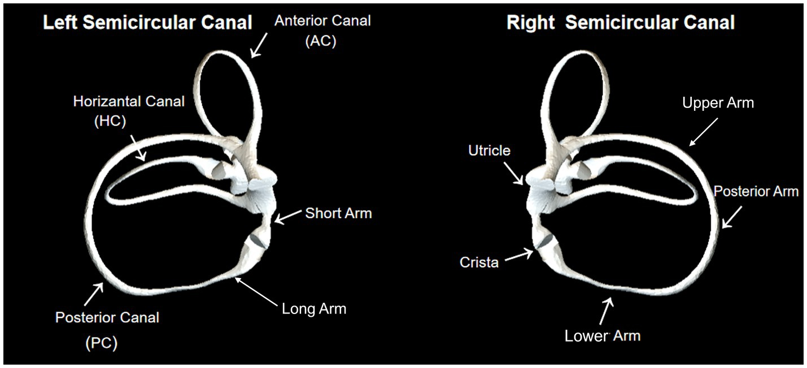
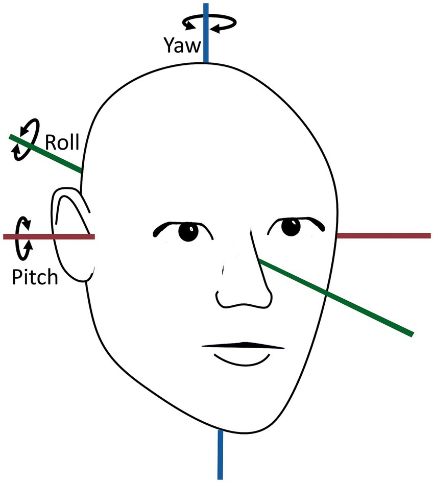
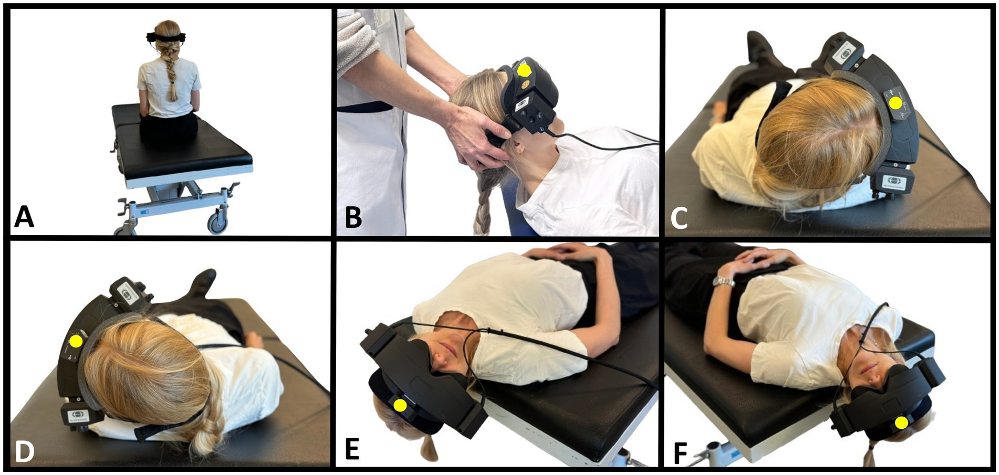
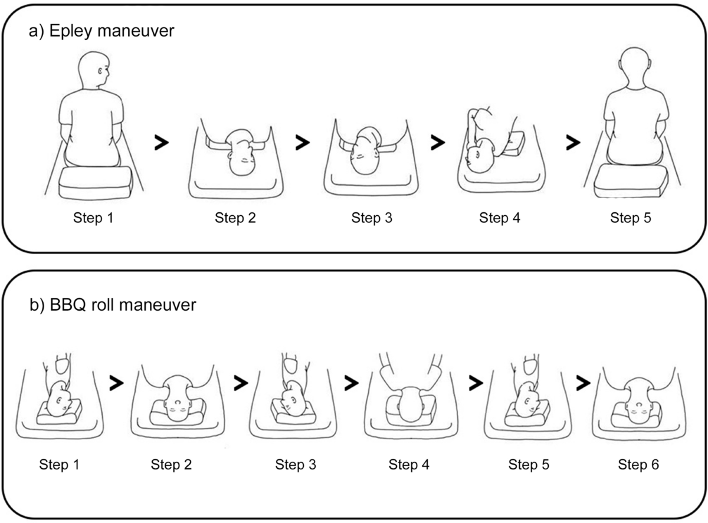
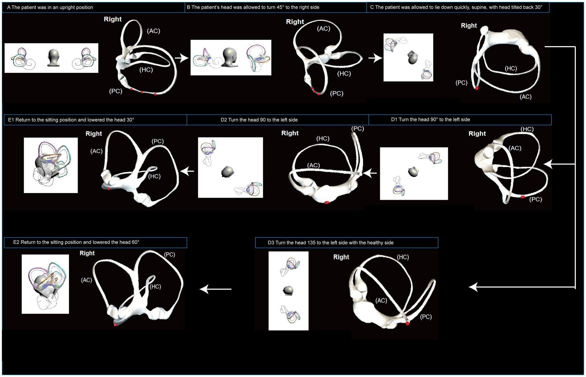
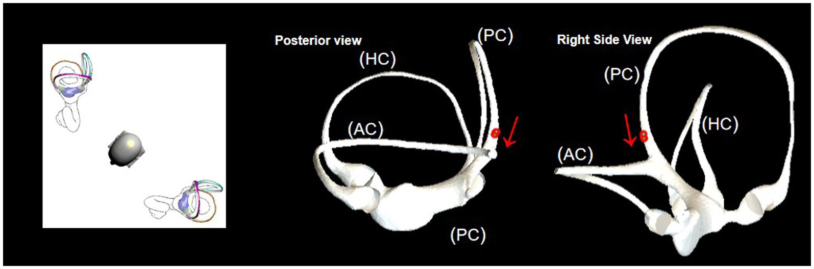

  
Клинический справочный материал

  
Доброкачественное пароксизмальное позиционное головокружение

  
Каналолитиаз заднего и горизонтального каналов. Проба Дикса — Холлпайка и roll-тест. Маневры Эпли, Семона, barbecue roll. Разграничение с вестибулярным нейронитом, болезнью Меньера и центральным позиционным головокружением. Разбор фармакотерапии Алгоритмов: магния сульфат, метоклопрамид, атропин

  

  
С разбором клинического наблюдения: молодой мужчина с позиционным головокружением и неустойчивостью, сомнительный результат пробы Дикса — Холлпайка, кратковременный эффект репозиционных маневров.

  
Серия «Крещение поворотом» · версия 1.0 · 2 сентября 2026 · CC BY-NC-SA 4.0

# Клиническое наблюдение

> **Слово бригаде:** «Последний вызов смены. Молодой мужчина, головокружение при вставании, всё кружится вокруг. В позе Ромберга неустойчив, но сидит и стоит, хотя шатает. Делала ему Дикса — Холлпайка, в какой-то момент с одной стороны показалось, что нистагм. Сделала маневры — на какое-то время стало легче. Потом головокружение вернулось. В дневник записать не успела.» — *А.Н.*

## Описание наблюдения

Мужчина молодого возраста. Жалобы на системное головокружение («всё кружится вокруг»), возникающее при вставании. При осмотре — неустойчивость в позе Ромберга, сохранная способность самостоятельно сидеть и стоять, при ходьбе пошатывание. Выполнена проба Дикса — Холлпайка: при исследовании одной стороны отмечен предположительный нистагм, характеристики которого (латентный период, направление быстрой фазы, длительность, истощаемость) не зафиксированы. После выполнения репозиционных маневров отмечено временное уменьшение симптоматики с последующим возвратом головокружения.

## Анализ признаков

**Системный характер головокружения.** Ощущение вращения окружающих предметов указывает на вестибулярную природу расстройства (в отличие от липотимии, неустойчивости без вращения и психогенного головокружения). Это разграничение сужает дифференциальный ряд, но не разделяет периферические и центральные причины: системное головокружение возникает и при поражении лабиринта, и при поражении ствола и мозжечка.

**Провокация вставанием.** Указание на связь с вставанием допускает две принципиально различные трактовки, требующие разных методов проверки. При ДППГ триггером служит изменение положения головы относительно вектора силы тяжести — укладывание, поворот в постели, запрокидывание головы, наклон вперёд; вставание в этот ряд входит постольку, поскольку сопровождается изменением положения головы. При ортостатической гипотензии триггером является собственно переход в вертикальное положение, а симптом воспроизводится измерением артериального давления лёжа и через 1 и 3 минуты после вставания (диагностический порог — снижение систолического давления на 20 мм рт. ст. или диастолического на 10 мм рт. ст.). Данные ортостатической пробы в наблюдении отсутствуют.

**Неустойчивость в позе Ромберга при сохранной способности стоять.** Периферическое вестибулярное поражение сопровождается неустойчивостью, при которой пациент сохраняет способность стоять и передвигаться с опорой. Невозможность сидеть или стоять без поддержки относится к признакам центрального поражения и в данном наблюдении отсутствовала. Вместе с тем изолированная оценка позы Ромберга не разграничивает вестибулярную атаксию, сенситивную атаксию и мозжечковое поражение; для этого требуются проба Ромберга с сенсибилизацией, координаторные пробы, оценка направления отклонения.

**Возраст.** Пик заболеваемости ДППГ приходится на 50–70 лет; заболевание у молодых пациентов встречается, но требует уточнения этиологии. Основные варианты в этой возрастной группе — посттравматический каналолитиаз (в том числе после лёгкой черепно-мозговой травмы, стоматологических манипуляций, длительного положения с запрокинутой головой), вестибулярная мигрень, дебют иных вестибулярных расстройств. Молодой возраст также повышает относительную значимость центральных причин, включая рассеянный склероз и диссекцию позвоночной артерии.

**Сомнительный нистагм.** Позиционный нистагм при ДППГ заднего канала имеет малую амплитуду и выраженный торсионный компонент, регистрация которого без очков Френцеля или видеонистагмографии затруднена: фиксация взора подавляет периферический нистагм, а торсионные движения глазного яблока при обычном освещении различимы хуже горизонтальных. Формулировка «показалось, что нистагм» отражает объективную ограниченность метода в полевых условиях, а не погрешность осмотра. Диагностически значимыми являются четыре характеристики: латентный период 1–5 секунд, торсионно-вертикальное направление (быстрая фаза — к нижележащему уху и вверх, к лбу), длительность менее 60 секунд, истощаемость при повторении пробы.

**Кратковременное улучшение с последующим возвратом.** Возможные интерпретации: неполное перемещение отоконий с их обратным смещением в канал; естественная флуктуация симптоматики, характерная для ДППГ; переход отоконий в другой полукружный канал (canal switch, описан в 6–8 % случаев после репозиционных маневров); неспецифический эффект изменения положения тела при состоянии иной природы. Кратковременность эффекта сама по себе не подтверждает и не опровергает диагноз ДППГ.

## Дифференциальный ряд

| Состояние | Данные за | Данные против / не оценено |
|---|---|---|
| ДППГ заднего канала | системное головокружение; провокация изменением положения; предположительный позиционный нистагм; временный эффект репозиции | характеристики нистагма не документированы; сторона поражения не установлена; нехарактерный возраст |
| Ортостатическая гипотензия | провокация вставанием; неустойчивость | ортостатическая проба не выполнена; системный характер головокружения нетипичен |
| Вестибулярный нейронит | системное головокружение, неустойчивость | нейронит протекает как однократный непрерывный эпизод длительностью в сутки, а не как приступы при перемене положения |
| Центральное позиционное головокружение | неустойчивость в позе Ромберга; молодой возраст | сохранена способность стоять и ходить; очаговая неврологическая симптоматика не описана |
| Вестибулярная мигрень | молодой возраст; повторность | мигренозный анамнез не уточнён |

## Обсуждение

Наблюдение отражает две методологические особенности диагностики позиционного головокружения на догоспитальном этапе.

Первая касается регистрации результата пробы. Проба Дикса — Холлпайка имеет диагностическую ценность только при документированных характеристиках вызванного нистагма; заключение «проба положительна» без указания латентного периода, направления и длительности не позволяет ни подтвердить диагноз, ни отличить периферический позиционный нистагм от центрального. При невозможности надёжной визуализации нистагма в полевых условиях корректной формулировкой является описание субъективного ответа пациента (воспроизведение головокружения в определённой позиции) с отдельным указанием, что нистагм достоверно не оценён.

Вторая относится к разграничению триггеров. Жалоба «кружится при вставании» объединяет два механизма — позиционный и ортостатический — которые различаются одним измерением артериального давления. Выполнение ортостатической пробы занимает несколько минут и разделяет диагнозы, требующие принципиально различного ведения.

# Анатомия и патогенез

## Полукружные каналы и отолитовый аппарат

Вестибулярный аппарат каждой стороны включает три полукружных канала (задний, горизонтальный, передний), расположенных приблизительно во взаимно перпендикулярных плоскостях, и два отолитовых органа — утрикулюс (маточку) и саккулюс (мешочек).

<figure class="fragment">

<figcaption>Рис. 1. Строение полукружных каналов левого и правого лабиринта. AC — передний канал, HC — горизонтальный, PC — задний. Обозначены утрикулюс, купула (crista), короткое и длинное колено заднего канала. Источник: Chen et al., Front Neurol 2023, CC BY.</figcaption>
</figure>

Каналы реагируют на угловое ускорение. При повороте головы инерция эндолимфы вызывает её смещение относительно стенок канала, что отклоняет купулу — желатинозную мембрану в ампуле канала, в которую погружены реснички волосковых клеток. Отклонение купулы изменяет частоту разрядов вестибулярного нерва.

Утрикулюс и саккулюс реагируют на линейное ускорение и на положение головы относительно силы тяжести. Их рецепторный аппарат покрыт отолитовой мембраной, на поверхности которой располагаются кристаллы карбоната кальция — **отоконии** (отолиты) размером 3–30 мкм. Плотность отоконий превышает плотность эндолимфы, за счёт чего они смещают мембрану под действием силы тяжести.

## Каналолитиаз и купулолитиаз

ДППГ развивается при попадании отоконий, отделившихся от отолитовой мембраны утрикулюса, в полость полукружного канала.

**Каналолитиаз** (Hall, Ruby, McClure, 1979; Epley, 1980) — свободно перемещающиеся отоконии в просвете канала. При изменении положения головы конгломерат отоконий смещается под действием силы тяжести, увлекая за собой эндолимфу и отклоняя купулу. Это создаёт стимул, не соответствующий реальному движению головы, что воспринимается как вращение. Механизм объясняет три ключевые характеристики нистагма при ДППГ: латентный период (время начала движения конгломерата), ограниченную длительность менее 60 секунд (отоконии достигают наиболее низкой точки канала и останавливаются), истощаемость при повторении (дисперсия конгломерата).

**Купулолитиаз** (Schuknecht, 1969) — отоконии, фиксированные на купуле. Купула становится чувствительной к силе тяжести. Нистагм при этом варианте возникает без латентного периода, сохраняется всё время, пока голова находится в провоцирующем положении, и не истощается.

## Распределение по каналам

| Канал | Частота | Особенности |
|---|---|---|
| Задний | 80–90 % | наиболее низко расположен в положении лёжа, что объясняет преобладание; диагностика — проба Дикса — Холлпайка |
| Горизонтальный | 8–15 % | диагностика — supine roll test (проба Пагнини — Мак-Клюра); нистагм горизонтальный, геотропный или апогеотропный |
| Передний | 1–3 % | редок вследствие анатомического положения (самая высокая точка лабиринта); нистагм с направленным вниз вертикальным компонентом требует исключения центрального поражения |

## Этиология

Идиопатический вариант составляет 50–70 % случаев. Установленные причины и факторы риска: черепно-мозговая травма (посттравматический ДППГ, чаще двусторонний и многоканальный), вестибулярный нейронит и лабиринтит в анамнезе, болезнь Меньера, длительное вынужденное положение (операции, стоматологические вмешательства, постельный режим), мигрень, дефицит витамина D и остеопороз (обсуждаемая связь через метаболизм кальция отоконий), пожилой возраст.

Распространённость в течение жизни составляет 2,4 %; годовая заболеваемость — 0,6 %. ДППГ является наиболее частой причиной системного головокружения, составляя 20–30 % обращений по поводу вестибулярных жалоб.

# Клиническая картина

## Временная структура как основа дифференциального диагноза

Подход TiTrATE (Newman-Toker, Edlow, 2015) строит дифференциальный диагноз не на характере ощущения, а на длительности эпизодов и наличии провокации. Вопрос «что именно вы чувствуете — вращение или дурноту?» обладает низкой различительной способностью: пациенты описывают одинаковые состояния разными словами.

| Паттерн | Наиболее вероятные состояния | Метод проверки |
|---|---|---|
| Приступы секунды — минуты, строго при изменении положения головы | ДППГ; ортостатическая гипотензия | проба Дикса — Холлпайка, roll-тест; АД лёжа и стоя |
| Однократный эпизод, часы — сутки, продолжается на момент осмотра | вестибулярный нейронит; инсульт в задней циркуляции | HINTS |
| Повторные спонтанные приступы 20 минут — 12 часов со снижением слуха и шумом в ухе | болезнь Меньера | анамнез, аудиометрия |
| Повторные спонтанные приступы минуты — часы у пациента с сосудистым профилем | ТИА в вертебробазилярной системе | эвакуация; HINTS неприменим |
| Постоянная неустойчивость без приступов | полинейропатия, зрительный и проприоцептивный дефицит, лекарственное влияние | оценка походки, чувствительности, ревизия принимаемых препаратов |

## Характеристика приступа при ДППГ

Длительность отдельного эпизода — от нескольких секунд до 1 минуты, что соответствует времени перемещения отоконий. Продолжительность головокружения свыше нескольких минут при неизменном положении головы противоречит диагнозу.

Провоцирующие положения: укладывание в постель, вставание с постели, поворот на бок в положении лёжа, запрокидывание головы (взгляд вверх, развешивание белья), наклон вперёд (завязывание шнурков).

Сопутствующие проявления: тошнота, реже рвота, неустойчивость. В межприступном периоде часть пациентов отмечает несистемное головокружение и неуверенность при ходьбе (резидуальное головокружение), сохраняющиеся после успешной репозиции у 30–60 % пациентов в течение нескольких суток.

Признаки, не характерные для ДППГ и требующие пересмотра диагноза: снижение слуха, шум в ухе, головная боль, любая очаговая неврологическая симптоматика, непрерывное головокружение в покое.

# Диагностические пробы

## Общие условия выполнения

Пробы выполняются на кушетке или на любой поверхности, позволяющей уложить пациента так, чтобы голова могла быть запрокинута ниже уровня опоры. Пациента предупреждают о вероятном воспроизведении головокружения и тошноты. Глаза остаются открытыми на всём протяжении пробы; фиксация взора подавляет периферический нистагм, поэтому при наличии очков Френцеля или видеонистагмографии их использование повышает чувствительность метода.

<figure class="fragment">

<figcaption>Рис. 2. Оси вращения головы. Yaw — горизонтальный поворот, pitch — сгибание и разгибание, roll — торсионный наклон. Терминология используется в описании репозиционных маневров. Источник: Hentze et al., Front Neurol 2025, CC BY.</figcaption>
</figure>

**Противопоказания к позиционным пробам:** нестабильность шейного отдела позвоночника, острая травма шеи, ревматоидное поражение атланто-аксиального сочленения, выраженный стеноз сонных или позвоночных артерий, подозрение на диссекцию, недавние операции на глазах, шее или позвоночнике, тяжёлая сердечно-лёгочная недостаточность. При боли в шее и подозрении на центральное поражение пробы не выполняются.

<figure class="fragment">

<figcaption>Рис. 3. Положения при позиционных пробах. (A) Исходное положение сидя. (B) Положение лёжа на спине со сгибанием шеи 30°. (C) Supine roll test справа: поворот головы на 90° вправо. (D) Supine roll test слева: поворот на 180° влево. (E) Проба Дикса — Холлпайка справа: поворот головы на 45° вправо с последующим укладыванием и разгибанием шеи на 30° ниже горизонтальной плоскости. (F) Проба Дикса — Холлпайка слева. Жёлтой точкой отмечен датчик регистрации положения головы, использовавшийся в исследовании. Источник: Hentze et al., Front Neurol 2025, CC BY.</figcaption>
</figure>

## Проба Дикса — Холлпайка

Проба выявляет каналолитиаз заднего (и переднего) полукружного канала. Описана Dix и Hallpike в 1952 году.

**Последовательность выполнения:**

1. Пациент сидит на кушетке так, чтобы при укладывании голова оказалась за её краем. Голову поворачивают на **45°** в сторону исследуемого уха.
2. Сохраняя поворот, пациента быстро (за 1–2 секунды) укладывают на спину, запрокидывая голову на **20–30°** ниже горизонтальной плоскости.
3. Положение удерживают **не менее 30 секунд**, наблюдая за глазами пациента.
4. Пациента медленно возвращают в положение сидя, продолжая наблюдение: при ДППГ возникает нистагм противоположного направления меньшей интенсивности.
5. Пробу повторяют для другой стороны.

**Положительный результат при каналолитиазе заднего канала:**

| Характеристика | Значение |
|---|---|
| Латентный период | 1–5 секунд (до 20 секунд) |
| Направление нистагма | торсионный к нижележащему уху в сочетании с вертикальным вверх (к лбу) |
| Длительность | менее 60 секунд |
| Динамика | нарастание с последующим убыванием (crescendo-decrescendo) |
| Реверсия | при возвращении в положение сидя направление меняется на противоположное |
| Истощаемость | уменьшение интенсивности при повторных пробах |
| Субъективно | воспроизведение типичного головокружения |

Операционные характеристики пробы по данным систематического обзора (Halker et al., 2008): чувствительность 79–82 %, специфичность 71–75 %. Отрицательный результат не исключает ДППГ: возможна ремиссия на момент осмотра, недостаточная скорость укладывания, недостаточное разгибание шеи, поражение горизонтального канала. При отрицательной пробе Дикса — Холлпайка и клинической картине, соответствующей ДППГ, выполняется supine roll test.

## Supine roll test (проба Пагнини — Мак-Клюра)

Проба выявляет каналолитиаз горизонтального канала.

1. Пациент лежит на спине, голова приподнята на 30° (положение, при котором горизонтальный канал ориентирован вертикально).
2. Голову быстро поворачивают на **90° вправо**, наблюдают за глазами 30–60 секунд.
3. Голову возвращают в срединное положение, выжидают до прекращения нистагма.
4. Голову быстро поворачивают на **90° влево**, наблюдение повторяют.

**Интерпретация:**

| Вариант | Нистагм | Локализация отоконий | Сторона поражения |
|---|---|---|---|
| Геотропный | горизонтальный, бьёт к нижележащему (к земле) уху при повороте в обе стороны | каналолитиаз горизонтального канала | сторона более интенсивного нистагма |
| Апогеотропный | горизонтальный, бьёт к вышележащему уху | купулолитиаз или отоконии в переднем колене канала | сторона менее интенсивного нистагма |

Нистагм при поражении горизонтального канала интенсивнее и продолжительнее, чем при поражении заднего, и сопровождается более выраженной вегетативной реакцией.

## Признаки центрального позиционного головокружения

Позиционный нистагм не является исключительной принадлежностью ДППГ. Поражения задней черепной ямки (узелок и язычок мозжечка, дорсолатеральные отделы продолговатого мозга, IV желудочек) вызывают центральный позиционный нистагм. Признаки, свидетельствующие против ДППГ:

- отсутствие латентного периода;
- отсутствие истощаемости при повторении;
- длительность более 60 секунд при сохранении положения;
- чисто вертикальный нистагм, направленный вниз (downbeat), особенно при укладывании с запрокинутой головой;
- направление нистагма, не соответствующее плоскости ни одного из каналов;
- несоответствие между выраженностью нистагма и субъективным головокружением (выраженный нистагм при слабом головокружении характерен для центрального поражения);
- сопутствующая очаговая симптоматика: дизартрия, диплопия, дисфагия, атаксия конечностей, нарушения чувствительности;
- невозможность самостоятельно сидеть или стоять.

## Область применимости HINTS

Комплекс HINTS (Head Impulse — Nystagmus — Test of Skew; Kattah et al., 2009) предназначен для разграничения периферического и центрального поражения при **остром продолжающемся вестибулярном синдроме**: непрерывном головокружении со спонтанным нистагмом на момент осмотра. При ДППГ, характеризующемся кратковременными приступами без спонтанного нистагма в межприступном периоде, комплекс неприменим и его результаты не интерпретируются.

Чувствительность HINTS в отношении инсульта при остром вестибулярном синдроме составляет 100 % при специфичности 96 % в исходном исследовании, что превосходит чувствительность МРТ с диффузионно-взвешенными изображениями в первые 24–48 часов (около 80–88 %). Показатели получены при выполнении проб неврологами, специализирующимися на вестибулярных расстройствах; в условиях приёмного отделения и догоспитального этапа воспроизводимость ниже.

Центральный паттерн (мнемоника INFARCT): **I**mpulse **N**ormal — нормальный результат пробы толчка головой; **F**ast-phase **A**lternating — меняющее направление направление быстрой фазы; **R**efixation on **C**over **T**est — вертикальная коррекция при пробе с попеременным прикрытием. Наличие любого из трёх признаков указывает на центральное поражение.

# Репозиционные маневры

## Общие положения

Репозиционные маневры перемещают отоконии из полукружного канала обратно в утрикулюс, где они не вызывают неадекватной стимуляции. Метод является этиопатогенетическим: он устраняет механическую причину, а не подавляет симптом.

Эффективность по данным Кокрейновского обзора (Hilton, Pinder, 2014; 11 исследований, 745 пациентов): полное разрешение головокружения после маневра Эпли в сравнении с имитацией маневра или отсутствием лечения — отношение шансов **4,42** (95 % ДИ 2,62–7,44), доля пациентов с разрешением симптоматики возрастает с 21 % до 56 %. Перевод пробы Дикса — Холлпайка из положительной в отрицательную — отношение шансов **9,62** (95 % ДИ 6,0–15,42; 8 исследований, 507 пациентов). Различий между маневрами Эпли, Семона и Ганса не выявлено. Однократное выполнение маневра Эпли превосходит недельный курс упражнений Брандта — Дароффа трижды в день (ОШ 12,38; 95 % ДИ 4,32–35,47).

Постпроцедурные ограничения положения тела (запрет спать на поражённой стороне, ношение воротника) не улучшают исход: AAO-HNS 2017 даёт **строгую рекомендацию против** их применения.

<figure class="fragment">

<figcaption>Рис. 4. (a) Последовательность положений при маневре Эпли для заднего канала, 5 шагов. (b) Последовательность при маневре barbecue roll (Лемперта) для горизонтального канала, 6 шагов. Источник: Pastor et al., Sci Rep 2023, CC BY.</figcaption>
</figure>

## Маневр Эпли (задний канал)

Описан Epley в 1992 году. Выполняется при подтверждённом пробой Дикса — Холлпайка каналолитиазе заднего канала на установленной стороне.

| Шаг | Положение | Экспозиция |
|---|---|---|
| 1 | Пациент сидит, голова повёрнута на 45° в сторону поражённого уха | — |
| 2 | Быстрое укладывание на спину с сохранением поворота, голова запрокинута на 20–30° ниже горизонтали (положение пробы Дикса — Холлпайка) | 30–60 с, до прекращения нистагма |
| 3 | Поворот головы на 90° в противоположную сторону (итого 45° в сторону здорового уха), запрокидывание сохраняется | 30–60 с |
| 4 | Поворот туловища на бок в сторону здорового уха с продолжением поворота головы; лицо обращено вниз под углом около 45° к горизонтали | 30–60 с |
| 5 | Медленный перевод в положение сидя с лёгким наклоном головы вперёд | — |

Общая продолжительность — 3–5 минут. При сохранении симптоматики маневр повторяют; кумулятивная эффективность после 2–3 повторений достигает 90 %.

<figure class="fragment">

<figcaption>Рис. 5. Ориентация лабиринта и положение конгломерата отоконий (красная точка) на этапах маневра Эпли: A — исходное положение сидя, B — поворот головы на 45°, C — укладывание на спину, D — последовательные повороты головы, E — возвращение в положение сидя. Источник: Chen et al., Front Neurol 2023, CC BY.</figcaption>
</figure>

**Ожидаемые явления во время маневра.** Воспроизведение головокружения и нистагма на шагах 2–4 закономерно и указывает на правильное выполнение. Нистагм того же направления, что и в диагностической пробе (ортотропный), свидетельствует о движении отоконий в нужном направлении; нистагм противоположного направления (реверсивный) указывает на обратное смещение и требует повторения маневра.

**Осложнения.** Тошнота и рвота — наиболее частые. Переход отоконий в горизонтальный канал (canal switch) наблюдается в 6–8 % случаев и распознаётся по смене характера нистагма на горизонтальный; в этом случае выполняется маневр для горизонтального канала. Описаны единичные случаи вагусной реакции с брадикардией и предобморочным состоянием при завершающем этапе маневра (Tumarkin-like phenomenon).

<figure class="fragment">

<figcaption>Рис. 6. Перемещение отоконий из заднего полукружного канала в утрикулюс через общую ножку в положении с запрокинутой головой. Красная стрелка — направление движения. Источник: Chen et al., Front Neurol 2023, CC BY.</figcaption>
</figure>

## Маневр Семона (задний канал)

Альтернатива маневру Эпли при сопоставимой эффективности. Предпочтителен при ограничениях разгибания шеи.

1. Пациент сидит на краю кушетки, голова повёрнута на 45° в сторону, **противоположную** поражённому уху.
2. Быстрое укладывание на бок в сторону **поражённого** уха, затылком вниз; нос обращён кверху. Экспозиция 1–3 минуты.
3. Быстрый перевод через положение сидя в положение лёжа на противоположном боку без изменения поворота головы; лицо обращено вниз. Экспозиция 1–3 минуты.
4. Медленный перевод в положение сидя.

## Barbecue roll (маневр Лемперта, горизонтальный канал)

Выполняется при геотропном варианте каналолитиаза горизонтального канала.

1. Пациент лежит на спине, голова повёрнута на 90° в сторону поражённого уха.
2. Последовательные повороты головы и туловища на 90° в сторону здорового уха с экспозицией 15–30 секунд в каждом положении: срединное положение лёжа на спине → 90° в здоровую сторону → лицом вниз → 270° (на поражённом боку) → возвращение в положение лёжа на спине.
3. Общий поворот составляет 360°. Перевод в положение сидя.

При апогеотропном варианте маневр предваряется приёмами, переводящими отоконии в свободное состояние (маневр Гуфони, встряхивание головой).

## Упражнения Брандта — Дароффа

Пациент из положения сидя быстро укладывается на бок с поворотом головы на 45° вверх, сохраняет положение 30 секунд или до прекращения головокружения, возвращается в положение сидя на 30 секунд, повторяет в противоположную сторону. Цикл выполняется 5 раз, трижды в день.

Метод уступает репозиционным маневрам по эффективности (см. данные Кокрейновского обзора выше) и рассматривается как средство самостоятельного применения при невозможности выполнения маневра специалистом, а также при остаточном головокружении.

# Разграничение с другими вестибулярными заболеваниями

## Вестибулярный нейронит

Острое одностороннее поражение вестибулярной порции преддверно-улиткового нерва, предположительно вирусной или постинфекционной природы.

| Признак | Характеристика |
|---|---|
| Начало | острое, часто после респираторной инфекции |
| Течение | **однократный непрерывный эпизод**; максимум выраженности в первые часы, регресс в течение нескольких суток — недель |
| Головокружение | системное, постоянное, усиливается при движениях головы, но не провоцируется ими |
| Нистагм | спонтанный горизонтально-торсионный, бьёт в сторону здорового уха, подавляется фиксацией взора, направление не меняется |
| Проба толчка головой | патологическая на стороне поражения (корректирующая саккада) |
| Слух | не нарушен (при вовлечении улитки — лабиринтит) |
| Ходьба | отклонение в сторону поражения, способность ходить сохранена |

Терапия: глюкокортикоиды в первые 3 суток ускоряют восстановление вестибулярной функции по данным калорической пробы (Strupp et al., NEJM, 2004; метилпреднизолон 100 мг/сут со снижением). Противовирусные препараты неэффективны и не рекомендованы. Вестибулярные супрессанты применяются не более 24–72 часов: их продолжение замедляет центральную компенсацию.

## Болезнь Меньера

Идиопатический эндолимфатический гидропс. Диагностические критерии Барани-общества (2015):

- **две и более** спонтанных эпизода головокружения длительностью **от 20 минут до 12 часов**;
- документированное аудиометрически снижение слуха на низких и средних частотах на поражённой стороне до, во время или после одного из эпизодов;
- флуктуирующие ушные симптомы (снижение слуха, шум, чувство заложенности) на поражённой стороне;
- отсутствие лучшего объяснения другим диагнозом.

Ключевое отличие от ДППГ — спонтанный характер приступов (не провоцируются положением), их длительность (десятки минут и часы против секунд) и обязательное вовлечение слуха.

## Вестибулярная мигрень

Наиболее частая причина повторных эпизодов головокружения у пациентов молодого и среднего возраста. Эпизоды длительностью от 5 минут до 72 часов, мигренозный анамнез, сопутствующие фото- и фонофобия, зрительная аура. Возможен позиционный компонент, что создаёт сходство с ДППГ; отличие — большая длительность эпизодов и отсутствие типичного истощаемого торсионного нистагма.

## Сводная таблица

| Признак | ДППГ | Нейронит | Меньер | Центральное |
|---|---|---|---|---|
| Длительность эпизода | секунды — 1 мин | сутки, непрерывно | 20 мин — 12 ч | вариабельно |
| Провокация положением | **обязательна** | нет (усиление, не провокация) | нет | возможна |
| Спонтанный нистагм | отсутствует | **есть**, однонаправленный | есть во время приступа | есть, может менять направление |
| Позиционный нистагм | торсионный, истощаемый, латентность | — | — | часто downbeat, без латентности, не истощается |
| Слух | не изменён | не изменён | **снижен, флуктуирует** | может быть снижен при инфаркте AICA |
| Способность стоять | сохранена | сохранена (с опорой) | сохранена | **может отсутствовать** |
| Проба толчка головой | норма | **патологическая** | вариабельна | **норма при головокружении — признак центрального** |
| Ответ на репозицию | **есть** | нет | нет | нет |

# Тактика и фармакотерапия

## Положения Алгоритмов

Согласно разделу «Болезни внутреннего уха» (H81, H83.0, H90 — болезнь Меньера, нарушения вестибулярной функции, ДППГ, вестибулярный нейронит, лабиринтит) Алгоритмов оказания скорой медицинской помощи (Москва, 2025), вестибулярная патология **«не требует лечения на этапе оказания неотложной медицинской помощи»**.

При головокружении, сопровождающемся рвотой, предусмотрено:

| Назначение | Доза и путь |
|---|---|
| ЭКГ (ЭКП) | — |
| Глюкометрия | — |
| Магния сульфат | 2500 мг (10 мл) внутривенно медленно |
| Метоклопрамид | 5–10 мг (1–2 мл) внутривенно |
| Атропин | 1 мг (1 мл) внутримышечно или подкожно |

Вызов бригады скорой медицинской помощи предусмотрен при некупирующемся приступе головокружения и рвоты; при отказе от эвакуации — актив в поликлинику.

При соответствии картины ТИА или синдрому вертебробазилярной системы (G45, G45.0) применяется неврологический раздел: оценка дефицита по шкале LAMS, катетеризация вены, этилметилгидроксипиридина сукцинат 250 мг внутривенно, магния сульфат 2500 мг в разведении, медицинская эвакуация.

## Разбор назначений

Три препарата протокола имеют различную степень обоснованности, и ни один из них не воздействует на механизм ДППГ.

### Метоклопрамид

Антагонист D₂-рецепторов триггерной хеморецепторной зоны и прокинетик. Показание — рвота, а не головокружение. В этом качестве назначение обосновано: рвота при вестибулярном кризе выражена, ограничивает пероральный приём и усугубляет дегидратацию.

Ограничения: экстрапирамидные реакции (острая дистония, окулогирный криз) с частотой около 1 % и повышенным риском у пациентов моложе 30 лет; акатизия. При вестибулярном головокружении у молодого пациента это соотношение риска и пользы требует учёта.

### Магния сульфат

Фармакологическое обоснование применения при вестибулярном головокружении отсутствует. Магний является физиологическим антагонистом кальция и блокатором NMDA-рецепторов, обладает противосудорожным и вазодилатирующим действием; ни один из этих эффектов не относится к патогенезу ДППГ, нейронита или болезни Меньера. Магния сульфат не входит в международные руководства по лечению вестибулярных расстройств. Назначение представляет собой сложившуюся практику, а не доказательное вмешательство.

### Атропин

Назначение допускает два фармакологических обоснования, различающихся по степени доказательности.

**Вестибулярная супрессия.** Мускариновые рецепторы обнаружены во всех вестибулярных ядрах с наибольшей плотностью в медиальном вестибулярном ядре. Антихолинергические средства подавляют разряды нейронов вестибулярных ядер и уменьшают скорость вестибулярного нистагма у человека (обзор: Hain, Uddin, 2003). Атропин — третичный амин, проникающий через гематоэнцефалический барьер, что является необходимым условием центрального действия: антихолинергические препараты, не проникающие через барьер, при укачивании неэффективны.

Ограничения этого обоснования существенны. Доказательная база класса построена на скополамине (гиосцине), а не на атропине; скополамин обладает существенно большей центральной антимускариновой активностью. Кокрейновский обзор по скополамину (Spinks, Wasiak, 2011) относится к **профилактике** укачивания; антихолинергические средства, введённые после развития симптоматики, значительно менее эффективны. Атропин не входит ни в одно международное руководство по лечению головокружения.

**Ваголитическое действие.** Выраженное вестибулярное раздражение вызывает вестибуло-вегетативную реакцию: брадикардию, артериальную гипотензию, бледность, потоотделение, рвоту. Атропин в дозе 1 мг устраняет вагусную брадикардию. Этот механизм объясняет присутствие препарата именно в строке «головокружение и рвота» и является наиболее состоятельной интерпретацией назначения. При отсутствии брадикардии и вегетативной симптоматики данное обоснование не применимо.

**Отдельное следствие для диагностики.** Подавление нистагма антихолинергическим препаратом устраняет признак, на котором строится дифференциальный диагноз между периферическим и центральным поражением. Пациент, доставленный в стационар после введения вестибулярного супрессанта, поступает без интерпретируемой глазодвигательной картины.

### Бензодиазепины

Диазепам в рассматриваемом разделе Алгоритмов не назначен, однако широко применяется в качестве вестибулярного супрессанта. Механизм — усиление ГАМК-ергического торможения нейронов вестибулярных ядер.

При ДППГ бензодиазепины неэффективны по определению: заболевание имеет механическую природу, и препарат не перемещает отоконии. AAO-HNS 2017 формулирует **рекомендацию против** рутинного назначения вестибулярных супрессантов, включая антигистаминные препараты и бензодиазепины, при ДППГ. Обоснование: отсутствие влияния на исход, подавление диагностически значимого нистагма, замедление центральной вестибулярной компенсации, седация и повышение риска падений у пожилых.

При вестибулярном нейроните применение супрессантов ограничивается первыми 24–72 часами острейшего периода.

### Бетагистин

Аналог гистамина, действующий как слабый агонист H₁- и антагонист H₃-рецепторов; предполагаемые эффекты — увеличение кровотока во внутреннем ухе и ускорение центральной компенсации. Широко применяется в России при вестибулярных расстройствах.

Доказательная база ограничена. Кокрейновский обзор по бетагистину при болезни Меньера не выявил убедительных доказательств влияния на головокружение. При ДППГ препарат не влияет на механизм заболевания; исследования его применения касаются остаточного головокружения после успешной репозиции, где результаты противоречивы.

## Соотношение с международными рекомендациями

> **Расхождение РФ ↔ международная практика.** AAO-HNS 2017 (Bhattacharyya et al.) определяет содержание помощи при ДППГ следующим образом: диагностика пробой Дикса — Холлпайка (строгая рекомендация), лечение репозиционным маневром или направление к специалисту, способному его выполнить (строгая рекомендация), рекомендация против рутинного назначения вестибулярных супрессантов, рекомендация против визуализации при типичной картине, строгая рекомендация против постпроцедурных ограничений положения тела. Алгоритмы ДЗМ квалифицируют вестибулярную патологию как не требующую лечения на догоспитальном этапе, а при наличии рвоты предусматривают симптоматическую терапию, репозиционные маневры не включая. Расхождение касается не оценки эффективности маневров, а распределения компетенций: маневр отнесён к амбулаторному и специализированному звену.

## Практическое следствие для догоспитального этапа

Содержание работы бригады при позиционном головокружении сводится к трём задачам, ни одна из которых не является медикаментозной.

**Исключение неотложных состояний.** Глюкометрия, ЭКГ, измерение артериального давления лёжа и стоя, сатурация, температура. Оценка красных флагов центрального поражения. Изолированное головокружение является одной из наиболее частых масок инсульта задней циркуляции: по данным исследований приёмных отделений, до 4–5 % пациентов с изолированным головокружением имеют инсульт, при этом типичная очаговая симптоматика отсутствует.

**Определение временного паттерна.** Разграничение приступообразного позиционного головокружения, острого продолжающегося вестибулярного синдрома и повторных спонтанных приступов определяет и дифференциальный ряд, и применимость HINTS.

**Маршрутизация.** При типичной картине ДППГ без красных флагов — актив в поликлинику с указанием на необходимость выполнения репозиционного маневра оториноларингологом или неврологом. При наличии признаков центрального поражения, при остром вестибулярном синдроме с центральным паттерном HINTS, при некупирующейся рвоте — эвакуация.

# Источники

- Алгоритмы оказания скорой медицинской помощи, Москва, 2025 — разделы «Болезни внутреннего уха (H81, H83.0, H90)», «ТИА и синдром вертебробазилярной артериальной системы (G45, G45.0)».
- Bhattacharyya N., Gubbels S.P., Schwartz S.R. et al. Clinical Practice Guideline: Benign Paroxysmal Positional Vertigo (Update). *Otolaryngology–Head and Neck Surgery*, 2017; 156(3S): S1–S47 — 14 рекомендаций; против рутинных вестибулярных супрессантов и визуализации; против постпроцедурных ограничений положения.
- Hilton M.P., Pinder D.K. The Epley (canalith repositioning) manoeuvre for benign paroxysmal positional vertigo. *Cochrane Database of Systematic Reviews*, 2014; (12): CD003162 — 11 исследований, 745 пациентов; ОШ разрешения 4,42; ОШ конверсии пробы 9,62.
- Dix M.R., Hallpike C.S. The pathology, symptomatology and diagnosis of certain common disorders of the vestibular system. *Proceedings of the Royal Society of Medicine*, 1952; 45(6): 341–354.
- Epley J.M. The canalith repositioning procedure: for treatment of benign paroxysmal positional vertigo. *Otolaryngology–Head and Neck Surgery*, 1992; 107(3): 399–404.
- Schuknecht H.F. Cupulolithiasis. *Archives of Otolaryngology*, 1969; 90(6): 765–778.
- Hall S.F., Ruby R.R., McClure J.A. The mechanics of benign paroxysmal vertigo. *Journal of Otolaryngology*, 1979; 8(2): 151–158.
- Halker R.B., Barrs D.M., Wellik K.E. et al. Establishing a diagnosis of benign paroxysmal positional vertigo through the Dix-Hallpike and side-lying maneuvers. *The Neurologist*, 2008; 14(3): 201–204 — операционные характеристики пробы.
- Kattah J.C., Talkad A.V., Wang D.Z. et al. HINTS to diagnose stroke in the acute vestibular syndrome. *Stroke*, 2009; 40(11): 3504–3510 — чувствительность 100 %, специфичность 96 %.
- Newman-Toker D.E., Edlow J.A. TiTrATE: a novel, evidence-based approach to diagnosing acute dizziness and vertigo. *Neurologic Clinics*, 2015; 33(3): 577–599.
- Strupp M., Zingler V.C., Arbusow V. et al. Methylprednisolone, valacyclovir, or the combination for vestibular neuritis. *New England Journal of Medicine*, 2004; 351(4): 354–361.
- Lopez-Escamez J.A., Carey J., Chung W.-H. et al. Diagnostic criteria for Menière's disease. *Journal of Vestibular Research*, 2015; 25(1): 1–7 — критерии Барани-общества.
- Hain T.C., Uddin M. Pharmacological treatment of vertigo. *CNS Drugs*, 2003; 17(2): 85–100 — мускариновые рецепторы вестибулярных ядер; антихолинергические средства как центральные вестибулярные супрессанты; требование проникновения через ГЭБ.
- Spinks A., Wasiak J. Scopolamine (hyoscine) for preventing and treating motion sickness. *Cochrane Database of Systematic Reviews*, 2011; (6): CD002851.
- Soto E., Vega R. Neuropharmacology of vestibular system disorders. *Current Neuropharmacology*, 2010; 8(1): 26–40.
- Материалы серии «Крещение поворотом»: «Инсульты вертебробазилярного бассейна», «Транзиторная ишемическая атака».
- Материалы Synapse: «Головокружение на ДГЭ: центральное или периферическое» (раздел 28_Vertigo_dizziness) — источник цитируемых положений Алгоритмов и разбора HINTS.

# Источники иллюстраций

| Файл | Что изображено | Источник и лицензия |
|---|---|---|
| `anatomiya_kanalov.jpg` | Строение полукружных каналов, утрикулюс, купула | Chen et al. The effectiveness of the modified Epley maneuver… *Front Neurol*, 2023; 14: 1328896, fig. 2 — [10.3389/fneur.2023.1328896](https://doi.org/10.3389/fneur.2023.1328896), CC BY 4.0 |
| `osi_golovy.jpg` | Оси вращения головы (yaw, pitch, roll) | Hentze et al. Impact of head orientation and head movement in traditional manual diagnostics of BPPV. *Front Neurol*, 2025; 16: 1654404, fig. 1 — [10.3389/fneur.2025.1654404](https://doi.org/10.3389/fneur.2025.1654404), CC BY 4.0 |
| `proby_polozheniya.jpg` | Положения при пробе Дикса — Холлпайка и supine roll test (A–F) | Hentze et al., там же, fig. 2 — CC BY 4.0 |
| `epli_bbq.png` | Последовательность положений при маневре Эпли и barbecue roll | Pastor et al. Feasibility of an inertial measurement unit sensor-based guiding system for BPPV treatment. *Sci Rep*, 2023; 13: 2492, fig. 1 — [10.1038/s41598-023-29685-8](https://doi.org/10.1038/s41598-023-29685-8), CC BY 4.0 |
| `epli_labirint.jpg` | Ориентация лабиринта и положение отоконий на этапах маневра Эпли | Chen et al., там же, fig. 3 — CC BY 4.0 |
| `otolity_utrikulyus.jpg` | Перемещение отоконий в утрикулюс через общую ножку | Chen et al., там же, fig. 5 — CC BY 4.0 |

# Выходные данные

**Материал:** «Доброкачественное пароксизмальное позиционное головокружение». Версия 1.0 от 2 сентября 2026.

**Серия:** «Крещение поворотом» — клинические разборы догоспитальной практики.

**Лицензия:** текст — Creative Commons «С указанием авторства — Некоммерческая — С сохранением условий» 4.0 (CC BY-NC-SA 4.0). Копировать, печатать и раздавать коллегам можно свободно; продавать — нельзя.

**Оговорка.** Материал носит учебный характер. Он не является нормативным документом, не заменяет действующие протоколы, клинические рекомендации и распоряжения службы и не может использоваться как единственное основание для клинического решения. Дозы, показания и маршрутизацию необходимо проверять по действующим первоисточникам. Ответственность за клинические решения несёт медицинский работник, а не автор материала.

**О клинических случаях.** Случаи обезличены: нет имён, дат вызовов, адресов, номеров карт вызова, названий стационаров, бытовые детали изменены. Совпадения с чужой практикой возможны и неизбежны.

**Нашли ошибку?** Сообщить можно через раздел Issues репозитория проекта; исправление выходит новой версией, а изменение фиксируется в журнале изменений.
