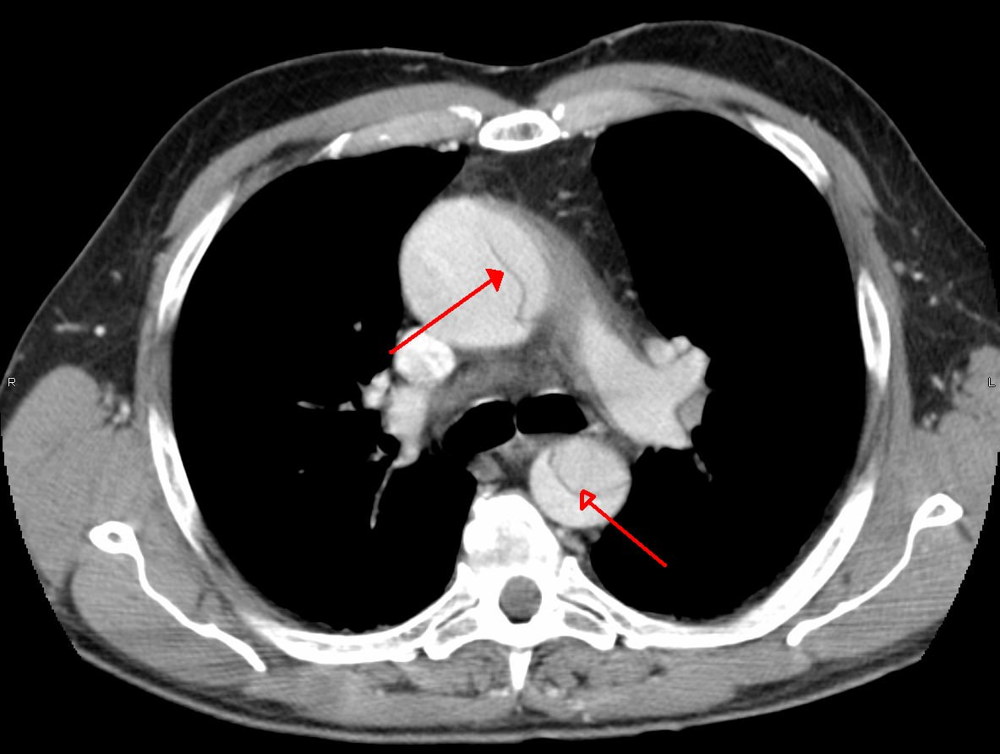
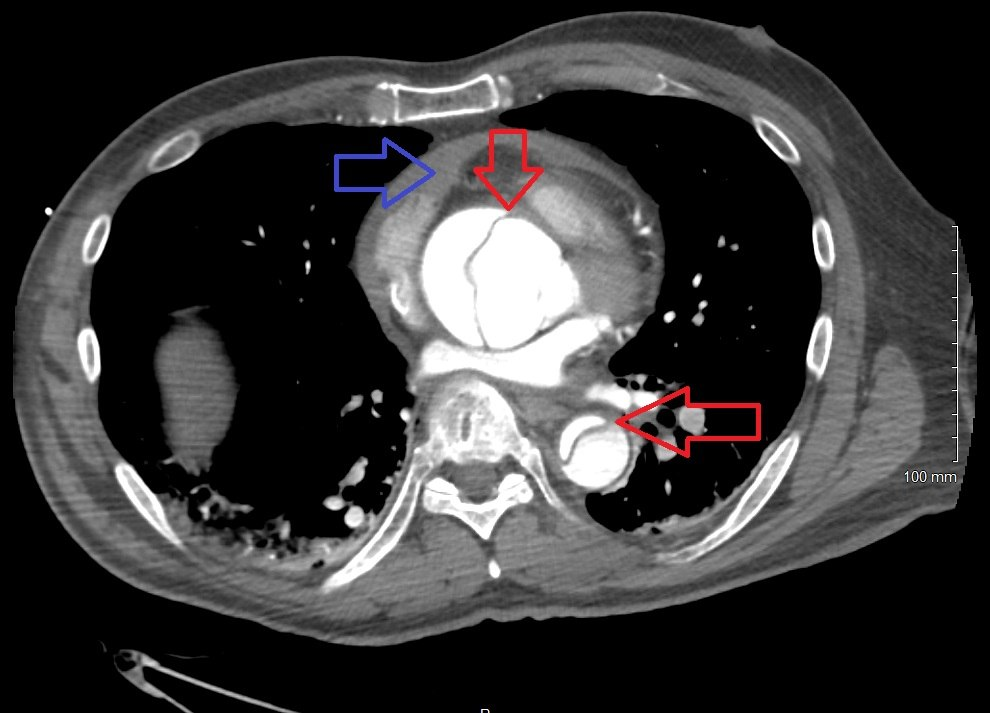

  
Клинический справочный материал

  
40 секунд между кризом и остановкой

  
Безболевое расслоение аорты у пациентки с известной аневризмой корня: прорыв в полость перикарда, острая тампонада, остановка кровообращения по типу электромеханической диссоциации. Снижение артериального давления, непропорциональное дозе, как признак падения наполнения сердца. Истинная и псевдо-ЭМД, ширина комплекса как направление поиска причины, ритмы при отсутствии пульса, подтверждение восстановления кровообращения. Фармакотерапия по приказу № 535: урапидил при гипертоническом кризе, нитраты и азаметония бромид при I71.0, эпинефрин при ритмах, не поддающихся разряду

  

  
С разбором клинического наблюдения: женщина с недавно выявленной аневризмой корня аорты и впервые появившейся гипертензией, монотонное снижение артериального давления после микродозы урапидила, ощущение кома в горле, остановка кровообращения по типу электромеханической диссоциации, безуспешная реанимация. Исход подтверждён судебно-медицинским исследованием: расслоение грудной аорты, гемоперикард.

  
Серия «Крещение поворотом» · версия 3.0 · 24 сентября 2026 · CC BY-NC-SA 4.0

# Клинический случай

## Слово бригаде

«Вызов был на высокое давление. Меряю — 190 верхнее, женщина адекватная, нормально разговаривает, не асоциальная. Масса тела повышена, 120 кг, и это при росте 180 см. Крупная такая. Говорит, что боится, потому что у неё нашли недавно аневризму корня аорты. По выпискам да, подтверждается. Давление раньше не повышалось, а тут два дня подряд высокое: вчера было 160, вызывала скорую, давали моксонидин, сегодня вот опять поднялось. При этом признаков расслоения никаких: боли в грудной клетке, в спине она отрицала. Ну, как бы то ни было, в такой ситуации давление надо снижать.

— Урапидилим?

— Урапидилим.

И вот я 5 мл урапидила развожу 10-й физраствора, ввожу от полученного раствора 2–4 мл. Иду перемерять давление. Смотрю на стрелку: 190 — нет, 180 — нет, 170 — нет, 160 — нет.

— Ого, — говорю, — хорошо снижается.

А сама думаю: „вот это я зарядила урапидила… Ничего себе ответ на препарат!“ Пациентка: „ой, у меня какое-то ощущение… Как ком в горле“. Я хватаю фонарик, смотрю: ничего, не опухшее, нормальный зев. Пациентка закатывает глаза. Теряет сознание. Пульса нет. Мы её на пол, кнопкой на себя реаниматологов, напарник качает, я за дефибриллятором в машину. Когда прибежала — агональное дыхание. Ритм — ЭМД, пульса так же нет, активность регулярная. Наладили мониторинг, венозный доступ, поставили трубку ларингеальную. Ну и всё, так качали, „дышали“ и ждали, когда реаниматологи приедут. Они поставили автопульс, нас отпустили. Потом они почти час качали, безуспешно.» — *Ю.Н.*

## Данные карты вызова

Женщина в постменопаузе, повод к вызову — повышение артериального давления.

Жалобы на давящую головную боль в затылочной области и несистемное головокружение в течение трёх часов. Ангинозной боли и одышки нет. До приезда бригады самостоятельно приняла каптоприл 25 мг без эффекта. Аневризма корня аорты подтверждена выписным эпикризом. Постоянной антигипертензивной терапии не получает. Аллергологический анамнез не отягощён.

Состояние средней тяжести, сознание ясное, 15 баллов по шкале комы Глазго, положение активное. Кожа обычной окраски и влажности, сыпи и отёков нет, температура 36,6 °C. Частота дыхания 16 в минуту, дыхание везикулярное, хрипов нет. Артериальное давление 190/100 мм рт. ст. при привычном, со слов пациентки, 120/80; пульс 70 в минуту, ритмичный; сатурация 98 %. Очаговой и менингеальной симптоматики нет, координаторные пробы выполняет уверенно. Рост 182 см, масса тела около 120 кг.

Электрокардиограмма в 23:28: синусовый ритм с частотой 67 в минуту, электрическая ось отклонена влево, неполная блокада правой ножки пучка Гиса. Изменения сегмента ST не описаны. Диагноз бригады — гипертонический криз.

В 23:48 — потеря сознания, остановка дыхания, на мониторе электромеханическая диссоциация; констатирована клиническая смерть, начаты реанимационные мероприятия. В 23:58 пациентка передана реанимационной бригаде в состоянии клинической смерти.

В анамнезе по данным ЕМИАС значится гипертоническая болезнь 2-й стадии. Запись происходит из вызова, состоявшегося накануне по поводу давления 160 мм рт. ст.; повышение давления в прошлом пациентка отрицала.

Разбор случая приведён в конце материала.

# Вопросы для размышления

Ответы — в конце материала.

1. Электромеханическая диссоциация делится на истинную и псевдо-ЭМД. В чём разница между ними, каким методом её можно установить на месте и что это меняет в прогнозе и лечении?
2. Зачем при ЭМД в первую очередь смотрят на ширину комплекса QRS? Какие причины остановки стоят за узкими комплексами, какие — за широкими, и чем различается лечение в этих двух группах?
3. Как по ЭКГ отличить узловой ритм от идиовентрикулярного и агонального? По какому признаку их различают, если у пациента и до остановки была блокада ножки пучка Гиса?
4. Какими способами можно подтвердить, что кровообращение восстановилось, и какой из них даёт ответ быстрее всего?
5. Почему разрыв аневризмы корня аорты даёт остановку именно по типу ЭМД с узкими комплексами, а не асистолию или фибрилляцию? Почему всё происходит за секунды? Как часто расслоение аорты протекает без боли?
6. Исключает ли нормальная амплитуда комплексов на ЭКГ тампонаду сердца? При каком выпоте появляются низкая амплитуда и электрическая альтернация? По каким причинам может подниматься сегмент ST у пациента с расслоением аорты?
7. Что предусматривают Алгоритмы при расслаивающей аневризме аорты, в чём они расходятся с рекомендациями ESC 2024 и почему это расхождение имеет клиническое значение?

# Электромеханическая диссоциация

## Определение

Электромеханическая диссоциация (ЭМД; в англоязычной литературе pulseless electrical activity, PEA) — это организованная электрическая активность сердца при отсутствии пульса. Электрический процесс продолжается, механический — либо отсутствует, либо слишком слаб, чтобы дать ощутимый выброс. Отсюда и название: два процесса, которые в норме идут вместе, разошлись.

Из определения следует, что организованный ритм на мониторе не противоречит диагнозу ЭМД — он входит в него как обязательная часть. Без электрической активности это была бы асистолия. Синусовый ритм нормальной частоты при отсутствии пульса — такая же ЭМД, как узловой или идиовентрикулярный.

ЭМД и асистолия относятся к ритмам, не поддающимся разряду. Доля ЭМД среди первично зарегистрированных ритмов при внебольничной остановке кровообращения росла последние тридцать лет и сегодня составляет 20–40 % (Myerburg, Circulation, 2013; Gräsner, Resuscitation, 2020). Выживаемость при ЭМД ниже, чем при фибрилляции желудочков, и зависит главным образом от того, устранима ли причина.

## Истинная и псевдо-ЭМД

При ЭМД миокард может либо не сокращаться вовсе, либо сокращаться слабо. По этому признаку выделяют два варианта.

**Истинная ЭМД** — миокард не сокращается. Электрическая активность есть, механического ответа нет.

**Псевдо-ЭМД (pseudo-PEA)** — миокард сокращается, и эти сокращения видны при ультразвуковом исследовании, но выброс слишком мал, чтобы дать пальпируемый пульс. По существу это не остановка сердца, а крайняя степень низкого выброса.

Разница важна для прогноза и тактики. По данным Gaspari et al. (Resuscitation, 2016), если при отсутствии пульса ультразвук показывает сокращения миокарда, вероятность восстановления кровообращения и выживания до госпитализации значительно выше. Тактически псевдо-ЭМД требует вазопрессоров и восполнения объёма при продолжающихся компрессиях.

Клинически эти варианты не различаются: пульса нет в обоих случаях. Единственный способ их разграничить — ультразвук в месте оказания помощи. Именно поэтому он включён в реанимационные протоколы (ERC 2021).

## Ширина комплекса как направление поиска причины

Список обратимых причин остановки (4Г/4Т) содержит восемь состояний и не говорит, с какого начинать. Littmann et al. (Medical Principles and Practice, 2014) предложили начинать с ширины комплекса QRS: она делит причины на две группы с разной физиологией и разным лечением.

| Признак | Узкие комплексы (QRS < 0,12 с) | Широкие комплексы (QRS ≥ 0,12 с) |
|---|---|---|
| Что нарушено | приток крови к сердцу и его наполнение — механическое препятствие | сам миокард или его метаболическая среда |
| Причины | тампонада сердца, напряжённый пневмоторакс, массивная тромбоэмболия лёгочной артерии, гиповолемия и кровопотеря, гиперинфляция лёгких при ИВЛ, разрыв аорты | гиперкалиемия, блокада натриевых каналов (трициклические антидепрессанты, антиаритмики I класса), обширный инфаркт с несостоятельностью левого желудочка, тяжёлый ацидоз, поздняя гипоксия |
| Лечение | объём, декомпрессия, устранение препятствия; главный метод диагностики — ультразвук | кальций, натрия бикарбонат, коррекция калия и ацидоза, оксигенация |
| Частота сокращений | чаще тахикардия | чаще брадикардия |

Физиология этого деления проста. При механическом препятствии наполнению проводящая система и миокард целы, поэтому комплекс сохраняет обычную ширину. Когда поражён сам миокард или нарушена его метаболическая среда, внутрижелудочковое проведение замедляется, и комплекс расширяется. Подход не заменяет список 4Г/4Т, а подсказывает, с какой его половины начинать, когда времени мало.

## Ритмы при отсутствии пульса

| Ритм | P-волны | QRS | Частота | Как отличить |
|---|---|---|---|---|
| Синусовый | положительная P перед каждым QRS в отведении II | как исходно у пациента | 60–100 | наличие ритма ничего не говорит о выбросе |
| Узловой (из АВ-соединения) | синусовых P нет; ретроградные P отрицательны в отведениях II, III и aVF и располагаются перед комплексом, внутри него или после него | узкий, по форме совпадает с собственным синусовым комплексом пациента | 40–60; ускоренный узловой 60–100 | возбуждение идёт по системе Гиса — Пуркинье, поэтому комплекс узкий и привычной формы |
| Идиовентрикулярный | нет | широкий, деформированный, T дискордантна | 20–40 | форма не похожа ни на один комплекс исходной ЭКГ |
| Агональный | нет | широкий, резко деформированный, амплитуда падает | менее 20 | комплексы разной формы, интервалы удлиняются |
| Артефакт компрессий | нет | ритмичные широкие отклонения | равна частоте компрессий, 100–120 | исчезает в паузу, меняется при смене темпа массажа, форма зависит от механики компрессий |

Положение ретроградного зубца P при узловом ритме определяется соотношением двух времён: ретроградного проведения на предсердия и антероградного на желудочки. Если предсердия возбуждаются раньше желудочков, отрицательный зубец P стоит перед комплексом, и интервал PQ при этом составляет 0,12 с или меньше — он короче синусового, поскольку импульс проходит меньший путь до желудочков. При одновременном возбуждении зубец P скрыт в комплексе, при более позднем возбуждении предсердий — следует за ним, деформируя конечную часть комплекса (Bhattad, Jain, StatPearls, 2020). Прежняя номенклатура, связывавшая положение зубца P с уровнем расположения водителя ритма в узле — верхне-, средне- и нижнеузловой ритм, — не используется: положение отражает соотношение времён проведения, а не анатомический уровень очага.

Практическое следствие: отсутствие зубца P перед комплексом не требуется для диагноза узлового ритма, а его наличие не исключает этот ритм. Значение имеют полярность зубца в нижних отведениях и длительность интервала PQ.

Узловой ритм от идиовентрикулярного отличают по ширине и форме комплекса. Узловой даёт узкий комплекс собственной формы пациента, идиовентрикулярный — широкий комплекс новой формы. Частота помогает во вторую очередь: 40–60 против 20–40 в минуту.

Если у пациента и до остановки была блокада ножки пучка Гиса, ширина комплекса перестаёт различать эти ритмы: узловой ритм при блокаде даёт широкий комплекс исходной формы. В этом случае сравнивают форму комплекса с ЭКГ пациента до остановки. Узловой ритм воспроизводит его собственную форму, идиовентрикулярный даёт новую.

Ритм оценивают в паузу компрессий. По приказу ДЗМ Москвы № 535 от 18.05.2023 электрическую активность оценивают каждые 2 минуты (внутр. стр. 10); ERC 2021 ограничивает паузу 10 секундами. Причина ограничения — во время паузы падает коронарное перфузионное давление, и после возобновления массажа оно восстанавливается лишь через несколько компрессий.

## Подтверждение восстановления кровообращения

Восстановление кровообращения устанавливают по признакам механического выброса, а не по виду ритма.

| Метод | Что показывает | Скорость и ограничения |
|---|---|---|
| Капнография (EtCO₂) | резкий подъём — обычно с 10–20 до 35–40 мм рт. ст. и выше — соответствует восстановлению кровообращения (Pokorná, J Emerg Med, 2010); значение ниже 10 мм рт. ст. через 20 минут реанимации — плохой прогностический признак | сразу, без прерывания компрессий; самый быстрый объективный признак |
| Пульс на центральной артерии | наличие механического выброса | нужна пауза не дольше 10 секунд; при низком выбросе ненадёжен, венозную пульсацию на бедренной артерии можно принять за пульс |
| Ультразвук в месте оказания помощи | сокращения миокарда; разграничение истинной и псевдо-ЭМД; жидкость в перикарде; расширенный правый желудочек при тромбоэмболии | секунды при наличии аппарата и навыка; укладывается в паузу |
| Артериальное давление | перфузия | при низком выбросе на манжете часто не определяется |

По приказу № 535 капнометрия и капнография при асистолии и ЭМД предусмотрены для бригад анестезиологии-реанимации (внутр. стр. 10). Линейной бригаде для подтверждения восстановления кровообращения остаются пульс в паузу, самостоятельное дыхание и сознание.

# Острый аортальный синдром как причина остановки кровообращения

## Анатомия корня аорты и путь прорыва в перикард

Корень аорты и начальный отдел восходящей аорты лежат внутри полости перикарда. Разрыв на этом уровне идёт не в средостение и не в плевральную полость, а в перикард — замкнутое пространство, которое плохо растягивается. Поэтому при прорыве проксимальной аорты кровообращение останавливается раньше, чем успевает развиться гиповолемия, а при разрыве дистальной — картина определяется кровопотерей.

## Соотношение расслоения и разрыва стенки аорты

Расслоение и разрыв наружной стенки представляют собой последовательные стадии одного процесса, а не альтернативные события. В аутопсийной серии из 200 случаев расслоения грудной аорты входное повреждение интимы располагалось в восходящей аорте у 82,9 % умерших с типом A по Стэнфорду, а выходное — у 94,3 %; причиной смерти при типе A служила тампонада вследствие прорыва расслоенного канала в полость перикарда в 95,4 % случаев (Wang et al., 2022).

Морфологическая последовательность включает надрыв интимы в восходящей аорте, распространение крови по средней оболочке с образованием ложного канала, истончение наружной стенки и её прорыв в ближайшую полость; для корня и начального отдела восходящей аорты такой полостью служит перикард. Изолированный разрыв стенки без предшествующего расслоения при аневризме корня описывается редко. Клиническое значение разграничения этих стадий невелико: и прорыв расслоенного канала, и разрыв стенки дают гемоперикард с тампонадой и одинаковую по механизму остановку кровообращения.

<figure>
  
  <figcaption>Компьютерная томография органов грудной клетки с контрастированием, аксиальный срез. Расслоение аорты типа A по Стэнфорду. Стрелки указывают на отслоённую интиму в восходящей аорте (вверху) и в нисходящей грудной аорте (внизу): в просвете каждого сосуда виден лоскут, разделяющий истинный и ложный каналы. Кровь в полости перикарда на этом срезе отсутствует.</figcaption>
</figure>

## Гемодинамика острой тампонады

Зависимость между объёмом жидкости в перикарде и давлением в нём нелинейна. При быстром поступлении крови достаточно 150–200 мл, чтобы давление в перикарде превысило давление наполнения правых отделов и диастолическое наполнение желудочков прекратилось (Spodick, N Engl J Med, 2003). При медленном накоплении перикард растягивается и вмещает 1–2 литра без тампонады. Отсюда клиническая асимметрия: хронический выпот объёмом больше литра даёт одышку и отёки, а острый гемоперикард объёмом со стакан останавливает кровообращение за минуты.

Механика тампонады объясняет и тип остановки. Проводящая система и миокард не повреждены, электрическая активность остаётся организованной, комплекс сохраняет обычную ширину, а выброса нет, потому что желудочки не наполняются. Это узкокомплексная ЭМД механической природы — левый столбец таблицы Littmann.

<figure>
  
  <figcaption>Тот же тип расслоения, осложнённый поступлением крови в полость перикарда. Красные стрелки — отслоённая интима в восходящей и нисходящей аорте; синяя стрелка — содержимое полости перикарда, отделяющее сердце от перикардиального листка. Внутриперикардиальное расположение корня аорты и начального отдела восходящей аорты делает этот путь распространения возможным.</figcaption>
</figure>

## Клиническая картина по данным регистра IRAD

Представление о том, что расслоение аорты всегда начинается раздирающей болью в груди или спине, данными регистров не подтверждается.

| Характеристика | Частота | Источник |
|---|---|---|
| Расслоение без боли | 6,4 % | Park, Mayo Clin Proc, 2004 |
| Тип A среди безболевых расслоений | 74,6 % против 60,9 % при болевых | Park, 2004 |
| Предшествующая аневризма аорты у безболевых | 29,5 % против 13,1 % при болевых | Park, 2004 |
| Синкопе у безболевых | 33,9 % против 11,7 % при болевых | Park, 2004 |
| Госпитальная летальность при безболевом течении | 33,3 % против 23,2 % | Park, 2004 |
| Синкопе как первое проявление | около 9 % | Nallamothu, Am J Med, 2002 |
| Тампонада на момент обращения при типе А | около 18 % | Hagan, JAMA, 2000 (IRAD) |
| Асимметрия или отсутствие пульса на конечности при типе А | примерно каждый пятый пациент | Hagan, JAMA, 2000 |
| Вовлечение устья коронарной артерии при типе А | 10–15 % | Hagan, JAMA, 2000 |
| Смертность нелеченого расслоения типа А | 1–2 % в час в первые сутки | Hagan, JAMA, 2000 |

Эти числа несимметричны по диагностической ценности. Асимметрия пульса есть лишь у каждого пятого, поэтому её отсутствие не снижает вероятность диагноза, а наличие — резко повышает. То же с болью: без боли протекает около 6 % расслоений, поэтому её отсутствие исключает диагноз слабо. Более того, у пациента с известной аневризмой аорты отсутствие боли не понижает вероятность расслоения, а повышает её: предшествующая аневризма документирована у 29,5 % безболевых расслоений против 13,1 % болевых (Park, 2004). Предполагаемое объяснение состоит в том, что в уже перестроенной стенке аневризмы расслоение распространяется по изменённой средней оболочке с меньшим раздражением чувствительных окончаний адвентиции, и клиническая картина складывается не из боли, а из её последствий — синкопе, сердечной недостаточности, неврологического дефицита. Безболевые формы распознаются позже болевых, и летальность при них выше: 33,3 % против 23,2 % госпитальной смертности.

## Признаки, затрудняющие распознавание

**Ощущение кома в горле, затруднение глотания, осиплость.** Расширяющийся корень аорты и гематома средостения могут сдавливать пищевод и возвратный гортанный нерв. Симптом ощущается как горловой и направляет осмотр на зев. У пациента с известной аневризмой внезапное ощущение сдавления в горле или за грудиной входит в круг проявлений процесса в средостении.

**Впервые появившаяся артериальная гипертензия.** Гипертоническая болезнь не начинается за один-два дня. Если у пациента с известной аневризмой давление, прежде нормальное, поднялось за сутки-двое и плохо отвечает на таблетки, это соответствует не дебюту гипертонической болезни, а возможному началу аортального процесса — интрамуральной гематоме или локальному надрыву. Такое сочетание составляет показание к эвакуации в стационар.

**Снижение давления, непропорциональное дозе.** Если давление монотонно падает после дозы, при которой такого эффекта фармакологически не бывает, причина — не препарат, а потеря объёма или снижение наполнения сердца. Значение имеет именно несоответствие между дозой и ответом, а не достигнутая цифра.

**Наследственные заболевания соединительной ткани.** Аневризма корня аорты у пациента молодого или среднего возраста, тем более при высоком росте, заставляет думать о наследственной патологии аорты: синдроме Марфана, синдроме Лойса — Дитца, семейной аневризме грудной аорты. При них расслоение развивается при меньшем диаметре аорты и при меньшем давлении, чем при дегенеративной аневризме (ESC 2024).

## Электрокардиографические находки

**Амплитуда комплексов и электрическая альтернация.** Низкая амплитуда и электрическая альтернация — признаки большого, как правило хронического выпота, при котором перикард растянут и вмещает литр и больше. Острая тампонада объёмом 150–200 мл идёт при нормальной амплитуде. Нормальная ЭКГ тампонаду не исключает; диагноз ставится ультразвуком.

**Триада Бека.** Гипотензия, набухшие шейные вены и глухие тоны сердца в полном виде встречаются меньше чем у 40 % пациентов с тампонадой (Spodick, 2003). На вызове триада оценивается плохо: тоны слушают на фоне шума, а наполнение шейных вен при выраженной гиповолемии искажено.

**Подъём сегмента ST.** При остром аортальном синдроме у него два источника.

Первый — вовлечение устья коронарной артерии расслоением корня. Встречается в 10–15 % расслоений типа А, чаще страдает правая коронарная артерия, отсюда картина нижнего инфаркта: подъём во II, III, aVF с реципрокными изменениями в I и aVL. Это расслоение, проявляющееся инфарктом, а не инфаркт, осложнившийся расслоением.

Второй — глобальная ишемия миокарда при остановке кровообращения. Такой подъём возникает при любой длительной остановке независимо от причины, он диффузный, без зональной локализации и без реципрокных изменений, и нарастает со временем.

Клиническое следствие: подъём ST у пациента с известной аневризмой аорты или с подозрением на расслоение — противопоказание к тромболизису и к нагрузочным дозам антикоагулянтов и антиагрегантов до тех пор, пока расслоение не исключено. Тромболизис при расслоении, принятом за инфаркт, ведёт к неконтролируемому кровотечению в перикард.

## Перикардиоцентез при разрыве аорты

При тампонаде вследствие разрыва аорты пункция перикарда на догоспитальном этапе не показана (ESC 2015). Высокое давление в перикарде в этой ситуации сдерживает кровотечение; если его снять, кровотечение становится неконтролируемым. Помощь сводится к эвакуации в стационар с кардиохирургией. В стационаре, если аспирацию всё же выполняют, забирают минимальный объём, достаточный для поддержания выброса, и одновременно готовят операцию.

# Фармакотерапия и тактика по приказу ДЗМ Москвы № 535 от 18.05.2023

Ссылки даны на внутренние страницы приказа: гипертоническая болезнь и гипертонический криз — стр. 40–41, расслаивающая аневризма аорты (I71.0) — стр. 49, остановка сердца с асистолией и электрической активностью без пульса — стр. 10.

## Гипертонический криз

Давление снижают постепенно (внутр. стр. 40). Первая линия — моксонидин 0,2–0,4 мг внутрь (если нет признаков застойной сердечной недостаточности) или каптоприл 12,5–25 мг внутрь. Максимальная суточная доза моксонидина — 0,6 мг в два приёма.

Если давление снизилось меньше чем на 15–25 % от исходного, вводят урапидил: 25 мг (5 мл) разводят в 10 мл натрия хлорида 0,9 % и за 5 минут вводят половину раствора — 12,5 мг. Если снижение на 15–25 % достигнуто, введение прекращают. Если через 5–7 минут снижения нет, вводят вторую половину. Альтернатива — эналаприлат 1,25 мг (1 мл) внутривенно.

Гипертонический криз при расслаивающей аневризме аорты вынесен в отдельный подраздел: тактика определяется разделом I71.0, а не разделом о кризах.

**Урапидил.** Блокирует периферические постсинаптические α₁-адренорецепторы и одновременно стимулирует центральные 5-HT₁A-рецепторы. Второй компонент сдерживает рефлекторную тахикардию — этим урапидил отличается от чистых периферических вазодилататоров. Цель — снижение на 15–25 % от исходного; при исходных 190 мм рт. ст. это примерно 143–161 мм рт. ст.

## Расслаивающая аневризма аорты (I71.0)

Объём по приказу № 535, внутр. стр. 49:

- ЭКГ, пульсоксиметрия;
- катетеризация вены или внутрикостный доступ; натрия хлорид 0,9 % — 250 мл внутривенно капельно;
- изосорбида динитрат 10 мг (10 мл) или нитроглицерин 10 мг (10 мл) в 250 мл натрия хлорида 0,9 % внутривенно со скоростью 8–80 капель в минуту, либо азаметония бромид 0,2–0,5 мл (для бригад АиР) в 20 мл натрия хлорида 0,9 % внутривенно медленно — для поддержания систолического давления не выше 100 мм рт. ст.;
- при боли — морфин до 10 мг (1 мл) внутривенно дробно в минимально эффективной дозе или фентанил 0,05–0,1 мг (1–2 мл) внутривенно;
- при возбуждении — диазепам 10 мг (1 мл) внутривенно;
- при шоке — раздел «Анестезиология и реаниматология», подраздел «Геморрагический шок»;
- медицинская эвакуация в больницу, транспортировка на носилках; при отказе от эвакуации — актив в ОНМПВиДН.

> **Расхождение РФ ↔ международная практика.** Приказ ДЗМ Москвы № 535 от 18.05.2023 при I71.0 предусматривает первой линией вазодилататор — изосорбида динитрат или нитроглицерин капельно, для бригад АиР азаметония бромид — с целевым систолическим давлением не выше 100 мм рт. ст. Целевая частота сердечных сокращений не задана. ESC 2024 (Mazzolai, Eur Heart J, 2024) первой линией называет внутривенный бета-адреноблокатор — эсмолол или лабеталол, при непереносимости верапамил или дилтиазем — с целевой частотой меньше 60 в минуту и систолическим давлением 100–120 мм рт. ст.; вазодилататор добавляют, только если давление остаётся высоким после бета-блокады. Причина различия в том, что расслоение распространяется не только под действием давления, но и под действием dP/dt — скорости нарастания давления в аорте, которая зависит от частоты и силы сокращений. Вазодилататор без бета-блокады вызывает рефлекторную тахикардию и повышает dP/dt, то есть при формально снижающемся давлении может способствовать распространению расслоения. Метопролол в укладке есть; Алгоритмы предусматривают его при гипертоническом кризе с частотой 100 и больше в минуту в дозе 12,5–25 мг внутривенно. Практический вывод: при остром аортальном синдроме частота сердечных сокращений контролируется так же строго, как давление, а тахикардия на фоне инфузии нитрата — это проблема, а не фон.

## Остановка кровообращения: асистолия и ЭМД

Объём по приказу № 535, внутр. стр. 10:

- компрессии грудной клетки с частотой 100–120 в минуту;
- если интубационная трубка или надгортанное устройство ещё не установлены — санация верхних дыхательных путей, масочная ИВЛ дыхательным мешком 30 : 2 с компрессиями;
- дефибрилляция противопоказана;
- катетеризация вены или внутрикостный доступ; эпинефрин 1 мг (1 мл) внутривенно каждые 3–5 минут;
- интубация трахеи или надгортанное герметизирующее устройство; далее вентиляция дыхательным мешком 10 в минуту или аппаратная: дыхательный объём 6 мл/кг, частота 10 в минуту, FiO₂ 1,0;
- капнометрия-капнография — для бригад АиР;
- повторная оценка электрической активности сердца каждые 2 минуты;
- фельдшерская бригада вызывает врачебную бригаду с укладкой АиР или бригаду АиР.

При ритмах, не поддающихся разряду, эпинефрин вводят в первые минуты, не откладывая. При фибрилляции желудочков приоритет у дефибрилляции; при ЭМД и асистолии вазопрессор — первое специфическое вмешательство (ERC 2021).

Атропин при асистолии и ЭМД не применяют: он исключён из реанимационных протоколов в 2010 году как не влияющий на исход.

## Прекращение реанимационных мероприятий

Прекращение реанимации регламентировано Правилами определения момента смерти человека (постановление Правительства РФ № 950 от 20.09.2012): мероприятия прекращают, если они признаны абсолютно бесперспективными или неэффективны в течение 30 минут. Критерий — неэффективность, а не вид ритма на мониторе.

# Возвращение к клиническому случаю

**Исходные данные.** Женщина в сознании, ориентирована, артериальное давление 190/100 мм рт. ст., пульс 70 в минуту. Аневризма корня аорты документирована выписным эпикризом. Давление раньше не повышалось; впервые поднялось двумя сутками ранее (160 мм рт. ст., другая бригада вводила моксонидин), на следующий день повторилось. Боль в груди и спине отрицает. Масса тела около 120 кг при росте 182 см — индекс массы тела примерно 36 кг/м².

**Известная аневризма и впервые появившаяся гипертензия.** Каждый элемент этой картины сам по себе рутинный. Их сочетание — аневризма корня аорты плюс гипертензия, которая появилась впервые, нарастает по дням и не отвечает на таблетки, — соответствует описанному выше паттерну возможного начавшегося аортального процесса. Ретроспективно это единственный признак, который был доступен до остановки и позволял ставить вопрос об эвакуации, а не о купировании криза на месте.

Гипертоническая болезнь 2-й стадии, значащаяся в анамнезе по данным ЕМИАС, этому не противоречит. Запись внесена по итогам вызова, состоявшегося накануне, и отражает не установленный ранее диагноз, а кодировку того самого эпизода, с которого началась нынешняя история. Подтянутый из базы анамнез в подобной ситуации способен замаскировать именно то, что важно: новизну гипертензии.

Наследственная патология аорты — синдром Марфана, синдром Лойса — Дитца, семейная аневризма грудной аорты, — при которой расслоение развивается при меньшем диаметре и меньшем давлении, в этом наблюдении маловероятна: возраст постменопаузальный, а аневризма корня в этом возрасте чаще дегенеративная. Рост 182 см оставляет вопрос открытым, но данных, позволяющих его решить, в наблюдении нет.

**Доостановочная электрокардиограмма.** За двадцать минут до остановки зарегистрирован синусовый ритм с частотой 67 в минуту, отклонение электрической оси влево и неполная блокада правой ножки пучка Гиса. Блокада неполная, то есть комплекс не выходит за 0,12 с, и деление ритмов на узкие и широкие при последующей остановке сохраняло силу: зарегистрированная затем ЭМД с организованной активностью относится к узкокомплексной группе. Изменений сегмента ST не описано, что снимает вопрос о вовлечении устья коронарной артерии на этом этапе. Наконец, сама запись — тот эталон морфологии, сравнение с которым позволяет отличить узловой ритм от идиовентрикулярного; в условиях состоявшейся реанимации такое сравнение доступно только при разборе.

**Первая линия терапии до приезда бригады.** Каптоприл 25 мг принят пациенткой самостоятельно и эффекта не дал. По приказу это и есть первая линия при гипертоническом кризе, поэтому переход к урапидилу соответствовал протоколу: следующий шаг предусмотрен именно при недостаточном снижении давления. Отсутствие ответа на адекватную дозу ингибитора АПФ при этом относится к признакам, которые при известной аневризме корня аорты смещают вопрос от купирования криза на месте к эвакуации.

**Введённая доза урапидила.** Урапидил 25 мг (5 мл) разведён 10 мл натрия хлорида 0,9 %; в 15 мл раствора концентрация около 1,67 мг/мл; введено 2–4 мл, то есть примерно 3,3–6,7 мг. Первый шаг по приказу (внутр. стр. 40) — половина раствора, 12,5 мг за 5 минут. Введена примерно четверть — половина первого протокольного шага.

**Характер снижения давления.** Давление снизилось монотонно, с 190 до 160 мм рт. ст., за время одного измерения, без плато. Формально результат попал в цель: 160 мм рт. ст. — это около 16 % снижения при целевом коридоре 15–25 %. Именно поэтому динамика не насторожила — она совпала с ожидаемой по протоколу. Но получена она дозой, при которой такого ответа фармакологически не бывает. Диагностическое значение имеет именно это несоответствие: оно указывает на снижение наполнения сердца или потерю объёма, а не на действие препарата.

**Ощущение кома в горле.** Симптом расценён как возможное начало анафилаксии; осмотр зева эту версию не подтвердил — отёка нет, зев не изменён. Другое объяснение, соответствующее диагнозу пациентки, — сдавление пищевода расширяющимся корнем аорты и гематомой средостения. В его пользу говорят документированная аневризма, совпадение по времени с необъяснимым падением давления и отсутствие каких-либо других признаков аллергической реакции.

**Тип остановки и хронометраж.** От появления ощущения кома в горле до потери сознания прошло около сорока секунд: этого времени хватило на осмотр зева и заключение об отсутствии отёка. До этого момента пациентка сохраняла сознание и речь, в том числе во время введения препарата. Далее — агональное дыхание и регулярная организованная электрическая активность без пульса, то есть узкокомплексная ЭМД механической природы. Остановка зарегистрирована в 23:48; за последующие десять минут, до передачи реанимационной бригаде в 23:58, линейная бригада выполнила компрессии, обеспечила мониторинг и венозный доступ и установила надгортанное устройство. Отсутствие ответа на реанимацию в течение около часа, включая механические компрессии, согласуется с неустранимым механическим препятствием наполнению сердца.

**Дифференциальный ряд с учётом полученных данных.**

| Признак | Расслоение восходящей аорты с прорывом в перикард и тампонадой | Анафилаксия на урапидил |
|---|---|---|
| Кожные проявления, отёк, бронхоспазм | закономерно отсутствуют | ожидаются в 80–90 % случаев; отсутствовали |
| Секунды от симптома до потери сознания | соответствует прорыву в перикард при критическом объёме 150–200 мл | возможны при парентеральном введении, но обычно предшествует фаза тахикардии с гипотензией |
| Характер снижения давления | монотонное, непропорциональное дозе | ожидается резкий обвал с тахикардией |
| Тип остановки | узкокомплексная ЭМД механической природы | ЭМД возможна при распределительном шоке |
| Ответ на эпинефрин и объём | отсутствует: препятствие механическое | ожидается хотя бы транзиторный |
| Час реанимации без признаков ответа | соответствует | нетипично |
| Фоновая патология | документированная аневризма корня аорты | анафилаксия на урапидил — казуистика; препарат не является либератором гистамина |
| Аллергологический анамнез | значения не имеет | не отягощён; реакцию при первом введении не исключает, но и не поддерживает |

Рабочая версия при выпуске предыдущей редакции — расслоение или разрыв аневризмы корня аорты в полость перикарда с гемоперикардом и тампонадой сердца; анафилаксия оставалась в ряду как альтернатива, снимаемая только заключением. Полученный катамнез эту версию подтвердил и альтернативу снял.

**Данные, оставшиеся несобранными.** Артериальное давление на обеих руках и сравнение пульса на руках и ногах в наблюдении не документированы. Оба признака малочувствительны — асимметрия или отсутствие пульса на конечности описаны примерно у каждого пятого пациента с расслоением типа А, — поэтому их отсутствие вероятность диагноза почти не снижает. Но положительная находка меняет тактику полностью, а измерения занимают меньше минуты; отсутствие результата ограничивает ретроспективную интерпретацию.

**Пределы догоспитального этапа.** Тампонаду вследствие разрыва корня аорты на догоспитальном этапе не устранить: пункция перикарда при этой причине противопоказана, а единственный шанс — кардиохирургическая операционная — определяется временем доставки. Реанимация начата немедленно, компрессии не прерывались, венозный доступ и надгортанное устройство обеспечены параллельно, реанимационная бригада вызвана. Объём соответствует предусмотренному приказом при ЭМД (внутр. стр. 10).

**Исход.** Реанимационная бригада продолжала мероприятия с устройством для механических компрессий около часа. Безуспешно.

**Судебно-медицинское заключение.** По результатам судебно-медицинского исследования установлено расслоение
грудной аорты; в полости перикарда обнаружена кровь.

**Трактовка наблюдения с учётом катамнеза.** Механизм остановки подтверждён: расслоение грудной
аорты с поступлением крови в полость перикарда, тампонада, узкокомплексная электромеханическая диссоциация
механической природы. Анафилаксия на урапидил из дифференциального ряда исключается.

Подтверждение меняет и трактовку двух прижизненных находок.

Первая — монотонное снижение давления с 190 до 160 мм рт. ст. после введения примерно четверти протокольной
дозы урапидила. Ретроспективно это не фармакологический ответ, а начало тампонады: падение наполнения сердца
совпало по времени с введением препарата и было принято за его действие. Совпадение оказалось вдвойне
неудачным, поскольку величина снижения попала в целевой коридор 15–25 % и потому выглядела как успех терапии.

Вторая — отсутствие болевого синдрома. После подтверждения диагноза отсутствие боли перестаёт быть доводом
против расслоения и становится ожидаемой особенностью: у пациентки была документированная аневризма аорты, а
предшествующая аневризма встречается у 29,5 % безболевых расслоений против 13,1 % болевых (Park, 2004).
Сочетание известной аневризмы, впервые появившейся и нарастающей по дням гипертензии и отсутствия боли
соответствует не гипертоническому кризу, а безболевому дебюту острого аортального синдрома.

**Интервал, в пределах которого решение имело значение.** Диагноз расслоения на догоспитальном этапе подтверждается
визуализацией, которой у линейной бригады нет. Доступной альтернативой было решение о маршруте: у пациентки с
документированной аневризмой корня аорты и впервые появившейся гипертензией, не отвечающей на таблетированную
терапию, вопрос стоял не о купировании криза на месте, а об эвакуации. Между первым симптомом прорыва и остановкой прошло около сорока
секунд, то есть времени на диагностику у постели не было в принципе; решение, способное повлиять на исход,
принималось раньше — в тот момент, когда обсуждался объём помощи при кризе. При принятом решении об эвакуации
остановка произошла бы в пути или в приёмном отделении, что при внутриперикардиальном прорыве меняет прогноз
незначительно, но сохраняет единственный теоретический шанс — кардиохирургическую операционную.

# Ответы на вопросы для размышления

**1.** Истинная ЭМД — миокард не сокращается. Псевдо-ЭМД — миокард сокращается, сокращения видны при ультразвуке, но выброс слишком мал для пальпируемого пульса. Клинически они неразличимы, потому что пульса нет в обоих случаях; единственный метод разграничения — ультразвук в месте оказания помощи. Следствие двойное: при псевдо-ЭМД вероятность восстановления кровообращения и выживания значительно выше (Gaspari, Resuscitation, 2016), а лечение — вазопрессоры и восполнение объёма при продолжающихся компрессиях.

**2.** Ширина комплекса подсказывает, с какой половины списка 4Г/4Т начинать. Узкие комплексы (меньше 0,12 с) указывают на механическое препятствие притоку и наполнению: тампонада, напряжённый пневмоторакс, массивная тромбоэмболия, гиповолемия, гиперинфляция при ИВЛ, разрыв аорты. Лечение — объём, декомпрессия, устранение препятствия; главный метод диагностики — ультразвук. Широкие комплексы (0,12 с и больше) указывают на поражение миокарда или его метаболической среды: гиперкалиемия, блокада натриевых каналов, обширный инфаркт, тяжёлый ацидоз, поздняя гипоксия. Лечение — кальций, натрия бикарбонат, коррекция калия и ацидоза, оксигенация. Физиология: при механическом препятствии проводящая система цела и комплекс сохраняет ширину; при поражении миокарда проведение замедляется и комплекс расширяется.

**3.** Узловой ритм: синусовых P нет; ретроградные P отрицательны в отведениях II, III и aVF и располагаются перед комплексом, внутри него или после него в зависимости от соотношения времени ретроградного проведения на предсердия и антероградного на желудочки. Зубец P перед комплексом узловой ритм не исключает: при таком расположении интервал PQ составляет 0,12 с или меньше. Комплекс узкий и по форме совпадает с собственным синусовым комплексом пациента; частота 40–60. Идиовентрикулярный: P нет, комплекс широкий и деформированный, форма не похожа на исходную, частота 20–40. Агональный: комплексы широкие, резко деформированные, разной формы, амплитуда падает, интервалы удлиняются, частота меньше 20. Отсутствие P-волн — не аргумент против узлового или идиовентрикулярного ритма. При исходной блокаде ножки пучка Гиса ширина перестаёт различать ритмы, потому что узловой ритм при блокаде даёт широкий комплекс исходной формы. Тогда сравнивают форму комплекса с ЭКГ пациента до остановки: узловой ритм воспроизводит его собственную форму, идиовентрикулярный даёт новую.

**4.** По скорости: резкий подъём EtCO₂ с 10–20 до 35–40 мм рт. ст. и выше — сразу, без прерывания компрессий (Pokorná, J Emerg Med, 2010); ультразвук — секунды, в паузу, заодно различает истинную и псевдо-ЭМД; пульс на центральной артерии — пауза не дольше 10 секунд, при низком выбросе ненадёжен, венозную пульсацию на бедренной артерии можно принять за пульс; артериальное давление — медленно, при низком выбросе на манжете часто не определяется. Вид ритма к признакам восстановления кровообращения не относится: организованный ритм без пульса — это и есть ЭМД.

**5.** Корень аорты лежит внутри перикарда, поэтому разрыв на этом уровне даёт гемоперикард. Перикард плохо растягивается: при быстром поступлении 150–200 мл крови давление в нём превышает давление наполнения правых отделов, и желудочки перестают наполняться (Spodick, 2003). Проводящая система и миокард при этом целы, электрическая активность остаётся организованной, комплекс сохраняет ширину, а выброса нет — это узкокомплексная ЭМД. Темп определяется малым критическим объёмом: секунды и минуты, без стадии компенсированного шока, характерной для кровотечения в растяжимую полость. Без боли протекает 6,4 % острых расслоений (Park, Mayo Clin Proc, 2004); синкопе служит первым проявлением примерно в 9 % (Nallamothu, Am J Med, 2002), и за ним чаще всего стоит тампонада или вовлечение брахиоцефальных артерий. У пациентов с известной аневризмой аорты доля безболевых форм выше: предшествующая аневризма документирована у 29,5 % безболевых расслоений против 13,1 % болевых. Разрыв и расслоение при этом не альтернативы, а последовательные события: надрыв интимы в восходящей аорте, ложный канал в средней оболочке, прорыв истончённой наружной стенки в перикард; в аутопсийной серии при типе A входное повреждение располагалось в восходящей аорте в 82,9 % случаев, а тампонада служила причиной смерти в 95,4 % (Wang, 2022).

**6.** Нормальная амплитуда тампонаду не исключает. Низкая амплитуда и электрическая альтернация — признаки большого, как правило хронического выпота, при котором перикард растянут и вмещает литр и больше; острая тампонада объёмом 150–200 мл идёт при нормальной амплитуде. Диагноз ставится ультразвуком. Подъём ST при остром аортальном синдроме имеет два источника: вовлечение устья коронарной артерии расслоением корня (10–15 % расслоений типа А, чаще правая коронарная артерия, картина нижнего инфаркта с реципрокными изменениями) и глобальная ишемия при остановке кровообращения (диффузный подъём без локализации и реципрокности, нарастает со временем). Следствие — противопоказание к тромболизису и нагрузочным дозам антикоагулянтов и антиагрегантов до исключения расслоения.

**7.** Приказ № 535 при I71.0 (внутр. стр. 49): ЭКГ и пульсоксиметрия, венозный или внутрикостный доступ, натрия хлорид 0,9 % 250 мл капельно, инфузия изосорбида динитрата 10 мг или нитроглицерина 10 мг в 250 мл со скоростью 8–80 капель в минуту либо азаметония бромид 0,2–0,5 мл для бригад АиР — с целью удержать систолическое давление не выше 100 мм рт. ст.; морфин до 10 мг дробно или фентанил 0,05–0,1 мг при боли; диазепам 10 мг при возбуждении; при шоке — раздел «Геморрагический шок»; эвакуация на носилках. ESC 2024 первой линией называет внутривенный бета-адреноблокатор с целевой частотой меньше 60 в минуту и систолическим давлением 100–120 мм рт. ст., а вазодилататор добавляет только при сохраняющейся гипертензии. Причина различия — роль dP/dt, скорости нарастания давления в аорте, в распространении расслоения. Следствие: вазодилататор без бета-блокады даёт рефлекторную тахикардию и рост dP/dt, поэтому при остром аортальном синдроме частота сердечных сокращений контролируется так же строго, как давление.

# Источники

- Приказ Департамента здравоохранения города Москвы № 535 от 18.05.2023 «Об утверждении Алгоритмов оказания скорой и неотложной медицинской помощи» — раздел «Анестезиология и реаниматология»: остановка сердца, асистолия и электрическая активность сердца без пульса (внутр. стр. 10), геморрагический шок; раздел «Кардиология»: гипертоническая болезнь и гипертонический криз (внутр. стр. 40–41), расслаивающая аневризма аорты I71.0 (внутр. стр. 49); Приложение 52 (скорость инфузии).
- Постановление Правительства РФ от 20.09.2012 № 950 «Об утверждении Правил определения момента смерти человека, в том числе критериев и процедуры установления смерти человека, Правил прекращения реанимационных мероприятий и формы протокола установления смерти человека».
- Littmann L., Bustin D.J., Haley M.W. A simplified and structured teaching tool for the evaluation and management of pulseless electrical activity. *Medical Principles and Practice*, 2014; 23(1): 1–6 — деление ЭМД по ширине комплекса.
- Soar J., Böttiger B.W., Carli P. et al. European Resuscitation Council Guidelines 2021: Adult advanced life support. *Resuscitation*, 2021; 161: 115–151 — продолжительность паузы, оценка ритма, значение EtCO₂, эпинефрин при ритмах, не поддающихся разряду.
- Panchal A.R., Bartos J.A., Cabañas J.G. et al. Part 3: Adult Basic and Advanced Life Support: 2020 AHA Guidelines for CPR and ECC. *Circulation*, 2020; 142(16_suppl_2): S366–S468.
- Gräsner J.-T., Wnent J., Herlitz J. et al. Survival after out-of-hospital cardiac arrest in Europe — results of the EuReCa TWO study. *Resuscitation*, 2020; 148: 218–226 — структура первично зарегистрированных ритмов.
- Myerburg R.J., Halperin H., Egan D.A. et al. Pulseless electric activity: definition, causes, mechanisms, management, and research priorities. *Circulation*, 2013; 128(23): 2532–2541 — рост доли ЭМД, механизмы.
- Pokorná M., Nečas E., Kratochvíl J. et al. A sudden increase in partial pressure end-tidal carbon dioxide at the moment of return of spontaneous circulation. *Journal of Emergency Medicine*, 2010; 38(5): 614–621 — резкий подъём EtCO₂ как признак восстановления кровообращения.
- Gaspari R., Weekes A., Adhikari S. et al. Emergency department point-of-care ultrasound in out-of-hospital and in-ED cardiac arrest. *Resuscitation*, 2016; 109: 33–39 — сокращения миокарда при отсутствии пульса, прогностическое значение.
- Mazzolai L., Teixido-Tura G., Lanzi S. et al. 2024 ESC Guidelines for the management of peripheral arterial and aortic diseases. *European Heart Journal*, 2024; 45(36): 3538–3700 — бета-адреноблокатор первой линии, целевые частота меньше 60 в минуту и систолическое давление 100–120 мм рт. ст., наследственная патология аорты.
- Hagan P.G., Nienaber C.A., Isselbacher E.M. et al. The International Registry of Acute Aortic Dissection (IRAD): new insights into an old disease. *JAMA*, 2000; 283(7): 897–903 — структура клинической картины, асимметрия пульса, тампонада, вовлечение устья коронарной артерии, смертность.
- Park S.W., Hutchison S., Mehta R.H. et al. Association of painless acute aortic dissection with increased mortality. *Mayo Clinic Proceedings*, 2004; 79(10): 1252–1257 — безболевые формы 6,4 %, связь с предшествующей аневризмой аорты, летальность.
- Wang Z., Chen S., Zhu M. et al. The characteristics of thoracic aortic dissection in autopsy-diagnosed individuals: an autopsy study. *Medicine (Baltimore)*, 2022 — локализация входного и выходного повреждений интимы, тампонада как причина смерти при типе A.
- Nallamothu B.K., Mehta R.H., Saint S. et al. Syncope in acute aortic dissection: diagnostic, prognostic, and clinical implications. *American Journal of Medicine*, 2002; 113(6): 468–471 — синкопе как первое проявление, около 9 %.
- Bhattad P.B., Jain V. Junctional rhythm. *StatPearls*, 2020 (обновляемое издание, NCBI Bookshelf) — положение и полярность ретроградного зубца P, интервал PQ при узловом ритме.
- Spodick D.H. Acute cardiac tamponade. *New England Journal of Medicine*, 2003; 349(7): 684–690 — зависимость «давление — объём» перикарда, критический объём при остром накоплении, ограничения триады Бека.
- Adler Y., Charron P., Imazio M. et al. 2015 ESC Guidelines for the diagnosis and management of pericardial diseases. *European Heart Journal*, 2015; 36(42): 2921–2964 — тампонада, показания и ограничения перикардиоцентеза, в том числе при расслоении аорты.
- Материалы серии «Крещение поворотом»: «Боль в груди после инвазивной кардиологии», «Высокоэнергетическая травма».

# Источники иллюстраций

| Файл | Что изображено | Источник и лицензия |
|---|---|---|
| `type_a_dissection.jpg` | КТ с контрастированием: расслоение аорты типа A по Стэнфорду, лоскут интимы в восходящей и нисходящей аорте | James Heilman, MD, Wikimedia Commons, CC BY-SA 3.0 |
| `dissection2018_pericardial.jpg` | КТ с контрастированием: расслоение типа A с выпотом в полости перикарда | James Heilman, MD, Wikimedia Commons, CC BY-SA 4.0 |

Иллюстрации распространяются на условиях собственных лицензий, указанных в таблице, и не подпадают под лицензию текста материала.

# Выходные данные

**Материал:** «40 секунд между кризом и остановкой». Версия 3.0 (в версиях 1.0–2.0 материал назывался «Электромеханическая диссоциация на вызове»). По сравнению с версией 2.0 внесён катамнез: судебно-медицинским исследованием установлено расслоение грудной аорты с гемоперикардом. Соответственно пересмотрены дифференциальный ряд, трактовка динамики артериального давления и трактовка безболевого течения; добавлен подраздел о последовательности расслоения и прорыва; ссылки на догоспитальную тактику приведены к приказу ДЗМ Москвы № 535 от 18.05.2023 с указанием внутренних страниц.

**Серия:** «Крещение поворотом» — клинические разборы догоспитальной практики.

**Лицензия:** текст — Creative Commons «С указанием авторства — Некоммерческая — С сохранением условий» 4.0 (CC BY-NC-SA 4.0). Копировать, печатать и раздавать коллегам можно свободно; продавать — нельзя.

**Оговорка.** Материал носит учебный характер. Он не является нормативным документом, не заменяет действующие протоколы, клинические рекомендации и распоряжения службы и не может использоваться как единственное основание для клинического решения. Дозы, показания и маршрутизацию необходимо проверять по действующим первоисточникам. Ответственность за клинические решения несёт медицинский работник, а не автор материала.

**О клинических случаях.** Случаи обезличены: нет имён, дат вызовов, адресов, номеров карт вызова, названий стационаров, бытовые детали изменены. Совпадения с чужой практикой возможны и неизбежны.

**Нашли ошибку?** Сообщить можно через раздел Issues репозитория проекта; исправление выходит новой версией, а изменение фиксируется в журнале изменений.
