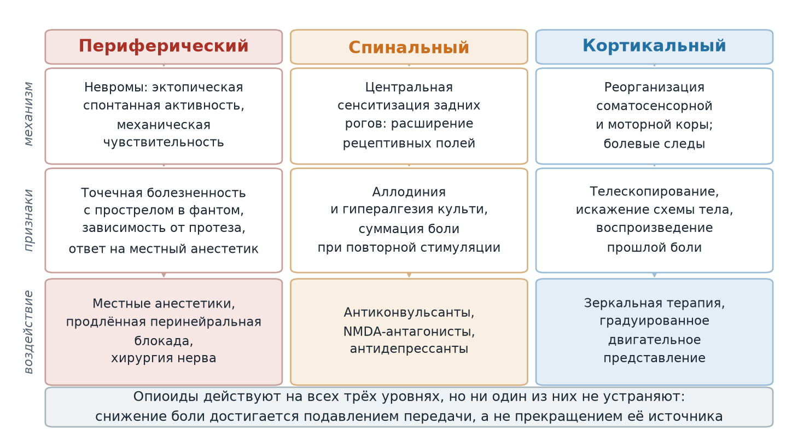
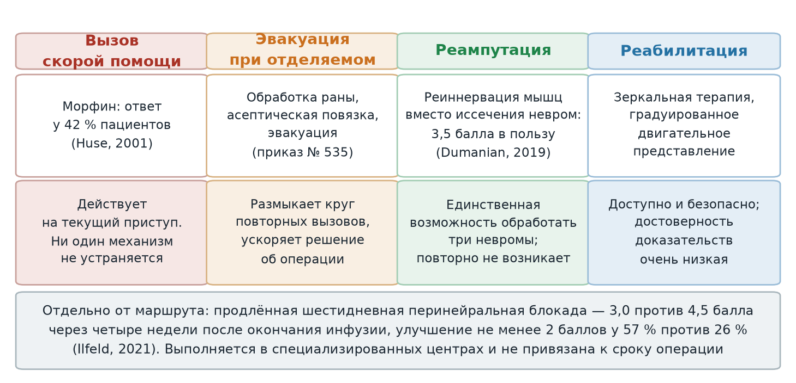

  
Клинический разбор

  
Фантом, который возвращает подрыв

  
Фантомная боль после минно-взрывной травмы: механизмы, доказательная фармакология, границы опиоидной анальгезии на линии, невромы и остеомиелит культи

  

  
Ночной вызов к пациенту с ампутацией голени после минно-взрывной травмы: синдром фантома конечности с болью, повторяющееся переживание момента подрыва, остеомиелит большеберцовой кости культи с функционирующими свищами, три невромы, ожидание реампутации. Рассмотрены механизмы формирования фантомной боли на трёх уровнях нервной системы, доказательная база морфина, габапентина, кетамина и немедикаментозных методов, ограничения длительной опиоидной терапии, а также объём помощи и маршрутизация, предусмотренные при остеомиелите.

  
Серия «Крещение поворотом» · версия 1.2 · 27 сентября 2026 · CC BY-NC-SA 4.0

# Клинический случай

## Слово бригаде

«Вызов был ночью к бывшему военному, участнику СВО. В анамнезе минно-взрывная травма, ампутация правой нижней конечности до уровня верхней трети голени. Синдром фантома конечности с болью. Коленный сустав не затронут. Носит протез, ходит на нем. Фантомные ощущения у него мало того, что разнообразны (мурашки, холод, тепло, собственно, боль), но он говорит, что периодически, раз в два дня он заново переживает момент подрыва: резкую боль, чувство отрыва конечности. Делают ему морфин, по согласованию с ответственным врачом смены. От морфина, как говорит пациент, у него конечность „отрастает заново“, вся, до кончиков пальцев. Оправдать тут использование наркотиков можно еще, наверное, тем, что у него остеомиелит большеберцовой кости, периодически образуются свищи, через которые гной выходит на поверхность, и еще три невриномы. Впереди у него реампутация (ждет очереди), потом реабилитация. В общем, вот не знаю, вроде бы и не правильно тут его „морфинизировать“ постоянно… Но говорит, что габапентин не помогает.» — *Ю.Н.*

## Данные, известные из наблюдения

Мужчина, участник боевых действий. Минно-взрывная травма в анамнезе, ампутация правой нижней конечности на уровне верхней трети голени; коленный сустав сохранён. Пользуется протезом, ходит на нём.

Фантомные ощущения разнородны: парестезии, ощущение холода и тепла, боль. Отдельно — повторяющиеся приступы с периодичностью около двух суток, в которых пациент заново переживает момент подрыва: резкую боль и ощущение отрыва конечности. На фоне введения морфина, по описанию пациента, фантом удлиняется до полного образа конечности с кончиками пальцев.

Сопутствующие последствия травмы: остеомиелит большеберцовой кости культи с периодически формирующимися свищами, через которые отходит гнойное содержимое; три невромы. Планируется реампутация, пациент ожидает очереди, далее — реабилитация.

**Состояние культи на момент осмотра.** Свищи не функционировали: на коже определялись следы ранее существовавших свищевых ходов, при надавливании на эту область отделяемое не получено. Таким образом, на момент вызова признака активного гнойного процесса, вынесенного в приказе в качестве показания к медицинской эвакуации, не было.

Терапия: морфин вводится бригадами по согласованию с ответственным врачом смены. Габапентин, со слов пациента, эффекта не даёт.

**Данные, отсутствующие в наблюдении.** Числовые показатели состояния — артериальное давление, частота сердечных сокращений, температура тела, сатурация — в наблюдении не приведены. Интенсивность боли по шкале, длительность приступа, доза и способ введения морфина, доза и длительность приёма габапентина, давность последнего обращения к хирургу и число вызовов скорой помощи за период также не документированы. Эти пробелы ограничивают ретроспективную интерпретацию и отмечены в разборе там, где они меняют вывод.

Разбор случая приведён в конце материала.

# Вопросы для размышления

Ответы — в конце материала.

1. Фантомная боль формируется на трёх уровнях нервной системы. Какие это уровни, какие признаки указывают на преобладание каждого из них и что из этого следует для выбора препарата?
2. Чем принципиально отличается повторяющееся переживание момента подрыва с болью и ощущением отрыва конечности от психиатрического флешбэка при посттравматическом стрессовом расстройстве? Что из этого следует для маршрутизации?
3. Что известно об эффективности морфина, габапентина, кетамина, амитриптилина и мемантина при фантомной боли и на каких по объёму исследованиях эти сведения основаны?
4. Пациент описывает, что на фоне морфина фантом «отрастает» до полной конечности. Какое явление описано и что о нём известно?
5. Какие немедикаментозные и хирургические вмешательства при фантомной боли имеют доказательства эффективности, и почему предстоящая реампутация создаёт для этого пациента отдельную возможность?
6. Три невромы и хронический остеомиелит культи — каким образом каждое из этих состояний участвует в формировании боли и как каждое влияет на тактику?
7. Что предусматривает приказ ДЗМ Москвы № 535 при остеомиелите и какое из положений этого раздела применимо к данному пациенту?

# Патофизиология фантомной боли

Фантомная боль — боль, ощущаемая в утраченной части тела. Её следует разграничивать с болью в культе, которая ощущается в сохранившихся тканях, и с непатологическими фантомными ощущениями без боли. Код по МКБ-10 для болевой формы — G54.6, для безболевой — G54.7.

Механизмы формирования боли распределены по трём уровням нервной системы; признаки преобладания каждого уровня различаются, что имеет значение при выборе препарата.

<figure>
  
  <figcaption>Рис. 1. Три уровня формирования фантомной боли и точки приложения вмешательств. Клиническая картина у одного пациента обычно складывается из вкладов всех трёх уровней, поэтому воздействие на один уровень редко устраняет боль полностью.</figcaption>
</figure>

## Периферический уровень

Пересечённые нервные стволы образуют невромы — клубки регенерирующих аксонов, лишённых нормальной мишени. В них формируется эктопическая спонтанная активность и механическая чувствительность: неврома генерирует импульсы без стимула и отвечает разрядом на давление. Клинические признаки преобладания этого уровня: локальная точка на культе, при надавливании на которую возникает прострел в фантом (аналог симптома Тинеля), зависимость боли от надевания протеза и от погоды, эффект местного анестетика.

## Спинальный уровень

Утрата афферентного притока и постоянный эктопический разряд ведут к центральной сенситизации задних рогов: расширяются рецептивные поля, снижается порог, усиливается ответ на подпороговые стимулы. Признаки: аллодиния и гипералгезия культи и прилегающих областей, суммация боли при повторной стимуляции.

## Кортикальный уровень

После ампутации соматосенсорная и моторная кора перестраиваются: представительство соседних областей смещается в зону, ранее принадлежавшую утраченной конечности. Величина этого смещения коррелирует с интенсивностью фантомной боли (Flor et al., Nature, 1995; Karl et al., Journal of Neuroscience, 2001). Признаки: искажение схемы тела, телескопирование — субъективное укорочение фантома, перенос ощущений с лица или культи на фантом.

## Сенсомоторные болевые следы

Отдельное явление, описанное задолго до нейровизуализации, — воспроизведение в фантоме тех соматосенсорных событий, которые переживались в конечности до ампутации. Katz и Melzack (Pain, 1990) описали это у 68 пациентов: в фантоме воспроизводились не абстрактные боли, а копии конкретных предампутационных повреждений — с той же локализацией и тем же качеством ощущения. Пациенты настаивали, что переживают реальную боль, а не воспоминание о ней. Такие следы реже возникают, если между болевым событием и ампутацией был безболевой промежуток.

Позднейшее исследование на 283 пациентах (Flinders University) подтвердило модель Flor: соматосенсорные болевые следы чаще формируются при инфекции, операции или функциональном нарушении до ампутации, а у пациентов с такими следами выше сенсорная оценка боли и хуже адаптация к утрате конечности.

Применительно к настоящему наблюдению это означает, что повторяющееся переживание подрыва с резкой болью и ощущением отрыва конечности описано в литературе как сенсомоторный болевой след, а не как психиатрический симптом. Разграничение с флешбэком при посттравматическом стрессовом расстройстве проводится по содержанию переживания: при болевом следе воспроизводится телесное ощущение в определённой части тела, при флешбэке — событие целиком, с образами, звуками, страхом и поведенческим избеганием. Оба состояния могут существовать у одного пациента одновременно, и наличие одного не исключает другого.

# Доказательная фармакология фантомной боли

Систематический обзор Cochrane (Alviar, Hale, Dungca, 2016) включил 14 рандомизированных исследований, 269 участников. Основной вывод обзора состоит не в перечне эффективных средств: долгосрочная эффективность ни одного класса препаратов не установлена, а заключения о краткосрочной эффективности основаны на исследованиях с малыми выборками.

| Препарат или класс | Что показано | Ограничения |
|---|---|---|
| Морфин, внутрь и внутривенно | Снижение интенсивности боли в краткосрочном периоде по сравнению с плацебо | Нежелательные реакции: запор, седация, утомляемость, головокружение, потливость, затруднение мочеиспускания, головокружение, зуд, нарушения дыхания |
| Габапентин | Результаты противоречивы; при объединении двух исследований средняя разница −1,16 балла (95 % ДИ от −1,94 до −0,38) в пользу препарата | Не улучшает функцию, оценку депрессии и качество сна; сонливость, головокружение, головная боль, тошнота |
| Кетамин | Аналгетический эффект по сравнению с плацебо и с кальцитонином | Нежелательные реакции тяжелее, чем у плацебо и кальцитонина: утрата сознания, седация, галлюцинации, нарушения слуха и позиционного чувства |
| Декстрометорфан | Аналгетический эффект показан | Малые выборки |
| Мемантин | Эффект не показан | — |
| Амитриптилин | В сравнении с активным контролем неэффективен | Сухость во рту, головокружение |
| Ботулинический токсин типа A | Не снижал фантомную боль в течение шести месяцев по сравнению с лидокаином и метилпреднизолоном | Одно малое исследование |
| Кальцитонин, местные анестетики | Результаты вариабельны | — |

## Морфин: результаты контролируемых исследований

Ключевое исследование — Huse et al. (Pain, 2001): двойное слепое перекрёстное исследование, 12 пациентов с фантомной болью после односторонней ампутации, морфин сульфат продлённого действия внутрь, доза титровалась от 70 до 300 мг в сутки, две фазы по четыре недели. Статистически значимое снижение боли получено на морфине и не получено на плацебо. Клинически значимый ответ — снижение боли более чем на 50 % — отмечен у 42 % пациентов, частичный ответ 25–50 % — у 8 %. У трёх пациентов при магнитоэнцефалографии получены предварительные данные об уменьшении кортикальной реорганизации одновременно со снижением боли. Внимание на фоне морфина было достоверно ниже.

Результаты допускают три следствия. Эффективность морфина при фантомной боли подтверждена в условиях двойного слепого перекрёстного сравнения с плацебо, то есть не сводится к эффекту ожидания. Клинически значимый ответ достигается приблизительно у половины пациентов, а не у всех, что требует оценки индивидуального ответа, а не назначения по диагнозу. Снижение боли сопровождается снижением внимания, и для пациента, передвигающегося на протезе, это ограничение имеет функциональный характер.

## Обратное развитие телескопирования

Описание «конечность отрастает заново, вся, до кончиков пальцев» соответствует обратному развитию телескопирования. Телескопирование — субъективное укорочение фантома, при котором дистальные отделы приближаются к культе или исчезают, — рассматривается как перцептивный маркёр кортикальной реорганизации. Восстановление полного образа конечности на фоне анальгезии согласуется с данными Huse et al. об уменьшении реорганизации при снижении боли, однако эти данные получены у трёх пациентов и остаются предварительными. В отношении настоящего наблюдения допустима следующая формулировка: пациент описывает изменение схемы тела на фоне введения опиоида; описание соответствует опубликованным наблюдениям, однако не является ни доказательством механизма, ни показанием к продолжению терапии.

## Габапентин: условия оценки эффективности

Утверждение об отсутствии эффекта габапентина требует уточнения, которого в наблюдении нет: доза и длительность приёма. Габапентин при нейропатической боли титруется до эффективной дозы неделями, а прекращение приёма на промежуточной дозе через несколько дней неэффективностью препарата не является. По данным обзора Cochrane эффект габапентина при фантомной боли невелик и противоречив — средняя разница около одного балла, — поэтому и при корректном титровании монотерапия габапентином у этого пациента могла остаться безуспешной. Различие определяет дальнейшую тактику: при незавершённом титровании оно продолжается либо препарат заменяется прегабалином или дулоксетином, при подтверждённой неэффективности применяются методы, действующие на другие уровни формирования боли.

# Ограничения длительной опиоидной терапии

Сомнения, сформулированные в наблюдении, имеют фармакологическое основание и не сводятся к риску формирования зависимости.

| Явление | Механизм | Клиническое следствие |
|---|---|---|
| Толерантность | Десенситизация и интернализация μ-опиоидных рецепторов, адаптация внутриклеточных каскадов | Для прежнего эффекта требуется возрастающая доза; интервал между вызовами сокращается |
| Опиоид-индуцированная гипералгезия | Активация NMDA-рецепторов, усиление глутаматергической передачи, сенситизация вторых нейронов | Боль усиливается на фоне опиоида, а не вопреки ему; увеличение дозы ухудшает состояние |
| Нарушение внимания | Центральное действие препарата | Снижение устойчивости при ходьбе на протезе; в исследовании Huse et al. внимание на морфине было достоверно ниже |
| Расстройство употребления опиоидов | Подкрепление и обусловливание | Формируется тем вероятнее, чем более предсказуемо получение препарата по вызову |
| Подмена маршрута | Организационный | Повторная анальгезия на месте вызова замещает плановое лечение остеомиелита, невром и реампутацию |

Последнее обстоятельство имеет для службы скорой медицинской помощи наибольшее значение. Введение морфина по вызову купирует приступ, не затрагивая ни одного из механизмов, поддерживающих болевой синдром; при регулярном повторении такая практика замещает плановое лечение симптоматическим контролем.

# Вмешательства с подтверждённой эффективностью

## Продлённая перинейральная блокада

Многоцентровое рандомизированное исследование с четверным маскированием (Ilfeld et al., Pain, 2021; 144 пациента) проверяло шестидневную непрерывную перинейральную инфузию ропивакаина 0,5 % против физиологического раствора у пациентов со сформировавшейся фантомной болью. Через четыре недели после окончания инфузии средняя интенсивность фантомной боли составила 3,0 балла против 4,5 балла в группе плацебо (разница 1,3 балла, 95 % ДИ от 0,4 до 2,2; p = 0,003). Улучшение не менее чем на 2 балла по одиннадцатибалльной шкале получили 57 % пациентов против 26 % в группе плацебо (p < 0,001).

Значение результата определяется не величиной эффекта, а его сохранением после прекращения введения препарата: шестидневное прерывание афферентного потока даёт эффект, измеримый спустя несколько недель. Результат согласуется с представлением о поддержании боли возвратными нейронными путями, а не только периферическим источником импульсации.

## Градуированное двигательное представление и зеркальная терапия

Систематический обзор с метаанализом (2023, 11 исследований) показал снижение боли при полной программе градуированного двигательного представления — взвешенная средняя разница −21,29 (95 % ДИ от −31,55 до −11,02) — и при зеркальной терапии: −8,55 (95 % ДИ от −14,74 до −2,35). Изолированное мысленное представление движений эффекта не дало. При сравнении зеркальной терапии с имитацией различий не получено: −4,43 (95 % ДИ от −16,03 до 7,16). Достоверность доказательств авторы оценивают как очень низкую.

Отдельный метаанализ (2021, 10 рандомизированных исследований) показал снижение боли при зеркальной терапии в пределах первого месяца (стандартизованная средняя разница −0,46; 95 % ДИ от −0,79 до −0,13; p = 0,007), причём больший эффект получен у пациентов с длительностью боли более года.

## Хирургия невром при реампутации

Рандомизированное исследование (Dumanian et al., Annals of Surgery, 2019; 28 пациентов) сравнивало целенаправленную реиннервацию мышц — перенос пересечённых нервов на моторные точки мышц культи — со стандартным лечением, то есть иссечением невромы с погружением нерва в мышцу. В модели с повторными измерениями различие изменения фантомной боли в пользу реиннервации составило 3,5 балла (скорректированный ДИ от 0,6 до 6,3; p = 0,03); по боли в культе результат также был в пользу реиннервации, но без статистической значимости (p = 0,10).

Применительно к настоящему наблюдению существенно следующее. Пациенту предстоит реампутация по поводу остеомиелита, и это единственное вмешательство, в ходе которого три имеющиеся невромы могут быть обработаны переносом нервов на мышечные мишени, а не иссечением. Возможность реализуется однократно и зависит от того, выполняется ли методика в учреждении, куда поступит пациент. Информирование пациента и фиксация сведений в документации при этом не требуют от службы дополнительных ресурсов.

# Невромы и остеомиелит культи

## Невромы

Неврома — не опухоль, а неупорядоченная регенерация пересечённого нерва: аксоны, не нашедшие мишени, образуют клубок с эктопической активностью и механической чувствительностью. Термин «невринома», употребляемый в разговорной практике, обозначает иное — доброкачественную опухоль из шванновских клеток; в отношении посттравматической культи корректен термин «неврома».

Диагностическое значение имеет точечная болезненность с проекцией боли в фантом при пальпации и её воспроизводимость в одной и той же точке. Три невромы объясняют одновременно и боль в культе, и часть фантомной боли, и непереносимость протеза при определённом положении гильзы.

## Хронический остеомиелит культи

Хронический остеомиелит культи после минно-взрывной травмы — результат первичного микробного загрязнения раны, нарушенного кровоснабжения тканей и наличия нежизнеспособной костной ткани. Функционирующий свищ означает сообщение очага с внешней средой и продолжающееся отделяемое; в такой ситуации ни антибактериальная терапия, ни местное лечение очага не устраняют, и вопрос решается хирургически — санацией или, как в данном наблюдении, реампутацией.

Для боли остеомиелит значим двояко: он создаёт постоянный ноцицептивный приток, усиливающий центральную сенситизацию, и делает невозможной полноценную опору на протез, что добавляет механическую нагрузку на невромы.

| Объём помощи при остеомиелите по приказу № 535 (внутр. стр. 92) | Содержание |
|---|---|
| При наличии гнойного отделяемого | Обработка ран хлоргексидином 0,05 %, асептическая повязка |
| При патологическом переломе, перифокальной флегмоне | То же и иммобилизация по показаниям |
| При температуре тела ≥ 38 °C | Метамизол натрия 1000 мг (2 мл) внутривенно или внутримышечно |
| При боли при патологическом переломе | Трамадол 100 мг (2 мл) внутривенно |
| Тактика | Медицинская эвакуация в больницу при гнойном отделяемом, патологическом переломе, перифокальной флегмоне, температуре тела ≥ 38 °C; при отказе от эвакуации — рекомендовать обращение в поликлинику |

Отдельного раздела для синдрома фантома конечности с болью (G54.6) приказ не содержит; объём помощи при этом состоянии определяется по ведущему синдрому и по разделам, соответствующим сопутствующей патологии.

# Опиоиды и посттравматическое стрессовое расстройство: границы применимости данных

Результаты одного исследования в этом контексте цитируются наиболее часто и допускают неверное толкование. Holbrook et al. (New England Journal of Medicine, 2010) проанализировали 696 военнослужащих, получивших ранения в Ираке: применение морфина в ходе реанимации и ранней помощи было связано со снижением риска последующего развития посттравматического стрессового расстройства — 61 % против 76 % получавших морфин среди тех, у кого расстройство развилось и не развилось соответственно; отношение шансов 0,47 (p < 0,001), с сохранением значимости после поправки на тяжесть травмы, возраст, механизм и факт ампутации.

Результат относится к анальгезии, выполненной в момент травмы и в первые часы после неё, когда предположительно ограничивается закрепление травматической памяти. На повторное введение морфина спустя годы, при сформированных болевом синдроме и психическом расстройстве, он не распространяется и обоснованием длительной опиоидной терапии служить не может.

<figure>
  
  <figcaption>Рис. 2. Маршрут пациента и вмешательства с доказанной эффективностью на каждом этапе. Повторная анальгезия на месте вызова действует только на текущий приступ; вмешательства, способные изменить течение боли, расположены в плановой части маршрута, и часть из них выполнима однократно — в ходе предстоящей реампутации.</figcaption>
</figure>

# Возвращение к клиническому случаю

**Обоснование введения морфина на данном вызове.** У пациента одновременно присутствуют три источника боли: сенсомоторный болевой след с воспроизведением момента подрыва, три невромы и хронический остеомиелит культи, на момент осмотра без активного отделяемого. Приступ, воспроизводящий обстоятельства подрыва, по описанию сопровождается резкой болью, что соответствует боли высокой интенсивности, а не дискомфорту. Морфин при фантомной боли имеет подтверждённую краткосрочную эффективность, и клинически значимый ответ получают около 42 % пациентов (Huse et al., 2001). Введение препарата по согласованию с ответственным врачом смены выполнено в предусмотренном порядке. В границах одного вызова решение обосновано.

**Ограничения повторного введения в качестве схемы.** Регулярное введение опиоида с интервалом в двое суток не воздействует ни на один поддерживающий механизм и создаёт три собственных: толерантность, опиоид-индуцированную гипералгезию и подкрепление обращения за препаратом. К этому добавляется снижение внимания, показанное в исследовании Huse и значимое для человека, который ходит на протезе. Приведённая в наблюдении формулировка соответствует существу положения, а основания для сомнений имеют фармакологический, а не деонтологический характер.

**Показания к медицинской эвакуации и их отсутствие на данном вызове.** Хронический остеомиелит с гнойным отделяемым прямо назван в приказе № 535 основанием для медицинской эвакуации в больницу (внутр. стр. 92). На момент осмотра свищи не функционировали: определялись только следы свищевых ходов, при надавливании отделяемое не получено, — следовательно, показания к эвакуации по этому основанию отсутствовали, и объём помощи правомерно ограничился анальгезией.

Значение этого положения относится к последующим обращениям. Свищи в данном наблюдении формируются периодически, то есть состояние культи меняется от вызова к вызову. Вызов, совпавший с периодом активного отделяемого, переводит задачу из купирования боли в эвакуацию, при которой пациент попадает к хирургу, а очередь на реампутацию перестаёт быть неопределённой. Пальпация области свищевых ходов, выполненная на данном вызове, является тем действием, которое это различие и устанавливает.

**Габапентин.** Утверждение о неэффективности принято со слов пациента; доза и длительность неизвестны. Установление дозы и длительности приёма выполняется в ходе опроса и меняет дальнейшую тактику: незавершённое титрование и подтверждённая неэффективность требуют разных решений.

**Разграничение приступа с флешбэком.** Повторяющееся переживание подрыва следует разграничить с флешбэком при посттравматическом стрессовом расстройстве, поскольку от этого зависит, к какому специалисту направляется пациент. Разграничение проводится содержанием переживания: телесное ощущение в определённой части тела против переживания события целиком. Оба состояния могут присутствовать одновременно. В наблюдении описано именно телесное воспроизведение — боль и ощущение отрыва конечности, — что соответствует сенсомоторному болевому следу; данных, позволяющих утверждать или исключить сопутствующее расстройство, в наблюдении нет.

**Действия бригады помимо анальгезии.** Зафиксировать в карте вызова частоту приступов, число обращений за период и факт введения опиоида: документированная частота вызовов является аргументом при решении вопроса об очереди на оперативное лечение. Сообщить пациенту о существовании методов, которые в его ситуации имеют доказательства: зеркальная терапия и градуированное двигательное представление — доступны и безопасны, продлённая перинейральная блокада — выполняется в специализированных центрах, целенаправленная реиннервация мышц — возможна в ходе предстоящей реампутации и только в ходе неё. Последнее обстоятельство существенно в наибольшей степени: обработка трёх невром выполняется однократно, и её результат определяет интенсивность боли на последующие годы.

**Пределы догоспитального этапа.** Ни один из механизмов, поддерживающих боль у этого пациента, на догоспитальном этапе неустраним. Объём задач бригады ограничен двумя: купированием приступа и предотвращением замыкания маршрута на повторных вызовах. Первая решается введением анальгетика, вторая — медицинской эвакуацией при наличии показаний и фиксацией сведений, ускоряющих плановое лечение.

**Исход.** На момент составления материала известно, что пациент ожидает реампутации; сведений о её выполнении и об исходе нет.

# Ответы на вопросы для размышления

**1.** Периферический уровень — невромы с эктопической активностью и механической чувствительностью; признаки: точечная болезненность с прострелом в фантом, зависимость от протеза, ответ на местный анестетик. Спинальный уровень — центральная сенситизация задних рогов; признаки: аллодиния и гипералгезия культи, суммация при повторной стимуляции. Кортикальный уровень — реорганизация соматосенсорной и моторной коры, величина которой коррелирует с интенсивностью боли (Flor, 1995); признаки: телескопирование, искажение схемы тела, перенос ощущений на фантом. Следствие для выбора: местные анестетики и хирургия нерва действуют на первый уровень, антиконвульсанты и NMDA-антагонисты — преимущественно на второй, зеркальная терапия и градуированное двигательное представление — на третий; воздействие на один уровень редко устраняет боль полностью.

**2.** При сенсомоторном болевом следе воспроизводится телесное ощущение в конкретной части тела с тем же качеством, что и при исходном повреждении (Katz, Melzack, 1990); при флешбэке воспроизводится событие целиком — с образами, звуками, страхом и избеганием. Первое относится к болевым синдромам и ведёт к противоболевой службе, второе — к психиатрической и психотерапевтической помощи. Состояния могут сочетаться, и выявление одного не отменяет поиска другого.

**3.** По обзору Cochrane 2016 года (14 исследований, 269 участников): морфин, габапентин и кетамин дают краткосрочное снижение боли по сравнению с плацебо; декстрометорфан эффективен; мемантин и амитриптилин эффекта не показали; ботулинический токсин типа A не снижал боль в течение шести месяцев. Результаты по габапентину противоречивы, при объединении двух исследований средняя разница составила −1,16 балла. Долгосрочная эффективность не установлена ни для одного класса. Все выводы основаны на малых выборках с существенной разнородностью, что ограничивает их перенос на отдельного пациента.

**4.** Описано обратное развитие телескопирования — восстановление полного образа конечности на фоне анальгезии. Телескопирование рассматривается как перцептивный маркёр кортикальной реорганизации. В исследовании Huse et al. (2001) у трёх пациентов при магнитоэнцефалографии получены предварительные данные об уменьшении реорганизации одновременно со снижением боли на морфине. Данные предварительные; описание пациента соответствует опубликованным наблюдениям, но само по себе ни механизма не доказывает, ни показанием к продолжению терапии не является.

**5.** Продлённая шестидневная перинейральная блокада: средняя интенсивность боли через четыре недели 3,0 против 4,5 балла, улучшение не менее 2 баллов у 57 % против 26 % (Ilfeld, 2021). Градуированное двигательное представление и зеркальная терапия: снижение боли по метаанализу 2023 года при очень низкой достоверности доказательств; изолированное мысленное представление движений неэффективно. Целенаправленная реиннервация мышц при обработке невром: различие в пользу метода 3,5 балла по фантомной боли (Dumanian, 2019). Предстоящая реампутация создаёт единственную возможность обработать три невромы переносом нервов на мышечные мишени вместо их иссечения; повторно такая возможность не возникает.

**6.** Невромы дают эктопическую импульсацию и механическую чувствительность, то есть постоянный периферический приток и непереносимость протеза при определённом положении гильзы; тактически их обработка относится к предстоящей операции. Остеомиелит создаёт непрерывный ноцицептивный приток, поддерживающий центральную сенситизацию, и препятствует опоре на протез; тактически функционирующий свищ с гнойным отделяемым является показанием к эвакуации и определяет срочность оперативного лечения, а закрывшийся свищ без отделяемого такого показания не создаёт, что и проверяется пальпацией области свищевых ходов.

**7.** Приказ № 535 при остеомиелите (внутр. стр. 92) предусматривает обработку ран хлоргексидином 0,05 % и асептическую повязку при гнойном отделяемом, иммобилизацию по показаниям при патологическом переломе и перифокальной флегмоне, метамизол натрия 1000 мг при температуре ≥ 38 °C, трамадол 100 мг внутривенно при боли при патологическом переломе; медицинская эвакуация показана при гнойном отделяемом, патологическом переломе, перифокальной флегмоне и температуре ≥ 38 °C. К данному пациенту применимо положение о гнойном отделяемом. На описываемом вызове свищи не функционировали и отделяемое при надавливании не получено, поэтому показаний к эвакуации по этому основанию не было; положение приобретает силу на том вызове, который совпадёт с периодом активного отделяемого.

# Источники

- Alviar M.J.M., Hale T., Dungca M. Pharmacologic interventions for treating phantom limb pain. *Cochrane Database of Systematic Reviews*, 2016, CD006380 — 14 исследований, 269 участников; краткосрочная эффективность морфина, габапентина и кетамина, отсутствие эффекта мемантина и амитриптилина, неустановленная долгосрочная эффективность.
- Huse E., Larbig W., Flor H., Birbaumer N. The effect of opioids on phantom limb pain and cortical reorganization. *Pain*, 2001; 90(1–2): 47–55 — 12 пациентов, морфин продлённого действия 70–300 мг в сутки, клинически значимый ответ 42 %, частичный 8 %, снижение внимания, предварительные данные об уменьшении кортикальной реорганизации.
- Ilfeld B.M., Khatibi B., Maheshwari K. et al. Ambulatory continuous peripheral nerve blocks to treat postamputation phantom limb pain: a multicenter, randomized, quadruple-masked, placebo-controlled clinical trial. *Pain*, 2021; 162(3): 938–955 — 144 пациента; 3,0 против 4,5 балла через четыре недели, улучшение ≥ 2 балла у 57 % против 26 %.
- Dumanian G.A., Potter B.K., Mioton L.M. et al. Targeted muscle reinnervation treats neuroma and phantom pain in major limb amputees: a randomized clinical trial. *Annals of Surgery*, 2019; 270(2): 238–246 — 28 пациентов; различие в пользу реиннервации 3,5 балла по фантомной боли.
- Katz J., Melzack R. Pain «memories» in phantom limbs: review and clinical observations. *Pain*, 1990; 43(3): 319–336 — 68 пациентов; воспроизведение предампутационных болей в фантоме, зависимость от безболевого промежутка.
- Flor H., Elbert T., Knecht S. et al. Phantom-limb pain as a perceptual correlate of cortical reorganization following arm amputation. *Nature*, 1995; 375(6531): 482–484 — связь величины кортикальной реорганизации с интенсивностью фантомной боли.
- Limakatso K. et al. The efficacy of graded motor imagery and its components on phantom limb pain and disability: a systematic review and meta-analysis, 2023 — 11 исследований; градуированное двигательное представление −21,29, зеркальная терапия −8,55, мысленное представление движений без эффекта, достоверность доказательств очень низкая.
- Effectiveness of mirror therapy for phantom limb pain: a systematic review and meta-analysis, 2021 — 10 рандомизированных исследований; стандартизованная средняя разница −0,46 в первый месяц, больший эффект при длительности боли более года.
- Holbrook T.L., Galarneau M.R., Dye J.L. et al. Morphine use after combat injury in Iraq and post-traumatic stress disorder. *New England Journal of Medicine*, 2010; 362(2): 110–117 — 696 военнослужащих; отношение шансов 0,47 для ранней анальгезии морфином и последующего развития расстройства.
- Приказ Департамента здравоохранения города Москвы № 535 от 18.05.2023 «Об утверждении Алгоритмов оказания скорой и неотложной медицинской помощи» — остеомиелит M86 (внутр. стр. 92): объём помощи и показания к медицинской эвакуации.

# Источники иллюстраций

| Файл | Что изображено | Источник |
|---|---|---|
| `urovni_boli.png` | Три уровня формирования фантомной боли, признаки преобладания каждого и точки приложения вмешательств | Собственная схема по перечисленным источникам |
| `okno_reamputacii.png` | Маршрут пациента и вмешательства с доказанной эффективностью на каждом этапе | Собственная схема по перечисленным источникам |

Схемы построены скриптом `images/postroit.py`.

# Выходные данные

**Материал:** «Фантом, который возвращает подрыв». Версия 1.2. В версии 1.2 уточнено состояние культи на момент осмотра: свищи не функционировали, отделяемое при надавливании не получено, — и пересмотрен вывод о показаниях к медицинской эвакуации. В версии 1.1 выправлен регистр изложения.

**Серия:** «Крещение поворотом» — клинические разборы догоспитальной практики.

**Лицензия:** текст — Creative Commons «С указанием авторства — Некоммерческая — С сохранением условий» 4.0 (CC BY-NC-SA 4.0).

**Оговорка.** Материал носит учебный характер, не является нормативным документом, не заменяет действующие протоколы и клинические рекомендации и не может использоваться как единственное основание для клинического решения. Дозы, показания и маршрутизацию необходимо проверять по действующим первоисточникам. Ответственность за клинические решения несёт медицинский работник, а не автор материала.

**О клинических случаях.** Случаи обезличены: нет имён, дат вызовов, адресов, номеров карт вызова, названий стационаров, бытовые детали изменены. Совпадения с чужой практикой возможны и неизбежны.

**Нашли ошибку?** Сообщить можно через раздел Issues репозитория проекта; исправление выходит новой версией, а изменение фиксируется в журнале изменений.
