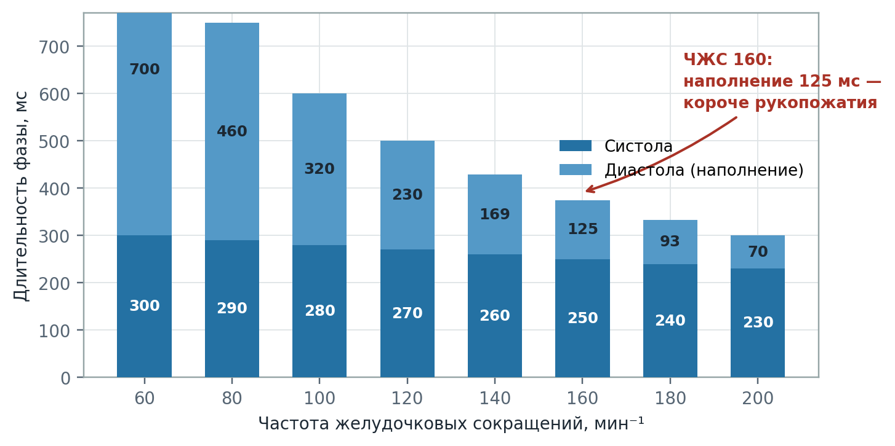
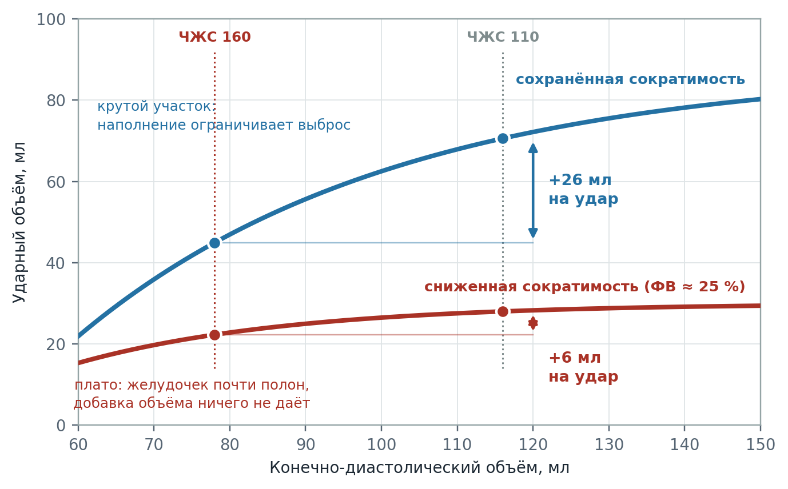
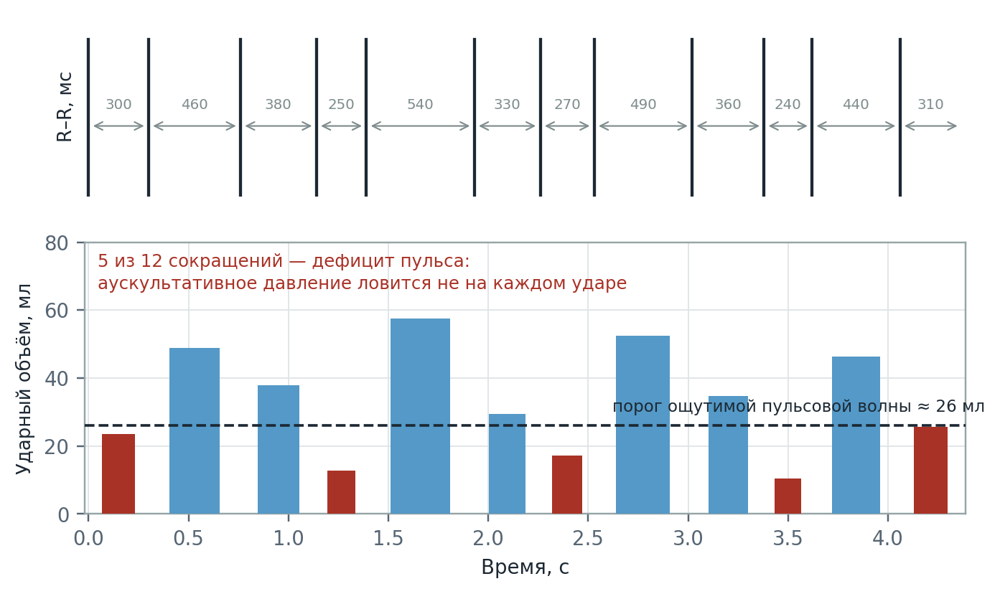
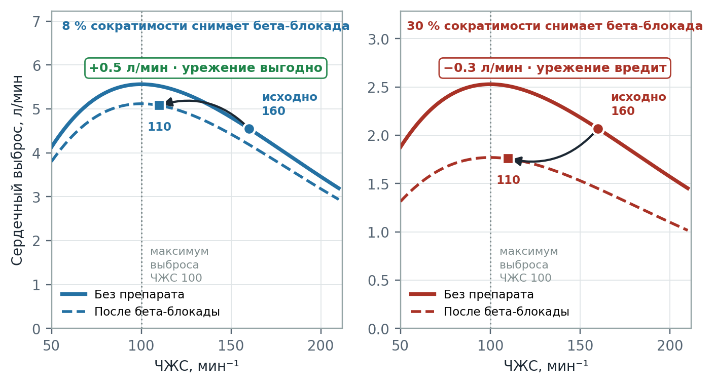
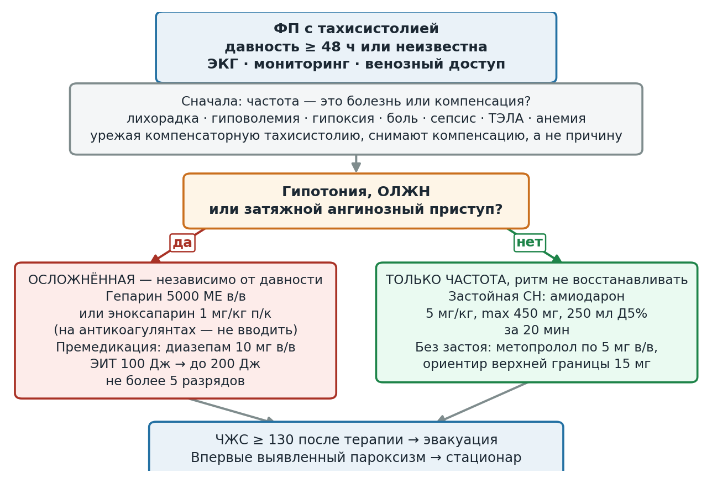

  
Клинический разбор

  
Тахисистолия при фибрилляции предсердий

  
Диастола, которой нет: гемодинамика урежения и развилка «стрелять — не стрелять»

  

  
Физиология наполнения желудочка при высокой частоте, механизм Франка — Старлинга, дефицит пульса при фибрилляции предсердий.

  
Один вызов: пароксизм неуточнённой давности с частотой 160 и систолическим давлением 90 у пациентки 87 лет.

  
Серия «Крещение поворотом» · версия 1.0 · 29 августа 2026 · CC BY-NC-SA 4.0

## Слово бригаде

## Стрелять или не стрелять?

"Женщина 87 лет, живёт одна. Вызов от соседки: «сердце колотится, вторые сутки не встаёт». Родственники в другом городе, связи нет. Что принимает — неизвестно, упаковок в квартире нет.

При осмотре в сознании, отвечает на вопросы правильно, но с замедлением. Кожа прохладная, влажная. Частота дыхания 22 в минуту, при аускультации в базальных отделах единичные незвонкие влажные хрипы, SpO₂ 92 % на воздухе. Живот мягкий, безболезненный. Отёков стоп нет. Температура 36,7 °C, глюкоза 6,1 ммоль/л.

Пульс на лучевой артерии неритмичный, слабого наполнения, местами не определяется. Артериальное давление удаётся измерить с трудом: тоны Короткова слышны непостоянно, первый тон фиксируется на 90 мм рт. ст.

ЭКГ: зубцы P отсутствуют, R–R интервалы хаотичны, комплексы QRS узкие (0,09 с), средняя частота желудочковых сокращений 160 в минуту. Депрессии и элевации сегмента ST нет.

Со слов соседки, двумя днями ранее к пациентке уже приезжала неотложная помощь по тому же поводу, и «что-то с сердцем находили». Карта предыдущего вызова выездной бригаде недоступна. Установить, сколько именно длится текущий пароксизм, невозможно.

Вопрос, стоящий перед бригадой: урежать частоту или проводить электроимпульсную терапию?"

# Вопросы для размышления

Ответы — в конце материала.

1. Почему при частоте 160 в минуту падает артериальное давление, если сердце сокращается чаще, а не реже?
2. Какая доля сердечного цикла приходится на наполнение желудочка при частоте 60 и при частоте 160?
3. Что такое предсердный вклад в наполнение и почему его потеря при фибрилляции предсердий особенно значима у пожилого пациента?
4. Почему при фибрилляции предсердий артериальное давление трудно измерить аускультативно и что такое дефицит пульса?
5. Механизм Франка — Старлинга объясняет, почему урежение частоты может увеличить сердечный выброс. При каком условии тот же приём его уменьшает?
6. Метопролол внутривенно при тахисистолии: в каком случае препарат улучшает гемодинамику, а в каком приводит к её срыву?
7. Как разграничить тахисистолию как причину гипотензии и тахисистолию как компенсацию другого состояния?
8. На каком признаке алгоритм разводит ветвь «только частота» и ветвь «электроимпульсная терапия» и что делать, если пациент оказался на границе?

# Общие положения

Тахисистолическая форма фибрилляции предсердий относится к наиболее частым нарушениям ритма на догоспитальном этапе. Тактическая сложность состоит в том, что одна и та же электрокардиографическая картина требует принципиально разных действий в зависимости от состояния гемодинамики, а сама оценка гемодинамики при фибрилляции предсердий технически затруднена.

Ключевое положение, которое определяет весь дальнейший разбор: при высокой частоте желудочковых сокращений частота перестаёт быть симптомом и становится самостоятельным патогенетическим фактором. Механизм этого перехода — сокращение времени диастолического наполнения желудочка.

Второе положение, симметричное первому и не менее важное: высокая частота желудочковых сокращений может быть не причиной, а следствием — компенсаторной реакцией на гиповолемию, гипоксию, лихорадку, боль, анемию, сепсис или тромбоэмболию лёгочной артерии. Урежение частоты в этом случае устраняет компенсацию, а не заболевание.

Различение этих двух ситуаций — основная интеллектуальная задача бригады.

# Физиология частоты

## Куда девается диастола

Сердечный цикл состоит из систолы и диастолы. При учащении сердечных сокращений длительность цикла уменьшается, однако укорочение фаз происходит крайне неравномерно: механическая систола укорачивается незначительно, тогда как диастола сокращается кратно.

Причина асимметрии — в природе процессов. Систола представляет собой активное сокращение с относительно фиксированной длительностью, определяемой кинетикой кальциевого цикла кардиомиоцита. Диастола же занимает остаток цикла: она уступает время систоле, а не наоборот.

<figure>
  
  <figcaption>Рис. 1. При росте частоты от 60 до 160 в минуту длительность цикла уменьшается с 1000 до 375 мс, при этом систола укорачивается с 300 до 250 мс (на 17 %), а диастола — с 700 до 125 мс (на 82 %). Расчёт по феноменологической модели: длительность механической систолы принята слабо зависящей от частоты.</figcaption>
</figure>

Численные значения показательны. При частоте 60 в минуту на наполнение желудочка отводится 700 мс. При частоте 160 — 125 мс. Практически всё укорочение цикла достигается за счёт сокращения диастолы.

## Почему падает давление

Артериальное давление определяется сердечным выбросом и периферическим сопротивлением. Сердечный выброс есть произведение частоты сокращений на ударный объём:

> Сердечный выброс = частота сокращений × ударный объём

Интуитивно кажется, что рост частоты должен увеличивать выброс. Однако ударный объём не является независимой величиной: он определяется степенью наполнения желудочка к концу диастолы, а наполнение требует времени. При выраженной тахисистолии желудочек выбрасывает содержимое, не успев наполниться.

Формально это описывается механизмом Франка — Старлинга: сила сокращения миокарда зависит от исходного растяжения волокон, то есть от конечно-диастолического объёма. Меньшее наполнение — меньший ударный объём.

<figure>
  
  <figcaption>Рис. 2. Прирост конечно-диастолического объёма при удлинении диастолы даёт принципиально разный результат в зависимости от положения на кривой. При сохранённой сократимости рабочая точка лежит на крутом участке: наполнение является ограничителем выброса, и его увеличение существенно наращивает ударный объём. При сниженной сократимости кривая опущена и распластана: желудочек уже работает вблизи предела, и дополнительный объём почти не увеличивает выброс. Учебная модель зависимости, не результат измерений.</figcaption>
</figure>

Отсюда следует принципиальный вывод: зависимость сердечного выброса от частоты имеет вид кривой с максимумом. До определённого предела рост частоты увеличивает выброс. За этим пределом укорочение диастолы обесценивает выигрыш в частоте, и выброс начинает падать. У пожилого пациента с замедленной релаксацией миокарда — то есть с диастолической дисфункцией — этот максимум сдвинут в область более низких частот, поскольку наполнение такого желудочка требует больше времени.

## Утрата предсердного вклада

При синусовом ритме систола предсердий в конце диастолы дополнительно нагнетает кровь в желудочек. Этот предсердный вклад составляет ориентировочно 15–30 % конечно-диастолического объёма.

При фибрилляции предсердий координированное сокращение предсердий отсутствует, и данный компонент наполнения утрачен. Значимость потери неодинакова:

- **У молодого пациента с податливым желудочком** утрата предсердного вклада компенсируется пассивным наполнением и переносится удовлетворительно.
- **У пожилого пациента с гипертрофированным, жёстким желудочком** пассивное наполнение затруднено исходно, и вклад предсердий может достигать 40 % конечно-диастолического объёма. Его утрата в этом случае клинически значима.

Таким образом, при фибрилляции предсердий у пожилого пациента наполнение желудочка нарушается по двум независимым причинам одновременно: диастола коротка и предсердный вклад утрачен.

## Дефицит пульса

Фибрилляция предсердий отличается от синусовой тахикардии той же частоты не только утратой предсердного вклада, но и хаотичностью интервалов R–R. Каждое сокращение имеет собственное время наполнения, а следовательно, собственный ударный объём.

Сокращения, следующие после коротких интервалов, происходят на почти незаполненном желудочке. Ударный объём таких сокращений может оказаться ниже порога, необходимого для формирования ощутимой пульсовой волны на периферической артерии. Возникает дефицит пульса — расхождение между частотой сокращений на электрокардиограмме и частотой пульса на артерии.

<figure>
  
  <figcaption>Рис. 4. Отрезок ритма при фибрилляции предсердий: интервалы R–R от 240 до 540 мс, средняя частота около 165 в минуту. Расчётный ударный объём меняется от 10 до 58 мл в пределах одного отрезка; пять сокращений из двенадцати не достигают порога формирования ощутимой пульсовой волны.</figcaption>
</figure>

Практические следствия для оценки состояния у постели больного:

1. **Аускультативное измерение давления затруднено объективно.** Тоны Короткова возникают не на каждом сокращении, поскольку не каждое сокращение создаёт достаточную пульсовую волну. Полученное значение соответствует наиболее полноценным сокращениям и, следовательно, завышает средний уровень перфузии.
2. **Пульс на артерии подсчитывать бессмысленно** — частоту определяют по электрокардиограмме или аускультативно над сердцем.
3. **Эффективный сердечный выброс при фибрилляции предсердий ниже**, чем при синусовом ритме той же частоты, — за счёт утраты предсердного вклада и за счёт неэффективных сокращений.
4. **Затруднение при измерении давления само является клиническим признаком.** Технические сложности с определением артериального давления у пациента с тахисистолией и слабым пульсом отражают низкий сердечный выброс, а не только несовершенство метода.

# Развилка: два инструмента с одной целью

Урежение частоты и восстановление ритма разрядом преследуют общую гемодинамическую цель — удлинить диастолу и переместить пациента вверх по кривой Франка — Старлинга. Различаются они тем, что делают помимо этого.

## Метопролол: аргумент за

Физиологическое обоснование урежения частоты при тахисистолии корректно. При частоте 160 диастола составляет 125 мс, наполнение является ограничителем выброса, и рабочая точка находится на крутом участке кривой Франка — Старлинга. Урежение до 110 в минуту увеличивает время наполнения примерно вдвое — до 270 мс — и существенно наращивает ударный объём.

Дополнительные преимущества препарата на догоспитальном этапе: возможность титрования, отсутствие необходимости в седации, техническая доступность для линейной бригады.

## Метопролол: аргумент против

Бета-адреноблокатор обладает одновременно отрицательным хронотропным (урежение), отрицательным дромотропным (замедление проведения) и отрицательным инотропным (снижение сократимости) действием. Гемодинамический результат складывается из выигрыша от удлинения диастолы и потери от снижения сократимости.

Соотношение этих составляющих определяется состоянием миокарда, то есть субстратом.

<figure>
  
  <figcaption>Рис. 3. Зависимость сердечного выброса от частоты при сохранённой и сниженной сократимости; пунктиром показан тот же миокард после бета-адреноблокады. При сохранённом контрактильном резерве блокада снимает небольшую долю сократимости, и урежение с 160 до 110 в минуту повышает выброс. При исходно сниженной сократимости, поддерживаемой максимальной симпатической стимуляцией, та же блокада отнимает несоизмеримо больше, и урежение приводит к падению выброса. Учебная модель, демонстрирующая направление зависимостей.</figcaption>
</figure>

Механизм различия чувствительности к бета-блокаде физиологически определён. Сердце с сохранённым сократительным резервом переносит блокаду умеренно. Сердце, выброс которого поддерживается предельной симпатической активацией, при устранении адренергической поддержки теряет существенно большую долю производительности — блокируется именно тот механизм, который удерживает кровообращение.

Именно на этом различии построено разделение ветвей в действующем алгоритме: при тахисистолии на фоне застойной сердечной недостаточности алгоритм предписывает амиодарон, а не метопролол.

Практическое затруднение состоит в том, что определить субстрат на догоспитальном этапе, как правило, невозможно: эхокардиография недоступна, анамнез при социальной изоляции пациента отсутствует, перечень принимаемых препаратов неизвестен. Решение принимается по косвенным признакам.

Признаки, склоняющие в пользу сниженной сократимости и, следовательно, против бета-адреноблокатора:

- влажные хрипы в лёгких, ортопноэ, признаки застоя по большому кругу;
- анамнез инфаркта миокарда, кардиомиопатии, длительной артериальной гипертензии;
- расширение границ сердца, изменения комплекса QRS, свидетельствующие о структурной перестройке;
- уже принятые внутрь бета-адреноблокаторы или амиодарон — их эффект суммируется с введённой дозой.

## Электроимпульсная терапия: аргумент за

Разряд достигает той же гемодинамической цели без отрицательного инотропного действия. При восстановлении синусового ритма дополнительно возвращается предсердный вклад в наполнение, чего урежение частоты не даёт в принципе.

Существенно, что при осложнённом течении действующий алгоритм не ставит проведение электроимпульсной терапии в зависимость от давности пароксизма: тромбоэмболический риск покрывается введением гепарина.

## Электроимпульсная терапия: аргумент против

Процедура требует премедикации, а седация у пожилого пациента с пограничным артериальным давлением сама по себе представляет гемодинамический риск. Кроме того, при длительно существующей фибрилляции предсердий и структурной перестройке предсердий вероятность удержания восстановленного ритма невысока.

# Алгоритм и его граница

<figure>
  
  <figcaption>Рис. 5. Структура тактического решения при давности пароксизма ≥ 48 часов или неизвестной давности: ритм не восстанавливается, задача — урежение частоты или ЭИТ. При давности менее 48 часов без осложнений алгоритм предусматривает восстановление ритма (пропафенон, прокаинамид, амиодарон) — эта ветвь на схеме не показана. Первым выполняется исключение компенсаторной природы тахисистолии; далее ветвь определяется наличием осложнённого течения. Приказ не называет числовой порог гипотензии, поэтому на границе решение принимается по признакам гипоперфузии.</figcaption>
</figure>

| Ситуация | Действие |
|---|---|
| Без клинических проявлений | Лечения на догоспитальном этапе не требует |
| Неосложнённая тахисистолия, без гипотензии и застойной недостаточности | Метопролол 12,5–25 мг внутрь или 5–15 мг внутривенно; эсмолол (бригада анестезиологии-реанимации); пропранолол 10–20 мг внутрь; верапамил 5 мг внутривенно |
| Тахисистолия на фоне застойной сердечной недостаточности, без гипотензии | Амиодарон 5 мг/кг, максимум 450 мг (9 мл), в 250 мл 5 % декстрозы внутривенно капельно за 20 мин |
| Тахисистолия с гипотензией, острой левожелудочковой недостаточностью или затяжным ангинозным приступом — **независимо от давности** | Гепарин натрия 5000 МЕ внутривенно или эноксапарин натрия 1 мг/кг подкожно (при приёме антикоагулянтов — не вводить) → премедикация: диазепам 10 мг внутривенно (мидазолам, кетамин, пропофол — бригадам анестезиологии-реанимации) → электроимпульсная терапия 100 Дж, при неэффективности — 200 Дж, не более 5 разрядов |

При давности пароксизма менее 48 часов либо при впервые возникшем пароксизме сохраняется возможность медикаментозного восстановления ритма после введения антикоагулянта. При давности свыше 48 часов или неуточнённой давности ритм не восстанавливают — воздействуют только на частоту. Данное ограничение относится к плановому восстановлению ритма и не распространяется на электроимпульсную терапию при осложнённом течении.

Порог эвакуации: частота желудочковых сокращений 130 в минуту и выше после проведённой терапии. Впервые выявленный пароксизм подлежит госпитализации независимо от достигнутого улучшения.

## Слово без числа

Разграничение ветвей построено на понятии «гипотензия», числовое определение которого в алгоритме отсутствует. Общепринятым ориентиром служит систолическое давление ниже 90 мм рт. ст. в сочетании с признаками гипоперфузии, однако у конкретного пациента этот порог зависит от исходного уровня давления: снижение до 90 мм рт. ст. у пациента с привычным давлением 170/90 означает существенно большую степень гипоперфузии, нежели то же значение у пациента с привычным давлением 110/70.

Значение 90 мм рт. ст. представляет собой границу, на которой алгоритм перестаёт давать однозначное указание. Решение переходит из области протокола в область клинической оценки, и опорой служат признаки перфузии, а не единственное число:

- **сознание** — замедленность, дезориентация, оглушение;
- **кожа** — прохладная, влажная, мраморность, замедленное капиллярное наполнение;
- **диурез** — олигурия при наличии данных;
- **лёгкие** — появление и нарастание влажных хрипов;
- **динамика** — направление изменения показателей, оцениваемое при повторных измерениях.

Пограничное давление при наличии признаков гипоперфузии соответствует осложнённому течению. Пограничное давление при сохранной перфузии допускает медикаментозное урежение частоты — при готовности к электроимпульсной терапии и при повторной оценке через короткие интервалы.

# Частота как компенсация

Приведённое выше рассуждение исходит из допущения, что тахисистолия является причиной гипотензии. Допущение требует проверки, поскольку возможно обратное соотношение: тахисистолия представляет собой компенсаторную реакцию на иное патологическое состояние.

Состояния, дающие высокий желудочковый ответ при фибрилляции предсердий:

| Причина | Признаки, доступные на догоспитальном этапе |
|---|---|
| Гиповолемия, дегидратация | Сухость слизистых, снижение тургора, длительное отсутствие приёма жидкости, олигурия |
| Лихорадка, инфекция, сепсис | Температура, локальные признаки инфекции, тахипноэ |
| Гипоксия любой природы | SpO₂, участие вспомогательных мышц, аускультативная картина |
| Анемия, кровотечение | Бледность, анамнез, чёрный стул |
| Тромбоэмболия лёгочной артерии | Внезапное начало, тахипноэ, гипоксемия без аускультативной картины, признаки тромбоза глубоких вен |
| Болевой синдром | Локализация, характер боли |
| Тиреотоксикоз | Тремор, потеря массы тела, экзофтальм, непереносимость тепла |

Урежение частоты при компенсаторной тахисистолии устраняет механизм компенсации при сохранении вызвавшей его причины, что ведёт к дальнейшему снижению сердечного выброса.

Разграничение опирается на следующие соображения. Первичная тахисистолия сопровождается признаками застоя (влажные хрипы, набухание шейных вен) и, как правило, не имеет иного объяснения. Компенсаторная тахисистолия сопровождается признаками вызвавшего её состояния и часто сочетается с признаками дефицита объёма при отсутствии застоя.

Практическое следствие: восполнение объёма является диагностическим и терапевтическим приёмом одновременно. Внутривенное введение кристаллоида и последующая оценка ответа позволяют разграничить ситуации при малом риске. Повышение давления при неизменной частоте указывает на гиповолемический компонент; отсутствие ответа при нарастании застоя — на первичный характер тахисистолии.

# Возвращение к клиническому случаю

## Стрелять или не стрелять?

**Ритм.** Отсутствие волн P, хаотичные интервалы R–R, узкие комплексы QRS — фибрилляция предсердий со средней частотой желудочковых сокращений 160 в минуту. Узкие комплексы исключают ветвь с предвозбуждением, при которой блокаторы атриовентрикулярного узла противопоказаны.

**Давность.** Установить невозможно. Сведения соседки о вызове неотложной помощи двумя сутками ранее указывают на вероятную длительность свыше 48 часов, однако не подтверждают её: неизвестно, регистрировалась ли фибрилляция при том вызове и был ли ритм непрерывным. Карта предыдущего вызова выездной бригаде недоступна. Пароксизм классифицируется как неуточнённый по давности, следовательно, плановое восстановление ритма исключено.

**Гемодинамика.** Систолическое давление 90 мм рт. ст. Определяющим является не само число, а сопутствующие признаки: замедленность реакций, прохладная влажная кожа, слабый пульс с участками отсутствия пульсовой волны, влажные хрипы в базальных отделах, SpO₂ 92 %. Совокупность признаков соответствует гипоперфузии. Данное состояние следует классифицировать как осложнённое течение.

**Затруднение при измерении давления** является дополнительным подтверждением: непостоянство тонов Короткова при фибрилляции предсердий отражает изменчивость ударного объёма, а полученное значение 90 мм рт. ст. соответствует наиболее полноценным сокращениям и завышает средний уровень перфузии.

**Компенсаторная природа.** Требует исключения. В пользу первичного характера тахисистолии: наличие влажных хрипов (признак застоя, не дефицита объёма), отсутствие лихорадки, нормальная глюкоза, отсутствие признаков кровотечения. Против гиповолемии — тот же застой в лёгких. Тромбоэмболию лёгочной артерии полностью исключить на догоспитальном этапе нельзя, что учитывается при выборе тактики эвакуации.

**Субстрат.** Неизвестен. Косвенные признаки — возраст, влажные хрипы, вероятная длительная артериальная гипертензия — не позволяют исключить сниженную сократительную способность миокарда. Данное обстоятельство представляет самостоятельный аргумент против внутривенного введения бета-адреноблокатора: при сниженной сократимости отрицательное инотропное действие превысит выигрыш от удлинения диастолы.

**Тактика.** Тахисистолия с гипотензией и признаками застоя в лёгких соответствует осложнённому течению, при котором алгоритм предписывает электроимпульсную терапию независимо от давности пароксизма: катетеризация вены, гепарин натрия 5000 МЕ внутривенно либо эноксапарин натрия 1 мг/кг подкожно, премедикация диазепамом 10 мг внутривенно, разряд 100 Дж с повышением до 200 Дж при неэффективности, не более 5 разрядов. Введение метопролола внутривенно при данной картине не показано.

# Ответы на вопросы

**1.** Сердечный выброс есть произведение частоты сокращений на ударный объём. Ударный объём определяется наполнением желудочка, а наполнение требует времени диастолы. При частоте 160 в минуту диастола составляет около 125 мс, желудочек не успевает наполниться, ударный объём падает, и падение перевешивает выигрыш в частоте. Зависимость выброса от частоты имеет вид кривой с максимумом, за пределами которого дальнейшее учащение снижает выброс.

**2.** При частоте 60 в минуту длительность цикла составляет 1000 мс, систола — около 300 мс, диастола — около 700 мс. При частоте 160 длительность цикла составляет 375 мс, систола — около 250 мс, диастола — около 125 мс. Систола укорачивается приблизительно на 17 %, диастола — на 82 %.

**3.** Предсердный вклад — дополнительное наполнение желудочка за счёт систолы предсердий в конце диастолы, ориентировочно 15–30 % конечно-диастолического объёма. При фибрилляции предсердий он утрачен. У пожилого пациента с жёстким гипертрофированным желудочком пассивное наполнение затруднено исходно, предсердный вклад может достигать 40 %, и его утрата клинически значима.

**4.** Интервалы R–R при фибрилляции предсердий хаотичны, поэтому каждое сокращение имеет собственное время наполнения и собственный ударный объём. Сокращения после коротких интервалов происходят на незаполненном желудочке и не создают ощутимой пульсовой волны — возникает дефицит пульса, расхождение между частотой сокращений на электрокардиограмме и частотой пульса на артерии. Тоны Короткова при этом возникают не на каждом сокращении, вследствие чего измеренное давление соответствует наиболее полноценным сокращениям и завышает средний уровень перфузии.

**5.** Урежение частоты увеличивает выброс, если рабочая точка находится на крутом участке кривой Франка — Старлинга, то есть наполнение является ограничителем выброса. Тот же приём уменьшает выброс, если сократимость исходно снижена: кривая распластана, прирост наполнения даёт малый прирост ударного объёма, а отрицательное инотропное действие препарата отнимает больше, чем даёт удлинение диастолы.

**6.** Метопролол улучшает гемодинамику при сохранённом сократительном резерве, когда тахисистолия является первичной причиной гипотензии: выигрыш от удлинения диастолы превышает потерю от снижения сократимости. Метопролол приводит к срыву гемодинамики при исходно сниженной сократимости, поддерживаемой предельной симпатической активацией: блокада устраняет механизм, удерживающий кровообращение. Именно поэтому при тахисистолии на фоне застойной сердечной недостаточности алгоритм предписывает амиодарон, а при гипотензии — электроимпульсную терапию.

**7.** Первичная тахисистолия сопровождается признаками застоя (влажные хрипы, набухание шейных вен) и не имеет иного объяснения. Компенсаторная тахисистолия сопровождается признаками вызвавшего её состояния — лихорадки, гиповолемии, гипоксии, анемии, боли, тромбоэмболии лёгочной артерии, тиреотоксикоза — и часто сочетается с признаками дефицита объёма при отсутствии застоя. Восполнение объёма служит одновременно диагностическим и терапевтическим приёмом: повышение давления при неизменной частоте указывает на гиповолемический компонент.

**8.** Ветви разводятся по наличию гипотензии, острой левожелудочковой недостаточности или затяжного ангинозного приступа; числовое определение гипотензии в алгоритме отсутствует. При пограничном давлении опорой служат признаки перфузии: сознание, кожа, капиллярное наполнение, диурез, аускультативная картина лёгких и динамика показателей при повторных измерениях. Наличие признаков гипоперфузии при пограничном давлении соответствует осложнённому течению. Отсутствие признаков гипоперфузии допускает медикаментозное урежение частоты при готовности к электроимпульсной терапии.

# Основные выводы

<table>
<colgroup><col class="nomer"><col class="vyvod"></colgroup>
<thead><tr><th>№</th><th>Вывод</th></tr></thead>
<tbody>
<tr><td>1</td><td>При высокой частоте желудочковых сокращений укорочение цикла происходит почти целиком за счёт диастолы: при частоте 160 в минуту на наполнение желудочка остаётся около 125 мс против 700 мс при частоте 60. Частота перестаёт быть симптомом и становится причиной гипотензии.</td></tr>
<tr><td>2</td><td>Зависимость сердечного выброса от частоты имеет максимум. У пожилого пациента с замедленной релаксацией миокарда максимум сдвинут в область более низких частот.</td></tr>
<tr><td>3</td><td>При фибрилляции предсердий наполнение нарушается дважды: диастола коротка и предсердный вклад (15–30 %, у жёсткого желудочка до 40 % конечно-диастолического объёма) утрачен.</td></tr>
<tr><td>4</td><td>Дефицит пульса объективно затрудняет аускультативное измерение давления. Полученное значение соответствует наиболее полноценным сокращениям и завышает средний уровень перфузии; само затруднение при измерении является клиническим признаком низкого выброса.</td></tr>
<tr><td>5</td><td>Урежение частоты и электроимпульсная терапия преследуют одну гемодинамическую цель — удлинить диастолу. Различие в том, что бета-адреноблокатор дополнительно снижает сократимость, а разряд — нет и вдобавок возвращает предсердный вклад.</td></tr>
<tr><td>6</td><td>Результат урежения частоты определяется субстратом. При сохранённом сократительном резерве выигрыш от удлинения диастолы преобладает. При сниженной сократимости, поддерживаемой симпатической активацией, отрицательное инотропное действие преобладает, и урежение ухудшает гемодинамику.</td></tr>
<tr><td>7</td><td>Высокий желудочковый ответ может быть компенсацией гиповолемии, лихорадки, гипоксии, анемии, боли, тромбоэмболии лёгочной артерии или тиреотоксикоза. Урежение в этом случае устраняет компенсацию при сохранении причины. Проверка выполняется до выбора препарата.</td></tr>
<tr><td>8</td><td>Тахисистолия с гипотензией, острой левожелудочковой недостаточностью или затяжным ангинозным приступом требует электроимпульсной терапии независимо от давности пароксизма; тромбоэмболический риск покрывается введением гепарина. Ограничение по давности 48 часов относится к плановому восстановлению ритма, а не к терапии осложнённого течения.</td></tr>
<tr><td>9</td><td>Числового определения гипотензии алгоритм не содержит. При пограничном давлении решение принимается по признакам перфузии — сознанию, состоянию кожи, капиллярному наполнению, аускультативной картине лёгких и динамике при повторных измерениях.</td></tr>

</tbody>
</table>

# Источники и сверка доз

**Российская практика.** Алгоритмы оказания скорой и неотложной медицинской помощи (Департамент здравоохранения города Москвы, приказ № 535 от 18.05.2023, издание 2025), раздел «Кардиология», рубрика I48 «Фибрилляция и трепетание предсердий»: развилка по давности пароксизма, ветвь осложнённого течения, электроимпульсная терапия 100 Дж с повышением до 200 Дж (не более 5 разрядов), антикоагулянт — гепарин натрия 5000 МЕ внутривенно или эноксапарин натрия 1 мг/кг подкожно, премедикация диазепамом 10 мг внутривенно, порог эвакуации при частоте 130 в минуту и выше после терапии.

Дозирование метопролола в документе приведено в двух вариантах: 12,5–25 мг для синусовой тахикардии, гипертонического криза и узкокомплексной тахикардии и 5–15 мг для тахисистолии при фибрилляции предсердий. Расхождение отмечено; в тексте приведены оба значения, практический ориентир — титрование по 5 мг с оценкой давления и частоты после каждого этапа.

**Физиология.** Механизм Франка — Старлинга, зависимость ударного объёма от конечно-диастолического объёма, вклад систолы предсердий в наполнение желудочка, зависимость сердечного выброса от частоты сокращений — классические положения физиологии кровообращения (Guyton, Berne & Levy).

**Модель, использованная для построения графиков.** Однокамерная феноменологическая модель: наполнение желудочка описано экспоненциальным насыщением по времени диастолы с постоянной 0,32 с (замедленная релаксация, соответствующая пожилому возрасту); длительность механической систолы принята слабо зависящей от частоты; сократимость задана предельным ударным объёмом; чувствительность к бета-адреноблокаде задана раздельно для сохранённого и сниженного миокарда. Модель воспроизводит направление и порядок величин зависимостей и предназначена для демонстрации механизма. Исходный код построения графиков приложен к материалу (`images/postroit.py`).

**Клинический случай** составлен для целей настоящего разбора.
