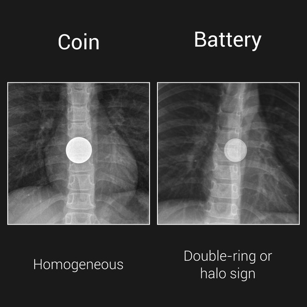

  
Клинический справочный материал

  
Инородные тела пищеварительного тракта

  
Категории проглоченных предметов по срочности вмешательства, признаки осложнений, догоспитальная тактика

  

  
Дисковая батарейка и магниты как состояния с исчислением времени в часах.

  
Уровни задержки предметов, признаки перфорации, действия, ухудшающие исход.

  
Серия «Крещение поворотом» · версия 1.0 · 16 августа 2026 · CC BY-NC-SA 4.0

# Клинический случай

## Слово бригаде

"Вызов к девочке 9 лет: катала во рту косточку от персика и случайно проглотила. Сначала она подзастряла у неё в пищеводе, но девочка испугалась и предприняла активные усилия по её проглатыванию. Получилось! Персик был настоящий, не лысый, не маленький, соответственно, косточка тоже настоящая: большая и лохматая, нам показывали вторую, которая осталась непроглоченной.

В целом там семья была довольно тревожная: две бабушки на одну внучку. Её напоили сначала растительным маслом, дали хлеба, чтобы протолкнуть косточку подальше, потом почитали в интернете, что хорошо есть кашу, сварили кашу и стали девочку кормить ещё и кашей. Несмотря на все предпринимаемые усилия, вечером накануне вызова самочувствие было обычным, стул был, тоже как обычно. Ночью спала спокойно. Утром появилась боль в животе: сначала вокруг пупка, к моменту вызова сместилась вниз и вправо. Была рвота натощак, вот этим всем, съеденным вчера. От еды отказывается, пьёт неохотно. Стула сегодня не было, газы отходят. Бабушки спрашивали, не дать ли девочке слабительное, «чтобы косточка вышла быстрее».

Объективно: девочка вялая, лежит на боку с подтянутыми ногами, при ходьбе щадит живот, прыгать отказывается. Слюну глотает свободно, слюнотечения нет, на боль за грудиной и при глотании не жалуется, дисфагии нет. Дыхание свободное, ЧД 20 в минуту, SpO₂ 99 %. Температура 37,3 °С, ЧСС 96 в минуту, АД 105/65 мм рт. ст. Живот участвует в дыхании, при пальпации болезненный в правой подвздошной области, сомнительные симптомы Ситковского и Бартомье — Михельсона, отрицательный симптом Щёткина — Блюмберга, перистальтика выслушивается. Шея без подкожной эмфиземы. Крови в рвотных массах не было. Менструаций нет."

Разбор случая приведён в конце материала.

# Вопросы для размышления

Ответы — в конце материала.

1. Проглоченных предметов много, а опасных среди них мало. Какие обстоятельства делают предмет опасным и какие из них выясняются расспросом, а не осмотром?
2. Где именно задерживаются предметы в пищеводе, какой участок пищеварительного тракта самый узкий и какие размеры предмета означают, что дальше он сам не пройдёт?
3. Механические приёмы, которыми восстанавливают проходимость дыхательных путей, при проглоченном предмете не применяются. Почему — и бывает ли, что проглоченный предмет даёт стридор?
4. Что происходит с дисковой батарейкой в пищеводе, за какое время и имеет ли значение, что батарейка была разряжена?
5. Зачем при дисковой батарейке дают мёд, кому и в какие сроки, и что этот приём не отменяет?
6. Почему один магнит не опаснее любого другого гладкого предмета, а два — уже повод для экстренной хирургии?
7. Какой признак говорит о полной обструкции пищевода и какой признак у ребёнка устойчиво указывает на то, что предмет стоит в пищеводе?
8. О чём говорят подкожная эмфизема на шее и кровь в слюне или стуле при стоящем инородном теле?
9. Почему слабительное, вода или хлеб «чтобы протолкнуть», провокация рвоты и активированный уголь ухудшают исход?
10. Что означает заключение «инородное тело рентгенологически не подтверждено» и какие проглоченные предметы на снимке не видны в принципе?

# Общие положения

Действующий протокол определяет инородное тело желудочно-кишечного тракта (T18) как состояние, не требующее лечения на этапе оказания скорой медицинской помощи, с медицинской эвакуацией в больницу. Из этой формулировки не следует, что все случаи равнозначны: клиническая работа на догоспитальном этапе состоит в определении срочности эндоскопического или хирургического вмешательства и в предотвращении действий, ухудшающих исход.

Основная часть проглоченных предметов покидает пищеварительный тракт самостоятельно. Опасность создают три обстоятельства: расположение предмета в пищеводе, его состав (дисковая батарейка, магниты) и геометрия (острые, длинные, широкие предметы). Первое определяется симптоматикой, второе и третье — расспросом, поэтому объём информации, полученной на вызове, напрямую определяет срочность маршрута.

Материал включает:

- разграничение с инородным телом дыхательных путей;
- анатомические уровни задержки предметов;
- клинические проявления и обязательный объём расспроса и осмотра;
- категории предметов по срочности вмешательства;
- дисковую батарейку и магниты как отдельные состояния;
- признаки осложнений;
- догоспитальную тактику и действия, которые не выполняются.

Инородные тела дыхательных путей рассмотрены в отдельном материале: там темп угрозы измеряется минутами и требуются механические приёмы, противопоказанные при проглоченном предмете.

# Разграничение с инородным телом дыхательных путей

| Признак | Пищевод и желудочно-кишечный тракт | Дыхательные пути |
|---|---|---|
| Ведущие проявления | Слюнотечение, дисфагия, отказ от приёма пищи, боль за грудиной | Кашель, стридор, невозможность говорить, цианоз |
| Дыхание | Как правило, не нарушено | Нарушено или отсутствует |
| Темп развития угрозы | Часы; исключение — дисковая батарейка | Минуты |
| Догоспитальные действия | Механические приёмы не применяются, эвакуация к эндоскопии | Приёмы восстановления проходимости, при неэффективности — коникотомия |
| Типичная ошибка | Попытка «протолкнуть» предмет пищей или водой, провокация рвоты | Промедление при неэффективном кашле |

Существует промежуточная ситуация: крупный предмет в верхней трети пищевода сдавливает трахею извне и вызывает стридор при проглоченном, а не аспирированном предмете. У ребёнка младшего возраста картина выглядит как обструкция дыхательных путей, однако механические приёмы при ней неэффективны, а лечение состоит в эндоскопическом удалении.

# Анатомические уровни задержки

Три физиологических сужения пищевода определяют места задержки предметов.

| Уровень | Анатомический субстрат | Диаметр |
|---|---|---|
| Верхнее (C6) | Крикофарингеальный сфинктер, вход в пищевод | около 14 мм — наиболее узкий участок пищеварительного тракта |
| Среднее (Th4–Th5) | Перекрест с дугой аорты и левым главным бронхом | 15–17 мм |
| Нижнее (Th10) | Пищеводное отверстие диафрагмы, кардиальный отдел | 16–19 мм |

У детей 60–70 % инородных тел пищевода задерживаются на верхнем уровне, что делает их доступными для эндоскопического удаления.

Дальнейшие узкие места — привратник, дуоденоеюнальный изгиб и илеоцекальный клапан. Практическое следствие: предмет шириной более 20 мм самостоятельно не покидает желудок, предмет длиной более 50 мм не проходит двенадцатиперстную кишку. У детей младше 5 лет пороговые значения ниже — 20 мм и 30 мм соответственно. Всё, что меньше этих размеров и не опасно по составу, при отсутствии симптоматики выходит самостоятельно, в 80–90 % случаев в течение 4–6 суток.

Отдельно учитывается предшествующая патология пищевода. У взрослого с задержкой пищевого комка почти всегда имеется фон: стриктура, пищеводное кольцо, ахалазия или эозинофильный эзофагит, — и первый эпизод дисфагии такого рода сам по себе является показанием к обследованию.
# Клинические проявления

| Локализация предмета | Проявления |
|---|---|
| Пищевод, полная обструкция | Невозможность проглотить слюну, слюнотечение, срыгивание непереваренной пищей, боль за грудиной, у ребёнка — отказ от еды и питья |
| Пищевод, частичная обструкция | Дисфагия, ощущение препятствия, боль при глотании, иногда только беспокойство ребёнка при кормлении |
| Пищевод, сдавление трахеи извне | Стридор, кашель, шумное дыхание при сохранной способности говорить |
| Желудок и ниже | Симптоматика, как правило, отсутствует; при осложнениях — боль в животе, вздутие, рвота, признаки непроходимости |
| Осложнения любой локализации | Подкожная эмфизема шеи, лихорадка, кровь в слюне, рвотных массах или стуле, симптомы раздражения брюшины |

Отсутствие симптоматики не исключает опасного предмета: дисковая батарейка в пищеводе способна первые часы не давать иных проявлений, кроме умеренного беспокойства и отказа от еды, а повреждение при этом уже развивается.

# Обязательный объём расспроса

| Вопрос | Клиническое значение |
|---|---|
| Что именно проглочено; возможно ли показать такой же предмет | Состав и размер определяют всю дальнейшую тактику |
| Точное время проглатывания | При батарейке счёт идёт на часы, окна для отдельных мер ограничены |
| Количество предметов | Магниты представляют опасность именно во множественном числе |
| Проглочено или вдохнуто, был ли кашель в момент эпизода | Разграничение двух разных алгоритмов |
| Способность проглатывать слюну | Признак полной обструкции пищевода |
| Дисфагия, боль за грудиной, боль при глотании | Указание на нахождение предмета в пищеводе |
| Рвота: кратность, время, характер содержимого | Обструкция либо уже развившееся осложнение |
| Наличие стула и отхождение газов после эпизода | Оценка проходимости |
| Приём пищи после эпизода, аппетит | Отказ от еды у ребёнка — устойчивый признак задержки предмета в пищеводе |
| Наличие крови в слюне, рвотных массах, стуле | Перфорация, формирующаяся фистула; возможное сигнальное кровотечение |
| Температура тела | Медиастинит, перитонит |
| Заболевания и операции на пищеводе в анамнезе | Стриктуры и кольца как причина задержки у взрослых |

При осмотре дополнительно оцениваются: способность говорить и глотать слюну, характер дыхания и сатурация, шея на наличие подкожной эмфиземы, живот на вздутие и болезненность, ротоглотка визуально — без пальцевого исследования вслепую.

# Категории предметов по срочности вмешательства

::: wide

| Категория | Предметы | Срочность | Обоснование |
|---|---|---|---|
| Наивысшая | Дисковая батарейка в пищеводе | Эндоскопия в пределах 2 часов | Электролитическое повреждение начинается через 15–30 минут, некроз — к 2 часам; исходы: трахеоэзофагеальная фистула, стеноз, аортоэзофагеальная фистула с фатальным кровотечением |
| Наивысшая | Два и более магнита либо магнит с металлическим предметом | Экстренно, хирургическая служба | Взаимное притяжение через стенки разных петель кишки: давление, некроз, перфорация, фистула, непроходимость |
| Экстренная | Любое инородное тело пищевода с симптоматикой: слюнотечение, невозможность глотать, боль | Эндоскопия срочно | Риск перфорации, аспирации, ишемии стенки |
| Срочная | Острые предметы: иглы, булавки, зубочистки, рыбные кости, стекло | Эндоскопия при доступности | Перфорация; максимальный риск на уровне двенадцатиперстной кишки |
| Срочная | Предметы длиной более 50 мм или шириной более 20 мм | Эндоскопия из желудка | Самостоятельно не пройдут |
| Срочная | Пищевой комок у взрослого с полной дисфагией | Эндоскопия | Как правило, на фоне стриктуры, пищеводного кольца или эозинофильного эзофагита |
| Наблюдение | Монеты в желудке, гладкие мелкие предметы, бусины | Наблюдение до 2–4 недель | 80–90 % выходят самостоятельно в течение 4–6 суток |
| Наблюдение | Фруктовые косточки, прошедшие пищевод | По размеру | Гладкая поверхность; косточка персика 20–35 мм — пограничная по проходимости привратника |
| Особая | Контейнеры с психоактивными веществами | Хирургическая служба | Разрыв упаковки означает смертельную дозу; эндоскопия противопоказана |

:::

# Дисковая батарейка

Механизм повреждения не химический, а электрический: батарейка замыкается через влажную слизистую, на отрицательном полюсе идёт гидролиз с образованием гидроксид-ионов и развивается щелочной колликвационный некроз. Процесс идёт и при разряженной батарейке, поэтому сведения о том, что «батарейка была старая», значения не имеют.

Рентгенологически батарейка отличается от монеты двойным контуром в прямой проекции и ступенчатым краем в боковой. Практическое следствие: разграничение с монетой проводится по расспросу на месте, а не откладывается до снимка.

Мёд по 10 мл каждые 10 минут, до шести приёмов, применяется при возрасте более 12 месяцев и давности эпизода менее 12 часов: вязкая среда покрывает батарейку и локально нейтрализует щёлочь, замедляя повреждение. Приём мёда не отменяет и не отсрочивает эндоскопию, не применяется при подозрении на перфорацию и при нарушенном сознании. Иная пища и жидкости при этом исключаются.

Батарейка, прошедшая пищевод и находящаяся в желудке при отсутствии симптоматики, экстренного вмешательства не требует, однако подлежит наблюдению: значимость сохраняют размер и наличие сопутствующих магнитов.

<figure>
  
  <figcaption>Разграничение монеты и дисковой батарейки в прямой проекции. Слева (Coin) — монета: тень однородна по всей площади (homogeneous). Справа (Battery) — дисковая батарейка: по краю прослеживается дополнительный контур, симптом двойного кольца или гало (double-ring, halo sign), обусловленный ступенчатым переходом между двумя половинами корпуса разного диаметра. В боковой проекции тот же признак выглядит как ступенька края. Оба предмета на снимке расположены в пищеводе на уровне средней трети; тактика при них различается принципиально: батарейка требует эндоскопии в пределах двух часов. Case courtesy of Leonardo Lustosa, Radiopaedia.org, rID: 99766, CC BY-NC-SA 3.0.</figcaption>
</figure>

# Что видно и что не видно на рентгенограмме

Обзорная рентгенография остаётся первым методом при подозрении на рентгеноконтрастный предмет или когда предмет неизвестен, однако отрицательный результат не означает отсутствия инородного тела: доля ложноотрицательных заключений достигает 47 %.

| Рентгенологическая видимость | Предметы |
|---|---|
| Как правило, видны | Металлические предметы, монеты, дисковые батарейки, кости крупного скота |
| Регулярно не видны | Пищевой комок и растительный материал, включая фруктовые косточки; рыбьи и куриные кости; дерево; пластик; стекло; тонкий металл, в том числе алюминиевые язычки от банок |

Числа, определяющие тактику: чувствительность рентгенографии при проглоченной рыбьей кости — 32 % в проспективном исследовании на 358 пациентах; при задержке пищевого комка доля ложноотрицательных результатов около 87 %, поэтому снимок при нём не требуется вовсе. Компьютерная томография даёт чувствительность 90–100 % при специфичности 93,7–100 % и остаётся методом выбора, когда клиническое подозрение сохраняется, а снимок чист.

Отдельная ловушка касается перфорации: свободный газ под диафрагмой при перфорации инородным телом почти никогда не выявляется. Перфорация происходит не одномоментно, а через постепенную эрозию стенки, и место прободения успевает прикрыться фибрином, сальником или соседней петлёй, так что большого поступления воздуха в брюшную полость не происходит. Отсутствие пневмоперитонеума на снимке перфорацию не исключает.

Практическое следствие для догоспитального этапа: сведения, собранные на вызове, — что именно, сколько, когда — нередко оказываются точнее любого снимка, а формулировка «инородное тело рентгенологически не подтверждено» означает лишь то, что предмет не был виден.

# Магниты

Единичный небольшой магнит по опасности не отличается от иного гладкого предмета. Опасность создаёт сочетание двух и более магнитов либо магнита с металлическим предметом: находясь в разных петлях кишки, они притягиваются через стенки, вызывают локальное давление, ишемию, некроз и перфорацию с формированием фистулы или непроходимости. Симптоматика при этом развивается отсроченно и неспецифична — боль в животе, рвота, лихорадка, — и часто трактуется как гастроэнтерит.

Практическое следствие: количество проглоченных магнитов фиксируется документально, а сведения об этом передаются при госпитализации, поскольку от количества зависит объём вмешательства.

# Признаки осложнений

Подкожная эмфизема на шее в сочетании с болью за грудиной и повышением температуры указывает на перфорацию пищевода с медиастинитом — состояние с летальностью более 20 %, требующее экстренной хирургической помощи.

Кровь в слюне, рвотных массах или стуле при стоящем инородном теле рассматривается как возможное сигнальное кровотечение при формирующейся фистуле, в том числе аортоэзофагеальной. Кратковременная остановка такого кровотечения не означает разрешения ситуации.

Признаки раздражения брюшины, вздутие живота, прекращение отхождения газов и стула указывают на перфорацию или непроходимость и определяют хирургический, а не эндоскопический маршрут.

# Догоспитальная тактика

Терапия на этапе скорой медицинской помощи при инородном теле желудочно-кишечного тракта (T18) не проводится, показана медицинская эвакуация в больницу. При отказе от эвакуации рекомендуется обращение в поликлинику.

Практический объём действий:

- определить, проглочен предмет или аспирирован, и оценить проходимость дыхательных путей;
- установить состав, размер, количество предметов и точное время эпизода;
- прекратить приём пищи и жидкости; исключение — мёд при дисковой батарейке в пищеводе при соблюдении условий;
- придать удобное положение, при сохранной проходимости дыхательных путей — полусидя;
- обеспечить венозный доступ при признаках осложнений;
- при батарейке в пищеводе, множественных магнитах и признаках перфорации — заранее информировать принимающий стационар о необходимости эндоскопии или хирургического вмешательства;
- передать при госпитализации сведения о предмете: аналогичный образец, упаковку, количество, время.

Для детей порог госпитализации ниже, чем формальные показания: возраст, невозможность наблюдения и недостоверность сведений об эпизоде рассматриваются как самостоятельные основания для эвакуации.

# Действия, которые не выполняются

| Действие | Механизм вреда |
|---|---|
| Провокация рвоты | Аспирация, повторная травма пищевода; при батарейке — расширение зоны повреждения |
| Попытка «протолкнуть» предмет хлебом, водой, иной пищей | Усугубление обструкции, повреждение стенки, аспирация |
| Приём пищи и жидкости при инородном теле пищевода | Утрата условий для эндоскопии, аспирация при вводном наркозе |
| Пальцевое удаление вслепую | Продвижение предмета глубже, травма ротоглотки, ларингоспазм |
| Слабительные средства | Не ускоряют пассаж; при острых предметах увеличивают риск перфорации |
| Активированный уголь | Не показан: состояние не является отравлением; ухудшает визуализацию при эндоскопии |
| Ожидание самостоятельного отхождения при батарейке в пищеводе или множественных магнитах | Повреждение развивается в течение часов и до появления развёрнутой симптоматики |
| Эндоскопическое удаление контейнеров с психоактивными веществами | Разрыв упаковки с массивным поступлением вещества |

# Признаки, определяющие экстренность

Экстренная эвакуация с предварительным информированием стационара:

- дисковая батарейка в пищеводе или анамнестическое указание на её проглатывание при неизвестной локализации;
- два и более магнита либо магнит с металлическим предметом;
- невозможность глотать слюну, слюнотечение, боль за грудиной — признаки нахождения предмета в пищеводе;
- стридор или иные признаки сдавления дыхательных путей извне;
- подкожная эмфизема шеи, лихорадка, боль за грудиной — признаки перфорации и медиастинита;
- кровь в слюне, рвотных массах или стуле;
- признаки раздражения брюшины, вздутие живота, прекращение отхождения газов;
- острый предмет любой локализации; предмет длиной более 50 мм или шириной более 20 мм.

# Возвращение к клиническому случаю

**Рабочий диагноз бригады.** Подозрение на острый аппендицит; проглоченная косточка персика — сопутствующее обстоятельство, не объясняющее клиническую картину. Ребёнок доставлен в детский хирургический стационар.

**Исход.** Аппендицит при наблюдении в стационаре не подтвердился, инородное тело подтвердить также не удалось; девочка выписана с диагнозом функционального нарушения. Сведений об объёме обследования бригаде не сообщали.

**Почему «не подтвердили» — ожидаемый результат, а не опровержение.** Фруктовая косточка относится к предметам, которых на обзорной рентгенограмме не видно: растительный материал, как и пищевой комок, дерево, пластик и рыбьи кости, рентгенопрозрачен. Доля ложноотрицательных заключений при инородных телах доходит до 47 %, при пищевом комке — до 87 %. Поэтому запись «инородное тело рентгенологически не подтверждено» означает ровно одно: предмет не был виден. Косточка при этом либо уже прошла дальше — 80–90 % предметов покидают тракт за 4–6 суток, — либо оставалась в желудке, не давая симптоматики. Единственный метод, надёжно отвечающий на этот вопрос, — компьютерная томография с чувствительностью 90–100 %, и выполнять её ребёнку без клинических оснований никто не станет.

**Что говорило за хирургическую патологию.** Миграция боли из околопупочной области в правую подвздошную, отказ от еды, локальная болезненность в правой подвздошной области, щадящая походка и отказ прыгать — этот приём даёт ту же информацию, что пальпация, но без неё, — и субфебрильная температура. Против неё говорили отрицательный симптом Щёткина — Блюмберга и сомнительные Ситковского и Бартомье — Михельсона. Ни та, ни другая группа признаков на догоспитальном этапе исхода не решает: у детей аппендицит регулярно протекает без развёрнутой симптоматики, а перечисленные симптомы обладают низкой воспроизводимостью и невысокой диагностической точностью. Решение о доставке в стационар от их результата не зависело и было верным независимо от того, чем закончилось наблюдение.

**Чем могла объясняться картина.** Девочку в течение суток кормили растительным маслом, хлебом и кашей, чтобы «протолкнуть» косточку. Рвота содержала съеденное накануне — это признак задержки желудочного содержимого. Обильная жирная и объёмная пища у ребёнка с испугом и болью даёт и боль в животе, и рвоту, и отказ от еды, то есть ровно ту картину, которую бригада застала. Это не отменяет необходимости исключить аппендицит в стационаре: разница между «функциональным нарушением» и катастрофой в правой подвздошной области определяется наблюдением в динамике, а не осмотром на кухне.

**Действия семьи, каждое из которых ухудшало ситуацию.** Растительное масло, хлеб и каша — три попытки протолкнуть предмет: они усугубляют обструкцию, повреждают стенку, грозят аспирацией и лишают условий для эндоскопии, поскольку при вводном наркозе полный желудок означает аспирацию. Просьбу дать слабительное следует отклонить прямо и объяснить: пассаж оно не ускоряет, а при остром предмете увеличивает риск перфорации. Провокация рвоты недопустима — аспирация и повторная травма пищевода. Активированный уголь не показан: это не отравление, а препарат ухудшает визуализацию при эндоскопии. Пальцевое удаление вслепую продвигает предмет глубже. Отдельно стоит начало эпизода: косточка «подзастряла» в пищеводе, и девочка протолкнула её собственными усилиями. Исход был благополучным, но так поступать нельзя — предмет с неровной поверхностью при таком проталкивании повреждает слизистую, а при задержке на верхнем сужении показана эндоскопия, а не настойчивое глотание.

**Признаки нахождения предмета в пищеводе,** которых у этой девочки на момент осмотра нет: невозможность глотать слюну и слюнотечение, боль за грудиной и при глотании, отказ от еды с ощущением «стоит», стридор при сдавлении дыхательных путей извне. Подкожная эмфизема шеи, лихорадка и боль за грудиной означали бы перфорацию и медиастинит — состояние с летальностью более 20 %.

**Что изменило бы всё.** Ответ на любой вопрос обязательного расспроса способен перевести вызов в другую категорию срочности. **Дисковая батарейка** в пищеводе — эндоскопия в пределах двух часов, поскольку повреждение начинается через 15–30 минут. **Два и более магнита** либо магнит с металлическим предметом — экстренная хирургическая служба. **Острый предмет** — рыбья кость, игла, булавка, зубочистка — срочная эндоскопия. Предмет **шириной более 20 мм или длиной более 50 мм** сам не пройдёт; косточка персика 20–35 мм в этом смысле пограничная по проходимости привратника. Поэтому вопрос «что именно и сколько» задаётся всегда, а не только когда предмет вызывает симптомы; лучший ответ — когда родные приносят такой же предмет, как в этом случае и произошло: вторую косточку показали бригаде.

**Формулировка, которая защищает от ошибки.** Проглоченное инородное тело не объясняет боль в животе — оно её маскирует. Родные приходят с готовой версией, и версия звучит убедительно: событие вчера, симптом сегодня. Бригада, принявшая её, обсуждает сроки отхождения косточки, пока у ребёнка развивается перитонит. Порядок обратный: сначала оценивается живот и решается вопрос об острой хирургической патологии, и лишь затем — судьба предмета.

**Тактика.** Приём пищи и жидкости прекращается — и по поводу возможной эндоскопии, и потому, что предстоит осмотр хирурга. Удобное положение, венозный доступ при признаках осложнений, обезболивание по протоколу: современная практика не считает анальгезию препятствием для диагностики острого живота, но объём определяется действующим алгоритмом. Эвакуация в детский хирургический стационар.

**Порог госпитализации у ребёнка ниже формальных показаний.** Даже при спокойном животе к эвакуации склоняли бы три обстоятельства: возраст, недостоверность сведений об эпизоде — ребёнок мог проглотить не то и не в том количестве, о чём говорит, — и невозможность полноценного наблюдения дома, тем более в семье, которая сутки лечила ребёнка по советам из интернета. В передаче звучат: что проглочено, точное время, чем кормили после эпизода, характер и миграция боли, время последней еды и данные осмотра живота.

# Резюме

- Терапия на догоспитальном этапе не требуется; содержанием работы является определение срочности и предотвращение вредных вмешательств.
- Опасность определяют три обстоятельства: расположение в пищеводе, состав предмета, его геометрия.
- Дисковая батарейка в пищеводе — состояние с исчислением времени в часах: повреждение начинается через 15–30 минут, некроз наступает к двум часам.
- Мёд по 10 мл до шести приёмов применяется при возрасте более 12 месяцев и давности менее 12 часов и не отменяет эндоскопию.
- Два и более магнита опасны взаимным притяжением через стенки разных петель кишки; количество фиксируется и передаётся в стационар.
- Предмет шире 20 мм не покидает желудок, длиннее 50 мм не проходит двенадцатиперстную кишку; у детей до 5 лет пороги ниже.
- Невозможность проглотить слюну означает полную обструкцию пищевода, отказ ребёнка от еды — устойчивый признак задержки предмета.
- Подкожная эмфизема шеи с болью за грудиной и лихорадкой означает перфорацию с медиастинитом и требует хирургической помощи.
- Провокация рвоты, попытки протолкнуть предмет, слабительные и активированный уголь противопоказаны.
- Обзорная рентгенография не видит растительный материал, включая фруктовые косточки, пищевой комок, рыбьи кости, дерево, пластик и тонкий металл; ложноотрицательных заключений до 47 %, при пищевом комке до 87 %. «Рентгенологически не подтверждено» не равно «предмета нет».
- Отсутствие свободного газа под диафрагмой не исключает перфорации инородным телом: прободение развивается через постепенную эрозию и прикрывается фибрином и сальником.
- Задержка пищевого комка у взрослого указывает на предшествующую патологию пищевода и требует обследования независимо от исхода эпизода.

# Ответы на вопросы для размышления

**1.** Три обстоятельства: расположение предмета в пищеводе, его состав (дисковая батарейка, магниты) и геометрия (острый, длинный, широкий). Первое определяется симптоматикой — способностью глотать слюну, дисфагией, болью за грудиной; второе и третье выясняются только расспросом. Отсюда практическое следствие: объём сведений, полученных на вызове, напрямую определяет срочность маршрута, а лучший ответ на вопрос «что именно проглочено» — когда родители приносят такой же предмет или упаковку.

**2.** Три физиологических сужения пищевода: крикофарингеальный сфинктер на уровне C6 — около 14 мм, самый узкий участок всего пищеварительного тракта; перекрест с дугой аорты и левым главным бронхом на уровне Th4–Th5 — 15–17 мм; пищеводное отверстие диафрагмы на уровне Th10 — 16–19 мм. У детей 60–70 % инородных тел пищевода стоят на верхнем уровне и доступны эндоскопии. Дальше узкими местами становятся привратник, дуоденоеюнальный изгиб и илеоцекальный клапан: предмет шириной более 20 мм не покидает желудок, длиной более 50 мм не проходит двенадцатиперстную кишку, а у детей младше 5 лет пороги ниже — 20 и 30 мм. Всё, что меньше и не опасно по составу, при отсутствии симптоматики выходит само, в 80–90 % случаев за 4–6 суток.

**3.** Потому что механизм угрозы другой. При инородном теле дыхательных путей нарушено дыхание и счёт идёт на минуты, при проглоченном предмете дыхание, как правило, сохранно, а темп измеряется часами; приёмы здесь не помогают, зато провоцируют аспирацию и повторную травму пищевода. Стридор при проглоченном предмете бывает: крупный предмет в верхней трети пищевода сдавливает трахею извне, и у ребёнка младшего возраста картина выглядит как обструкция дыхательных путей. Механические приёмы при этом неэффективны, лечение — эндоскопическое удаление.

**4.** Повреждение не химическое, а электрическое: батарейка замыкается через влажную слизистую, на отрицательном полюсе идёт гидролиз с образованием гидроксид-ионов и развивается щелочной колликвационный некроз. Начало — через 15–30 минут, некроз — к двум часам, отсюда требование эндоскопии в пределах двух часов. Исходы запоздалого удаления: трахеоэзофагеальная фистула, стеноз, аортоэзофагеальная фистула с фатальным кровотечением. Разряд батарейки значения не имеет: процесс идёт и при разряженной, поэтому слова «батарейка была старая» тактику не меняют.

**5.** Мёд по 10 мл каждые 10 минут, до шести приёмов: вязкая среда покрывает батарейку и локально нейтрализует щёлочь, замедляя повреждение. Условия — возраст более 12 месяцев и давность эпизода менее 12 часов. Не применяется при подозрении на перфорацию и при нарушенном сознании, иная пища и жидкости при этом исключаются. Главное: приём мёда не отменяет и не отсрочивает эндоскопию.

**6.** Один небольшой магнит по опасности не отличается от любого гладкого предмета. Два и более магнита либо магнит с металлическим предметом, находясь в разных петлях кишки, притягиваются через стенки: локальное давление, ишемия, некроз, перфорация с фистулой или непроходимостью. Симптоматика при этом отсроченная и неспецифичная — боль в животе, рвота, лихорадка — и потому часто трактуется как гастроэнтерит. Количество проглоченных магнитов фиксируется документально и передаётся в стационар: от него зависит объём вмешательства.

**7.** Полную обструкцию пищевода означает невозможность проглотить слюну, отсюда слюнотечение и срыгивание непереваренной пищей. У ребёнка устойчивый признак задержки предмета в пищеводе — отказ от еды и питья, иногда единственное проявление, наряду с беспокойством при кормлении. При этом отсутствие симптоматики опасный предмет не исключает: дисковая батарейка первые часы может не давать ничего, кроме умеренного беспокойства, пока повреждение уже идёт.

**8.** Подкожная эмфизема на шее в сочетании с болью за грудиной и повышением температуры означает перфорацию пищевода с медиастинитом — летальность более 20 %, помощь хирургическая и экстренная. Кровь в слюне, рвотных массах или стуле при стоящем инородном теле рассматривается как возможное сигнальное кровотечение при формирующейся фистуле, в том числе аортоэзофагеальной; самостоятельная остановка такого кровотечения разрешением ситуации не является. Признаки раздражения брюшины, вздутие живота и прекращение отхождения газов означают перфорацию или непроходимость и переводят маршрут из эндоскопического в хирургический.

**9.** Слабительное пассаж не ускоряет, а при остром предмете увеличивает риск перфорации. Попытка протолкнуть предмет водой или хлебом усугубляет обструкцию, повреждает стенку и грозит аспирацией; любая еда и питьё при инородном теле пищевода вдобавок лишают условий для эндоскопии — при вводном наркозе полный желудок означает аспирацию. Провокация рвоты даёт аспирацию и повторную травму пищевода, а при батарейке расширяет зону повреждения. Активированный уголь не показан: это не отравление, а препарат ухудшает визуализацию при эндоскопии. Пальцевое удаление вслепую продвигает предмет глубже и травмирует ротоглотку.

**10.** Оно означает только то, что предмет не был виден. Обзорная рентгенография пропускает до 47 % инородных тел, а целая группа предметов не видна на ней в принципе: пищевой комок и растительный материал, включая фруктовые косточки, рыбьи и куриные кости, дерево, пластик, стекло, тонкий металл вроде алюминиевых язычков от банок. Чувствительность снимка при рыбьей кости — 32 %, при задержке пищевого комка ложноотрицательных результатов около 87 %. Метод выбора при сохраняющемся подозрении — компьютерная томография с чувствительностью 90–100 %. Отдельно: отсутствие свободного газа под диафрагмой не исключает перфорации инородным телом, поскольку прободение развивается через постепенную эрозию и прикрывается фибрином и сальником.

# Источники

- Алгоритмы оказания скорой и неотложной медицинской помощи бригадами скорой медицинской помощи. Департамент здравоохранения города Москвы, 2025: раздел «Хирургия» (T18, инородное тело желудочно-кишечного тракта), раздел «Оториноларингология», разделы детской хирургии и детской оториноларингологии.
- NASPGHAN Clinical Report: Management of Ingested Foreign Bodies in Children, 2015, с обновлениями по дисковым батарейкам.
- ESGE Guideline: Removal of foreign bodies in the upper gastrointestinal tract in adults, 2016 — рентгенопрозрачные предметы, ложноотрицательные заключения до 47 % и до 87 % при пищевом комке, чувствительность 32 % при рыбьей кости (358 пациентов), чувствительность КТ 90–100 % при специфичности 93,7–100 %, свободный газ как ненадёжный признак перфорации.
- Guo H. H. et al. Clinical Guidelines for Imaging and Reporting Ingested Foreign Bodies. *American Journal of Roentgenology*, 2013 — перечень рентгенопрозрачных предметов, включая тонкий алюминий.
- ESPGHAN Position Paper: Button battery ingestion in children, 2021.
- Tintinalli's Emergency Medicine: A Comprehensive Study Guide — Esophageal Emergencies; Foreign Bodies of the Gastrointestinal Tract.
- Oxford Handbook of Emergency Medicine — Swallowed foreign bodies.

# Источники иллюстраций

| Файл | Что изображено | Источник и лицензия |
|---|---|---|
| `coin_vs_battery_xray.png` | Рентгенологическое разграничение монеты и дисковой батарейки в пищеводе | Case courtesy of Leonardo Lustosa, [Radiopaedia.org](https://radiopaedia.org/), rID: [99766](https://radiopaedia.org/cases/99766). CC BY-NC-SA 3.0. Полная ссылка: Lustosa L. Coin vs battery. Case study, Radiopaedia.org, опубликовано 12.05.2022, <https://doi.org/10.53347/rID-99766> |

# Выходные данные

**Материал:** «Инородные тела пищеварительного тракта». Версия 1.0 от 16 августа 2026.

**Серия:** «Крещение поворотом» — клинические разборы догоспитальной практики.

**Лицензия:** текст — Creative Commons «С указанием авторства — Некоммерческая — С сохранением условий» 4.0 (CC BY-NC-SA 4.0). Копировать, печатать и раздавать коллегам можно свободно; продавать — нельзя.

**Оговорка.** Материал носит учебный характер. Он не является нормативным документом, не заменяет действующие протоколы, клинические рекомендации и распоряжения службы и не может использоваться как единственное основание для клинического решения. Дозы, показания и маршрутизацию необходимо проверять по действующим первоисточникам. Ответственность за клинические решения несёт медицинский работник, а не автор материала.

**О клинических случаях.** Случаи обезличены: нет имён, дат вызовов, адресов, номеров карт вызова, названий стационаров, бытовые детали изменены. Совпадения с чужой практикой возможны и неизбежны.

**Нашли ошибку?** Сообщить можно через раздел Issues репозитория проекта; исправление выходит новой версией, а изменение фиксируется в журнале изменений.
