

  
Клинический справочный материал

  
Нейрофиброматоз

  
Формы, распознавание и опасные осложнения

  

  
Номенклатура — пересмотр 2022; критерии НФ1 — Legius et al., 2021.

  
НФ1, НФ2-ассоциированный шванноматоз, шванноматоз; сосудистые и опухолевые осложнения.

  
Серия «Крещение поворотом» · версия 1.0 · 16 августа 2026 · CC BY-NC-SA 4.0

# Клинический случай

Вызов в 08:40, повод — «боль в спине, не может встать». Молодой человек 23 лет, живёт с матерью, работает курьером.

Три недели назад появилась боль в межлопаточной области — сначала ноющая, «как потянул спину». Две недели лечился мазями и ибупрофеном, обращался в поликлинику, где был поставлен диагноз остеохондроза и назначена физиотерапия. Последнюю неделю боль стала постоянной, **усиливается ночью и будит**, положение тела её почти не меняет. За последние двое суток появилась слабость в ногах: сначала «подводило» правую при подъёме по лестнице, к вечеру стал шаркать обеими. Утром встать не смог. Мочился последний раз около десяти часов назад, позывы «странные, как будто и хочется, и не идёт».

Объективно: сознание ясное. Кожа: множественные мягкие узлы на туловище и плечах, часть «проваливается» под пальцем; более десяти ровных светло-коричневых пятен на туловище; мелкая веснушчатость в подмышечных впадинах. Мать сообщает, что «такие же пятна и шишечки» есть у неё, диагноз в семье не уточнялся.

Неврологически: сила в руках сохранена, в ногах снижена симметрично, самостоятельно ноги от постели отрывает с трудом; тонус повышен, коленные рефлексы живее обычных. Чувствительность на ногах и нижней половине живота снижена, при проверке снизу вверх появляется отчётливая **граница на уровне примерно середины живота**. Над лобком пальпируется напряжённый мочевой пузырь. Перианальная чувствительность снижена. АД 145/90 мм рт. ст., ЧСС 92 в минуту, температура 36,8 °С.

Разбор случая приведён в конце материала.

# Вопросы для размышления

Ответы — в конце материала.

1. С 2022 года под словом «нейрофиброматоз» скрываются три разных заболевания. Чем они различаются по генетике и, что важнее на вызове, чем различается то, что при них убивает?
2. Сколько признаков нужно, чтобы говорить о НФ1, какие признаки годятся и что меняет наличие того же заболевания у родителя?
3. Отдельные пятна «кофе с молоком» есть у четверти здоровых людей. Что тогда делает их диагностическим признаком и по какому свойству пятна отличают НФ1 от синдрома Мак-Кьюна — Олбрайта?
4. Почему у пациента с НФ1 и повышенным давлением вопрос о феохромоцитоме задаётся всегда, какая триада симптомов даёт специфичность выше 90 % и откуда при постоянной гипертонии берётся ортостатическая гипотензия?
5. С какого препарата начинают при феохромоцитоме и что произойдёт, если первым дать бета-адреноблокатор?
6. Какая причина гипертонии у ребёнка с НФ1 встречается чаще феохромоцитомы и какие находки на неё указывают?
7. Почему при НФ1 объём кровотечения не соответствует энергии травмы и какое смертельное осложнение развивается вообще без травмы?
8. Из какой опухоли вырастает злокачественная опухоль оболочки периферического нерва, каков пожизненный риск и какие признаки говорят о перерождении?
9. Чем сдавливается спинной мозг при НФ1 и чем при НФ2, почему отсутствие деформации спины компрессию не исключает и какие три вещи проверяются у любого пациента с нейрофиброматозом и болью в спине?
10. Что при НФ2 способно убить быстро, помимо роста опухоли, и какая подробность анамнеза попадает в дифференциальный ряд при любом ухудшении такого пациента?

# Три заболевания под одним старым названием

Термин «нейрофиброматоз» исторически объединял состояния с разной генетикой, разной клиникой и разными угрозами. С 2022 года номенклатура разведена.

| | НФ1 (болезнь Реклингхаузена) | НФ2-ассоциированный шванноматоз | Шванноматоз (SMARCB1-, LZTR1-) |
|---|---|---|---|
| Ген, локус | *NF1*, 17q11.2 | *NF2*, 22q12.2 | *SMARCB1*, *LZTR1*, 22q |
| Белок | Нейрофибромин | Мерлин (шванномин) | SMARCB1 / LZTR1 |
| Функция | ГТФаза-активирующий белок: **выключает сигнал RAS** (RAS — внутриклеточный белок-переключатель каскада деления клетки) | Супрессор опухолевого роста | Супрессоры опухолевого роста |
| Частота | 1 : 2500–3000 — **самый частый** | 1 : 25 000–33 000 | 1 : 60 000–70 000 |
| Наследование | Аутосомно-доминантное, до 50 % — новая мутация | Аутосомно-доминантное, ~50 % de novo | Чаще de novo / мозаичное |
| Визитная карточка | Пятна «кофе с молоком», нейрофибромы | **Двусторонние вестибулярные шванномы** | **Хроническая боль без вестибулярной шванномы** (опухоли слухового нерва) |
| Что убивает | Феохромоцитома, разрыв сосуда, злокачественная опухоль оболочки нерва (MPNST) | Сдавление ствола, гидроцефалия, аспирация | Как правило, не убивает |

> **Отсутствие пятен «кофе с молоком» не исключает НФ2:** при нём их обычно меньше шести или нет вовсе. Глухой молодой человек без кожных признаков — это возможный НФ2.

# НФ1: как распознать

Диагноз ставится при наличии **двух и более** признаков у человека со здоровыми родителями, либо **одного** — при установленном НФ1 у родственника первой линии (пересмотр критериев 2021 года).

| Признак | Уточнение | Появление |
|---|---|---|
| **≥ 6 пятен «кофе с молоком»** | > 5 мм до пубертата, > 15 мм после | С рождения / первых лет |
| **Веснушчатость подмышек или паха** (симптом Кроу) | Мелкие пятна в складках, где нет инсоляции | 3–5 лет |
| **≥ 2 нейрофибромы** или **1 плексиформная** | Мягкие узлы, симптом «кнопки звонка» | Подростковый возраст+ |
| **Глиома зрительного пути** | Снижение зрения, экзофтальм, косоглазие | До 6 лет |
| **≥ 2 узелка Лиша** или ≥ 2 хориоидальные аномалии | Гамартомы радужки, безвредны, видны при осмотре | 5–10 лет |
| **Костное поражение** | Дисплазия крыла клиновидной кости; искривление большеберцовой; ложный сустав | С рождения |
| **Патогенный вариант *NF1*** | Аллельная частота 50 % | — |

<figure>
  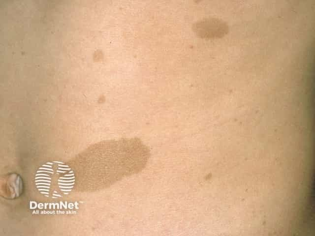
  <figcaption>Пятна «кофе с молоком»: ровные светло-коричневые пятна с гладким краем («побережье Калифорнии»). Диагностически значимо число (≥ 6), а не сам факт.</figcaption>
</figure>

<figure>
  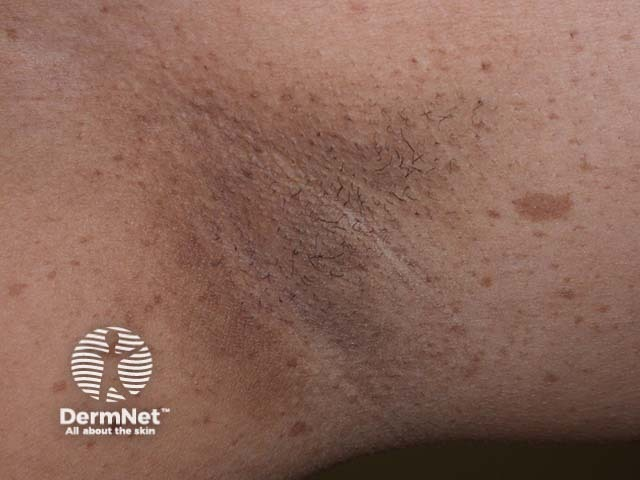
  <figcaption>Симптом Кроу: мелкая веснушчатость в подмышечной впадине — специфична, так как в складках нет инсоляции и обычные веснушки там не образуются.</figcaption>
</figure>

<figure>
  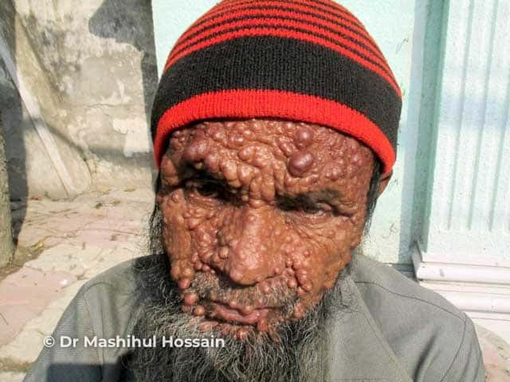
  <figcaption>Множественные кожные нейрофибромы: мягкие узлы, часто «проваливающиеся» под пальцем (симптом кнопки звонка).</figcaption>
</figure>

<figure>
  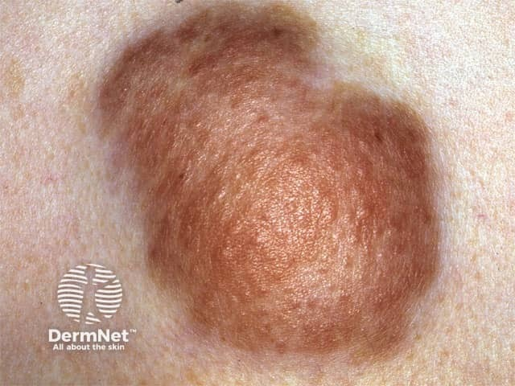
  <figcaption>Плексиформная нейрофиброма: крупное разлитое образование по ходу нерва; именно из неё развивается злокачественная опухоль оболочки нерва (MPNST).</figcaption>
</figure>

<figure>
  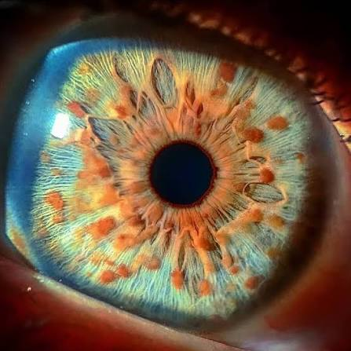
  <figcaption>Узелки Лиша — гамартомы радужки (осмотр со щелевой лампой). Клинического значения не имеют, но помогают поставить диагноз (есть у &gt; 90 % взрослых с НФ1).</figcaption>
</figure>

# Не всякое пятно — нейрофиброматоз

| Состояние | Отличие |
|---|---|
| **Синдром Легиуса** (*SPRED1*) | Пятна и веснушчатость есть, **нейрофибром, узелков Лиша и опухолей нет** — доброкачественный двойник |
| **Синдром Мак-Кьюна — Олбрайта** | Пятно **крупное, одностороннее, с рваным краем** («побережье Мэна»); + преждевременное половое развитие, фиброзная дисплазия |
| **CMMRD** (конституциональный дефицит репарации ДНК) | Пятна + лейкозы и опухоли мозга в раннем детстве |
| **Отдельные пятна у здоровых** | До 25 % населения имеют 1–2 пятна; значение имеет **число** |

<figure>
  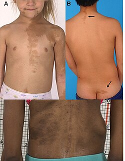
  <figcaption>Синдром Мак-Кьюна — Олбрайта: крупные пятна с рваным («зазубренным») краем, нередко односторонние и не пересекающие срединную линию — «побережье Мэна», в отличие от ровного края при НФ1.</figcaption>
</figure>

# Осложнения, которые убивают

## Феохромоцитома

Клинически значимая феохромоцитома выявляется у 0,1–5,7 % пациентов с НФ1, а при уже имеющейся гипертонии частота доходит до 20–50 %. При НФ1 опухоль чаще **адренергическая** (секретирует преимущественно адреналин): тахикардия, тревога, потливость, бледность.

| Признак | Комментарий |
|---|---|
| **Триада: головная боль + профузная потливость + сердцебиение** на фоне гипертонии | Все три вместе — специфичность > 90 % |
| **Пароксизмальность** | Приступ 15–60 мин, между приступами норма |
| **Бледность, а не гиперемия** | Вазоконстрикция |
| **Ортостатическая гипотензия при общей гипертонии** | Хроническая гиповолемия — очень характерно (объяснение ниже) |
| **Гипергликемия** | Адреналин мобилизует глюкозу |

> **Почему при феохромоцитоме гиповолемия.** Годы избытка катехоламинов держат сосуды (в том числе вены — основную ёмкость крови) в постоянном спазме; объём плазмы «подстраивается» под ужавшееся русло, а длительная гипертензия усиливает прессорный натрийурез. Пока русло сжато, давление высокое и гиповолемия скрыта. После альфа-блокады русло расширяется — прежнего объёма не хватает, давление обваливается. Отсюда правило: **кристаллоид держать наготове.**

<figure>
  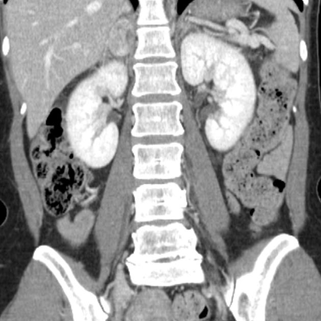
  <figcaption>Феохромоцитома надпочечника на КТ: объёмное образование в проекции надпочечника. У пациента с НФ1 частота феохромоцитомы многократно выше популяционной.</figcaption>
</figure>

<figure>
  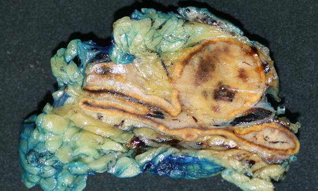
  <figcaption>Макропрепарат удалённой феохромоцитомы: инкапсулированная опухоль мозгового вещества надпочечника с характерным пёстрым видом среза (кровоизлияния, некрозы).</figcaption>
</figure>

> **Бета-блокатор первым при феохромоцитоме опасен.** Адреналин действует на альфа-1 (сужение) и бета-2 (расширение); бета-2 частично компенсирует спазм. Блокада бета без предшествующей альфа-блокады снимает компенсацию и оставляет альфа без противовеса — «неконтролируемая альфа-стимуляция»: сопротивление и давление растут выше исходного, развивается отёк лёгких. **Альфа-блокада всегда первая** (например, урапидил); бета — только после неё.

Препараты-провокаторы криза: метоклопрамид, дроперидол и галоперидол, глюкагон, симпатомиметики и деконгестанты, морфин (через гистамин), суксаметоний.

## Реноваскулярная гипертония

Стеноз почечной артерии вследствие той же сосудистой дисплазии — **самая частая причина гипертонии у ребёнка с НФ1**, чаще феохромоцитомы. Подозрение: гипертония у ребёнка/подростка с НФ1, разница давления на руках, шум над животом, плохой ответ на терапию.

## Сосудистая хрупкость

Нейрофибромин экспрессируется в эндотелии и гладких мышцах; его потеря даёт васкулопатию: истончение стенки, стенозы, аневризмы, свищи.

| Проявление | Как выглядит |
|---|---|
| **Спонтанный гемоторакс** (разрыв межрёберной/подключичной артерии) | Внезапная боль в груди и одышка **без травмы** — классическое смертельное осложнение НФ1 |
| **Кровоизлияние в плексиформную нейрофиброму** | Быстро растущая болезненная припухлость, шок без видимой кровопотери |
| **Аневризмы почечной, сонной, позвоночной артерий** | Разрыв, диссекция, инсульт у молодого |
| **Мойя-мойя** (чаще после лучевой терапии) | Повторные ТИА и инсульты у ребёнка |

> При травме у пациента с НФ1 **объём кровотечения не соответствует энергии повреждения**: малая травма может дать большое кровотечение.

## Злокачественная опухоль оболочки периферического нерва (MPNST)

Риск накапливается с возрастом: по финским популяционным данным он составляет **8,5 % к 30 годам, 12,3 % к 50 и 15,8 % к 85**; популяционное исследование северо-запада Англии дало пожизненную оценку 8–13 %. Это главная причина сокращения продолжительности жизни при НФ1. Опухоль возникает из плексиформных нейрофибром, которые есть примерно у половины пациентов; медиана возраста на момент диагноза — 26–34 года по разным сериям, то есть на десять лет раньше, чем при спорадическом MPNST. Пятилетняя выживаемость в популяционной серии составила 21 % против 42 % при спорадической форме.

**Красные флаги перерождения:** новая или усилившаяся постоянная боль (особенно **ночная**); быстрый рост за недели; изменение консистенции (была мягкой — стала твёрдой); новый неврологический дефицит в зоне иннервации; размер > 5 см, глубокое расположение.

<figure>
  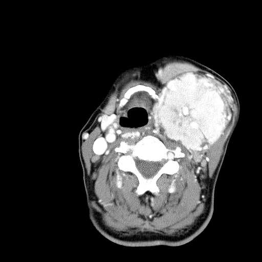
  <figcaption>КТ с контрастом: крупное образование левой половины шеи (сонное и поднижнечелюстное пространства) со смещением дыхательных путей от срединной линии, участками некроза и муфтообразным охватом сонной артерии. Жировое замещение левой половины языка указывает на вовлечение подъязычного нерва. Такая картина — быстрый рост, некроз, охват сосудов, неврологический дефицит — требует исключения злокачественной трансформации (MPNST).</figcaption>
</figure>

# Позвоночник и спинной мозг

Два независимых механизма компрессии:

1. **Дистрофический кифосколиоз** — короткая, резко угловая, быстро прогрессирующая дуга (в отличие от плавной идиопатической). Даёт рестриктивное нарушение дыхания и риск компрессии.
2. **Нейрофибромы корешков** («гантелевидные», через межпозвонковое отверстие); при НФ2 — менингиомы и эпендимомы.

**Частота опухолей и частота симптомов различаются в противоположных направлениях, и это определяет, кого встречает выездная бригада.** При НФ2-ассоциированном шванноматозе спинальные опухоли выявляются по магнитно-резонансной томографии у 60–90 % пациентов, они множественные и разного гистологического типа одновременно — шванномы корешков, менингиомы, интрамедуллярные эпендимомы; само сочетание нескольких типов у одного человека рассматривается как указание на НФ2. При этом клинические проявления дают менее 20 % таких опухолей: большинство стабильны и находятся при плановой визуализации. При НФ1 опухолей меньше — тумор спинального корешка примерно у 20 % пациентов по систематическому обзору 1809 наблюдений, неврофораминальные образования около 40 % при магнитно-резонансной томографии всего тела, — но доля симптомных выше и в разных когортах составляет от 2 до 54 %, а неврологический дефицит на момент обращения описан у 38 % пациентов со спинальными плексиформными нейрофибромами.

С учётом десятикратной разницы в распространённости самих заболеваний (1 : 2500–3000 против 1 : 25 000–33 000) компрессия спинного мозга на догоспитальном этапе чаще встречается у пациента с НФ1 — при том, что «болезнью спинальных опухолей» по структуре поражения является НФ2. Различие в механизмах при этом принципиально: злокачественная опухоль оболочки периферического нерва — путь НФ1 с пожизненным риском порядка 8–16 % в зависимости от возраста и когорты, для НФ2 она не характерна. Поэтому ночная боль в спине с нарастанием за недели и новым неврологическим дефицитом у пациента с кожными признаками НФ1 требует исключения именно злокачественной трансформации, а не только доброкачественной опухоли корешка.

> Боль в спине у пациента с нейрофиброматозом не является «остеохондрозом», пока не исключена компрессия: обязательны сила в конечностях, уровень чувствительности, функция сфинктеров.

<figure>
  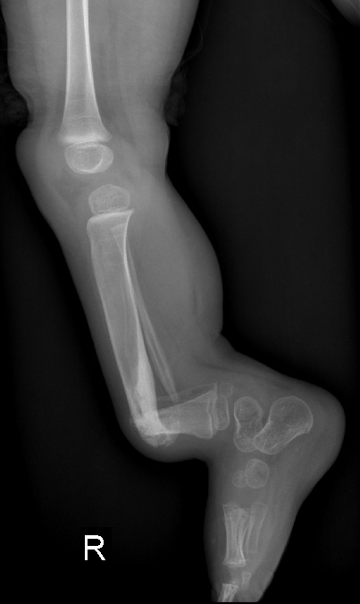
  <figcaption>Переднелатеральное искривление большеберцовой кости с ложным суставом (псевдоартроз) на границе средней и дистальной третей: участок диафиза отсутствует, проксимальный отломок отклонён кпереди и имитирует сустав. Дистальный отдел малоберцовой кости истончён по типу «обсосанного леденца» — характерное костное поражение НФ1.</figcaption>
</figure>

# НФ2-ассоциированный шванноматоз

Определяющий признак — **двусторонние вестибулярные шванномы**, к 30 годам они есть у большинства; дебют чаще в 18–24 года.

| Проявление | Значение |
|---|---|
| **Снижение слуха, шум в ушах, неустойчивость** | Первая жалоба у 40–60 %; возможна внезапная односторонняя глухота |
| **Множественные менингиомы** | Судороги, очаговый дефицит, головная боль |
| **Спинальные эпендимомы и шванномы** | Компрессия спинного мозга |
| **Обструктивная гидроцефалия** | Головная боль, рвота, угнетение сознания — экстренно; многие имеют вентрикуло-перитонеальный шунт (его дисфункция — в дифференциале любого ухудшения) |
| **Парез лицевого нерва** | Часто послеоперационный и старый — легко принять за инсульт |
| **Каудальная группа нервов** | Дисфагия, ослабленный кашель, немая аспирация |
| **Юношеская задняя субкапсулярная катаракта** | Помогает заподозрить синдром |

<figure>
  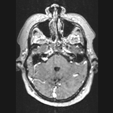
  <figcaption>Двусторонние объёмные образования в мостомозжечковых углах с активным накоплением контраста, распространяющиеся в слуховые проходы и расширяющие их («snow cone» — форма рожка мороженого). Патогномонично для НФ2-ассоциированного шванноматоза.</figcaption>
</figure>

# Шванноматоз без опухолей слуха

Отдельная форма (*SMARCB1*, *LZTR1*), при которой ведущий и часто единственный симптом — **хроническая боль**, плохо соответствующая размеру и локализации опухолей. Вестибулярных шванном нет, интеллект не страдает. Клиническое следствие: такие пациенты годами обращаются с сильной болью без видимой причины и нередко получают несправедливый ярлык симулянта; диагноз объясняет боль.

# Возвращение к клиническому случаю

**Диагноз бригады.** Компрессия спинного мозга у пациента с НФ1. Кожные признаки закрывают вопрос о фоне: более шести ровных пятен «кофе с молоком», множественные кожные нейрофибромы с симптомом кнопки звонка и веснушчатость подмышек — три критерия из перечня, каждого из которых в паре с любым другим достаточно для диагноза; наличие тех же признаков у матери означает аутосомно-доминантную передачу и снимает вопрос о случайности.

**Почему это не остеохондроз.** Диагноз в поликлинике был поставлен по локализации боли, а не по её характеру. Против дегенеративной природы здесь работают четыре факта: боль **постоянная и ночная**, не зависящая от положения тела; давность три недели с нарастанием; **симметричная слабость в ногах** с повышенным тонусом и оживлёнными рефлексами, то есть поражение выше уровня периферического нерва; и наконец **чёткая граница чувствительности** по туловищу. Одного уровня чувствительности достаточно, чтобы разговор об остеохондрозе закончился.

**Три обязательных проверки.** У любого пациента с нейрофиброматозом и болью в спине выполняются: сила в конечностях по группам мышц, уровень чувствительности снизу вверх до появления границы, функция сфинктеров — прямой вопрос о мочеиспускании плюс пальпация надлобковой области и оценка перианальной чувствительности. Здесь все три пункта положительны, и именно они превращают вызов из «болит спина» в «компрессия сейчас».

**Задержка мочи — не деталь, а таймер.** Нарушение функции сфинктеров и перианальная гипестезия означают, что процесс уже задел проводники к тазовым органам. Это худший по прогнозу восстановления симптом: чем дольше существует задержка, тем меньше шансов вернуть функцию после декомпрессии. Переполненный мочевой пузырь на месте выводится катетером, но это мера облегчения, а не решение проблемы, и время эвакуации она увеличивать не должна.

**Механизм сдавления.** При НФ1 их два, и они независимы: гантелевидная нейрофиброма корешка, растущая через межпозвонковое отверстие в позвоночный канал, и дистрофический кифосколиоз — короткая угловая быстро прогрессирующая дуга. При НФ2 к этому добавляются спинальные менингиомы и эпендимомы. Практическое следствие: отсутствие видимой деформации спины компрессию не исключает, поскольку опухоль корешка деформации не даёт.

**Красные флаги злокачественной трансформации.** В этом анамнезе их три: новая постоянная боль с **ночным усилением**, нарастание за недели и **новый неврологический дефицит**. Это набор, который требует исключения злокачественной опухоли оболочки периферического нерва, а не только доброкачественной нейрофибромы. Для бригады разница в тактике нулевая — маршрут один и тот же и срочность одна и та же, — но она определяет объём обследования в стационаре и должна быть озвучена при передаче.

**Давление 145/90 у молодого человека.** Само по себе оно не объясняется болью и требует отдельного вопроса: при НФ1 артериальная гипертензия чаще всего связана либо со стенозом почечной артерии, либо с феохромоцитомой. Сегодня это не ведущая проблема, но при стойкой гипертензии, приступах головной боли с профузной потливостью и сердцебиением она станет ведущей мгновенно — и тогда изменится и выбор препаратов, и маршрут.

**Тактика и маршрут.** Иммобилизация без сгибания позвоночника, перенос на щите или жёстких носилках, обезболивание, катетеризация мочевого пузыря по состоянию, эвакуация в стационар, где есть нейрохирургия и магнитно-резонансная томография в круглосуточном режиме. Мануальные приёмы, массаж, «вытяжение» и физиотерапия при этой картине противопоказаны. Вопрос о глюкокортикоиде при опухолевой компрессии решается в стационаре после визуализации; задача бригады другая — распознать уровень, зафиксировать время появления слабости и задержки мочи и не потерять часы на маршруте.

**В передаче звучат:** нейрофиброматоз первого типа по кожным критериям с семейным анамнезом, уровень чувствительной границы, сроки появления слабости и задержки мочи, ночной характер боли и нарастание за три недели. Последнее — не литература, а основание для того, чтобы магнитно-резонансную томографию сделали в эту смену, а не записали в план.

# Ключевая мысль

Нейрофиброматоз — не диагноз вызова, а **модификатор всех остальных диагнозов**. Гипертония, боль в спине, интубация и травма при НФ протекают иначе. Три состояния убивают быстро и не имеют надписи на лбу: феохромоцитома, разрыв сосуда, компрессия спинного мозга (при НФ2 — ещё гидроцефалия).

# Ответы на вопросы для размышления

**1.** НФ1 (болезнь Реклингхаузена) — ген *NF1* на 17q11.2, белок нейрофибромин выключает сигнал RAS; частота 1 : 2500–3000, самое частое из трёх. НФ2-ассоциированный шванноматоз — ген *NF2* на 22q12.2, белок мерлин; 1 : 25 000–33 000. Шванноматоз — *SMARCB1* и *LZTR1*; 1 : 60 000–70 000. Убивает при них разное, и это главное для бригады: при НФ1 — феохромоцитома, разрыв сосуда и злокачественная опухоль оболочки нерва; при НФ2 — сдавление ствола, гидроцефалия и аспирация; шванноматоз, как правило, не убивает, его ведущее проявление — хроническая боль. Отдельно стоит запомнить, что отсутствие пятен «кофе с молоком» НФ2 не исключает: при нём их обычно меньше шести или нет вовсе, так что глухой молодой человек без кожных признаков — возможный НФ2.

**2.** Двух и более признаков достаточно у человека со здоровыми родителями; при установленном НФ1 у родственника первой линии хватает одного. В перечень входят: шесть и более пятен «кофе с молоком» (больше 5 мм до пубертата, больше 15 мм после), веснушчатость подмышек или паха — симптом Кроу, две и более нейрофибромы или одна плексиформная, глиома зрительного пути, два и более узелка Лиша или хориоидальные аномалии, костное поражение (дисплазия крыла клиновидной кости, искривление большеберцовой кости, ложный сустав) и патогенный вариант гена *NF1*. Признаки появляются в разном возрасте: пятна с рождения, симптом Кроу к 3–5 годам, нейрофибромы с подросткового возраста, узелки Лиша к 5–10 годам, — поэтому у ребёнка отсутствие части критериев ничего не исключает.

**3.** Диагностическое значение имеет число, а не сам факт: одно-два пятна есть примерно у 25 % населения, а критерием служат шесть и более. Край пятна разграничивает синдромы: при НФ1 он ровный и гладкий — «побережье Калифорнии», при синдроме Мак-Кьюна — Олбрайта пятно крупное, чаще одностороннее, не пересекает срединную линию и имеет рваный, зазубренный край — «побережье Мэна». Есть и другие двойники: синдром Легиуса, где пятна и веснушчатость есть, а нейрофибром, узелков Лиша и опухолей нет, и CMMRD, где пятна сочетаются с лейкозами и опухолями мозга в раннем детстве.

**4.** Потому что клинически значимая феохромоцитома выявляется у 0,1–5,7 % пациентов с НФ1, а при уже имеющейся гипертонии частота доходит до 20–50 %. Триада головной боли, профузной потливости и сердцебиения на фоне гипертонии обладает специфичностью выше 90 %; типична пароксизмальность — приступ 15–60 минут с нормой между приступами, — бледность, а не гиперемия, и гипергликемия. Ортостатическая гипотензия при общей гипертонии объясняется хронической гиповолемией: годы избытка катехоламинов держат сосуды, в том числе венозную ёмкость, в постоянном спазме, объём плазмы подстраивается под ужавшееся русло, а длительная гипертензия усиливает прессорный натрийурез. Пока русло сжато, гиповолемия скрыта; при альфа-блокаде русло расширяется и давление обваливается. Отсюда правило: кристаллоид держать наготове.

**5.** Первой всегда идёт альфа-блокада, например урапидилом; бета-адреноблокатор — только после неё. Адреналин действует и на альфа-1 (сужение), и на бета-2 (расширение), и бета-2 частично компенсирует спазм. Блокада бета без предшествующей альфа-блокады снимает эту компенсацию и оставляет альфа-стимуляцию без противовеса: сопротивление и давление растут выше исходного, развивается отёк лёгких. Отдельно стоит помнить препараты-провокаторы криза: метоклопрамид, дроперидол и галоперидол, глюкагон, симпатомиметики и деконгестанты, морфин через гистамин, суксаметоний.

**6.** Стеноз почечной артерии вследствие той же сосудистой дисплазии — самая частая причина гипертонии у ребёнка с НФ1, чаще феохромоцитомы. На неё указывают гипертония у ребёнка или подростка с НФ1, разница давления на руках, шум над животом и плохой ответ на терапию.

**7.** Нейрофибромин работает в эндотелии и гладких мышцах сосудов, и его потеря даёт васкулопатию: истончение стенки, стенозы, аневризмы, свищи. Поэтому при травме объём кровотечения не соответствует энергии повреждения — малая травма даёт большое кровотечение. Без травмы развивается спонтанный гемоторакс от разрыва межрёберной или подключичной артерии: внезапная боль в груди и одышка, классическое смертельное осложнение НФ1. Сюда же относятся кровоизлияние в плексиформную нейрофиброму — быстро растущая болезненная припухлость и шок без видимой кровопотери — и аневризмы почечной, сонной и позвоночной артерий с разрывом, диссекцией или инсультом у молодого.

**8.** Из плексиформной нейрофибромы; такие опухоли есть примерно у половины пациентов с НФ1. Риск накапливается с возрастом: 8,5 % к 30 годам, 12,3 % к 50, 15,8 % к 85 по финским популяционным данным, 8–13 % по популяционной оценке северо-запада Англии. Это главная причина сокращения продолжительности жизни при НФ1; медиана возраста на момент диагноза 26–34 года, пятилетняя выживаемость около 21 %. Красные флаги перерождения: новая или усилившаяся постоянная боль, особенно ночная; быстрый рост за недели; изменение консистенции с мягкой на твёрдую; новый неврологический дефицит в зоне иннервации; размер больше 5 см и глубокое расположение.

**9.** При НФ1 два независимых механизма: гантелевидная нейрофиброма корешка, растущая через межпозвонковое отверстие в позвоночный канал, и дистрофический кифосколиоз — короткая резко угловая быстро прогрессирующая дуга, в отличие от плавной идиопатической. При НФ2 к этому добавляются спинальные менингиомы и эпендимомы. Отсутствие видимой деформации спины компрессию не исключает именно потому, что опухоль корешка деформации не даёт. Три обязательные проверки: сила в конечностях по группам мышц, уровень чувствительности снизу вверх до появления границы и функция сфинктеров — прямой вопрос о мочеиспускании, пальпация надлобковой области и перианальная чувствительность. Нарушение функции сфинктеров — худший по прогнозу восстановления симптом: чем дольше существует задержка мочи, тем меньше шансов вернуть функцию после декомпрессии.

**10.** Обструктивная гидроцефалия — головная боль, рвота, угнетение сознания — и аспирация при вовлечении каудальной группы нервов: дисфагия, ослабленный кашель, немая аспирация. Подробность анамнеза — вентрикуло-перитонеальный шунт, который имеют многие такие пациенты: его дисфункция входит в дифференциальный ряд любого ухудшения. Дополнительная ловушка НФ2: парез лицевого нерва у такого пациента часто послеоперационный и старый, и его легко принять за инсульт.

# Источники

- Legius E., Messiaen L., Wolkenstein P. et al. Revised diagnostic criteria for neurofibromatosis type 1 and Legius syndrome: an international consensus recommendation. *Genetics in Medicine*, 2021; 23(8): 1506–1513 — критерии НФ1 и синдрома Легиуса, объединение пятен и веснушчатости, добавление хориоидальных аномалий и дистрофического сколиоза.
- Plotkin S. R. et al. Updated diagnostic criteria and nomenclature for neurofibromatosis type 2 and schwannomatosis: an international consensus recommendation. *Genetics in Medicine*, 2022 — пересмотр номенклатуры: термин «нейрофиброматоз 2 типа» выведен из употребления, введены НФ2-ассоциированный шванноматоз и формы, связанные с *SMARCB1*, *LZTR1* и 22q.
- Stewart D. R. et al. Care of adults with neurofibromatosis type 1: a clinical practice resource of the American College of Medical Genetics and Genomics (ACMG). *Genetics in Medicine*, 2018 — частота феохромоцитомы 0,1–5,7 % (22 % бессимптомны, в секционных сериях 3,3–13 %), 15 % при обследовании в клинике гипертонии; накопление риска MPNST с возрастом по финским популяционным данным (8,5 % к 30 годам, 12,3 % к 50, 15,8 % к 85); плексиформные нейрофибромы примерно у половины пациентов; медиана возраста при MPNST 33–34 года.
- Evans D. G. R., Baser M. E., McGaughran J. et al. Malignant peripheral nerve sheath tumours in neurofibromatosis 1. *Journal of Medical Genetics*, 2002; 39(5): 311–314 — популяционная оценка пожизненного риска 8–13 %, медиана возраста 26 лет, пятилетняя выживаемость 21 % против 42 % при спорадической форме.
- Mohan M., Waqar M., George K. J. Spinal disease in neurofibromatosis type 1: a systematic review to evaluate reported patterns of pathology. *Journal of Neurology, Neurosurgery & Psychiatry*, 2019; 90(3): e45 (тезисы P89) — 1809 пациентов из 23 работ: опухоль спинального корешка 20,4 %, плексиформная спинальная опухоль 45,9 %, сколиоз 43,6 %, дуральная эктазия 32,1 %.
- Алгоритмы оказания скорой и неотложной медицинской помощи бригадами скорой медицинской помощи. Департамент здравоохранения города Москвы, 2025 — отдельного протокола по нейрофиброматозу нет; тактика при боли в спине с неврологическим дефицитом, гипертензивных состояниях и травме определяется соответствующими разделами.

# Источники иллюстраций

| Файл | Что изображено | Источник и лицензия |
|---|---|---|
| `cafe_au_lait.png` | Пятна «кофе с молоком» | Источник уточняется |
| `axillary_freckling.png` | Симптом Кроу — веснушчатость подмышек | Источник уточняется |
| `cutaneous_neurofibromas.png` | Множественные кожные нейрофибромы | Источник уточняется |
| `plexiform_neurofibroma.png` | Плексиформная нейрофиброма | Источник уточняется |
| `lisch_nodules.png` | Узелки Лиша на радужке | Источник уточняется |
| `mccune_albright_cal.png` | Пятно при синдроме Мак-Кьюна — Олбрайта | Источник уточняется |
| `pheochromocytoma_ct.png` | Феохромоцитома надпочечника, КТ | Источник уточняется |
| `pheochromocytoma_gross.png` | Феохромоцитома, макропрепарат | Источник уточняется |
| `mpnst.png` | Опухоль оболочки нерва шеи, КТ с контрастом | Источник уточняется |
| `tibial_pseudarthrosis.png` | Псевдоартроз большеберцовой кости | Источник уточняется |
| `bilateral_vestibular_schwannoma.png` | Двусторонние вестибулярные шванномы, МРТ | Источник уточняется |

# Выходные данные

**Материал:** «Нейрофиброматоз». Версия 1.0 от 16 августа 2026.

**Серия:** «Крещение поворотом» — клинические разборы догоспитальной практики.

**Лицензия:** текст и оригинальные схемы — Creative Commons «С указанием авторства — Некоммерческая — С сохранением условий» 4.0 (CC BY-NC-SA 4.0). Копировать, печатать и раздавать коллегам можно свободно, включая печать для подстанции; продавать — нельзя; при переработке сохраняется та же лицензия и указывается источник.

**Оговорка.** Материал учебный. Он не является нормативным документом, не заменяет действующие протоколы, клинические рекомендации и распоряжения службы и не может использоваться как единственное основание для клинического решения. Дозы, показания и маршрутизацию проверять по первоисточникам, действующим на момент чтения. Ответственность за решения у постели больного несёт медицинский работник, а не автор материала.

**О клиническом случае.** Случай обезличен: нет имени, даты вызова, адреса, номера карты вызова и названия стационара, бытовые детали изменены. Совпадения с чужой практикой возможны и неизбежны.

**Нашли ошибку?** Ошибка в дозе, сроке или механизме — не мелочь: материал читают перед сменой. Сообщить можно через раздел Issues репозитория проекта; исправление выходит новой версией, а изменение фиксируется в журнале изменений.
