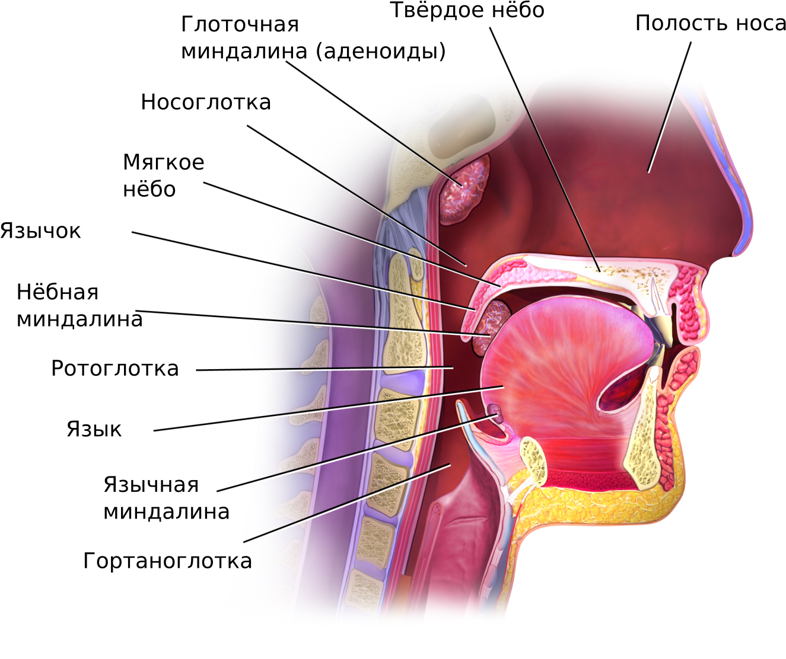
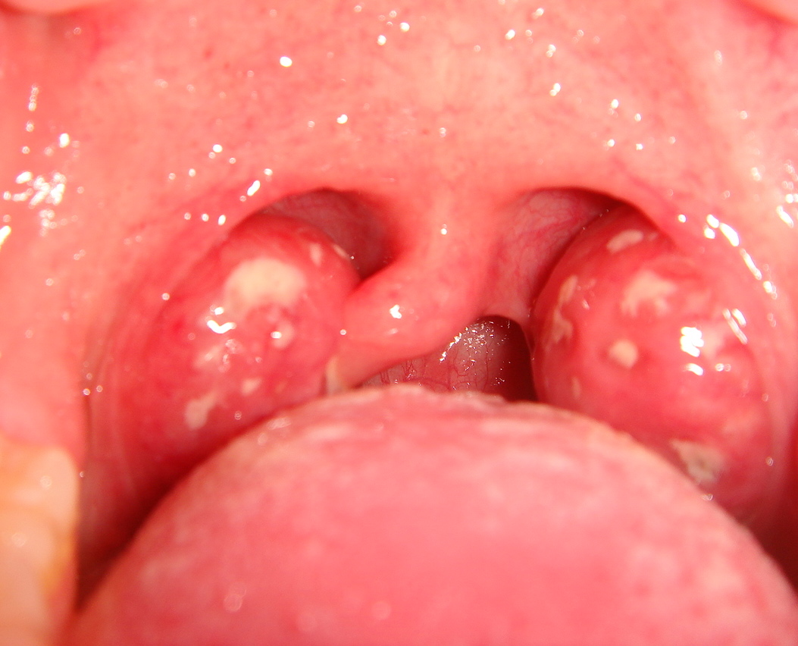
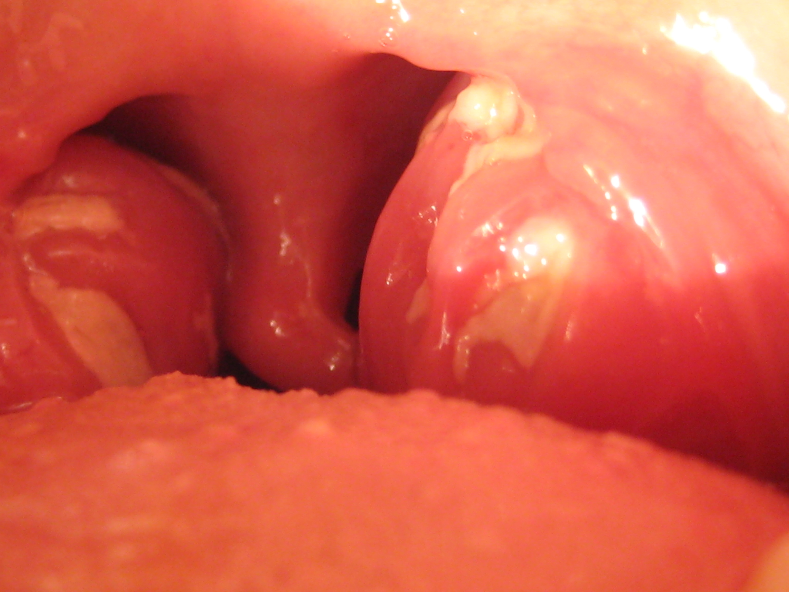
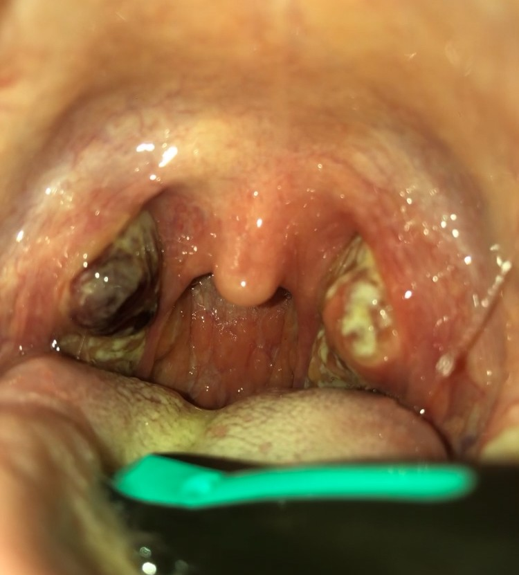
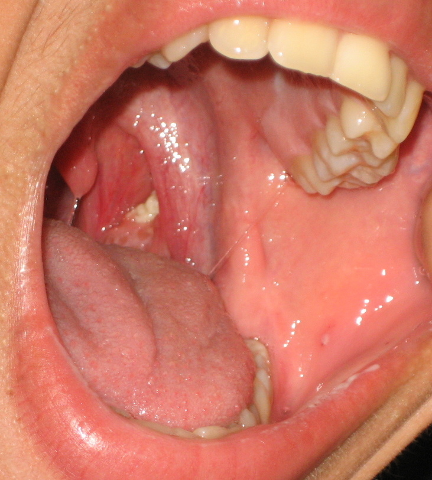
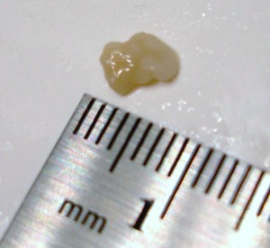
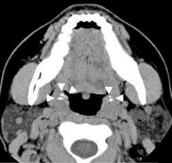

  
Клинический справочный материал

  
Острые тонзиллиты

  
Катаральная, фолликулярная, лакунарная, фибринозная и некротическая ангины. Тонзиллолиты. Дифтерия, мононуклеоз, тонзиллит, вызванный Fusobacterium necrophorum, паратонзиллярный абсцесс, синдром Лемьера, ангина Симановского — Плаута — Венсана. Гематологические маски. Дифференциальный диагноз по картине зева

  

  
С разбором клинического наблюдения: лихорадка длительностью 9 дней у пациента 18 лет с наложениями на миндалинах, односторонней болезненностью по ходу грудино-ключично-сосцевидной мышцы и отсутствием ответа на пероральный цефалоспорин.

  
Серия «Крещение поворотом» · версия 1.1 · 3 сентября 2026 · CC BY-NC-SA 4.0

# Клинический случай

> **Слово бригаде:** «М18, температура свыше 38 держится 9 дней. Пил панцеф (цефиксим), всё равно не помогало. Жалуется на боль в горле, небольшой насморк. В лёгких чисто. Сатурация 98%. Пневмонию исключили, бронхиты всякие тоже. Что даёт такую длительную лихорадку? Полезли смотреть горло: миндалины как будто не увеличены, не ярко-красные, а розовые, обычные, но в каких-то налётах, непонятно, похоже на лакунарную ангину... Надо было их шпателем поскрести... Петехии на мягком нёбе — тоже укладываются в картину. Ну в общем, если ангина — то уже в стадии разрешения. Хотя температура ещё держится, должна бы уже спасть. Лимфоузлы смотрели внимательно, из всех групп нашёлся только подчелюстной узел слева, довольно большой, болезненный. Почему антибиотик не помог до сих пор — опять же, непонятно.» — *Ю.Н.*

## Дополнение к осмотру

Помимо данных, приведённых в цитате, в объём обследования вошли пальпация всех групп периферических лимфатических узлов и пальпация живота. Увеличенным оказался только один узел — подчелюстной слева, крупный, болезненный; заднешейная, переднешейная (кроме указанного узла), подмышечная и надключичная группы не увеличены. Печень и селезёнка не увеличены.

Пациент предъявлял жалобу на боль в шее слева, то есть на стороне увеличенного подчелюстного узла; жалоба сформулирована как боль в шее без указания её отношения к анатомическим ориентирам. При пальпации в этой области определялась болезненность; принадлежность болезненности лимфатическому узлу либо проекции внутренней яремной вены отдельно не документирована. Отёк подкожной клетчатки, инфильтрация, пальпируемый тяж и ограничение поворота головы не выявлены.

Тактический исход вызова: пациент оставлен на месте, отказ от госпитализации.

# Вопросы для размышления

Ответы — в конце материала.

1. Какие характеристики наложений разграничивают дифтерию, стрептококковый экссудат и наложения при инфекционном мононуклеозе и каким приёмом они оцениваются?
2. Пациент с лихорадкой, у которого в криптах обнаружены тонзиллолиты: завершает ли эта находка дифференциальный ряд?
3. Какова чувствительность и специфичность петехий на мягком нёбе в отношении инфекционного мононуклеоза и что следует из этих чисел при обнаружении признака?
4. Какая топография лимфаденопатии свидетельствует в пользу мононуклеоза, а какая — в пользу стрептококкового тонзиллита?
5. Печень и селезёнка при пальпации не увеличены. Насколько этот результат снижает вероятность инфекционного мононуклеоза?
6. Почему лихорадка, сохраняющаяся девять суток, не совмещается с трактовкой «стрептококковая ангина в стадии разрешения»?
7. Пациент с тонзиллитом жалуется на одностороннюю боль в шее. Какие два состояния это объясняет и по каким признакам они разграничиваются?
8. Какой возбудитель тонзиллита у пациентов 15–30 лет встречается чаще БГСА и почему пероральный цефалоспорин III поколения его не покрывает?
9. Соответствует ли девятидневная лихорадка определению лихорадки неясного генеза?
10. Что определяет и чего не определяет шкала Centor / McIsaac?

# Анатомия: лимфоидное кольцо Пирогова — Вальдейера

Нёбные миндалины — парные скопления лимфоидной ткани между нёбно-язычной и нёбно-глоточной дужками. Они являются частью лимфоидного кольца Пирогова — Вальдейера, которое включает также глоточную миндалину (аденоиды), трубные миндалины и язычную миндалину. Кольцо представляет собой первый иммунологический барьер верхних дыхательных путей.

Поверхность нёбных миндалин содержит крипты (лакуны) — инвагинации эпителия, увеличивающие площадь контакта с антигенами. Лакуны — место скопления детрита, слущенного эпителия и бактерий; при воспалении они заполняются гнойным экссудатом, формируя клиническую картину лакунарной ангины.

<figure class="photo">

<figcaption>Рис. Кольцо Пирогова — Вальдейера на сагиттальном срезе: глоточная миндалина (аденоиды) на своде носоглотки, нёбная миндалина между дужками, язычная миндалина на корне языка. Трубные миндалины расположены у глоточных отверстий слуховых труб и в данной проекции не видны.</figcaption>
</figure>

Кровоснабжение осуществляется ветвями наружной сонной артерии (восходящая глоточная, лицевая, язычная). Близость внутренней сонной артерии и внутренней яремной вены объясняет риск сосудистых осложнений при паратонзиллярном абсцессе и синдроме Лемьера.

# Классификация острых тонзиллитов

## Катаральная ангина

Наиболее лёгкая форма. Воспаление ограничено поверхностью слизистой оболочки миндалин.

| Признак | Характеристика |
|---|---|
| Миндалины | увеличены, гиперемированы, без наложений |
| Лакуны | чистые |
| Температура | субфебрильная, до 38 °C |
| Интоксикация | умеренная |
| Лимфоузлы | подчелюстные увеличены, умеренно болезненны |
| Длительность | 3–5 дней |

Дифференциальный диагноз: вирусный фарингит (ОРВИ). Различие — при вирусном фарингите воспаление диффузное, захватывает заднюю стенку глотки, часто сопровождается ринитом и кашлем; при катаральной ангине процесс ограничен миндалинами.

<figure class="photo">

<figcaption>Рис. Катаральная ангина: гиперемия и отёк мягкого нёба и миндалин.</figcaption>
</figure>

## Фолликулярная ангина

Воспаление распространяется на фолликулы миндалин.

| Признак | Характеристика |
|---|---|
| Миндалины | увеличены, гиперемированы; на поверхности — округлые **жёлто-белые точки** 1–3 мм (нагноившиеся фолликулы), видимые сквозь эпителий |
| Картина | «звёздное небо» |
| Температура | 38–39 °C |
| Интоксикация | выраженная: головная боль, миалгии, слабость |
| Лимфоузлы | подчелюстные значительно увеличены, болезненны |
| Длительность | 5–7 дней |

Нагноившиеся фолликулы не снимаются шпателем — они расположены субэпителиально.

<figure class="photo">

<figcaption>Рис. Фолликулярная ангина: на гиперемированных увеличенных миндалинах — отдельные округлые бело-жёлтые очаги размером 1–3 мм, разделённые участками неизменённой поверхности.</figcaption>
</figure>

## Лакунарная ангина

Экссудат заполняет лакуны миндалин.

| Признак | Характеристика |
|---|---|
| Миндалины | увеличены, гиперемированы; в лакунах — **жёлто-белый гнойный налёт**, сливающийся в островки или полоски |
| Налёт | легко снимается шпателем **без кровоточивости**, подлежащая слизистая не повреждена |
| Температура | 39–40 °C |
| Интоксикация | выраженная |
| Лимфоузлы | подчелюстные значительно увеличены |
| Длительность | 5–9 дней |

Налёт при лакунарной ангине не распространяется за пределы миндалин, что составляет один из дифференциальных признаков в отношении дифтерии ротоглотки.

<figure class="photo">

<figcaption>Рис. Лакунарная ангина: бело-жёлтый экссудат заполняет лакуны, повторяя их ход и образуя ветвящийся рисунок; между полосами наложения видна гиперемированная поверхность миндалины, за пределы миндалин наложения не выходят. Экспресс-тест на стрептококковый антиген в данном наблюдении положительный. Разграничение с фибринозной формой количественное: здесь сохраняются отдельные очаги, при фибринозной форме наложение покрывает поверхность миндалины сплошь.</figcaption>
</figure>

## Фибринозная (фибринозно-плёнчатая) ангина

Плёнчатый налёт покрывает поверхность миндалины сплошь и может выходить за её пределы.

| Признак | Характеристика |
|---|---|
| Миндалины | покрыты сплошной **бело-жёлтой плёнкой** |
| Плёнка | может переходить на дужки; при стрептококковой этиологии — снимается без грубого повреждения ткани |
| Температура | 39–40 °C |
| Интоксикация | выраженная |

Фибринозная ангина — форма, при которой дифференциальный диагноз с дифтерией наиболее актуален. Отличия — в разделе «Дифтерия».

<figure class="photo">

<figcaption>Рис. Фибринозно-плёнчатая форма: сплошное бело-жёлтое наложение покрывает поверхность увеличенных миндалин, за их пределы не выходит. Этиология в данном наблюдении — инфекционный мононуклеоз: морфология наложения не определяет возбудителя.</figcaption>
</figure>

## Некротическая ангина

Деструкция ткани миндалины.

| Признак | Характеристика |
|---|---|
| Миндалины | покрыты грязно-серым или зеленоватым налётом; при снятии обнажается **кровоточащая изъязвлённая поверхность** |
| Распространение | может захватывать дужки, язычок, заднюю стенку глотки |
| Температура | 39–40 °C и выше |
| Интоксикация | тяжёлая |
| Длительность | недели |

Некротическая ангина требует исключения гематологического процесса (агранулоцитоз, острый лейкоз) и ангины Симановского — Плаута — Венсана.

<figure class="photo">

<figcaption>Рис. Некротическая ангина: на одной миндалине — участок серо-бурого цвета с распадом ткани и подрытыми краями, на противоположной — плотное жёлто-белое наложение в глубине лакун; окружающая слизистая гиперемирована. Осмотр выполнен со шпателем.</figcaption>
</figure>

Разграничение форм по фотографии имеет предел. Фолликулярная и лакунарная формы различаются локализацией экссудата — субэпителиально в нагноившихся фолликулах либо в просвете крипт, — а фибринозная форма отличается от лакунарной сплошным характером наложения. Первый признак на снимке не воспроизводится вовсе, второй оценивается лишь приблизительно, поскольку решающий параметр — поведение наложения при снятии шпателем — регистрируется только при осмотре. Приведённые ниже фотографии иллюстрируют типичную картину каждой формы, но заменой описанию в карте вызова не служат.

## Сводная таблица: характер налёта

| Форма | Налёт | Снимается? | Кровоточивость | Выходит за миндалину? |
|---|---|---|---|---|
| Катаральная | нет | — | — | — |
| Фолликулярная | жёлто-белые точки (субэпителиально) | нет (фолликулы) | нет | нет |
| Лакунарная | жёлто-белый в лакунах | да, легко | нет | нет |
| Фибринозная | сплошная бело-жёлтая плёнка | да, без грубого повреждения | нет или минимальная | может переходить на дужки |
| Некротическая | грязно-серый, зеленоватый | с трудом | **да** | да |
| **Дифтерия** | серо-белая плёнка, плотная | **с трудом, плёнка рвётся** | **да, выраженная** | **да, характерно** |

# Тонзиллолиты

## Определение и патогенез

Тонзиллолиты (тонзиллярные пробки, конкременты миндалин) — плотные образования в криптах нёбных миндалин, формирующиеся при задержке в лакунах слущенного эпителия, пищевых остатков, бактерий и продуктов их метаболизма с последующей минерализацией. По составу представляют собой дистрофическую кальцификацию, содержащую соли кальция, магния и фосфаты. Формирование связано с хроническим тонзиллитом и анатомическими особенностями крипт.

Распространённость по данным конусно-лучевой компьютерной томографии составляет 17–40 % и увеличивается с возрастом (Aslan Öztürk et al., *Kocaeli Med J*, 2019 — 25,8 % при среднем возрасте 34 года; Bamgbose et al., *Imaging Sci Dent*, 2020 — 33,2 %; Bafandeh et al., *Dent Res J*, 2016 — 40,3 %). Преобладают конкременты размером менее 2–3 мм, выявляемые как случайная находка; расхождение оценок объясняется различием методик визуализации — панорамная рентгенография выявляет около половины конкрементов, обнаруживаемых на конусно-лучевой КТ, и не разрешает образования размером 1 мм и менее.

Тонзиллолиты не относятся к острому воспалительному процессу и **не сопровождаются лихорадкой**. Их выявление у пациента с гипертермией не объясняет лихорадку и не завершает дифференциальный ряд.

<figure class="photo">

<figcaption>Рис. Тонзиллолит в крипте миндалины: плотный бело-жёлтый конкремент при неизменённой окраске окружающей слизистой.</figcaption>
</figure>

<figure class="photo">

<figcaption>Рис. Извлечённый конкремент рядом с измерительной шкалой: размер около 5 мм.</figcaption>
</figure>

<figure class="photo">

<figcaption>Рис. Тонзиллолиты на компьютерной томограмме: кальцинаты в проекции нёбных миндалин.</figcaption>
</figure>

## Клинические проявления

Наиболее частое проявление — галитоз, обусловленный образованием летучих соединений серы анаэробной флорой крипт. Реже описаны ощущение инородного тела, лёгкая дисфагия, оталгия за счёт иррадиации по языкоглоточному нерву, кашель. Крупные конкременты (более 1 см) встречаются редко и могут вызывать локальную боль.

## Дифференциальные признаки в отношении стрептококкового тонзиллита

| Признак | Тонзиллолиты | Стрептококковый тонзиллит |
|---|---|---|
| Течение | хроническое, месяцы и годы, рецидивирующее | острое, часы — сутки |
| Лихорадка | отсутствует | у большинства пациентов, > 38 °C |
| Боль в горле | отсутствует или незначительная; ощущение инородного тела | выраженная одинофагия |
| Галитоз | характерен | не характерен |
| Миндалины | не увеличены, окраска не изменена | увеличены, гиперемированы, отёчны |
| Характер образования | отдельные плотные бело-жёлтые конкременты в криптах, крошатся при извлечении | экссудат в лакунах или сплошной налёт, снимается шпателем как масса |
| Слизистая под образованием | не изменена | гиперемирована, при снятии налёта возможна раневая поверхность |
| Регионарные лимфоузлы | не увеличены, безболезненны | увеличены, болезненны (переднешейные) |
| Экспресс-тест на БГСА | отрицательный | положительный у 50–70 % при 4–5 баллах по Centor |

## Тактика

Бессимптомные тонзиллолиты вмешательства не требуют. При галитозе и дискомфорте применяются полоскания и механическое удаление конкрементов; при рецидивирующем течении с выраженной симптоматикой рассматривается лечение у оториноларинголога, включая криптолиз или тонзиллэктомию. Антибактериальная терапия при изолированных тонзиллолитах не показана: процесс не является острым бактериальным воспалением.

# Этиология

## Бактериальная

Основной возбудитель бактериального тонзиллита — **бета-гемолитический стрептококк группы A** (Streptococcus pyogenes, БГСА). Частота БГСА-этиологии среди всех острых тонзиллитов составляет 15–30 % у взрослых и до 30–40 % у детей. Остальные случаи — преимущественно вирусные.

Другие бактериальные возбудители: стрептококки групп C и G, Arcanobacterium haemolyticum (подростки; может давать скарлатиноподобную сыпь), Fusobacterium necrophorum (у пациентов 15–30 лет выявляется чаще БГСА — см. раздел «Тонзиллит, вызванный Fusobacterium necrophorum»), Neisseria gonorrhoeae (гонококковый фарингит — анамнез).

## Вирусная

Аденовирусы, вирус Эпштейна — Барр (инфекционный мононуклеоз), цитомегаловирус, вирусы Коксаки (герпангина), вирус простого герпеса, ВИЧ (острый ретровирусный синдром). Вирусная этиология не исключает наложений на миндалинах — при мононуклеозе они присутствуют у 50 % пациентов.

## Специфическая

Corynebacterium diphtheriae (дифтерия), Treponema pallidum (сифилитическая ангина — вторичный сифилис), Mycobacterium tuberculosis (редко).

# Шкала Centor / McIsaac

Клинические критерии вероятности БГСА-этиологии. Используются для принятия решения о необходимости экспресс-теста или эмпирической антибактериальной терапии.

| Критерий | Баллы |
|---|---|
| Температура > 38 °C | +1 |
| Отсутствие кашля | +1 |
| Увеличение и болезненность передних шейных лимфоузлов | +1 |
| Экссудат или отёк миндалин | +1 |
| Возраст 3–14 лет | +1 (McIsaac) |
| Возраст 15–44 лет | 0 (McIsaac) |
| Возраст ≥ 45 лет | −1 (McIsaac) |

**Интерпретация:**

| Баллы | Вероятность БГСА | Тактика |
|---|---|---|
| 0–1 | 5–10 % | антибиотики не показаны |
| 2–3 | 15–35 % | экспресс-тест; антибиотики по результату |
| 4–5 | 50–70 % | экспресс-тест или эмпирическая терапия |

Шкала валидирована для оценки вероятности стрептококковой этиологии и не предназначена для разграничения тонзиллитов иного генеза: при подозрении на дифтерию, инфекционный мононуклеоз или паратонзиллярный абсцесс её результат диагностического значения не имеет. Эпидемиологический анамнез в шкале не учитывается.

# Дифтерия ротоглотки

## Возбудитель и патогенез

Corynebacterium diphtheriae — грамположительная палочка, продуцирующая экзотоксин. Токсин вызывает некроз эпителия и формирование плотной фибринозной плёнки из некротизированного эпителия, фибрина, лейкоцитов и бактерий. Плёнка прочно спаяна с подлежащими тканями, её удаление сопровождается кровотечением и быстрым повторным образованием.

Системные эффекты токсина: миокардит (обычно на 1–2-й неделе), полинейропатия (3–7-я неделя), нефрит. Тяжесть определяется не местным процессом, а дозой всосавшегося токсина.

## Клиническая картина

| Признак | Характеристика |
|---|---|
| Начало | постепенное |
| Температура | умеренная (37,5–38,5 °C); несоответствие между выраженностью местных изменений и относительно невысокой лихорадкой |
| Боль в горле | умеренная (слабее, чем при стрептококковой ангине сопоставимого вида) |
| Плёнки | серо-белые или грязно-серые; плотные; расположены **на миндалинах и за их пределами** — на дужках, язычке, задней стенке глотки, мягком нёбе |
| Текстура плёнок | **плотно спаяны** с подлежащей тканью; при попытке снятия **рвутся и кровоточат**; не растираются между шпателями (не крошатся, как гнойный налёт); снятая плёнка тонет в воде (фибрин тяжелее воды) |
| Отёк шеи | при токсической форме — выраженный отёк подкожной клетчатки шеи («бычья шея») |
| Лимфоузлы | подчелюстные увеличены; при токсической форме — контуры сглажены из-за периаденита |
| Запах | сладковатый, приторный |

## Сравнительная характеристика наложений при стрептококковом тонзиллите и дифтерии

| Признак | Ангина (стрептококковая) | Дифтерия |
|---|---|---|
| Локализация | в пределах миндалин | выходит за миндалины |
| Цвет | жёлто-белый | серо-белый, грязно-серый |
| Консистенция | рыхлая, крошится | плотная, эластичная |
| Снятие | легко, без кровоточивости | с трудом, **кровоточит** |
| Повторное образование | медленно | быстро (через часы) |
| Проба с водой | растворяется / распадается | тонет, не растворяется |
| Боль в горле | сильная | умеренная (несоответствие) |
| Температура | высокая (39–40 °C) | умеренная (37,5–38,5 °C) |

## Параметры описания наложений

Описание картины зева при наличии плёнчатых наложений включает: локализацию (одна или обе миндалины, дужки, мягкое нёбо, задняя стенка глотки), цвет, распространение за пределы миндалин, результат попытки снятия шпателем (снимается легко / с трудом / сопровождается кровоточивостью). Эти параметры определяют маршрутизацию с догоспитального этапа и объём обследования в стационаре; при отсутствии в первичном описании они не могут быть восстановлены ретроспективно.

## Тактика на догоспитальном этапе

Подозрение на дифтерию составляет показание к экстренной госпитализации в инфекционный стационар с подачей экстренного извещения (форма 058/у). Антитоксическая противодифтерийная сыворотка вводится в стационаре после постановки пробы на чувствительность; на догоспитальном этапе не применяется. Антибактериальная терапия (эритромицин, пенициллин) имеет вспомогательное значение, поскольку направлена на эрадикацию возбудителя, но не нейтрализует уже циркулирующий токсин; основу этиопатогенетического лечения составляет антитоксин.

## Дифтерия у привитых

Вакцинация (АКДС, АДС-М) формирует **антитоксический** иммунитет: антитела нейтрализуют экзотоксин, но не препятствуют колонизации ротоглотки самой бактерией. Из этого следуют три положения:

- **Привитой человек может заболеть дифтерией.** У привитых заболевание протекает в локализованной, стёртой форме — без токсического компонента, без «бычьей шеи», с картиной, трудно отличимой от банальной лакунарной ангины. Именно стёртые формы у привитых представляют эпидемиологическую проблему: они не распознаются и не изолируются.
- **Привитой человек может быть носителем** токсигенного штамма без клинических проявлений и служить источником инфекции.
- **Поствакцинальный иммунитет угасает.** Национальный календарь предусматривает ревакцинацию АДС-М каждые 10 лет; фактический охват взрослого населения ревакцинацией ниже нормативного. Взрослый, привитый в детстве и не ревакцинированный, к 30–40 годам может иметь защитный титр ниже порогового.

Эпидемиологический контекст: массовая вакцинация снизила заболеваемость на несколько порядков, однако эпидемия в странах бывшего СССР в 1990-х годах (более 150 000 случаев, около 5 000 летальных исходов) развилась на фоне накопления неиммунной прослойки среди взрослого населения. В Российской Федерации регистрируются спорадические случаи и носительство токсигенных штаммов, в том числе у лиц без миграционного анамнеза.

С позиций диагностического процесса вакцинальный анамнез снижает предтестовую вероятность дифтерии, но не является критерием исключения: разграничение с другими формами тонзиллита с наложениями опирается на признаки, доступные при физикальном обследовании (локализация и текстура наложений, соотношение выраженности местных изменений и лихорадки), а также на бактериологическое исследование.

> **Расхождение РФ ↔ международная практика.** ВОЗ и ECDC рассматривают дифтерию как re-emerging infection для Европы: случаи регистрируются ежегодно, в том числе у непутешествовавших. Российские клинические рекомендации требуют мазка на BL (Corynebacterium) из зева и носа при любой ангине с налётами, выходящими за пределы миндалин. На практике этот мазок берётся в стационаре; догоспитальный этап отвечает за подозрение и маршрутизацию.

<figure class="photo">

<figcaption>Рис. Дифтерийная плёнка: плотное серо-белое наложение, выходящее за пределы миндалин.</figcaption>
</figure>

<figure class="photo">

<figcaption>Рис. Серо-белые дифтерийные наложения на обеих миндалинах (акварель, 1890–1891).</figcaption>
</figure>

<figure class="photo">

<figcaption>Рис. Токсическая дифтерия: выраженный отёк шеи («бычья шея»).</figcaption>
</figure>

# Инфекционный мононуклеоз

## Возбудитель

Вирус Эпштейна — Барр (EBV, герпесвирус 4-го типа). Первичное инфицирование в детстве чаще бессимптомное; манифестная форма (мононуклеоз) типична для подростков и молодых взрослых.

## Клиническая картина

| Признак | Характеристика |
|---|---|
| Лихорадка | до 39–40 °C, длительность 1–3 недели |
| Тонзиллит | миндалины увеличены, часто с **грязно-белым или серо-жёлтым налётом**; налёт может напоминать лакунарную или фибринозную ангину |
| **Петехии на мягком нёбе** | у 25–60 % пациентов; появляются на границе мягкого и твёрдого нёба; **высокоспецифичный признак** |
| Лимфаденопатия | генерализованная, но особенно выражена в **заднешейной** группе (заднешейные > переднешейные — в отличие от стрептококковой ангины) |
| Гепатоспленомегалия | спленомегалия у 50–60 %; гепатомегалия у 10–15 %; повышение трансаминаз у 80–90 % |
| Утомляемость | выраженная, сохраняется неделями |
| Сыпь | у 5–10 % спонтанно; у **80–100 %** при назначении аминопенициллинов (ампициллин, амоксициллин) — пятнисто-папулёзная экзантема на 5–9-й день приёма |

## Дифференциальные признаки в отношении стрептококкового тонзиллита

| Признак | БГСА | Мононуклеоз |
|---|---|---|
| Лимфоузлы | переднешейные (подчелюстные) | **заднешейные** + генерализованные |
| Петехии на нёбе | возможны, менее типичны | **характерны** |
| Спленомегалия | нет | да (50–60 %) |
| Ответ на антибиотики | есть (через 24–48 ч) | **нет** |
| Сыпь на ампициллин | нет | **да** (80–100 %) |
| Длительность лихорадки | 3–5 дней | 1–3 недели |
| Возраст | любой | чаще подростки, молодые взрослые |

## Осложнения

- **Разрыв селезёнки** — редко (0,1–0,5 %), но потенциально летально. Селезёнка увеличена и хрупкая. Ограничение физической нагрузки в течение 3–4 недель.
- **Обструкция верхних дыхательных путей** — выраженная гипертрофия миндалин и аденоидов; в тяжёлых случаях — стридор и необходимость стероидной терапии или хирургического вмешательства.
- Аутоиммунная гемолитическая анемия, тромбоцитопения — редко.
- Неврологические: менингоэнцефалит, синдром Гийена — Барре — редко.

## Диагностика на догоспитальном этапе

На догоспитальном этапе диагноз клинический. Наиболее информативно сочетание тонзиллита, заднешейной лимфаденопатии и спленомегалии у пациента подросткового или молодого возраста с лихорадкой длительностью более недели, не купирующейся антибактериальной терапией. Петехиальные элементы на мягком нёбе повышают вероятность диагноза. Пальпация селезёнки входит в объём обследования при данном дифференциальном ряде.

Отрицательный результат пальпации интерпретируется с учётом её операционных характеристик: чувствительность пальпаторных и перкуторных приёмов в отношении спленомегалии, верифицированной ультразвуковым исследованием, составляет 31–86 % при специфичности 82–93 % (Grover et al., *JAMA*, 1993); перкуссия пространства Траубе — около 53 %, что уступает ультразвуковому исследованию в точке оказания помощи (Olson et al., *Ultrasound Quarterly*, 2024). Таким образом, невыявленная при пальпации селезёнка снижает вероятность мононуклеоза, но не исключает ни спленомегалию, ни сам диагноз, при котором она отсутствует у 40–50 % пациентов.

Лабораторно (стационар): атипичные мононуклеары в мазке крови (> 10 %), положительный экспресс-тест на гетерофильные антитела (Paul — Bunnell, Monospot), серология EBV (VCA IgM).

Диагностическая значимость отдельных признаков (Ebell et al., *JAMA*, 2016): заднешейная лимфаденопатия — LR+ 3,1; петехии на мягком нёбе — чувствительность 27 %, специфичность 95 %; спленомегалия — LR+ 1,9–6,6 в зависимости от методики оценки. Совокупность трёх признаков у пациента подросткового или молодого возраста с лихорадкой длительностью более недели повышает вероятность мононуклеоза до уровня, при котором целесообразна лабораторная верификация.

<figure class="photo">

<figcaption>Рис. Инфекционный мононуклеоз: наложения на миндалинах и петехии на мягком нёбе.</figcaption>
</figure>

# Паратонзиллярный абсцесс

## Патогенез

Распространение инфекции за капсулу миндалины в паратонзиллярную клетчатку с формированием отграниченного скопления гноя. Наиболее частая локализация — верхний полюс миндалины (супратонзиллярный абсцесс). Типично возникает как осложнение нелеченного или неадекватно леченного тонзиллита, но может развиться и без предшествующей ангины.

## Клиническая картина

| Признак | Характеристика |
|---|---|
| Боль | **односторонняя**, нарастающая, с иррадиацией в ухо на стороне поражения |
| **Тризм** | ограничение открывания рта из-за воспалительной контрактуры крыловидных мышц; пациент с трудом открывает рот |
| Речь | «горячая каша во рту» (невнятная, гнусавая) |
| Глотание | резко болезненное; слюнотечение (пациент не глотает слюну) |
| Осмотр зева | **асимметрия**: выбухание мягкого нёба и дужки на стороне поражения; **отклонение язычка** в противоположную сторону; миндалина смещена медиально и книзу |
| Температура | 39–40 °C |
| Общее состояние | тяжёлое; вынужденное положение головы с наклоном в сторону поражения |

## Дифференциальный диагноз

| Состояние | Отличие от ПТА |
|---|---|
| Тяжёлая ангина | симметричное поражение, нет тризма, нет отклонения язычка |
| Заглоточный абсцесс | выбухание задней стенки глотки, без асимметрии миндалин; чаще у детей до 6 лет |
| Эпиглоттит | дисфагия, слюнотечение, стридор; осмотр ротоглотки может быть нормальным; диагноз — ларингоскопия |
| Перитонзиллярный целлюлит | предшествует абсцессу; нет флюктуации; отёк без отграниченного скопления |

## Тактика

Экстренная госпитализация. Вскрытие и дренирование абсцесса — в ЛОР-стационаре. На догоспитальном этапе — обезболивание (НПВС), обеспечение проходимости дыхательных путей при выраженном тризме и отёке.

Осложнения при несвоевременном лечении: распространение инфекции в парафарингеальное пространство, медиастинит, эрозия сонной артерии, тромбоз внутренней яремной вены (синдром Лемьера).

<figure class="photo">

<figcaption>Рис. Паратонзиллярный абсцесс: одностороннее смещение мягкого нёба и миндалины.</figcaption>
</figure>

# Тонзиллит, вызванный Fusobacterium necrophorum

## Эпидемиологические характеристики

Fusobacterium necrophorum — облигатный анаэроб ротоглотки, рассматриваемый преимущественно как возбудитель синдрома Лемьера, однако выступающий и самостоятельной причиной острого тонзиллита у подростков и молодых взрослых. В кросс-секционном исследовании 312 пациентов 15–30 лет с острой болью в горле (Centor et al., *Ann Intern Med*, 2015) F. necrophorum методом ПЦР выявлен у 20,5 %, БГСА — у 10,3 %, стрептококки групп C/G — у 9,0 %; у бессимптомных лиц контрольной группы F. necrophorum обнаружен в 9,4 %. Частота выявления возрастала с увеличением балла по шкале Centor. Европейские данные указывают на долю не менее 10 % случаев фарингита в этой возрастной группе.

## Клинические особенности

Клиническая картина сходна со стрептококковым тонзиллитом: экссудативный тонзиллит, лихорадка, болезненная переднешейная лимфаденопатия, отсутствие кашля, — что не позволяет разграничить состояния по шкале Centor. Особенности, обращающие на себя внимание: возрастная группа 15–25 лет, затяжное или нарастающее течение, отсутствие ответа на терапию, ориентированную на БГСА, и отрицательный экспресс-тест на стрептококковый антиген. Точка оказания помощи специфическим тестом не располагает: ПЦР-диагностика в рутинной практике недоступна.

Изменения по ходу грудино-ключично-сосцевидной мышцы (болезненность, отёк, инфильтрация, пальпируемый тяж, боль при повороте головы) к картине неосложнённого тонзиллита этой этиологии не относятся: они отражают тромбофлебит внутренней яремной вены, то есть уже сформировавшийся синдром Лемьера, и оцениваются как признак осложнения, а не как критерий этиологического диагноза.

## Терапевтические следствия

Возбудитель чувствителен к пенициллинам, метронидазолу и клиндамицину, устойчив к макролидам (азитромицин активностью не обладает). Пероральные цефалоспорины III поколения, включая цефиксим, надёжного анаэробного покрытия не обеспечивают. Клиническое значение этиологии определяется исходом: F. necrophorum служит основным возбудителем синдрома Лемьера и обнаруживается при большинстве паратонзиллярных абсцессов, в связи с чем затяжной тонзиллит у пациента 15–25 лет без ответа на терапию рассматривается как состояние с риском гнойно-септического осложнения.

# Синдром Лемьера

## Определение

Тромбофлебит внутренней яремной вены с септической эмболизацией, развивающийся как осложнение ротоглоточной инфекции. Основной возбудитель — **Fusobacterium necrophorum** (облигатный анаэроб, нормальный обитатель ротоглотки).

## Патогенез

Инфекция ротоглотки (тонзиллит, паратонзиллярный абсцесс, перидентальный абсцесс) → распространение по перитонзиллярным венам → тромбофлебит внутренней яремной вены → септическая эмболизация в лёгкие (наиболее часто), суставы, печень, мозг.

## Клиническая картина

| Фаза | Признаки |
|---|---|
| Первичная инфекция (1–3 нед. до) | тонзиллит, перитонзиллярный абсцесс; может казаться разрешившимся |
| Югулярный тромбофлебит | боль и отёк по ходу кивательной мышцы; ригидность шеи; болезненность при повороте головы в противоположную сторону; лихорадка с ознобами |
| Септические эмболии | **лёгкие** (кашель, плевральная боль, инфильтраты на рентгенограмме, абсцессы); **суставы** (септический артрит); реже — печень, почки, мозг |

## Раннее распознавание

Признаком, доступным на догоспитальном этапе до появления лёгочной симптоматики, служит односторонняя боль и болезненность по ходу грудино-ключично-сосцевидной мышцы у пациента с текущим или недавно перенесённым тонзиллитом. Отёк подкожной клетчатки, инфильтрация и пальпируемый тяж по ходу вены относятся к более поздним находкам и на момент первичного осмотра могут отсутствовать; их отсутствие диагноз не отвергает. Аускультативная картина лёгких и сатурация остаются нормальными до септической эмболизации, поэтому нормальные показатели дыхательной системы также не исключают формирующийся тромбофлебит.

Из общих признаков диагностическое значение имеет не наличие озноба, а его градация: субъективное познабливание сопровождает лихорадку любого происхождения, тогда как потрясающий озноб (субъективное ощущение холода с объективной мышечной дрожью) указывает на бактериемию — отношение правдоподобия 4,7 при чувствительности 0,37 и специфичности 0,87 (Coburn et al., *JAMA*, 2012; Shimizu et al., *BMC Medicine*, 2024). Для сравнения, изолированная температура ≥ 38 °C даёт отношение правдоподобия 1,9, изолированный лейкоцитоз — менее 1,7. Таким образом, при подозрении на септическое течение фиксируется характер озноба, а не его наличие.

Дифференциально-диагностическая ошибка, описанная в литературе, состоит в трактовке боли в шее как регионарного лимфаденита: увеличенный лимфатический узел определяется как отграниченное подвижное образование в подчелюстной или переднешейной области, тогда как при югулярном тромбофлебите болезненность распространяется по ходу мышцы, то есть по проекции внутренней яремной вены.

## Демографические и прогностические характеристики

Заболевание поражает преимущественно ранее здоровых лиц 15–25 лет. Типичная последовательность: перенесённая 1–3 недели назад инфекция ротоглотки, часто без обращения за медицинской помощью, затем лихорадка с ознобами, боль в области шеи, симптомы поражения лёгких (кашель, плевральная боль). В англоязычной литературе состояние описывается формулой «sepsis after a sore throat in a young adult».

Заболеваемость составляет около 1–4 случаев на миллион населения в год. Летальность без лечения достигает 90 %; при адекватной антибактериальной терапии (метронидазол в комбинации с бета-лактамом, защищённым ингибитором бета-лактамаз) — 5–10 %. Диагностическим ориентиром служит указание на перенесённую инфекцию ротоглотки за 1–3 недели до манифестации септического состояния; визуализация тромбоза внутренней яремной вены выполняется методом КТ с контрастированием или УЗИ.

# Ангина Симановского — Плаута — Венсана

## Возбудители

Симбиоз **Treponema vincentii** (спирохета) и **Fusobacterium fusiforme** (веретенообразная палочка). Оба микроорганизма являются условно-патогенной флорой полости рта. Заболевание развивается при снижении местного или общего иммунитета: голодание, авитаминоз, иммунодефицит, хронические истощающие заболевания, плохая гигиена полости рта.

## Клиническая картина

| Признак | Характеристика |
|---|---|
| Поражение | **одностороннее** |
| Язва | глубокая, кратерообразная, на поверхности миндалины; дно покрыто грязно-серым или зеленоватым налётом |
| Боль | умеренная (несоответствие выраженности деструкции и болевого синдрома) |
| Запах | резкий, **гнилостный** |
| Температура | нормальная или субфебрильная |
| Лимфоузлы | увеличены на стороне поражения |
| Общее состояние | относительно удовлетворительное |

## Дифференциальный диагноз

Сочетание одностороннего поражения, глубокого язвенного дефекта и относительно удовлетворительного общего состояния разграничивает ангину Симановского — Плаута — Венсана с двумя основными альтернативами: некротической формой стрептококкового тонзиллита (двустороннее поражение, тяжёлое общее состояние, высокая лихорадка) и злокачественным новообразованием миндалины (отсутствие лихорадки, более длительный анамнез, плотные безболезненные лимфатические узлы). В случаях, не разрешаемых клинически, показано морфологическое исследование биоптата.

<figure class="photo">

<figcaption>Рис. Ангина Симановского — Плаута — Венсана: язвенно-некротические изменения миндалины.</figcaption>
</figure>

# Гематологические маски тонзиллита

Ряд гематологических заболеваний дебютирует или осложняется некротическим поражением миндалин, которое клинически напоминает тяжёлую ангину.

## Агранулоцитоз

Снижение абсолютного числа нейтрофилов ниже 0,5 × 10⁹/л устраняет ведущий механизм местной противоинфекционной защиты слизистой оболочки. Формируется некротическое поражение миндалин без гнойного компонента: гнойный экссудат представлен преимущественно нейтрофилами, и при их дефиците не образуется. Этиология: лекарственный агранулоцитоз (метамизол натрия, тиамазол, клозапин, карбамазепин, сульфаниламиды), аутоиммунный, цитостатическая миелосупрессия.

Признаки, характерные для агранулоцитарной ангины:

- некротическое поражение миндалин при отсутствии выраженного гнойного экссудата;
- отсутствие ответа на антибактериальную терапию;
- лекарственный анамнез (метамизол натрия, тиреостатики);
- сопутствующий стоматит или гингивит;
- лейкопения с нейтропенией в общем анализе крови (верифицирующий признак).

## Острый лейкоз

Инфильтрация миндалин бластными клетками с последующим некрозом. Картина в зеве — некротическая ангина. Сопутствующие признаки: бледность (анемия), геморрагический синдром (петехии, экхимозы, носовые кровотечения), гепатоспленомегалия, генерализованная лимфаденопатия, лихорадка.

Разграничение с инфекционным мононуклеозом (общие признаки — лимфаденопатия, спленомегалия, изменения в зеве) проводится по гемограмме: для острого лейкоза характерны анемия, тромбоцитопения и наличие бластных клеток в периферической крови; для мононуклеоза — атипичные мононуклеары при нормальном или незначительно сниженном количестве тромбоцитов.

## Диагностическая тактика

Некротическое поражение миндалин без ответа на антибактериальную терапию в сочетании с бледностью кожных покровов, геморрагическим синдромом или соответствующим лекарственным анамнезом составляет показание к общему анализу крови с подсчётом лейкоцитарной формулы и консультации гематолога. Маршрутизация с догоспитального этапа — многопрофильный стационар.

# Дифференциальный диагноз по картине зева: сводная таблица

<table class="small-table">
<thead>
<tr><th>Картина</th><th>БГСА-ангина</th><th>Дифтерия</th><th>Мононуклеоз</th><th>ПТА</th><th>Венсан</th><th>Агранулоцитоз</th></tr>
</thead>
<tbody>
<tr><td><strong>Симметрия</strong></td><td>двуст.</td><td>чаще двуст.</td><td>двуст.</td><td><strong>односторонн.</strong></td><td><strong>односторонн.</strong></td><td>двуст.</td></tr>
<tr><td><strong>Налёт</strong></td><td>жёлто-белый</td><td>серо-белый, плотный</td><td>грязно-белый</td><td>отёк, ± налёт</td><td>грязно-серый, язва</td><td>некроз без гноя</td></tr>
<tr><td><strong>За пределы миндалин</strong></td><td>нет</td><td><strong>да</strong></td><td>нет</td><td>отёк — да</td><td>нет</td><td>возможно</td></tr>
<tr><td><strong>Кровоточивость</strong></td><td>нет</td><td><strong>да</strong></td><td>нет</td><td>нет</td><td>да (язва)</td><td>да (некроз)</td></tr>
<tr><td><strong>Боль</strong></td><td>сильная</td><td>умеренная</td><td>умеренная</td><td>сильная, одност.</td><td>умеренная</td><td>умеренная</td></tr>
<tr><td><strong>Тризм</strong></td><td>нет</td><td>нет</td><td>нет</td><td><strong>да</strong></td><td>нет</td><td>нет</td></tr>
<tr><td><strong>Отклонение язычка</strong></td><td>нет</td><td>нет</td><td>нет</td><td><strong>да</strong></td><td>нет</td><td>нет</td></tr>
<tr><td><strong>Заднешейные ЛУ</strong></td><td>нет</td><td>нет</td><td><strong>да</strong></td><td>нет</td><td>нет</td><td>нет</td></tr>
<tr><td><strong>Спленомегалия</strong></td><td>нет</td><td>нет</td><td><strong>да</strong></td><td>нет</td><td>нет</td><td>возможна</td></tr>
<tr><td><strong>Петехии на нёбе</strong></td><td>возможны</td><td>нет</td><td><strong>характерны</strong></td><td>нет</td><td>нет</td><td>возможны</td></tr>
<tr><td><strong>Ответ на АБ</strong></td><td>да</td><td>медленный</td><td><strong>нет</strong></td><td>без дренирования — нет</td><td>да (метронидазол)</td><td><strong>нет</strong></td></tr>
<tr><td><strong>Возраст</strong></td><td>любой</td><td>любой</td><td>подростки</td><td>любой</td><td>ослабленные</td><td>любой</td></tr>
<tr><td><strong>Запах</strong></td><td>нет</td><td>сладковатый</td><td>нет</td><td>гнилостный</td><td><strong>гнилостный</strong></td><td>гнилостный</td></tr>
</tbody>
</table>

Эта таблица вместе с последовательностью осмотра, параметрами описания наложений и перечнем признаков, требующих эвакуации, вынесена в отдельный материал — чеклист [«Осмотр горла»](../../cheklisty/osmotr_gorla/osmotr_gorla.pdf), пригодный для печати и использования на вызове.

В таблицу не включены тонзиллолиты: они не относятся к воспалительным наложениям и разграничиваются с перечисленными состояниями по отсутствию лихорадки, неизменённой окраске миндалин и хроническому течению (см. раздел «Тонзиллолиты»). Приведённые в строках «Заднешейные ЛУ» и «Спленомегалия» признаки оцениваются с учётом их чувствительности: отрицательный результат пальпации снижает вероятность мононуклеоза, но не исключает его.

# Объём физикального обследования при боли в горле

Перечень оцениваемых параметров и их дифференциально-диагностическое значение. Тот же перечень в виде последовательности осмотра приведён в чеклисте [«Осмотр горла»](../../cheklisty/osmotr_gorla/osmotr_gorla.pdf).

| Область осмотра | Оцениваемые параметры | Дифференциально-диагностическое значение |
|---|---|---|
| **Зев** | характер и цвет наложений; локализация (миндалины, дужки, нёбо, задняя стенка); симметрия; результат осторожной попытки снятия шпателем | разграничение форм тонзиллита; выход наложений за пределы миндалин и кровоточивость при снятии — в пользу дифтерии |
| **Мягкое нёбо** | петехиальные элементы | мононуклеоз (специфичность 95 %) |
| **Язычок** | положение (срединное / отклонение) | отклонение — паратонзиллярный абсцесс |
| **Открывание рта** | степень ограничения | тризм — паратонзиллярный абсцесс |
| **Лимфатические узлы** | топография: переднешейные (подчелюстные), заднешейные, генерализованная лимфаденопатия | переднешейные — стрептококковый тонзиллит; заднешейные — мононуклеоз; генерализованная — мононуклеоз, лейкоз, ВИЧ-инфекция |
| **Живот** | размеры печени и селезёнки | спленомегалия — мононуклеоз, гемобластоз; отрицательный результат пальпации имеет чувствительность 31–86 % и диагноз не исключает |
| **Кожные покровы** | бледность; петехии и экхимозы; экзантема | бледность — агранулоцитоз, лейкоз; геморрагический синдром — тромбоцитопения; экзантема — скарлатина, мононуклеоз на фоне аминопенициллинов |
| **Шея** | отёк подкожной клетчатки; болезненность по ходу грудино-ключично-сосцевидной мышцы | отёк — токсическая форма дифтерии; локальная болезненность — синдром Лемьера |
| **Анамнез** | длительность заболевания; предшествующая антибактериальная терапия и ответ на неё; вакцинальный статус; принимаемые препараты; эпидемиологические данные | дифтерия, агранулоцитоз, гонококковый фарингит |
| **Соотношение местных изменений и лихорадки** | выраженность изменений в зеве относительно уровня температуры | несоответствие (обширные изменения при умеренной лихорадке) — дифтерия, ангина Симановского — Плаута — Венсана; лихорадка при минимальных изменениях зева — мононуклеоз, гематологический процесс, внеглоточный источник |
| **Длительность лихорадки** | число суток гипертермии; динамика на фоне антибактериальной терапии | 3–5 суток — БГСА-тонзиллит; более недели — мононуклеоз, дифтерия, анаэробная инфекция, гемобластоз; сохранение лихорадки при регрессе картины зева — осложнение или иной источник |

<figure class="photo">

<figcaption>Рис. Физикальное обследование: взятие мазка из зева при подозрении на стрептококковую инфекцию.</figcaption>
</figure>

# Алгоритмы ДЗМ: дифтерия и бактериальный менингит

В контексте данного материала из Алгоритмов ДЗМ (приказ 535 от 18.05.2023) релевантны следующие положения:

| Ситуация | Тактика | Внутренняя страница |
|---|---|---|
| Подозрение на дифтерию | экстренная госпитализация в инфекционный стационар; экстренное извещение (ф. 058/у) | 63 |
| Токсическая дифтерия | преднизолон 90–120 мг (3–4 мл) в/в | 63 |
| Паратонзиллярный абсцесс | госпитализация в ЛОР-стационар | — |
| Подозрение на мононуклеоз | госпитализация в инфекционный стационар для дифференциальной диагностики | — |
| Некротический тонзиллит с подозрением на гематологический процесс | госпитализация в многопрофильный стационар | — |

> **Расхождение РФ ↔ международная практика.** Международные протоколы при подозрении на БГСА-тонзиллит рекомендуют экспресс-тест на стрептококковый антиген (rapid antigen detection test, RADT) перед назначением антибиотиков. В условиях российской скорой помощи экспресс-тестирование на БГСА недоступно; решение о госпитализации или амбулаторном лечении основывается на клинической оценке, наличии осложнений и социальных факторов.

# Антибактериальная терапия БГСА-тонзиллита

Антибиотики при БГСА-тонзиллите назначаются не только для ускорения разрешения симптомов, но и для профилактики осложнений: острой ревматической лихорадки (ОРЛ), паратонзиллярного абсцесса, гломерулонефрита (частично).

## Препарат выбора

**Феноксиметилпенициллин** (пенициллин V) или **амоксициллин** перорально, курс 10 дней. Альтернатива при аллергии на пенициллины — макролиды (азитромицин 5 дней, кларитромицин 10 дней) или цефалоспорины I поколения (цефалексин 10 дней).

БГСА не вырабатывает бета-лактамазу, поэтому добавление клавулановой кислоты не требуется. Резистентность БГСА к пенициллину не описана.

## Ампициллин / амоксициллин при мононуклеозе

Назначение аминопенициллинов при мононуклеозе вызывает пятнисто-папулёзную сыпь у 80–100 % пациентов (механизм: взаимодействие препарата с повышенным уровнем IgM-антител; не IgE-опосредованная аллергия). Сыпь не является истинной аллергией на пенициллины и не означает пожизненного противопоказания к бета-лактамам, однако в острой фазе мононуклеоза аминопенициллины не назначаются.

Дифференциально-диагностическое следствие: появление пятнисто-папулёзной сыпи на 5–9-й день приёма аминопенициллина у пациента с тонзиллитом, не ответившим на терапию, с большей вероятностью указывает на инфекционный мононуклеоз, чем на лекарственную гиперчувствительность.

# Возвращение к клиническому случаю

## Анализ признаков

**Длительность лихорадки.** Лихорадка свыше 38 °C, сохраняющаяся 9 дней, выходит за рамки типичного течения стрептококкового тонзиллита, при котором температура нормализуется на 3–5-е сутки спонтанно и в течение 24–48 часов от начала адекватной антибактериальной терапии.

Критериям лихорадки неясного генеза наблюдение не соответствует по длительности: исходное определение (Petersdorf, Beeson, *Medicine*, 1961) требует температуры выше 38,3 °C, зарегистрированной не менее трёх раз, при длительности заболевания не менее трёх недель и отсутствии диагноза после недели обследования в стационаре; в модификации Durack и Street (1991) трёхнедельный порог сохранён при сокращении срока обследования до трёх суток в стационаре или трёх амбулаторных визитов. Девять суток этому порогу не удовлетворяют; соответствие температурному критерию по имеющимся данным не устанавливается. Наблюдение относится к затяжной лихорадке, требующей отдельного объяснения, но не к лихорадке неясного генеза, и предусмотренный для последней диагностический маршрут к нему не применяется.

**Характер миндалин и наложений.** Миндалины не увеличены, окраска бледно-розовая, при этом присутствуют наложения. Диссоциация между слабой выраженностью местной воспалительной реакции и наличием наложений описана при инфекционном мононуклеозе, дифтерии, ангине Симановского — Плаута — Венсана, а также при тонзиллолитах, которые к воспалительным наложениям не относятся. Параметры, разграничивающие эти состояния, — консистенция, спаянность с подлежащей тканью, кровоточивость при снятии и распространённость за пределы миндалин (см. раздел «Параметры описания наложений») — в наблюдении не документированы.

**Петехии на мягком нёбе.** Признак описан при инфекционном мононуклеозе у 25–60 % пациентов; его операционные характеристики — чувствительность 27 %, специфичность 95 % (Ebell et al., *JAMA*, 2016). Высокая специфичность при низкой чувствительности означает, что наличие признака повышает вероятность мононуклеоза, но он встречается и при стрептококковом тонзиллите, поэтому изолированно вопрос не решает.

**Топография лимфаденопатии.** Единственный увеличенный подчелюстной узел соответствует регионарному лимфадениту при бактериальном тонзиллите. Для инфекционного мононуклеоза характерна генерализованная лимфаденопатия с преобладанием заднешейной группы (LR+ 3,1); её отсутствие при обследовании всех групп снижает вероятность мононуклеоза.

**Отсутствие гепатоспленомегалии.** Спленомегалия описана при мононуклеозе у 50–60 % пациентов, гепатомегалия — у 10–15 %. Отрицательный результат пальпации снижает вероятность диагноза, но не исключает его: чувствительность пальпаторных и перкуторных приёмов в отношении спленомегалии, верифицированной ультразвуковым исследованием, составляет 31–86 % в зависимости от методики, для перкуссии пространства Траубе — около 53 % (Grover et al., *JAMA*, 1993; Olson et al., *Ultrasound Quarterly*, 2024). Таким образом, отсутствие органомегалии при пальпации соответствует отрицательному результату теста с умеренной чувствительностью и не равнозначно её отсутствию.

**Предшествующая антибактериальная терапия.** Цефиксим (Панцеф) — пероральный цефалоспорин III поколения, активный в отношении S. pyogenes, но не обеспечивающий надёжного покрытия анаэробов и стафилококков; всасывание составляет 40–50 % от принятой дозы. Отсутствие эффекта на девятые сутки совместимо с вирусной этиологией, с анаэробной инфекцией ротоглотки, с дифтерией и с гематологическим процессом; при стрептококковой этиологии оно потребовало бы объяснения через осложнение или недостаточную экспозицию препарата.

**Односторонняя боль в шее.** Жалоба допускает два объяснения, различающихся по частоте и по последствиям. Первое и наиболее вероятное — регионарный лимфаденит: увеличенный болезненный подчелюстной узел расположен на той же стороне и сам по себе служит источником боли, а лимфаденит сопровождает бактериальный тонзиллит закономерно. Второе — тромбофлебит внутренней яремной вены (синдром Лемьера), при котором боль и болезненность распространяются по ходу грудино-ключично-сосцевидной мышцы, то есть по проекции вены, а не ограничиваются отграниченным подвижным образованием (см. раздел «Синдром Лемьера»).

Разграничение опирается на топографию болезненности относительно узла и проекции вены, а также на наличие отёка, инфильтрации и пальпируемого тяжа; в наблюдении зафиксирован лишь факт болезненности в области шеи слева. Отсутствие отёка, инфильтрации, тяжа и лёгочной симптоматики согласуется с лимфаденитом и одновременно не исключает ранней фазы тромбофлебита, при которой перечисленные признаки ещё не сформированы. Заболеваемость синдромом Лемьера составляет 1–4 случая на миллион населения в год при летальности без лечения до 90 % — сочетание, при котором версия остаётся в ряду не по вероятности, а по цене ошибки.

**Отсутствие лёгочной симптоматики.** Чистые лёгкие, сатурация 98 %, исключённые пневмония и бронхит устраняют наиболее частую альтернативную причину затяжной лихорадки и переносят поиск в ротоглотку и лимфоидную систему. В отношении септических осложнений отрицательный результат интерпретируется с учётом стадийности: эмболизация в лёгкие следует за формированием тромбофлебита, поэтому нормальная аускультативная картина соответствует и отсутствию осложнения, и фазе, ему предшествующей.

## Дифференциальный ряд

| Состояние | Данные за | Данные против |
|---|---|---|
| **Инфекционный мононуклеоз (EBV, CMV)** | возраст 18 лет — типичная группа манифестной формы; лихорадка длительностью 9 дней при характерной для мононуклеоза продолжительности 1–3 недели; петехии на мягком нёбе (специфичность 95 %); наложения при слабо выраженной гиперемии миндалин; ринорея; отсутствие ответа на цефиксим, закономерное при вирусной этиологии | заднешейная и генерализованная лимфаденопатия не выявлена при осмотре всех групп; печень и селезёнка не увеличены; миндалины не гипертрофированы — при том, что отрицательный результат пальпации имеет чувствительность 31–86 %, а спленомегалия отсутствует у 40–50 % пациентов с подтверждённым диагнозом |
| Стрептококковый тонзиллит (в том числе в стадии разрешения) | боль в горле; наложения на миндалинах; регионарный подчелюстной лимфаденит | сохранение лихорадки 9 дней; отсутствие выраженной гиперемии и отёка миндалин; отсутствие ответа на препарат, активный в отношении S. pyogenes |
| Синдром Лемьера (тромбофлебит внутренней яремной вены) — версия исключения | односторонняя боль в шее; возраст 18 лет (типичный диапазон 15–25 лет); тонзиллит с лихорадкой девятые сутки; отсутствие ответа на цефиксим, не покрывающий анаэробы | боль объясняется регионарным лимфаденитом на той же стороне; отёк, инфильтрация, пальпируемый тяж и ограничение поворота головы не выявлены; лёгкие чистые, сатурация 98 %; заболеваемость 1–4 случая на миллион в год — версия удерживается ценой ошибки, а не вероятностью |
| Тонзиллит, вызванный Fusobacterium necrophorum | возраст 15–25 лет — основная группа; затяжное течение; односторонний болезненный узел; цефиксим не обеспечивает надёжного анаэробного покрытия; F. necrophorum обнаруживается у 20,5 % пациентов этой возрастной группы с болью в горле (Centor et al., *Ann Intern Med*, 2015) | по картине зева от стрептококкового тонзиллита не отличается; слабая выраженность местных изменений и петехии на нёбе для бактериальной этиологии нехарактерны; подтверждение требует ПЦР или посева на анаэробную флору, недоступных на догоспитальном этапе |
| Дифтерия ротоглотки | наложения неуточнённого характера; отсутствие ответа на антибиотик; несоответствие между наличием наложений и умеренной лихорадкой | консистенция и распространённость наложений не оценены; отсутствие отёка шеи и признаков токсикоза; прививочный анамнез в наблюдении не указан |
| Ангина Симановского — Плаута — Венсана | односторонний регионарный лимфаденит; затяжное течение при относительно удовлетворительном состоянии; отсутствие ответа на цефиксим | отсутствует односторонний язвенный дефект миндалины и гнилостный запах |
| Гематологические маски (агранулоцитоз, острый лейкоз) | затяжная лихорадка; наложения на миндалинах; отсутствие ответа на антибактериальную терапию | отсутствие бледности, геморрагического синдрома и органомегалии; гемограмма не выполнена |
| Гонококковый фарингит | затяжное течение; недостаточная эффективность цефиксима, не рекомендованного как монотерапия при гонококковой инфекции | анамнез орогенитальных контактов не собран |

## Обсуждение

Трактовка наблюдения как стрептококкового тонзиллита в стадии разрешения не согласуется с длительностью лихорадки: разрешение процесса предполагает нормализацию температуры при сохранении местных изменений, тогда как в наблюдении сохраняется обратное соотношение — лихорадка при слабо выраженной картине зева. Против бактериальной этиологии свидетельствует и отсутствие эффекта цефиксима, активного в отношении S. pyogenes.

Наиболее вероятной версией остаётся инфекционный мононуклеоз. В её пользу — возраст 18 лет, соответствующий возрастному пику манифестной формы; длительность лихорадки девять суток при характерном для мононуклеоза диапазоне 1–3 недели; наложения на миндалинах при слабой гиперемии; петехии на мягком нёбе, специфичность которых составляет 95 %; ринорея; наконец, закономерное отсутствие ответа на антибактериальную терапию при вирусной этиологии.

Признаки, формально противоречащие этой версии, — отсутствие заднешейной лимфаденопатии и отрицательный результат пальпации печени и селезёнки — ослабляют её, но не отвергают. Заднешейная лимфаденопатия при мононуклеозе имеет отношение правдоподобия 3,1, то есть повышает вероятность диагноза при наличии, но не исключает его при отсутствии; спленомегалия описана у 50–60 % пациентов и, следовательно, отсутствует почти у половины; чувствительность самой пальпации в отношении спленомегалии составляет 31–86 %. Совокупно отрицательные находки смещают вероятность вниз в пределах, оставляющих мононуклеоз на первом месте ряда.

Односторонняя боль в шее при этом требует разграничения с синдромом Лемьера. Наиболее вероятное объяснение боли — регионарный лимфаденит: увеличенный болезненный подчелюстной узел находится на той же стороне, и лимфаденит закономерен как при бактериальном тонзиллите, так и при мононуклеозе. Однако тромбофлебит внутренней яремной вены даёт сходную жалобу, развивается в той же возрастной группе через 1–3 недели после ротоглоточной инфекции и при отсутствии лечения летален в 90 % случаев, тогда как при адекватной терапии летальность составляет 5–10 % (Karkos et al., *Laryngoscope*, 2009). Разграничение выполняется по топографии болезненности — отграниченный подвижный узел против болезненности по проекции вены, — по наличию отёка, инфильтрации и пальпируемого тяжа и, при сохраняющемся сомнении, по данным визуализации сосудов шеи. В наблюдении зафиксирована только болезненность в области шеи слева, поэтому версия остаётся неисключённой.

Прочие альтернативы: стрептококковый тонзиллит с осложнением, тонзиллит анаэробной этиологии, дифтерия, ангина Симановского — Плаута — Венсана и гематологический процесс. Разграничение требует гемограммы с формулой (атипичные мононуклеары, бластные клетки, нейтропения), исследования на гетерофильные антитела и VCA IgM, мазка из зева и носа на Corynebacterium diphtheriae, посева на анаэробную флору и — при сохраняющейся боли в шее — визуализации внутренней яремной вены.

Тактический исход наблюдения — отказ от госпитализации — фиксируется как факт: пациент с девятидневной лихорадкой, неэффективной антибактериальной терапией и односторонней болью в шее остался вне стационара, то есть без исследований, которыми только и разграничиваются перечисленные версии.

Наблюдение иллюстрирует четыре положения. Первое: жалоба, не относящаяся к зеву, может определять маршрутизацию; односторонняя боль в шее при тонзиллите требует локализации относительно лимфатического узла и проекции внутренней яремной вены, поскольку от этого зависит, идёт ли речь о закономерном лимфадените или о состоянии с летальностью до 90 %. Второе: незарегистрированные характеристики наложений (консистенция, спаянность, кровоточивость, распространённость) не восполняются последующим рассуждением, поскольку именно они разграничивают дифтерию, стрептококковый экссудат и наложения при мононуклеозе. Третье: отрицательный результат физикального приёма интерпретируется через его чувствительность — «селезёнка не увеличена» при пальпации и «спленомегалии нет» не тождественны, равно как отсутствие отёка шеи не равнозначно отсутствию тромбофлебита. Четвёртое: длительность лихорадки представляет собой самостоятельный дифференциально-диагностический параметр; при девяти днях температуры на фоне антибактериальной терапии диагноз тонзиллита в стадии разрешения требует либо признаков осложнения, либо иного объяснения лихорадки.

# Ответы на вопросы

**1.** Консистенция, спаянность с подлежащей тканью, кровоточивость при попытке снятия и распространённость за пределы миндалин. Рыхлый налёт, снимающийся шпателем без кровоточивости и не выходящий за пределы миндалин, соответствует стрептококковому экссудату и наложениям при мононуклеозе; плотная серо-белая плёнка, спаянная с тканью, кровоточащая при снятии и переходящая на дужки, мягкое нёбо и заднюю стенку глотки, — дифтерии. Приём: осторожная попытка снятия шпателем с описанием результата в карте вызова.

**2.** Не завершает. Тонзиллолиты представляют собой кальцинированный детрит крипт, распространены в популяции (17–40 % по данным конусно-лучевой компьютерной томографии) и лихорадкой не сопровождаются. У пациента с лихорадкой их обнаружение разделяет задачу на два независимых вопроса: происхождение наложений и источник лихорадки, — и последний остаётся без ответа.

**3.** Чувствительность 27 %, специфичность 95 % (Ebell et al., *JAMA*, 2016). Высокая специфичность означает, что наличие признака существенно повышает вероятность мононуклеоза; низкая чувствительность означает, что отсутствие признака диагноз не отвергает. Изолированно признак вопрос не решает, поскольку встречается и при стрептококковом тонзиллите.

**4.** В пользу мононуклеоза — генерализованная лимфаденопатия с преобладанием заднешейной группы (LR+ 3,1 для заднешейной локализации). В пользу стрептококкового тонзиллита — изолированное увеличение переднешейных и подчелюстных узлов на стороне поражения при отсутствии других групп.

**5.** Снижает, но не исключает. Чувствительность пальпаторных и перкуторных приёмов в отношении спленомегалии, верифицированной ультразвуковым исследованием, составляет 31–86 % в зависимости от методики при специфичности 82–93 %; перкуссия пространства Траубе — около 53 %. Кроме того, спленомегалия при мононуклеозе присутствует у 50–60 % пациентов, то есть отсутствует у 40–50 % даже при верном диагнозе.

**6.** При стрептококковом тонзиллите лихорадка купируется на 3–5-е сутки спонтанно и в течение 24–48 часов от начала адекватной терапии, тогда как местные изменения регрессируют медленнее — до 5–7 дней. Стадия разрешения характеризуется нормальной температурой при сохраняющихся наложениях. Обратное соотношение — лихорадка при слабо выраженной картине зева — стадии разрешения не соответствует и требует признаков осложнения либо иного объяснения лихорадки.

**7.** Односторонняя боль в шее допускает два объяснения. Частое — регионарный лимфаденит: увеличенный болезненный узел на той же стороне закономерен при тонзиллите любой этиологии. Редкое, но определяющее тактику — тромбофлебит внутренней яремной вены (синдром Лемьера) с летальностью до 90 % без лечения. Разграничение проводится по характеру находки: лимфатический узел определяется как отграниченное подвижное образование в подчелюстной или переднешейной области, тогда как при тромбофлебите болезненность распространяется по ходу грудино-ключично-сосцевидной мышцы, то есть по проекции вены. Отсутствие отёка, инфильтрации, пальпируемого тяжа и лёгочной симптоматики согласуется с лимфаденитом, но раннюю фазу тромбофлебита не исключает; при сохраняющемся сомнении выполняется визуализация сосудов шеи.

**8.** Fusobacterium necrophorum — облигатный анаэроб ротоглотки, выявляемый у 20,5 % пациентов 15–30 лет с острой болью в горле против 10,3 % для БГСА (Centor et al., *Ann Intern Med*, 2015). Пероральные цефалоспорины III поколения, включая цефиксим, надёжной активности в отношении анаэробов не имеют; возбудитель чувствителен к пенициллинам, метронидазолу и клиндамицину и устойчив к макролидам.

**9.** Не соответствует. Исходное определение (Petersdorf, Beeson, *Medicine*, 1961) требует температуры выше 38,3 °C не менее трёх раз при длительности заболевания не менее трёх недель и отсутствии диагноза после недели обследования в стационаре; модификация Durack и Street (1991) сохраняет трёхнедельный порог. Девять суток этому порогу не удовлетворяют: состояние классифицируется как затяжная лихорадка, для которой предусмотренный при лихорадке неясного генеза диагностический маршрут не применяется.

**10.** Шкала определяет вероятность стрептококковой этиологии и служит основанием для экспресс-теста или эмпирической терапии. Она не разграничивает тонзиллиты иного генеза: при дифтерии, инфекционном мононуклеозе, паратонзиллярном абсцессе и анаэробной инфекции её результат диагностического значения не имеет. Эпидемиологический анамнез и длительность заболевания в шкале не учитываются, а частота выявления F. necrophorum, как и БГСА, возрастает с увеличением балла.

# Источники

- Алгоритмы оказания скорой и неотложной медицинской помощи. Приказ ДЗМ г. Москвы № 535 от 18.05.2023 — разделы инфекционных болезней, оториноларингологии.
- Bisno A.L. et al. Practice Guidelines for the Diagnosis and Management of Group A Streptococcal Pharyngitis. IDSA, *Clinical Infectious Diseases*, 2002; 35: 113–125.
- Shulman S.T. et al. Clinical Practice Guideline for the Diagnosis and Management of Group A Streptococcal Pharyngitis: 2012 Update by IDSA. *Clin Infect Dis*, 2012; 55(10): e86–102.
- Centor R.M. et al. The Diagnosis of Strep Throat in Adults in the Emergency Room. *Medical Decision Making*, 1981; 1(3): 239–246.
- McIsaac W.J. et al. A Clinical Score to Reduce Unnecessary Antibiotic Use in Patients with Sore Throat. *CMAJ*, 1998; 158: 75–83.
- Lemierre A. On Certain Septicaemias Due to Anaerobic Organisms. *Lancet*, 1936; 1: 701–703.
- Karkos P.D. et al. Lemierre's syndrome: a systematic review. *Laryngoscope*, 2009; 119(8): 1552–1559.
- Ebell M.H. et al. Does This Patient Have Infectious Mononucleosis? *JAMA*, 2016; 315(14): 1502–1509 — петехии на нёбе: чувствительность 27 %, специфичность 95 %; заднешейная лимфаденопатия: LR+ 3,1.
- Vieira C.B. et al. Palatal petechiae: a systematic review of associated conditions. *Brazilian Journal of Otorhinolaryngology*, 2021.
- Hadfield T.L. et al. The Pathology of Diphtheria. *Journal of Infectious Diseases*, 2000; 181 (Suppl 1): S116–S120.
- Longo D.L. et al. Harrison's Principles of Internal Medicine, 21st edition — разделы: diphtheria, infectious mononucleosis, peritonsillar abscess, agranulocytosis.
- Клинические рекомендации МЗ РФ: «Острый тонзиллит и фарингит» (2021). Классификация по Б.С. Преображенскому.
- Centor R.M. et al. The Clinical Presentation of Fusobacterium-Positive and Streptococcal-Positive Pharyngitis in a University Health Clinic: A Cross-sectional Study. *Ann Intern Med*, 2015; 162(4): 241–247 — F. necrophorum у 20,5 % пациентов 15–30 лет с болью в горле против 10,3 % БГСА.
- Petersdorf R.G., Beeson P.B. Fever of Unexplained Origin: Report on 100 Cases. *Medicine*, 1961; 40(1): 1–30 — исходное определение лихорадки неясного генеза: > 38,3 °C не менее трёх раз, длительность ≥ 3 недель, отсутствие диагноза после недели обследования в стационаре.
- Durack D.T., Street A.C. Fever of Unknown Origin — Reexamined and Redefined. *Current Clinical Topics in Infectious Diseases*, 1991; 11: 35–51 — классификация (классическая, нозокомиальная, нейтропеническая, ВИЧ-ассоциированная) и сокращение срока обследования до трёх суток в стационаре или трёх амбулаторных визитов.
- Coburn B. et al. Does This Adult Patient With Suspected Bacteremia Require Blood Cultures? *JAMA*, 2012; 308(5): 502–511 — потрясающий озноб: LR+ 4,7; температура ≥ 38 °C: LR 1,9; изолированный лейкоцитоз: LR < 1,7.
- Shimizu M. et al. Utility of shaking chills as a diagnostic sign for bacteremia in adults: a systematic review and meta-analysis. *BMC Medicine*, 2024; 22: 466 — чувствительность 0,37, специфичность 0,87.
- Grover S.A. et al. Does This Patient Have Splenomegaly? *JAMA*, 1993; 270(18): 2218–2221 — чувствительность пальпации 31–86 %, специфичность 82–93 %.
- Olson A.P.J. et al. Performance of Point-of-Care Ultrasound Versus Traditional Physical Examination for the Bedside Evaluation of Splenomegaly. *Ultrasound Quarterly*, 2024 — перкуссия пространства Траубе: чувствительность 52,7 %.
- Aslan Öztürk E.M. et al. Investigation of the Prevalence of Tonsillolith Using Cone-Beam Computed Tomography. *Kocaeli Medical Journal*, 2019; 8(3) — распространённость 25,8 %.
- Bamgbose B.O. et al. Comparison of Panoramic Radiography and Cone-Beam Computed Tomography for the Detection of Tonsilloliths. *Imaging Science in Dentistry*, 2020; 50(2): 105–110 — выявляемость 33,2 % на КЛКТ; панорамная рентгенография обнаруживает 51,4 % конкрементов.
- Oda M. et al. Prevalence and imaging characteristics of detectable tonsilloliths on 482 pairs of consecutive CT and panoramic radiographs. *BMC Oral Health*, 2013; 13: 54.
- Государственный реестр лекарственных средств: Панцеф® (МНН цефиксим), рег. № ЛСР-001308/09 — инструкция по применению.
- Материалы серии «Крещение поворотом»: «Детские экзантемы», «Преднизолон».

# Источники иллюстраций

| Файл | Что изображено | Источник и лицензия |
|---|---|---|
| `akute_tonsillitis.jpg` | Катаральная ангина (пример) | [File:Akute Tonsillitis.jpg](https://commons.wikimedia.org/wiki/File:Akute_Tonsillitis.jpg) — Madonnella, CC BY-SA 3.0 |
| `follikulyarnaya_angina.jpg` | Фолликулярная ангина: округлые гнойные очаги | [File:Tonsilitis.jpg](https://commons.wikimedia.org/wiki/File:Tonsilitis.jpg) — Pbeck, общественное достояние |
| `lakunarnaya_angina.jpg` | Лакунарная ангина: экссудат в лакунах, стрептококковая этиология подтверждена экспресс-тестом | [File:Pos strep.JPG](https://commons.wikimedia.org/wiki/File:Pos_strep.JPG) — James Heilman, MD, CC BY-SA 3.0 |
| `fibrinoznaya_angina.jpg` | Сплошное плёнчатое наложение на миндалинах (мононуклеоз) | [File:Mono tonsils.JPG](https://commons.wikimedia.org/wiki/File:Mono_tonsils.JPG) — Fateagued, CC BY-SA 3.0 / GFDL |
| `nekroticheskaya_angina.jpg` | Некротическая ангина: распад ткани миндалины | Фото автора |
| `diphtheria_membrane.jpg` | Дифтерийная плёнка | [File:Dirty white pseudomembrane classically seen in diphtheria 2013-07-06 11-07.jpg](https://commons.wikimedia.org/wiki/File:Dirty_white_pseudomembrane_classically_seen_in_diphtheria_2013-07-06_11-07.jpg) — Dileepunnikri, CC BY-SA 3.0 |
| `diphtheria_grey_patch.jpg` | Дифтерийная плёнка (акварель) | [File:Tonsils, each with a grey patch of diphtheric 'membrane' Wellcome L0062702.jpg](https://commons.wikimedia.org/wiki/File:Tonsils,_each_with_a_grey_patch_of_diphtheric_%27membrane%27_Wellcome_L0062702.jpg) — Wellcome Collection, CC BY 4.0 |
| `diphtheria_bull_neck.jpg` | «Бычья шея» при дифтерии | [File:Diphtheria bull neck.5325 lores.jpg](https://commons.wikimedia.org/wiki/File:Diphtheria_bull_neck.5325_lores.jpg) — CDC / PHIL 5325, общественное достояние |
| `mononucleosis.jpg` | Мононуклеоз, тонзиллит | [File:Infectious Mononucleosis.jpg](https://commons.wikimedia.org/wiki/File:Infectious_Mononucleosis.jpg) — Mikael Häggström, общественное достояние |
| `peritonsillyarnyy_abscess.jpg` | Паратонзиллярный абсцесс | [File:PeritonsilarAbsess.jpg](https://commons.wikimedia.org/wiki/File:PeritonsilarAbsess.jpg) — Drvgaikwad, CC BY-SA 3.0 |
| `vincent_angina.jpg` | Ангина Симановского — Плаута — Венсана | [File:Vincent tonsillitis, mouth of sufferer. Drawing, (ca. 1920). Wellcome V0018997.jpg](https://commons.wikimedia.org/wiki/File:Vincent_tonsillitis,_mouth_of_sufferer._Drawing,_(ca._1920)._Wellcome_V0018997.jpg) — Wellcome Collection, CC BY 4.0 |
| `kolco_pirogova.png` | Кольцо Пирогова — Вальдейера на сагиттальном срезе | [File:Blausen 0861 Tonsils&Throat Anatomy2-eu.svg](https://commons.wikimedia.org/wiki/File:Blausen_0861_Tonsils%26Throat_Anatomy2-eu.svg) — BruceBlaus / Blausen Medical, CC BY 3.0; изменения: подписи переведены на русский язык, заголовок изображения удалён |
| `tonsillolit_v_kripte.jpg` | Тонзиллолит в крипте миндалины | [File:Tonsillolith in mouth.jpg](https://commons.wikimedia.org/wiki/File:Tonsillolith_in_mouth.jpg) — Glacko2021, CC BY-SA 3.0 / GFDL |
| `tonsillolit_izvlechennyy.jpg` | Извлечённый конкремент с измерительной шкалой | [File:Tonsilolith-Measured.jpg](https://commons.wikimedia.org/wiki/File:Tonsilolith-Measured.jpg) — Amoxil, общественное достояние |
| `tonsillolit_kt.jpg` | Тонзиллолиты на компьютерной томограмме | [File:CT of tonsilloliths.jpg](https://commons.wikimedia.org/wiki/File:CT_of_tonsilloliths.jpg) — Oda M. et al., *BMC Oral Health*, 2013, CC BY 2.0 |
| `tonzillit_cdc_10189.jpg` | Осмотр зева (CDC) | [File:Exam clinique - gorge - CDC 10189.jpg](https://commons.wikimedia.org/wiki/File:Exam_clinique_-_gorge_-_CDC_10189.jpg) — CDC, общественное достояние |

# Выходные данные

**Материал:** «Острые тонзиллиты». Версия 1.1 от 3 сентября 2026.

**Серия:** «Крещение поворотом» — клинические разборы догоспитальной практики.

**Лицензия:** текст — Creative Commons «С указанием авторства — Некоммерческая — С сохранением условий» 4.0 (CC BY-NC-SA 4.0). Копировать, печатать и раздавать коллегам можно свободно; продавать — нельзя.

**Оговорка.** Материал носит учебный характер. Он не является нормативным документом, не заменяет действующие протоколы, клинические рекомендации и распоряжения службы и не может использоваться как единственное основание для клинического решения. Дозы, показания и маршрутизацию необходимо проверять по действующим первоисточникам. Ответственность за клинические решения несёт медицинский работник, а не автор материала.

**О клинических случаях.** Случаи обезличены: нет имён, дат вызовов, адресов, номеров карт вызова, названий стационаров, бытовые детали изменены. Совпадения с чужой практикой возможны и неизбежны.

**Нашли ошибку?** Сообщить можно через раздел Issues репозитория проекта; исправление выходит новой версией, а изменение фиксируется в журнале изменений.
