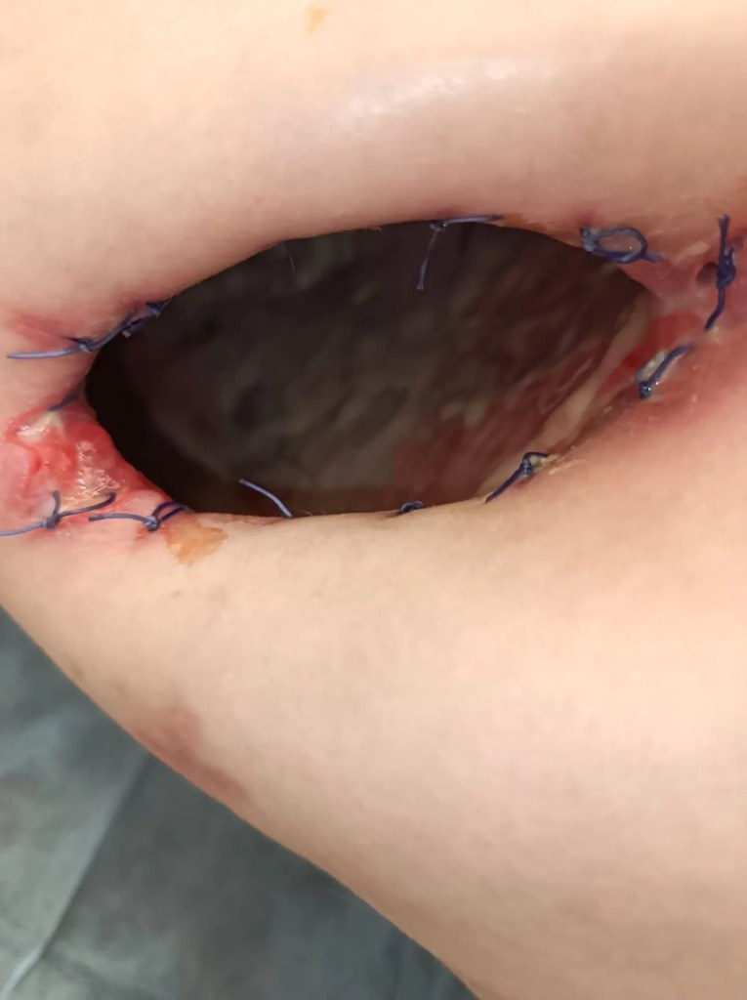
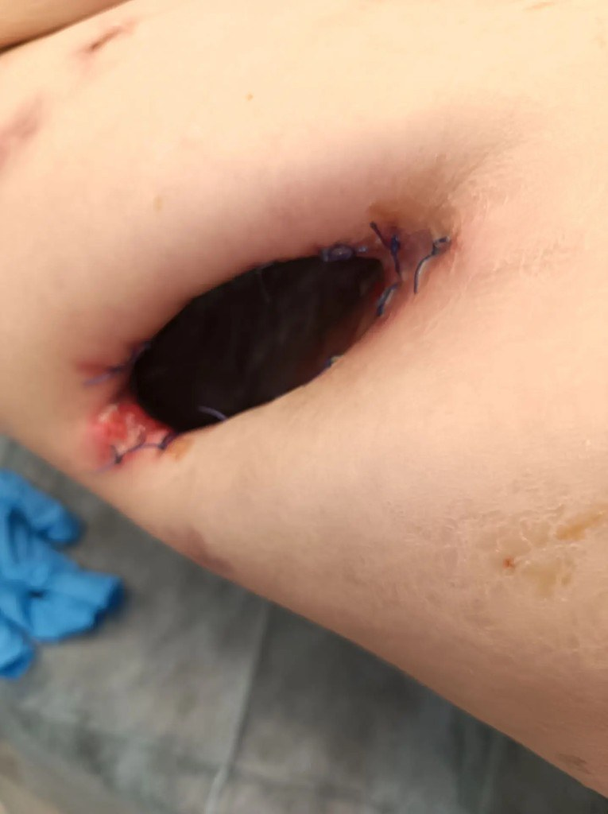

  
Клинический разбор

  
Открытая плевральная полость

  
Хроническая эмпиема плевры с дефектом грудной стенки: почему открытая полость не равна открытому пневмотораксу

  

  
Вызов из поликлиники с поводом «инфицированная рана» к мужчине 41 года с дефектом правой половины грудной клетки, через который визуализируется покрытая гноем висцеральная плевра над спавшимся лёгким, при сатурации 98–99 % и стабильной гемодинамике. Рассмотрены стадии парапневмонической эмпиемы и их ультразвуковые признаки, бронхоплевральный свищ, физиология хронически открытой плевральной полости в сравнении с острым открытым пневмотораксом, варианты происхождения дефекта, факторы риска и прогноза, а также выбор раздела приказа ДЗМ Москвы № 535 для состояния, которое ни одним разделом не описано целиком.

  
Серия «Крещение поворотом» · версия 1.0 · 8 октября 2026 · CC BY-NC-SA 4.0

# Клинический случай

## Слово бригаде

«Вызов от врача поликлиники с поводом „инфицированная рана“. Честно говоря, ожидала увидеть загноившуюся кошачью царапину или язву на ноге. А там… На кушетке лежал мужчина с дыркой в правом боку. Буквально. По ширине туда спокойно входила моя ладонь, по высоте — детский кулак. В дырке шевелилась покрытая гноем плевра над ателектазированным правым лёгким. Рана когда-то была зашита, но разошлась, видимо, давно. При этом человек был не просто жив, но вполне стабилен: сатурация у него ни разу не опустилась ниже 98–99 %, он сам, своими ногами пришёл в поликлинику с жалобами на боль в области раны. Как удалось выяснить, у него была пневмония с плевритом, перешедшим в пиоторакс. Делали дренирование. И вот каким-то образом эта рана от дренирования приняла такой вид. Давайте, коллеги: сколько диагнозов вы бы тут поставили и каких?» — *Ю.Н.*

<figure class="para">
  
  
  <figcaption>Рис. 1. Дефект правой половины грудной клетки на момент осмотра бригадой. Слева — крупный план: веретенообразная рана с остатками узловых швов по краям, края гиперемированы, на дне полости — висцеральная плевра, покрытая фибрином и гнойным отделяемым. Справа — общий вид. Фотографии публикуются в обезличенном виде.</figcaption>
</figure>

## Данные, известные из наблюдения

Мужчина 41 года обратился в поликлинику с жалобами на гнойное отделяемое из послеоперационной раны правой половины грудной клетки и боль в грудной клетке и в области раны. Врачом поликлиники вызвана бригада скорой медицинской помощи.

**Анамнез.** Со слов пациента, около трёх недель назад выполнено оперативное вмешательство, связанное с дренированием правой плевральной полости по поводу хронической парапневмонической эмпиемы; по воспоминанию бригады, пациент упоминал удаление части ребра. Выписной эпикриз в доступной медицинской документации отсутствует. За четыре месяца до вызова перенёс закрытую черепно-мозговую травму: ушиб головного мозга средней степени тяжести, субдуральная гематома левой теменно-височной области с положительной динамикой, линейный перелом теменной и височной костей. Гипертоническая болезнь II стадии с максимальным артериальным давлением 260/120 мм рт. ст., привычное давление 120/80 мм рт. ст. Язвенная болезнь двенадцатиперстной кишки. Постоянно лекарственные препараты не принимает. Аллергологический анамнез не отягощён.

**Объективный статус.** Состояние средней тяжести. Сознание ясное, 15 баллов по шкале комы Глазго. Положение активное. Температура тела 36,6 °C. Частота дыхательных движений 20 в минуту, одышки нет. Дыхание везикулярное слева, справа не проводится во всех отделах; перкуторно слева лёгочный звук, справа тимпанический. Правая половина грудной клетки отстаёт в акте дыхания, голосовое дрожание справа ослаблено. Пульс 100 в минуту, ритмичный; артериальное давление 120/80 мм рт. ст. SpO₂ 99 %. Глюкоза крови 6,2 ммоль/л. Гиперемия лица и склер, запах алкоголя изо рта. Пальценосовую и пяточно-коленную пробы выполняет с промахиванием с обеих сторон, в позе Ромберга неустойчив, походка атактическая; нистагма нет, зрачки равны, менингеальных и очаговых симптомов нет. Рост 183 см, масса тела оценена в 60 кг.

**Местный статус.** В правой половине грудной клетки на уровне седьмого-восьмого межреберья по средней подмышечной линии — открытая послеоперационная рана веретенообразной формы размером 5 × 10 см с остатками хирургических швов по краям. Края гиперемированы, с признаками воспаления. В глубине раны — гнойная полость, дном которой служит плевра над ателектазированным правым лёгким. Активного кровотечения нет. Интенсивность боли — 2 балла по визуальной аналоговой шкале; боль в области раны и грудной клетки с иррадиацией в руку, пациент просил обезболивания.

**Электрокардиограмма.** Синусовая тахикардия с частотой 100 в минуту, вертикальное положение электрической оси.

**Помощь.** Обработка раны, трёхсторонняя клапанная повязка, ингаляция кислорода; кеторолак 30 мг (1 мл) внутривенно в разведении натрия хлоридом 0,9 % до 10 мл. После введения боль купирована; артериальное давление 120/80 мм рт. ст., частота сердечных сокращений 100 в минуту, SpO₂ 98 %. Время на месте вызова — 49 минут, транспортировка — 47 минут; при транспортировке частота сердечных сокращений 98 в минуту, частота дыхательных движений 19 в минуту, SpO₂ 99 %, состояние без ухудшения.

**Диагноз бригады.** T81.3 — расхождение краёв операционной раны. Инфицированная послеоперационная рана грудной клетки. Пиопневмоторакс со свищом. Употребление алкоголя (под вопросом). Пациент доставлен в стационар.

## Медицинская документация

Данные получены ретроспективно из медицинской документации пациента. Сроки указаны в сутках от черепно-мозговой травмы.

| Сутки | Исследование | Находки |
|---|-------|-----------------------|
| 0 | УЗИ брюшной полости при поступлении | Травматических повреждений и свободной жидкости нет. Поджелудочная железа 36 × 38 × 42 мм, контуры неровные, эхогенность снижена, проток не визуализируется, в хвосте кисты до 15 мм; заключение — изменения по типу панкреатита |
| 33 | УЗИ плевральных полостей, сидя | Справа неоднородное гипоэхогенное содержимое с множественными нитями фибрина, нижний край лёгкого не визуализируется, сепарация листков более 15 см, объём оценён более чем в 2100 мл |
| 34 | УЗИ плевральных полостей | Справа около 1100 мл неоднородного крупнодисперсного содержимого с единичными пузырьками газа; заключение — эмпиема плевры |
| 34 | Эхокардиография | КДО левого желудочка 72 мл, КСО 26 мл, ударный объём 46 мл, фракция выброса 64 %; площадь поверхности тела 2,04 м², рост 185 см, масса тела 80 кг. Камеры не расширены, СДЛА 22 мм рт. ст., сепарация листков перикарда за правыми камерами 6–7 мм |
| 37 | УЗИ плевральных полостей | Справа неоднородное содержимое с гиперэхогенными сливающимися включениями, дающими нечёткие акустические тени; сепарация 21 мм, объём оценён в 420 мл |
| 72 | УЗИ плевральных полостей, лёжа | Состояние тяжёлое, кислородная поддержка, астеническое телосложение. Справа неоднородная среднедисперсная жидкость слоем до 120 мм по средней и до 130 мм по задней подмышечной линии, объём оценён в 1100–1200 мл; заключение — вероятен пиоторакс |
| 76 | УЗИ плевральных полостей, лёжа | Дренаж в правой плевральной полости, справа анэхогенное содержимое слоем 7–8 мм |
| 119 | Осмотр терапевта поликлиники | Гнойное отделяемое из послеоперационной раны. Диагноз: J86.0 — пиоторакс со свищом; правосторонняя хроническая парапневмоническая эмпиема плевры, бронхоплевральный свищ, правосторонний пневмоторакс, синдром системной воспалительной реакции инфекционного происхождения с органной дисфункцией в анамнезе; энцефалопатия сложного генеза (посттравматическая, токсическая) |
| 119 | УЗИ плевральных полостей, лёжа и сидя | Справа сепарация листков плевры не более 19–20 мм; заключение — правосторонний выпот в незначительном количестве |
| 120 | Вызов бригады | См. выше |

Разбор случая приведён в конце материала.

# Вопросы для размышления

Ответы — в конце материала.

1. Пациент с дефектом грудной стенки, через который плевральная полость сообщается с атмосферой, сохраняет SpO₂ 98–99 % и не имеет признаков дыхательной недостаточности. Какие анатомические и физиологические условия это обеспечивают и чем хронически открытая плевральная полость отличается от острого открытого пневмоторакса?
2. Какие стадии проходит парапневмонический выпот, какие ультразвуковые признаки соответствуют каждой из них и как с этих позиций читается серия исследований этого пациента?
3. Что такое бронхоплевральный свищ, по каким признакам его можно заподозрить на догоспитальном этапе и как он влияет на выбор повязки и положения при транспортировке?
4. Какими тремя путями может сформироваться открытый дефект грудной стенки над эмпиемой и по каким признакам их различают?
5. Какие факторы объясняют развитие эмпиемы у мужчины 41 года и несостоятельность раны? Какие из них видны в документации, но не названы в диагнозе?
6. Какие разделы приказа ДЗМ Москвы № 535 применимы к этому пациенту и почему ни один не описывает состояние целиком?
7. Какие ограничения имеет выбор кеторолака у этого пациента и какие альтернативы предусмотрены приказом?
8. Сколько диагнозов следует сформулировать и каких?

# Эмпиема плевры

## Определение и стадии

Эмпиема — скопление гноя в плевральной полости. Наиболее частый путь её формирования — прогрессирование парапневмонического выпота, который развивается у значительной части госпитализированных с пневмонией: по обзору Light — до 57 %. Большинство парапневмонических выпотов разрешается на фоне антибактериальной терапии; меньшая часть проходит последовательность стадий, описанную ещё в 1962 году и сохранённую в современных руководствах.

| Стадия | Процесс | Плевральная жидкость | Ультразвуковая картина | Лечебное следствие |
|---|---|---|---|---|
| Экссудативная (неосложнённый выпот) | Повышение проницаемости плевры при воспалении прилежащей ткани лёгкого | Прозрачная, pH > 7,2, низкий цитоз | Анэхогенная жидкость | Антибактериальная терапия; дренирование обычно не требуется |
| Фибринозно-гнойная (осложнённый выпот, эмпиема) | Бактериальная инвазия, активация коагуляции и угнетение фибринолиза, отложение фибрина | Мутная или гной; pH < 7,2, глюкоза < 2,2 ммоль/л, ЛДГ > 1000 МЕ/л | Нити фибрина, перегородки, осумкование | Дренирование, внутриплевральные фибринолитики, при неэффективности — торакоскопия |
| Организации | Миграция фибробластов, замещение фибрина плотной фиброзной коркой | Густой гной, осумкованные полости | Утолщённая плевра, неподвижное лёгкое, гиперэхогенное содержимое | Декортикация; при невозможности — длительное открытое дренирование |

Ключевое событие третьей стадии — формирование фиброзной корки на висцеральной и париетальной плевре. Корка препятствует расправлению лёгкого («замурованное лёгкое», trapped lung), поддерживает остаточную полость с постоянным риском реинфекции и, что существенно для физиологии настоящего наблюдения, фиксирует и лёгкое, и средостение.

## Микробиология и факторы риска

Внебольничная эмпиема чаще полимикробна: стрептококки, в том числе группы *Streptococcus anginosus*, анаэробы и грамотрицательные бактерии; *Staphylococcus aureus* более характерен для послеоперационной, посттравматической и нозокомиальной инфекции. Анаэробы существенно недооцениваются стандартным посевом; при метагеномном исследовании TORPIDS полимикробная инфекция с анаэробами преобладала во внебольничных случаях. Присутствие анаэробов и стрептококков группы *anginosus* ассоциировано с лучшей выживаемостью, преобладание энтеробактерий и стафилококков — с более высокой летальностью.

Факторы риска, названные в руководстве Британского торакального общества (BTS): злоупотребление алкоголем, аспирация, белково-энергетическая недостаточность, сахарный диабет, неудовлетворительная гигиена полости рта, внутривенное употребление наркотиков. Аспирационный механизм объясняет и полимикробный характер, и роль анаэробов.

## Прогноз: шкала RAPID

BTS рекомендует оценивать прогноз по шкале RAPID, построенной на данных исследований MIST1 и MIST2. Шкала учитывает пять параметров: мочевину (Renal), возраст (Age), отсутствие гнойного характера жидкости (Purulence), внутрибольничное происхождение инфекции (Infection source) и уровень альбумина (Dietary factors). Трёхмесячная летальность в группах низкого, среднего и высокого риска составила 2,3 %, 9,2 % и 29,3 % соответственно.

Для догоспитального этапа шкала неприменима: мочевина и альбумин бригаде недоступны. Её значение в другом — в составе прогностических факторов. Один из пяти параметров отражает нутритивный статус, и низкий альбумин входит в прогноз эмпиемы наравне с функцией почек и возрастом.

# Бронхоплевральный свищ

Бронхоплевральный свищ — патологическое сообщение между бронхиальным деревом и плевральной полостью. Основные причины: резекция лёгкого (наиболее частая), некротизирующая пневмония, эмпиема, травма, опухоль. При свищевой форме эмпиемы через свищ происходит двунаправленный обмен: воздух из бронхов поступает в плевральную полость, а инфицированное плевральное содержимое — в бронхи.

| Форма | Типичная картина |
|---|---|
| Острая | Внезапная одышка, напряжённый пневмоторакс, подкожная эмфизема, массивное поступление воздуха по дренажу, внезапное откашливание гнойной мокроты |
| Подострая и хроническая | Картина эмпиемы: лихорадка, слабость, истощение, кашель с гнойной мокротой, ослабление дыхания и притупление на стороне поражения; продолжающееся поступление воздуха по дренажу |

Два признака имеют значение для догоспитальной тактики. Первый — позиционная зависимость: откашливание усиливается в положении на здоровом боку, поскольку плевральное содержимое стекает через свищ в бронхи. Предпочтительное положение при транспортировке — на стороне поражения: оно уменьшает затекание гноя в контралатеральное лёгкое. Аспирация плеврального содержимого в контралатеральное лёгкое с последующей пневмонией и острым респираторным дистресс-синдромом — наиболее частая причина смерти при бронхоплевральном свище; второе место занимает напряжённый пневмоторакс. Второй признак — воздух в плевральной полости без иного объяснения: тимпанит на стороне поражения, газ в содержимом полости при ультразвуковом исследовании.

Летальность при бронхоплевральном свище, по данным разных серий, составляет от 18 до 67 %.

# Физиология открытой плевральной полости

## Острый открытый пневмоторакс

При остром открытом пневмотораксе дефект грудной стенки создаёт второй путь поступления воздуха, параллельный дыхательным путям. Воздух следует по пути наименьшего сопротивления: если диаметр дефекта составляет приблизительно две трети диаметра трахеи или более, при вдохе воздух поступает преимущественно через рану, а не через голосовую щель. Лёгкое на стороне поражения спадается; при свободном средостении отрицательное давление в здоровом гемитораксе на вдохе смещает средостение в здоровую сторону, на выдохе — обратно (флотация средостения), а часть воздуха перемещается из лёгкого в лёгкое, не участвуя в газообмене. Результат — гипоксемия и гиперкапния, нарастающие за минуты.

## Хронически открытая плевральная полость

У пациента с хронической эмпиемой те же анатомические элементы находятся в ином состоянии.

| Параметр | Острый открытый пневмоторакс | Хронически открытая полость при эмпиеме |
|---|---|---|
| Средостение | Подвижно, флотирует | Фиксировано фиброзной коркой и спайками |
| Лёгкое на стороне поражения | Спадается в момент травмы | Спалось ранее, заключено в корку; дыхательные экскурсии ограничены, к ним добавляются передаточные движения от сердца и диафрагмы |
| Плевральная полость | Свободная, сообщается со всем гемитораксом | Ограничена спайками, ригидна |
| Перфузия спавшегося лёгкого | Сохранена — источник внутрилёгочного шунта | Снижена гипоксической вазоконстрикцией, сдавлением коркой и перестройкой сосудов |
| Газообмен | Гипоксемия и гиперкапния | Обеспечивается контралатеральным лёгким; SpO₂ может оставаться нормальной |
| Цель повязки | Прекратить подсос воздуха через рану | Обеспечить отток гноя и воздуха, асептика |

Внутрилёгочный шунт формируется не самим ателектазом, а кровотоком через невентилируемые альвеолы. Гипоксическая лёгочная вазоконстрикция перераспределяет кровоток от гипоксичных участков к вентилируемым уже в острой фазе; при хроническом ателектазе к ней добавляются механическое сдавление сосудов фиброзной коркой и ремоделирование сосудистого русла. Хронически спавшееся лёгкое в значительной мере выключено из кровотока, и шунт через него невелик. Контралатеральное лёгкое при отсутствии собственной патологии обеспечивает газообмен в покое.

Совместимость хронически открытой полости с самостоятельным дыханием в покое следует и из хирургической практики: открытая торакостомия при хронической эмпиеме (раздел «Ведение открытой торакостомы») оставляет полость сообщающейся с атмосферой на месяцы, и пациенты с ней выписываются на амбулаторное лечение. В серии Reyes et al. (*Thoracic and Cardiovascular Surgeon*, 2010; 78 пациентов, 45 % — с раком лёгкого) внутрибольничная летальность составила 6,4 %, выживаемость через 1 и 6 месяцев — 94 и 82 %; летальность в этой серии определялась основным заболеванием, а не дыхательной недостаточностью.

## Чем опасна герметизация

Хронически открытая полость при бронхоплевральном свище представляет собой систему с действующим источником воздуха: при каждом вдохе или кашле воздух через свищ поступает в полость, а единственным путём его выхода служит дефект грудной стенки. Герметичная повязка закрывает этот путь. Фиксированное средостение и ригидная полость смягчают классическую картину напряжённого пневмоторакса, однако давление в полости при этом растёт, воздух распространяется в мягкие ткани с формированием подкожной эмфиземы, а гной задерживается в полости, которую дефект дренировал. Физиология острого открытого пневмоторакса, ради устранения которой накладывается окклюзионная повязка, у этого пациента отсутствует: нормальная сатурация при открытой полости это и демонстрирует.

# Происхождение дефекта грудной стенки

Открытый дефект над эмпиемой может сформироваться тремя путями, и для дальнейшего лечения различие существенно.

| Вариант | Механизм | Отличительные признаки |
|---|---|---|
| Несостоятельность послеоперационной раны | Расхождение раны после дренирования или миниторакотомии на фоне инфекции и нарушенного заживления | Форма раны повторяет разрез; по краям — остатки швов, края воспалены, не эпителизированы |
| Открытая торакостомия (плановая операция) | Резекция одного или нескольких сегментов рёбер и циркулярное подшивание кожи к париетальной плевре — формирование стомы для длительного открытого дренирования | Округлый, овальный или U-образный дефект в нижней, отлогой части полости, вертикальный размер которого превышает ширину межреберья; узловые швы по всей окружности, кожный край подвёрнут в полость; в первые недели швы не сняты и край не эпителизирован; в выписке — название операции |
| Эмпиема, прорвавшаяся через грудную стенку (empyema necessitatis) | Недренированная эмпиема разрушает ткани грудной стенки и вскрывается наружу | Дефект вне зоны разреза; предшествовал подкожный флюктуирующий инфильтрат |

Ширина межреберья у взрослого в боковых отделах грудной клетки составляет порядка 1,5–2,5 см. Дефект, вертикальный размер которого в два-три раза превышает эту величину, не может быть образован разрезом в межреберье без резекции ребра.

Открытую торакостомию описали Eloesser в 1935 году (U-образный кожный лоскут под резецированным ребром, первоначально при туберкулёзной эмпиеме) и Clagett и Geraci в 1963 году (резекция сегмента ребра и подшивание фасции к надкостнице, первоначально при эмпиеме после пневмонэктомии). Современные показания — хроническая эмпиема, не поддающаяся дренированию и декортикации, в том числе с бронхоплевральным свищом, и эмпиема у пациентов, которым обширное вмешательство противопоказано. Полость ведётся перевязками месяцами; закрытие торакостомы выполняется отсроченно мышечным или сальниковым лоскутом либо происходит за счёт облитерации полости.

# Ведение открытой торакостомы

Открытая торакостомия не является окончательным вмешательством. Её назначение — обеспечить постоянный отток гноя из ригидной полости, которую невозможно облитерировать расправлением лёгкого, и тем самым устранить источник сепсиса. Ведение включает три последовательных этапа.

| Этап | Содержание | Длительность и результаты |
|---|---|---|
| Санация полости | Ежедневные или более частые перевязки с тампонированием полости марлей, смоченной изотоническим раствором или антисептиком; при отсутствии значимой утечки воздуха — терапия отрицательным давлением (VAC) | При марлевом тампонировании средняя длительность существования торакостомы в серии Palmen et al. (*Annals of Thoracic Surgery*, 2009) составила 933 ± 1422 суток, при VAC — 39 ± 17 суток с последующим закрытием у всех 11 пациентов |
| Подготовка к закрытию | Очищение стенок полости, развитие грануляций, закрытие бронхоплеврального свища, коррекция питания | Определяется состоянием полости, а не календарным сроком |
| Закрытие | Заполнение полости мышечным лоскутом (широчайшая мышца спины, передняя зубчатая, большая грудная) или сальником; при отсутствии свища — заполнение раствором антибиотика с ушиванием (процедура Clagett); торакопластика; самостоятельная облитерация | В серии Matsumiya et al. (*Journal of Thoracic Disease*, 2025; 42 пациента) торакостома закрыта у 20 (48 %), медиана её существования до закрытия — 242 суток (35–1880); в серии Reyes et al. — хирургическое закрытие у 19 %, самостоятельное — у 2,6 % |

Гнойное отделяемое из торакостомы в фазе санации представляет собой ожидаемое содержимое дренируемой полости, а не осложнение. Осложнениями считаются признаки, указывающие на нарушение оттока или распространение инфекции: лихорадка, нарастание объёма или изменение характера отделяемого, гнилостный запах, кровотечение из полости, перифокальная гиперемия и инфильтрация кожи, сужение стомы до санации полости. Преждевременное сужение или закрытие стомы приводит к рецидиву эмпиемы: в ретроспективной серии из 12 пациентов (*Medical Journal of Malaysia*, 2026) повторная госпитализация по этой причине потребовалась трём (25 %).

Вероятность закрытия торакостомы определяется состоянием пациента. В исследовании Matsumiya et al. значимым предиктором закрытия оказался функциональный статус 0–1 по шкале ECOG (ОШ 7,0; 95 % ДИ 1,7–28,3); тенденцию к связи с закрытием показали отсутствие свища, отсутствие злокачественной опухоли, возраст моложе 70 лет и гемоглобин не ниже 90 г/л. Massera et al. (*Annals of Thoracic Surgery*, 2006) связали успешное закрытие с меньшим объёмом полости и ранним формированием торакостомы. Пациенты, у которых закрытие не выполняется, живут с постоянной торакостомой, которая ведётся перевязками.

# Ультразвуковая оценка плеврального выпота

## Характер содержимого

Классификация Yang и соавт. (1992; 320 пациентов) соотносит эхографический тип выпота с его природой.

| Тип | Описание | Природа |
|---|---|---|
| Анэхогенный | Однородная жидкость без внутренних эхо | Транссудат или экссудат |
| Сложный неперегородчатый | Неоднородная жидкость с эхогенными включениями | Всегда экссудат |
| Сложный перегородчатый | Нити фибрина, перегородки, ячеистость | Всегда экссудат |
| Однородно эхогенный | Равномерно эхогенное содержимое | Экссудат; гемоторакс или эмпиема |

Отдельное значение имеют газовые включения: точечные гиперэхогенные сигналы с реверберацией или нечёткой («грязной») акустической тенью. Газ в содержимом полости появляется при бронхоплевральном свище, при инфекции газообразующими микроорганизмами, а также после пункции и установки дренажа.

## Оценка объёма

Формула Balik и соавт. (2006) для положения лёжа: объём (мл) ≈ 20 × максимальная сепарация листков плевры (мм) на уровне основания лёгкого по задней подмышечной линии в конце выдоха. Формула получена у пациентов на искусственной вентиляции лёгких со свободно смещаемым выпотом; эмпиема, гемоторакс и состояние после операций на лёгком были критериями исключения. Средняя ошибка оценки составила около 160 мл.

Следовательно, при осумкованной эмпиеме ни одна из распространённых формул не применима, а оценка объёма по сепарации листков даёт лишь порядок величины. Числа, полученные разными исследователями в разных положениях пациента, между собой несопоставимы.

# Факторы, объясняющие течение заболевания

**Аспирация после черепно-мозговой травмы.** Угнетение сознания при черепно-мозговой травме нарушает защиту дыхательных путей. В когорте из 396 пациентов с черепно-мозговой травмой аспирационная пневмония развилась у 17,7 %; независимыми предикторами были исходный балл по шкале комы Глазго ниже 8 и установка назогастрального зонда. У пациентов на искусственной вентиляции лёгких частота вентилятор-ассоциированной пневмонии по метаанализу составляет 36 %. Правостороннее поражение согласуется с аспирационным механизмом: правый главный бронх короче, шире и отходит под меньшим углом к оси трахеи.

**Алкоголь.** Злоупотребление алкоголем угнетает кашлевой и глоточный рефлексы, мукоцилиарный клиренс и функцию нейтрофилов и названо BTS среди факторов риска плевральной инфекции. В документации на алкоголь указывают несколько независимых признаков: запах алкоголя при осмотре, гиперемия лица и склер, токсический компонент энцефалопатии в диагнозе поликлиники, изменения поджелудочной железы по типу панкреатита с кистами хвоста при первом ультразвуковом исследовании. Ни один из них сам по себе диагноза не устанавливает; совокупность признаков позволяет рассматривать злоупотребление алкоголем как вероятный фактор риска.

**Белково-энергетическая недостаточность.** На 34-е сутки масса тела составляла 80 кг при росте 185 см (индекс массы тела 23,4 кг/м²); на 120-е сутки масса оценена в 60 кг при росте 183 см (индекс массы тела около 17,9 кг/м²). При всех ограничениях визуальной оценки различие в 20 кг выходит за пределы её погрешности. По критериям GLIM индекс массы тела ниже 18,5 кг/м² у пациента моложе 70 лет и потеря более 10 % массы тела за срок до шести месяцев соответствуют тяжёлой степени недостаточности питания; необходимый этиологический критерий — воспалительная нагрузка, связанная с хронической инфекцией, — у пациента присутствует. В том же ряду — смена «нормостенического» телосложения на «астеническое» в протоколах ультразвуковых исследований. Белково-энергетическая недостаточность нарушает заживление ран, является фактором риска эмпиемы и входит в прогностическую шкалу RAPID через уровень альбумина.

**Гемодинамика в период сепсиса.** По данным эхокардиографии на 34-е сутки ударный объём составлял 46 мл, ударный индекс — около 23 мл/м² (нижняя граница нормы — около 35 мл/м²), конечно-диастолический объём левого желудочка — 72 мл при фракции выброса 64 %. Индекс конечно-диастолического объёма составляет около 35 мл/м², что соответствует нижней границе референсного диапазона для мужчин (34–74 мл/м²; Lang et al., *Journal of the American Society of Echocardiography*, 2015). Сохранённая сократимость при низком ударном индексе и конечно-диастолическом объёме на нижней границе нормы соответствует сниженной преднагрузке на фоне сепсиса, а не сердечной недостаточности. Сепарация листков перикарда за правыми камерами 6–7 мм указывает на небольшой выпот в полости перикарда, что при правосторонней эмпиеме требует учитывать возможность вовлечения перикарда.

**Хронология эмпиемы.** Серия исследований последовательно воспроизводит стадии процесса. На 33-и сутки — большой выпот с нитями фибрина: фибринозно-гнойная стадия. На 34-е — крупнодисперсное содержимое с пузырьками газа: первый признак, совместимый с бронхоплевральным свищом, хотя после пункции или дренирования газ может иметь и ятрогенное происхождение. На 37-е — сливающиеся гиперэхогенные включения с нечёткими акустическими тенями: картина, характерная для газовых микропузырьков или организующегося содержимого. На 72-е сутки — рецидив большого объёма в тяжёлом состоянии, на 76-е — остаточный слой 7–8 мм на дренаже, на 119-е — 19–20 мм. Оценки объёма в серии получены разными способами: 420 мл при сепарации 21 мм соответствуют формуле Balik, тогда как 1100–1200 мл при сепарации 120–130 мм вдвое меньше результата той же формулы. Это иллюстрирует сказанное выше о несопоставимости оценок, полученных разными исследователями.

**Интерпретация последнего исследования.** При открытой плевральной полости ультразвуковой луч не проходит через воздух, заполняющий её часть, а содержимое отлогих отделов представляет собой не свободный выпот, а гной на дне остаточной полости. Заключение «выпот в незначительном количестве» в этих условиях описывает доступный для визуализации участок, а не объём полости.

# Догоспитальная тактика

## Разделы приказа № 535

Состояние «хроническая эмпиема плевры с открытым дефектом грудной стенки» в приказе отдельно не описано. Его элементы распределены по нескольким разделам, каждый из которых рассчитан на иную клиническую ситуацию.

| Раздел приказа | Объём помощи | Применимость к наблюдению |
|---|---|---|
| S27.0 — травматический пневмоторакс (внутр. стр. 78) | Пульсоксиметрия, ингаляция кислорода, трамадол 100 мг (2 мл) внутривенно; при открытом — окклюзионная повязка; при напряжённом — пункция во втором межреберье по среднеключичной линии; эвакуация на носилках | Рассчитан на острый открытый пневмоторакс с подсосом воздуха через рану, которого у пациента нет |
| J93 — спонтанный пневмоторакс (внутр. стр. 90) | Ингаляция кислорода, ЭКГ; при боли — кеторолак 30 мг (1 мл), или кетопрофен 100 мг (2 мл), или метамизол натрия 1000 мг (2 мл) внутривенно; при недостаточном эффекте — трамадол 100 мг (2 мл) или морфин 10 мг (1 мл) внутривенно; при напряжённом — пункция | Пневмоторакс у пациента есть, но он не спонтанный и сообщается с атмосферой через рану |
| L02–L04 — инфекции кожи и подкожной клетчатки, в том числе нагноение послеоперационной раны (внутр. стр. 92) | Холод на область воспаления, асептическая повязка | Описывает поверхностный гнойный процесс; холод на открытую плевральную полость неприменим |
| T79, T85, T87 — осложнения травм и медицинских манипуляций, инфицированная рана, в том числе послеоперационная (внутр. стр. 93) | Обработка ран хлоргексидином 0,05 %, асептическая повязка; эвакуация при гнойном отделяемом, перифокальной флегмоне, температуре ≥ 38 °C | Наиболее близок по существу: инфицированная послеоперационная рана с гнойным отделяемым; не учитывает сообщение раны с плевральной полостью |

Хроническая эмпиема плевры со свищом (J86.0) в приказе не представлена, и критерия медицинской эвакуации для неё приказ не содержит. Разделы S27.0 и J93 предусматривают эвакуацию безусловно, однако описывают травматический и спонтанный пневмоторакс и к состоянию пациента по существу не относятся. Основание для эвакуации даёт раздел T79/T85/T87: инфицированная, в том числе послеоперационная, рана с гнойным отделяемым.

Объём помощи в подобной ситуации складывается из положений нескольких разделов, и каждое положение требует проверки на соответствие физиологии конкретного пациента. Из раздела об инфицированной ране применимы обработка хлоргексидином и асептическая повязка. Из раздела о пневмотораксе — контроль признаков напряжения при транспортировке. Ингаляция кислорода в разделах S27.0 и J93 предписана без порогового значения SpO₂, тогда как в ряде других разделов приказа она назначается при SpO₂ ≤ 93 % или < 90 %. Помимо коррекции гипоксемии, при закрытом пневмотораксе кислород ускоряет рассасывание воздуха из плевральной полости за счёт снижения парциального давления азота в крови. Полость, сообщающаяся с атмосферой, этого эффекта не имеет, а гипоксемия при SpO₂ 98–99 % отсутствует.

## Повязка

Термин «окклюзионная» (лат. *occludo* — закрываю) обозначает повязку, герметизирующую рану. В отечественной военно-полевой хирургии окклюзионная повязка при открытом пневмотораксе накладывается с использованием воздухонепроницаемого материала — прорезиненной оболочки индивидуального перевязочного пакета, — фиксированного по всему периметру; её задача — перевести открытый пневмоторакс в закрытый (Указания по военно-полевой хирургии, 2013). Клапанная трёхсторонняя повязка представляет собой разновидность окклюзионной: воздухонепроницаемый материал фиксируется с трёх сторон, а свободный четвёртый край пропускает воздух из полости на выдохе и прижимается к коже на вдохе.

Цель повязки на хронически открытой плевральной полости — асептика и впитывание отделяемого при сохранении оттока гноя и воздуха. В хирургической практике торакостома ведётся влажным марлевым тампонированием с впитывающей повязкой поверх (раздел «Ведение открытой торакостомы»), и ни герметизация, ни клапанный механизм для неё не предусмотрены. На догоспитальном этапе этой цели соответствует асептическая повязка; клапанная трёхсторонняя повязка также сохраняет отток и потому совместима с физиологией пациента. Герметичная повязка, закрывающая дефект по всему периметру, при бронхоплевральном свище создаёт условия для нарастания давления в полости по причинам, изложенным выше.

**Расхождение с международной практикой.** В приказе № 535 при открытом пневмотораксе предусмотрена окклюзионная повязка без уточнения её вида; в отечественной практике этим термином обозначают как герметичную, так и клапанную трёхстороннюю повязку. Международные руководства по острому открытому пневмотораксу с 2013 года рекомендуют вентилируемые окклюзионные наклейки (vented chest seal) — Tactical Combat Casualty Care, International Trauma Life Support, консенсус Faculty of Pre-Hospital Care Королевского колледжа хирургов Эдинбурга. Импровизированная трёхсторонняя повязка в этих документах больше не рекомендуется: надёжного предотвращения напряжённого пневмоторакса она не продемонстрировала. В экспериментальной модели открытого пневмоторакса с продолжающимся поступлением воздуха из лёгкого вентилируемая наклейка предотвращала развитие напряжённого пневмоторакса, невентилируемая — нет. При появлении признаков напряжения повязка приподнимается или снимается.

## Положение при транспортировке

При бронхоплевральном свище положение с наклоном в сторону поражения уменьшает затекание плеврального содержимого через свищ в бронхи и защищает здоровое лёгкое; положение на здоровом боку по той же причине не применяется. Дефект у пациента расположен по средней подмышечной линии, и положение лёжа на поражённом боку прижимает рану к носилкам, перекрывая отток, который должна сохранять повязка. Обоим условиям отвечает положение полусидя с наклоном в поражённую сторону без давления на область раны.

## Анальгезия

Кеторолак угнетает функцию тромбоцитов и обладает выраженной гастроинтестинальной токсичностью. В инструкции FDA к нему противопоказаниями названы язвенная болезнь в анамнезе (а не только в активной фазе), предшествующее желудочно-кишечное кровотечение, подозреваемое или подтверждённое цереброваскулярное кровотечение и высокий риск кровотечения; для пациентов с массой тела менее 50 кг установлены сниженные максимальные дозы. Формулировки отечественных инструкций различаются у разных производителей; приказ № 535 противопоказаний не перечисляет.

У настоящего пациента присутствуют три обстоятельства из этого перечня или близкие к ним: язвенная болезнь двенадцатиперстной кишки в анамнезе, остаточная субдуральная гематома четырёхмесячной давности и вероятное злоупотребление алкоголем, повышающее риск желудочно-кишечного кровотечения. Однократная доза абсолютного запрета в этих условиях не создаёт, но изменяет соотношение пользы и риска. Из препаратов, перечисленных в разделе J93, метамизол натрия не обладает антиагрегантным действием, сопоставимым с кеторолаком, и меньше влияет на слизистую желудка; собственные ограничения метамизола — риск агранулоцитоза и артериальной гипотензии при быстром введении.

Отдельного внимания заслуживает характер боли: боль в грудной клетке с иррадиацией в руку у пациента с гипертонической болезнью требует исключения острого коронарного синдрома независимо от наличия очевидного источника боли. Регистрация электрокардиограммы этот вопрос на догоспитальном этапе закрывает в доступном объёме.

# Возвращение к клиническому случаю

**Сохранность газообмена при открытой полости.** Дефект грудной стенки размером 5 × 10 см, через который видна висцеральная плевра, при сатурации 98–99 % и частоте дыхания 20 в минуту представляется несовместимым с представлением об открытом пневмотораксе. Противоречие снимается тем, что у пациента нет острого открытого пневмоторакса. Средостение фиксировано фиброзной коркой третьей стадии эмпиемы, лёгкое спалось за недели до вызова и в значительной мере выключено из кровотока, полость отграничена спайками. Газообмен обеспечивает левое лёгкое. То, что бригада описала как «плевру над ателектазированным лёгким», с анатомической точки зрения является висцеральной плеврой, утолщённой фиброзной коркой. Движение поверхности, отмеченное бригадой, соответствует ограниченным дыхательным экскурсиям замурованного лёгкого и передаточной пульсации сердца; оно не означает свободного расправления и спадения лёгкого, характерного для острого открытого пневмоторакса.

**Физикальные признаки замурованного лёгкого.** Отставание правой половины грудной клетки, ослабление голосового дрожания, отсутствие дыхания и тимпанит справа согласуются с лёгким, заключённым в фиброзную корку и не участвующим в дыхании. Дефект расположен в седьмом–восьмом межреберье по средней подмышечной линии.

**Повязка.** Бригадой наложена клапанная трёхсторонняя повязка — вариант окклюзионной повязки раздела S27.0, сохраняющий отток через свободный край. При свищевой эмпиеме это свойство существенно: герметичная повязка закрыла бы единственный путь выхода воздуха, поступающего через свищ. По действию клапанная повязка в этих условиях близка к асептической повязке раздела T79/T85/T87, которая соответствует состоянию пациента наиболее точно и совпадает с принципом хирургического ведения торакостомы.

**Анальгезия.** Кеторолак введён в дозе, предусмотренной разделом J93, по просьбе пациента, при боли 2 балла с иррадиацией в руку. Язвенная болезнь в анамнезе, остаточная субдуральная гематома и вероятное употребление алкоголя относятся к обстоятельствам, которые инструкция FDA рассматривает как противопоказания или факторы высокого риска. Метамизол натрия, предусмотренный тем же разделом, этими ограничениями в той же мере не обладает.

**Происхождение дефекта.** Прорыв эмпиемы через грудную стенку исключается расположением дефекта в зоне вмешательства. Совокупность признаков указывает на плановую открытую торакостомию. Вертикальный размер дефекта (5 см) в два-три раза превышает ширину межреберья, что без резекции ребра невозможно, и пациент упоминал удаление части ребра. Узловые швы расположены по всей окружности у самого края, целы и не прорезались; кожный край подвёрнут в полость; нитей, перекинутых через просвет, нет. Неэпителизированные края и неснятые швы соответствуют сроку около трёх недель после операции. Показание — хроническая эмпиема с бронхоплевральным свищом — является классическим для этого вмешательства. Впечатление бригады о разошедшейся ране объяснимо: дефект подобного вида вне хирургического контекста встречается редко. Выписной эпикриз в документации отсутствует, поэтому вывод остаётся вероятностным.

**Ведущий диагноз и основание для эвакуации.** Инфицированная послеоперационная рана указана врачом поликлиники как повод к вызову и подтверждается осмотром: гнойное отделяемое, гиперемия и воспалительные изменения краёв (рис. 1). Именно этот диагноз соответствует разделу T79/T85/T87 и его критерию эвакуации «гнойное отделяемое»; пиоторакс со свищом в приказе не представлен и самостоятельного основания для эвакуации не даёт. Выбор инфицированной раны в качестве ведущего диагноза карты вызова поэтому определяется структурой приказа, а эмпиема со свищом отражается в той же карте как основное заболевание, на фоне которого развилось осложнение. Шифр T81.3 (расхождение краёв операционной раны) при торакостомии описывает механизм, которого нет: дефект сформирован намеренно, и инфекцию области вмешательства точнее отражает T81.4 (инфекция, связанная с процедурой). Формулировка, верная при любом происхождении дефекта, — «инфицированный открытый дефект грудной стенки в зоне вмешательства на правой плевральной полости».

**Тактика, следующая из происхождения дефекта.** Если дефект является торакостомой, его существование входит в план лечения, и само по себе наличие открытой полости показанием к госпитализации не служит. Показание создаёт инфекция области вмешательства: перифокальная гиперемия и воспалительные изменения краёв относятся к признакам распространения инфекции за пределы дренируемой полости (раздел «Ведение открытой торакостомы»). Факторы, связанные в исследованиях с низкой вероятностью закрытия торакостомы, — бронхоплевральный свищ и сниженный функциональный статус, — у пациента присутствуют, к ним добавляются тяжёлая недостаточность питания и вероятное злоупотребление алкоголем.

**Неназванные диагнозы.** Изменение массы тела с 80 до 60 кг за двенадцать недель, смена типа телосложения в протоколах, изменения поджелудочной железы и признаки употребления алкоголя в документации присутствуют, но в диагнозах не сформулированы. Эти состояния нарушают заживление и ассоциированы с неблагоприятным течением плевральной инфекции; недостаточность питания входит в шкалу RAPID через уровень альбумина. Атаксия с двусторонним промахиванием при координаторных пробах допускает несколько объяснений — алкогольное опьянение, последствия черепно-мозговой травмы, алкогольное поражение мозжечка; сочетание злоупотребления алкоголем с выраженной потерей массы тела относится к ситуациям риска дефицита тиамина. Отсутствие нистагма и нарушений сознания этот дефицит не исключает: полная триада энцефалопатии Вернике прижизненно выявлялась лишь у 16 % пациентов с подтверждённым на аутопсии диагнозом (Harper et al., *Journal of Neurology, Neurosurgery and Psychiatry*, 1986).

**Исход.** Пациент доставлен в стационар. На момент подготовки материала сведения о дальнейшем лечении и о происхождении дефекта отсутствуют.

# Ответы на вопросы для размышления

**1.** Средостение фиксировано фиброзной коркой стадии организации, лёгкое спалось ранее и не изменяет объёма при дыхании, полость отграничена спайками, а перфузия спавшегося лёгкого снижена гипоксической вазоконстрикцией, сдавлением коркой и сосудистой перестройкой, поэтому внутрилёгочный шунт мал и газообмен обеспечивается контралатеральным лёгким. При остром открытом пневмотораксе средостение подвижно, воздух при дефекте около двух третей диаметра трахеи и более поступает преимущественно через рану, развиваются флотация средостения, гипоксемия и гиперкапния. Цель помощи различается: при остром — прекратить подсос воздуха, при хроническом — обеспечить отток и асептику.

**2.** Экссудативная стадия — анэхогенная жидкость; фибринозно-гнойная — нити фибрина, перегородки, осумкование, pH < 7,2, глюкоза < 2,2 ммоль/л, ЛДГ > 1000 МЕ/л; стадия организации — утолщённая плевра, неподвижное лёгкое, гиперэхогенное содержимое, фиброзная корка. В серии: на 33-и сутки — фибринозно-гнойная стадия; на 34-е — газ в содержимом, совместимый со свищом; на 37-е — гиперэхогенные включения с нечёткими тенями; на 72-е — рецидив; на 76-е — остаточный слой на дренаже; на 119-е — нарастание слоя на дне открытой полости.

**3.** Бронхоплевральный свищ — сообщение бронхиального дерева с плевральной полостью. На догоспитальном этапе его заставляют заподозрить воздух в плевральной полости без иного объяснения (тимпанит), гнойная мокрота с усилением откашливания в положении на здоровом боку, указание на свищ или на продолжающееся поступление воздуха по дренажу в анамнезе. Свищ является источником воздуха, поэтому герметизация дефекта создаёт условия для нарастания давления в полости и подкожной эмфиземы. Транспортировка — полусидя с наклоном в сторону поражения для защиты здорового лёгкого от аспирации гноя, без давления на рану, расположенную по средней подмышечной линии.

**4.** Несостоятельность послеоперационной раны — форма повторяет разрез, остатки швов, воспалённые неэпителизированные края. Плановая открытая торакостомия по Eloesser или Clagett — резекция ребра и циркулярное подшивание кожи к плевре: дефект в отлогой части полости с вертикальным размером больше ширины межреберья, узловые швы по всей окружности, подвёрнутый в полость кожный край, эпителизация края в отдалённые сроки, название операции в выписке. У пациента совокупность признаков указывает на торакостомию. Прорыв эмпиемы через грудную стенку — дефект вне зоны разреза, которому предшествовал подкожный инфильтрат.

**5.** Аспирация на фоне угнетения сознания после черепно-мозговой травмы, вероятное злоупотребление алкоголем и тяжёлая белково-энергетическая недостаточность. Последние два видны в документации — запах алкоголя, гиперемия лица и склер, токсический компонент энцефалопатии, изменения поджелудочной железы, потеря около 20 кг массы тела, смена типа телосложения в протоколах, — но в диагнозах не названы.

**6.** S27.0 (внутр. стр. 78) — окклюзионная повязка при открытом пневмотораксе; J93 (внутр. стр. 90) — кислород и анальгезия при спонтанном пневмотораксе; L02–L04 (внутр. стр. 92) — нагноение послеоперационной раны; T79/T85/T87 (внутр. стр. 93) — инфицированная, в том числе послеоперационная, рана: хлоргексидин 0,05 %, асептическая повязка, эвакуация при гнойном отделяемом. Первые два рассчитаны на острый пневмоторакс, третий — на поверхностный процесс, четвёртый ближе всего по существу, но не учитывает сообщение раны с плевральной полостью. Пиоторакс со свищом (J86.0) в приказе не представлен, поэтому основание для эвакуации даёт только раздел T79/T85/T87 — инфицированная рана с гнойным отделяемым. Объём помощи складывается из положений нескольких разделов с проверкой каждого на соответствие физиологии пациента.

**7.** По инструкции FDA кеторолак противопоказан при язвенной болезни в анамнезе, предшествующем желудочно-кишечном кровотечении, подозреваемом или подтверждённом цереброваскулярном кровотечении и высоком риске кровотечения. У пациента — язвенная болезнь двенадцатиперстной кишки, остаточная субдуральная гематома и вероятное злоупотребление алкоголем. В разделе J93 альтернативой служит метамизол натрия 1000 мг (2 мл) внутривенно; при недостаточном эффекте — трамадол 100 мг (2 мл) внутривенно.

**8.** Основное заболевание: хроническая правосторонняя парапневмоническая эмпиема плевры с бронхоплевральным свищом (J86.0). Состояние после открытой торакостомии справа с резекцией ребра (вероятно; выписной эпикриз недоступен). Осложнения: инфекция области вмешательства с гнойным отделяемым и перифокальным воспалением; остаточный правосторонний пневмоторакс с замурованным лёгким; белково-энергетическая недостаточность тяжёлой степени (по оценочной массе тела). Сопутствующие: последствия закрытой черепно-мозговой травмы — ушиб головного мозга средней степени тяжести, остаточная субдуральная гематома, линейный перелом теменной и височной костей; энцефалопатия сложного генеза; гипертоническая болезнь II стадии; язвенная болезнь двенадцатиперстной кишки; изменения поджелудочной железы по типу панкреатита по данным ультразвукового исследования; употребление алкоголя — под вопросом. Итого — восемь-девять диагностических позиций в зависимости от того, выделяются ли последствия травмы и энцефалопатия раздельно. Приведённая структура соответствует клиническому диагнозу; в карте вызова ведущей позицией, определяющей тактику по приказу № 535, служит инфицированная послеоперационная рана.

# Источники

- Light R.W. Parapneumonic effusions and empyema. *Proceedings of the American Thoracic Society*, 2006; 3(1): 75–80 — частота парапневмонического выпота, стадии, биохимические критерии осложнённого выпота.
- Roberts M.E., Rahman N.M., Maskell N.A. et al. British Thoracic Society Guideline for pleural disease. *Thorax*, 2023; 78(Suppl 3): s1–s42 — факторы риска и ведение плевральной инфекции, шкала RAPID.
- Rahman N.M., Kahan B.C., Miller R.F. et al. A clinical score (RAPID) to identify those at risk for poor outcome at presentation in patients with pleural infection. *Chest*, 2014; 145(4): 848–855 — трёхмесячная летальность 2,3 %, 9,2 % и 29,3 % по группам риска.
- Diagnosis and management of pleural infection. *Breathe* (European Respiratory Society), 2023; 19(4): 230146 — микробиология, исследование TORPIDS, связь возбудителя с выживаемостью.
- Yang P.C., Luh K.T., Chang D.B. et al. Value of sonography in determining the nature of pleural effusion: analysis of 320 cases. *American Journal of Roentgenology*, 1992; 159(1): 29–33 — эхографические типы выпота и их природа.
- Balik M., Plasil P., Waldauf P. et al. Ultrasound estimation of volume of pleural fluid in mechanically ventilated patients. *Intensive Care Medicine*, 2006; 32(2): 318–321 — формула V ≈ 20 × сепарация, критерии исключения, ошибка около 160 мл.
- Bronchopleural Fistula. *StatPearls*. NCBI Bookshelf, NBK534765 — формы, клиника, летальность 18–67 %, причины смерти.
- Sylvester J.T., Shimoda L.A., Aaronson P.I., Ward J.P.T. Hypoxic pulmonary vasoconstriction. *Physiological Reviews*, 2012; 92(1): 367–520 — механизм перераспределения кровотока от гипоксичных участков лёгкого.
- American College of Surgeons. *Advanced Trauma Life Support. Student Course Manual*, 10th ed., 2018 — открытый пневмоторакс, соотношение диаметра дефекта и трахеи.
- Butler F.K., Dubose J.J., Otten E.J. et al. Management of open pneumothorax in Tactical Combat Casualty Care: TCCC Guidelines Change 13-02. *Journal of Special Operations Medicine*, 2013; 13(3): 81–86 — вентилируемые наклейки, отказ от трёхсторонней повязки, экспериментальная модель с продолжающимся поступлением воздуха.
- International Trauma Life Support. Position statement: chest seals for open pneumothorax, 2017.
- Faculty of Pre-Hospital Care, Royal College of Surgeons of Edinburgh. The pre-hospital management of life-threatening chest injuries: a consensus statement — трёхсторонняя повязка признана неэффективной, предпочтительна вентилируемая наклейка.
- Eloesser L. An operation for tuberculous empyema. *Surgery, Gynecology & Obstetrics*, 1935; 60: 1096–1097.
- Clagett O.T., Geraci J.E. A procedure for the management of postpneumonectomy empyema. *Journal of Thoracic and Cardiovascular Surgery*, 1963; 45(2): 141–145.
- Reyes K.G., Mason D.P., Murthy S.C., Su J.W., Rice T.W. Open window thoracostomy: modern update of an ancient operation. *Thoracic and Cardiovascular Surgeon*, 2010; 58(4): 220–224 — 78 пациентов, внутрибольничная летальность 6,4 %, выживаемость 94 %, 82 %, 74 % и 60 % через 1 и 6 месяцев, 1 и 5 лет; хирургическое закрытие у 19 %, самостоятельное у 2,6 %.
- Palmen M., van Breugel H.N., Geskes G.G. et al. Open window thoracostomy treatment of empyema is accelerated by vacuum-assisted closure. *Annals of Thoracic Surgery*, 2009; 88(4): 1131–1136 — 19 пациентов; длительность торакостомы 933 ± 1422 суток при марлевом тампонировании и 39 ± 17 суток при VAC.
- Matsumiya H., Mori M., Yoshimatsu K. et al. Predictors of successful closure following open-window thoracostomy in patients with empyema: a single-center retrospective cohort study. *Journal of Thoracic Disease*, 2025; 17(5): 3138–3146 — 42 пациента, закрытие у 48 %, медиана 242 суток, функциональный статус как предиктор.
- Massera F., Robustellini M., Della Pona C. et al. Predictors of successful closure of open window thoracostomy for postpneumonectomy empyema. *Annals of Thoracic Surgery*, 2006; 82(1): 288–292.
- Open-window thoracostomy in empyema thoracis: a retrospective review. *Medical Journal of Malaysia*, 2026; 81(1) — 12 пациентов, повторная госпитализация из-за преждевременного закрытия стомы у 25 %.
- Указания по военно-полевой хирургии. Министерство обороны Российской Федерации, 2013 — окклюзионная повязка при открытом пневмотораксе.
- Lang R.M., Badano L.P., Mor-Avi V. et al. Recommendations for cardiac chamber quantification by echocardiography in adults. *Journal of the American Society of Echocardiography*, 2015; 28(1): 1–39 — референсные значения индекса конечно-диастолического объёма левого желудочка.
- Harper C.G., Giles M., Finlay-Jones R. Clinical signs in the Wernicke-Korsakoff complex: a retrospective analysis of 131 cases diagnosed at necropsy. *Journal of Neurology, Neurosurgery and Psychiatry*, 1986; 49(4): 341–345.
- Shiferaw S.M. et al. Incidence and predictors of aspiration pneumonia among traumatic brain injury patients. *Open Access Emergency Medicine*, 2022; 14: 85–98 — 396 пациентов, аспирационная пневмония у 17,7 %, предикторы: шкала комы Глазго ниже 8, назогастральный зонд.
- Li Y., Liu C., Xiao W., Song T., Wang S. Incidence, risk factors, and outcomes of ventilator-associated pneumonia in traumatic brain injury: a meta-analysis. *Neurocritical Care*, 2020; 32 — частота 36 % (95 % ДИ 31–41 %).
- Cederholm T., Jensen G.L., Correia M.I.T.D. et al. GLIM criteria for the diagnosis of malnutrition — a consensus report from the global clinical nutrition community. *Clinical Nutrition*, 2019; 38(1): 1–9 — фенотипические критерии и степени недостаточности питания.
- Ketorolac tromethamine (Toradol). Prescribing information. U.S. Food and Drug Administration, 2013 — противопоказания: язвенная болезнь в анамнезе, желудочно-кишечное кровотечение, цереброваскулярное кровотечение, высокий риск кровотечения.
- Приказ Департамента здравоохранения города Москвы № 535 от 18.05.2023 «Об утверждении Алгоритмов оказания скорой и неотложной медицинской помощи» — S27.0 (внутр. стр. 78), J93 (внутр. стр. 90), L02–L04 (внутр. стр. 92), T79/T85/T87 (внутр. стр. 93).

# Источники иллюстраций

| Файл | Что изображено | Источник |
|---|---|---|
| `defekt_krupno.jpg` | Дефект грудной стенки, крупный план | Фотография бригады; публикуется в обезличенном виде, метаданные удалены |
| `defekt_obshchiy_vid.jpg` | Дефект грудной стенки, общий вид | Фотография бригады; публикуется в обезличенном виде, метаданные удалены |

# Выходные данные

**Материал:** «Открытая плевральная полость». Версия 1.0 от 8 октября 2026.

**Серия:** «Крещение поворотом» — клинические разборы догоспитальной практики.

**Лицензия:** текст — Creative Commons «С указанием авторства — Некоммерческая — С сохранением условий» 4.0 (CC BY-NC-SA 4.0).

**Оговорка.** Материал носит учебный характер, не является нормативным документом, не заменяет действующие протоколы и клинические рекомендации и не может использоваться как единственное основание для клинического решения. Дозы, показания и маршрутизацию необходимо проверять по действующим первоисточникам. Ответственность за клинические решения несёт медицинский работник, а не автор материала.

**О клинических случаях.** Случаи обезличены: нет имён, дат вызовов, адресов, номеров карт вызова, названий стационаров; сроки указаны относительно черепно-мозговой травмы. Совпадения с чужой практикой возможны и неизбежны.

**Нашли ошибку?** Сообщить можно через раздел Issues репозитория проекта; исправление выходит новой версией, а изменение фиксируется в журнале изменений.
