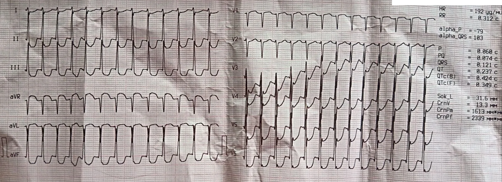
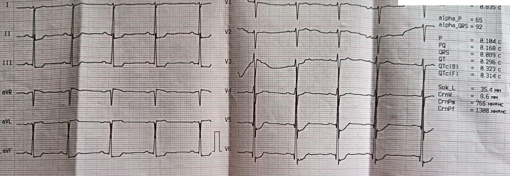
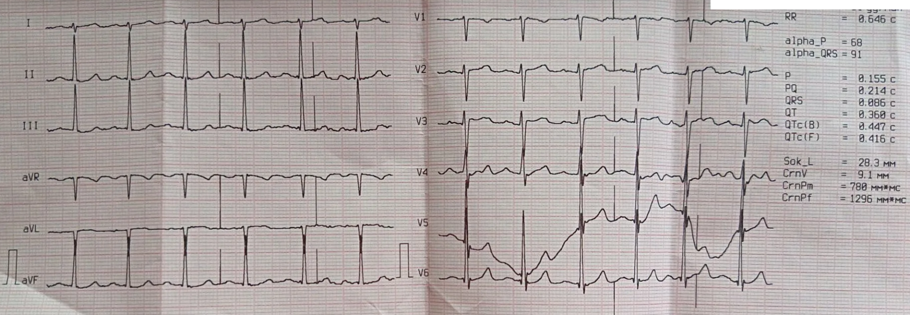
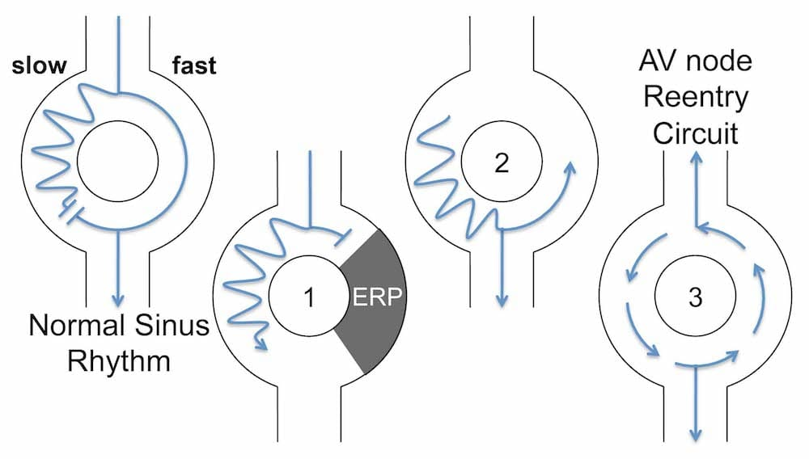
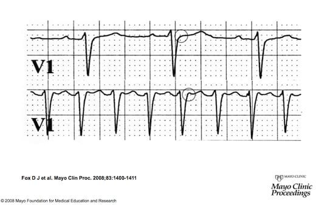

  
Клинический разбор

  
Пароксизмальная наджелудочковая тахикардия

  
Две минуты, которых могло не быть: ри-ентри в АВ-узле, вагусная конверсия рвотой и ложная ишемия после приступа

  

  
Двойные пути проведения АВ-узла, механизм ри-ентри, типичная АВУРТ slow-fast, постконверсионная Т-память.

  
Один вызов: молодая женщина с алкогольной интоксикацией, пароксизм НЖТ 192 в минуту длительностью менее двух минут, зафиксированный случайно.

  
Серия «Крещение поворотом» · версия 1.0 · 30 августа 2026 · CC BY-NC-SA 4.0

## Слово бригаде

"Вызов был к девушке, выпила на вечеринке с подругами, тошнило, рвало. Померяли давление — 90 на 55, сатурация 98, пульс на пульсоксиметре 95. Сахар 7,2. На слух ничего особенного, то есть, сильной тахикардии я в тот момент не слышала. Ставлю ЭКГ — а там 200 и НЖТ.

Мы поймали это случайно: подключили монитор, а там пробежка. Девушке повезло, что мы эту пробежку вообще зафиксировали.

Пока мы думали, что это такое, начали ставить катетер — и тут девушку снова вырвало. И на наших глазах ритм восстановился сам. Пульс 60. На второй плёнке — признаки ишемии по нижней стенке. Прокапали банку физы, под монитором. Метоклопрамид сделали ей. Сняли третью плёнку — ST на изолинии, всё чисто.

Добиться чего-то вразумительного от неё было сложно. Она была в сознании, но разговаривала очень плохо, стонала, её постоянно рвало. Из анамнеза удалось выяснить, что у неё бывает боль в груди, отмечает с 14 лет, когда понервничает и при нагрузке. К врачам не обращалась. В бассейн ходит, на воде у неё проблем не было. Семейный анамнез не отягощён.

Рекомендовали ей обратиться к кардиологу. Сказали прямым текстом: холтер, нагрузочные пробы. Но она пьяная была — не знаю, что из этого она на самом деле сделает."

# Вопросы для размышления

Ответы — в конце материала.

1. Что говорит регулярная узкокомплексная тахикардия с частотой 192 в минуту о месте происхождения аритмии?
2. Почему это не синусовая тахикардия? Какова ожидаемая максимальная частота синусового узла у молодой женщины?
3. Чем АВУРТ отличается от АВРТ? Какая структура служит петлёй ри-ентри в каждом случае?
4. Почему при типичной АВУРТ зубцы P не видны и что такое псевдо-R′?
5. Каким образом рвота может купировать тахикардию?
6. После конверсии из НЖТ на ЭКГ появились инверсии зубца T в нижних отведениях. Это ишемия?
7. Что такое Т-память (cardiac memory)? Как долго она сохраняется и от чего зависит длительность?
8. Какое исследование необходимо для окончательной верификации механизма НЖТ и каков радикальный метод лечения?

# На мониторе

## Первая плёнка: 192 в минуту

<figure class="ekg">
  
  <figcaption>Рис. 1. Регулярная тахикардия с частотой 192 в минуту. Комплексы QRS 121 мс — пограничная ширина, вероятна частотнозависимая аберрация проведения. Интервалы R–R одинаковы. Зубцы P не идентифицируются на первый взгляд, однако в aVF видны воспроизводимые зазубрины (псевдо-S), а в aVL — положительные зазубрины в терминальной части QRS: ретроградные P.</figcaption>
</figure>

Бригада подключила ЭКГ не потому, что подозревала аритмию: пульс на пульсоксиметре составлял 95 в минуту, и поводом был «рвота после алкоголя». Монитор застал пробежку, которая могла начаться секундой раньше подключения электродов или минутой позже отключения.

Что мы видим:

- **Регулярная тахикардия.** Интервалы R–R одинаковы. Это сразу исключает фибрилляцию предсердий и трепетание предсердий с переменным проведением.
- **Частота 192 в минуту.** Синусовый узел молодой женщины способен генерировать до 200–210 импульсов в минуту (ориентировочная формула: 220 минус возраст). Однако синусовая тахикардия нарастает и убывает постепенно — она не возникает скачком из 95 и не обрывается внезапно.
- **Комплексы QRS 121 мс.** Пограничная ширина. При частоте 192 правая ножка пучка Гиса может не успевать восстановить возбудимость к следующему комплексу, что создаёт частотнозависимую блокаду правой ножки (rate-related RBBB). Ширина 121 мс не указывает на желудочковое происхождение тахикардии.
- **Зубцы P не идентифицируются — на первый взгляд.** Аппарат пытается найти предсердную активность и выдаёт ось зубца P −79°, интервал PQ 74 мс. Это артефакт: при частоте 192 алгоритм принимает фрагменты зубца T за зубец P. Однако при внимательном рассмотрении в aVF обнаруживаются воспроизводимые мелкие зазубрины (псевдо-S) в терминальной части QRS, а в aVL — симметричные положительные зазубрины. Это ретроградные зубцы P, выходящие за пределы комплекса QRS.

## Что это не может быть

| Гипотеза | Почему не подходит |
|---|---|
| Синусовая тахикардия | Внезапное начало и обрыв. Синусовая тахикардия нарастает и убывает постепенно |
| Трепетание предсердий | Нет пилообразной базовой линии. При типичном трепетании с проведением 1:1 частота обычно ~300, при 2:1 ~150 |
| Фибрилляция предсердий | R–R регулярны. При фибрилляции интервалы хаотичны |
| АВРТ (WPW) | Нет дельта-волны на базовой плёнке (см. ЭКГ 2 и 3), PR нормальный, QRS узкий в синусовом ритме. Скрытый добавочный путь формально не исключён, но менее вероятен, чем АВУРТ |
| Желудочковая тахикардия | QRS 121 мс — пограничный, но при синусовом ритме QRS сужается до 89 мс (ЭКГ 2), что подтверждает аберрацию, а не желудочковое происхождение |

Наиболее вероятный диагноз: **АВ-узловая реципрокная тахикардия (АВУРТ)** — типичная slow-fast. Основания: регулярная узкокомплексная тахикардия с внезапным началом и обрывом, ретроградные зубцы P в виде псевдо-S в aVF (прямой признак), купирование вагусным стимулом, молодая женщина (АВУРТ составляет 50–60 % всех пароксизмальных НЖТ, соотношение женщин к мужчинам ~3:1).

# Рвота, которая вылечила

Через 1 минуту 55 секунд после начала записи пациентку вырвало, и тахикардия оборвалась.

Рвота — непроизвольный вагусный маневр. Механизм тот же, что при пробе Вальсальвы:

1. Рвотный рефлекс вызывает резкое повышение внутрибрюшного и внутригрудного давления.
2. Повышенное давление стимулирует барорецепторы дуги аорты и каротидного синуса и механорецепторы лёгких.
3. Афферентная импульсация поступает в ядра блуждающего нерва (n. vagus) в продолговатом мозге.
4. Эфферентная парасимпатическая стимуляция замедляет проведение через АВ-узел.
5. Замедление проведения разрывает петлю ри-ентри — импульс не успевает вернуться по быстрому пути до того, как медленный путь снова станет рефрактерным.

В данном случае «лечение» было случайным: причина рвоты — алкогольная интоксикация, а не терапевтическое вмешательство бригады. Тахикардия была купирована тем же состоянием, которое вызвало вызов скорой помощи.

Если бы пароксизм не прервался самостоятельно, алгоритм действий включал бы:

- **Вагусные пробы:** модифицированная проба Вальсальвы (натуживание 15 секунд с последующим поднятием ног на 45° на 15 секунд, пациентка полулёжа), массаж каротидного синуса (при отсутствии противопоказаний).
- **Аденозин** (АТФ): 6 мг быстро внутривенно болюсом в крупную проксимальную вену с немедленным промыванием 20 мл физиологического раствора; при неэффективности — повторно 12 мг. Аденозин блокирует проведение через АВ-узел на 6–12 секунд, разрывая ри-ентри.
- **Верапамил** 2,5–5 мг внутривенно медленно (при стабильной гемодинамике, без предшествующего приёма бета-блокаторов).
- **Электроимпульсная терапия** — при нестабильной гемодинамике или неэффективности медикаментозных мер.

# После конверсии

## Вторая плёнка: синусовый ритм, 71 в минуту

<figure class="ekg">
  
  <figcaption>Рис. 2. Синусовый ритм 71 в минуту, записан через 1 минуту 55 секунд после начала пароксизма. Комплексы QRS 89 мс — узкие, что подтверждает частотнозависимую аберрацию на первой плёнке. Инверсия зубцов T в отведениях II, III, aVF.</figcaption>
</figure>

Сразу после конверсии:

- **Синусовый ритм, 71 в минуту.** Зубцы P положительны в II, ось P 65° — нормальная.
- **PR 168 мс** — нормальный (120–200 мс). Дельта-волны нет. Короткого PR нет. Манифестный синдром WPW исключён.
- **QRS 89 мс** — узкий. На первой плёнке было 121 мс: разница объясняется частотнозависимой блокадой правой ножки, исчезнувшей при нормальной частоте.
- **Инверсия зубцов T в II, III, aVF** — на первый взгляд похожа на ишемию нижней стенки.

## Ложная ишемия: Т-память

Изменения зубца T после конверсии из тахикардии — **не ишемия**. Это **постконверсионная Т-память**, или cardiac memory.

Механизм: во время тахикардии желудочек активируется аномальным путём (в данном случае — с аберрацией по типу блокады правой ножки). Реполяризация подстраивается под изменённую деполяризацию. Когда нормальный ритм восстанавливается, деполяризация мгновенно возвращается к норме, а реполяризация — нет. Миокард «помнит» аномальный паттерн и на протяжении некоторого времени воспроизводит зубцы T, соответствующие не текущей, а предшествующей активации.

Клинически это выглядит как ишемия: инверсия зубцов T, депрессия сегмента ST — в отведениях, зависящих от направления аномальной активации во время тахикардии.

Ключевые отличия Т-памяти от истинной ишемии:

| Признак | Т-память | Ишемия |
|---|---|---|
| Связь с предшествующей тахикардией | Появляется сразу после конверсии | Нет обязательной связи |
| Динамика | Разрешается самостоятельно (минуты — дни) | Не разрешается без реперфузии |
| Тропонин | Отрицательный | Положительный при повреждении |
| Клиника | Пациент бессимптомен после конверсии | Боль, одышка, нестабильность |

Время разрешения Т-памяти зависит от длительности аномальной активации:

- Короткий пароксизм (секунды — минуты) → Т-память исчезает за минуты или десятки минут.
- Длительная тахикардия (часы, дни, постоянная кардиостимуляция) → Т-память сохраняется часы и дни.

В нашем случае пароксизм длился менее двух минут. Через 30 минут третья плёнка показала полное разрешение. Скорость разрешения сама по себе является доказательством: истинная ишемия не самоустраняется за 30 минут без реперфузии.

> **Правило: после конверсии из НЖТ изменения ST и T — это Т-память, пока не доказано обратное. Если записать «ишемия» в карту вызова, приёмный покой назначит серию тропонинов и консультацию кардиолога-интервенциониста молодой женщине без факторов риска. Перезаписать ЭКГ через 30 минут.**

# Через тридцать минут

## Третья плёнка: подтверждение

<figure class="ekg">
  
  <figcaption>Рис. 3. Синусовый ритм 91 в минуту. Сегмент ST на изолинии, зубцы T без инверсии — Т-память разрешилась. Интервал PR 214 мс (удлинён по сравнению с 168 мс на ЭКГ 2 при более низкой частоте). Длительность зубца P 155 мс (норма &lt; 120 мс).</figcaption>
</figure>

Третья плёнка фиксирует два факта.

**Первый:** ST на изолинии, инверсия T исчезла. Т-память разрешилась полностью за 30 минут. Это подтверждает, что изменения на второй плёнке не были ишемией.

**Второй:** два малозаметных, но значимых изменения по сравнению с ЭКГ 2.

### Парадокс интервала PR

На ЭКГ 2 при частоте 71 в минуту PR составлял 168 мс.
На ЭКГ 3 при частоте 91 в минуту PR составляет 214 мс.

Это парадоксально: при увеличении частоты интервал PR должен укорачиваться, а не удлиняться. Одно из объяснений — **двойная физиология АВ-узла**: при частоте 71 проведение шло по быстрому пути (короткий PR), при частоте 91 произошло переключение на медленный путь (длинный PR). Это именно тот субстрат, который обеспечивает ри-ентри при АВУРТ.

Этот признак не имеет тактического значения для бригады, но представляет ценность для электрофизиолога как косвенное свидетельство двойной АВ-узловой физиологии.

### Широкий зубец P

Длительность зубца P на ЭКГ 3 составляет 155 мс. Норма — менее 120 мс. Широкий зубец P указывает на замедление межпредсердного проведения или увеличение левого предсердия. У молодой женщины с рецидивирующими пароксизмами тахикардии с 14 лет это может отражать ремоделирование предсердий на фоне хронической аритмической нагрузки.

### Нормализация QTc

На ЭКГ 2 (сразу после конверсии) аппарат вычислил QTc(B) 323 мс — необычно короткий. Это не синдром короткого QT, а **гистерезис QT**: интервал QT адаптируется к изменению частоты медленнее, чем интервал R–R. После резкого падения частоты с 192 до 71 интервал QT ещё не успел удлиниться. На ЭКГ 3 (через 30 минут, частота 91) QTc нормализовался до 447 мс.

# Что происходит в АВ-узле

## Два пути

В АВ-узле существуют два функционально различных пути проведения:

- **Медленный путь (α):** проводит импульс медленно, но восстанавливает возбудимость быстро (короткий рефрактерный период).
- **Быстрый путь (β):** проводит импульс быстро, но восстанавливает возбудимость медленно (длинный рефрактерный период).

При нормальном синусовом ритме импульс проходит по обоим путям одновременно. Быстрый путь доставляет импульс к пучку Гиса первым; импульс, идущий по медленному пути, встречает уже возбуждённую ткань и гаснет. Два пути сосуществуют, не мешая друг другу.

## Запуск ри-ентри

<figure>
  
  <figcaption>Рис. 4. Механизм ри-ентри при типичной АВУРТ slow-fast. (1) Предсердная экстрасистола застаёт быстрый путь в рефрактерном периоде и проводится только по медленному пути. (2) К моменту достижения дистального конца медленного пути быстрый путь восстановил возбудимость, и импульс проводится ретроградно вверх по быстрому пути. (3) Импульс непрерывно циркулирует по двум путям — петля ри-ентри замкнулась. Источник: LITFL (litfl.com), CC BY-NC-SA 4.0.</figcaption>
</figure>

Петля запускается **предсердной экстрасистолой** (PAC), которая приходит в момент, когда быстрый путь ещё не восстановил возбудимость:

1. Экстрасистола проводится исключительно по медленному пути (быстрый путь рефрактерен).
2. Пока импульс медленно проходит по α-пути, β-путь выходит из рефрактерного периода.
3. Импульс, дойдя до нижнего конца α-пути, поворачивает и проводится ретроградно вверх по β-пути.
4. Ретроградный импульс возвращается к верхнему концу α-пути, который к этому моменту снова готов к проведению.
5. Петля замыкается: импульс циркулирует антероградно по медленному пути (→ желудочки) и ретроградно по быстрому пути (→ предсердия). Это **типичная АВУРТ slow-fast**.

Короткий цикл петли определяет высокую частоту тахикардии (140–280 в минуту). Разрыв петли в любом из двух путей останавливает тахикардию — именно это делают вагусные приёмы и аденозин, замедляя проведение через АВ-узел.

## Почему P не видны

При типичной slow-fast АВУРТ ретроградная активация предсердий происходит почти одновременно с антероградной активацией желудочков: импульс проводится ретроградно по быстрому пути (потому он и быстрый). Зубец P либо полностью погребён внутри комплекса QRS, либо выступает за его пределы в виде минимальной деформации:

- **Псевдо-R′ в отведении V1** — небольшой дополнительный зубец в конце QRS, создаваемый наложением ретроградного P на терминальную часть комплекса.
- **Псевдо-S в отведениях II, III, aVF** — дополнительная негативная волна в конце QRS.

<figure>
  
  <figcaption>Рис. 5. Верхняя полоса: синусовый ритм, псевдо-R′ отсутствует. Нижняя полоса: пароксизмальная НЖТ, ретроградный зубец P виден как псевдо-R′ (обведён) в отведении V1. Этот очень короткий вентрикулоатриальный интервал характерен для типичной АВУРТ slow-fast. Источник: LITFL (litfl.com), CC BY-NC-SA 4.0.</figcaption>
</figure>

На плёнке нашей пациентки (рис. 1) псевдо-R′ в V1 не определяется — ретроградный зубец P полностью погребён внутри QRS и не деформирует его контур в этом отведении. Однако в нижних отведениях ретроградная активация оставляет след: в **aVF видны воспроизводимые мелкие зазубрины (псевдо-S)** в терминальной части каждого комплекса QRS, а в **aVL — симметричные положительные зазубрины** там же. Эти деформации присутствуют в каждом комплексе с одинаковой морфологией — это не шум, шум не воспроизводится так стабильно. Направление совпадает с ожидаемым: ретроградный вектор от АВ-узла к крыше предсердий направлен снизу вверх, что даёт отрицательное отклонение в aVF и положительное в aVL.

Таким образом, на данной плёнке ретроградные зубцы P присутствуют — не как классический псевдо-R′ в V1, а как псевдо-S в aVF и положительная зазубрина в aVL. Это прямое подтверждение АВУРТ.

## Подтипы АВУРТ

| Подтип | Частота | Антеградный путь | Ретроградный путь | Зубцы P |
|---|---|---|---|---|
| Slow-fast (типичная) | 80–90 % | Медленный | Быстрый | Не видны или псевдо-R′/псевдо-S |
| Fast-slow | ~10 % | Быстрый | Медленный | Видны после QRS (длинный интервал R–P) |
| Slow-slow | 1–5 % | Медленный | Медленный | Видны перед QRS (имитация синусовой тахикардии) |

# Что нужно пациентке

Молодая женщина с болью в груди и непереносимостью нагрузки с 14 лет, без диагноза. Зафиксирован пароксизм НЖТ 192 в минуту, купировавшийся спонтанно. Клиническая картина указывает на рецидивирующую пароксизмальную АВУРТ, существующую не менее 10 лет.

Рекомендованное обследование:

1. **Холтеровское мониторирование** (24–72 часа): фиксация дополнительных пароксизмов, определение частоты и продолжительности эпизодов.
2. **Нагрузочная проба** (тредмил или велоэргометрия): воспроизведение пароксизма в контролируемых условиях, оценка связи с физической нагрузкой.
3. **Электрофизиологическое исследование (ЭФИ):** окончательная верификация механизма тахикардии — картирование двойных путей, индукция тахикардии стимуляцией, определение подтипа АВУРТ.
4. **Катетерная абляция** медленного пути: радикальное лечение АВУРТ. Эффективность превышает 95 %, рецидивы — менее 5 %. Процедура выполняется в ходе того же ЭФИ. После успешной абляции пациентка излечивается от аритмии.

До обследования:

- Избегать провоцирующих факторов: **алкоголь**, кофеин, стимуляторы.
- При пароксизме: **проба Вальсальвы** (натуживание 15 секунд → поднятие ног 45° на 15 секунд), погружение лица в холодную воду (дайвинг-рефлекс). Если не купируется — вызов скорой помощи.

Алкоголь — доказанный триггер наджелудочковых аритмий (holiday heart syndrome описан не только для фибрилляции предсердий, но и для пароксизмальных НЖТ). В данном случае пароксизм возник на фоне выраженной алкогольной интоксикации.

# Урок

ЭКГ в этом вызове было подключено рутинно — «у пьяной девушки со рвотой». Не потому, что бригада заподозрила аритмию. Пульс на пульсоксиметре составлял 95 в минуту, аускультативно ничего необычного.

Если бы ЭКГ не записали, пациентка осталась бы без диагноза — как оставалась предыдущие 10 лет. Боль в груди с 14 лет, непереносимость нагрузки, и ни одного обращения к кардиологу. Именно случайно зафиксированная двухминутная пробежка, пойманная «на краю» между подключением и отключением электродов, дала основание для направления на ЭФИ и возможной абляции.

> **Снимай ЭКГ. Всегда. Даже если кажется, что «тут и так понятно». Особенно если кажется, что «тут и так понятно».**

# Ответы на вопросы

**1. Что говорит регулярная узкокомплексная тахикардия с частотой 192 в минуту о месте происхождения?**

Узкий QRS (< 120 мс, в нашем случае 121 мс с аберрацией) означает, что желудочки активируются через систему Гиса–Пуркинье, то есть аритмия наджелудочковая. Регулярность исключает фибрилляцию предсердий и трепетание с переменным проведением.

**2. Почему это не синусовая тахикардия?**

Синусовая тахикардия нарастает и убывает постепенно. Пароксизмальная тахикардия возникает и прекращается внезапно. Максимальная синусовая частота для молодой женщины — ориентировочно 200–210 в минуту (формула 220 − возраст), но такие значения достигаются только на пике нагрузки, а не в покое. Частота 192 на фоне лежащей пациентки с обрывом за 2 минуты — не синусовый узел.

**3. Чем АВУРТ отличается от АВРТ?**

**АВУРТ (AV Nodal Reentrant Tachycardia):** петля ри-ентри — функциональная, внутри самого АВ-узла (два пути: медленный и быстрый). Добавочного проводящего пути нет.

**АВРТ (AV Reentrant Tachycardia):** петля ри-ентри — анатомическая, через добавочный проводящий путь (пучок Кента). В антеградном направлении импульс идёт через АВ-узел, в ретроградном — через пучок Кента (ортодромная АВРТ). На базовой ЭКГ может быть дельта-волна (манифестный WPW) или не быть (скрытый путь).

**4. Почему при типичной АВУРТ зубцы P не видны?**

При типичной slow-fast АВУРТ ретроградное возбуждение предсердий происходит почти одновременно с антероградным возбуждением желудочков (импульс идёт ретроградно по быстрому пути). Зубец P накладывается на QRS и не различим. Иногда он выступает за пределы QRS как псевдо-R′ в V1 или псевдо-S в нижних отведениях.

**5. Каким образом рвота может купировать тахикардию?**

Рвотный рефлекс повышает внутрибрюшное и внутригрудное давление, стимулируя барорецепторы и механорецепторы. Это активирует эфферентные волокна блуждающего нерва, которые замедляют проведение через АВ-узел. Замедление разрывает петлю ри-ентри — импульс, идущий по одному из путей, застаёт другой путь рефрактерным, и циркуляция прекращается.

**6. После конверсии из НЖТ на ЭКГ появились инверсии зубца T в нижних отведениях. Это ишемия?**

Нет. Это **Т-память (cardiac memory)** — инерция реполяризации после аномальной активации во время тахикардии. Ключевое отличие: Т-память разрешается самостоятельно без лечения. В данном случае изменения исчезли за 30 минут. Истинная ишемия не самоустраняется за 30 минут без реперфузии.

**7. Что такое Т-память? Как долго она сохраняется?**

Cardiac memory — это адаптация реполяризации к изменённому паттерну деполяризации. Во время тахикардии с аберрацией деполяризация и реполяризация желудочков перестраиваются. После восстановления нормального ритма деполяризация возвращается к норме немедленно, а реполяризация — с задержкой. Длительность Т-памяти пропорциональна длительности аномальной активации: минуты тахикардии → минуты–десятки минут памяти; часы и дни (кардиостимуляция, инцессантная тахикардия) → дни памяти.

**8. Какое исследование необходимо для верификации? Каков радикальный метод лечения?**

**Электрофизиологическое исследование (ЭФИ):** катетеры вводятся через бедренную вену, стимуляция предсердий индуцирует тахикардию, картируются быстрый и медленный пути, определяется точный механизм. **Катетерная радиочастотная абляция** медленного пути выполняется в ходе того же исследования. Эффективность превышает 95 %. Осложнения — менее 1 % (риск АВ-блокады при абляции вблизи нормального проведения).
