<div class="titlepage">
  <div class="kicker">Клинический справочный материал</div>
  <div class="maintitle">Псориаз</div>
  <div class="subtitle">Формы, феномены и дифференциальный диагноз</div>
  <div class="rule"></div>
  <div class="source">Патогенез — ось IL-23 / Th17 / IL-17; клинические формы и диагностические феномены.</div>
  <div class="source">Неотложные формы (пустулёзный псориаз, эритродермия) и дифференциальный ряд.</div>
  <div class="source src-last">Серия «Крещение поворотом» · версия 1.0 · 16 августа 2026 · CC BY-NC-SA 4.0</div>
</div>

# Клинический случай

Вызов в 21:15, повод — «гнойная сыпь по всему телу, температура». Мужчина 46 лет. Псориаз около пятнадцати лет: обычно ограниченные бляшки на локтях, коленях и в области крестца, лечился наружными средствами, у дерматолога последние годы не наблюдался.

Три недели назад начал принимать преднизолон в таблетках — препарат приобрёл сам, по совету знакомого с тем же диагнозом; дозу назвать не может, «по две утром». Бляшки почти сошли. Пять дней назад упаковка закончилась, и приём прекратил разом. Через двое суток появились озноб и чувство жжения кожи, за следующие сутки на груди, животе и бёдрах возникли ярко-красные поля с мелкими гнойничками, местами сливающимися. Температура растёт третьи сутки.

Объективно: сознание ясное, вялый, отвечает односложно. Кожа: сливная яркая эритема, охватывающая грудь, живот, бёдра и сгибательные поверхности — порядка половины поверхности тела; на её фоне множественные мелкие пустулы, местами объединяющиеся в поля с гнойным содержимым. Прикосновение болезненно. Слизистые рта чистые, глаза не поражены, отслойки эпидермиса при потягивании нет. Язык сухой. Температура 39,1 °С, при этом больной дрожит и просит одеяло. АД 95/60 мм рт. ст., ЧСС 118 в минуту, ЧД 22, SpO₂ 97 % на воздухе. Мочился последний раз утром, «мало».

Разбор случая приведён в конце материала.

# Вопросы для размышления

Ответы — в конце материала.

1. Чем эта картина отличается от гнойной инфекции кожи и почему различие не меняет объём помощи на месте?
2. Почему у пациента с горячей ярко-красной кожей возникает озноб и почему температуру измеряют, а не предполагают по виду кожи?
3. Какую роль в развитии состояния играет то, как именно был прекращён приём преднизолона?
4. Вводится ли глюкокортикоид на вызове «по поводу кожи» и при каких условиях этот вопрос решается иначе?
5. Как отграничить эту форму от токсического эпидермального некролиза?
6. Чем определяется объём инфузии и почему гипотензия здесь закономерна?

# Определение и суть болезни

Псориаз — хроническое иммуноопосредованное воспалительное заболевание кожи, протекающее с обострениями и ремиссиями и нередко с системными проявлениями (суставы, сосудистый риск, метаболические нарушения). Распространённость — около 2–3 % населения.

Ключевая идея для клинициста: кожа — это орган площадью около двух квадратных метров и массой порядка четырёх килограммов. При ограниченных бляшках псориаз остаётся дерматологической проблемой, но при поражении всей поверхности (эритродермия) или лавинообразном пустулообразовании (генерализованный пустулёзный псориаз) отказывают функции кожи как органа, и состояние становится жизнеугрожающим.

# Патогенез

В основе — активация оси врождённого и адаптивного иммунитета с гиперпролиферацией кератиноцитов. Упрощённая, но рабочая цепочка:

```
Триггер (инфекция, травма, лекарство, стресс)
        ↓
Активация дендритных клеток → IL-23
        ↓
Th17-лимфоциты → IL-17A, IL-22, ФНО-α
        ↓
Кератиноциты: гиперпролиферация + неполная дифференцировка
        ↓
Обновление эпидермиса за 3–5 суток вместо 28
        ↓
Паракератоз (чешуйки), акантоз (утолщение),
расширение и извитость сосудов сосочкового слоя
```

Из этой гистологии вытекают и внешний вид бляшки, и диагностические феномены осмотра, и системный характер тяжёлых форм: IL-17 и ФНО-α — не только «кожные» цитокины, с ними связывают ускоренный атеросклероз и коморбидность.

# Клинические формы

| Форма | Как выглядит | Течение |
|---|---|---|
| **Вульгарный (бляшечный)**, до 90 % | Розово-красные бляшки с серебристыми чешуйками; разгибательные поверхности, волосистая часть головы, пупок, поясница | Хроническое |
| **Каплевидный** | Множественные мелкие папулы по туловищу, у молодых, через 1–3 недели после стрептококковой ангины | Часто самоограничивающееся |
| **Инверсный** | Гладкие красные очаги в складках, без чешуек | Хроническое |
| **Ладонно-подошвенный пустулёзный** | Стерильные пустулы на ладонях и подошвах | Упорное |
| **Ногтевой** | Симптом напёрстка, онихолизис, «масляные пятна» | Хроническое |
| **Псориатический артрит** | Артрит с дактилитом, энтезит, боль в спине воспалительного ритма | Прогрессирующее |
| **Генерализованный пустулёзный (фон Цумбуша)** | Волна стерильных пустул на ярко-красной коже, лихорадка, тяжёлое общее состояние | **Неотложное** |
| **Эритродермия** | Покраснение и шелушение более 90 % поверхности тела | **Неотложное** |

<figure>
  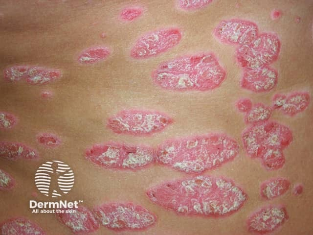
  <figcaption>Вульгарный (бляшечный) псориаз: чётко очерченные розово-красные бляшки с серебристо-белыми чешуйками на разгибательной поверхности.</figcaption>
</figure>

<figure>
  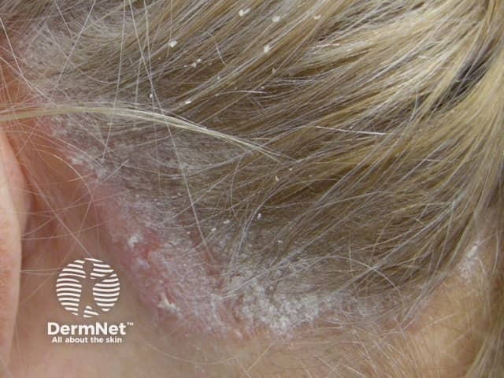
  <figcaption>Псориаз волосистой части головы: чешуйчатые бляшки, нередко выходящие за линию роста волос.</figcaption>
</figure>

<figure>
  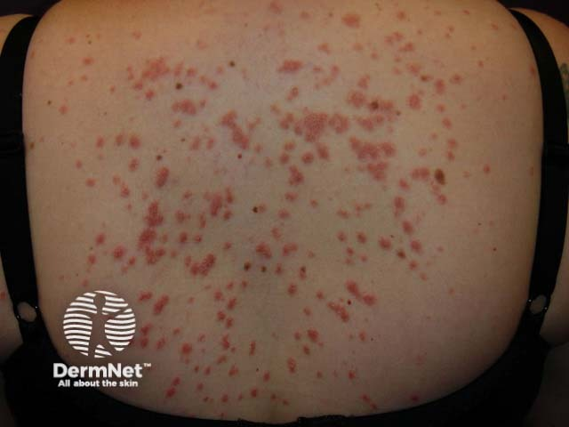
  <figcaption>Каплевидный псориаз: множественные мелкие «каплевидные» папулы по туловищу; частый провокатор — перенесённая стрептококковая инфекция.</figcaption>
</figure>

<figure>
  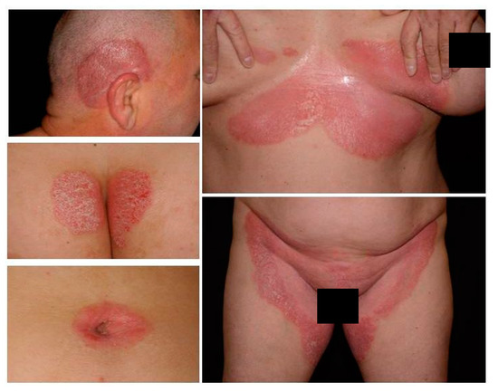
  <figcaption>Инверсный псориаз: гладкие красные очаги в складках, чешуйки минимальны или отсутствуют из-за влажности.</figcaption>
</figure>

<figure>
  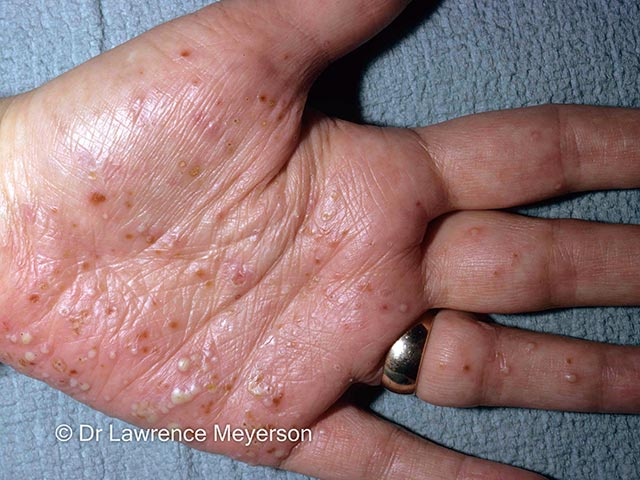
  <figcaption>Ладонно-подошвенный пустулёз: стерильные пустулы разного «возраста» — от жёлтых свежих до коричневых подсыхающих.</figcaption>
</figure>

<figure>
  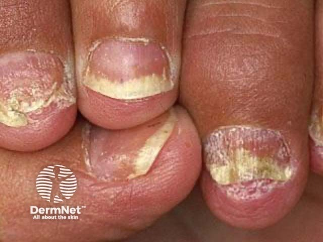
  <figcaption>Ногтевой псориаз: онихолизис (отслойка ногтевой пластины) и подногтевой гиперкератоз; к другим признакам относятся точечные вдавления («симптом напёрстка») и «масляные пятна».</figcaption>
</figure>

# Диагностические феномены

Феномены осмотра — прямое следствие гистологии и позволяют распознать псориаз клинически.

| Феномен | Что видно | Почему |
|---|---|---|
| **Стеариновое пятно** | При поскабливании усиливается шелушение, чешуйки как стёртый стеарин | Паракератоз, рыхлые несклеенные роговые чешуйки |
| **Терминальная плёнка** | Под чешуйками влажная блестящая поверхность | Обнажён истончённый ростковый слой |
| **Точечное кровотечение (Ауспитца)** | Мелкие капли крови | Сосуды сосочков подходят к самой поверхности |
| **Феномен Кёбнера** | Новые высыпания по линии царапины, шва, ожога | Травма запускает локальное воспаление |

Первые три феномена образуют **псориатическую триаду**, последовательно выявляемую при поскабливании бляшки (граттаж).

<!-- IMG PENDING: псориатическая триада / симптом Ауспитца
<figure>
  
  <figcaption>Псориатическая триада: стеариновое пятно → терминальная плёнка → точечное кровотечение (симптом Ауспитца) при поскабливании бляшки.</figcaption>
</figure>
-->


<!-- IMG PENDING: феномен Кёбнера
<figure>
  
  <figcaption>Феномен Кёбнера: новые псориатические высыпания, повторяющие линию механической травмы кожи (царапина, шов).</figcaption>
</figure>
-->


# Псориатический артрит и дактилит

Псориатический артрит развивается у части больных и может как следовать за кожными проявлениями, так и предшествовать им. Характерны асимметричный олигоартрит, энтезит (воспаление в местах прикрепления сухожилий), боль в спине воспалительного ритма и **дактилит** — равномерный отёк пальца целиком («палец-сосиска»).

<figure>
  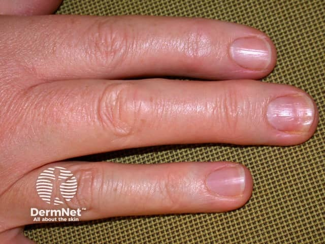
  <figcaption>Дактилит («палец-сосиска»): диффузный отёк всего пальца — сочетание артрита и теносиновита, типичное для псориатического артрита.</figcaption>
</figure>

# Неотложные формы

## Генерализованный пустулёзный псориаз (фон Цумбуша)

Самостоятельное состояние, а не «псориаз потяжелее». Развивается за часы–дни: внезапная лихорадка 38–40 °C, жжение и болезненность кожи, затем волна мелких **стерильных** пустул на ярко-красном фоне, сливающихся в «гнойные озёра». Волны повторяются.

Тяжесть определяется системностью процесса:

- системный воспалительный ответ, по картине неотличимый от сепсиса;
- поражение внутренних органов: острое повреждение печени, почечная недостаточность, острый респираторный дистресс-синдром;
- гиповолемия и гипоальбуминемия;
- вторичная бактериальная инфекция поверх стерильного воспаления.

> **Пустулы стерильны, но клинически это не отличимо от гнойной инфекции** — стерильность подтверждается только посевом. Поэтому до исключения инфекции состояние ведётся как септическое.

**Герпетиформное импетиго** — генерализованный пустулёзный псориаз беременных, чаще в третьем триместре; может быть первой в жизни манифестацией (нередко на фоне гипокальциемии). Угрожает плоду плацентарной недостаточностью и мертворождением.

<figure>
  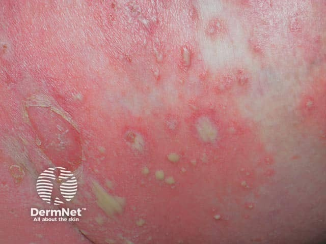
  <figcaption>Генерализованный пустулёзный псориаз (фон Цумбуша): волна стерильных пустул на ярко-эритематозном фоне, местами сливающихся в «гнойные озёра».</figcaption>
</figure>

<figure>
  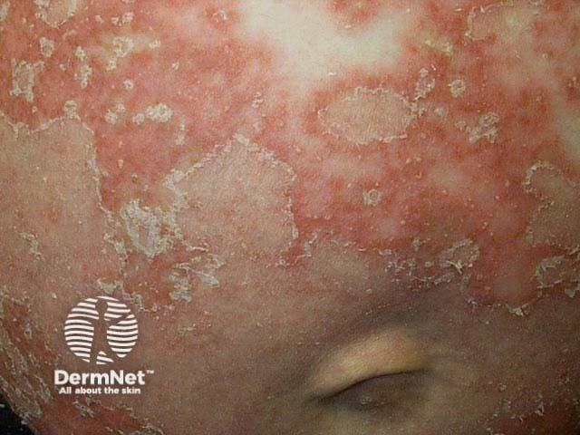
  <figcaption>Герпетиформное импетиго: пустулы по периферии эритематозных очагов у беременной — вариант генерализованного пустулёзного псориаза.</figcaption>
</figure>

## Псориатическая эритродермия

Поражение и шелушение более 90 % поверхности тела. Когда воспалена вся кожа, одновременно отказывают все её функции.

| Утраченная функция | Следствие | Клинические проявления |
|---|---|---|
| **Барьер для воды** | Потеря жидкости через кожу до 3–4 л/сут | Жажда, сухость языка, олигурия, тахикардия, гипотензия |
| **Терморегуляция** | Расширение сосудов, усиленное испарение | **Гипотермия**, озноб; при инфекции — лихорадка |
| **Барьер для микробов** | Входные ворота площадью в кв. метры | Сепсис — главная причина смерти |
| **Удержание белка** | Потеря 20–30 г белка в сутки с чешуйками | Отёки, гипоальбуминемия |
| **Регуляция кровотока** | Массивная вазодилатация, шунтирование | Сердечная недостаточность с высоким выбросом |
| **Электролитный гомеостаз** | Потери натрия, калия, кальция | Аритмии, судороги |

> **Контринтуитивная деталь:** несмотря на ярко-красную, горячую на вид кожу, пациент **мёрзнет** — теплоотдача превышает теплопродукцию. Гипотермия при эритродермии типична. Образно эритродермию называют «ожогом без огня».

<figure>
  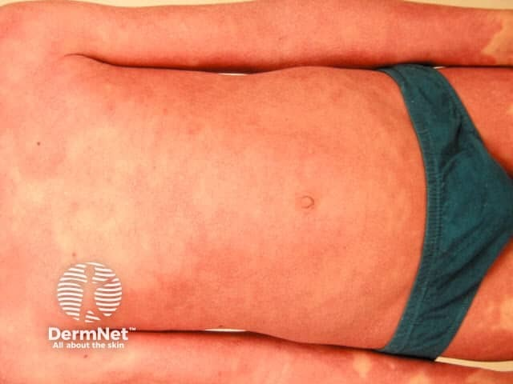
  <figcaption>Псориатическая эритродермия: сливная эритема, охватывающая практически весь кожный покров (>90 %).</figcaption>
</figure>

<figure>
  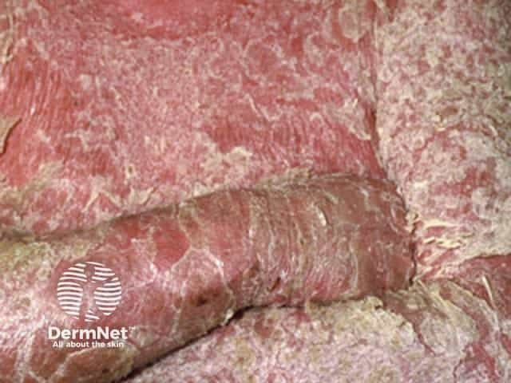
  <figcaption>Та же форма, крупный план: диффузная эритема с крупнопластинчатым шелушением — «ожог без огня».</figcaption>
</figure>

# Триггеры обострения

Значимая часть провокаторов — лекарственные, и это определяет их клиническую важность.

| Провокатор | Механизм и оговорка |
|---|---|
| **Системные глюкокортикоиды — назначение и особенно резкая отмена** | Классический пусковой механизм пустулёзного криза и эритродермии (синдром рикошета) |
| **Бета-адреноблокаторы** | Обострение через недели–месяцы; чаще неселективные |
| **Препараты лития** | Устойчивое обострение |
| **Антималярийные (гидроксихлорохин)** | Обострение, иногда тяжёлое |
| **НПВС** | Могут ухудшать течение |
| **Интерфероны, ингибиторы АПФ, тетрациклины, тербинафин** | Описаны как провокаторы |
| **Отмена метотрексата или биологической терапии** | Синдром рикошета вплоть до пустулёзной формы |

Нелекарственные: стрептококковая инфекция (особенно каплевидная форма), ВИЧ, гипокальциемия, беременность и роды, тяжёлый стресс, солнечный ожог, травма кожи, переохлаждение.

> **Клинически важно:** системный глюкокортикоид, назначенный или отменённый у больного псориазом «по поводу кожи», способен спровоцировать пустулёзный криз. При этом при витальных показаниях (анафилаксия, тяжёлая бронхообструкция, отёк гортани, надпочечниковая недостаточность) глюкокортикоид применяется по своим протоколам независимо от псориаза.

# Дифференциальный диагноз эритродермии

Эритродермия — синдром, а не диагноз. Наибольшее значение имеет отграничение псориатической эритродермии от токсического эпидермального некролиза, требующего иного маршрута и иной скорости.

| Причина | Отличительные признаки |
|---|---|
| **Псориатическая** | Известный псориаз в анамнезе, остаточные бляшки, ногтевые изменения, крупнопластинчатое шелушение |
| **Экзематозная** | Анамнез атопии, мокнутие, интенсивный зуд |
| **Лекарственная / DRESS** | Начало через 2–8 недель после нового препарата, отёк лица, лимфаденопатия, поражение печени |
| **AGEP (ОГЭП)** | Пустулы, остро в течение 1–2 суток после препарата, быстро разрешается после отмены |
| **ССД / ТЭН** | Поражение слизистых, болезненность кожи, отслойка эпидермиса пластами, положительный симптом Никольского |
| **Т-клеточная лимфома кожи** | Пожилые, длительный анамнез резистентной «экземы», лимфаденопатия |
| **Норвежская (корковая) чесотка** | Иммунодефицит, массивные корки, крайняя контагиозность |

**Симптом Никольского:** при боковом надавливании на видимо здоровую кожу рядом с очагом эпидермис сдвигается и отслаивается. При псориазе отрицательный; положительный уводит к токсическому эпидермальному некролизу и пузырным дерматозам.

<!-- IMG PENDING: симптом Никольского
<figure>
  
  <figcaption>Симптом Никольского: отслойка эпидермиса при касательном давлении — признак поражения дермо-эпидермального соединения (ТЭН, пузырчатка), при псориазе отрицателен.</figcaption>
</figure>
-->


<figure>
  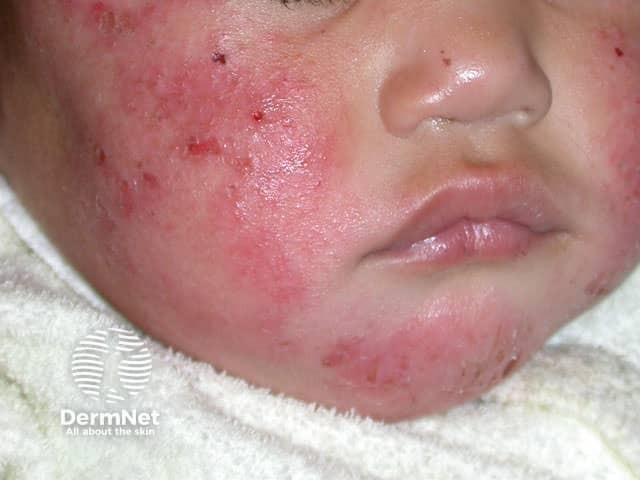
  <figcaption>Атопическая экзема: эритема, мокнутие и следы расчёсов; при генерализации даёт экзематозную эритродермию.</figcaption>
</figure>

<figure>
  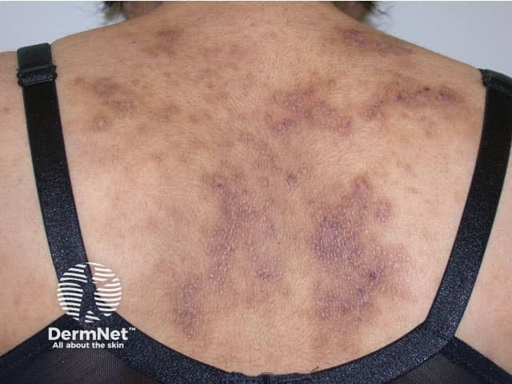
  <figcaption>Атопическая экзема: лихенификация и экскориации в типичной локализации.</figcaption>
</figure>

<figure>
  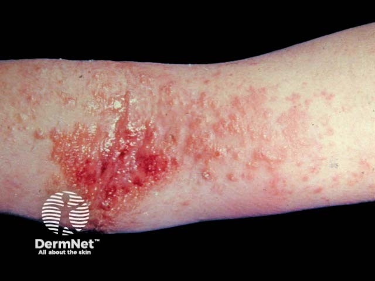
  <figcaption>Атопическая экзема: воспалённые шелушащиеся очаги; ключ к диагнозу — анамнез атопии и интенсивный зуд.</figcaption>
</figure>

<figure>
  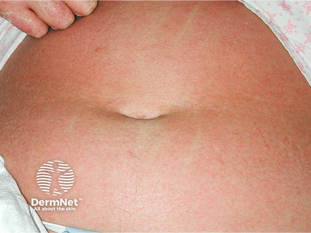
  <figcaption>DRESS-синдром: распространённая лекарственная сыпь с отёком лица; часты лимфаденопатия и поражение печени.</figcaption>
</figure>

<figure>
  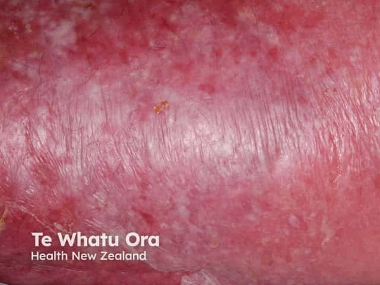
  <figcaption>Острый генерализованный экзантематозный пустулёз (AGEP): множество мелких стерильных пустул на отёчной эритеме, остро после приёма препарата.</figcaption>
</figure>

<figure>
  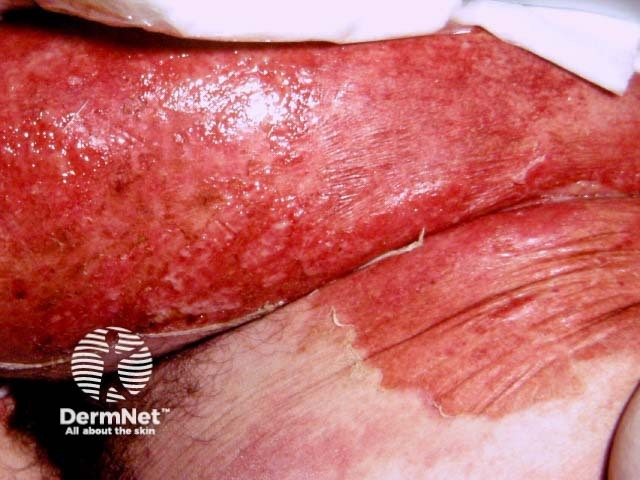
  <figcaption>Токсический эпидермальный некролиз / синдром Стивенса–Джонсона: отслойка эпидермиса пластами и поражение слизистых — маршрут как при ожоге, максимальная срочность.</figcaption>
</figure>

<figure>
  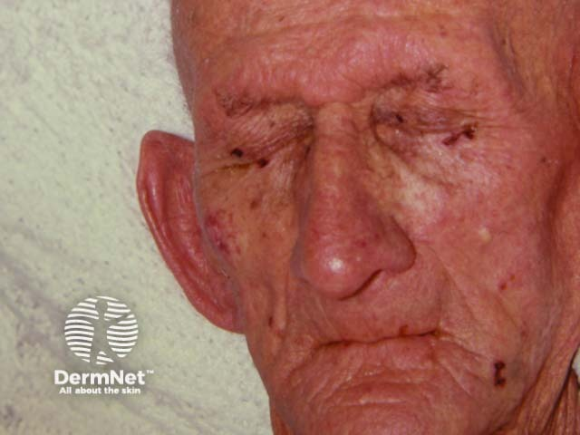
  <figcaption>Эритродермическая Т-клеточная лимфома кожи (синдром Сезари): диффузная эритема у пожилого пациента с длительным резистентным анамнезом.</figcaption>
</figure>

<figure>
  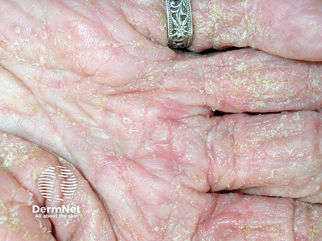
  <figcaption>Ранняя корковая (норвежская) чесотка: начинающиеся гиперкератотические наслоения.</figcaption>
</figure>

<figure>
  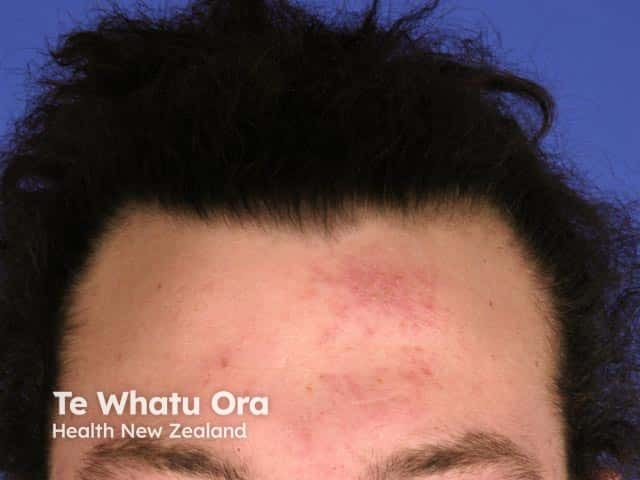
  <figcaption>Норвежская (корковая) чесотка: массивные гиперкератотические корки; развивается при иммунодефиците, крайне контагиозна.</figcaption>
</figure>

# Один горячий сустав: псориатический артрит или септический

У больного псориазом остро воспалённый сустав нельзя автоматически относить к обострению псориатического артрита: под этой маской скрывается септический артрит, разрушающий сустав за сутки.

| | Псориатический артрит | Септический артрит | Подагра |
|---|---|---|---|
| Начало | Дни–недели | **Часы–сутки** | Часы, ночью |
| Лихорадка | Редко | **Часто** | Возможна субфебрильная |
| Число суставов | Несколько, асимметрично; дактилит | **Один**, чаще колено | Один, чаще первый плюснефаланговый |
| Движение | Скованность, боль при нагрузке | **Полная невозможность движения** | Резкая боль от прикосновения |
| Риск | Функциональный | **Разрушение сустава, сепсис** | Функциональный |

> На фоне биологической терапии (ингибиторы ФНО-α, IL-17, IL-23) септический артрит и другие инфекции протекают **без выраженной лихорадки** и без ярких лабораторных сдвигов — субфебрилитет у такого пациента эквивалентен высокой температуре у иммунокомпетентного.

# Возвращение к клиническому случаю

**Диагноз бригады.** Генерализованный пустулёзный псориаз, форма фон Цумбуша, с системным воспалительным ответом и гиповолемией. Опорные признаки: известный псориаз в анамнезе, развитие за сутки-двое, лихорадка, болезненность кожи, волна мелких пустул на сливной эритеме, отсутствие поражения слизистых и отрицательный симптом отслойки эпидермиса.

**Пустулы стерильны, но лечится это как инфекция.** Отличить стерильное пустулообразование от гнойной инфекции у постели невозможно — стерильность подтверждается только посевом. Для бригады это означает простое правило: разграничение не влияет на объём помощи, поскольку и то и другое требует госпитализации и ведения как септического состояния. Более того, вторичная бактериальная инфекция поверх стерильных пустул — типичное осложнение, а не альтернативная версия.

**Гипотензия здесь закономерна.** Воспалённая кожа перестаёт удерживать воду: потери через покров при распространённом процессе достигают нескольких литров в сутки, к ним добавляется потеря белка с чешуйками и массивная вазодилатация. Тахикардия 118, давление 95/60, сухой язык и олигурия с утра — это дефицит объёма на фоне системного воспаления, а не «слабость от температуры». Инфузия натрия хлорида 0,9 % начинается на месте, под контролем гемодинамики; при сохраняющейся гипотензии объём и темп определяются по реакции, а не по формальной цифре.

**Озноб при температуре 39.** Кожа с расширенными сосудами теряет тепло быстрее, чем организм его производит, поэтому больной с ярко-красным горячим на вид покровом субъективно мёрзнет. При эритродермии типична именно гипотермия — и это ловушка: температуру измеряют, а не выводят из внешнего вида кожи. У этого пациента лихорадка есть, и она указывает на системный воспалительный ответ либо на присоединившуюся инфекцию; отсутствие лихорадки не сделало бы состояние легче.

**Роль преднизолона.** Резкая отмена системного глюкокортикоида у больного псориазом — классический пусковой механизм пустулёзного криза, синдром рикошета. Здесь сработала полная последовательность: бесконтрольный приём препарата «по поводу кожи», заметное улучшение, обрыв приёма разом. Практический вывод для линии — вопрос, который стоит задавать любому больному псориазом с внезапным ухудшением: что принимал внутрь и что перестал принимать в последние недели. Отмена метотрексата или биологической терапии даёт тот же эффект.

**Глюкокортикоид на вызове не вводится «по поводу кожи».** Возобновление системной терапии — решение стационара, и оно неоднозначно именно потому, что глюкокортикоид способен и провоцировать, и утяжелять пустулёзные формы. Оговорка остаётся прежней: при витальных показаниях — анафилаксия, тяжёлая бронхообструкция, отёк гортани, надпочечниковая недостаточность — глюкокортикоид применяется по своим протоколам независимо от псориаза.

**Отграничение от токсического эпидермального некролиза.** Здесь оно выполнено объективно: слизистые чистые, глаза не поражены, эпидермис при потягивании не отслаивается, ведущий элемент — пустула на эритеме, а не сливная болезненная эритема с отслойкой. При некролизе картина обратная: обязательное поражение слизистых, положительный симптом Никольского, связь с приёмом нового препарата за одну–три недели, — и это другой маршрут, в ожоговый центр или реанимацию, с другой скоростью.

**Что не делать.** Не вскрывать и не обрабатывать пустулы, не наносить на месте наружные средства, не фиксировать пациента жёсткими лямками по поражённой коже и вообще минимизировать травматизацию покрова: механическое повреждение кожи у больного псориазом само является провокатором новых элементов. Пациента укрыть — потеря тепла реальна, несмотря на лихорадку.

**Маршрут.** Многопрофильный стационар, а не участковый дерматолог и не «направление в поликлинику»: сочетание распространённого пустулёзного процесса с гипотензией и олигурией означает риск сепсиса, острого повреждения печени и почек, респираторного дистресс-синдрома. В передаче звучат площадь поражения, давность волны пустул, лихорадка, показатели гемодинамики, объём введённой жидкости и — обязательно — факт трёхнедельного приёма преднизолона с резкой отменой.

<!-- IMG PENDING: септический артрит
<figure>
  
  <figcaption>Септический артрит: один горячий, отёчный, резко болезненный сустав; движения практически невозможны.</figcaption>
</figure>
-->


# Ответы на вопросы для размышления

**1.** Отличить стерильные пустулы от гнойной инфекции у постели невозможно — стерильность подтверждается только посевом. Различие не меняет объём помощи: и то и другое требует госпитализации и ведения как септического состояния. Вторичная бактериальная инфекция поверх стерильных пустул — типичное осложнение.

**2.** Кожа с расширенными сосудами теряет тепло быстрее, чем организм его производит, поэтому больной с ярко-красным горячим на вид покровом субъективно мёрзнет. При эритродермии типична гипотермия. Температуру измеряют, а не выводят из внешнего вида кожи.

**3.** Резкая отмена системного глюкокортикоида — классический пусковой механизм пустулёзного криза (синдром рикошета). Бесконтрольный приём «по поводу кожи», улучшение, обрыв разом. Тот же эффект даёт отмена метотрексата или биологической терапии.

**4.** Глюкокортикоид на вызове не вводится «по поводу кожи»: возобновление системной терапии — решение стационара, препарат способен и провоцировать, и утяжелять пустулёзные формы. При витальных показаниях — анафилаксия, тяжёлая бронхообструкция, отёк гортани, надпочечниковая недостаточность — применяется по своим протоколам независимо от псориаза.

**5.** Здесь слизистые чистые, глаза не поражены, эпидермис при потягивании не отслаивается, ведущий элемент — пустула на эритеме. При токсическом эпидермальном некролизе — обязательное поражение слизистых, положительный симптом Никольского, связь с новым препаратом за одну–три недели; маршрут — ожоговый центр или реанимация.

**6.** Воспалённая кожа не удерживает воду: потери через покров достигают нескольких литров в сутки, плюс потеря белка с чешуйками и вазодилатация. Тахикардия, давление 95/60, сухой язык и олигурия — дефицит объёма. Инфузия натрия хлорида 0,9 % начинается на месте; темп определяется по реакции гемодинамики.

# Источники иллюстраций

Клинические фотографии — [DermNet](https://dermnetnz.org/), CC BY-NC-ND 4.0. Водяной знак сохранён, кадры не кропались и не ретушировались. Атрибуция: Image sourced from DermNet.

| Файл | Что изображено | Страница DermNet |
|---|---|---|
| `vulgaris.png` | Вульгарный (бляшечный) псориаз | [Psoriasis](https://dermnetnz.org/topics/psoriasis) |
| `scalp.png` | Псориаз волосистой части головы | [Scalp psoriasis](https://dermnetnz.org/topics/scalp-psoriasis) |
| `guttate.png` | Каплевидный псориаз | [Guttate psoriasis](https://dermnetnz.org/topics/guttate-psoriasis) |
| `inverse.jpg` | Инверсный псориаз | [Flexural psoriasis](https://dermnetnz.org/topics/flexural-psoriasis) |
| `palmoplantar_pustulosis.png` | Ладонно-подошвенный пустулёз | [Palmoplantar pustulosis](https://dermnetnz.org/topics/palmoplantar-pustulosis) |
| `nail.png` | Ногтевой псориаз | [Nail psoriasis](https://dermnetnz.org/topics/nail-psoriasis) |
| `dactylitis.png` | Дактилит | [Psoriatic arthritis](https://dermnetnz.org/topics/psoriatic-arthritis) |
| `generalized.jpg` | Генерализованный пустулёзный псориаз | [Generalised pustular psoriasis](https://dermnetnz.org/topics/generalised-pustular-psoriasis) |
| `impetigo_herpetiformis.png` | Герпетиформное импетиго | [Impetigo herpetiformis](https://dermnetnz.org/topics/impetigo-herpetiformis) |
| `erythroderma.png`, `erythroderma_2.png` | Псориатическая эритродермия | [Erythroderma](https://dermnetnz.org/topics/erythroderma) |
| `eczema_1.jpg`, `eczema_2.jpg`, `eczema_3.jpg` | Атопическая экзема | [Atopic dermatitis](https://dermnetnz.org/topics/atopic-dermatitis) |
| `dress.jpg` | DRESS-синдром | [DRESS syndrome](https://dermnetnz.org/topics/drug-hypersensitivity-syndrome) |
| `agep.jpg` | AGEP | [Acute generalised exanthematous pustulosis](https://dermnetnz.org/topics/acute-generalised-exanthematous-pustulosis) |
| `ten_sjs.jpg` | Токсический эпидермальный некролиз / ССД | [Toxic epidermal necrolysis](https://dermnetnz.org/topics/toxic-epidermal-necrolysis) |
| `ctcl_sezary.jpg` | Эритродермическая Т-клеточная лимфома кожи | [Cutaneous T-cell lymphoma](https://dermnetnz.org/topics/cutaneous-t-cell-lymphoma) |
| `crusted_scabies_1.jpg`, `crusted_scabies_2.jpg` | Корковая (норвежская) чесотка | [Crusted scabies](https://dermnetnz.org/topics/crusted-scabies) |

# Выходные данные

**Материал:** «Псориаз». Версия 1.0 от 16 августа 2026.

**Серия:** «Крещение поворотом» — клинические разборы догоспитальной практики.

**Лицензия:** текст — Creative Commons «С указанием авторства — Некоммерческая — С сохранением условий» 4.0 (CC BY-NC-SA 4.0). Клинические фотографии DermNet — CC BY-NC-ND 4.0, водяной знак сохранён. Копировать и печатать текст можно свободно; продавать нельзя; при переработке текста сохраняется CC BY-NC-SA 4.0. Кадры DermNet не модифицируются.

**Оговорка.** Материал учебный. Он не является нормативным документом, не заменяет действующие протоколы, клинические рекомендации и распоряжения службы и не может использоваться как единственное основание для клинического решения. Дозы, показания и маршрутизацию проверять по первоисточникам, действующим на момент чтения. Ответственность за решения у постели больного несёт медицинский работник, а не автор материала.

**О клиническом случае.** Случай обезличен: нет имени, даты вызова, адреса, номера карты и названия стационара. Совпадения с чужой практикой возможны.

**Нашли ошибку?** Ошибка в дозе, сроке или механизме — не мелочь: материал читают перед сменой. Сообщить можно через раздел Issues репозитория проекта; исправление выходит новой версией, а изменение фиксируется в журнале изменений.
