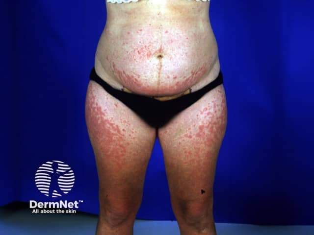
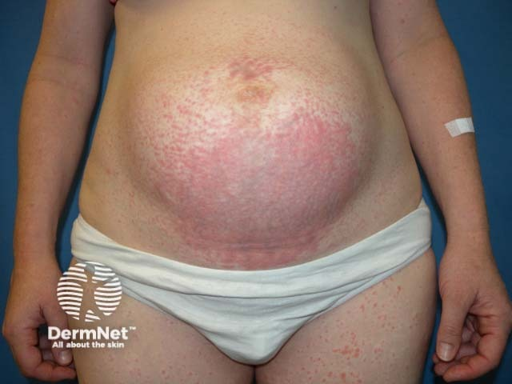
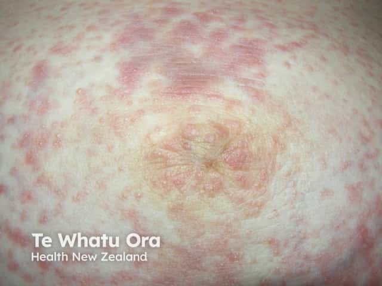
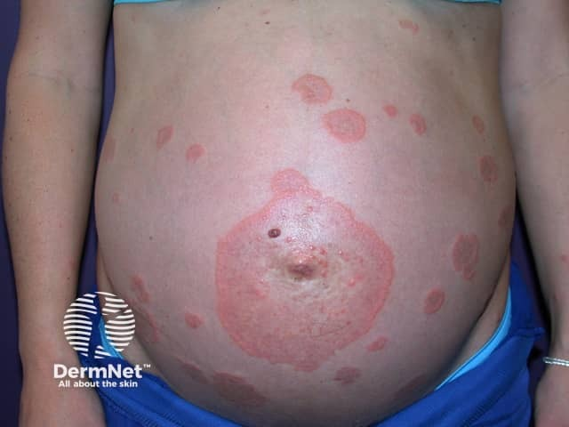
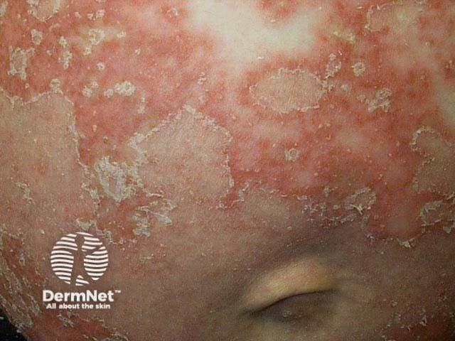
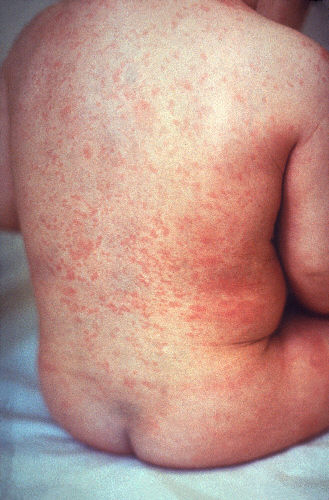
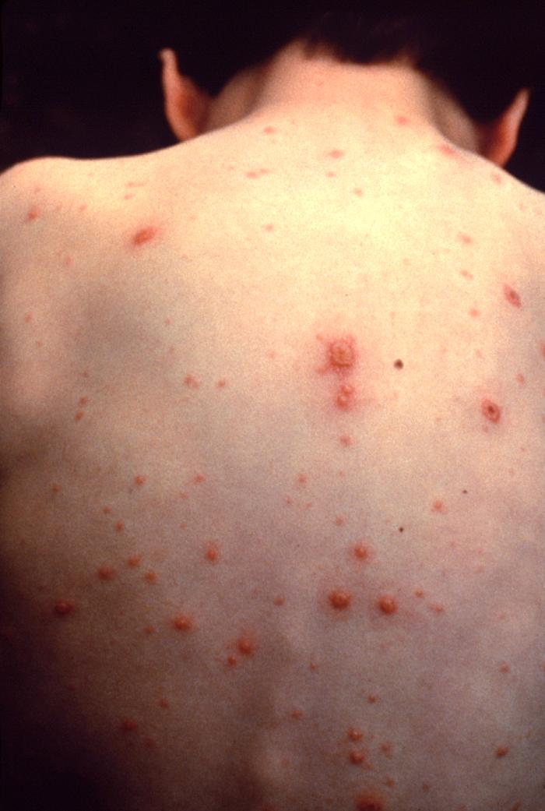

  
Клинический справочный материал

  
Сыпь у беременных

  
Дифференциальная диагностика зудящих дерматозов беременности: от безобидных до неотложных

  

  
Физиологические и патологические дерматозы беременности, дифференциальная диагностика с инфекционными сыпями.

  
Один вызов: зудящая сыпь на животе у беременной 33 недель с единственным эпизодом лихорадки.

  
Серия «Крещение поворотом» · версия 1.0 · 28 августа 2026 · CC BY-NC-SA 4.0

## Слово бригаде

## Сыпь у беременной

"Беременная, 27 лет, первая беременность, срок 33 недели. На животе сыпь, мелкие красные пятна, не возвышаются над кожей. При диаскопии элементы вроде бы бледнеют, но они и так не яркие, как-то сомнительно. Сыпь зудит, пациентка отмечает усиление зуда в вечернее время. Сыпи нет на других участках тела, на конечностях, спине, лице. На животе — растяжки (striae gravidarum). Слизистые без изменений. Было однократное повышение температуры до 38 °C. Спала сама, без жаропонижающих.

При осмотре пациентка активная, самочувствие удовлетворительное. Температура 36,8 °C, АД 118/75 мм рт. ст., ЧСС 88 в минуту, ЧД 16 в минуту, SpO₂ 99 %. Окружность живота и высота стояния дна матки соответствуют сроку беременности, живот мягкий, безболезненный. Шевеления плода чувствуются, сердцебиение плода 140 в минуту.

Акушерский пульт в инфекционном характерен не уверен, но подъем температуры зафиксирован, поэтому ехать ей в инфекционку.

В итоге пациентка категорически отказывается от госпитализации в инфекционный стационар и остается дома."

# Вопросы для размышления

Ответы — в конце материала.

1. Какой первый вопрос относительно сыпи, который нужно задать до начала дифференциальной диагностики?
2. Почему сыпь на животе у беременной требует особого внимания и какие состояния нужно исключить в первую очередь?
3. PUPPP (Pruritic Urticarial Papules and Plaques of Pregnancy) — что это, каковы типичные сроки возникновения, локализация и прогноз?
4. Пемфигоид беременных (pemphigoid gestationis) — чем отличается от PUPPP, какие опасности для матери и плода?
5. Псориаз при беременности — как изменяется течение болезни, какие особенности локализации и чем отличается от других дерматозов?
6. Внутрипечёночный холестаз беременных — почему это включается в дифференциальный диагноз при зуде без видимой сыпи?
7. Как инфекционные сыпи отличить от дерматозов беременности на догоспитальном этапе?
8. Что делать при отказе от госпитализации и какие критерии требуют обязательной госпитализации?

# Общие положения

Дерматозы беременности встречаются у 20–40 % беременных и варьируют от физиологических изменений до состояний, угрожающих жизни матери и плода. Большинство дерматозов беременности специфичны для гестационного периода и патогенетически связаны с гормональными и иммунологическими изменениями.

Ключевое различие в дифференциальной диагностике — зудящие дерматозы беременности против инфекционных сыпей. Зудящие дерматозы беременности характеризуются преимущественной локализацией на животе, отсутствием системных признаков инфекции и закономерными сроками возникновения. Инфекционные сыпи при беременности требуют немедленной оценки и исключения в связи с потенциальным риском для плода (ветряная оспа, краснуха, другие вирусные экзантемы).

Задача догоспитального этапа заключается не в постановке точного нозологического диагноза дерматоза, а в исключении инфекционной природы сыпи и оценке риска для матери и плода.

# Классификация дерматозов беременности

## Физиологические изменения

- **Гиперпигментация** — потемнение ареол, linea nigra, мелазма (хлоазма)
- **Стрии gravidarum** (растяжки) — типичны для III триместра, локализуются на животе, бёдрах, груди
- **Васкулярные изменения** — паутинные ангиомы, пальмарная эритема
- **Увеличение сальных и потовых желёз** — может усиливать акне

Эти изменения не требуют лечения и не влияют на исход беременности.

## Специфические дерматозы беременности

| Дерматоз | Срок возникновения | Локализация | Характер сыпи | Зуд | Прогноз |
|---|---|---|---|---|---|
| **PUPPP (полиморфная сыпь беременных)** | III триместр, чаще multipara | Живот, особенно в области растяжек | Уртикарии, папулы, бляшки | Есть | Благоприятный, проходит после родов |
| **Пемфигоид беременных** | II–III триместр, может начаться раньше | Живот, распространяется на всё тело | Пузыри, везикулы, эритема | Сильный | Риск для плода, требует наблюдения |
| **Intrahepatic cholestasis** | III триместр | Нет сыпи или слабая экскориации | Обычно нет сыпи | Сильный зуд | Риск для плода, требует лечения |
| **Psoriasis** | Любой триместр (может обостряться) | Локти, колени, волосистая часть головы, поясница | Эритематозные бляшки с чешуйками | Может быть | Обычно благоприятный, тяжёлые формы — риск для плода |
| **Atopic eruption** | Любой триместр | Любая локализация | Экзема-подобная сыпь | Есть | Благоприятный |

# Основные дерматозы беременности

## PUPPP — полиморфная сыпь беременных (Pruritic Urticarial Papules and Plaques of Pregnancy)

Наиболее частый специфический дерматоз беременности; распространённость составляет 1 : 150–300 беременных.

- **Срок возникновения:** III триместр, преимущественно у multipara; возможно начало в раннем послеродовом периоде
- **Локализация:** дебют в области растяжек передней брюшной стенки с последующим распространением на бёдра, ягодицы, реже — на верхние конечности; лицо и слизистые оболочки, как правило, не поражаются
- **Морфология элементов:** уртикарии, папулы, бляшки; элементы склонны к слиянию, что может создавать картину, сходную с крапивницей; везикулы и пузыри не характерны (их наличие указывает на пемфигоид беременных)
- **Зуд:** выраженный, усиливается в вечернее и ночное время
- **Системные проявления:** отсутствуют; общее состояние беременной не страдает
- **Прогноз:** благоприятный; спонтанное разрешение в течение 1–2 недель после родов; высок риск рецидива при последующих беременностях

<figure>
  
  <figcaption>PUPPP: характерная сыпь в области растяжек на животе; уртикарии и папулы, сливающиеся в бляшки.</figcaption>
</figure>

**Дифференциальная диагностика:** отличие от крапивницы — постоянная локализация на животе, длительное существование элементов, ассоциация с беременностью. Отличие от pemphigoid gestationis — отсутствие пузырей, начало в III триместре, благоприятный прогноз.

**Лечение:** местные кортикостероиды, антигистаминные препараты для облегчения зуда. Системные кортикостероиды не требуются. Госпитализация не нужна при удовлетворительном состоянии матери и плода.

<figure>
  
  <figcaption>PUPPP: распространённая сыпь на животе и бёдрах; характерное расположение в области растяжек.</figcaption>
</figure>

## Пемфигоид беременных — Pemphigoid gestationis

Редкий аутоиммунный буллёзный дерматоз; распространённость — 1 : 50 000 беременных.

- **Срок возникновения:** преимущественно II триместр; возможен дебют в I триместре или раннем послеродовом периоде
- **Локализация:** начало в периумбиликальной области с последующим распространением на весь живот, затем — на конечности, ладонные и подошвенные поверхности; возможно поражение лица и слизистых оболочек
- **Морфология элементов:** эритема, уртикарии, папулы с последующим формированием пузырей и везикул; элементы имеют тенденцию к группировке
- **Зуд:** интенсивный, часто предшествует появлению сыпи
- **Системные проявления:** возможны слабость, недомогание
- **Прогноз:** риск для плода включает преждевременные роды и гипотрофию; для матери характерны обострения при последующих беременностях; сыпь может персистировать или обостряться в первые месяцы после родов

<figure>
  
  <figcaption>Pemphigoid gestationis: пузыри и везикулы на эритематозном фоне; характерная локализация вокруг пупка.</figcaption>
</figure>

**Дифференциальная диагностика:** отличие от PUPPP — наличие пузырей, более раннее начало, риск для плода. Отличие от других буллёзных дерматозов — связь с беременностью, наличие специфических антител.

**Лечение:** системные кортикостероиды (преднизолон), наблюдение акушером-гинекологом, возможная госпитализация для контроля состояния плода. Местное лечение недостаточно.

<figure>
  
  <figcaption>Pemphigoid gestationis: распространённая сыпь с пузырями на животе и конечностях; характерное начало вокруг пупка.</figcaption>
</figure>

## Внутрипечёночный холестаз беременных

Состояние, не являющееся дерматозом в строгом смысле, но представляющее важное значение в дифференциальной диагностике зуда при беременности.

- **Срок возникновения:** III триместр
- **Локализация:** сыпь обычно отсутствует; при выраженном зуде возможны экскориации вследствие расчёсывания
- **Клиническая картина:** изолированный зуд без видимой сыпи, усиливающийся в ночное время; возможна желтуха
- **Лабораторные изменения:** повышение уровня желчных кислот, трансаминаз, билирубина
- **Прогноз:** риск для плода включает преждевременные роды и внутриутробную гибель; требуется лечение урсодезоксихолевой кислотой, возможно раннее родоразрешение

**Дифференциальная диагностика:** отсутствие сыпи при сильном зуде, повышение печёночных проб, связь с беременностью.

## Псориаз при беременности

Псориаз — хроническое воспалительное заболевание кожи; течение при беременности вариабельно. По данным литературы, у 40–60 % женщин отмечается улучшение кожных проявлений во время беременности, у 10–20 % — обострение, у остальных — стабильное течение.

- **Срок возникновения:** обострения возможны в любом триместре
- **Локализация:** классические локализации включают локтевые и коленные суставы, волосистую часть головы, поясничную область; возможна генерализация процесса
- **Морфология элементов:** эритематозные бляшки с серебристыми чешуйками; характерна псориатическая триада (стеариновое пятно, терминальная плёнка, точечное кровотечение)
- **Зуд:** вариабелен — от отсутствия до выраженного
- **Прогноз:** для плода, как правило, благоприятный; тяжёлые формы ассоциированы с повышенным риском преждевременных родов и низкой массы тела плода при рождении

<figure>
  
  <figcaption>Псориаз при беременности: характерные бляшки с серебристыми чешуйками на классических локализациях.</figcaption>
</figure>

**Дифференциальная диагностика:** отличие от PUPPP — отсутствие связи с растяжками, наличие чешуек, классические локализации (локти, колени). Отличие от pemphigoid gestationis — отсутствие пузырей, хроническое течение до беременности.

**Лечение:** местные кортикостероиды, эмоленты, при тяжёлых формах — системные препараты (циклоспорин, биологические препараты) по строгим показаниям и под наблюдением специалиста. Требует консультации дерматолога.

# Инфекционные сыпи при беременности

Несмотря на то, что большинство сыпей у беременных — это дерматозы, инфекционную природу нужно исключить в первую очередь.

## Краснуха

- **Сыпь:** пятнисто-папулёзная, начинается на лице, распространяется вниз
- **Сопутствующие признаки:** лихорадка, лимфаденопатия (затылочные узлы), конъюнктивит
- **Риск для плода:** высокий в I триместре — врождённые пороки развития
- **Дифференциальная диагностика:** эпидемиологический анамнез, контакт с больными, отсутствие вакцинации

<figure>
  
  <figcaption>Краснуха: пятнисто-папулёзная сыпь на лице и туловище; характерная лимфаденопатия. Изображение: CDC Public Health Image Library (public domain).</figcaption>
</figure>

## Ветряная оспа

- **Сыпь:** везикулёзная, «пёстрая» — пятна, папулы, везикулы, корки одновременно
- **Сопутствующие признаки:** лихорадка, недомогание
- **Риск для плода:** высок риск в I и II триместрах — врождённая ветряная оспа, риск пневмонии у матери
- **Дифференциальная диагностика:** характерная сыпь, контакт с больным, отсутствие вакцинации

<figure>
  
  <figcaption>Ветряная оспа: везикулёзная сыпь на разных стадиях развития; характерная «пёстрая» картина. Изображение: TeachMeObGyn (CC BY-SA 3.0).</figcaption>
</figure>

## Коклюш

- **Сыпь:** может быть мелкая пятнистая сыпь, но не обязательный признак
- **Сопутствующие признаки:** приступообразный кашель, рвота после кашля
- **Риск для плода:** возможны осложнения у матери
- **Дифференциальная диагностика:** характерный кашель, эпидемиологический анамнез

# Алгоритм догоспитального обследования

## Осмотр и сбор анамнеза

1. **Первый вопрос:** когда появилась сыпь, как прогрессировала, что предшествовало
2. **Локализация:** тщательно осмотреть всё тело, включая слизистые
3. **Характер сыпи:** диаскопия, морфология элементов, динамика
4. **Сопутствующие симптомы:** лихорадка, кашель, насморк, боль в горле, артралгии, общее состояние
5. **Акушерский анамнез:** срок беременности, течение беременности, движения плода
6. **Эпидемиологический анамнез:** контакты с инфекционными больными, поездки

## Ключевые отличия

| Признак | Дерматозы беременности | Инфекционные сыпи |
|---|---|---|
| **Лихорадка** | Редко, если есть — обычно субфебрильная | Часто, часто высокая |
| **Системные признаки** | Отсутствуют или минимальны | Присутствуют (кашель, насморк, слабость) |
| **Локализация** | Часто ограничена (живот) | Генерализованная |
| **Динамика** | Медленная, постоянная | Быстрая, прогрессирующая |
| **Эпидемиологический анамнез** | Отрицательный | Часто положительный |
| **Диаскопия** | Бледнеют (сосудистые) | Бледнеют (сосудистые) или нет (геморрагические) |

# Критерии госпитализации

Обязательная госпитализация требуется при:

1. **Подозрении на инфекционную природу сыпи** с лихорадкой и системными признаками
2. **Тяжёлом состоянии матери** — нарушение гемодинамики, дыхательная недостаточность
3. **Признаках поражения плода** — изменение сердцебиения, уменьшение движений
4. **Подозрении на pemphigoid gestationis** — пузыри, быстрое распространение
5. **Подозрении на внутрипечёночный холестаз** — сильный зуд без сыпи, желтуха
6. **Отсутствии возможности наблюдения** — социальные показания

При отказе от госпитализации при удовлетворительном состоянии матери и плода, отсутствии признаков инфекции и характерной картине PUPPP — возможна динамическая оценка на месте с рекомендацией консультации дерматолога и акушера-гинеколога в женской консультации.

# Возвращение к клиническому случаю

## Сыпь у беременной

Диаскопия показала, что сыпь бледнеет — это сосудистая сыпь, а не геморрагическая. Уже это делает менингококковую инфекцию маловероятной, но инфекцию нужно исключить полностью.

**Локализация.** Сыпь ограничена животом — конкретно областью растяжек. Ни на конечностях, ни на спине, ни на лице элементов нет. Эта локализация характерна для PUPPP — самого частого специфического дерматоза беременности. Инфекционные сыпи обычно генерализованные.

**Характер сыпи.** Пятна и папулы, местами сливающиеся в бляшки — типичная картина PUPPP. Нет пузырей, что исключает pemphigoid gestationis. Нет везикул, что исключает ветряную оспу. Элементы не возвышаются как при крапивнице, и длительность их существования — несколько дней, а не часы.

**Зуд.** Сыпь зудит, что характерно для дерматозов беременности и сосудистых сыпей. При чисто геморрагических сыпях (петехии, пурпура инфекционной природы) зуд отсутствует.

**Сопутствующие признаки.** Лихорадка была однократная до 38 °C, сейчас температура нормальная. Нет катаральных явлений, нет кашля, насморка, боли в горле — это делает вирусную инфекцию маловероятной. Нет лимфаденопатии, что делает краснуху маловероятной. Нет признаков тяжёлого состояния — пациентка активная, гемодинамика стабильная.

**Срок беременности.** 33 недели — это III триместр, когда PUPPP возникает наиболее часто. Для pemphigoid gestationis более характерно начало во II триместре. Для внутрипечёночного холестаза — III триместр, но обычно нет видимой сыпи, а есть сильный зуд и желтуха.

**Эпидемиологический анамнез.** Контакт с инфекционными больными отрицательный, поездок не было. Это делает инфекционную природу сыпи маловероятной.

Совокупность признаков — локализация на животе в области растяжек, зуд, сосудистый характер сыпи (бледнеет при диаскопии), отсутствие системных признаков инфекции, срок беременности — указывает на PUPPP. Инфекционная природа маловероятна, но требует исключения из-за риска для плода.

Догоспитальная тактика: полное обследование, диаскопия, сбор анамнеза. При удовлетворительном состоянии матери и плода, отсутствии признаков инфекции, характерной картине PUPPP — возможна динамическая оценка на месте с рекомендацией консультации дерматолога и акушера-гинеколога в женской консультации. При отказе от госпитализации — информировать о рисках, обеспечить возможность наблюдения.

# Ответы на вопросы

**1.** Когда появилась сыпь? Время появления — ключевой фактор дифференциальной диагностики: оно позволяет соотнести сыпь с триместром беременности и отличить дерматозы беременности от инфекционных экзантем.

**2.** Сыпь на животе у беременной требует исключения специфических дерматозов беременности (PUPPP, pemphigoid gestationis) и инфекционных сыпей (краснуха, ветряная оспа). В первую очередь нужно исключить инфекцию из-за риска для плода.

**3.** PUPPP — самый частый специфический дерматоз беременности, возникает в III триместре у multipara, локализуется на животе в области растяжек, проявляется уртикариями и папулами, зудит, имеет благоприятный прогноз, проходит после родов.

**4.** Pemphigoid gestationis — редкий аутоиммунный дерматоз, возникает во II–III триместрах, начинается вокруг пупка, характеризуется пузырями и везикулами, несёт риск для плода (преждевременные роды, гипотрофия), требует системных кортикостероидов и наблюдения.

**5.** Псориаз при беременности может улучшаться у 40–60 % женщин, обостряться у 10–20 %. Характеризуется эритематозными бляшками с серебристыми чешуйками на классических локализациях (локти, колени, волосистая часть головы, поясница). Отличается от PUPPP отсутствием связи с растяжками и наличием чешуек, от pemphigoid gestationis — отсутствием пузырей и хроническим течением до беременности.

**6.** Внутрипечёночный холестаз беременных включается в дифференциальный диагноз при сильном зуде без видимой сыпи, может сопровождаться желтухой, несёт риск для плода, требует лечения урсодезоксихолевой кислотой и возможного раннего родоразрешения.

**7.** Инфекционные сыпи отличают по наличию системных признаков (лихорадка, катаральные явления), эпидемиологическому анамнезу, быстрой динамике, генерализованной локализации. Дерматозы беременности — локализованные, без системных признаков, медленно прогрессирующие.

**8.** При отказе от госпитализации необходимо оценить состояние матери и плода, исключить инфекцию, обеспечить возможность наблюдения. Обязательная госпитализация — при признаках инфекции, тяжёлом состоянии, подозрении на pemphigoid gestationis или холестаз.

# Основные выводы

<table>
<colgroup><col class="nomer"><col class="vyvod"></colgroup>
<thead><tr><th>№</th><th>Вывод</th></tr></thead>
<tbody>
<tr><td>1</td><td>Сыпь на животе у беременной — чаще PUPPP, но сначала исключить инфекцию. Лихорадка, системные признаки, эпидемиологический анамнез в пользу инфекции.</td></tr>
<tr><td>2</td><td>PUPPP — III триместр, растяжки, уртикарии, зуд, благоприятный прогноз. Pemphigoid gestationis — пузыри, риск для плода, требует кортикостероидов.</td></tr>
<tr><td>3</td><td>Псориаз при беременности — может улучшаться или обостряться, бляшки с чешуйками на классических локализациях, обычно благоприятный для плода.</td></tr>
<tr><td>4</td><td>Внутрипечёночный холестаз — зуд без сыпи, повышение печёночных проб, риск для плода, требует урсодезоксихолевой кислоты.</td></tr>
<tr><td>5</td><td>Инфекционные сыпи исключают по анамнезу, системным признакам, динамике. Краснуха, ветряная оспа несут риск для плода.</td></tr>
<tr><td>6</td><td>При подозрении на инфекционную природу сыпи, тяжёлом состоянии матери или признаках поражения плода — обязательная госпитализация. При благоприятной картине PUPPP и отказе от госпитализации — динамическая оценка на месте с рекомендацией консультации дерматолога и акушера-гинеколога.</td></tr>
</tbody>
</table>

