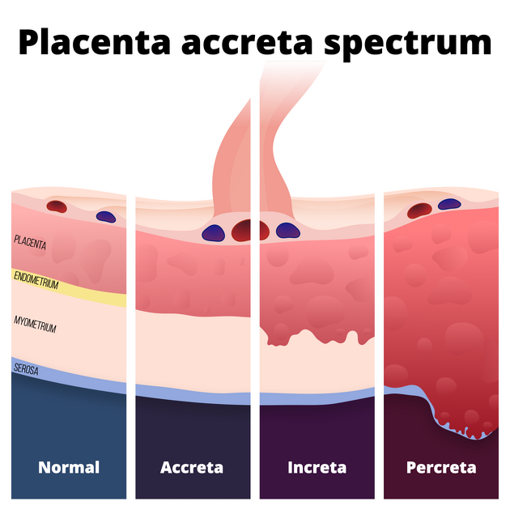
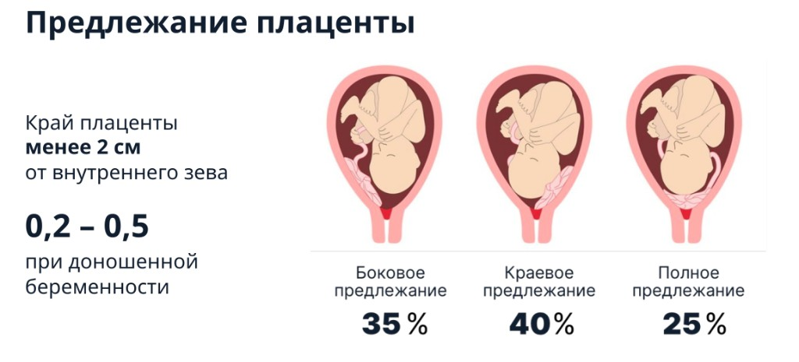
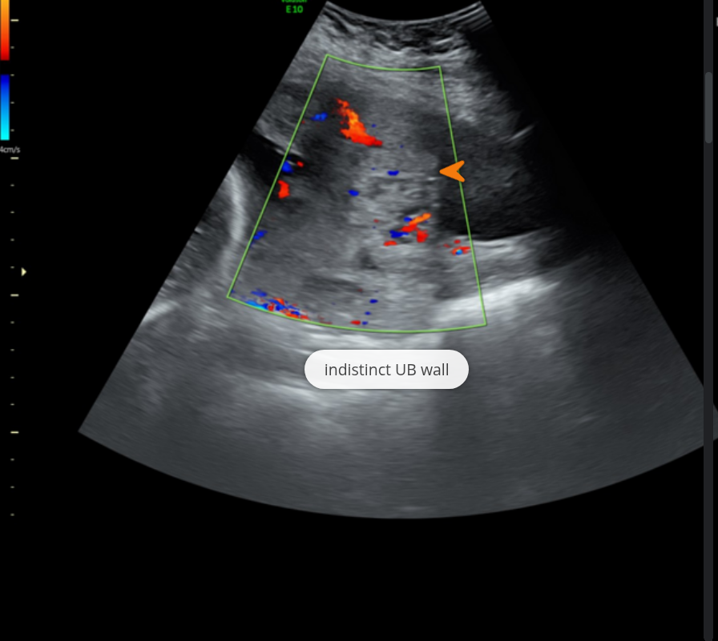
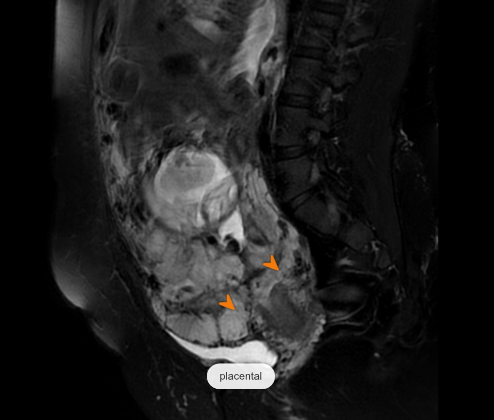

  
Клинический справочный материал

  
Врастание плаценты

  
Placenta accreta spectrum (PAS)

  

  
Терминология по классификации FIGO (2019).

  
Эпидемиологические данные: Silver R.M. et al., 2006 (MFMU Network).

  
Серия «Крещение поворотом» · версия 1.2 · 16 августа 2026 · CC BY-NC-SA 4.0

# Клинический случай

## Слово бригаде

"Женщина 34 лет, беременность 30 недель, третья (первая завершилась кесаревым сечением, вторая — медицинским абортом). Пятнадцать минут назад внезапно началось кровотечение из половых путей, кровь алая; к моменту приезда бригады на ковре несколько пятен, кровотечение продолжается. Боли в животе нет. Шевеления плода ощущает.

Объективно: сознание ясное, кожа бледная, конечности прохладные. АД 105/65 мм рт. ст., ЧСС 98 в минуту, ЧД 18, SpO₂ 99 %. Живот мягкий, безболезненный при пальпации, **матка не напряжена**, тонус нормальный, части плода определяются.

Из обменной карты: **предлежание плаценты** и **рубец на матке после кесарева сечения** в первых родах."

Разбор случая приведён в конце материала.

# Вопросы для размышления

Ответы — в конце материала.

1. Как по двум признакам — боль и тонус матки — на месте развести предлежание плаценты и преждевременную отслойку нормально расположенной плаценты?
2. Почему при этой картине не выполняется вагинальный осмотр?
3. Что именно в анамнезе превращает эпизод кровотечения в подозрение на врастание плаценты и как это меняет требования к стационару?
4. Почему при подтверждённом врастании плаценту не отделяют и что происходит при попытке отделения?
5. Что должно быть сказано принимающей стороне, чтобы операционная и компоненты крови готовились до поступления?

# Определение и степени инвазии

**Placenta accreta spectrum (PAS)** — группа состояний, при которых ворсины хориона аномально прикрепляются к миометрию или прорастают в него вследствие дефекта или отсутствия **decidua basalis** (базальной отпадающей оболочки). В норме децидуа образует физиологический слой отделения плаценты в третьем периоде родов; при его отсутствии плацента не отделяется.

Классификация FIGO (2019) выделяет три степени по глубине инвазии.

<figure>
  
  <figcaption>Норма и три степени PAS в разрезе стенки матки. Слои: PLACENTA — плацента, ENDOMETRIUM — эндометрий (децидуа), MYOMETRIUM — миометрий, SEROSA — серозная оболочка. В норме сохранён слой децидуа; при accreta он отсутствует и ворсины достигают миометрия; при increta проникают в его толщу; при percreta прорастают через серозу за пределы матки.</figcaption>
</figure>

| Степень | Латинское | Русское | Глубина инвазии |
|---|---|---|---|
| Grade 1 | Placenta accreta (adherenta) | Приращение | Ворсины **в контакте** с миометрием без инвазии (децидуа отсутствует) |
| Grade 2 | Placenta increta | Врастание | Ворсины **инвазируют в толщу** миометрия |
| Grade 3 | Placenta percreta | Прорастание | Ворсины проходят **через миометрий и серозу**; возможна инвазия в мочевой пузырь, кишечник, параметрий |

Grade 3 подразделяется на: 3a — прорастание серозы; 3b — инвазия в стенку мочевого пузыря; 3c — инвазия в другие органы и ткани таза.

> **Этимология как мнемоника:** *ac-creta* — прикрепление (поверхностно), *in-creta* — врастание (в толщу), *per-creta* — прорастание (через всю стенку).

# Патогенез

Ключевое звено — **дефект границы «эндометрий–миометрий»** в зоне предшествующего повреждения матки (рубец после кесарева сечения, миомэктомии, выскабливания). В области рубца отсутствует или неполноценна decidua basalis, поэтому ворсины трофобласта имплантируются непосредственно на миометрий или инвазируют в него.

Наибольший риск создаёт сочетание **рубца на матке** и **предлежания плаценты**: плацента, расположенная над рубцом в нижнем маточном сегменте, имплантируется в зону максимально дефектной децидуа.

# Предлежание плаценты — ведущий фон

<figure>
  
  <figcaption>Варианты расположения плаценты относительно внутреннего зева. Край плаценты &lt; 2 см от внутреннего зева — низкое расположение. Частота предлежания при доношенной беременности — 0,2–0,5 %.</figcaption>
</figure>

Предлежание плаценты — расположение плаценты в нижнем маточном сегменте с перекрытием или близостью к внутреннему зеву. При наличии рубца именно предлежащая плацента над рубцом даёт максимальную вероятность PAS.

# Факторы риска

Риск PAS определяется прежде всего **числом предшествующих кесаревых сечений** и **наличием предлежания плаценты**. При предлежании плаценты риск возрастает от 3 % (без рубца) до ~60–67 % (три и более КС).

| Число КС в анамнезе | Риск PAS при предлежании плаценты |
|---|---|
| 0 | 3 % |
| 1 | 11 % |
| 2 | 40 % |
| 3 | 61 % |
| ≥ 4 | 67 % |

Дополнительные факторы: миомэктомия и другие операции на матке в анамнезе, аблация эндометрия, лучевая терапия органов таза, синдром Ашермана, возраст матери, вспомогательные репродуктивные технологии.

# Диагностика

Основной метод антенатальной диагностики — **ультразвуковое исследование** (обычно во II–III триместре), при неоднозначности дополняемое **МРТ**.

Ультразвуковые признаки PAS:

- множественные сосудистые **лакуны** в толще плаценты («швейцарский сыр»);
- **утрата гипоэхогенной ретроплацентарной зоны** между плацентой и миометрием;
- **истончение миометрия** над плацентой (< 1 мм);
- нарушение непрерывности **границы «серозная оболочка матки – стенка мочевого пузыря»**;
- усиленная субплацентарная и мостовидная **васкуляризация** при допплерографии.

<figure>
  
  <figcaption>Ультразвуковое исследование с цветовым допплеровским картированием при placenta percreta: усиленная васкуляризация в зоне между серозной оболочкой матки и стенкой мочевого пузыря; граница «серозная оболочка – мочевой пузырь» нечёткая (indistinct UB wall, стрелка). Иллюстрация из другого клинического наблюдения.</figcaption>
</figure>

При неоднозначности ультразвуковой картины выполняется магнитно-резонансная томография: она лучше показывает трансмуральное распространение ткани плаценты и вовлечение соседних органов.

Магнитно-резонансные признаки percreta: выбухание контура матки, неоднородный сигнал плаценты с внутриплацентарными гипоинтенсивными полосами, нарушение непрерывности гипоинтенсивной линии на границе с миометрием, прилежание ткани плаценты к стенке мочевого пузыря.

<figure>
  
  <figcaption>Магнитно-резонансная томография, сагиттальная проекция, при placenta percreta: неоднородный сигнал плаценты, внутриплацентарные гипоинтенсивные полосы и нарушение непрерывности линии на границе с миометрием; ткань плаценты прилежит к стенке мочевого пузыря — признак инвазии (стрелки). Иллюстрация из другого клинического наблюдения.</figcaption>
</figure>

Антенатальная диагностика PAS принципиально меняет тактику: позволяет спланировать место, срок и объём родоразрешения заранее.

# Клиническое течение и осложнения

Вне родов PAS чаще протекает бессимптомно. При сопутствующем предлежании возможны эпизоды **безболезненного маточного кровотечения** во II–III триместре.

Основная опасность реализуется в родах и при попытке отделения плаценты:

- плацента **не отделяется** от стенки матки; попытка ручного или инструментального отделения вызывает **профузное неконтролируемое кровотечение**;
- средняя кровопотеря составляет **3000–5000 мл**;
- частое следствие — **гистерэктомия**;
- при percreta — повреждение мочевого пузыря, кишечника, мочеточников; риск массивной трансфузии, коагулопатии, полиорганной недостаточности.

# Принципы ведения

- Ведение в **специализированном центре** мультидисциплинарной командой (акушер, анестезиолог, трансфузиолог, уролог, сосудистый хирург, неонатолог).
- **Плановое родоразрешение** в недоношенном сроке (обычно 34–36 недель) до начала кровотечения и родовой деятельности.
- Стандартный объём при подтверждённом PAS — **кесарево сечение с последующей гистерэктомией**, при этом плацента **оставляется in situ** (попытка её отделения противопоказана).
- Заблаговременное обеспечение компонентов крови, протокол массивной трансфузии, при percreta — вовлечение смежных хирургических специальностей.

> **Ключевой принцип:** при PAS плацента не отделяется намеренно. Отделение — источник фатальной кровопотери, а не этап родоразрешения.

# Возвращение к клиническому случаю

**Разграничение на месте выполняется двумя признаками.** Кровотечение при предлежании плаценты **безболезненное**, матка мягкая, тонус нормальный, кровь алая и наружная. При преждевременной отслойке нормально расположенной плаценты ведущими являются **боль и гипертонус**: матка напряжена, болезненна, часто локально, а наружное кровотечение может быть скудным или отсутствовать вовсе, поскольку кровь скапливается ретроплацентарно. У пациентки боли нет и матка не напряжена — картина предлежания, а не отслойки. Это разграничение имеет прямое тактическое следствие: отслойка — угроза плоду в течение минут, предлежание — прежде всего угроза кровопотери матери.

**Вагинальный осмотр не выполняется.** При предлежании плацента лежит в зоне внутреннего зева, и любая манипуляция в этой области способна превратить контролируемое кровотечение в профузное. Осмотр в зеркалах и пальцевое исследование при кровотечении во второй половине беременности выполняются только в условиях развёрнутой операционной.

**Обменная карта переводит случай из предлежания в подозрение на врастание.** В карте — предлежание плаценты и рубец после кесарева сечения: та самая комбинация, которая описана в разделе о патогенезе — плацента имплантируется в зону дефектной децидуа над рубцом. Дополнительный фактор в анамнезе — аборт: инструментальное вмешательство на матке, ещё один дефект границы «эндометрий–миометрий». При одном кесаревом сечении и предлежании вероятность PAS составляет около 11 %, то есть на порядок выше, чем у женщины с интактной маткой. Здесь риск фактически известен антенатально — он записан в карте; задача бригады не установить диагноз впервые, а прочитать его и передать дальше. Вопрос о числе и характере операций на матке при кровотечении у беременной задаётся всегда: он определяет не диагноз бригады, а готовность стационара.

**Объём помощи бригады.** Венозный доступ большого диаметра, инфузия по гемодинамике, транексамовая кислота внутривенно, положение на левом боку, контроль объёма наружной кровопотери по промоканию, кислород при снижении сатурации, вынос без лишних перемещений. Внутреннего исследования нет, тампонады нет, попыток остановить кровотечение механически нет. Ключевой ресурс здесь — не медикамент, а время до операционной: при этой патологии темп кровопотери может измениться в любую минуту.

**Маршрут и передача.** Стационар должен иметь акушерскую операционную, запас компонентов крови и возможность массивной трансфузии; при подозрении на врастание — предпочтительно центр, где доступны урологическая и сосудистая бригады. В передаче звучат три факта: срок беременности, характер кровотечения с оценкой объёма и **предлежание плаценты с рубцом после кесарева сечения по обменной карте**. Именно эта формулировка заставляет принимающую сторону готовить операционную и кровь до поступления, а не после осмотра.

**Исход.** При экстренном кесаревом сечении обнаружено прорастание плаценты в стенку мочевого пузыря — percreta, Grade 3b по классификации FIGO. Плацента оставлена in situ, выполнена гистерэктомия с участием уролога. Ретроспективно объяснимы и предлежание плаценты с рубцом по обменной карте, и эпизод безболезненного кровотечения в тридцать недель: оба признака описаны выше как типичные для этой группы.

# Резюме

- При PAS плацента не отделяется намеренно: попытка ручного или инструментального отделения вызывает профузное неконтролируемое кровотечение; средняя кровопотеря составляет 3000–5000 мл.
- Боль и тонус матки разводят предлежание плаценты (безболезненное наружное кровотечение, матка мягкая) и преждевременную отслойку нормально расположенной плаценты (боль и гипертонус; наружное кровотечение может отсутствовать).
- Вагинальный осмотр при кровотечении во второй половине беременности не выполняется вне условий развёрнутой операционной.
- Сочетание рубца на матке и предлежания плаценты создаёт максимальный риск PAS; при одном кесаревом сечении и предлежании вероятность составляет около 11 %.
- Маршрут — в стационар с акушерской операционной, запасом компонентов крови и возможностью массивной трансфузии; при подозрении на врастание предпочтителен центр с урологической и сосудистой бригадами.
- Стандартный объём при подтверждённом PAS — кесарево сечение с последующей гистерэктомией, плацента оставляется in situ.
- Антенатальная диагностика (ультразвуковое исследование, при неоднозначности — МРТ) позволяет спланировать место, срок и объём родоразрешения заранее; плановое родоразрешение обычно в сроке 34–36 недель.

# Ответы на вопросы для размышления

**1.** Разграничение выполняется двумя признаками. При предлежании плаценты кровотечение безболезненное, матка мягкая, тонус нормальный, кровь алая и наружная. При преждевременной отслойке нормально расположенной плаценты ведущими являются боль и гипертонус: матка напряжена, болезненна, часто локально, а наружное кровотечение может быть скудным или отсутствовать, поскольку кровь скапливается ретроплацентарно. Отсутствие боли и нормальный тонус матки соответствуют картине предлежания, а не отслойки. Тактическое следствие: отслойка — угроза плоду в течение минут, предлежание — прежде всего угроза кровопотери матери.

**2.** При предлежании плацента лежит в зоне внутреннего зева, и любая манипуляция в этой области способна превратить контролируемое кровотечение в профузное. Осмотр в зеркалах и пальцевое исследование при кровотечении во второй половине беременности выполняются только в условиях развёрнутой операционной. Тампонада и попытки механически остановить кровотечение также не выполняются.

**3.** Предлежание плаценты в сочетании с рубцом после кесарева сечения (по обменной карте), плюс аборт в анамнезе как дополнительное инструментальное вмешательство на матке: плацента имплантируется в зону дефектной децидуа над рубцом. При одном кесаревом сечении и предлежании вероятность PAS составляет около 11 % — на порядок выше, чем у женщины с интактной маткой (3 % при предлежании без рубца). Здесь риск фактически документирован антенатально; задача бригады — прочитать карту и передать, а не установить диагноз впервые. Требования к стационару: акушерская операционная, запас компонентов крови и возможность массивной трансфузии; при подозрении на врастание предпочтителен центр, где доступны урологическая и сосудистая бригады.

**4.** В норме децидуа образует физиологический слой отделения плаценты в третьем периоде родов; при отсутствии decidua basalis плацента не отделяется. Попытка ручного или инструментального отделения вызывает профузное неконтролируемое кровотечение; средняя кровопотеря составляет 3000–5000 мл, частое следствие — гистерэктомия. При PAS плацента не отделяется намеренно: отделение — источник фатальной кровопотери, а не этап родоразрешения. Стандартный объём при подтверждённом PAS — кесарево сечение с последующей гистерэктомией, плацента оставляется in situ.

**5.** В передаче звучат три факта: срок беременности, характер кровотечения с оценкой объёма и предлежание плаценты с рубцом после кесарева сечения по обменной карте. Именно последняя формулировка заставляет принимающую сторону готовить операционную и компоненты крови до поступления, а не после осмотра.

# Источники

- FIGO (2019) — классификация placenta accreta spectrum: степени инвазии Grade 1–3 (accreta, increta, percreta).
- Silver R.M. et al., 2006 (MFMU Network) — риск PAS при предлежании плаценты в зависимости от числа предшествующих кесаревых сечений.
- Mahsoub M. Placenta percreta. Radiopaedia.org, rID 208211 (публикация 22.03.2025). https://doi.org/10.53347/rID-208211 — источник ультразвукового и магнитно-резонансного снимков.

# Источники иллюстраций

| Файл | Что изображено | Источник и лицензия |
|---|---|---|
| `accreta_spectrum_shema.png` | Степени PAS в разрезе стенки матки | рисунок автора, CC BY-NC-SA 4.0 |
| `predlezhanie_platsenty.png` | Варианты предлежания плаценты | рисунок автора, CC BY-NC-SA 4.0 |
| `uzi_percreta_doppler.png` | УЗИ с допплером: васкуляризация серозно-пузырной зоны | Magdi Mahsoub, «Placenta percreta», Radiopaedia.org, rID 208211, CC BY-NC-SA 3.0 |
| `mrt_percreta_mochevoy_puzyr.png` | МРТ: инвазия плаценты в стенку мочевого пузыря | Magdi Mahsoub, «Placenta percreta», Radiopaedia.org, rID 208211, CC BY-NC-SA 3.0 |

# Выходные данные

**Материал:** «Врастание плаценты». Версия 1.2 от 16 августа 2026. Добавлены ультразвуковой и магнитно-резонансный снимки percreta (Radiopaedia, CC BY-NC-SA 3.0).

**Серия:** «Крещение поворотом» — клинические разборы догоспитальной практики.

**Лицензия:** текст — Creative Commons «С указанием авторства — Некоммерческая — С сохранением условий» 4.0 (CC BY-NC-SA 4.0). Копировать, печатать и раздавать коллегам можно свободно; продавать — нельзя.

**Оговорка.** Материал носит учебный характер. Он не является нормативным документом, не заменяет действующие протоколы, клинические рекомендации и распоряжения службы и не может использоваться как единственное основание для клинического решения. Дозы, показания и маршрутизацию необходимо проверять по действующим первоисточникам. Ответственность за клинические решения несёт медицинский работник, а не автор материала.

**О клинических случаях.** Случаи обезличены: нет имён, дат вызовов, адресов, номеров карт вызова, названий стационаров, бытовые детали изменены. Совпадения с чужой практикой возможны и неизбежны.

**Нашли ошибку?** Сообщить можно через раздел Issues репозитория проекта; исправление выходит новой версией, а изменение фиксируется в журнале изменений.
