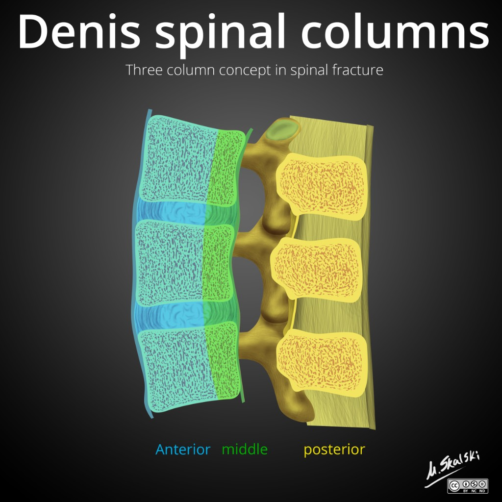
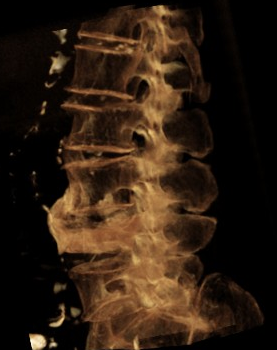
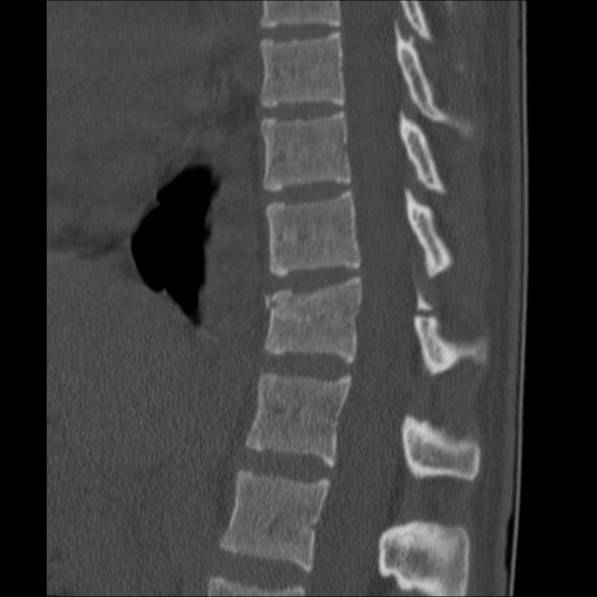
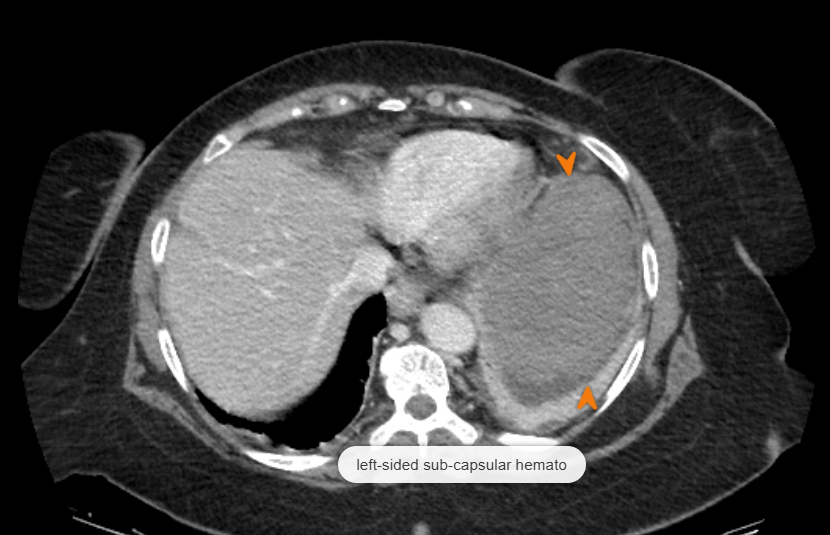

  
Клинический справочный материал

  
Высокоэнергетическая травма

  
Механизм как диагностический инструмент, осмотр по ITLS, переломы позвоночника, таза и рёбер, скрытые кровотечения, конфликты приоритетов

  

  
Повреждения предсказуемы по физике удара раньше, чем по жалобам.

  
Осмотр по ITLS, трёхколонная модель стабильности позвоночника, механика тазового кольца, лёгкая черепно-мозговая травма под маской «ясного сознания», damage control resuscitation.

  
Серия «Крещение поворотом» · версия 1.5 · 19 августа 2026 · CC BY-NC-SA 4.0

# Клинический случай

## Слово бригаде

"Ночной вызов, ДТП. Служебный автомобиль на скорости перевернулся на крышу. Трое пострадавших, мы забираем самого тяжелого, это пассажир, мужчина, 21 год, крупного телосложения. Лежит на асфальте рядом с машиной, не шевелится, лицо и руки в крови, но активного кровотечения нет. Жалуется на боль в спине. Сознание ясное. Говорит, дышит. Грудная клетка стабильна, экскурсия равномерная, трахея по средней линии. САД 135. Пульсы определяются, наполнение хорошее. Таз стабилен при компрессии. Конечности по оси, без деформаций. SpO₂ 99 %. Фиксируя шею, втроем перекладываем его на щит. Пальпация грудного отдела: на уровне Th IX–X — выраженный отёк, резкая боль при надавливании, крепитация. Паравертебрально — отёк и болезненность. Рёбра: при пальпации сзади — боль в проекции седьмого–восьмого слева. Множественные ссадины от стёкол, мелкие, полсантиметра–сантиметр. Чувствительность верхних и нижних конечностей не нарушена. Движения в полном объеме, но силу оценить трудно из-за боли. В дороге вводим фентанил: 2 ампулы (100 мкг) развели в двадцатке — вводим по 2 кубика, дробно, с оценкой эффекта. Боль по ВАШ с семи упала до нуля. Паренек начал немного загружаться, в стационаре ему и вовсе стало весело. АД: монитором не смогли измерить — форма с закатанным рукавом мешала, резать пожалели. Промеряли ручной манжеткой — 120 мм рт. ст. ЧДД 18 в минуту. Ссадины обработали хлоргексидином, стекла не вынимала, где глубоко. Транспортировку перенес удовлетворительно".

Разбор случая, данные карты вызова и исход приведены в конце материала.

# Вопросы для размышления

Ответы — в конце материала.

1. Опрокидывание автомобиля на скорости, пассажир на заднем сидении со стороны удара. Какие повреждения предсказуемы по одному описанию механизма — до того, как пациент осмотрен?
2. Сознание ясное, ШКГ 15, речь внятная. Какие данные анамнеза и осмотра тем не менее означают, что черепно-мозговая травма у этого пациента есть, — и что именно нужно измерять и записывать по дороге, чтобы не пропустить её ухудшение?
3. Выраженный отёк, резкая болезненность и крепитация на уровне Th IX–X: о переломе какого характера идёт речь и можно ли на месте отличить стабильный перелом от нестабильного?
4. Чувствительность и движения в конечностях сохранены. Означает ли это, что спинной мозг вне опасности и иммобилизация избыточна?
5. С повреждением каких органов ассоциированы переломы нижних рёбер слева и справа — и почему у этого пациента ответ на вопрос давал не осмотр, а ультразвук приёмного отделения?
6. Фентанил разведён до 5 мкг/мл и вводится шагами по 10 мкг. Что делает эту схему безопасной при стабильной гемодинамике и что в ней пришлось бы изменить при систолическом давлении 80?
7. Пациент «начал загружаться» после фентанила. Как на догоспитальном этапе разделить опиоидную седацию и нарастание черепно-мозговой травмы — у пациента, у которого есть и опиоид, и травма головы?
8. Что изменилось бы в объёме помощи и маршрутизации, если бы таз при однократной компрессии оказался нестабильным? Если бы SpO₂ было 91 % с ослаблением дыхания слева?
9. eFAST в приёмном отделении — без свободной жидкости. Какие повреждения живота при этом остаются неисключёнными?

# Механизм как диагностический инструмент

## Почему травма начинается с физики

Кинетическая энергия тела равна ½mv² и растёт пропорционально квадрату скорости: удвоение скорости увеличивает энергию вчетверо. Автомобиль массой полторы тонны на 60 км/ч несёт около 210 кДж; для сравнения, пуля пистолетного калибра — около 0,5 кДж. Когда движение прекращается за доли секунды, вся эта энергия рассеивается — в деформацию металла и в ткани людей, находящихся внутри. Чем короче фаза торможения, тем выше пиковое усилие на единицу площади ткани: мягкая сминаемая зона кузова и ремень безопасности спасают не тем, что уменьшают энергию, а тем, что растягивают её рассеивание во времени.

В любом дорожно-транспортном происшествии происходят три последовательных столкновения. Первое — транспортного средства с препятствием. Второе — тела с элементами салона или с дорогой. Третье — внутренних органов со скелетом и собственными связками: мозг догоняет остановившийся череп, аорта продолжает движение относительно фиксированной точки, селезёнка бьётся о рёберный каркас. Третье столкновение невидимо при осмотре, и именно оно определяет летальность: разрыв аорты происходит в области перешейка потому, что дуга с сердцем подвижна, а нисходящая часть пришита к позвоночнику артериальной связкой — конструкция ломается в точке концентрации напряжения.

Из этого следует главный практический принцип: **механизм предсказывает повреждения раньше и надёжнее, чем жалобы.** Пациент предъявляет боль там, где болит сильнее всего; физика удара знает и те повреждения, которые пока молчат — компенсированное кровотечение, ушиб лёгкого до развития гипоксии, нестабильный перелом позвоночника при сохранной неврологии.

## Опрокидывание: особый случай

Большинство типов удара имеют предсказуемый вектор: фронтальный — торможение спереди назад, боковой — сбоку. Опрокидывание — исключение: тело внутри переворачивающегося салона подвергается многовекторным ускорениям, последовательность и направление которых восстановить невозможно. Стандартные таблицы «тип удара → зона повреждения» для опрокидывания дают единственный честный ответ: возможно всё.

Два обстоятельства при опрокидывании работают особенно жёстко. Первое — вертикальная осевая нагрузка: крыша деформируется внутрь либо тело при перевороте падает на неё, и позвоночник нагружается вдоль оси — механизм компрессионных и взрывных переломов. Второе — непристёгнутый пассажир при опрокидывании превращается в свободное тело внутри вращающегося объёма, а частичный или полный выброс из салона увеличивает летальность на порядок. Пассажир, оказавшийся после переворота на асфальте рядом с машиной, — это либо выброс, либо самостоятельное выползание; различие принципиально, и его стоит выяснить у очевидцев, потому что выброшенное тело получило дополнительное, никем не наблюдавшееся столкновение с дорогой.

Для пассажира на стороне удара к этому добавляется боковой компонент первичного столкновения: дверь и стойка вминаются в человека без сминаемой зоны — боковой удар при равной скорости тяжелее фронтального именно из-за отсутствия буфера.

## Паттерны повреждений по типу удара

| Тип удара | Голова и шея | Грудь | Живот | Таз и конечности | Позвоночник |
|---|---|---|---|---|---|
| Фронтальный | Лобная кость, шейный отдел (гиперфлексия) | Грудина, ушиб сердца, аорта | Печень, селезёнка (о позвоночник) | Задний вывих бедра (удар коленом о панель), надколенник | Поясничный; Chance от ремня |
| Боковой | Височная кость, шейный отдел (боковой наклон) | Рёбра на стороне удара, пневмоторакс, аорта | Селезёнка (удар слева), печень (удар справа) | Перелом таза (боковая компрессия) | Грудной |
| Задний | Хлыстовая травма (гиперэкстензия) | Редко | Редко | Редко | Шейный |
| Опрокидывание | Любые | Любые | Любые | Любые | Любые; осевая нагрузка → компрессионные и взрывные |

Пешеход даёт классическую триаду Уодделла: перелом голени от бампера, травма таза и живота о капот, черепно-мозговая травма при падении с капота. Падение с высоты передаёт осевую нагрузку по цепочке: пяточные кости → грудопоясничный переход → основание черепа; у взрослых порогом высокоэнергетической травмы считается высота более трёх метров.

## Формальные критерии высокоэнергетической травмы

Механизм квалифицируется как высокоэнергетический при любом из следующих: скорость более 60 км/ч при фронтальном ударе или более 30 км/ч при боковом; деформация кузова более 30 см спереди или 40 см сбоку; **опрокидывание**; выброс из транспортного средства; гибель другого человека в том же автомобиле; мотоцикл или велосипед на скорости более 30 км/ч; наезд на пешехода более 30 км/ч; падение с высоты более 3 метров у взрослых и более 1,5 метров у детей; перелом первого–второго ребра или грудины — эти кости защищены ключицей и мышечным массивом, и их перелом сам по себе свидетельствует о величине приложенной силы.

Следствие для осмотра: высокоэнергетический механизм требует полного обследования с головы до пят вне зависимости от того, как пациент выглядит. Молодой человек компенсирует потерю до 30 % объёма циркулирующей крови без падения систолического давления; «стабильная гемодинамика» на месте происшествия — это фотография одного момента компенсации, а не гарантия её продолжения.

# Первичный осмотр по ITLS

## Логика протокола

International Trauma Life Support построен вокруг одного управленческого решения: сколько времени пациенту можно позволить провести на месте происшествия. Ответ определяется до начала детального осмотра, а не в его процессе, — этим ITLS отличается от универсального ABCDE, где последовательность одна для всех.

Последовательность ITLS: оценка сцены (безопасность, механизм, число пострадавших, потребность в дополнительных бригадах) → первичная оценка (общее впечатление, сознание по AVPU, дыхательные пути, дыхание, кровообращение и крупное кровотечение) → решение о категории пациента → осмотр соответствующего объёма → повторные оценки в пути.

Категория определяет объём. Критический пациент — угроза дыхательным путям, неадекватное дыхание, признаки шока, ШКГ ≤ 12 — получает на месте только то, что физически невозможно выполнить в движущемся автомобиле: обеспечение проходимости дыхательных путей, декомпрессию напряжённого пневмоторакса, остановку наружного кровотечения, окклюзионную повязку, тазовый бандаж и иммобилизацию. Всё остальное — доступ, инфузия, анальгезия, мониторинг — делается в пути. Ориентир ITLS — не более десяти минут на месте для нестабильного пациента.

Стабильный пациент с высокоэнергетическим механизмом проходит Rapid Trauma Survey — быстрый осмотр с головы до пят: голова, шея (с последующей фиксацией воротником), грудная клетка (осмотр, пальпация, аускультация, перкуссия), живот, таз (однократная компрессия), конечности с дистальным пульсом, спина при перекладывании. Стабильный пациент с низкоэнергетическим изолированным механизмом — Focused Exam, осмотр только зоны повреждения. Выбор между этими двумя объёмами делает механизм, а не самочувствие пациента: именно поэтому пассажир перевернувшейся машины осматривается целиком, даже если жалуется только на спину.

## Соотношение с российским стандартом

Приказ ДЗМ № 535 от 18.05.2023 использует ABCDE-подход без формального деления на Rapid Trauma Survey и Focused Exam и не нормирует время на месте числом. По объёму вмешательств протоколы совпадают. Содержательные различия два. Первое — шейная иммобилизация: Приказ сохраняет её для всех пациентов с высокоэнергетическим механизмом, тогда как ITLS последних редакций допускает отказ от неё по критериям NEXUS (нет боли по средней линии шеи, нет очагового дефицита, ясное сознание, нет интоксикации, нет отвлекающей травмы). Второе — точка игольной декомпрессии пневмоторакса: Приказ указывает II межреберье по среднеключичной линии; ATLS десятой редакции допускает IV–V межреберье по передней подмышечной линии, где грудная стенка тоньше и процент неудач у крупных пациентов ниже.

# Лёгкая черепно-мозговая травма под маской ясного сознания

## Почему ШКГ 15 не означает «головой не ударялся»

Пятнадцать баллов по шкале комы Глазго описывают состояние сознания в момент осмотра — и ничего не говорят о том, что происходило с мозгом в момент удара. Диагноз сотрясения головного мозга ставится не по угнетению сознания, а по факту травматического воздействия с транзиторной мозговой дисфункцией, и главный её маркер, доступный на месте, — **амнезия события**. Пациент, который не помнит сам момент аварии, имел эпизод нарушенного сознания — независимо от того, что сейчас он ориентирован и внятен. Формулировка «сознание не терял» со слов пациента при этом ничего не стоит: человек, терявший сознание, этого промежутка не помнит по определению.

К амнезии присоединяются вестибулярные и вегетативные признаки: головокружение, тошнота, рвота, горизонтальный нистагм. Мелкоразмашистый горизонтальный нистагм при взгляде в стороны встречается и у здоровых как установочный, но в сочетании с головокружением, тошнотой и следом удара на голове читается как часть той же картины. След удара — гематома, ссадина на голове — завершает триаду: есть точка приложения силы, есть амнезия, есть вестибулярная симптоматика.

Практическое значение: пациент с сотрясением и ШКГ 15 не нуждается в специфической догоспитальной терапии, но нуждается в двух вещах — в наблюдении за динамикой сознания в пути и в госпитализации с визуализацией. Смысл наблюдения — эпидуральная гематома со светлым промежутком: классическое течение включает возвращение полного сознания между моментом травмы и повторным угнетением, и пациент, «загрузившийся» через сорок минут после аварии, — это повод пересчитать ШКГ по компонентам, а не списать на усталость.

## Западные правила отбора на томографию

На Западе существуют валидированные правила, отвечающие на вопрос, кому при лёгкой травме головы нужна компьютерная томография. У взрослых это **Canadian CT Head Rule** (Stiell et al., 2001): томография показана при ШКГ ниже 15 через два часа, подозрении на перелом черепа или основания черепа, двух и более эпизодах рвоты, возрасте 65 лет и старше, ретроградной амнезии от 30 минут и при опасном механизме. У детей действуют критерии **PECARN** (Kuppermann et al., 2009), где вместо возраста учитываются состояние по возрастной шкале, гематома скальпа определённой локализации и характер поведения ребёнка по оценке родителей.

Для линии важна не сама сортировка — решение о визуализации принимается в стационаре, а приказ ДЗМ № 535 критериями отбора не оперирует и ведёт черепно-мозговую травму одним алгоритмом. Важно то, что оба правила перечисляют обстоятельства, при которых травма головы не считается пустяком даже при ясном сознании. Механизм, факт и длительность амнезии, число эпизодов рвоты и динамику ШКГ по времени бригада передаёт в приёмное отделение — именно из этих сведений там и складывается решение.

## Опиоид и оценка сознания

Обезболивание опиоидом у пациента с черепно-мозговой травмой создаёт диагностическую ловушку: седация и эйфория от фентанила по внешней картине неотличимы от начального угнетения сознания мозгового происхождения. Разделяют их тремя инструментами. Первый — зрачки: опиоидный миоз симметричен; односторонний расширенный зрачок на фоне «седации» — это не фентанил, это дислокация. Второй — ШКГ по компонентам с фиксацией времени: опиоидная седация после дробного введения малых доз достигает максимума на пике действия и дальше регрессирует, мозговое угнетение прогрессирует. Третий — доза: 100 мкг фентанила, введённые дробно за несколько приёмов взрослому мужчине под 95 кг, дают лёгкую эйфорию, но не должны давать сопор; несоответствие глубины седации введённой дозе трактуется против опиоида. Эйфоричный, весёлый пациент с полными пятнадцатью баллами — картина, совместимая с фентанилом; но сам факт, что этот вопрос приходится задавать, — аргумент фиксировать ШКГ до анальгезии и после, с временными метками.

# Травма позвоночника

## Трёхколонная модель стабильности

Модель Дениса рассматривает позвоночник как конструкцию из трёх продольных несущих колонн. Передняя — передние две трети тела позвонка с диском и передней продольной связкой. Средняя — задняя треть тела с задней продольной связкой. Задняя — дужка, фасеточные суставы, отростки и задний связочный комплекс.

<figure class="kvadrat">
  
  <figcaption>Три колонны в описании Дениса, вид сбоку. Синим (anterior) — передняя колонна: передние две трети тела позвонка и диска вместе с передней продольной связкой. Зелёным (middle) — средняя: задняя треть тела и диска с задней продольной связкой. Жёлтым (posterior) — задняя: дужка, ножки, фасеточные суставы, отростки и задний связочный комплекс. Практический смысл цветов в том, что средняя колонна — это стенка между разрушающимся телом позвонка и содержимым канала, поэтому её вовлечение и переводит перелом в разряд нестабильных. Illustration courtesy of Matt Skalski, Radiopaedia.org, rID: 32621, CC BY-NC-ND.</figcaption>
</figure>

Правило: повреждение одной колонны — перелом, как правило, стабильный; повреждение двух и более — нестабильный. Инженерная суть в резервировании: пока нагрузку держат два из трёх несущих элементов, конструкция сохраняет геометрию. Нестабильный перелом опасен не тем, как выглядит сейчас, а тем, что происходит при движении: смещение фрагментов или ретропульсия отломка в позвоночный канал происходит в момент неконтролируемого сгибания или поворота — например, при перекладывании без щита. Отсюда центральный тезис догоспитальной тактики: **сохранная неврология не доказывает стабильности перелома.** Мозг может быть цел просто потому, что фрагмент ещё не сдвинулся.

На месте происшествия число повреждённых колонн не определяется — это задача компьютерной томографии. Но клинические находки позволяют оценить серьёзность: локальный отёк, резкая болезненность и крепитация над остистыми отростками означают как минимум перелом с подвижностью отломков; пальпируемая «ступенька» между остистыми отростками — признак повреждения заднего комплекса, то есть уже второй колонны; любой неврологический дефицит — свидетельство состоявшегося воздействия на мозг или корешки. Любая из этих находок при высокоэнергетическом механизме означает: обращаться с позвоночником как с нестабильным до опровержения на томографии.

## Уровни, типы, уязвимые зоны

Около 60 % переломов позвоночника приходится на грудопоясничный переход Th11–L2. Причина конструктивная: грудной отдел жёстко фиксирован рёберным каркасом, поясничный подвижен, и на границе жёсткого и подвижного сегментов концентрируется напряжение — та же точка, в которой ломается любая балка с переменной жёсткостью. Переломы средне-грудного отдела (Th5–Th10) вне остеопороза требуют существенно большей энергии — рёберный каркас принимает часть нагрузки на себя, — поэтому перелом этой зоны у молодого человека сам по себе маркер силы удара и повод искать сопутствующие повреждения грудной клетки.

Основные типы: компрессионный перелом (клиновидное сминание передней колонны при сгибании — обычно стабильный); взрывной, burst (осевая нагрузка разрушает тело целиком, фрагменты расходятся во все стороны, включая канал; средняя колонна страдает всегда — нестабилен по определению); сгибательно-дистракционный, Chance (горизонтальный разрыв всех трёх колонн при сгибании вокруг фиксированной оси — классически вокруг поясного ремня; в половине описанных случаев сопровождается повреждением тонкой кишки); переломо-вывих (все три колонны со смещением; почти всегда с повреждением мозга).

<figure>
  
  <figcaption>Взрывной перелом L4, объёмная реконструкция компьютерной томографии, вид сбоку. Тело позвонка разрушено, высота потеряна, задний контур тела прерван — то есть повреждена и средняя колонна. Само сужение канала ретропульсированным фрагментом на объёмной реконструкции не измеряется: его оценивают на аксиальных и сагиттальных срезах, а реконструкция нужна, чтобы увидеть геометрию разрушения целиком. Снимок из другого клинического наблюдения. Case courtesy of Sajoscha A. Sorrentino, Radiopaedia.org, rID: 15492, CC BY-NC-SA 3.0.</figcaption>
</figure>

<figure class="kvadrat">
  
  <figcaption>Перелом Чанса, компьютерная томография, сагиттальная реконструкция. В исходном описании случая: горизонтальный перелом проходит через остистый отросток и ножки, к нему добавляется компрессионный перелом тела позвонка — картина, характерная для сгибательно-дистракционно-компрессионного механизма. Разрушены все три колонны, поэтому перелом нестабилен независимо от того, есть ли неврологическая симптоматика. Учебно важна и вторая часть того же наблюдения: на обзорных рентгенограммах находки были минимальны — едва заметная горизонтальная линия просветления через левую ножку и небольшая компрессия тела Th11. Пострадавшая 25 лет, водитель, была в ремне безопасности. Снимок из другого клинического наблюдения. Case courtesy of David Puyó Vera, Radiopaedia.org, rID: 36521, CC BY-NC-SA 3.0.</figcaption>
</figure>

В грудном отделе позвоночный канал узок относительно спинного мозга, а кровоснабжение мозга на этом уровне беднее — потому неврологические последствия смещения здесь тяжелее, чем в поясничном отделе, где ниже L1 лежит уже конский хвост, более устойчивый к сдавлению.

Отдельно стоит держать в голове, что при высокоэнергетическом механизме повреждения позвоночника часто оказываются многоуровневыми, причём второй уровень лежит вне зоны, на которую указывает боль. Пациент показывает на то место, которое болит сильнее всего, а остальные повреждения маскируются этой доминирующей болью — тот же механизм отвлекающей травмы, из-за которого нельзя опираться на жалобы при решении вопроса об иммобилизации. Практический вывод обратный интуитивному: найденное повреждение одного уровня не сужает осмотр, а расширяет его. Пальпация проводится по всей длине позвоночника от затылка до крестца, а не только вокруг болезненной точки, и обнаружение одной находки не завершает осмотр.

Масштаб явления показывает опубликованное наблюдение: у пострадавшей после падения с высоты около шести метров при обследовании обнаружены перелом задней дуги C1, перелом C2 палаческого типа, переломовывих C3/C4 с двусторонним замком фасеточных суставов, разрыв жёлтой связки на уровне C7–Th1, компрессионные переломы верхних замыкательных пластинок нескольких грудных позвонков и сгибательно-дистракционный перелом Th12 типа Чанса — шесть уровней у одного пациента, от затылка до грудопоясничного перехода.

## Неврологическая оценка на месте

Минимальный воспроизводимый объём: движения и сила в четырёх конечностях, чувствительность в четырёх конечностях, при возможности — перианальная чувствительность. Сохранение крестцовых функций при дефиците выше (sacral sparing) — признак неполного повреждения с существенно лучшим прогнозом. Оценка силы у пациента с болью имеет известное ограничение: боль ограничивает усилие, и отличить «не может» от «не может из-за боли» на месте удаётся не всегда; тогда фиксируется именно это — «движения в полном объёме, сила достоверно не оценена из-за боли», что для приёмного отделения информативнее прочерка.

## Иммобилизация: щит, воротник, матрас

Шейный воротник ограничивает около половины объёма движений и самостоятельного значения не имеет — он работает только вместе с фиксацией туловища. Спинальный щит — инструмент перекладывания и переноски: жёсткая плоскость, позволяющая переместить пациента без сгибания и ротации позвоночника; перекладывание выполняется координированно, с ручной стабилизацией шеи, минимум втроём. Вакуумный матрас формуется по телу и предпочтителен для длительной транспортировки: равномерно распределяет давление и гасит вибрацию. При коротком плече эвакуации транспортировка на щите допустима; принципиальна не марка носителя, а то, что позвоночник от момента первого контакта до приёмного отделения ни разу не остаётся без контроля.

## Спинальный шок и нейрогенный шок

Термины созвучны, явления разные. Спинальный шок — неврологический феномен: транзиторное выпадение рефлексов и тонуса ниже уровня повреждения, от часов до недель. Нейрогенный шок — гемодинамический: при повреждении выше Th6 прерывается симпатическая иннервация сосудов и сердца, наступает вазодилатация с брадикардией. Опознавательная пара признаков — гипотензия с **тёплой сухой кожей и брадикардией**, тогда как геморрагический шок даёт холодную влажную кожу с тахикардией. У травматического пациента гипотензия трактуется как кровопотеря до исключения всех её источников; нейрогенный шок — диагноз исключения, потому что ошибка в обратную сторону (списать кровотечение на «нейрогенку») стоит жизни.

# Переломы таза

## Тазовое кольцо

Таз — замкнутое кольцо из двух тазовых костей и крестца, соединённых лонным сочленением спереди и крестцово-подвздошными суставами сзади.

Каждая тазовая кость (os coxae) у взрослого — единая кость, но образована сращением трёх: подвздошной (os ilium), седалищной (os ischii) и лонной (os pubis). У ребёнка это действительно три отдельные кости, соединённые хрящом в области впадины тазобедренного сустава; сращение завершается к 14–17 годам, и линия сращения остаётся видимой на снимках. Старое латинское название тазовой кости — os innominatum, «безымянная кость»: имя дано по отсутствию у кости собственной формы-прообраза, в отличие от подвздошной («крыло»), седалищной или лонной, названных по функции и положению. Термин ещё встречается в травматологической литературе и в переводных руководствах, но он относится к целой тазовой кости, а не к её частям — сами части названия имеют, и в описании перелома указывают именно их: ветвь лонной кости, крыло подвздошной, бугристость седалищной.

Кольцевая геометрия диктует правило: кольцо не ломается в одной точке — перелом или разрыв связок спереди означает повреждение и сзади, видимое или нет.

Опасность нестабильного перелома таза — не кость, а сосуды: по внутренней поверхности кольца лежат пресакральное венозное сплетение и ветви внутренних подвздошных артерий. При разрыве кольца его объём увеличивается, естественная тампонада стенками теряется, и забрюшинное пространство способно принять четыре-пять литров крови — не видимых снаружи и не доступных наружной остановке.

## Классификация Young–Burgess и клиническая оценка

Боковая компрессия (LC) сминает кольцо внутрь — переломы ветвей и компрессия крестца, кровотечение обычно умеренное. Переднезадняя компрессия (APC) раскрывает кольцо «книгой» — расхождение лонного сочленения с разрывом крестцово-подвздошных связок; кровотечение массивное. Вертикальный сдвиг (VS) — полное разобщение полутаза со смещением вверх; наихудший гемодинамический прогноз.

Клинические указания: асимметрия и укорочение ноги с ротацией без перелома бедра, кровоподтёки промежности (появляются отсроченно), кровь у наружного отверстия уретры — при ней катетеризация мочевого пузыря противопоказана. Пальпаторная проверка стабильности выполняется **однократно**: мягкая компрессия гребней подвздошных костей к средней линии. Повторные проверки и «раскачивание» таза разрушают формирующиеся тромбы — каждая следующая проверка возобновляет кровотечение, которое предыдущая помогла обнаружить.

## Тазовый бандаж

Смысл — вернуть объём кольца к анатомическому и дать венозному кровотечению шанс на тампонаду. Уровень наложения — **большие вертелы бедренных костей**, не гребни подвздошных: типовая ошибка смещает компрессию туда, где она не закрывает кольцо. Работают и коммерческий бандаж, и простыня, сложенная по длине, проведённая под крестцом и стянутая на уровне вертелов. Показание — подозрение на нестабильный перелом таза у пациента с признаками кровопотери; противопоказаний нет, а промедление измеряется миллилитрами в минуту.

# Травма грудной клетки

## Шесть состояний, убивающих за минуты

Напряжённый пневмоторакс, открытый пневмоторакс, массивный гемоторакс, тампонада сердца, флотирующая грудная клетка, обструкция дыхательных путей — перечень, ради которого грудная клетка в Rapid Trauma Survey осматривается, пальпируется, перкутируется и выслушивается целиком.

Напряжённый пневмоторакс — клапан: воздух входит в плевральную полость на вдохе и не выходит на выдохе. Нарастающее давление коллабирует лёгкое и смещает средостение, перегибая полые вены; венозный возврат падает, и остановка происходит по механизму пустого сердца. Классическая триада — отсутствие дыхания на стороне, набухшие шейные вены, смещение трахеи — на практике поздняя и неполная: у обескровленного пациента вены пусты, а девиация трахеи — предтерминальный признак. Рабочая совокупность для решения: одностороннее ослабление дыхания, тимпанит, подкожная эмфизема, нарастающая гипоксия или гипотензия без ответа на инфузию — на фоне соответствующего механизма. Декомпрессия иглой 14–16G длиной от 5 см (точки — выше, в разделе об ITLS) выполняется по клиническому диагнозу, без рентгена. Отдельное правило связывает пневмоторакс с вентиляцией: положительное давление превращает простой пневмоторакс в напряжённый за десятки секунд, поэтому осмотр грудной клетки предшествует началу ИВЛ, а подозрение на пневмоторакс требует декомпрессии до первого аппаратного вдоха.

Тампонада сердца узнаётся по триаде Бека (гипотензия, набухшие вены, глухие тоны) с оговоркой: перикард нерастяжим, критичен темп накопления, а не объём — 150–200 мл при быстром поступлении достаточно. Догоспитальная помощь сводится к объёмной поддержке преднагрузки и максимально быстрой доставке туда, где дренируют.

## Переломы рёбер: где искать продолжение

Само по себе сломанное ребро — травма скелета; клиническое значение определяется тем, что лежит под ним. Верхние рёбра (I–II) защищены ключицей и мышцами плечевого пояса — их перелом означает удар такой силы, что обязателен поиск повреждения аорты и крупных сосудов средостения. Средние рёбра прикрывают лёгкие: здесь переломы дают пневмо- и гемоторакс, ушиб лёгкого. Нижние рёбра (VII–XII) — это крыша живота: **справа под ними печень, слева — селезёнка**, сзади с обеих сторон — почки. Перелом нижних рёбер с крепитацией и локальным отёком — прямое показание держать в поле зрения соответствующий орган, и ответ на этот вопрос даёт не пальпация живота, а ультразвук: субкапсулярное повреждение селезёнки при спокойном животе — классика двухмоментного разрыва, манифестирующего через сутки-двое.

Флотирующий сегмент (три и более ребра, сломанные в двух местах каждое) дышит в противофазе; гипоксию при нём определяет не парадоксальное движение само по себе, а ушиб лёгкого под сегментом. У пожилых каждое дополнительное сломанное ребро прибавляет летальности: боль → щажение → гиповентиляция → ателектаз → пневмония. Отсюда запрет на круговое бинтование грудной клетки, которое эту цепочку запускает искусственно, и требование адекватной анальгезии как противопневмонической меры.

# Травма живота

Живот — зона наибольшей диагностической неопределённости догоспитального этапа. Пальпация на месте происшествия неинформативна у трети-четверти пациентов: дефанс отсутствует при шоке и при сочетанной черепно-мозговой травме, притупление требует более полулитра свободной жидкости, а субкапсулярные повреждения паренхиматозных органов вообще не дают ранней симптоматики. Поэтому при высокоэнергетическом механизме травма живота предполагается по механизму, а не по находкам, и вопрос закрывается в стационаре.

Разделение по опасности: паренхиматозные органы (селезёнка, печень, почки) кровоточат — счёт на минуты и часы; полые (кишечник, мочевой пузырь) дают перитонит — счёт на часы и сутки. Поперечный кровоподтёк от ремня безопасности на брюшной стенке (seat-belt sign) ассоциирован с повреждением тонкой кишки, брыжейки и переломом Chance.

eFAST — ультразвуковой поиск свободной жидкости в шести точках (карман Моррисона, спленоренальное пространство, малый таз, перикард, обе плевральные полости). Метод быстр и специфичен, но его отрицательный результат исключает меньше, чем кажется: он не видит забрюшинного пространства, нечувствителен к объёмам менее ~200 мл, не выявляет повреждений полых органов и субкапсулярных гематом без разрыва капсулы. Отрицательный eFAST у стабильного пациента — аргумент за наблюдение с повторным исследованием или томографией, а не за исключение травмы живота.

Механизм этой слепоты стоит представлять зрительно. Пока капсула селезёнки цела, кровь остаётся внутри неё и в брюшную полость не выходит — искать нечего, свободной жидкости нет ни в спленоренальном пространстве, ни в малом тазу. Отличительный признак такой гематомы на томограмме — то, что она **вдавливает и уплощает контур подлежащей паренхимы**; свободная кровь, уже вышедшая за пределы капсулы, обтекает селезёнку и такого эффекта не даёт.

<figure>
  
  <figcaption>Субкапсулярная гематома селезёнки, компьютерная томография с контрастированием, аксиальный срез на уровне верхнего этажа брюшной полости. Ориентировка в кадре зеркальна: печень занимает левую половину изображения, то есть правую половину тела, селезёнка — правую. Стрелками отмечена обширная гематома вдоль латерального края селезёнки; в исходном описании случая — масс-эффект со сдавлением селезёнки, вдавлением её контура, смещением органа к средней линии и смещением левой почки вниз. Плотность гематомы смешанная, преимущественно ниже плотности паренхимы, с линейными более плотными полосами — кровь разного срока давности. Учебно важно, что граница между гематомой и паренхимой различима именно за счёт вдавленного контура: свежая кровь по плотности близка к селезёнке, поэтому исследование выполняется с контрастированием в портальную фазу. Наблюдение нетравматическое (боль в левом подреберье у пациентки 70 лет; субкапсулярная гематома возникает при травме, панкреатите и на фоне антикоагулянтов), но признак от причины не зависит. Снимок из другого клинического наблюдения. Case courtesy of Manar Alaa El Din Osman, Radiopaedia.org, rID: 182172, CC BY-NC-SA 3.0.</figcaption>
</figure>

# Геморрагический шок и damage control

## Где прячется кровь

Значимая кровопотеря при тупой травме размещается в пяти пространствах: плевральные полости (до трёх литров каждая), брюшная полость, забрюшинное пространство при переломе таза (четыре-пять литров), мягкие ткани бедра при переломе диафиза (до полутора литров), и «на асфальте» — наружная потеря, оценённая по обстановке. Череп взрослого в этом списке отсутствует: внутричерепное кровоизлияние убивает дислокацией, а не гиповолемией.

## Классы кровопотери

Классификация ATLS делит кровопотерю на четыре класса. Она нужна не для протокольного решения — по ней ничего не назначается, — а как язык описания состояния и как шкала, по которой видно, какие признаки появляются раньше, а какие уже поздние. Проценты в первой строке — доля потерянного объёма циркулирующей крови (ОЦК), у взрослого он составляет примерно 70 мл/кг; шоковый индекс в предпоследней строке — частота сердечных сокращений, поделённая на систолическое давление.

| Параметр | Класс I | Класс II | Класс III | Класс IV |
|---|---|---|---|---|
| Потеря, % ОЦК | до 15 % | 15–30 % | 31–40 % | более 40 % |
| Потеря, мл (70 кг) | до 750 | 750–1500 | 1500–2000 | более 2000 |
| ЧСС, в минуту | до 100 | 100–120 | 120–140 | более 140 |
| Систолическое АД | норма | норма | снижено | резко снижено |
| Пульсовое АД | норма | **сужено** | сужено | сужено |
| ЧДД, в минуту | 14–20 | 20–30 | 30–40 | более 35 |
| Диурез, мл/ч | более 30 | 20–30 | 5–15 | практически нет |
| Дефицит оснований | 0…−2 | −2…−6 | −6…−10 | ниже −10 |
| Сознание | ясное | тревожность | спутанность | заторможенность, кома |
| Шоковый индекс | 0,5–0,7 | 0,8–1,0 | 1,0–1,5 | выше 1,5 |
| Компоненты крови | не нужны | вероятны | нужны | протокол массивной трансфузии |

Главный вывод читается по строке систолического давления: оно падает только к третьему классу, то есть **после потери примерно трети объёма циркулирующей крови**. До этого момента нормальные цифры давления не означают отсутствия кровотечения — они означают, что компенсация работает. Раньше давления сужается пульсовое давление (расчёт простой: систолическое минус диастолическое, норма около 40 мм рт. ст.), потому что вазоконстрикция поднимает диастолическое при неизменном или снижающемся систолическом. Второй ранний признак — не гемодинамический, а поведенческий: тревожность, суетливость, требование пить. У молодых компенсация особенно упорна, и переход от «стабильного» пациента к четвёртому классу происходит без промежуточной картины.

Ограничения классификации существенны, и её авторы их не скрывают. У пожилых на бета-адреноблокаторах тахикардии не будет, а «нормальные» 120 мм рт. ст. у нелеченого гипертоника — это уже глубокая гипотензия относительно его привычного давления. При беременности объём циркулирующей крови увеличен на треть, и признаки появляются позже — за счёт кровотока плаценты. При повреждении спинного мозга выше Th6 вместо тахикардии возможна брадикардия. Гипотермия, боль, алкоголь и черепно-мозговая травма искажают и частоту, и сознание. Наконец, проверка классификации на данных регистра травмы Англии и Уэльса (Guly et al., 2010) показала, что описанные в таблице сочетания встречаются далеко не всегда: у пострадавших с частотой выше 140 в минуту медиана частоты дыхания составила лишь 24, а медиана систолического давления — 130 мм рт. ст. То есть таблица переоценивает степень гипотензии и тахипноэ, которыми сопровождается тахикардия, и признаки одного класса приходят к конкретному пациенту не комплектом. Практический вывод: класс ставится по совокупности и по динамике, а не по одному параметру, и любое несоответствие трактуется в сторону большей кровопотери. Шоковый индекс удобен как быстрая оценка того же, но у пациента с кардиостимулятором или на бета-блокаторах он не работает — частота фиксирована.

**Расхождение с российской практикой отмечается явно.** Приказ ДЗМ № 535 классами ATLS не оперирует. Догоспитальные решения при геморрагическом и травматическом шоке привязаны к систолическому давлению (внутренние стр. 15–16): транексамовая кислота 1000 мг внутривенно медленно и только тёплые растворы; при систолическом выше 80 мм рт. ст. — сбалансированный кристаллоид или натрия хлорид 0,9 % 500 мл капельно, не допуская подъёма выше 90 мм рт. ст.; при систолическом ниже 80 — 1000 мл струйно, а при сохраняющейся гипотензии второй катетер и вазопрессор (норэпинефрин 0,5–5 мкг/кг/мин в разведении декстрозы 5 %, либо допамин 5–10 мкг/кг/мин при брадикардии), далее ГЭК 6 % 500 мл. Для пациента с тяжёлой черепно-мозговой травмой порог другой — целевое систолическое выше 100 мм рт. ст. Таким образом классификация ATLS остаётся инструментом описания и передачи в стационар, а не выбора объёма инфузии на линии.

## Летальная триада и принципы damage control

Гипотермия ниже 35 °C выключает ферментные каскады свёртывания; коагулопатия усиливает кровотечение; кровотечение углубляет гипоперфузию и ацидоз; ацидоз довершает отказ гемостаза. Круг замыкается и раскручивается сам — разорвать его может только хирургическая остановка кровотечения, а догоспитальная задача формулируется скромно и точно: не ускорять.

Отсюда принципы damage control resuscitation: пермиссивная гипотензия (целевое систолическое 80–90 мм рт. ст. — выше тромбы срывает), ограничение кристаллоидов (до литра; каждый следующий литр разводит факторы свёртывания и охлаждает), транексамовая кислота в первые три часа (CRASH-2: снижение смертности от кровотечения при раннем введении и вред при позднем; по Приказу 535 — 1000 мг внутривенно за 10 минут), тёплые растворы и укрывание, ранняя эвакуация туда, где в наличии есть компоненты крови и операционная. Исключение из пермиссивной гипотензии — тяжёлая черепно-мозговая травма: при ШКГ ≤ 8 целевое систолическое давление выше 100 мм рт. ст., потому что гипотензия при тяжёлой ЧМТ удваивает летальность; конфликт целей решается вазопрессором и остановкой кровотечения, а не литрами кристаллоидов.

# Обезболивание при травме

Лестница Приказа 535: до 3 баллов — кеторолак 30 мг или метамизол 1000 мг внутривенно; 4–6 — трамадол 100 мг; от 7 — фентанил 0,05–0,1 мг внутривенно; при недостаточности — кетамин 0,5–2 мг/кг.

Фентанил при травме предпочтителен по своей фармакодинамике: в отличие от морфина он не высвобождает гистамин и не даёт вазодилатации, поэтому в терапевтических дозах у нормоволемичного пациента на давление не влияет. Стандартное разведение — 100 мкг на 20 мл изотонического раствора, 5 мкг/мл: шаг введения в 1–2 мл (5–10 мкг) позволяет титровать до эффекта с оценкой после каждого шага. При стабильной гемодинамике такая схема практически не имеет цены ошибки. При гиповолемии картина иная: симпатическая активация — часть компенсации, и опиоид, снимая боль и тонус, способен обрушить давление; тогда шаг остаётся малым, между шагами контролируется АД, параллельно идёт инфузия, а целевым становится не ноль по ВАШ, а переносимость транспортировки.

Кетамин при черепно-мозговой травме — точка расхождения источников: Приказ 535 его при травме головного мозга исключает; международные данные последнего десятилетия повышения внутричерепного давления при адекватной вентиляции не подтверждают и рассматривают кетамин как препарат выбора при шоке с ЧМТ. Расхождение фиксируется как есть; на московской линии действует Приказ.

Анальгезия при подозрении на травму живота боли «не смазывает» в клинически значимом смысле — это положение прошлого века; недообезболенный пациент с дефансом от боли информативен для хирурга ещё меньше.

# Травматическая остановка сердечной деятельности

При нетравматической остановке проблема в сердце, и его перезапускают компрессиями и разрядом. При травматической сердце, как правило, структурно цело — ему нечем наполниться (гиповолемия) или его сдавили снаружи (напряжённый пневмоторакс, тампонада). Компрессии пустого сердца — работа насоса без жидкости, поэтому порядок действий инвертирован: сначала устранение обратимых причин, затем стандартный алгоритм. Приоритет по ERC 2021: дыхательные пути и вентиляция кислородом → билатеральная декомпрессия грудной клетки (сторона неизвестна — декомпрессируются обе) → массивная инфузия через два широких катетера → тазовый бандаж → и лишь на этом фоне компрессии и адреналин. Реанимация не начинается при повреждениях, несовместимых с жизнью, и при документированной асистолии более пятнадцати минут без СЛР; выживаемость при тупой травме с догоспитальной остановкой — менее 2 %.

# Возвращение к клиническому случаю

## Что предсказывал механизм

Опрокидывание на скорости — формальный критерий высокоэнергетической травмы, и не один: к нему добавляются трое пострадавших в одной машине и положение пациента вне салона. По физике переворота ожидаемы: осевая нагрузка на позвоночник (подтвердилась — Th IX–X с крепитацией), удары о конструкции салона (подтвердились — перелом ребра, гематома лба, множественные ссадины), черепно-мозговая травма (подтвердилась — об этом ниже), и весь спектр скрытых кровотечений, который на месте не подтверждается и не исключается, а закрывается в стационаре ультразвуком и томографией.

Перелом в зоне Th IX–X у двадцатиоднолетнего — находка, которая сама говорит о величине энергии: среднегрудной отдел армирован рёберным каркасом, и для его перелома у молодого человека нужна сила, при которой сопутствующие повреждения груди и живота вероятны априори. Сочетание с переломом ребра эту логику подтверждает.

## Данные карты вызова

Карта дополняет рассказ бригады в трёх пунктах, и все три существенны.

Первый — черепно-мозговая травма. В жалобах: несистемное головокружение, тошнота. В анамнезе: **сам момент аварии не помнит**. В статусе: гематома лба слева, горизонтальный мелкоразмашистый нистагм при живой симметричной фотореакции, без очаговой и менингеальной симптоматики, координаторные пробы без промахивания. Три независимых блока — след удара, амнезия события, вестибулярная симптоматика — складываются в сотрясение головного мозга при полных пятнадцати баллах по ШКГ. Это тот самый случай из теоретического раздела: ШКГ 15 не означает «головой не ударялся», а амнезия момента травмы — эквивалент эпизода нарушенного сознания.

Второй — локализация перелома ребра. Локальный статус карты: на грудной клетке **слева в проекции VII ребра по передне-подмышечной линии** — отёк, резкая болезненность, крепитация; жалобы включают боль в левой половине грудной клетки. Нижние левые рёбра — анатомическая крыша селезёнки, и вопрос о её повреждении здесь не риторический: именно его закрывал eFAST приёмного отделения, и именно поэтому отрицательный результат ультразвука у этого пациента не финал, а первый пункт наблюдения (субкапсулярная гематома селезёнки в первые часы ультразвуком не видна).

Третий — динамика в цифрах. Серия измерений: на осмотре АД 130/80, ЧСС 90, ЧДД 18, SpO₂ 99 %, ВАШ 7; после фентанила — 130/80, ЧСС 82, ЧДД 16, ВАШ 0; в транспортировке — 130/80, ЧСС 88; в приёмном — 130/80, ЧСС 84. Давление стабильно на всех четырёх точках; урежение пульса с 90 до 82 синхронно с обезболиванием — тахикардия была болевой; болевой синдром не рецидивировал. Эта серия — то, что отличает «пациент стабилен» как впечатление от «пациент стабилен» как факт.

Зафиксированный объём помощи по карте: катетеризация периферической вены G18 с первой попытки; фентанил 100 мкг в разведении до 20 мл дробно внутривенно; иммобилизация — спинальный щит и воротниковая шина; обработка ссадин хлоргексидином 0,05 % с асептической повязкой; криопакет на область травмы; фиксация ремнями при транспортировке. Диагноз кодирован как травма нескольких областей тела (T06.8).

## Разбор решений бригады

**Быстрый травматологический осмотр целиком, при жалобе только на спину.** Пациент активно предъявлял одну жалобу; осмотрен от трахеи до таза с проверкой пульсов, экскурсии и стабильности. Это выполнение главного правила материала — объём осмотра задаёт механизм, а не жалоба, — и именно оно нашло перелом ребра, о котором пациент не заявлял.

**Таз — однократная компрессия.** Проверен один раз, стабилен, больше не трогали. Ровно так и положено: повторная проверка ничего не добавляет к ответу и разрушает тромбы, если ответ был неверен.

**Иммобилизация до анальгезии, анальгезия в дороге.** Порядок правильный по обеим позициям: перекладывание на щит с ручной фиксацией шеи — то, что нельзя делать в движении; титрование фентанила — то, что нельзя делать на месте в ущерб времени. Распределение задач соответствует логике «на месте — только несовместимое с движением».

**Фентанил: 100 мкг на 20 мл, шагами по 2 мл.** Концентрация 5 мкг/мл, шаг 10 мкг, оценка после каждого шага. При давлении 130/80 и болевой тахикардии это схема с минимальной ценой ошибки, и результат её подтверждает: ВАШ с 7 до 0, пульс с 90 до 82, давление не шелохнулось. Единственное, что делает эту схему уязвимой, — учёт: при дробном введении из одного шприца суммарная введённая доза должна быть зафиксирована точно, потому что следующий этап (стационар) будет рассчитывать свою анальгезию от неё.

**«Паренек начал немного загружаться, в стационаре ему и вовсе стало весело».** У пациента без травмы головы эта фраза — просто описание опиоидной эйфории. У пациента с гематомой лба, амнезией и нистагмом та же фраза обязана вызывать вопрос из теоретического раздела: фентанил или мозг? В данном случае ответ в пользу фентанила даёт совокупность: седация появилась после введения и совпала с пиком действия, характер её эйфорический, а не угнетённый, зрачки симметричны, ШКГ полная, эпизод не прогрессировал. Но сама коллизия — опиоид, маскирующий динамику сознания у пациента с ЧМТ, — здесь присутствовала в полный рост, и на будущих аналогичных вызовах этот вопрос легко разрешим одним приёмом, из области не столько дифдиагностики, сколько дисциплины транспортировки: ШКГ по компонентам с временной меткой до первой дозы и после каждой.

**Измерение давления ручной манжетой.** Осциллометрический монитор отказал по немедицинской причине — одежда, которую пожалели резать. Решение измерить аускультативно ручной манжетой методически безупречно: ручное измерение — референсный метод, а не запасной. Расхождение значений (120 на месте против 130/80 серии в карте) лежит в пределах вариабельности условий измерения и клинического значения не имеет. Ножницы, впрочем, существуют ровно для случаев, когда форма мешает медицине; здесь компромисс сработал, потому что пациент был стабилен, — у нестабильного он был бы неуместен.

**«Стёкла не вынимала, где глубоко».** Верно по правилу инородных тел: глубоко внедрённый осколок может тампонировать повреждённый сосуд, и его извлечение вне операционной способно превратить сухую рану в кровоточащую. Поверхностная обработка с асептической повязкой — достаточный догоспитальный объём.

**Криопакет на область травмы.** Недорогое и недооценённое действие: холод уменьшает отёк и боль в зоне перелома, не конфликтуя ни с одним другим вмешательством.

Претензий к вызову разбор не находит; находит два узла для переноса на будущие смены — фиксация ШКГ по компонентам с временными метками у любого пациента с признаками ЧМТ, получающего опиоид, и настороженность по селезёнке при переломах нижних левых рёбер, не снимаемая однократным отрицательным ультразвуком.

## Исход

В приёмном отделении: гемодинамика стабильна (130/80, ЧСС 84), болевой синдром не рецидивировал. eFAST — свободной жидкости в брюшной полости и плевральных полостях нет. ЭКГ — синусовая аритмия, ЧСС 67, вариант нормы для этого возраста.

На момент выпуска этой версии материала результаты компьютерной томографии и заключительный диагноз стационара не получены. Исход будет добавлен отдельным разделом в следующей версии, с указанием даты — включая случай, если он разойдётся с изложенной здесь рабочей версией. Материал написан так, чтобы его ценность не зависела от финального снимка: разбирается порядок рассуждения при высокоэнергетической травме, а не угадывание диагноза одного пациента.

По догоспитальным данным рабочая формулировка выглядит так: закрытая травма нескольких областей тела — перелом грудного отдела позвоночника на уровне Th IX–X без неврологического дефицита, перелом VII ребра слева, сотрясение головного мозга, множественные ссадины; гемодинамика стабильна на всём протяжении наблюдения.

# Резюме

- Механизм предсказывает повреждения раньше жалоб; опрокидывание — многовекторный удар, при котором ожидаемо всё, и отдельно — осевая нагрузка на позвоночник.
- Объём осмотра задаёт механизм, а не самочувствие: высокоэнергетическая травма — всегда осмотр с головы до пят.
- ШКГ 15 не исключает черепно-мозговой травмы. Амнезия события — эквивалент эпизода нарушенного сознания; след удара + амнезия + вестибулярная симптоматика = сотрясение, требующее наблюдения и визуализации.
- Опиоид у пациента с ЧМТ маскирует динамику сознания; защита — ШКГ по компонентам с временными метками до и после каждой дозы, контроль симметрии зрачков.
- Сохранная неврология не доказывает стабильности перелома позвоночника: мозг цел, пока фрагмент не сдвинулся. Отёк, резкая болезненность и крепитация при высокоэнергетическом механизме — обращение как с нестабильным до КТ.
- Перелом среднегрудного отдела у молодого — маркер большой энергии: каркас рёбер защищает эту зону, и её перелом требует поиска сопутствующих повреждений.
- Нижние рёбра — крыша живота: слева селезёнка, справа печень. Однократный отрицательный eFAST субкапсулярное повреждение не исключает.
- Таз проверяется однократно; нестабильность = бандаж на уровне больших вертелов и пересмотр маршрута.
- Фентанил 5 мкг/мл шагами по 5–10 мкг — титруемая схема с минимальной ценой ошибки при стабильной гемодинамике; при гиповолемии — меньше, медленнее, под контролем давления.
- Догоспитальная задача при кровотечении — не ускорять летальную триаду: пермиссивная гипотензия, ограничение кристаллоидов, ранний транексам, тепло, быстрая эвакуация.

# Ответы на вопросы для размышления

**1.** Опрокидывание — многовекторное воздействие: осевая нагрузка на позвоночник (компрессионные и взрывные переломы, типично — грудопоясничный переход), удары о крышу и стойки (черепно-мозговая травма, переломы рёбер), боковой компонент для пассажира на стороне удара (рёбра, таз, селезёнка или печень по стороне), плюс риск частичного или полного выброса. Положение пациента вне салона после переворота требует уточнить у очевидцев: выброс или выполз сам — выброс добавляет неучтённое столкновение с дорогой. Практический вывод один: полный осмотр с головы до пят, все находки против списка предсказанного.

**2.** Амнезия самого момента аварии (эквивалент эпизода нарушенного сознания — человек, терявший сознание, этот промежуток не помнит), головокружение и тошнота (вегетативно-вестибулярный блок), гематома лба (точка приложения силы), горизонтальный нистагм. Совокупность — сотрясение головного мозга при полных пятнадцати баллах. В пути измеряется и записывается следующее: ШКГ по компонентам (глаза, речь, движения) с указанием времени — до анальгезии и после каждой дозы опиоида; размер и симметрия зрачков с фотореакцией; наличие и характер нистагма; число эпизодов рвоты; артериальное давление, частота сердечных сокращений, частота дыхания и SpO₂ на тех же временны́х точках. Смысл записи в том, что ухудшение распознаётся только по сравнению с зафиксированной исходной точкой: «загрузился» без предыдущего значения ШКГ — это впечатление, а «13 баллов в 04:15 против 15 в 03:50» — факт, который приёмное отделение обязано отработать. Любое угнетение сознания трактуется как мозговое до опровержения. Госпитализация с визуализацией обязательна: амнезия события делает правило применимым, а опасный механизм (опрокидывание с положением пациента вне салона) сам по себе является критерием показания к томографии даже при полных пятнадцати баллах.

**3.** Отёк, резкая болезненность и крепитация над Th IX–X означают как минимум перелом с подвижностью фрагментов. Стабильность определяется числом повреждённых колонн по Денису и на месте не устанавливается — это ответ компьютерной томографии. Догоспитальное правило: при высокоэнергетическом механизме и локальных находках перелом ведётся как нестабильный — полная иммобилизация вне зависимости от неврологического статуса. Дополнительный вес находке придаёт уровень: среднегрудной отдел армирован рёберным каркасом, его перелом у молодого человека — маркер большой приложенной энергии.

**4.** Не означает. Сохранная неврология говорит, что спинной мозг не повреждён на момент осмотра, — и ничего не говорит о том, что произойдёт при неконтролируемом движении, если перелом нестабилен: смещение фрагмента или ретропульсия в канал происходят одномоментно, при перекладывании или транспортировке без фиксации. Иммобилизация показана по механизму и локальным находкам, а не по дефициту; дефицит — это уже опоздание.

**5.** Нижние рёбра (VII–XII) прикрывают: слева — селезёнку, справа — печень, сзади с обеих сторон — почки. У этого пациента перелом слева — зона селезёнки. Пальпация живота при субкапсулярном повреждении спокойна, поэтому вопрос закрывал eFAST приёмного отделения; его отрицательный результат снимает свободную жидкость на момент исследования, но не субкапсулярную гематому — отсюда наблюдение и повторное исследование, а не точка.

**6.** Безопасность схемы держится на трёх элементах: малая концентрация (5 мкг/мл — передозировать одним движением поршня трудно), малый шаг (10 мкг при типичной анальгетической дозе 50–100 мкг), оценка эффекта перед каждым следующим шагом. Фентанил не высвобождает гистамин и у нормоволемичного пациента на давление не влияет. При систолическом 80 логика меняется: болевая симпатическая активация — часть компенсации, и её снятие может обрушить давление; шаг сохраняется малым, между шагами контролируется АД, параллельно работает инфузия, цель — не ноль по ВАШ, а переносимость эвакуации.

**7.** Три инструмента. Зрачки: опиоидный миоз симметричен, односторонний мидриаз — дислокация, а не фентанил. Динамика против фармакокинетики: седация от дробных малых доз пикует после введения и регрессирует; мозговое угнетение прогрессирует безотносительно введений. Соответствие дозе: 100 мкг дробно у взрослого крупного мужчины дают эйфорию, но не сопор — глубина седации, необъяснимая дозой, трактуется против опиоида. Организационная защита — ШКГ по компонентам с временной меткой до первой дозы и после каждой: без зафиксированной точки отсчёта динамику не с чем сравнивать.

**8.** Нестабильный таз: бандаж на уровне больших вертелов немедленно, второй венозный доступ крупного калибра, инфузия по принципам damage control, транексамовая кислота 1000 мг за 10 минут, маршрут — травмоцентр с возможностью ангиографической эмболизации, предупреждение стационара. SpO₂ 91 % с ослаблением дыхания слева на фоне перелома ребра — подозрение на пневмоторакс: контроль в динамике, готовность к игольной декомпрессии до начала любой вентиляции с положительным давлением; нарастание гипоксии или гипотензии без ответа на инфузию — декомпрессия по клиническому диагнозу.

**9.** Отрицательный eFAST не исключает: субкапсулярную гематому селезёнки или печени без разрыва капсулы (двухмоментный разрыв, манифестация через 24–72 часа), повреждение полых органов (свободной жидкости в ранние сроки мало, перитонит отсрочен), забрюшинное кровотечение (почки, поджелудочная, таз — зона вне доступа метода), объёмы менее ~200 мл. У пациента с переломом нижних левых рёбер отрицательный eFAST — основание для наблюдения с повторным исследованием или КТ, а не для снятия вопроса.

# Источники

- Алгоритмы оказания скорой и неотложной медицинской помощи. Приказ ДЗМ г. Москвы № 535 от 18.05.2023 — разделы «Общие алгоритмы» и «Травматология».
- Campbell J. E., Alson R. L. International Trauma Life Support for Emergency Care Providers. 9th ed. Pearson, 2020.
- American College of Surgeons Committee on Trauma. Advanced Trauma Life Support. 10th ed. ACS, 2018.
- Lott C. et al. European Resuscitation Council Guidelines 2021: Cardiac arrest in special circumstances. *Resuscitation*, 2021; 161: 152–219.
- CRASH-2 trial collaborators. Effects of tranexamic acid on death, vascular occlusive events, and blood transfusion in trauma patients with significant haemorrhage (CRASH-2): a randomised, placebo-controlled trial. *Lancet*, 2010; 376: 23–32.
- Denis F. The three column spine and its significance in the classification of acute thoracolumbar spinal injuries. *Spine*, 1983; 8(8): 817–831.
- Young J. W., Burgess A. R. et al. Pelvic fractures: value of plain radiography in early assessment and management. *Radiology*, 1986; 160(2): 445–451.
- Stiell I. G. et al. The Canadian CT Head Rule for patients with minor head injury. *Lancet*, 2001; 357: 1391–1396.
- Kuppermann N. et al. Identification of children at very low risk of clinically-important brain injuries after head trauma: a prospective cohort study. *Lancet*, 2009; 374: 1160–1170 — критерии PECARN.
- Brain Trauma Foundation. Guidelines for the Management of Severe Traumatic Brain Injury. 4th ed. 2016.
- Cohen L. et al. The effect of ketamine on intracranial and cerebral perfusion pressure and health outcomes: a systematic review. *Annals of Emergency Medicine*, 2015; 65(1): 43–51.
- Bulger E. M. et al. Rib fractures in the elderly. *Journal of Trauma*, 2000; 48(6): 1040–1046.
- Tintinalli J. E. et al. Tintinalli's Emergency Medicine: A Comprehensive Study Guide. 9th ed. McGraw-Hill, 2020 — разделы по травме.
- Skalski M. Denis three column concept in spinal fracture. Case study, Radiopaedia.org, публикация 05.12.2014, <https://doi.org/10.53347/rID-32621> — источник схемы трёх колонн.
- Gaillard F. Spinal fracture dislocation C3-4. Case study, Radiopaedia.org, публикация 30.01.2009, <https://doi.org/10.53347/rID-5525> — источник наблюдения о шести уровнях повреждения у одного пациента.
- Sorrentino S. A. Burst fracture of L4. Case study, Radiopaedia.org, публикация 21.10.2011, <https://doi.org/10.53347/rID-15492> — источник объёмной реконструкции взрывного перелома.
- Puyó Vera D. Chance fracture. Case study, Radiopaedia.org, публикация 28.04.2015, <https://doi.org/10.53347/rID-36521> — источник томограммы перелома Чанса и данных о скудности рентгенологических находок при нём.
- Osman M. A. E. D. Subcapsular splenic hematoma. Case study, Radiopaedia.org, публикация 13.01.2024, <https://doi.org/10.53347/rID-182172> — источник томограммы субкапсулярной гематомы селезёнки.
- Hassan R., Abd Aziz A., Md Ralib A. R. Computed tomography of blunt spleen injury: a pictorial review. *Malaysian Journal of Medical Sciences*, 2011; 18(1): 60–67 — томографические признаки повреждений селезёнки, в том числе отличие субкапсулярной гематомы от свободной крови в периспленическом пространстве.
- Guly H. R., Bouamra O., Little R. et al. Testing the validity of the ATLS classification of hypovolaemic shock. *Resuscitation*, 2010; 81(9): 1142–1147 — проверка классификации ATLS на данных регистра травмы Англии и Уэльса.

# Источники иллюстраций

| Файл | Что изображено | Источник и лицензия |
|---|---|---|
| `denis_tri_kolonny.png` | Три колонны позвоночника по Денису, схема | Illustration courtesy of Matt Skalski, [Radiopaedia.org](https://radiopaedia.org/), rID: [32621](https://radiopaedia.org/cases/32621). CC BY-NC-ND — используется без изменений |
| `vzryvnoy_perelom_l4_3d_kt.png` | Взрывной перелом L4, объёмная реконструкция КТ | Case courtesy of Sajoscha A. Sorrentino, [Radiopaedia.org](https://radiopaedia.org/), rID: [15492](https://radiopaedia.org/cases/15492). CC BY-NC-SA 3.0 |
| `perelom_chance_kt.png` | Перелом Чанса, КТ, сагиттальная реконструкция | Case courtesy of David Puyó Vera, [Radiopaedia.org](https://radiopaedia.org/), rID: [36521](https://radiopaedia.org/cases/36521). CC BY-NC-SA 3.0 |
| `subkapsulyarnaya_gematoma_selezenki_kt.png` | Субкапсулярная гематома селезёнки, КТ, аксиальный срез | Case courtesy of Manar Alaa El Din Osman, [Radiopaedia.org](https://radiopaedia.org/), rID: [182172](https://radiopaedia.org/cases/182172). CC BY-NC-SA 3.0 |

# Выходные данные

**Материал:** «Высокоэнергетическая травма». Версия 1.5 от 19 августа 2026. Добавлены таблица классов кровопотери по ATLS с разбором её ограничений и томограмма субкапсулярной гематомы селезёнки. В версии 1.4 добавлена томограмма перелома Чанса, раздел о западных правилах отбора на томографию сокращён до справочного упоминания, наблюдение о шести уровнях повреждения перенесено из подписи к снимку в текст. В версии 1.1 уточнена анатомия тазового кольца, добавлены иллюстрации переломов позвоночника и раздел о многоуровневых повреждениях.

**Серия:** «Крещение поворотом» — клинические разборы догоспитальной практики.

**Лицензия:** текст и оригинальные схемы — Creative Commons «С указанием авторства — Некоммерческая — С сохранением условий» 4.0 (CC BY-NC-SA 4.0). Копировать, печатать и раздавать коллегам можно свободно, включая печать для подстанции; продавать — нельзя; при переработке сохраняется та же лицензия и указывается источник.

**Оговорка.** Материал учебный. Он не является нормативным документом, не заменяет действующие протоколы, клинические рекомендации и распоряжения службы и не может использоваться как единственное основание для клинического решения. Дозы, показания и маршрутизацию проверять по первоисточникам, действующим на момент чтения. Ответственность за решения у постели больного несёт медицинский работник, а не автор материала.

**О клиническом случае.** Случай рассказан от лица бригады и обезличен: нет имён, даты вызова, адреса, номера карты вызова, названия стационара и принадлежности транспорта; бытовые детали изменены. Клинические данные и цифры приведены в том виде, в каком они значатся в карте вызова, — иначе разбор терял бы смысл. Совпадения с чужой практикой возможны и неизбежны: такие вызовы происходят ежедневно.

**Нашли ошибку?** Ошибка в дозе, сроке или механизме — не мелочь: материал читают перед сменой. Сообщить можно через раздел Issues репозитория проекта; исправление выходит новой версией, а изменение фиксируется в журнале изменений.
