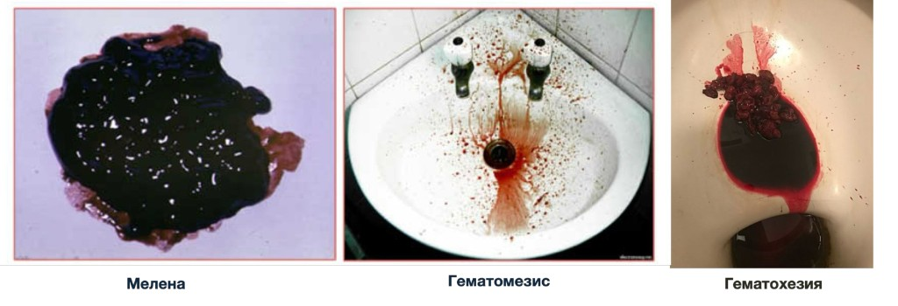
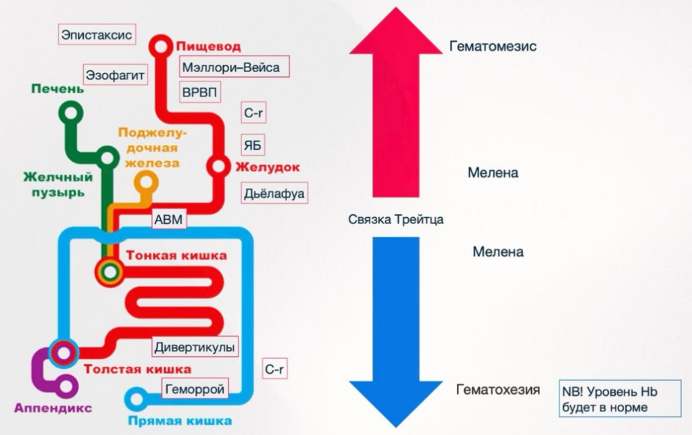
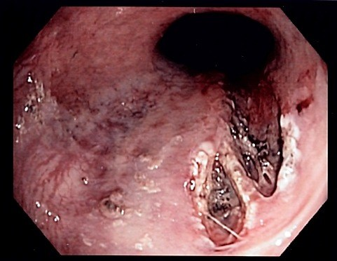

  
Клинический справочный материал

  
Желудочно-кишечные кровотечения

  
Распознавание, оценка кровопотери и дифференциальный диагноз на догоспитальном этапе

  

  
Верхние и нижние источники, клинически скрытое кровотечение, оценка объёма кровопотери.

  
Состояния, имитирующие желудочно-кишечное кровотечение, и состояния, под которыми оно протекает скрыто.

  
Серия «Крещение поворотом» · версия 1.1 · 16 августа 2026 · CC BY-NC-SA 4.0

# Клинический случай

Вызов в здравпункт крупного предприятия, утро. Мужчина 41 года, рабочий, повод — головокружение. Со слов пациента, ночь не спал, с утра ничего не ел.

Объективно: сознание ясное, ориентирован. Лёгкий тремор пальцев рук. Обращают на себя внимание бледность кожи, синюшный оттенок склер и губ. Глюкоза крови 7,1 ммоль/л. АД **лёжа 130/80 мм рт. ст.**, **сидя 90/70 мм рт. ст.** ЧСС лёжа 110 в минуту; в положении сидя и стоя частота не измерялась. В позе Ромберга устойчив, координаторные пробы без промахивания. ЭКГ без явных отклонений. Живот мягкий, безболезненный при пальпации во всех отделах, симптомов раздражения брюшины нет. На повторные вопросы о стуле отвечает, что утром был стул обычного цвета, изредка отмечает жёлтый стул, других особенностей нет; чёрного стула не было. Рвоты не было.

Сочетание тремора и ортостатической гипотензии на фоне бессонной ночи и голодания было расценено как состояние после стресса с лёгкой дегидратацией; пациент оставлен на месте. Вечером того же дня он эвакуирован другой бригадой с продолжающимся кровотечением из нижних отделов желудочно-кишечного тракта: кровь на белье и на полу, при сохранном артериальном давлении.

Разбор случая приведён в конце материала.

# Вопросы для размышления

Ответы — в конце материала.

1. Чем гиповолемическая ортостатическая гипотензия отличается от неврологической (автономной) и по какому показателю проводится разграничение?
2. Почему частота сердечных сокращений 110 в минуту в положении лёжа у пациента 41 года — клинический признак, а не фон?
3. О чём свидетельствуют бледность, синюшный оттенок склер и губ?
4. Что исключают и чего не исключают нормальная глюкоза крови и устойчивость в позе Ромберга?
5. Кому показано пальцевое ректальное исследование и почему указание пациента на нормальный стул его не заменяет?
6. Какие измерения остались невыполненными и как они повлияли бы на решение?

# Общие положения

Желудочно-кишечное кровотечение (ЖКК) относится к числу состояний, при которых объём кровопотери на момент осмотра, как правило, недоступен прямой оценке: кровь депонируется в просвете желудочно-кишечного тракта, а её внешние проявления запаздывают по отношению к гемодинамическим. В части случаев кровотечение манифестирует не гематемезисом или меленой, а изолированными признаками гиповолемии — слабостью, головокружением, ортостатической гипотензией, синкопальным состоянием.

Летальность при ЖКК определяется преимущественно двумя обстоятельствами: недооценкой объёма кровопотери при формально сохранных показателях гемодинамики и поздним распознаванием кровотечения при отсутствии явных внешних проявлений.

Материал включает:

- терминологию и клинические проявления кровотечения в зависимости от уровня источника;
- методы оценки объёма кровопотери и их ограничения;
- дифференциальный диагноз источников кровотечения;
- состояния, имитирующие ЖКК, и состояния, при которых оно остаётся нераспознанным;
- догоспитальную тактику и сведения о расхождениях между действующими протоколами и данными международных исследований.

# Терминология и клинические проявления

| Проявление | Характеристика | Уровень источника |
|---|---|---|
| **Гематемезис** | Рвота алой кровью, часто со сгустками | Верхний отдел; активное кровотечение |
| **Рвота «кофейной гущей»** | Тёмно-коричневое зернистое содержимое: гемоглобин, изменённый хлористоводородной кислотой до гематина | Верхний отдел; кровотечение состоявшееся или невысокой интенсивности |
| **Мелена** | Чёрный дегтеобразный неоформленный стул со специфическим запахом; результат бактериальной деградации гемоглобина | Верхний отдел, реже тонкая кишка |
| **Гематохезия** | Выделение алой или тёмной крови из прямой кишки | Нижний отдел; при массивном кровотечении — верхний отдел с ускоренным транзитом |
| **Клинически скрытое кровотечение** | Внешние проявления отсутствуют либо не отмечены пациентом; клиника представлена признаками анемии и гиповолемии | Любой уровень |

Количественные ориентиры, определяющие клиническую картину:

- для появления мелены достаточно 50–100 мл крови, поступившей в верхние отделы; для формирования чёрного стула требуется время транзита, в среднем от 8 до 14 часов, в связи с чем при остром кровотечении мелена на момент осмотра может отсутствовать;
- мелена сохраняется в течение нескольких суток после остановки кровотечения и сама по себе не свидетельствует о его продолжении;
- гематохезия при верхнем источнике указывает на объём кровопотери, как правило, превышающий 1000 мл, и сопровождается нарушениями гемодинамики.

<figure>
  
  <figcaption>Внешние проявления желудочно-кишечного кровотечения: мелена — чёрный дегтеобразный неоформленный стул; гематемезис — рвота алой кровью; гематохезия — выделение крови из прямой кишки.</figcaption>
</figure>

# Топическая диагностика: верхний и нижний уровень

Разделение проводится по связке Трейца (дуоденоеюнальный переход).

| Признак | Верхнее ЖКК | Нижнее ЖКК |
|---|---|---|
| Частота | 70–80 % случаев | 20–30 % случаев |
| Основные проявления | Гематемезис, «кофейная гуща», мелена | Гематохезия, тёмная кровь с калом |
| Болевой синдром | Эпигастральная боль, анамнез диспепсии | Часто отсутствует; при ишемическом колите и ВЗК — боль предшествует |
| Соотношение мочевина/креатинин | Повышено (всасывание белков крови в тонкой кишке) | Не изменено |
| Аспират желудочного содержимого | Может содержать кровь | Не содержит крови |

Отсутствие крови в желудочном содержимом не исключает верхнего источника: при кровотечении из постбульбарных отделов дуоденального отдела кровь может не поступать в желудок.

<figure>
  
  <figcaption>Расположение источников кровотечения относительно связки Трейца и соответствующие им клинические проявления: выше связки — гематемезис и мелена, ниже — мелена (тонкая кишка) и гематохезия. АВМ — артериовенозная мальформация, ВРВП — варикозно расширенные вены пищевода, ЯБ — язвенная болезнь. Примечание к схеме: в первые часы кровотечения концентрация гемоглобина может оставаться нормальной, поскольку эритроциты и плазма теряются пропорционально, а гемодилюция развивается позднее; нормальный уровень гемоглобина не отражает объёма кровопотери.</figcaption>
</figure>

# Оценка объёма кровопотери

## Шоковый индекс Алговера

Отношение частоты сердечных сокращений к систолическому артериальному давлению.

| Индекс | Ориентировочный дефицит ОЦК | Клиническая трактовка |
|---|---|---|
| 0,5–0,7 | Отсутствует | Норма |
| ~1,0 | 20–30 % | Шок I степени (компенсированный) |
| ~1,5 | 30–50 % | Шок II степени |
| ≥ 2,0 | ≥ 50 % | Шок III степени |

## Ограничения гемодинамической оценки

Нормальные показатели артериального давления не исключают значимой кровопотери. Основные причины несоответствия между объёмом кровопотери и данными измерений:

- **Компенсаторная вазоконстрикция.** У пациентов молодого и среднего возраста артериальное давление удерживается за счёт периферического сопротивления и тахикардии вплоть до потери 30–40 % ОЦК; снижение давления соответствует срыву компенсации, а не началу кровотечения.
- **Артериальная гипертензия в анамнезе.** Давление 120/80 мм рт. ст. у пациента с привычными значениями 180/100 мм рт. ст. представляет собой относительную гипотензию.
- **Медикаментозная модификация ответа.** β-адреноблокаторы, ивабрадин, а также имплантированный электрокардиостимулятор препятствуют развитию компенсаторной тахикардии.
- **Возраст.** У пожилых компенсаторные возможности снижены, у пациентов с сердечной недостаточностью тахикардия может быть исходной.

## Ортостатическая проба

Измерение артериального давления и частоты сердечных сокращений в положении лёжа и через 1–3 минуты после перехода в положение сидя или стоя. Значимым считается снижение систолического давления на 20 мм рт. ст. и более, диастолического — на 10 мм рт. ст. и более либо прирост частоты сердечных сокращений на 30 в минуту и более.

Проба позволяет выявить дефицит объёма при нормальных показателях в горизонтальном положении. Ортостатическая гипотензия, сопровождающаяся компенсаторной тахикардией, свидетельствует о гиповолемии; ортостатическая гипотензия без прироста частоты сердечных сокращений более характерна для автономной недостаточности и медикаментозного генеза. Проба не выполняется при исходной гипотензии, нарушении сознания и признаках шока.

# Клинически скрытое кровотечение

Ситуация, при которой кровотечение не сопровождается замеченными пациентом внешними проявлениями. Наиболее характерна для медленного кровотечения из хронической язвы, эрозивных поражений на фоне приёма НПВС, ангиодисплазий и опухолей.

Клинические признаки, позволяющие заподозрить кровотечение при отсутствии гематемезиса и указаний на изменение стула:

- бледность кожи и слизистых, в том числе конъюнктив;
- слабость, снижение толерантности к нагрузке, головокружение при перемене положения тела, синкопальные состояния;
- тахикардия и ортостатическая гипотензия при нормальном давлении в покое;
- признаки периферической вазоконстрикции: холодные кожные покровы, замедленное капиллярное наполнение, акроцианоз;
- впервые возникшая или усилившаяся стенокардия, изменения на ЭКГ ишемического характера как следствие анемической гипоксии.

Пальцевое ректальное исследование с осмотром содержимого на перчатке позволяет выявить мелену либо следы крови и относится к обязательным элементам осмотра при подозрении на кровотечение, в том числе при отсутствии жалоб на изменение стула. Указание пациента на нормальный стул не заменяет исследования: изменение цвета кала нередко не замечается, а при отсутствии дефекации в течение предшествующих часов кровь может находиться в проксимальных отделах.

# Дифференциальный диагноз источников

## Верхние отделы

| Источник | Характерные особенности |
|---|---|
| **Язвенная болезнь желудка и ДПК** | Наиболее частая причина (около 40 %). Анамнез диспепсии, эпигастральная боль, связь с приёмом НПВС, инфекция H. pylori |
| **Эрозивно-язвенные поражения** (гастрит, дуоденит) | Приём НПВС, ацетилсалициловой кислоты, глюкокортикоидов, алкоголя; стрессовые поражения при критических состояниях. Кровотечение чаще диффузное, умеренной интенсивности |
| **Варикозно расширенные вены пищевода и желудка** | Портальная гипертензия при циррозе. Кровотечение массивное, часто алой кровью; сочетается с коагулопатией и тромбоцитопенией, что определяет тяжесть |
| **Синдром Мэллори–Вейсса** | Продольный разрыв слизистой кардиоэзофагеальной зоны после многократной рвоты или интенсивного кашля. Типична последовательность: рвота желудочным содержимым, затем рвота с алой кровью |
| **Опухоли желудка и пищевода** | Пожилой возраст, потеря массы тела, анорексия, длительная анемия; кровотечение чаще хроническое |
| **Поражение Дьелафуа** | Аномально крупная подслизистая артерия. Массивное кровотечение без предшествующих симптомов и без язвенного анамнеза |
| **Аортоэнтеральная фистула** | Состояние после протезирования аорты. Характерно «сигнальное» умеренное кровотечение, за которым следует профузное |

<figure>
  
  <figcaption>Синдром Мэллори–Вейсса: продольный разрыв слизистой в кардиоэзофагеальной зоне, дефект покрыт фибрином, в дне определяется фиксированный сгусток.</figcaption>
</figure>

## Нижние отделы

| Источник | Характерные особенности |
|---|---|
| **Дивертикулёз** | Наиболее частая причина у пожилых. Внезапная безболевая массивная гематохезия |
| **Ангиодисплазии** | Пожилой возраст, хроническая болезнь почек, аортальный стеноз. Кровотечение рецидивирующее, нередко скрытое |
| **Колоректальный рак** | Хроническая анемия, изменение характера стула, потеря массы тела |
| **Воспалительные заболевания кишечника** | Кровь со слизью, диарея, боль, системные проявления |
| **Ишемический колит** | Пожилой возраст, атеросклероз, фибрилляция предсердий, эпизод гипотензии; болевой синдром предшествует появлению крови |
| **Геморроидальные узлы, анальная трещина** | Алая кровь поверх кала, без нарушений гемодинамики. Диагноз правомерен только после исключения проксимальных источников |
| **Постполипэктомическое кровотечение** | Развивается в срок до 2 недель после эндоскопического вмешательства |

## Факторы, значимые для оценки риска

Приём НПВС, ацетилсалициловой кислоты, антикоагулянтов и антиагрегантов; хроническое употребление алкоголя; цирроз печени и портальная гипертензия; предшествующие кровотечения и эндоскопические вмешательства; онкологические заболевания; хроническая болезнь почек; возраст старше 60 лет; сопутствующая кардиальная патология.

Признаки портальной гипертензии и хронического поражения печени, выявляемые при осмотре: телеангиэктазии, пальмарная эритема, гинекомастия, увеличение живота за счёт асцита, расширение подкожных вен передней брюшной стенки, иктеричность, следы расчёсов.

# Состояния, имитирующие желудочно-кишечное кровотечение

## Изменение окраски рвотных масс и стула без кровотечения

| Состояние | Проявление | Дифференциальный признак |
|---|---|---|
| Препараты железа, висмута, активированный уголь | Чёрный стул | Стул оформленный, без характерного запаха мелены; проба на скрытую кровь отрицательна |
| Употребление свёклы, красящих напитков, рифампицин | Красная окраска стула или мочи | Отсутствие анемии и гемодинамических нарушений |
| Кровотечение из носоглотки, полости рта, после стоматологических вмешательств, тонзиллэктомии | Заглатывание крови с последующей рвотой и меленой | Выявление источника при осмотре ротоглотки и полости носа |
| Кровохарканье | Выделение алой пенистой крови | Связь с кашлем, а не с рвотой; лёгочный анамнез |

## Состояния, воспроизводящие клинику гиповолемии без кровотечения

Бледность в сочетании с ортостатической гипотензией и тахикардией не является специфичным признаком кровопотери и требует дифференциальной диагностики.

| Механизм | Состояния | Дифференциальные признаки |
|---|---|---|
| Дегидратация | Рвота, диарея, недостаточное поступление жидкости, гипертермия, употребление алкоголя (подавление секреции АДГ этанолом с последующим диурезом) | Анамнез потерь, сухость слизистых, отсутствие анемии, отрицательное ректальное исследование |
| Осмотический диурез | Декомпенсация сахарного диабета, гипергликемические состояния | Гипергликемия, полиурия, кетоз |
| Минералокортикоидная недостаточность | Первичная надпочечниковая недостаточность | Гиперпигментация, гипонатриемия, потребность в соли |
| Медикаментозная вазодилатация | α-адреноблокаторы, нитраты, диуретики, антигипертензивные препараты, трициклические антидепрессанты, нейролептики | Связь с приёмом препарата, отсутствие тахикардии при автономной блокаде |
| Автономная недостаточность | Диабетическая нейропатия, паркинсонизм и мультисистемная атрофия, амилоидоз | Ортостатическая гипотензия без компенсаторной тахикардии |
| Снижение производительности сердца | Нарушения ритма и проводимости, инфаркт миокарда, тромбоэмболия лёгочной артерии, тампонада, аортальный стеноз | Данные ЭКГ, аускультативная картина, характер боли |
| Вазодилатация при системном воспалении | Сепсис, анафилаксия | Лихорадка либо очаг инфекции; уртикарии, ангиоотёк |

## Сочетание состояний

Наличие альтернативного объяснения гиповолемии не исключает кровотечения. Клинически значимо, что ряд факторов одновременно предрасполагает к дегидратации и к кровотечению: хроническое употребление алкоголя сопровождается как диуретическим эффектом этанола и рвотой, так и высокой вероятностью эрозивного гастрита, варикозного расширения вен пищевода, синдрома Мэллори–Вейсса, а также коагулопатии и тромбоцитопении при поражении печени. По этой причине выявление факторов дегидратации у такого пациента расширяет, а не сужает объём необходимого обследования; диагноз дегидратации устанавливается после исключения кровотечения.

## Состояния, под которыми кровотечение протекает нераспознанным

- **Гастралгическая форма острого коронарного синдрома** — эпигастральная боль, слабость, гипотензия; требует регистрации ЭКГ. Возможно и обратное соотношение: анемия вследствие кровотечения провоцирует ишемию миокарда.
- **Расслоение аорты и разрыв аневризмы брюшной аорты** — боль и гиповолемия без наружного кровотечения.
- **Разрыв при внематочной беременности** у женщин репродуктивного возраста.
- **Интоксикация и алкогольное опьянение** — маскируют изменения сознания, обусловленные гипоперфузией.

# Догоспитальная тактика

Мероприятия при желудочно-кишечном кровотечении в соответствии с действующими алгоритмами оказания скорой медицинской помощи:

| Мероприятие | Объём |
|---|---|
| Положение | Горизонтальное; транспортировка на носилках независимо от самочувствия пациента |
| Венозный доступ | Периферический катетер большого диаметра; при признаках шока — два доступа |
| Инфузионная терапия | Натрия хлорид 0,9 % 500 мл внутривенно капельно; при шоке — по протоколу геморрагического шока |
| Гемостатическая терапия | Транексамовая кислота 750 мг (15 мл) внутривенно |
| При кровотечении из варикозно расширенных вен пищевода (I85) | Дополнительно терлипрессин 1 мг (1 мл) внутривенно |
| Оксигенотерапия | При SpO₂ ≤ 93 % |
| Инструментальный контроль | ЭКГ (дифференциальная диагностика с ОКС, оценка ишемии на фоне анемии), глюкометрия |
| Режим | Приём пищи и жидкости исключается |
| Тактика | Экстренная госпитализация в стационар с эндоскопической службой, с предварительным оповещением |

Дополнительные положения:

- согревание пациента: гипотермия усугубляет коагулопатию;
- при неостановленном кровотечении инфузионная терапия проводится в объёме, обеспечивающем приемлемую перфузию, без стремления к нормализации артериального давления: избыточная инфузия сопровождается гемодилюцией, повышением давления в зоне повреждения и возобновлением кровотечения;
- нестероидные противовоспалительные препараты (в том числе кеторолак, метамизол) при продолжающемся кровотечении не применяются в связи с антиагрегантным действием и риском усиления кровотечения, а также с риском повреждения почек в условиях гипоперфузии;
- установка назогастрального зонда на догоспитальном этапе действующими алгоритмами не предусмотрена.

# Расхождения между действующими протоколами и данными международных исследований

| Вопрос | Действующий протокол | Международные данные |
|---|---|---|
| Транексамовая кислота при ЖКК | Транексамовая кислота 750 мг внутривенно предусмотрена алгоритмом | Исследование HALT-IT (2020; 12 009 пациентов) не выявило снижения летальности при ЖКК; отмечено увеличение частоты венозных тромбоэмболий и судорожных приступов. Эффективность транексамовой кислоты доказана при травме (CRASH-2) и послеродовом кровотечении (WOMAN), но не при ЖКК |
| Целевые показатели гемодинамики | Инфузионная терапия кристаллоидами | Рестриктивная стратегия: при циррозе и варикозном кровотечении избыточное восполнение объёма повышает портальное давление и риск рецидива (Villanueva, 2013) |
| Ингибиторы протонной помпы | На догоспитальном этапе не предусмотрены | Догоспитальное введение не влияет на летальность и потребность в гемостазе; оправдано в стационаре до эндоскопии |
| Терлипрессин | 1 мг внутривенно при варикозном кровотечении | Соответствует международным рекомендациям (вазоактивная терапия до эндоскопии); учитывается риск ишемических осложнений и гипонатриемии |

# Признаки, определяющие экстренность

| Признак | Клиническая интерпретация |
|---|---|
| Гематемезис алой кровью, гематохезия при верхнем источнике | Массивное продолжающееся кровотечение |
| Шоковый индекс ≥ 1,0; систолическое давление < 90 мм рт. ст. | Кровопотеря 20–30 % ОЦК и более |
| Ортостатическая гипотензия при нормальных показателях в покое | Скрытый дефицит объёма |
| Признаки портальной гипертензии | Вероятность варикозного источника, массивного кровотечения и коагулопатии |
| Приём антикоагулянтов, антиагрегантов | Кровотечение, плохо поддающееся спонтанному гемостазу |
| Нарушение сознания, тахипноэ, олигурия | Декомпенсация, органная гипоперфузия |
| Ишемические изменения на ЭКГ | Анемическая гипоксия миокарда |

# Возвращение к клиническому случаю

**Итог вызова и исход.** Картина расценена как состояние после стресса с лёгкой дегидратацией на фоне бессонной ночи и голодания; пациент оставлен на рабочем месте. Вечером того же дня он эвакуирован другой бригадой с продолжающимся кровотечением из нижних отделов желудочно-кишечного тракта (кровь на белье и на полу) при сохранном артериальном давлении. Ретроспективно вызов представлял собой кровотечение на стадии, когда замеченных наружных проявлений ещё не было, а дефицит объёма уже формировал гемодинамическую картину.

**Разграничение гиповолемической и неврологической ортостатической гипотензии.** Ортостатическое снижение давления развивается при двух принципиально разных механизмах. При гиповолемии барорефлекс сохранён: уменьшение венозного возврата сопровождается компенсаторной тахикардией, поэтому падение давления сочетается с приростом частоты сердечных сокращений (ориентировочно на 30 в минуту и более при вертикализации). При автономной недостаточности и при медикаментозной симпатолитической блокаде барорефлекс не реализуется, и давление падает без адекватного прироста частоты. Разграничение проводится, таким образом, не по величине падения давления, а по реакции частоты сердечных сокращений на перемену положения. В данном вызове давление в ортостазе измерено, а частота в положении сидя и стоя — нет; именно это измерение отделяло бы гиповолемию от нейрогенной ортостатики.

**Частота 110 в минуту в покое.** Тахикардия в положении лёжа у пациента 41 года при отсутствии лихорадки, боли и явного психомоторного возбуждения — не фоновая величина, а признак, требующий объяснения. В сочетании с ортостатическим снижением давления она указывает на работающий с нагрузкой барорефлекс, то есть на гиповолемию, а не на автономную недостаточность.

**Бледность, синюшные склеры и губы.** Бледность кожи в сочетании с синюшным оттенком губ отражает снижение кислород-переносящей ёмкости крови и периферической перфузии. Синеватая окраска склер описана как признак, ассоциированный с железодефицитной анемией: истончённая склера пропускает подлежащую сосудистую оболочку. Совокупность этих находок смещает вероятность в сторону анемии, в том числе хронической кровопотери, и требует её исключения.

**Что не исключают нормальный сахар и устойчивость в позе Ромберга.** Глюкоза 7,1 ммоль/л — умеренная гипергликемия, объяснимая стрессовым выбросом катехоламинов; гипогликемическая природа головокружения ею исключается, природа гиповолемии — нет. Устойчивость в позе Ромберга и координаторные пробы без промахивания исключают мозжечковую и выраженную вестибулярную патологию как причину головокружения, но не имеют отношения к дефициту объёма: головокружение при гиповолемии носит пресинкопальный характер и провоцируется вертикализацией, а не расстройством координации.

**Тремор.** Мелкий тремор пальцев неспецифичен: он развивается как при алкогольной абстиненции, так и при адренергической активации, сопровождающей гиповолемию. Совпадение тремора с бессонной ночью и голоданием создаёт удобное, но не единственное объяснение; сам по себе тремор между этими причинами не различает.

**Пальцевое ректальное исследование.** При признаках дефицита объёма циркулирующей крови ректальное исследование с осмотром содержимого на перчатке относится к обязательным элементам осмотра, независимо от повода к вызову и от наличия жалоб на изменение стула. Указание пациента на нормальный стул его не заменяет: изменение цвета кала нередко не замечается, при отсутствии дефекации кровь может находиться в проксимальных отделах, а при кровотечении из нижних отделов первым проявлением бывает свежая кровь, ещё не отмеченная пациентом. В данном вызове это исследование замыкало бы дифференциальный ряд, к которому уже вели бледность, тахикардия и ортостатическая гипотензия.

**Тактика, следующая из картины.** Совокупность «бледность, синюшные склеры и губы, тахикардия в покое, ортостатическая гипотензия» составляет картину дефицита объёма и является показанием к горизонтальному положению, венозному доступу, ректальному исследованию и эвакуации на носилках в стационар независимо от субъективного самочувствия и способности пациента передвигаться. Мягкий безболезненный живот и отсутствие замеченной наружной крови значимого кровотечения не исключают.

**Маршрут и передача.** Стационар с круглосуточной эндоскопической службой, с предварительным оповещением. В передаче звучат: артериальное давление и частота сердечных сокращений в двух положениях, результат ректального исследования, признаки анемии при осмотре и объём проведённой терапии.

# Резюме

- Объём кровопотери при ЖКК на догоспитальном этапе оценивается по показателям перфузии, а не по количеству видимой крови.
- Нормальное артериальное давление не исключает потери 30–40 % ОЦК у пациента молодого и среднего возраста; гипотензия соответствует срыву компенсации.
- Ортостатическая проба выявляет дефицит объёма при нормальных показателях в покое; сохранённый прирост частоты сердечных сокращений указывает на гиповолемическую природу.
- Пальцевое ректальное исследование относится к обязательным элементам осмотра при подозрении на кровотечение и не заменяется анамнестическими сведениями о характере стула.
- Мелена свидетельствует о состоявшемся кровотечении, но не о его продолжении; её отсутствие не исключает острого кровотечения.
- Наличие альтернативной причины гиповолемии, включая дегидратацию, не исключает кровотечения; при алкогольном анамнезе оба состояния закономерно сочетаются.
- Транспортировка осуществляется на носилках независимо от субъективного самочувствия пациента.
- Нестероидные противовоспалительные препараты при продолжающемся кровотечении не применяются.

# Источники

- Алгоритмы оказания скорой медицинской помощи (Департамент здравоохранения города Москвы, 2025), раздел «Хирургические заболевания»; Приказ ДЗМ № 535.
- HALT-IT Trial Collaborators. Effects of a high-dose 24-h infusion of tranexamic acid on death and thromboembolic events in patients with acute gastrointestinal bleeding. *Lancet*, 2020.
- Villanueva C. et al. Transfusion strategies for acute upper gastrointestinal bleeding. *N Engl J Med*, 2013.
- Gralnek I. M. et al. Endoscopic diagnosis and management of nonvariceal upper gastrointestinal hemorrhage: ESGE Guideline, 2021.
- Oxford Handbook of Emergency Medicine — gastrointestinal bleeding, hypovolaemic shock.
- Tintinalli's Emergency Medicine: A Comprehensive Study Guide — upper and lower gastrointestinal bleeding.
- Верткин А. Л. Скорая медицинская помощь: руководство для фельдшеров и врачей.

# Ответы на вопросы для размышления

**1.** При гиповолемии барорефлекс сохранён, и падение давления при вертикализации сопровождается компенсаторным приростом частоты сердечных сокращений (ориентировочно на 30 в минуту и более). При автономной недостаточности и медикаментозной симпатолитической блокаде давление падает без адекватного прироста частоты. Разграничение проводится по реакции частоты сердечных сокращений на перемену положения, а не по величине падения давления.

**2.** Тахикардия лёжа у пациента 41 года при отсутствии лихорадки, боли и возбуждения требует объяснения. В сочетании с ортостатическим снижением давления она указывает на работающий с нагрузкой барорефлекс, то есть на гиповолемию, а не на автономную недостаточность.

**3.** О снижении кислород-переносящей ёмкости крови и периферической перфузии. Синеватая окраска склер описана как признак, ассоциированный с железодефицитной анемией. Совокупность смещает вероятность в сторону анемии, включая хроническую кровопотерю.

**4.** Глюкоза 7,1 ммоль/л исключает гипогликемическую природу головокружения, но не природу гиповолемии. Устойчивость в позе Ромберга и координаторные пробы исключают мозжечковую и выраженную вестибулярную патологию, но не имеют отношения к дефициту объёма: головокружение при гиповолемии пресинкопальное и провоцируется вертикализацией.

**5.** Пальцевое ректальное исследование с осмотром содержимого на перчатке показано при признаках дефицита объёма циркулирующей крови независимо от повода к вызову и жалоб на стул. Слова пациента о нормальном стуле его не заменяют: изменение цвета кала нередко не замечается, при отсутствии дефекации кровь может находиться в проксимальных отделах, а при нижнем источнике первым проявлением бывает свежая, ещё не замеченная кровь.

**6.** Частота сердечных сокращений в положении сидя и стоя. Её прирост отделил бы гиповолемическую ортостатику от нейрогенной и, при сохранной картине (бледность, синюшные склеры, тахикардия в покое), склонил бы решение к горизонтальному положению, ректальному исследованию и эвакуации на носилках вместо оставления на месте.

# Источники иллюстраций

| Файл | Что изображено | Источник и лицензия |
|---|---|---|
| `melena_hematemesis_hematochezia.png` | Внешние проявления: мелена, гематемезис, гематохезия | рисунок автора, CC BY-NC-SA 4.0 |
| `gi_bleeding_sources.png` | Источники кровотечения относительно связки Трейца | рисунок автора, CC BY-NC-SA 4.0 |
| `mallory_weiss.png` | Синдром Мэллори–Вейсса, эндоскопическая схема | рисунок автора, CC BY-NC-SA 4.0 |

# Выходные данные

**Материал:** «Желудочно-кишечные кровотечения». Версия 1.1 от 16 августа 2026.

**Серия:** «Крещение поворотом» — клинические разборы догоспитальной практики.

**Лицензия:** текст и оригинальные схемы — Creative Commons «С указанием авторства — Некоммерческая — С сохранением условий» 4.0 (CC BY-NC-SA 4.0). Копировать, печатать и раздавать коллегам можно свободно, включая печать для подстанции; продавать — нельзя; при переработке сохраняется та же лицензия и указывается источник.

**Оговорка.** Материал учебный. Он не является нормативным документом, не заменяет действующие протоколы, клинические рекомендации и распоряжения службы и не может использоваться как единственное основание для клинического решения. Дозы, показания и маршрутизацию проверять по первоисточникам, действующим на момент чтения. Ответственность за решения у постели больного несёт медицинский работник, а не автор материала.

**О клиническом случае.** Случай рассказан от лица бригады и обезличен: нет имени, даты вызова, адреса, номера карты вызова и названия стационара, бытовые детали изменены. Совпадения с чужой практикой возможны и неизбежны: такие вызовы происходят ежедневно.

**Нашли ошибку?** Ошибка в дозе, сроке или механизме — не мелочь: материал читают перед сменой. Сообщить можно через раздел Issues репозитория проекта; исправление выходит новой версией, а изменение фиксируется в журнале изменений.
