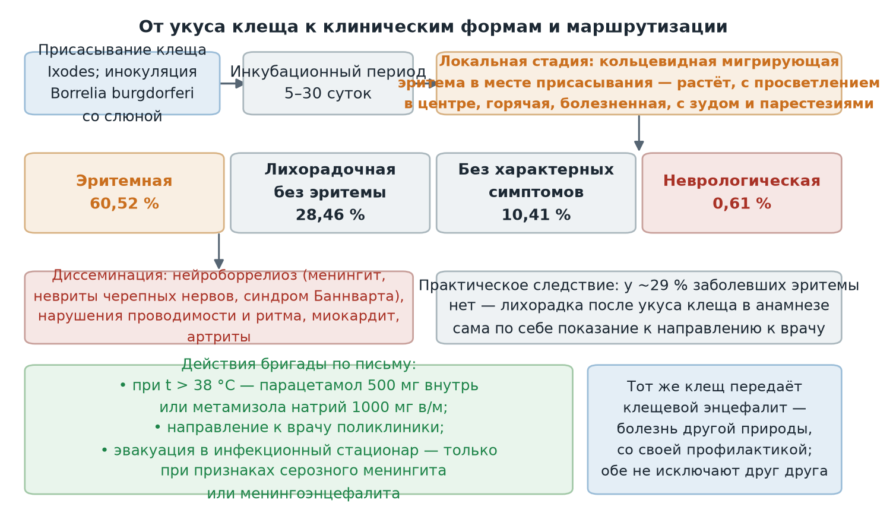

  
Приказы и письма в изложении для чайников

  
Иксодовый клещевой боррелиоз

  
Клещевой Лайм-боррелиоз на выезде: мигрирующая эритема как ключевой признак, формы болезни, объём помощи и маршрутизация

  

  
Источник: информационное письмо ГБУЗ «Станция скорой и неотложной медицинской помощи имени А. С. Пучкова» Департамента здравоохранения города Москвы № 1-14/1539 от 14.05.2024.

  
Серия «Крещение поворотом» · версия 1.0 · 29 сентября 2026 · CC BY-NC-SA 4.0

# О чём письмо

Письмо № 1-14/1539 адресовано заместителям главного врача по медицинской части с возложением обязанностей по руководству районными отделениями, заведующим и старшим врачам подстанций и филиалов, заведующим отделениями неотложной медицинской помощи взрослому и детскому населению и их заместителям, выездному медицинскому персоналу бригад. Документ сообщает эпидемиологическую ситуацию по иксодовому клещевому боррелиозу и определяет порядок действий на внегоспитальном этапе.

Для бригады смысл письма сводится к трём положениям: заболевание узнаётся по кольцевидной мигрирующей эритеме в месте присасывания клеща; помощь на линии ограничивается симптоматической жаропонижающей терапией с направлением к врачу поликлиники; в инфекционный стационар эвакуируются только пациенты с признаками серозного менингита или менингоэнцефалита.

# Эпидемиологическая ситуация

В 2023 году в России зарегистрировано 9123 случая иксодового клещевого боррелиоза — на треть больше среднего уровня 2012–2022 годов без учёта лет пандемии. Показатель Москвы составил 21,36 на 100 тысяч населения и оказался одним из высоких среди регионов Центрального федерального округа. Рост обращений по поводу укусов клещей отмечен в 39 регионах, среди названных — Ивановская, Калужская, Костромская, Липецкая, Рязанская, Смоленская, Тверская, Тульская и Ярославская области.

# Возбудитель и механизм заражения

Иксодовый клещевой боррелиоз — острое природно-очаговое инфекционное заболевание, вызываемое *Borrelia burgdorferi*. Механизм передачи трансмиссивный, путь инокуляционный: возбудитель попадает в кожу со слюной инфицированного клеща рода *Ixodes* во время присасывания. Входными воротами служат кожные покровы.

Восприимчивость высокая, сезонность весенне-летняя — с апреля по август; заражение происходит в лесных и лесопарковых зонах. Резервуар возбудителя — мышевидные грызуны, дикие и домашние животные; птицы разносят инфицированных клещей при миграциях. Больной человек источником заражения не является.

# Инкубационный период и клинические признаки

Инкубационный период отсчитывается от момента присасывания клеща и составляет от 5 до 30 суток. Заболевание развивается остро или подостро.

| Признак | Характеристика по письму |
|---|---|
| Интоксикационный синдром | Озноб, жар, повышение температуры тела, головная боль, головокружение, слабость, миалгии, артралгии |
| Мигрирующая эритема | Уртикарная сыпь и кольцевидная эритема в месте присасывания, постепенно увеличивающаяся, с просветлением в центре; горячая и болезненная при пальпации, сопровождается зудом, жжением и парестезиями |
| Регионарный лимфаденит | Лимфатические узлы ближе к месту присасывания увеличены, умеренно болезненны, не спаяны с окружающими тканями, кожа над ними не изменена |
| Нервная система | Менингит, невриты черепных нервов, радикулоневрит, менингорадикулоневрит — нейроборрелиоз (синдром Баннварта) |
| Сердечно-сосудистая система | Нарушения проводимости и ритма, миокардит |

# Формы болезни

Структура заболеваний в России по клиническим формам: преобладают эритемные формы — 60,52 %; лихорадочная форма без эритемы — 28,46 %; формы с неврологической симптоматикой — 0,61 %; без характерных клинических симптомов — 10,41 %.

Практическое следствие: кольцевидная эритема с просветлением в центре у пациента с укусом клеща в анамнезе — ведущий диагностический признак, но у почти трёх из десяти заболевших болезнь протекает лихорадочно и без эритемы, поэтому отсутствие сыпи диагноз не снимает.

<figure>
  
  <figcaption>Путь от присасывания клеща к клиническим формам иксодового боррелиоза с долями по письму № 1-14/1539 и объёмом помощи бригады.</figcaption>
</figure>

# Объём помощи на внегоспитальном этапе

По письму лечение проводится в соответствии с Алгоритмами оказания скорой и неотложной медицинской помощи и сводится к симптоматической жаропонижающей терапии при температуре выше 38 °C:

- парацетамол 500 мг внутрь, или
- метамизола натрий 1000 мг внутримышечно.

Далее пациенту рекомендуется обращение к врачу поликлиники. Медицинская эвакуация в стационар инфекционного профиля предусмотрена только при признаках развития серозного менингита или менингоэнцефалита.

> **Расхождение РФ ↔ международная практика.** Письмо не предусматривает постконтактной антибиотикопрофилактики боррелиоза на догоспитальном этапе — решение о ней отнесено к врачу поликлиники. Руководство IDSA 2020 допускает однократный приём доксициклина 200 мг после снятия клеща при одновременном выполнении условий: клещ определён как *Ixodes*, время присасывания не менее 36 часов, начало профилактики не позднее 72 часов, инфицированность клещей в местности не ниже 20 % и отсутствие противопоказаний к доксициклину. В российской практике аналогичную роль выполняют назначаемые врачом доксициклин или йодантипирин; задача бригады — донести до пациента необходимость обращения в поликлинику или травматологический пункт.

Отдельно учитывается, что тот же иксодовый клещ передаёт клещевой вирусный энцефалит — заболевание иной природы, с собственной специфической профилактикой (вакцинация, антиклещевой иммуноглобулин по назначению). Боррелиоз и энцефалит не исключают друг друга и могут сочетаться после одного укуса.

# Предписания письма

- Заместителям главного врача, заведующим и старшим врачам подстанций и филиалов, заведующим отделениями НМП — довести письмо до сведения выездного персонала.
- Выездному медицинскому персоналу — учитывать положения письма при оказании помощи и оформлении документации.

Письмо подписано главным врачом Станции Н. Ф. Плавуновым.

# Источники

- Информационное письмо ГБУЗ «ССиНМП им. А. С. Пучкова» ДЗМ № 1-14/1539 от 14.05.2024.
- Руководство по диагностике и профилактике болезни Лайма: Lantos P. M. et al. Clinical Practice Guidelines by the Infectious Diseases Society of America (IDSA), AAN and ACR: 2020 Guideline for the Prevention, Diagnosis and Treatment of Lyme Disease. Clin Infect Dis. 2021.

# Источники иллюстраций

| Файл | Что изображено | Источник |
|---|---|---|
| `images/formy_bolezni.png` | Путь от укуса клеща к клиническим формам с долями по письму и маршрутизацией бригады | Построена для проекта по данным письма (`images/postroit.py`) |

# Выходные данные

Иксодовый клещевой боррелиоз · версия 1.0 · сентябрь 2026 · Серия «Крещение поворотом» · CC BY-NC-SA 4.0. Материал носит справочный характер и не заменяет действующие приказы и клинические рекомендации.

Нашли ошибку — напишите в «Обсуждениях» репозитория на GitHub.
