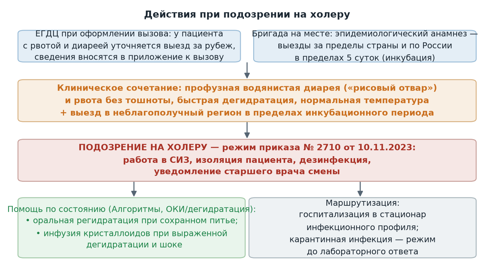

  
Приказы и письма в изложении для чайников

  
Холера

  
Подозрение на холеру на выезде: эпидемиологический анамнез, клиника дегидратации, противоэпидемический режим и маршрутизация

  

  
Источник: информационные письма ГБУЗ «Станция скорой и неотложной медицинской помощи имени А. С. Пучкова» Департамента здравоохранения города Москвы № 1-14/771 от 16.03.2023, № 1-14/600 от 20.02.2024 и № 1-14/2454 от 08.08.2024.

  
Серия «Крещение поворотом» · версия 1.0 · 29 сентября 2026 · CC BY-NC-SA 4.0

# О чём письма

По холере Станция выпускает информационные письма серийно — по мере ухудшения эпидемиологической ситуации в мире. Действующее письмо № 1-14/2454 от 08.08.2024 издано по письму Управления Роспотребнадзора по Москве от 06.08.2024 «О дополнительных мерах, направленных на минимизацию рисков осложнения эпидситуации по холере»; более ранние письма № 1-14/771 (2023) и № 1-14/600 (февраль 2024) содержат ту же схему действий с обновлением статистики. Поскольку операционная часть у писем общая, в этом материале они изложены вместе.

Для бригады правило одно и короткое: **у любого пациента с рвотой и диареей собирается эпидемиологический анамнез — выезды за пределы страны и по России; при подозрении на холеру действует приказ Станции № 2710 от 10.11.2023 о мероприятиях по санитарной охране территории.**

# Холера как болезнь

Холера — острая кишечная инфекция, вызываемая токсигенными вибрионами *Vibrio cholerae* серогрупп O1 и O139. Механизм передачи фекально-оральный: вода, пища, контактно-бытовой путь. Инкубационный период от нескольких часов до 5 суток — именно этот срок определяет глубину эпидемиологического анамнеза. Болезнь относится к карантинным (конвенционным) инфекциям: подозрение на неё включает противоэпидемический режим ещё до лабораторного подтверждения.

Клиническая картина определяется потерей жидкости:

| Признак | Характеристика |
|---|---|
| Диарея | Обильная водянистая, без боли в животе; стул в виде «рисового отвала», объём испражнений может достигать нескольких литров в сутки |
| Рвота | Профузная, без предшествующей тошноты, присоединяется после диареи |
| Дегидратация | Развивается за часы: сухость слизистых и кожи, снижение тургора, осиплость голоса, афония, судороги икроножных мышц, цианоз, «рука прачки» |
| Гемодинамика | Тахикардия, падение артериального давления, шок при дегидратации III–IV степени |
| Температура | Обычно нормальная или пониженная — отличие от большинства кишечных инфекций |

Отсутствие лихорадки и боли в животе при обильной водянистой диарее — признак, отграничивающий холеру от типичной острой кишечной инфекции; при их наличии подозрение снижается, но не снимается.

# Эпидемиологическая ситуация по письмам

По последнему письму, с начала 2024 года в мире зарегистрировано более 142 тысяч случаев холеры и 218 тысяч подозрительных случаев в 32 странах с более чем 2,5 тысячами летальных исходов; наибольшее число случаев — Афганистан, Сомали, Замбия, Зимбабве, Мозамбик, Индия. Письмо № 1-14/600 фиксировало 856 тысяч случаев за 2023 год в 38 странах и завозы в Европу, США и Мексику; в России в 2023 году зарегистрированы два завозных случая из Индии. Письмо № 1-14/771 (2023) сообщало о выделении культур *V. cholerae* O1 в ряде регионов России, включая объекты водной среды.

По Москве на момент последнего письма: прирост острых кишечных инфекций к аналогичному периоду +6,6 %, отдельно отмечены ротавирусная (+20,9 %) и норовирусная (+13,5 %) инфекции — то есть фоновая заболеваемость ОКИ растёт на фоне риска завоза.

# Что предписано бригаде и диспетчерской

| Кому | Предписание |
|---|---|
| Единая городская диспетчерская | При оформлении вызова к пациенту с ОКИ (рвота, диарея) уточнять у вызывающего выезд за рубеж и вносить сведения в приложение к вызову |
| Выездной персонал | Тщательный сбор эпидемиологического анамнеза у пациентов, прибывших из эпидемически неблагополучных по холере стран |
| Заведующие и старшие врачи | При выявлении пациента с подозрением на холеру обеспечить соблюдение приказа № 2710 от 10.11.2023 (противоэпидемический режим и санитарная охрана территории); довести письмо до персонала |

# Действия при подозрении

Подозрение формируется сочетанием: профузная водянистая диарея и рвота с быстрой дегидратацией **плюс** выезд в неблагополучный регион в пределах инкубационного периода (до 5 суток).

<figure>
  
  <figcaption>Порядок действий при подозрении на холеру по письмам № 1-14/771, № 1-14/600 и № 1-14/2454: от эпиданамнеза к противоэпидемическому режиму приказа № 2710.</figcaption>
</figure>

Противоэпидемический режим по приказу № 2710 включает работу в средствах индивидуальной защиты, мероприятия по дезинфекции, изоляцию пациента и госпитализацию в стационар инфекционного профиля с уведомлением старшего врача смены. Помощь по состоянию ведётся по Алгоритмам при острой кишечной инфекции и дегидратации: оральная регидратация при сохранном питье, инфузионная терапия при выраженной дегидратации и шоке.

> **Расхождение РФ ↔ международная практика.** Письма описывают противоэпидемическую часть и не детализируют врачебную тактику. По рекомендациям ВОЗ и CDC основа лечения холеры — ранняя регидратация: оральными растворами при дегидратации лёгкой и средней степени, внутривенными кристаллоидами (раствор Рингера с лактатом) при тяжёлой; антибиотик (доксициклин у взрослых, азитромицин у детей и беременных) сокращает длительность диареи, но назначается в стационаре; детям добавляется цинк. На линии содержательная помощь — это оценка степени дегидратации и инфузия по Алгоритмам на фоне противоэпидемического режима.

# Предписания писем

- ЕГДЦ уточняет выезд за рубеж при оформлении вызовов с рвотой и диареей и вносит сведения в приложение к вызову.
- Выездной персонал собирает эпидемиологический анамнез у прибывших из неблагополучных стран.
- При подозрении на холеру — неукоснительное соблюдение приказа № 2710 от 10.11.2023.
- Письма доводятся до сведения персонала подразделений.

# Источники

- Информационные письма ГБУЗ «ССиНМП им. А. С. Пучкова» ДЗМ № 1-14/771 от 16.03.2023, № 1-14/600 от 20.02.2024, № 1-14/2454 от 08.08.2024.
- Приказ ССиНМП им. А. С. Пучкова № 2710 от 10.11.2023 «Об обеспечении мероприятий по предупреждению заноса и распространения инфекционных (паразитарных) болезней, требующих проведения мероприятий по санитарной охране территории города Москвы».
- WHO. Cholera — Global outbreak response guidance; CDC. Cholera — Vibrio cholerae infection: clinical management.

# Источники иллюстраций

| Файл | Что изображено | Источник |
|---|---|---|
| `images/podozrenie_na_holeru.png` | Порядок действий бригады при подозрении на холеру | Построена для проекта по письмам (`images/postroit.py`) |

# Выходные данные

Холера · версия 1.0 · сентябрь 2026 · Серия «Крещение поворотом» · CC BY-NC-SA 4.0. Материал носит справочный характер и не заменяет действующие приказы и клинические рекомендации.

Нашли ошибку — напишите в «Обсуждениях» репозитория на GitHub.
