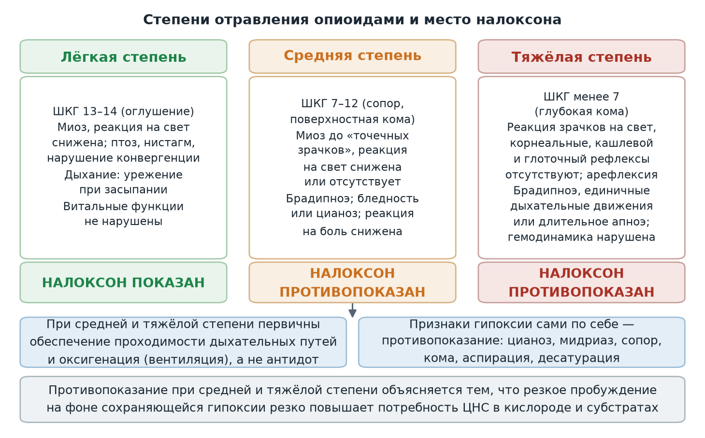
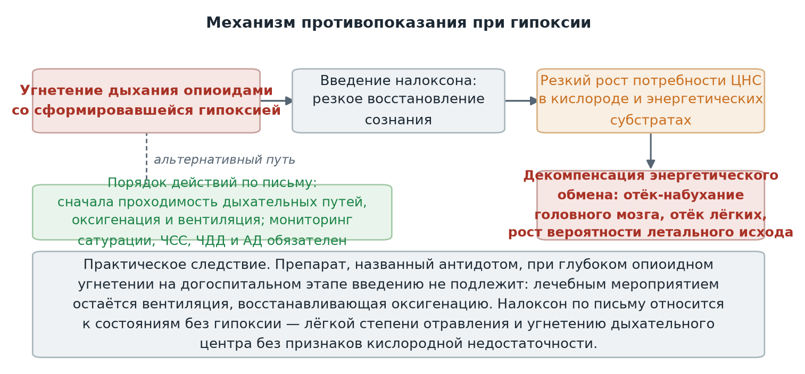
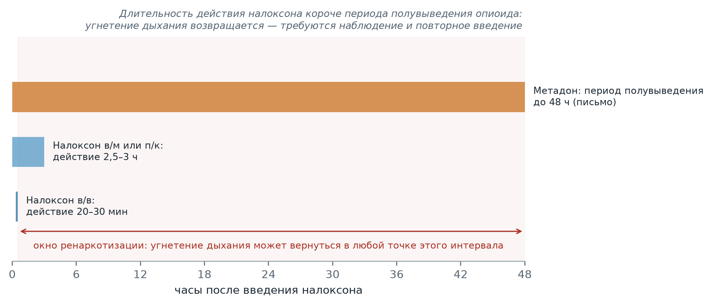

  
Приказы и письма в изложении для чайников

  
Налоксон

  
Антагонист опиоидных рецепторов на выезде: показания и противопоказания, дозы у взрослых и детей, ренаркотизация, обязательный мониторинг

  

  
Источник: информационно-методическое письмо ГБУЗ «Станция скорой и неотложной медицинской помощи имени А. С. Пучкова» Департамента здравоохранения города Москвы № 1-14/185 от 26.01.2026 «Об особенностях применения лекарственного средства Налоксон при оказании скорой медицинской помощи».

  
Серия «Крещение поворотом» · версия 1.0 · 27 сентября 2026 · CC BY-NC-SA 4.0

# Центральное положение письма

Информационно-методическое письмо № 1-14/185 от 26.01.2026 определяет порядок применения налоксона выездными бригадами скорой медицинской помощи. Его ключевое положение расходится с интуитивным представлением об антидоте: налоксон показан только при **лёгкой** степени опиоидной интоксикации и при угнетении дыхательного центра **без признаков гипоксии**. При средней и тяжёлой степени отравления и при любых отчётливых признаках гипоксии введение налоксона строго противопоказано — первичными мероприятиями становятся обеспечение проходимости дыхательных путей и восстановление оксигенации, то есть вентиляция, а не антидот.

Документ адресован заместителям главного врача по медицинской части, заведующим и старшим врачам подстанций и филиалов, руководителям отделов и медицинскому персоналу выездных бригад. Доведение письма до сведения персонала под роспись и доклад о выполнении предусмотрены сроком до 28.02.2026.

# Препарат и механизм действия

Налоксон отнесён в письме к группе «Антидоты». Это полный антагонист опиоидных рецепторов: он обладает высоким сродством к ним, вытесняет связавшиеся с рецепторами опиоиды и при этом не имеет собственной активности — сам по себе рецептор не включает. Опиоиды (морфин, героин, метадон, фентанил, трамадол и другие) угнетают дыхание именно через связывание с опиоидными рецепторами дыхательного центра ствола мозга; налоксон занимает эти рецепторы и устраняет угнетение конкурентно. Следствие конкурентного механизма — обратимость: как только концентрация налоксона падает, опиоид занимает рецепторы снова.

Кинетические характеристики по письму:

| Параметр | Значение |
|---|---|
| Начало действия при внутривенном введении | в среднем через 30 секунд |
| Начало действия при внутримышечном и подкожном введении | через 3 минуты |
| Период полувыведения | 45–90 минут |
| Продолжительность действия при внутривенном введении | 20–30 минут |
| Продолжительность действия при внутримышечном и подкожном введении | 2,5–3 часа |

Разница между путями введения имеет практическое значение: внутривенное введение действует быстрее, но и заканчивается быстрее. Поскольку опиоид, вызвавший угнетение, элиминируется медленнее налоксона, угнетение дыхания может вернуться — это состояние называется ренаркотизацией и рассматривается ниже отдельно.

# Показания к применению

Письмо определяет четыре показания для взрослых и детей в возрасте от 0 до 18 лет:

| Показание | Содержание по письму |
|---|---|
| Передозировка опиоидами лёгкой степени | Угнетение сознания на уровне оглушения без нарушения витальных функций — см. степени ниже |
| Угнетение дыхательного центра опиоидами без гипоксии | Урежение дыхания при отсутствии цианоза, десатурации и других признаков кислородной недостаточности |
| Послеоперационное применение | Ускорение выхода из общей анестезии перед окончанием управляемого дыхания — только если опиоидные анальгетики вводились во время анестезии |
| Восстановление дыхания у новорождённого | После введения роженице опиоидных анальгетиков или при употреблении ею опиоидов в перинатальном периоде |

На практике выездной бригады актуальны первые два показания: послеоперационное применение относится к стационарному этапу, а восстановление дыхания у новорождённого — к специализированной помощи в родовом стационаре, хотя обе ситуации письмом перечислены и снабжены дозами.

# Три степени опиоидной интоксикации и статус налоксона

Справочная часть письма разграничивает опиоидную интоксикацию на три степени по глубине угнетения сознания, дыхания и рефлексов. Степень определяет не только тяжесть состояния, но и правовой статус антидота: при лёгкой степени налоксон показан, при средней и тяжёлой — противопоказан.

| Параметр | Лёгкая степень | Средняя степень | Тяжёлая степень |
|---|---|---|---|
| Сознание по шкале комы Глазго | 13–14 баллов, оглушение | 7–12 баллов, сопор или поверхностная кома | Менее 7 баллов, глубокая кома |
| Зрачки и рефлексы | Миоз, реакция на свет снижена; птоз, нистагм, нарушение конвергенции | Миоз вплоть до «точечных зрачков», реакция на свет снижена или отсутствует | Реакция зрачков на свет отсутствует; корнеальные, кашлевой и глоточный рефлексы отсутствуют; арефлексия, атония |
| Дыхание | Тенденция к урежению при засыпании | Брадипноэ | Выраженное брадипноэ, единичные дыхательные движения или длительное апноэ |
| Прочее | Реакция на болевое раздражение снижена; нарушений витальных функций нет | Положение пассивное; кожа бледная или цианотичная; реакция на болевое раздражение снижена или отсутствует | Реакция на болевое раздражение отсутствует; гемодинамика нарушена |
| **Налоксон** | **Показан** | **Противопоказан** | **Противопоказан** |

<figure>
  
  <figcaption>Степени опиоидной интоксикации по справочной части письма № 1-14/185 и статус налоксона при каждой. При средней и тяжёлой степени первичными являются проходимость дыхательных путей и оксигенация; признаки гипоксии сами по себе составляют противопоказание к введению антидота.</figcaption>
</figure>

# Механизм противопоказания при гипоксии

Пункт 5.1 письма называет введение налоксона строго противопоказанным пациентам с передозировкой опиоидов средней и тяжёлой степени и пациентам с отчётливыми признаками гипоксии: цианозом кожных покровов и слизистых, мидриазом, сопором, комой, признаками аспирации, выраженными нарушениями функции внешнего дыхания, десатурацией. Обоснование приведено в самом документе: быстрое пробуждение, вызванное антидотом при передозировке опиоидов, приводит к значительному возрастанию потребности центральной нервной системы в кислороде и энергетических субстратах. При имеющейся гипоксии это способно вызвать декомпенсацию энергетического обмена, отёк-набухание головного мозга, отёк лёгких и повышение вероятности летального исхода.

<figure>
  
  <figcaption>Причинная цепочка пункта 5.1 письма: на фоне гипоксии резкое восстановление сознания резко повышает потребность ЦНС в кислороде, что ведёт к декомпенсации энергетического обмена. Альтернативный путь — восстановление оксигенации вентиляцией.</figcaption>
</figure>

Практическое следствие для вызова состоит в том, что лечение средней и тяжёлой опиоидной интоксикации на догоспитальном этапе сводится к обеспечению проходимости дыхательных путей и вентиляции до устранения гипоксии. При длительном апноэ и нарушении гемодинамики действует общий порядок реанимационных мероприятий. Введение налоксона после восстановления оксигенации в письме прямо не описано; логика документа исчерпывается первичностью устранения кислородной недостаточности.

# Дозы и пути введения

Все дозы приведены дословно по таблице письма; миллилитровые эквиваленты соответствуют концентрации 0,4 мг/мл (0,4 мг — 1 мл).

| Показание | Взрослые | Дети |
|---|---|---|
| Передозировка опиоидами лёгкой степени | Внутривенно 0,4–2 мг (1–5 мл); при необходимости введение повторяют | Внутривенно 0,01 мг/кг (0,025 мл/кг); при отсутствии эффекта повторно внутривенно или внутримышечно 0,1 мг/кг (0,25 мл/кг) |
| Угнетение дыхательного центра опиоидами без гипоксии | Внутривенно 0,1–0,2 мг (0,25–0,5 мл); при необходимости дополнительно 0,1 мг (0,25 мл) с интервалом 2 минуты | Внутривенно медленно 0,01–0,02 мг/кг (0,025–0,05 мл/кг) в течение 2–3 минут |
| Восстановление дыхания у новорождённого | Не применяется | Внутривенно 0,01 мг/кг (0,025 мл/кг); при невозможности внутривенного введения — внутримышечно или подкожно 0,01 мг/кг (0,025 мл/кг); при отсутствии эффекта повторно внутривенно или внутримышечно 0,01 мг/кг (0,025 мл/кг) |

Дозовая разница между двумя первыми показаниями существенна: при лёгкой передозировке взрослому вводится 0,4–2 мг, при угнетении дыхательного центра без гипоксии — 0,1–0,2 мг с последующим титрованием по 0,1 мг каждые 2 минуты. Второе показание соответствует ситуации, когда требуется уменьшить опиоидное угнетение, не вызывая полного пробуждения и резкого роста потребности в кислороде.

# Налоксон в Алгоритмах № 535

Действующая строка токсикологического раздела приказа № 535 от 18.05.2023, по которой ведётся работа на линии, задаёт условия введения в операционной форме: налоксон 0,4 мг (1 мл) внутривенно вводится **после** восстановления проходимости дыхательных путей, **после** вентиляции маской со 100 % кислородом, при сатурации **не ниже 90 %** и при отсутствии аспирационного синдрома и сохраняющейся гипоксии; при недостаточном эффекте введение повторяют по 0,4 мг. Требования Алгоритмов и противопоказание письма № 1-14/185 при гипоксии представляют собой одно правило, сформулированное с разных сторон: антидот вводится только пациенту, оксигенация которого уже восстановлена. При этом письмо № 1-14/185 является более поздним документом и дополнительно вводит градацию по степеням и детские дозы, которых строка Алгоритмов не содержит.

Подробный разбор препарата — механизм, целесообразность при работающей вентиляции, международное титрование от 0,04 мг — приведён в карточке «Налоксон» раздела «Фармакология укладки».

# Ренаркотизация и мониторинг

Период полувыведения налоксона составляет 45–90 минут, тогда как период полувыведения метадона, отдельно указанный в письме, достигает 48 часов. Длительность действия антидота — 20–30 минут при внутривенном введении и 2,5–3 часа при внутримышечном или подкожном — короче периода элиминации практически любого опиоида. Угнетение дыхания после окончания действия налоксона возвращается; этот эффект письмо называет ренаркотизацией.

<figure>
  
  <figcaption>Соотношение длительности действия налоксона и периода полувыведения метадона по письму. Полосы передают длительности, а не концентрации; окно ренаркотизации — интервал, в котором опиоид ещё действует, а антидот уже нет.</figcaption>
</figure>

Из окна ренаркотизации следует требование пункта 6.1: при введении налоксона мониторинг сатурации, частоты сердечных сокращений, частоты дыхательных движений и артериального давления обязателен. Необходим постоянный контроль функции внешнего дыхания для своевременной диагностики отёка лёгких; при его развитии может потребоваться искусственная вентиляция лёгких с положительным давлением в конце выдоха для достижения адекватной оксигенации. У пациентов этой группы возможна гиповолемия, поэтому лечение отёка лёгких форсированным диурезом способно усугубить гипотензию.

# Лекарственное взаимодействие и совместимость

| Взаимодействие | Содержание по письму |
|---|---|
| Совместимость растворов | Совместим с натрия хлоридом 0,9 %, раствором глюкозы 5 % и стерильной водой для инъекций; несовместим с растворами, содержащими бисульфиты (в письме указан викасол) |
| Бупренорфин, трамадол, клонидин, барбитураты, транквилизаторы | Возможно кратковременное уменьшение эффекта налоксона |
| Опиоидные анальгетики | Снижение анальгетического действия при совместном применении |

# Осторожность, особые группы и передозировка

**Опиоидная зависимость.** Письмо требует осторожности у пациентов с опиоидной зависимостью: налоксон способен вызвать синдром отмены. То же положение распространено на новорождённого, у которого препарат может вызвать синдром отмены.

**Сердечно-сосудистые заболевания и кардиотоксические препараты.** Осторожность связана с риском желудочковой тахикардии и фибрилляции желудочков вплоть до остановки сердца.

**Почечная и печёночная недостаточность** отнесены к состояниям, требующим осторожности.

**Беременность и лактация.** Клинические исследования у беременных отсутствуют; применение допустимо только в случае крайней необходимости.

**Передозировка налоксоном.** Случаев передозировки не зарегистрировано; внутривенное введение разовой дозы до 10 мг не вызывает нежелательных реакций и изменений лабораторных показателей. Это положение согласуется с общим представлением о налоксоне как о препарате без собственной фармакологической активности: его действие ограничено вытеснением опиоида с рецепторов.

# Расхождения с международной практикой

> **Расхождение РФ ↔ международная практика.** Письмо № 1-14/185 и действующие документы Станции определяют объём догоспитальной помощи и имеют приоритет на линии. Приведённые ниже положения международных документов не заменяют их, а показывают, где подходы расходятся.

| Вопрос | Письмо № 1-14/185 | Международные документы |
|---|---|---|
| Граница применения | Показан только при лёгкой степени и угнетении дыхания без гипоксии; при средней и тяжёлой степени и признаках гипоксии противопоказан | Налоксон рекомендован при опиоидном угнетении дыхания любой глубины при сохранном пульсе, включая тяжёлое; при апноэ вентиляция первична, а налоксон вводится параллельно ей (Panchal A. R. et al., *Circulation*, 2020 — рекомендации AHA по СЛР) |
| Цель введения | Купирование угнетения в пределах показаний | Титрование до восстановления адекватного дыхания, а не до полного пробуждения: минимизация дозы снижает риск острого синдрома отмены и симпатической разрядки |
| Начальная доза у взрослых | 0,4–2 мг внутривенно при лёгкой передозировке; 0,1–0,2 мг при угнетении дыхания без гипоксии | Типовой диапазон 0,4–2 мг с повторным введением каждые 2–3 минуты; у пациентов с опиоидной терапией допускается титрование от малых доз 0,04–0,4 мг (AHA, 2020; ВОЗ, *Community management of opioid overdose*, 2014) |
| Пути введения | Внутривенный, внутримышечный, подкожный | Дополнительно интраназальный (2–4 мг) и автоинъекторы — внеоспитальные формы для очевидцев; в оснащение российских бригад не входят |
| Ренаркотизация | Названа прямо; мониторинг обязателен | Совпадает: повторные дозы или инфузия и наблюдение из-за более короткого периода полувыведения антидота (ВОЗ, 2014) |

# Предписания письма

| Адресат | Предписание | Срок |
|---|---|---|
| Заместители главного врача по медицинской части, заведующие и старшие врачи подстанций и филиалов | Довести письмо до сведения выездного медицинского персонала под роспись; доложить о выполнении заведующему отделом организации медицинской помощи и контроля качества и безопасности медицинской деятельности | До 28.02.2026 |
| Начальник учебно-организационного отдела | Разместить письмо на образовательном портале Института | До 28.02.2026 |
| Выездной медицинский персонал бригад | Учесть положения письма при оказании скорой медицинской помощи | — |

Письмо подписано главным врачом Н. Ф. Плавуновым и разослано заместителям главного врача, в медицинские отделы и на все подстанции.

# Источники

- Информационно-методическое письмо ГБУЗ «Станция скорой и неотложной медицинской помощи имени А. С. Пучкова» Департамента здравоохранения города Москвы № 1-14/185 от 26.01.2026 «Об особенностях применения лекарственного средства Налоксон при оказании скорой медицинской помощи» — общая информация, показания, дозы, противопоказания, взаимодействия, особенности применения, степени опиоидной интоксикации, предписания.
- Приказ Департамента здравоохранения города Москвы № 535 от 18.05.2023 «Об утверждении Алгоритмов оказания скорой и неотложной медицинской помощи» — раздел токсикологии, опиоиды: условия и дозы введения налоксона на догоспитальном этапе.
- Panchal A. R., Bartos J. A., Cabañas J. G. et al. Part 3: Adult Basic and Advanced Life Support: 2020 American Heart Association Guidelines for Cardiopulmonary Resuscitation and Emergency Cardiovascular Care. *Circulation*. 2020; 142(16_suppl_2): S366–S468 — применение налоксона при опиоидном угнетении дыхания, титрование.
- Всемирная организация здравоохранения. *Community management of opioid overdose*. Geneva: WHO, 2014 — повторные дозы, наблюдение в связи с ренаркотизацией, внеоспитальные формы введения.
- Материалы серии: «Налоксон» — карточка раздела «Фармакология укладки».

# Источники иллюстраций

| Файл | Что изображено | Источник |
|---|---|---|
| `stepeni_otravleniya.png` | Три степени опиоидной интоксикации с признаками и статусом налоксона при каждой | Собственная схема по справочной части и пункту 5.1 письма № 1-14/185 |
| `protivopokazanie_gipoksiya.png` | Причинная цепочка противопоказания налоксона при гипоксии и альтернативный порядок действий | Собственная схема по пункту 5.1 письма № 1-14/185 |
| `renarkotizaciya.png` | Длительность действия налоксона по путям введения против периода полувыведения метадона, окно ренаркотизации | Собственная схема по пунктам 1 и 5.2 письма № 1-14/185 |

Схемы построены скриптом `images/postroit.py` и распространяются на условиях лицензии материала.

# Выходные данные

**Материал:** «Налоксон». Версия 1.0. Изложение действующего информационно-методического письма Станции с таблицами доз, степенями интоксикации и сопоставлением с международными документами.

**Серия:** «Крещение поворотом» — материалы догоспитальной практики.

**Лицензия:** текст — Creative Commons «С указанием авторства — Некоммерческая — С сохранением условий» 4.0 (CC BY-NC-SA 4.0).

**Оговорка.** Материал носит справочный характер, не является нормативным документом и не заменяет действующие приказы и распоряжения службы. Дозы, показания и противопоказания необходимо проверять по первоисточнику — письму № 1-14/185 от 26.01.2026. Ответственность за клинические решения несёт медицинский работник, а не автор материала.

**Нашли ошибку?** Сообщить можно через раздел Issues репозитория проекта; исправление выходит новой версией, а изменение фиксируется в журнале изменений.
