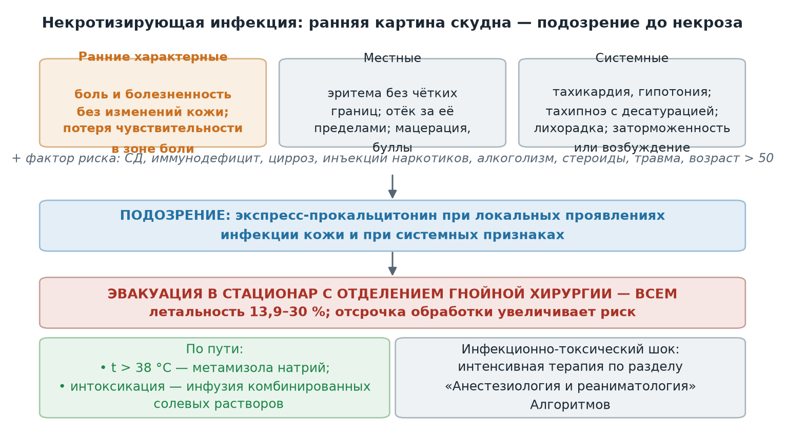

  
Приказы и письма в изложении для чайников

  
Некротизирующие инфекции кожи и мягких тканей

  
Некротизирующий фасциит на выезде: скудная ранняя картина, болезненность без изменений кожи, прокальцитонин и эвакуация в гнойную хирургию

  

  
Источник: информационное письмо ГБУЗ «Станция скорой и неотложной медицинской помощи имени А. С. Пучкова» Департамента здравоохранения города Москвы № 1-14/1774 от 16.06.2025.

  
Серия «Крещение поворотом» · версия 1.0 · 29 сентября 2026 · CC BY-NC-SA 4.0

# О чём письмо

Письмо № 1-14/1774 посвящено некротизирующим инфекциям кожи и мягких тканей — тяжёлым, быстро или молниеносно прогрессирующим инфекциям с выраженной интоксикацией, поражающим фасции и жировую клетчатку; гнойный экссудат отсутствует или несоразмерно мал. Летальность по письму составляет 13,9–30 %.

Центральное положение: на начальных этапах процесс развивается глубоко в тканях, а клинические проявления скудны — заболевание выглядит как обычное воспаление кожи именно в тот период, когда промедление уже опасно. Поэтому письмо делает упор на двух вещах: признаках, позволяющих заподозрить процесс до развёрнутой картины, и экспресс-определении прокальцитонина.

# Некротизирующий фасциит: определение и патогенез

Некротизирующий фасциит — быстро прогрессирующее инфекционное заболевание поверхностных фасциальных структур с вовлечением кожи и подкожной клетчатки без первичного вовлечения мышц. Поверхностная фасция отграничивает подкожную жировую клетчатку снизу; между фасциальными листками проходит прослойка рыхлой волокнистой ткани с участками жировой клетчатки — именно по этой межфасциальной прослойке воспаление распространяется вширь, опережая изменения кожи.

Возбудители по письму: анаэробы (Enterobacteriaceae, Bacteroides, Peptostreptococcus) и *Streptococcus pyogenes*.

Факторы, при которых вероятность выше: сахарный диабет, иммунодефицитные состояния, цирроз печени, злокачественные новообразования, травмы мягких тканей, инъекционное употребление наркотиков, алкоголизм, приём кортикостероидов, послеоперационные осложнения, избыточная масса тела, возраст старше 50 лет, поражения периферических сосудов.

# Клинические признаки

Начальная симптоматика мало отличается от прочих воспалительных заболеваний кожи и подкожной клетчатки и манифестирует по мере прогрессирования.

| Группа | Признаки по письму |
|---|---|
| Ранние характерные | Сильная боль и локальная болезненность без визуально определяемого изменения кожи; потеря чувствительности в поражённой области, имитирующая неврологическую симптоматику |
| Местные | Эритема без чётких границ; отёк, выходящий за пределы эритемы; мацерация и отслаивание кожи вплоть до булл |
| Системные | Астения; тахикардия и склонность к гипотонии; тахипноэ со снижением сатурации; высокая лихорадка; заторможенность или возбуждение |
| Осложнения | Протяжённый некроз кожи и клетчатки вплоть до ампутации конечности, ДВС-синдром, септический процесс |

Операционный смысл ранних признаков: сочетание «боль, несоразмерная видимым изменениям» + «онемение в зоне боли» у пациента с фактором риска — повод считать процесс некротизирующим до появления булл и некроза, когда диагноз уже очевиден, а время упущено.

# Диагностика и тактика на этапе СМП

По письму ценным методом ранней диагностики является экспресс-тест на прокальцитонин: его определение показано пациентам с локальными проявлениями инфекции кожи — особенно патогномоничными — и при выявлении системных проявлений.

Тактика:

- медицинская эвакуация в стационар с отделением гнойной хирургии — всем пациентам с подозрением;
- при гипертермии выше 38 °C — метамизола натрий;
- при выраженном интоксикационном синдроме — инфузионная терапия комбинированными солевыми растворами;
- при инфекционно-токсическом шоке — интенсивная терапия по разделу «Анестезиология и реаниматология» Алгоритмов.

<figure>
  
  <figcaption>Порядок действий при подозрении на некротизирующую инфекцию по письму № 1-14/1774: несоразмерная боль, гипестезия и системные признаки до развёрнутой картины определяют маршрут — гнойная хирургия.</figcaption>
</figure>

> **Расхождение РФ ↔ международная практика.** Письмо опирается на прокальцитонин как экспресс-маркёр; в международных руководствах для скрининга применяется шкала LRINEC (лабораторная, СРБ + лейкоциты + гемоглобин + натрий + креатинин + глюкоза), а главным прогностическим фактором названа ранняя хирургическая обработка — отсрочка первичной некрэктомии свыше 24 часов ассоциирована с существенным ростом летальности. Это не меняет тактику бригады: ранняя госпитализация в гнойную хирургию по письму реализует тот же принцип «не ждать развёрнутой картины».

# Предписания письма

- Включить обсуждение письма в повестку утренних конференций и довести до сведения выездного персонала под роспись.
- Обеспечить прохождение персоналом учебного модуля на образовательном портале Станции «Дифференциальная диагностика заболеваний в гнойной хирургии на этапе оказания скорой медицинской помощи» — срок до 01.07.2025.

# Источники

- Информационное письмо ГБУЗ «ССиНМП им. А. С. Пучкова» ДЗМ № 1-14/1774 от 16.06.2025.
- Stevens D. L., Bryant A. E. Necrotizing Soft-Tissue Infections. N Engl J Med. 2017; шкала LRINEC: Wong C. H. et al. Crit Care Med. 2004.

# Источники иллюстраций

| Файл | Что изображено | Источник |
|---|---|---|
| `images/podozrenie_na_fasciit.png` | Ранние признаки и порядок действий при подозрении на некротизирующий фасциит | Построена для проекта по письму (`images/postroit.py`) |

# Выходные данные

Некротизирующие инфекции кожи и мягких тканей · версия 1.0 · сентябрь 2026 · Серия «Крещение поворотом» · CC BY-NC-SA 4.0. Материал носит справочный характер и не заменяет действующие приказы и клинические рекомендации.

Нашли ошибку — напишите в «Обсуждениях» репозитория на GitHub.
