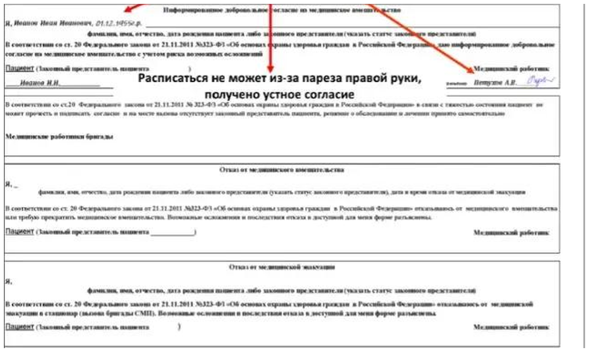
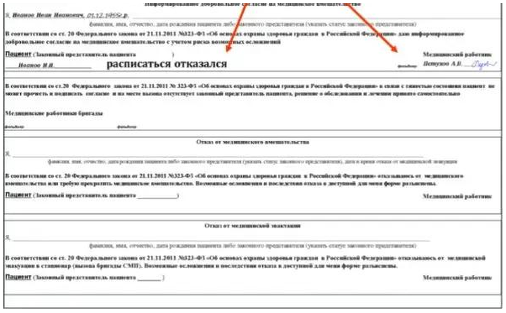
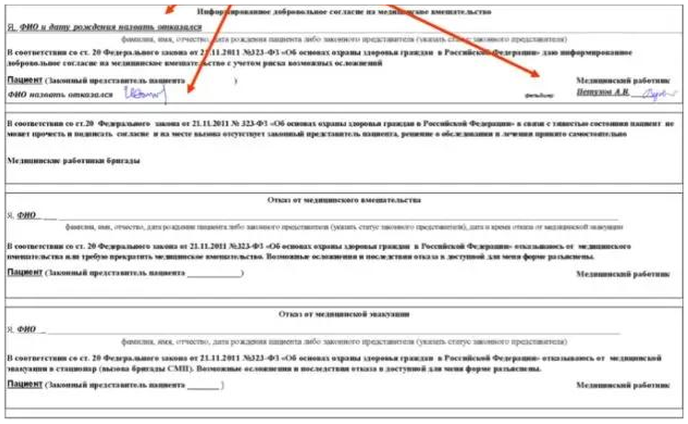
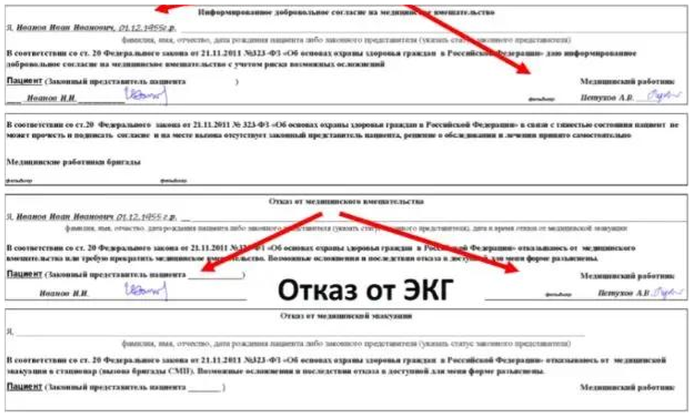
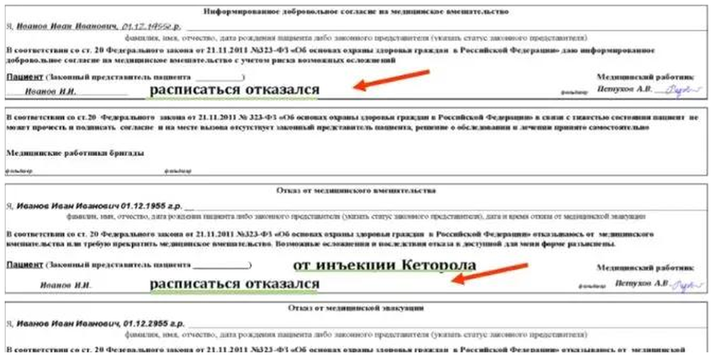
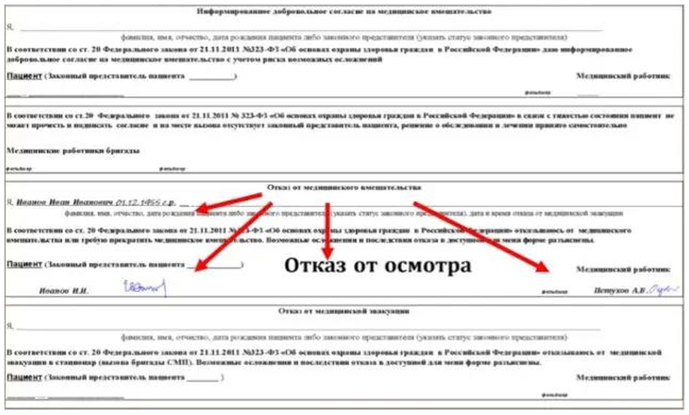

# Отказы и подписи

Оформление согласия и отказов в карте вызова. Основание — статья 20 Федерального закона № 323-ФЗ от 21.11.2011.

## Четыре блока бланка

| Блок | Когда заполняется |
|---|---|
| Информированное добровольное согласие на медицинское вмешательство | Пациент согласен на осмотр и помощь |
| Блок при тяжести состояния (без заголовка, под согласием) | Пациент по тяжести состояния не может прочесть и подписать согласие, законного представителя на месте нет. Решение принимает бригада, расписываются **два** её работника |
| Отказ от медицинского вмешательства | Отказ от осмотра, от обследования или от отдельной манипуляции; сюда же — требование прекратить начатое вмешательство |
| Отказ от медицинской эвакуации в стационар | Отказ от госпитализации, в том числе после вызова бригады скорой медицинской помощи |

Блоки самостоятельны. Согласие на осмотр не заменяет согласия на манипуляцию, а отказ от манипуляции не означает отказа от эвакуации: заполняется тот блок, к которому относится ситуация, и при необходимости несколько блоков сразу.

## Что писать, если подписи нет

Пустая графа означает, что подпись не получена и причина не установлена. Причина вписывается словами в ту же графу, где должна была стоять подпись.

| Ситуация | Запись в графе «Пациент» |
|---|---|
| Физически не может расписаться | «Расписаться не может из-за …, получено устное согласие» — с указанием причины: парез, травма кисти, иное |
| Может, но не хочет | «Расписаться отказался» |
| Не называет персональные данные | «ФИО назвать отказался» — эта же запись вносится в строку «Я, …» вместо фамилии |

Подпись медицинского работника ставится всегда, независимо от того, расписался ли пациент. В блоке отказа от вмешательства указывается, от чего именно отказ — от электрокардиографии, от инъекции, от конкретного препарата. Мелкий текст блока требует указать также дату и время отказа.

## Примеры заполнения

<figure>
  
  <figcaption>Не может поставить подпись. Согласие заполнено, в графе «Пациент» — фамилия и инициалы, вместо подписи запись о причине и об устном согласии, подпись медицинского работника на месте.</figcaption>
</figure>

<figure>
  
  <figcaption>Отказ от подписи. Пациент осмотр не отрицает, но расписываться не желает: в графе «Пациент» — фамилия с инициалами и запись «расписаться отказался».</figcaption>
</figure>

<figure>
  
  <figcaption>Данные не называет. Запись «ФИО и дату рождения назвать отказался» вносится в строку «Я, …», а в графе «Пациент» — «ФИО назвать отказался»; подпись пациента, если он её ставит, остаётся на своём месте.</figcaption>
</figure>

<figure>
  
  <figcaption>Отказ от отдельного вмешательства при согласии на осмотр. Блок согласия заполнен и подписан, отказ оформлен отдельным блоком с подписью пациента; в примере — отказ от электрокардиографии.</figcaption>
</figure>

<figure>
  
  <figcaption>Отказ от вмешательства без подписи. Заполнены оба блока: в согласии — «расписаться отказался», в блоке отказа указано, от чего именно отказ, и та же запись об отсутствии подписи.</figcaption>
</figure>

<figure>
  
  <figcaption>Отказ от осмотра. Блок согласия не заполняется — вмешательства не было; заполняется только блок отказа от медицинского вмешательства.</figcaption>
</figure>
