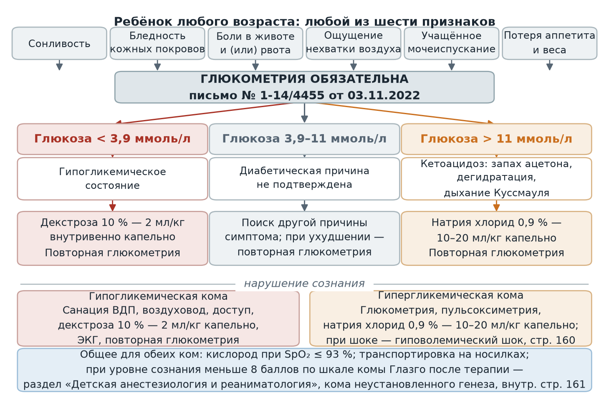
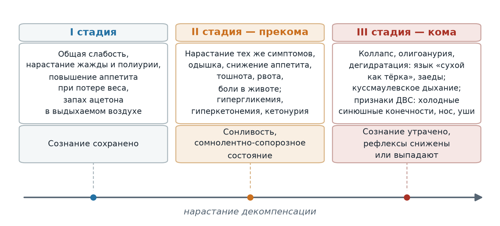
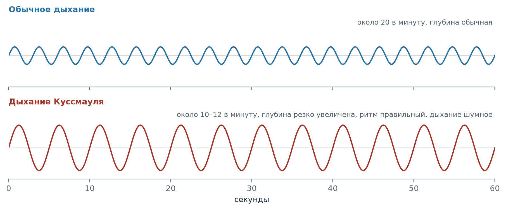

  
Приказы и письма в изложении для чайников

  
Сахарный диабет у детей

  
Показания к обязательной глюкометрии, дебют заболевания, стадии кетоацидоза, гипогликемические состояния и объём помощи детской бригаде

  

  
Источники: информационно-методическое письмо ГБУЗ «Станция скорой и неотложной медицинской помощи имени А. С. Пучкова» № 1-14/4455 от 03.11.2022 «Об особенностях клинической картины и диагностике сахарного диабета у детей»; приказ Департамента здравоохранения города Москвы № 535 от 18.05.2023, раздел «Общая педиатрия», внутренние страницы 175–176.

  
Серия «Крещение поворотом» · версия 1.1 · 24 сентября 2026 · CC BY-NC-SA 4.0

# Показания к обязательной глюкометрии у ребёнка

Письмо № 1-14/4455 предписывает выездному медицинскому персоналу проводить глюкометрию **всем детям** при наличии любого из шести признаков:

- сонливость;
- бледность кожных покровов;
- боли в животе и (или) рвота;
- ощущение нехватки воздуха;
- учащённое мочеиспускание;
- потеря аппетита и веса.

Перечень построен не по типичности, а по способности каждого признака оказаться единственным проявлением декомпенсации. Ни один из шести не является специфичным, и в этом смысл предписания: решение о глюкометрии принимается по признаку, а не по предположительному диагнозу.

<figure>
  
  <figcaption>Путь от повода к дозе. Любой из шести признаков служит показанием к глюкометрии; результат разводит помощь на три ветви. Дозы приведены по разделу «Общая педиатрия» приказа № 535 (внутр. стр. 175–176).</figcaption>
</figure>

# Дебют сахарного диабета у детей

Заболеть ребёнок может в любом возрасте, включая период новорождённости; чаще заболевание начинается в младшем школьном возрасте, в последние годы отмечается рост заболеваемости сахарным диабетом 1 типа у детей дошкольного возраста.

| Группа проявлений | Признаки |
|---|---|
| Ранние, часто единственные | Полидипсия — неестественно сильная, неутолимая жажда; полиурия |
| Мочевыделительные | Учащённое мочеиспускание; внезапно появившийся энурез у ребёнка, у которого его прежде не было |
| Общие | Снижение массы тела, общая и мышечная слабость, кожный зуд, снижение работоспособности, сонливость |
| Абдоминальные | Боль в животе, тошнота и рвота, жидкий стул |

**До 20 % пациентов с сахарным диабетом 1 типа в дебюте заболевания имеют кетоацидоз или кетоацидотическую кому.** Развитие этих состояний часто провоцируется протекающими у ребёнка простудными и иными инфекционными заболеваниями, в том числе с повышением температуры тела, а клиническая картина инфекции маскирует проявления декомпенсации.

# Стадии диабетического кетоацидоза

Диабетический кетоацидоз определяется как острая декомпенсация обмена веществ с резким повышением уровня глюкозы и концентрации кетоновых тел в крови, появлением их в моче и развитием метаболического ацидоза при различной степени нарушения сознания или без него; требует экстренной госпитализации.

| Стадия | Проявления | Сознание |
|---|---|---|
| **I** | Общая слабость, нарастание жажды и полиурии, повышение аппетита при одновременной потере веса, запах ацетона в выдыхаемом воздухе | Сохранено |
| **II** (прекома) | Нарастание указанных симптомов, одышка, снижение аппетита, тошнота, рвота, боли в животе; гипергликемия, гиперкетонемия, кетонурия | Сонливость с развитием сомнолентно-сопорозного состояния |
| **III** (кома) | Коллапс, олигоанурия, выраженная дегидратация — сухость кожи и слизистых, язык «сухой как тёрка», сухость губ, заеды в углах рта; куссмаулевское дыхание; признаки ДВС-синдрома — холодные синюшные конечности, кончик носа, ушные раковины | Утрачено, рефлексы снижены или выпадают |

<figure>
  
  <figcaption>Стадии кетоацидоза как непрерывное нарастание декомпенсации: под каждой стадией — её признаки и состояние сознания. Граница между стадиями задана не лабораторно, а клинически.</figcaption>
</figure>

<figure>
  
  <figcaption>Дыхание Куссмауля в сопоставлении с обычным. Кривые условные и передают соотношение глубины и частоты, а не измеренные объёмы. Опознаётся по сочетанию признаков: глубина резко увеличена, частота снижена, ритм правильный, дыхание шумное. У ребёнка с болью в животе и рвотой такой паттерн ошибочно принимается за дыхательную недостаточность.</figcaption>
</figure>

# Гипогликемические состояния

Клиническая картина связана с энергетическим голодом центральной нервной системы.

**Нейрогликопенические симптомы:** слабость, головокружение, снижение концентрации и внимания, чувство тревоги и страха, головная боль, сонливость, спутанность сознания, нечёткая речь, неустойчивая походка, судороги, тремор, холодный пот, бледность кожных покровов, тахикардия, боль в животе, тошнота и рвота.

| Степень | Проявления |
|---|---|
| **Лёгкая** | Потливость, дрожь, сердцебиение, беспокойство, нечёткость зрения, чувство голода, утомляемость, головная боль, нарушение координации, неразборчивая речь, сонливость, заторможенность, агрессия |
| **Тяжёлая** | Судороги, кома |

Гипогликемическая кома развивается, если меры к купированию тяжёлого гипогликемического состояния не приняты своевременно.

# Объём помощи по приказу № 535, раздел «Общая педиатрия»

| Состояние, код | Объём | Тактика |
|---|---|---|
| **Гипогликемическое состояние**, глюкоза < 3,9 ммоль/л (E10, E11, E14) | Катетеризация вены или внутрикостный доступ; **декстроза 10 % — 2 мл/кг внутривенно капельно**; повторная глюкометрия | Эвакуация при отсутствии эффекта, то есть при отсутствии ясного сознания после терапии; при отказе — актив в поликлинику и рекомендация приёма легкоусвояемых углеводов |
| **Гипогликемическая кома** (E10.0, E11.0, E14.0, E15.0) | Санация верхних дыхательных путей, воздуховод, пульсоксиметрия, глюкометрия, доступ; **декстроза 10 % — 2 мл/кг внутривенно капельно**; ЭКГ, повторная глюкометрия; кислород при SpO₂ ≤ 93 % | Эвакуация, транспортировка на носилках; при отказе — актив в ОНМПВиДН; при сознании < 8 баллов по шкале комы Глазго после терапии — раздел «Детская анестезиология и реаниматология», кома неустановленного генеза, внутр. стр. 161 |
| **Диабетический кетоацидоз**, глюкоза > 11 ммоль/л, прекома (E10.1, E11.1, E14.1) | Глюкометрия, ЭКГ, доступ; **натрия хлорид 0,9 % — 10–20 мл/кг внутривенно капельно**; пульсоксиметрия, повторная глюкометрия; кислород при SpO₂ ≤ 93 % | Эвакуация в больницу; при отказе — рекомендовать обратиться в поликлинику |
| **Диабетические гипергликемические комы** (E10.0, E11.0, E14.0) | Глюкометрия, пульсоксиметрия; **натрия хлорид 0,9 % — 10–20 мл/кг внутривенно капельно** | Эвакуация, транспортировка на носилках; при отказе — актив в поликлинику; при сознании < 8 баллов — внутр. стр. 161; при шоке — гиповолемический шок, внутр. стр. 160 |

**Различие детских и взрослых доз.** У детей при гипогликемии применяется декстроза 10 % — 2 мл/кг внутривенно капельно. Декстроза 40 % в объёме 40–100 мл внутривенно струйно предусмотрена только во взрослом разделе приказа (внутр. стр. 30) и в детском разделе не фигурирует. Объём инфузии у ребёнка при кетоацидозе и гипергликемической коме задан на килограмм массы тела, а не фиксированным количеством.

# Состояния, под которые маскируется дебют

| Картина у ребёнка | Предполагаемый диагноз | Что снимает вопрос |
|---|---|---|
| Боль в животе, рвота, жидкий стул | Острая кишечная инфекция, аппендицит | Глюкометрия |
| Куссмаулевское дыхание, ощущение нехватки воздуха | Одышка дыхательного происхождения, пневмония | Глюкометрия, запах ацетона в выдыхаемом воздухе |
| Лихорадка на фоне сопутствующей инфекции | Острая респираторная инфекция | Глюкометрия: инфекция провоцирует декомпенсацию и одновременно маскирует её |
| Сонливость, спутанность сознания, неразборчивая речь | Интоксикация, нейроинфекция | Глюкометрия в обе стороны — и гипогликемия, и кетоацидоз |
| Учащённое мочеиспускание, впервые появившийся энурез | Инфекция мочевыводящих путей, невротические расстройства | Глюкометрия, оценка динамики массы тела |

# Источники

- Информационно-методическое письмо ГБУЗ «Станция скорой и неотложной медицинской помощи имени А. С. Пучкова» Департамента здравоохранения города Москвы № 1-14/4455 от 03.11.2022 «Об особенностях клинической картины и диагностике сахарного диабета у детей» — категории сахарного диабета, клиническая картина дебюта, стадии кетоацидоза, гипогликемические состояния, показания к глюкометрии.
- Приказ Департамента здравоохранения города Москвы № 535 от 18.05.2023 «Об утверждении Алгоритмов оказания скорой и неотложной медицинской помощи» — раздел «Общая педиатрия»: гипогликемическое состояние и гипогликемическая кома (внутр. стр. 175), диабетический кетоацидоз и гипергликемические комы (внутр. стр. 176); раздел «Терапия»: те же состояния у взрослых (внутр. стр. 30–31).

# Источники иллюстраций

| Файл | Что изображено | Источник |
|---|---|---|
| `reshenie_glyukometriya.png` | Схема: шесть показаний к глюкометрии, три ветви по уровню глюкозы, дозы и объём при комах | Собственная схема по письму № 1-14/4455 и приказу № 535 |
| `stadii_dka.png` | Схема: три стадии диабетического кетоацидоза с признаками и состоянием сознания | Собственная схема по письму № 1-14/4455 |
| `dyhanie_kussmaulya.png` | Кривые обычного дыхания и дыхания Куссмауля | Собственная схема, кривые условные |

Схемы построены скриптом `images/postroit.py` и распространяются на условиях лицензии материала.

# Выходные данные

**Материал:** «Сахарный диабет у детей». Версия 1.1. Изложение действующих документов Станции; дублируется карточкой в приложении «Маршрут вызова». В версии 1.1 добавлены три схемы и раздел «Источники иллюстраций».

**Серия:** «Крещение поворотом» — материалы догоспитальной практики.

**Лицензия:** текст — Creative Commons «С указанием авторства — Некоммерческая — С сохранением условий» 4.0 (CC BY-NC-SA 4.0).

**Оговорка.** Материал носит справочный характер, не является нормативным документом и не заменяет действующие приказы и распоряжения службы. Дозы, показания и маршрутизацию необходимо проверять по первоисточникам. Ответственность за клинические решения несёт медицинский работник, а не автор материала.

**Нашли ошибку?** Сообщить можно через раздел Issues репозитория проекта; исправление выходит новой версией, а изменение фиксируется в журнале изменений.
