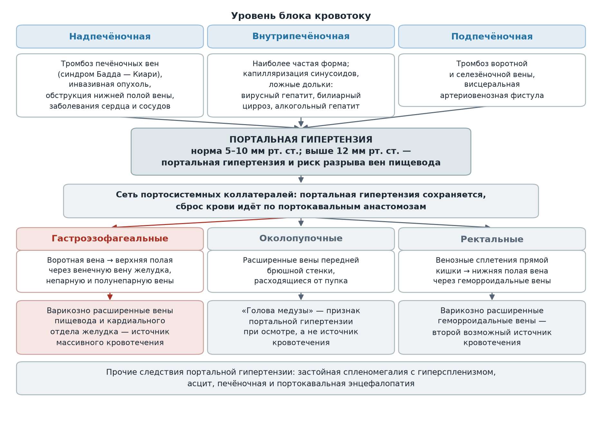
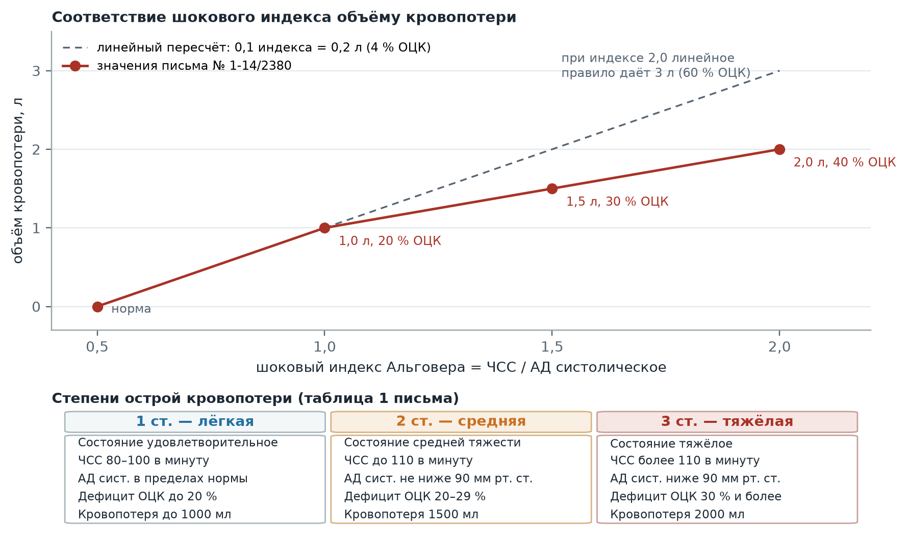
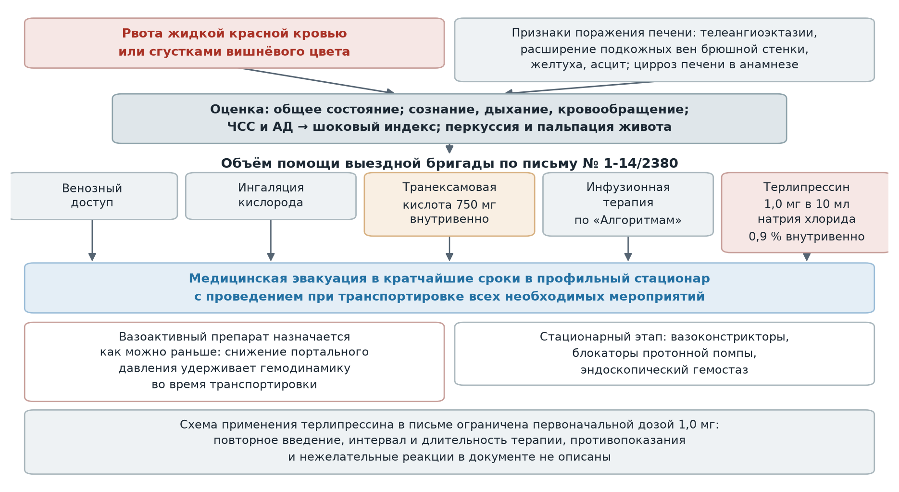

  
Приказы и письма в изложении для чайников

  
Кровотечение из варикозно расширенных вен пищевода

  
Портальная гипертензия, формы и стадии, оценка объёма кровопотери по шоковому индексу, объём осмотра и помощи выездной бригады, терлипрессин

  

  
Источники: информационно-методическое письмо ГБУЗ «Станция скорой и неотложной медицинской помощи имени А. С. Пучкова» № 1-14/2380 от 25.06.2021 «О диагностике и лечении кровотечений из варикозно-расширенных вен пищевода выездными бригадами»; приказ по Станции № 3250 от 29.12.2020 «Об оснащении выездных бригад скорой медицинской помощи и комнат амбулаторного приёма»; приказ Департамента здравоохранения города Москвы № 535 от 18.05.2023, раздел «Хирургические заболевания».

  
Серия «Крещение поворотом» · версия 1.0 · 24 сентября 2026 · CC BY-NC-SA 4.0

# Портальная гипертензия: определение и пороговое значение давления

Портальная гипертензия определена в письме № 1-14/2380 как синдром повышенного давления в системе воротной вены, вызванного нарушением кровотока в портальных сосудах, печёночных венах и нижней полой вене. В норме давление в системе портальных вен составляет 5–10 мм рт. ст.; повышение выше 12 мм рт. ст. свидетельствует о развитии портальной гипертензии. Начиная с этого же значения появляется риск разрыва варикозно расширенных вен пищевода, а степень риска определяется классом цирроза, размером варикозных узлов и степенью изменений сосудистой стенки.

Синдром сопровождается спленомегалией, варикозным расширением вен пищевода и желудка, асцитом и печёночной энцефалопатией. Портальная гипертензия развивается в результате увеличения портального венозного кровотока и (или) повышения резистентности портальных либо печёночных вен. В основе увеличения портального сопротивления лежат механическая обструкция и активное сокращение миофибробластов и гладкомышечного слоя внутрипечёночных вен; при циррозах печени печёночное сосудистое сопротивление повышается преимущественно вследствие нарушения архитектоники печени. Увеличение портального кровотока обусловлено висцеральной артериальной вазодилатацией, связанной преимущественно с продукцией оксида азота эндотелиальными клетками. Портальная гипертензия сохраняется даже после формирования сети портосистемных коллатералей, приводящего к варикозному расширению вен.

## Портокавальные анастомозы и зоны потенциальных источников кровотечения

К основным портокавальным анастомозам письмо относит гастроэзофагеальные, соединяющие воротную вену с верхней полой веной через венечную вену желудка, непарную и полунепарную вены, и анастомозы между венозными сплетениями прямой кишки и нижней полой веной через верхние и нижние геморроидальные вены, а также околопупочные вены. Анастомозы в пищеводе, кардиальном отделе желудка и вокруг прямой кишки формируют в этих зонах потенциальные источники кровотечений.

Интенсивный коллатеральный кровоток сопровождается развитием портокавальной энцефалопатии: приток портальной крови к печени сокращается, метаболические процессы в ней замедляются. Застойная спленомегалия сопровождается усилением активности ретикулоэндотелиальной системы — гиперспленизмом. Портальная гипертензия является также основным фактором формирования асцита.

<figure>
  
  <figcaption>Путь от уровня блока к источнику кровотечения: три формы портальной гипертензии, порог 12 мм рт. ст., портокавальные анастомозы и клинические следствия сброса крови по коллатералям. Пороговое значение и перечень анастомозов приведены по письму № 1-14/2380.</figcaption>
</figure>

# Формы портальной гипертензии

| Форма | Морфологическая характеристика | Причины |
|---|---|---|
| **Внутрипечёночная** — наиболее частая | Капилляризация и «зарастание» соединительной тканью синусоидов, образование ложных долек; вокруг ложных долек формируются анастомозы между артериями, портальными и печёночными венами | Хронический вирусный гепатит, первичный билиарный цирроз, поликистоз, амилоидоз, острый алкогольный гепатит, интоксикация витамином A |
| **Подпечёночная** | Сдавление портальных вен фиброзными тяжами, окружающими ложные дольки; венозная кровь шунтируется по внутрипечёночным портоцентральным и внепечёночным портокавальным анастомозам | Тромбоз воротной и селезёночной вены, висцеральная артериовенозная фистула |
| **Надпечёночная** | Вовлечение в воспалительный процесс и сдавление печёночных вен узлами регенерации, с функционированием преимущественно внепечёночных портокавальных анастомозов | Тромбоз печёночных вен (синдром Бадда — Киари), инвазивная опухоль, обструкция нижней полой вены, заболевания сердечно-сосудистой системы |

При внутрипечёночной форме приведена количественная характеристика прогноза: у 30 % больных циррозом печени варикозное расширение вен пищевода развивается в течение 5 лет (В. Т. Ивашкин, 2016).

# Стадии портальной гипертензии

Клинические симптомы определяются стадией синдрома.

| Стадия | Проявления | Характер течения |
|---|---|---|
| **I** | Метеоризм, боли в эпигастральной области, тошнота, диарея | Признаки появляются эпизодически, в период портальных кризов |
| **II** | Те же симптомы; периодически возникает асцит; спленомегалия; расширение вен пищевода, желудка и геморроидальных вен; при объективном осмотре — расширенные вены передней брюшной стенки, расходящиеся от пупка («голова медузы») | Симптомы становятся постоянными; асцит быстро разрешается под влиянием терапии |
| **III** | Отёчно-асцитический синдром, трудно поддающийся лечению; кровотечения из расширенных пищеводных, желудочных и геморроидальных вен; гиперспленизм; печёночная энцефалопатия | Стадия осложнений |

Спленомегалия названа в письме одним из наиболее важных диагностических признаков портальной гипертензии. Наличие асцита при портальной гипертензии подразумевает развитие печёночной недостаточности.

# Кровотечение из варикозно расширенных вен пищевода

Кровотечение из варикозно расширенных вен пищевода обозначено в письме как наиболее грозное осложнение портальной гипертензии. Предпосылками повреждения вен нередко служат нарушения целостности слизистой оболочки пищевода, портальные гипертензивные «кризы» и нарушения свёртывающей системы крови (ДВС-синдром). Кровотечения, нередко спровоцированные физической и пищевой перегрузкой, чаще возникают у больных циррозом печени с высоким уровнем портальной гипертензии и венозного застоя.

Кровотечения, обусловленные разрывом варикозных вен пищевода, чаще массивные, с развитием геморрагического шока разной степени. Признаки острой кровопотери в зависимости от степени проявляются слабостью, головокружением, мельканием «мошек» перед глазами, возможны боли в сердце и одышка. Интенсивное кровотечение сопровождается потерей сознания — от обморока до коматозного состояния. При осмотре определяются бледность кожных покровов и учащённое дыхание; пульс учащается, а при продолжающемся кровотечении становится мягким и «нитевидным».

Динамика артериального давления в письме описана как двухфазная и имеет прогностическое значение. В начале заболевания включаются защитные механизмы в виде централизации кровообращения и выброса крови из «депо», поэтому артериальное давление сохраняется на прежнем уровне или даже повышается. При истощении резервов организма давление начинает быстро снижаться, что является плохим прогностическим признаком, косвенно указывающим на продолжение кровотечения.

При пищеводном кровотечении рвота происходит жидкой красной кровью или сгустками вишнёвого цвета. Источник кровотечения может быть установлен на основе данных анамнеза и особенностей клинической картины: при повторной рвоте кровавыми сгустками у больного, злоупотребляющего алкоголем, письмо указывает на обоснованность предположения о разрывах слизистой пищевода (синдром Мэллори — Вейса).

# Оценка объёма кровопотери

Наиболее простым и часто используемым методом определения объёма кровопотери письмо называет шоковый индекс Альговера:

**Шоковый индекс = ЧСС / АД систолическое.** В норме показатель равен 0,5. Каждое последующее увеличение на 0,1 соответствует потере 0,2 л крови, или 4 % объёма циркулирующей крови.

| Шоковый индекс | Объём кровопотери по письму | Доля объёма циркулирующей крови |
|---|---|---|
| **0,5** | — | Норма |
| **1,0** | 1 л | 20 % |
| **1,5** | 1,5 л | 30 % |
| **2,0** | 2 л | 40 % |

**Арифметическое замечание к шкале.** Шаг «0,1 индекса = 0,2 л = 4 % объёма циркулирующей крови» и приведённые в письме соответствия совпадают только в точке 1,0: прирост индекса на 0,5 от нормы даёт пять шагов, то есть 1 л и 20 %. Для индекса 1,5 линейное правило даёт 2 л (40 %), для 2,0 — 3 л (60 %), тогда как в письме указаны 1,5 л (30 %) и 2 л (40 %). Приведённые значения представляют собой отдельно заданные ориентиры, а не результат пересчёта по шагу.

Степени острой кровопотери приведены в письме отдельной таблицей (таблица 1 документа).

| Параметр | 1 ст. — лёгкая | 2 ст. — средняя | 3 ст. — тяжёлая |
|---|---|---|---|
| Состояние | Удовлетворительное | Средней тяжести | Тяжёлое |
| ЧСС в минуту | От 80 до 100 | До 110 | > 110 |
| АД систолическое, мм рт. ст. | В пределах нормы | Не ниже 90 | Ниже 90 |
| Дефицит объёма циркулирующей крови | До 20 % | 20–29 % | 30 % и более |
| Объём кровопотери | До 1000 мл | 1500 мл | 2000 мл |

<figure>
  
  <figcaption>Соответствие шокового индекса, объёма кровопотери и степени по таблице 1 письма № 1-14/2380. Точки шкалы воспроизводят значения документа; пунктирная линия показывает результат линейного пересчёта по шагу 0,1 индекса = 0,2 л, с которым значения при индексах 1,5 и 2,0 не совпадают.</figcaption>
</figure>

# Объём осмотра на вызове

| Параметр | Оцениваемые характеристики | Диагностическое значение |
|---|---|---|
| Общее состояние | Лёгкое, средней тяжести, тяжёлое | Оценивается прежде всего; при нарушениях сознания состояние расценивается как тяжёлое |
| Жизненно важные функции | Сознание, дыхание, кровообращение | Определяют степень декомпенсации и объём помощи |
| Кожа и слизистые | Бледность, холодный липкий пот | Признаки централизации кровообращения при кровопотере |
| Признаки поражения печени | Телеангиоэктазии, расширение подкожных вен брюшной стенки, желтуха, асцит | Указывают на портальный генез источника кровотечения |
| Сыпь | Характер и распространённость | Системные заболевания |
| Кахексия | Степень истощения | Онкологические заболевания |
| Живот в акте дыхания | Не вздут, равномерно участвует | Отклонение переводит дифференциальный ряд к иной хирургической патологии |
| Пульс, ЧСС, АД | Тахикардия, гипотония | Исследование обязательно; входит в расчёт шокового индекса |
| Пальпация живота | Обычно мало- или безболезненный | Выраженная болезненность для варикозного кровотечения не характерна |
| Перкуссия живота | Притупление в отлогих местах | Асцит |
| Характер рвотных масс | Жидкая красная кровь, сгустки вишнёвого цвета | Пищеводный источник кровотечения |
| Анамнез | Цирроз печени, злоупотребление алкоголем, повторная рвота, физическая и пищевая перегрузка | Устанавливает источник в сочетании с клинической картиной |

# Объём помощи выездной бригады

Письмо перечисляет мероприятия, оказываемые выездными бригадами в соответствии с «Алгоритмами».

| Мероприятие | Объём по письму № 1-14/2380 |
|---|---|
| Венозный доступ | Обеспечивается независимо от степени кровопотери |
| Оксигенотерапия | Ингаляции кислорода |
| Гемостатическая терапия | Транексамовая кислота 750 мг внутривенно |
| Вазоактивная терапия | Терлипрессин (Реместип) 1,0 мг внутривенно в разведении натрия хлорида 0,9 % — 10 мл; назначается как можно раньше |
| Инфузионная терапия | Проводится; состав и объём письмо не конкретизирует, отсылая к «Алгоритмам» (раздел «Хирургические заболевания»: натрия хлорид 0,9 % 500 мл внутривенно капельно, при шоке — по протоколу геморрагического шока) |
| Медицинская эвакуация | В кратчайшие сроки в профильный стационар, с проведением при транспортировке всех необходимых мероприятий |

В качестве стационарного этапа письмо описывает комплексную медикаментозную терапию с обязательным использованием вазоконстрикторов, направленную на снижение портального давления, назначение блокаторов протонной помпы и эндоскопические способы гемостаза.

<figure>
  
  <figcaption>Объём помощи на вызове: от признаков, позволяющих отнести источник к пищеводному, через оценку кровопотери к перечню мероприятий письма № 1-14/2380 и эвакуации в профильный стационар.</figcaption>
</figure>

# Терлипрессин (Реместип)

**Основание для применения на догоспитальном этапе.** Приказом по Станции № 3250 от 29.12.2020 «Об оснащении выездных бригад скорой медицинской помощи и комнат амбулаторного приёма» в оснащение бригад включён препарат для внутривенного введения терлипрессин (Реместип). Письмо № 1-14/2380 предписывает выездному медицинскому персоналу применять его при оказании помощи пациентам с кровотечением из варикозно расширенных вен пищевода по схеме, приведённой в документе.

**Класс.** Прямой вазоконстриктор, синтетический аналог гормона задней доли гипофиза.

**Механизм действия по письму.** Терлипрессин, как и вазопрессин, повышает тонус гладких мышц сосудистой стенки, вызывает сужение артериол, вен и венул, особенно в брюшной полости. Кровоток в гладкомышечных органах и печени уменьшается, давление в портальной системе понижается. Препарат способствует сокращению гладких мышц пищевода, повышает тонус и усиливает перистальтику кишечника, стимулирует активность миометрия независимо от наличия беременности. Уменьшение интенсивности кровотечения или полное его купирование позволяет поддерживать стабильную гемодинамику во время транспортировки пациента в стационар.

**Доза.** Первоначально — 1,0 мг (1 ампула раствора концентрацией 0,1 мг/мл) в разведении натрия хлорида 0,9 % — 10 мл внутривенно. При концентрации 0,1 мг/мл дозе 1,0 мг соответствует ампула объёмом 10 мл.

**Время назначения.** Вазоактивный препарат должен быть назначен данной категории пациентов как можно раньше; в письме это положение выделено отдельно от общего перечня мероприятий.

**Границы схемы, приведённой в документе.** Схема применения ограничена первоначальной дозой: повторное введение, интервал и длительность терапии в письме не описаны. Перечень противопоказаний и нежелательных реакций письмо также не содержит.

# Расхождения с международной практикой

> **Расхождение РФ ↔ международная практика.** Письмо № 1-14/2380 и действующие «Алгоритмы» определяют объём догоспитальной помощи и имеют приоритет на линии. Приведённые ниже положения международных документов не заменяют их, а объясняют, где догоспитальный объём расходится с данными исследований.

| Вопрос | Действующие документы Станции | Международные документы и исследования |
|---|---|---|
| Время начала вазоактивной терапии | Терлипрессин назначается как можно раньше, на догоспитальном этапе | Совпадает: при подозрении на варикозное кровотечение вазоактивные препараты (терлипрессин, соматостатин, октреотид) начинаются как можно раньше, до эндоскопии, и продолжаются 2–5 суток (Baveno VII; de Franchis R. et al., *Journal of Hepatology*, 2022) |
| Схема дозирования терлипрессина | Первоначальная доза 1,0 мг внутривенно; повторное введение и длительность не определены | Таблица доз AASLD (Garcia-Tsao G. et al., *Hepatology*, 2017; 65: 310–335): 2 мг внутривенно каждые 4 ч в первые 48 ч до контроля кровотечения, далее 1 мг каждые 4 ч, всего 2–5 суток. Инструкция производителя (Glypressin, Ferring, ред. 2025) предусматривает 2 мг каждые 4 ч до 48 ч, а снижение до 1 мг — только при массе тела менее 50 кг или при нежелательных реакциях. Консенсус Baveno VII доз не приводит |
| Альтернативные вазоактивные препараты | В оснащении выездных бригад — только терлипрессин (приказ № 3250) | Равнозначными названы октреотид (50 мкг болюсно, затем 50 мкг/ч) и соматостатин (250 мкг болюсно, затем 250–500 мкг/ч), 2–5 суток; одновременно применяется только один препарат (AASLD, 2017) |
| Транексамовая кислота | 750 мг внутривенно предусмотрена объёмом помощи | HALT-IT (12 009 пациентов с желудочно-кишечным кровотечением; *Lancet*, 2020): смерть от кровотечения в течение 5 суток 3,7 % против 3,8 % (RR 0,99; 95 % ДИ 0,82–1,18); венозные тромбоэмболии 0,8 % против 0,4 % (RR 1,85; 1,15–2,98), судорожные приступы 0,6 % против 0,4 % (RR 1,73; 1,03–2,93). В подгруппе с предполагаемым варикозным источником риск тромбоэмболий выше (RR 7,26; 1,65–31,90) |
| Объём инфузии и гемотрансфузия | Натрия хлорид 0,9 % по «Алгоритмам»; целевые значения не заданы | Рестриктивная стратегия: в исследовании Villanueva C. и соавт. (*New England Journal of Medicine*, 2013; 921 пациент) гемотрансфузия при гемоглобине ниже 7 г/дл (цель 7–9) против порога 9 г/дл (цель 9–11) дала выживаемость на 6-й неделе 95 % против 91 % (HR смерти 0,55; 0,33–0,92) и продолжающееся кровотечение 10 % против 16 %; градиент портального давления вырос только при либеральной стратегии. Целевое значение гемоглобина по Baveno VII — 7–8 г/дл |
| Антибактериальная профилактика | На догоспитальном этапе не предусмотрена | При любом желудочно-кишечном кровотечении у пациента с циррозом — цефтриаксон 1 г в сутки внутривенно, не долее 7 суток (AASLD, 2017; ESGE, *Endoscopy*, 2022 — сильная рекомендация, высокое качество доказательств). В исследовании Fernández J. и соавт. (*Gastroenterology*, 2006) частота инфекций составила 11 % против 33 % при пероральном норфлоксацине |
| Ограничения и нежелательные реакции терлипрессина | Письмо противопоказаний и нежелательных реакций не приводит | Инструкция производителя требует особой осторожности при заболеваниях сердечно-сосудистой системы и лёгких (возможны ишемия миокарда, кишечника и конечностей, отёк лёгких, удлинение интервала QT). Гипонатриемия при варикозном кровотечении: у 39 из 58 пациентов (67 %) концентрация натрия снизилась на 5 мэкв/л и более, у 21 (36 %) — более чем на 10 мэкв/л (Solà E. et al., *Hepatology*, 2010) |
| Применение при беременности | Письмо указывает, что препарат стимулирует активность миометрия независимо от наличия беременности, но ограничения не формулирует | В инструкции производителя беременность отнесена к противопоказаниям: описаны повышение тонуса и внутриматочного давления, снижение маточного кровотока и ишемия матки (Glypressin, ред. 2025) |

Ограничения регуляторных агентств, принятые в 2022–2023 годах в связи с респираторной недостаточностью на фоне терлипрессина (маркировка FDA для TERLIVAZ, информационное сообщение MHRA от марта 2023 года), относятся к применению препарата при гепаторенальном синдроме 1 типа и на показание «кровотечение из варикозно расширенных вен пищевода» не распространяются, что в сообщении MHRA указано прямо.

# Предписания письма

| Адресат | Предписание | Срок |
|---|---|---|
| Выездной медицинский персонал бригад | Применение терлипрессина (Реместипа) при кровотечении из варикозно расширенных вен пищевода по схеме, указанной в письме | — |
| Заместители главного врача по медицинской части (руководство региональными объединениями), заведующие и старшие врачи подстанций и филиалов | Доведение письма до сведения выездного медицинского персонала под роспись; доклад рапортом в отдел ОКК и БМД порегионально | До 01.07.2021 |
| Те же | Мониторинг применения препарата Реместип выездными бригадами | Постоянно |

Письмо подписано главным врачом Н. Ф. Плавуновым и разослано заместителям главного врача, в медицинские отделы и на все подстанции.

# Источники

- Информационно-методическое письмо ГБУЗ «Станция скорой и неотложной медицинской помощи имени А. С. Пучкова» Департамента здравоохранения города Москвы № 1-14/2380 от 25.06.2021 «О диагностике и лечении кровотечений из варикозно-расширенных вен пищевода выездными бригадами на Станции скорой и неотложной медицинской помощи им. А. С. Пучкова» — определение и патогенез портальной гипертензии, формы и стадии, клиническая картина кровотечения, шоковый индекс Альговера и степени острой кровопотери, объём осмотра, объём помощи, схема применения терлипрессина, организационные предписания.
- Приказ по Станции № 3250 от 29.12.2020 «Об оснащении выездных бригад скорой медицинской помощи и комнат амбулаторного приёма» — включение терлипрессина (Реместипа) в оснащение выездных бригад.
- Приказ Департамента здравоохранения города Москвы № 535 от 18.05.2023 «Об утверждении Алгоритмов оказания скорой и неотложной медицинской помощи», раздел «Хирургические заболевания» — объём помощи при желудочно-кишечном кровотечении, к которому письмо отсылает в части инфузионной терапии.
- Ивашкин В. Т. Гастроэнтерология: национальное руководство, 2016 — частота развития варикозного расширения вен пищевода у больных циррозом печени в течение 5 лет (цитируется в письме).
- de Franchis R., Bosch J., Garcia-Tsao G. et al. Baveno VII — renewing consensus in portal hypertension. *Journal of Hepatology*, 2022 — вазоактивная терапия до эндоскопии и длительностью 2–5 суток, антибактериальная профилактика, рестриктивная гемотрансфузия.
- Garcia-Tsao G., Abraldes J. G., Berzigotti A., Bosch J. Portal hypertensive bleeding in cirrhosis: AASLD practice guidance. *Hepatology*, 2017 — схемы дозирования терлипрессина, октреотида и соматостатина.
- HALT-IT Trial Collaborators. Effects of a high-dose 24-h infusion of tranexamic acid on death and thromboembolic events in patients with acute gastrointestinal bleeding. *Lancet*, 2020 — отсутствие влияния на летальность при желудочно-кишечном кровотечении.
- Villanueva C. et al. Transfusion strategies for acute upper gastrointestinal bleeding. *New England Journal of Medicine*, 2013 — рестриктивная стратегия гемотрансфузии.
- Solà E. et al. Hyponatremia in patients treated with terlipressin for severe gastrointestinal bleeding due to portal hypertension. *Hepatology*, 2010 — гипонатриемия на фоне терлипрессина (58 наблюдений).
- Gralnek I. M. et al. Endoscopic diagnosis and management of esophagogastric variceal hemorrhage: European Society of Gastrointestinal Endoscopy (ESGE) Guideline. *Endoscopy*, 2022 — вазоактивная терапия до 5 суток и антибактериальная профилактика цефтриаксоном.
- Fernández J. et al. Norfloxacin vs ceftriaxone in the prophylaxis of infections in patients with advanced cirrhosis and hemorrhage. *Gastroenterology*, 2006 — частота инфекций 11 % против 33 %.
- Инструкция по применению Glypressin (терлипрессин), Ferring Pharmaceuticals, редакция 2025 года — режим дозирования, противопоказания и предосторожности.

# Источники иллюстраций

| Файл | Что изображено | Источник |
|---|---|---|
| `portalnaya_gipertenziya.png` | Схема: три формы портальной гипертензии, порог 12 мм рт. ст., портокавальные анастомозы и клинические следствия | Собственная схема по письму № 1-14/2380 |
| `shokovyy_indeks.png` | Шкала: шоковый индекс, объём кровопотери и степени по таблице 1 письма | Собственная схема по письму № 1-14/2380 |
| `pomoshch_vrvp.png` | Схема: объём помощи выездной бригады и маршрутизация | Собственная схема по письму № 1-14/2380 и разделу «Хирургические заболевания» приказа № 535 |

Схемы построены скриптом `images/postroit.py` и распространяются на условиях лицензии материала.

# Выходные данные

**Материал:** «Кровотечение из варикозно расширенных вен пищевода». Версия 1.0. Изложение действующих документов Станции; дублируется карточкой в приложении «Маршрут вызова».

**Серия:** «Крещение поворотом» — материалы догоспитальной практики.

**Лицензия:** текст — Creative Commons «С указанием авторства — Некоммерческая — С сохранением условий» 4.0 (CC BY-NC-SA 4.0).

**Оговорка.** Материал носит справочный характер, не является нормативным документом и не заменяет действующие приказы и распоряжения службы. Дозы, показания и маршрутизацию необходимо проверять по первоисточникам. Ответственность за клинические решения несёт медицинский работник, а не автор материала.

**Нашли ошибку?** Сообщить можно через раздел Issues репозитория проекта; исправление выходит новой версией, а изменение фиксируется в журнале изменений.
