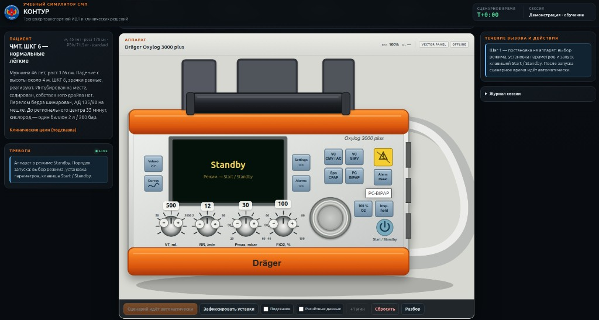
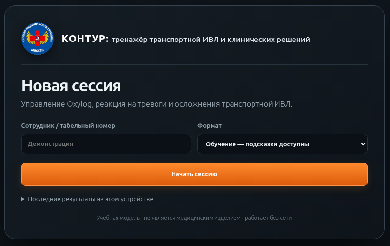
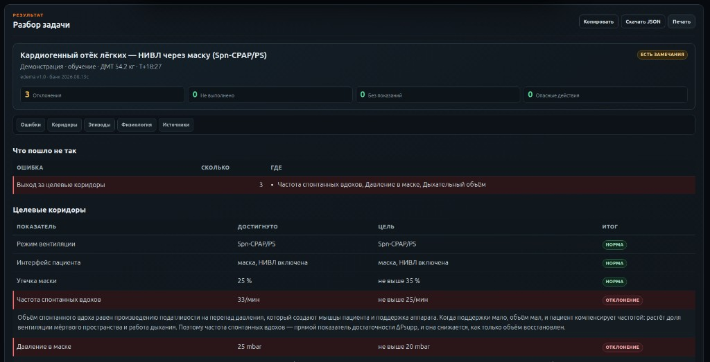

  
Краткий гайд пользователя

  <h1>КОНТУР</h1>
  
Тренажёр транспортной ИВЛ и клинических решений

  

## Что даёт тренажёр

- работа с панелью и режимами Oxylog 3000 plus без подключения к сети;
- связь уставок с `PIP`, `VTe`, `MVe`, `EtCO₂`, `SpO₂`, САД и запасом кислорода;
- реакции на тревоги, изменения механики лёгких и внезапное ухудшение пациента;
- 11 клинических задач: от ЧМТ и ОРДС до НИВЛ, ТЭЛА и метаболического ацидоза;
- автоматический разбор: ошибки, целевые коридоры, действия по эпизодам и физиология сессии.

Учебная модель, не сертифицированный симулятор производителя и не инструмент для принятия клинических решений.

# Быстрый старт

Стартовый экран: указать сотрудника, выбрать формат и нажать «Начать сессию».

## Первые действия

1. Открыть файл `kontur_trenazher.html` в современном браузере. Интернет не требуется.
2. Указать имя, выбрать режим **«Обучение»** и запустить сессию.
3. Выбрать задачу в верхней строке. Прочитать виньетку и **условие задачи**: требуемые режим и интерфейс пациента.
4. Нажать клавишу режима на панели и подтвердить выбор круглой ручкой.
5. Четыре физические ручки задают `VT`, `RR`, `Pmax`, `FiO₂`. Остальные параметры находятся в **Settings**.
6. В Settings: `↑/↓` выбирают строку; нажатие круглой ручки включает изменение; `↑/↓` меняют значение; повторное нажатие подтверждает.
7. Нажать **Start / Standby**. Сценарий идёт в реальном времени.

## Как читать рабочее окно

| Область | Для чего используется |
|---|---|
| Пациент | Виньетка, должная масса тела, условие задачи и клинические цели |
| Тревоги | Только активные тревоги аппарата; снятые тревоги остаются в журнале |
| Панель | Режим, уставки, кривые, Values, Settings, 100 % O₂, Insp. hold, Silence и Reset |
| Течение вызова | Только активное событие и относящиеся к нему действия |
| Журнал сессии | Уставки, тревоги, события и принятые решения в хронологическом порядке |

## Действия при новой вводной

1. Сначала оценить пациента, кривые, тревоги и измеряемые параметры.
2. При росте давления выполнить **Insp. hold**, если задача требует различить сопротивление и податливость.
3. Выбрать клиническое действие в правой колонке.
4. Если решение требует изменения режима или уставок, выполнить это отдельно органами управления аппарата.
5. После устранения причины событие исчезает из ленты, но остаётся в журнале.

## Подсказки, расчётные данные и темп

- **Подсказки** показывают ориентир по должной массе тела и особенности выбранного режима.
- **Расчётные данные** открывают учебные показатели, которых реальный аппарат напрямую не показывает: ауто-PEEP, задержанный объём, движущее давление, PaCO₂/pH, шунт.
- **+1 мин** используется для демонстрации, но блокируется, пока активное событие не отработано.
- **Разбор** открывается после завершения; в режиме «Оценка» — только в конце маршрута.

# Карта задач · 1–4

Эталон — проверенная точка внутри допустимого коридора, а не единственный правильный набор уставок. Формат объёмных режимов: `VT / RR / PEEP / Pmax / FiO₂ / I:E`. Для каждой задачи ниже указаны цель, ожидаемый ход и признаки, по которым решение проверяется.

## 1. ЧМТ, ШКГ 6 · интактные лёгкие

**Цель.** Поддерживать нормокапнию и не допустить вторичного повреждения мозга гипоксией или гипотензией. Профилактическая гипервентиляция не нужна.

**Старт:** VC-CMV; `500 / 13 / 5 / 40 / 40 % / 1:2`. Ориентиры: EtCO₂ 35–40, Pplat <30, САД ≥110, SpO₂ ≥94 %.

**T+18 — выросло давление, слева почти нет дыхания.** Выполнить Insp. hold, оценить симметрию и проверить глубину трубки. Одновременно выросшие PIP и Pplat при отсутствии коробочного звука и смещения трахеи указывают на интубацию правого главного бронха, а не на пневмоторакс.

**T+30 — кашель и борьба с аппаратом.** Углубить седацию/анальгезию; после снижения продукции CO₂ может потребоваться RR 14. Артериальную гипертензию изолированно не снижать.

**Ловушка:** игольная декомпрессия без признаков напряжённого пневмоторакса.

## 2. Вклинение · управляемая гипервентиляция

**Цель.** Исходно удерживать EtCO₂ 35–40; гипервентиляцию использовать только как временный мост при появлении признаков вклинения.

**Старт:** VC-CMV; `520 / 13 / 5 / 40 / 40 % / 1:2`.

**T+12 — анизокория, АД 195/100, ЧСС 46.** Повысить RR до 14 и добиться EtCO₂ 30–35. Объём не увеличивать: рост VT повышает плато и внутригрудное давление.

**T+26 — зрачки сравнялись, EtCO₂ 28.** Вернуть RR 13 и EtCO₂ 35–40. После разрешения признаков вклинения прежняя гипервентиляция становится ишемизирующей.

**Ловушки:** начать гипервентиляцию заранее; уйти ниже EtCO₂ 30; снижать компенсаторно высокое АД.

## 3. ОРДС на фоне пневмонии

**Цель.** Удерживать протективный объём и давление, принимая допустимую гиперкапнию ради ограничения повреждения лёгких.

**Старт:** VC-CMV; `380 / 20 / 10 / 45 / 80 % / 1:2`. Контроль: Pplat <30, движущее давление ≤15, pH ≥7,20, SpO₂ 88–96 %.

**T+15 — давление растёт при прежнем объёме.** Выполнить Insp. hold. Рост PIP и Pplat при неизменной разности между ними означает падение податливости. Снизить VT до 340 мл, увеличить RR до 26 и FiO₂ до 100 %.

**Почему так.** Малый VT снижает движущее давление; частота сохраняет минутную вентиляцию. Высокий PEEP допустим, потому что лёгкое рекрутабельно.

**Ловушки:** разобщение с потерей PEEP; повышение Pmax без оценки плато; сохранение прежнего VT при ухудшении податливости.

## 4. Лёгочный фиброз

**Цель.** Различить два механизма одинаковой тревоги `Paw high`: сопротивление потоку и падение податливости.

**Старт:** VC-CMV; `300 / 22 / 6 / 45 / 60 % / 1:2`. PEEP не выше 8: фиброзное лёгкое нерекрутабельно.

**T+8 — высокий PIP, клокочущие шумы в трубке.** Insp. hold показывает сохранное плато: выросло сопротивление. Выполнить санацию.

**T+20 — PIP и Pplat высокие, слева нет дыхания, коробочный звук и шок.** Это напряжённый пневмоторакс: выполнить игольную декомпрессию.

**Ловушка:** одинаково отвечать на оба эпизода. Решение определяется плато и осмотром, а не одной тревогой.

# Карта задач · 5–8

## 5. Тяжёлая астма

**Цель.** Дать пациенту выдохнуть. Главная опасность — динамическая гиперинфляция, а не высокий PIP сам по себе.

**Старт:** VC-CMV; `450 / 10 / 5 / 45 / 40 % / 1:3`. Контроль: поток выдоха возвращается к нулю, ауто-PEEP ≤5, Pplat <30, pH ≥7,15.

**T+8 — гипотензия, грудная клетка раздута симметрично.** Отсоединить аппарат, дать удлинённый пассивный выдох и применить бронхолитик. После стабилизации сохранить низкую RR и длинный выдох.

**T+22 — снова растёт PIP, в трубке секрет.** Insp. hold: плато не выросло → выполнить санацию.

**T+31 — неэффективные попытки на выдохе.** Углубить седацию/анальгезию и уменьшить внутреннее PEEP удлинением выдоха.

**Ловушка:** принять симметричную гиперинфляцию за напряжённый пневмоторакс.

## 6. ХОБЛ · внезапное ухудшение

**Цель.** На фоне исходной обструкции распознать новую одностороннюю катастрофу.

**Старт:** VC-CMV; `500 / 10 / 5 / 45 / 40 % / 1:3`. Исходная SpO₂ 88–92 % является целевой, нормализовать её до 100 % не требуется.

**T+6 — ухудшение за секунды.** Слева дыхание отсутствует, коробочный звук односторонний, трахея смещена, шейные вены набухли, АД падает. Немедленно выполнить игольную декомпрессию; одновременно прекратить нагнетание положительным давлением.

**Почему это не гиперинфляция.** Гиперинфляция при обструкции симметрична; здесь все ключевые признаки односторонние.

**Ловушка:** пытаться лечить воздух в плевральной полости изменением уставок.

## 7. Тяжёлый метаболический ацидоз

**Цель.** После интубации воспроизвести собственную компенсаторную гипервентиляцию пациента и не обрушить pH.

**Старт:** VC-CMV; `420 / 26 / 5 / 40 / 40 % / 1:2`. Контроль: MVe ≥10,5 л/мин, pH ≥7,05, ауто-PEEP ≤5.

**T+9 — АД 82/50, сухая кожа, низкое ЦВД.** Давления и выдох не изменились: причина — гиповолемия при ДКА. Выполнить инфузию, не снижая минутную вентиляцию.

**T+20 — EtCO₂ и PaCO₂ растут вместе, дрожь и лихорадка.** Возросла продукция CO₂. Углубить седацию/анальгезию и увеличить RR до 30.

**Ловушка:** поставить обычную RR 12–14 и тем самым отменить компенсацию ацидоза.

## 8. Массивная ТЭЛА

**Цель.** Поддержать правый желудочек и не принять низкий EtCO₂ за достаточную вентиляцию.

**Старт:** VC-CMV; `500 / 16 / 5 / 40 / 60 % / 1:2`. Контроль: PEEP ≤8, MVe ≥7,5, САД ≥80.

**T+7 — EtCO₂ падает, PaCO₂ растёт, АД 70/45.** Расходящиеся показатели означают падение лёгочного кровотока. Начать/усилить вазопрессорную поддержку.

**T+18 — SpO₂ резко падает без изменения механики.** Повысить FiO₂ до 100 %. PEEP не увеличивать: нерекрутабельный шунт и перегруженный ПЖ от этого не выигрывают.

**Ловушка:** болюс жидкости при набухших шейных венах и высоком давлении наполнения.

# Карта задач · 9–11 и автоматический разбор

## 9. Кардиогенный отёк лёгких · НИВЛ

**Цель.** Использовать положительное давление для рекрутирования альвеол и снижения постнагрузки ЛЖ, сохранив самостоятельное дыхание.

**Старт:** Spn-CPAP/PS, маска, НИВЛ включена; `CPAP 8`, `ΔPsupp 8`, Trigger 3, `FiO₂ 80 %`. Контроль: утечка ≤35 %, частота собственных вдохов ≤25, давление в маске ≤20 mbar.

**T+6 — свист у переносицы, объёмы выглядят высокими, SpO₂ падает.** Сначала подогнать маску, затем дать нитраты; после рекрутирования снизить FiO₂ до 50 %. При НИВЛ аппарат считает часть утечки объёмом, поэтому VTe/MVe могут выглядеть ложно благополучно.

**T+16 — объём вдоха падает, частота растёт.** Дыхательные мышцы истощаются. Увеличить ΔPsupp до 13, снизив CPAP до 7, чтобы суммарное давление осталось ≤20.

**Ловушки:** повышать давление до устранения утечки; интубировать при сохранном сознании до исчерпания резерва поддержки.

## 10. ХОБЛ с гиперкапнией · НИВЛ

**Цель.** Разгрузить дыхательные мышцы, улучшить pH и заранее распознать отказ НИВЛ.

**Старт:** PC-BIPAP/PS, маска, НИВЛ включена; `Pinsp 18`, `PEEP 5`, `ΔPsupp 14`, `RR 12`, Trigger 3, `FiO₂ 40 %`, I:E 1:3. Цель SpO₂ 88–92 %, pH 7,28–7,47.

**T+7 — большая утечка и десинхрония.** Подогнать маску; после герметизации установить `Pinsp 20`, `ΔPsupp 12`. Повышение давления при негерметичной маске увеличивает утечку.

**T+18 — сонливость, слабый кашель, pH 7,20.** Условия НИВЛ утрачены: интубировать, выключить НИВЛ, перейти к управляемой вентиляции (`Pinsp 22`, `RR 10`, длинный выдох).

**Ловушка:** продолжать масочную вентиляцию у пациента, который перестал защищать дыхательные пути.

## 11. Возвращение собственного дыхания

**Цель.** Не подавлять восстановившийся драйв, а дать пациенту место для собственных вдохов с поддержкой.

**Старт:** VC-AC; `520 / 12 / 5 / 40 / 50 % / 1:2`, Trigger 3.

**T+9 — измеренная частота выше заданной, на кривой давления провалы.** В VC-AC каждая попытка получает полный VT, поэтому развивается гипервентиляция. Перейти в VC-SIMV/PS, установить `RR 10`, `ΔPsupp 10`.

**T+24 — собственный вдох стал меньше, частота выросла.** Увеличить ΔPsupp до 14. Поддержку подбирать по паре «объём собственного вдоха — его частота».

**Ловушки:** углублять седацию при восстановлении функции; повышать частоту аппаратных вдохов вместо поддержки.

## Как читать автоматический разбор

В начале показан итог и четыре счётчика: отклонения от коридоров, невыполненные действия, действия без показаний и опасные действия. Ниже находятся пять разделов:

1. **Что пошло не так** — краткий перечень замечаний и точные места в сессии.
2. **Целевые коридоры** — достигнутое значение, цель и физиология каждого отклонения.
3. **Эпизоды** — время распознавания и коррекции; подробности раскрываются нажатием на эпизод.
4. **Физиология сессии** — крайние значения механики, газообмена и гемодинамики.
5. **Источники и ограничения** — основа сценария и границы модели.

Чистые эпизоды свёрнуты, проблемные раскрыты автоматически. Разбор можно скопировать, распечатать или сохранить вместе с JSON-отчётом.

# Пример автоматического разбора

Фрагмент разбора задачи «Кардиогенный отёк лёгких — НИВЛ через маску».

На верхней панели сразу виден результат: три отклонения от целевых коридоров, при этом обязательные действия выполнены, действий без показаний и опасных решений не было. Ниже тренажёр показывает:

- конкретные показатели, вышедшие за коридор;
- достигнутое значение рядом с целевым;
- физиологическое объяснение каждого отклонения;
- отдельные вкладки эпизодов, физиологии и источников.

В приведённом прохождении клинические действия выполнены, но настройки поддержки оказались избыточными: частота спонтанных вдохов оставалась высокой, давление в маске превысило предел, а дыхательный объём вышел за целевой диапазон. Поэтому итог — «есть замечания», хотя ошибок в выборе обязательных действий нет.
