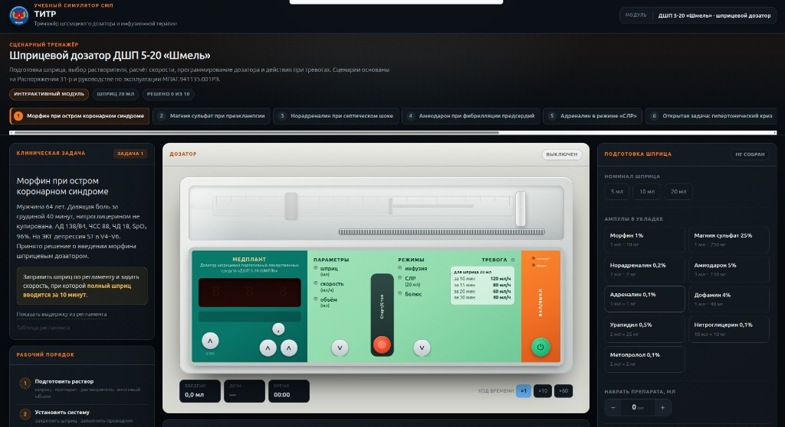
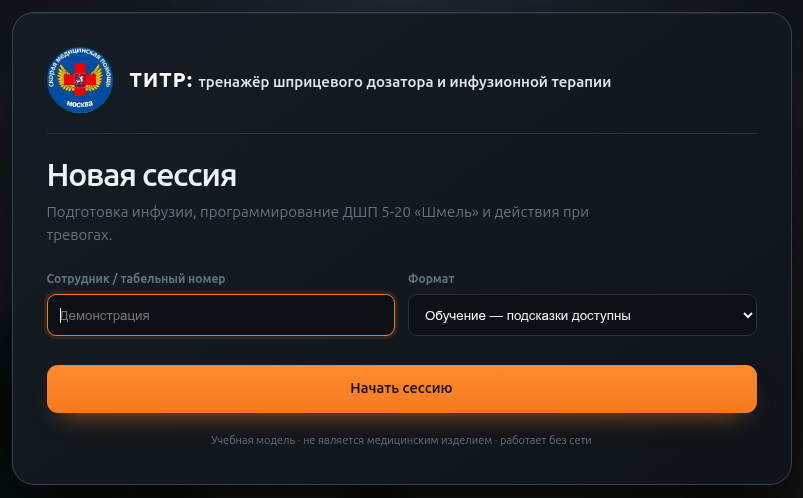
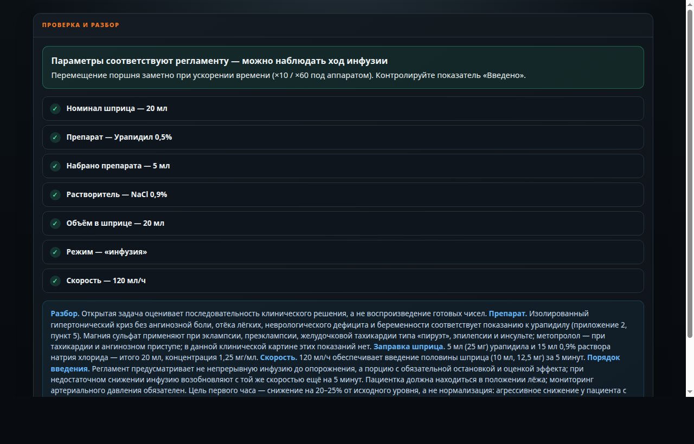

  
Краткий гайд пользователя

  <h1>ТИТР</h1>
  
Тренажёр шприцевого дозатора ДШП 5-20 «Шмель»

  

## Что даёт тренажёр

- отработка сборки шприца, выбора растворителя, режима и скорости инфузии;
- работа с виртуальной панелью дозатора «Шмель» без подключения к сети;
- расчёт скоростей по времени, массе и дозе в мкг/кг·мин;
- клинические вводные и действия при тревоге `УС‾`;
- 10 задач по схемам Распоряжения 31-р с проверкой и разбором.

Учебная модель, не медицинское изделие и не замена Руководству по эксплуатации. При расхождении приоритет имеют Распоряжение 31-р и документация производителя.

# Быстрый старт

Стартовый экран: указать сотрудника, выбрать формат и нажать «Начать сессию».

## Первые действия

1. Открыть `titr_trenazher.html` в современном браузере. Интернет не требуется.
2. Указать имя, выбрать **«Обучение»** или **«Оценка»**, нажать **«Начать сессию»**.
3. Выбрать задачу сверху и прочитать виньетку. Слева — условие и рабочий порядок, справа — сборка шприца.
4. Выбрать шприц, препарат, объём набора, растворитель и итоговый объём; установить шприц и заполнить магистраль.
5. Включить дозатор. После самотеста выбрать режим кнопкой **РЕЖИМЫ**.
6. Кнопкой **ПАРАМЕТРЫ** пройти: шприц → скорость → `РАБ`. Цифры меняются тремя кнопками разрядов; для дробной скорости нужна кнопка **`,`**.
7. Нажать **Старт/Стоп**. Сначала тренажёр проверит сборку и настройки; при ошибке подача не начнётся.

## Как читать рабочее окно

| Область | Для чего используется |
|---|---|
| Задача | Клиническая виньетка, требование, подсказка и таблицы регламента |
| Дозатор | Режим, параметры, дисплей, введённый объём, доза и время |
| Подготовка | Шприц, ампула, растворитель, установка и заполнение линии |
| Проверка и разбор | Отдельная проверка каждого параметра и объяснение эталона |
| Журнал | Все действия по времени; журнал можно скопировать |

## Подсказки, события и темп

- В **обучении** доступна выдержка или ориентир; в **оценке** подсказки скрыты.
- Для весовых задач скорость ищется в **Таблице регламента**, а не выдаётся готовым числом.
- Скорость времени `×1 / ×10 / ×60` меняет только темп демонстрации.
- При новой вводной или тревоге подача останавливается. Выбрать действие, прочитать объяснение и при необходимости возобновить инфузию кнопкой **Старт/Стоп**.

# Карта задач · 1–4

Все задачи используют шприц 20 мл. Скорость указана в мл/ч. Число — эталон конкретной задачи, а не универсальное назначение вне её условий.

## 1. Морфин при ОКС

**Цель:** ввести морфин с контролируемой скоростью.  
**Сборка:** морфин 1 мл + NaCl 19 мл; режим инфузии; `120 мл/ч`. Концентрация 0,5 мг/мл, темп — 1 мг/мин.  
**Ход:** дозу титруют до купирования боли; опорожнять весь шприц не требуется. Контролировать сознание, ЧД, SpO₂ и АД, держать доступным налоксон.  
**Ловушки:** режим «болюс», неверное разведение или попытка трактовать «медленно» без расчёта.

## 2. Магния сульфат 4 г за 15 минут

**Цель:** отличить назначенную дозу от другой ступени регламента.  
**Сборка:** магния сульфат 20 мл **без разведения**; режим инфузии; `64 мл/ч` — за 15 минут вводятся 16 мл, то есть 4 г.  
**Контроль:** коленные рефлексы и дыхание; при токсичности последовательность типична: утрата рефлекса → угнетение дыхания → остановка сердца.  
**Ловушки:** `240 мл/ч` относится к 5 г за 5 минут; разведение вдвое уменьшает концентрацию. Глюконат кальция должен быть готов.

## 3. Норадреналин, 70 кг

**Цель:** рассчитать `0,1 мкг/кг·мин` и безопасно устранить окклюзию.  
**Сборка:** норадреналин 4 мл + глюкоза 16 мл; `1,1 мл/ч`; магистраль заполнить препаратом.  
**Вводная:** тревога `УС‾` из-за линии под манжетой АД — остановить подачу, осмотреть линию, устранить причину и возобновить.  
**Почему:** при 1,1 мл/ч незаполненная линия объёмом 2–3 мл задержит поступление препарата более чем на два часа. Второй шприц готовят заранее.  
**Ловушки:** незаполненная магистраль, повышение скорости и ручной болюс вазопрессора.

## 4. Амиодарон 300 мг за 30 минут

**Цель:** выбрать совместимый растворитель и темп задачи.  
**Сборка:** амиодарон 6 мл + глюкоза 14 мл; концентрация 15 мг/мл; `40 мл/ч` опорожняет шприц за 30 минут.  
**Почему:** быстрое введение повышает риск гипотензии и брадикардии; меньший темп при стабильной гемодинамике безопаснее.  
**Ловушки:** NaCl из-за риска преципитации; `80 мл/ч` допускается пределом регламента, но не соответствует заданным 30 минутам.

# Карта задач · 5–8

## 5. Адреналин, режим «СЛР»

**Цель:** настроить автоматическое порционное введение.  
**Сборка:** адреналин 4 мл + NaCl 16 мл; режим **СЛР**, порция `5,0 мл`; линию заполнить NaCl.  
**Почему:** 5 мл раствора содержат 1 мг адреналина; дозатор вводит порцию каждые 4 минуты 10 секунд. Режим СЛР работает только со шприцем 20 мл.  
**Ход:** первую дозу вводят вручную, компрессии ради подключения дозатора не прерывают; после остановки отсчёт интервала начинается заново.  
**Ловушки:** инфузионный режим, порция 3 мл, заполнение линии препаратом без учёта мёртвого объёма.

## 6. Открытая задача: гипертонический криз

**Цель:** самостоятельно выбрать препарат и этапное введение.  
**Решение:** урапидил 5 мл + NaCl 15 мл; `120 мл/ч`. После половины шприца остановить инфузию и оценивать эффект 5 минут.  
**Далее:** при недостаточном эффекте продолжить с прежней скоростью; при `УС‾` осмотреть всю линию и освободить перегиб.  
**Контроль:** пациентка лежит, АД измеряется повторно; цель первого часа — снижение примерно на 20–25 % от исходного, не нормализация.  
**Ловушки:** вводить весь шприц непрерывно, форсировать скорость или вводить остаток вручную.

## 7. Дофамин, 80 кг

**Цель:** найти скорость для `10 мкг/кг·мин` по таблице 3.  
**Сборка:** дофамин 1 мл + NaCl 19 мл; концентрация 2 мг/мл; `24 мл/ч`. Проверка расчётом: `10 × 80 × 0,03 = 24`.  
**Проверка:** в таблице выбрать одновременно правильные массу и дозу; совпадение только одной координаты ответа не даёт.  
**Ловушки:** глюкоза вместо NaCl и строка другой массы или дозы в таблице.

## 8. Норадреналин, ребёнок 15 кг

**Цель:** применить детскую концентрацию и таблицу 2.  
**Сборка:** норадреналин 1 мл + глюкоза 19 мл; концентрация 100 мкг/мл; `4,5 мл/ч`; линию заполнить препаратом. Это соответствует `0,5 мкг/кг·мин`.  
**Ловушка:** взрослая смесь 4 + 16 имеет концентрацию 400 мкг/мл и при той же скорости даст `2 мкг/кг·мин` — четырёхкратную дозу.

# Карта задач · 9–10

## 9. Метопролол при тахисистолии

**Цель:** ввести первую дозу этапно, а не опорожнить шприц.  
**Сборка:** метопролол 10 мл + NaCl 10 мл; `120 мл/ч`. За 5 минут вводятся первые 10 мл, то есть 5 мг.  
**Далее:** остановить подачу и оценить ЧСС, АД, проводимость; повтор зависит от эффекта и противопоказаний.  
**Ловушка:** воспринимать полный шприц как одну непрерывную дозу.

## 10. Открытая задача: отёк лёгких

**Цель:** выбрать нитропрепарат и перевести назначение из мг/ч в мл/ч.  
**Сборка:** нитропрепарат 10 мл + NaCl 10 мл; концентрация 0,5 мг/мл; `8 мл/ч` соответствует 4 мг/ч.  
**Почему:** клиника отёка лёгких с высоким АД и без признаков инфаркта правого желудочка делает нитраты подходящим выбором.  
**Ловушки:** урапидил вместо венодилатации и ошибка при переводе мг/ч в мл/ч.

## Как читать проверку и разбор

После **Старт/Стоп** карточка сверяет отдельно:

1. шприц, препарат, набранный объём и растворитель;
2. итоговый объём, режим и скорость;
3. объём порции СЛР и заполнение линии — когда это требуется.

При ошибке подача не начинается: красная строка указывает, что именно исправить. При полном совпадении задача получает отметку, появляется объяснение выбора препарата, концентрации, расчёта и порядка введения. По ходу инфузии отдельные вводные проверяют клинические действия.

«Решено» означает совпадение сборки и настроек с эталоном задачи. Это не отменяет клинический контроль пациента, показаний и противопоказаний.

## Границы модели

- Разбор формируется **для каждой задачи**, общего отчёта за весь маршрут нет; полную хронологию можно получить копированием журнала.
- В текущем банке моделируется тревога `УС‾`; это не полный набор сигналов реального дозатора.
- Ускорение времени и интервал СЛР нужны для демонстрации, а режим «болюс» воспроизведён упрощённо.
- Тренажёр проверяет 10 учебных сценариев и не охватывает все препараты и варианты Распоряжения 31-р.

# Пример автоматического разбора

Задача 6: все параметры совпали с эталоном, ниже открыт клинический разбор.

В примере тренажёр подтвердил шприц 20 мл, урапидил, разведение `5 + 15`, режим инфузии и скорость `120 мл/ч`. Затем разбор связывает настройки с клинической логикой:

- урапидил выбран для изолированного гипертонического криза без отёка лёгких, ангинозной боли и неврологического дефицита;
- концентрация составляет 1,25 мг/мл;
- половина шприца вводится за 5 минут, после чего обязательны остановка и оценка эффекта;
- цель — контролируемое снижение АД, а не немедленная нормализация.

После успешной проверки задача продолжается: тренажёр выдаёт остановку после половины шприца, а затем моделирует тревогу `УС‾`. Поэтому зелёная карточка — не конец сценария, а подтверждение корректной подготовки к его клинической части.
