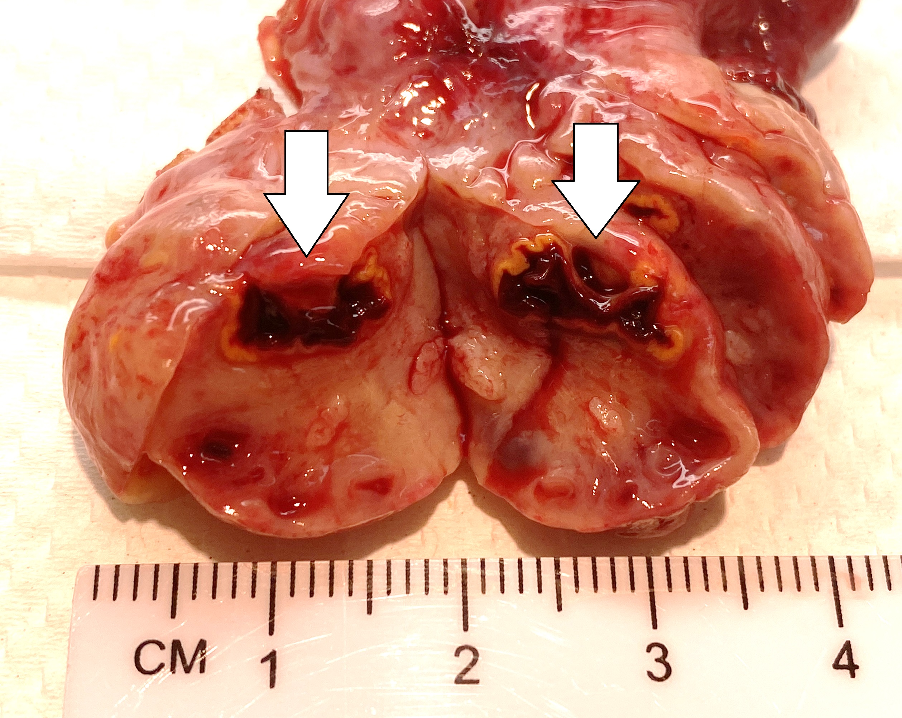
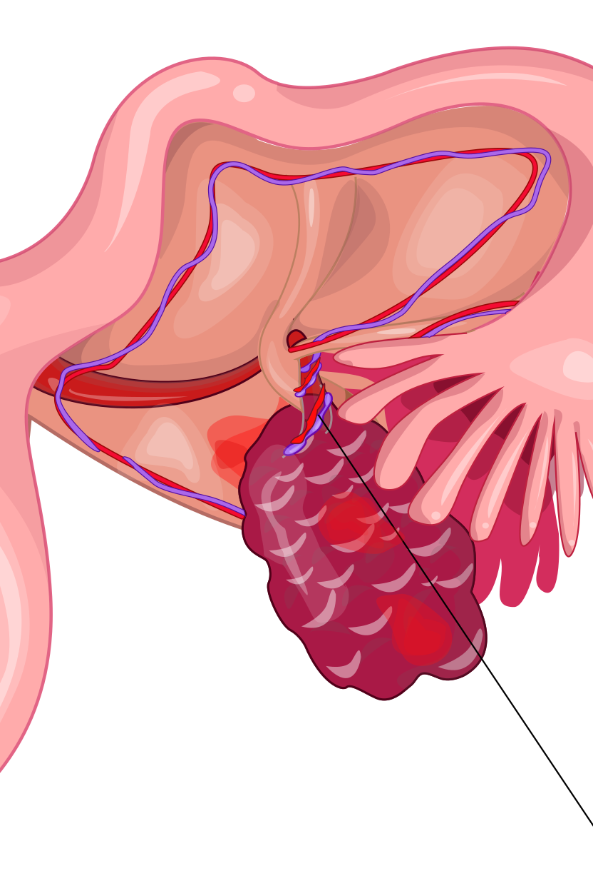
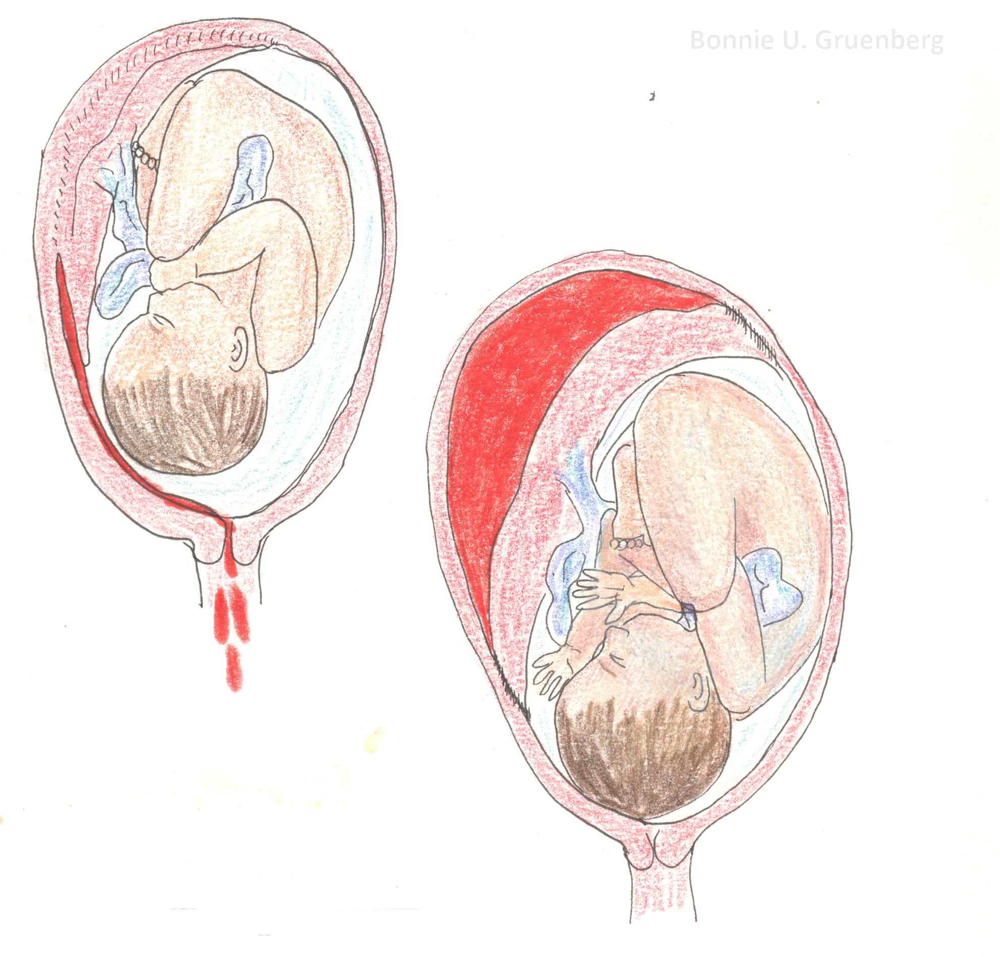
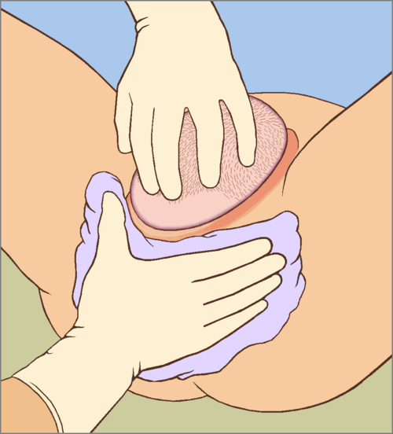
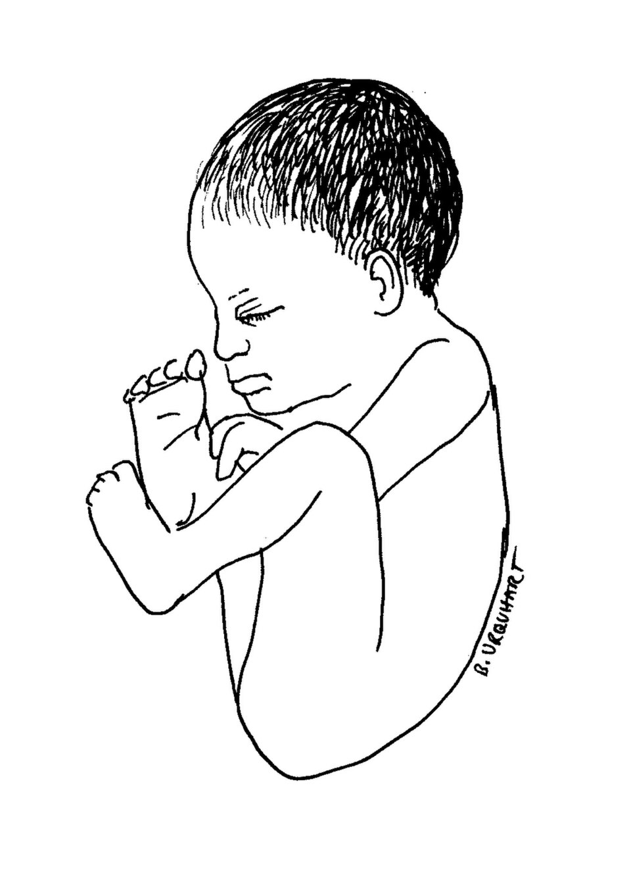
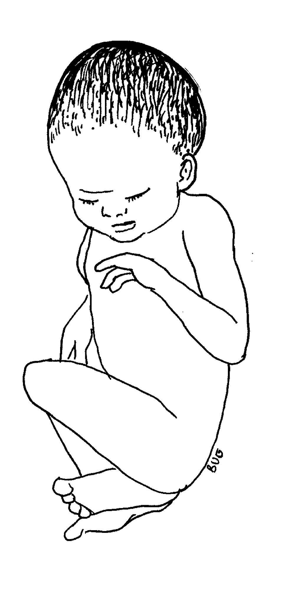
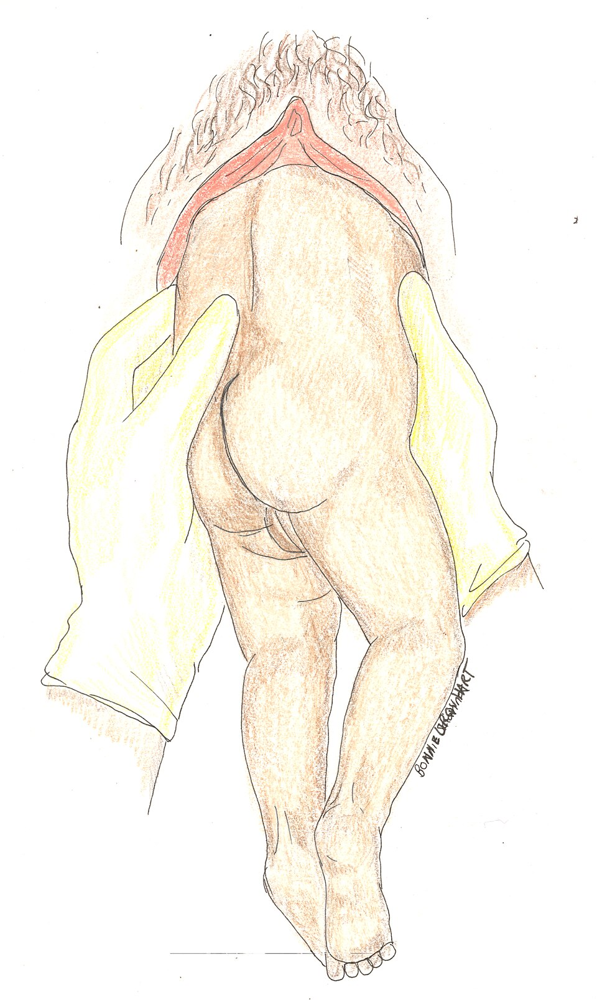

  
Учебный материал

  
Акушерство на линии

  
Кровотечения, гипертензия, ТЭЛА и решение о маршрутизации: от осмотра до принятия родов

  

  
По материалам практического занятия на Центральной подстанции СМП Москвы, август 2026 г., и Алгоритмам СМП 2025, раздел 9.

  
Эпизоды, которыми лектор иллюстрировал темы, оставлены внутри этих тем и обезличены.

  
Серия «Крещение поворотом» · версия 1.7 · 24 августа 2026 · CC BY-NC-SA 4.0

На занятии разбирались не теоретические основы акушерства, а конкретные развилки действий бригады скорой помощи: когда везти немедленно, когда согласовывать тактику через консультантов и в каких случаях принимать роды на месте.

# Общее правило связи

При возникновении экстренной ситуации рекомендуется использовать короткую формулировку **«у нас срочно»**. Это позволяет диспетчеру пульта сразу выделить вызов из общего потока заявок без дополнительных расспросов.

# Кровотечения и патология органов малого таза

## Аномальные маточные кровотечения

Под **аномальным маточным кровотечением (АМК)** понимают любые отклонения менструального цикла по объёму, длительности, регулярности или частоте. На догоспитальном этапе различить гормональные причины и органические невозможно, поэтому устаревший термин «дисфункциональное кровотечение» больше не используется.

При активном кровотечении — венозный доступ, транексамовая кислота 1000 мг внутривенно, транспортировка на носилках. При шоке действуют по соответствующему протоколу (Алгоритмы СМП 2025, N92, N93, N95).

Скудные мажущие выделения без признаков анемии и гемодинамических нарушений не закрываются как жизнеугрожающее кровотечение. В таких случаях бригада звонит на акушерский пункт станции: акушеры перезванивают сами и задают дальнейшую тактику. На занятии эту группу называли кодом N90.8. В алгоритме госпитализируемые кровотечения стоят под N92–N93 и N95; при расхождении приоритет у справочника станции и у алгоритма.

Смысл развилки в том, чтобы не смешивать два решения. Активное кровотечение — эвакуация и транексам без лишних звонков. Скудные выделения без кровопотери — не «ничего», а консультация пункта.

## Патология яичника

В алгоритмах апоплексия, перекрут и разрыв кисты объединены кодом N83: на линии их надёжно разделить сложно, а задержка эвакуации недопустима. Различия нужны затем, чтобы не принять одно состояние за другое и не ждать «типичного дня цикла».

**Апоплексия яичника** — кровоизлияние в ткань яичника с возможным нарушением целости капсулы и кровотечением в брюшную полость. На занятии называли три клинических варианта — болевой, анемический и смешанный: это не три болезни, а три способа, которыми одно событие доходит до бригады.

Боль внезапная, чаще односторонняя, может отдавать в крестец, копчик или ногу. Возможна в любую фазу цикла; чаще кровоточит жёлтое тело в лютеиновую фазу, но «четырнадцатый день» условием диагноза не является. Наружного кровотечения обычно нет: кровь уходит в брюшную полость, женщина бледнеет при сухих простынях. Пока нет перитонита, живот может оставаться мягким, но болезненным (симптом Куленкампфа). При массивном излитии кровь достигает диафрагмы и даёт боль в плече (симптом Кера).

Её отличают от **овуляторного синдрома (mittelschmerz)** — короткой односторонней боли в середине цикла без падения давления и без картины внутрибрюшного кровотечения.

<figure class="portrait">

<figcaption>Рис. 1. Геморрагическое жёлтое тело на разрезе: полость со свёртком и жёлтый ободок лютеиновой ткани. Наиболее частый субстрат апоплексии яичника. Макропрепарат, не вид с линии. Mikael Häggström, Wikimedia Commons, CC0.</figcaption>
</figure>

**Перекрут яичника** — поворот органа вокруг сосудистой ножки с ишемией и угрозой некроза. Часто перекручивается весь придаток. Характерны волнообразная боль, почти постоянная тошнота и рвота. Окно до необратимой гибели ткани при полном перекруте — около 6–8 часов. Допплер, который «видит» кровоток, перекрут не исключает: яичник имеет двойное кровоснабжение, перекрут может быть перемежающимся, на ранней стадии сдавливаются вены, а артерии ещё пульсируют.

<figure class="portrait">

<figcaption>Рис. 2. Схема перекрута придатка: яичник увеличен и застойный, ножка перекручена, сосуды идут спиралью. Hariadhi, Wikimedia Commons, CC BY-SA 4.0. Английские подписи исходного файла сняты при кадрировании.</figcaption>
</figure>

**Разрыв кисты** — вскрытие полости образования. Боль острая; после пика может ослабнуть (декомпрессия). Тяжесть зависит от содержимого: серозная жидкость раздражает брюшину, геморрагическая даёт шок, дермоидная (жир и волосы) — тяжёлый химический перитонит.

| | Апоплексия | Перекрут | Разрыв кисты |
|---|---|---|---|
| Что происходит | Кровоизлияние в ткань яичника | Поворот вокруг ножки, ишемия | Вскрытие полости кисты |
| Боль | Внезапная, держится | Внезапная, волнами | Внезапная, после пика может ослабеть |
| Рвота | Не обязательна | Почти всегда | Не обязательна |
| Наружное кровотечение | Обычно нет | Нет | Нет |
| Чем кончается без операции | Гемоперитонеум, шок | Некроз придатка | Раздражение брюшины или шок — по содержимому |

Помощь во всех трёх случаях одинакова: венозный доступ, натрия хлорид 250–500 мл, транексамовая кислота 1000 мг или этамзилат 500 мг, госпитализация на носилках. Транексам имеет смысл при кровотечении в полость; при «чистом» перекруте без гемоперитонеума он не лечит ишемию. Маршрут от этого не меняется.

## Внематочная беременность

**Внематочная беременность** — имплантация плодного яйца вне полости матки, чаще всего в трубе. Труба не способна растягиваться, поэтому исходов два: трубный аборт или разрыв трубы.

**Прогрессирующая форма.** Плодное яйцо ещё цело, труба цела. Жалобы скудные; задержки менструации нет почти у половины пациенток. Лечение на этапе скорой помощи не проводится; обязательна эвакуация.

**Нарушенная форма.**

- **Трубный аборт.** Плодное яйцо сбрасывается через фимбриальный конец, стенка трубы не рвётся на всём протяжении. Стертая картина, периодические боли, которые пациентка может терпеть неделями. Кровь течёт медленно; шока может не быть днями.
- **Разрыв трубы.** Кинжальная боль, холодный пот, коллапс. Кровотечение массивное за минуты. По алгоритму: пульсоксиметрия, венозный доступ, натрия хлорид 250–500 мл, транексамовая кислота 1000 мг, эвакуация; при шоке — протокол геморрагического шока.

Живот осматривают целиком, включая верхние отделы. Внематочная беременность, тяжёлая преэклампсия и разрыв матки по дну могут давать картину, неотличимую от острого хирургического живота. Если клиника удерживает оба диагноза, в карте фиксируют двойной, а не «более удобный» один, и вызывают акушерский пульт.

# Тромбоэмболия лёгочной артерии

Беременность — тромбогенное состояние с первого триместра. Меняется свёртываемость; матка сдавливает вены таза. Эмбол может уйти из тазовых и проксимальных вен нижней конечности.

Симптомы: необъяснимая одышка, тахикардия, обмороки, кровохарканье. Кровохарканье нельзя закрывать как катаральную жалобу и нельзя лечить мукалтином: это маркер повреждения сосудов лёгких, а не показание к отхаркивающему.

ЭКГ при субмассивной ТЭЛА часто нормальная. Классический S1Q3T3 встречается редко и поздно. Отсутствие гипотонии означает лишь то, что компенсация пока держит системное давление; нагрузка на малый круг при этом уже может быть критической. Кардиопульту передаётся клиника целиком, включая обмороки и кровохарканье, а не только «плёнка без изменений».

**Эпизод с занятия.** Женщина на сроке 10 недель, кровохарканье, слабость, SpO₂ 95 %, частота сердечных сокращений 110. Назначены мукалтин и инфекционная маршрутизация. Итог — судороги и клиническая смерть в стационаре. Диагноз — тромбоэмболия лёгочной артерии — был пропущен, потому что дыхательную жалобу списали на простуду.

# Гипертензивные расстройства после 20 недель

Три состояния, граница между которыми проходит по сроку 20 недель.

**Хроническая артериальная гипертензия** существовала до беременности или выявлена до 20 недель.

**Гестационная артериальная гипертензия** появилась после 20 недель без протеинурии и без поражения органов.

**Преэклампсия** — давление выше 140/90 мм рт. ст. плюс протеинурия или симптомы поражения органов (головная боль, зрительные нарушения, боль в эпигастрии или правом подреберье, олигурия, отёк лёгких, HELLP). Возможна послеродовая форма.

**Эклампсия** — судороги на фоне преэклампсии, не объяснимые другой причиной.

**HELLP-синдром** — гемолиз, повышение печёночных ферментов и тромбоцитопения. Клинический вход на линии — боль в эпигастрии или правом подреберье у беременной с гипертензией.

Проблема преэклампсии начинается в плаценте. Сосуды остаются узкими, возникает ишемия, в кровь матери поступают факторы, повреждающие эндотелий. Давление растёт не чтобы помочь плоду, а как следствие спазма. Маточно-плацентарный кровоток собственной ауторегуляции не имеет и падает вместе с системным. Поэтому снижать давление ниже целевого опасно.

| Картина | Помощь по Алгоритмам СМП 2025 |
|---|---|
| Умеренная, без симптомов: АД 140–160 / 90–110 | Нифедипин 10 мг **внутрь**. Сублингвально противопоказан |
| Та же цифра плюс головная боль, нарушение зрения, боль в эпигастрии или правом подреберье | Нифедипин 10 мг внутрь и магния сульфат 4000 мг (16 мл) внутривенно за 10–15 мин, затем инфузия 1000 мг/ч |
| Тяжёлая: АД ≥ 160/110 независимо от самочувствия | Тот же объём, что при умеренной с симптомами |
| Цель снижения | Систолическое 130–150, диастолическое 80–95 мм рт. ст. Ниже 100/80 не снижать |

Магния сульфат здесь нужен не для снижения давления, а для профилактики судорог (блокада NMDA-рецепторов). Давление снижает нифедипин. «Капнуть магнезию вместо нифедипина» гипертензию не лечит; «только нифедипин» при симптомах не закрывает судорожный риск.

Боль в правом подреберье при высоком давлении — вход в HELLP-синдром, а не гастрит по умолчанию. На линии лабораторного подтверждения нет; есть боль, которая уже меняет объём помощи.

# Отслойка плаценты и разрыв матки

## Преждевременная отслойка нормально расположенной плаценты

**ПОНРП** — отделение плаценты, расположенной вне области внутреннего зева, от стенки матки до рождения плода. Главная ловушка: наружное кровотечение есть далеко не всегда.

**Ретроплацентарная гематома** — скопление крови между плацентой и стенкой матки. Она растёт, отслаивает плаценту дальше; мать теряет кровь иногда всю внутрь.

**Краевая отслойка** — кровь находит путь наружу по оболочкам; болевого синдрома может не быть.

**Центральная отслойка** — без сообщения с краем: выделений нет, боль выражена, матка напряжена.

**Смешанная** — есть и гематома, и наружное кровотечение.

<figure>

<figcaption>Рис. 3. Сверху — краевая отслойка: кровь находит путь наружу. Снизу — центральная: ретроплацентарная гематома без выделений. Bonnie Urquhart Gruenberg, Wikimedia Commons, CC BY-SA 4.0.</figcaption>
</figure>

| Форма | Кровь снаружи | Боль | Что происходит |
|---|---|---|---|
| Краевая | Есть | Может не быть | Отслойка с края, кровь стекает по оболочкам |
| Центральная | Нет | Выраженная | Ретроплацентарная гематома; матка «деревянная» |
| Смешанная | Есть и гематома, и выделения | Боль плюс выделения | Сочетание обоих путей |

Объём наружной крови не равен объёму кровопотери. При центральной отслойке женщина бледнеет при сухих пелёнках. **Матка Кувелера** — пропитывание миометрия кровью: матка напряжённая, «деревянная», теряет способность сокращаться.

Тактика (O45): венозный доступ, натрия хлорид 250–500 мл, транексамовая кислота 1000 мг, быстрая доставка. Влагалищное исследование запрещено: одновременно может быть предлежание плаценты.

## Разрыв матки

Чаще происходит по старому рубцу. На занятии разделяли постепенное расхождение и свершившийся разрыв.

**Расхождение рубца.** Рубец расходится постепенно. Возможны покалывания, локальное западение (**симптом ниши**). Может пролабировать часть плода. Шока может не быть: катастрофа анатомически уже случилась.

**Эпизод с занятия.** Женщина впервые встала на учёт в 27 недель. В разошедшийся рубец провалилась пяточка плода; ногу сохранить не удалось. До этого не было ни кинжальной боли, ни шока.

**Свершившийся разрыв.** Кинжальная боль, шок; предлежащая часть перестаёт пальпироваться над входом в таз — плод уходит в брюшную полость. Схватки могут оборваться.

**Симптом Вастена** — головка стоит высоко и нависает над лоном, не вставляясь в таз. Это маркер препятствия и угрозы разрыва, а не доказанный разрыв.

Тактика (O71): венозный доступ, натрия хлорид 250–500 мл; при начавшемся и свершившемся разрыве — транексамовая кислота 1000 мг; срочная эвакуация на носилках.

# Роды: осмотр и принятие решения

## Приёмы Леопольда

Четыре наружных приёма пальпации отвечают на четыре вопроса: что в дне, где спинка, что предлежит, насколько предлежащая часть вошла во вход в таз.

Первый — обе ладони на дне матки. Второй — руки по бокам: спинка и мелкие части. Третий — захват предлежащей части над лоном одной рукой; на занятии отдельно сказано, что приём может быть болезненным. Четвёртый — обе руки к тазу, отношение предлежащей части ко входу.

<figure class="portrait">

<figcaption>Рис. 4. Приёмы Леопольда. Fig. 1 — дно матки. Fig. 2 — стороны матки. Fig. 3 — предлежащая часть над входом, одной рукой. Fig. 4 — отношение предлежащей части ко входу. Christian Gerhard Leopold, 1894; общественное достояние.</figcaption>
</figure>

Наружные приёмы не заменяют решение «рожать здесь или везти». Стоит ли головка уже в полости или в выходе, на занятии решали методом Пискачека.

## Метод Пискачека

Это наружное определение положения головки, а не влагалищное исследование и не одноимённый признак ранней беременности (асимметрия матки, Piskaček, 1899).

Роженица лежит на спине, ноги согнуты в коленных и тазобедренных суставах и разведены. Исследующий садится справа. Второй и третий пальцы в стерильной марле ставят по боковому краю правой большой половой губы и давят вглубь параллельно влагалищной трубке, **не входя в просвет влагалища**. Если пальцы встречают головку, она уже в полости или выходе таза: роды принимают на месте — сначала туалет, смена пелёнки и белья, затем пособие. Если головка не встречена — эвакуация.

Открытой лицензионной схемы метода нет.

## Домашние роды

Если роды начались вне стационара и головка уже в выходе, случай закрывается кодом O80. Объём помощи: аускультация сердцебиения плода, венозный доступ, акушерское пособие, окситоцин 10 МЕ внутримышечно в бедро после рождения ребёнка, осмотр последа и обязательная доставка его в роддом вместе с матерью, контроль каждые 15 минут в течение двух часов.

# Биомеханизм и пособие в родах

**Биомеханизм родов** — последовательность движений, которыми предлежащая часть проходит костный таз. Пособие не вытаскивает ребёнка: оно не мешает сгибанию, повороту и разгибанию и удерживает промежность.

## Передний вид затылочного предлежания

Головка входит малым косым размером, сгибается, совершает внутренний поворот, в выходе разгибается: рождаются затылок, темя, лоб, лицо, подбородок. Затем наружная ротация и рождение плечиков.

Главное правило пособия — не тянуть. Правая рука защищает промежность салфеткой. Левая сдерживает слишком быстрое разгибание головки, чтобы она родилась последовательно, а не наибольшим размером. Когда головка родилась, проверяют обвитие: свободную петлю снимают через голову, тугую пережимают двумя зажимами и пересекают. Переднее плечико выводят, направляя головку вниз, заднее — направляя вверх.

<figure>

<figcaption>Рис. 5. Защита промежности: одна рука сдерживает разгибание головки, другая с салфеткой удерживает промежность. На рисунке сторона рук может не совпадать с принятой укладкой; важен принцип двух рук. Sciencia58, Wikimedia Commons, CC0.</figcaption>
</figure>

## Тазовое предлежание

Пока ребёнок не родился до пупка, пособие не оказывается: гравитация и схватки работают сами, тракция запрокидывает ручки и разгибает последующую головку. Родившуюся часть укрывают: холод провоцирует вдох, когда лицо ещё в родовых путях.

**Чисто ягодичное предлежание** — предлежат ягодицы, ножки разогнуты вдоль туловища.

**Ножное** — внизу одна или обе ножки.

<figure class="pair">

<figcaption>Рис. 6. Слева — чисто ягодичное предлежание: поле для пособия Цовьянова I. Справа — ножное: поле для Цовьянова II. Bonnie Urquhart Gruenberg, Wikimedia Commons, CC BY-SA 4.0.</figcaption>
</figure>

**Цовьянов I** (чисто ягодичное): ножки удерживают прижатыми к туловищу, пока не родится туловище до нижнего угла лопаток, чтобы они расширяли канал для последующей головки.

**Цовьянов II** (ножное): ножки удерживают до рождения ягодиц, чтобы предлежание приблизилось к ягодичному.

<figure>

<figcaption>Рис. 7. Туловище родилось, головка ещё внутри. Руки удерживают бёдра, спинка кпереди — исходное положение для классического пособия и приёма Ловсета. Bonnie Urquhart Gruenberg, Wikimedia Commons, CC BY-SA 4.0.</figcaption>
</figure>

**Классическое пособие.** Если ручки запрокинулись за головку, их освобождают после рождения туловища до нижнего угла лопаток: туловище отклоняют, выводят заднюю ручку, ротируют и освобождают вторую.

**Приём Ловсета** — ротационный вариант: туловище поворачивают на 180°, чтобы заднее плечико стало передним и вышло из-под лона, затем поворот в обратную сторону.

**Морисо–Левре–Ляшапель** (в алгоритме — Морисо–Смелли–Вайт). При задержке последующей головки ребёнок лежит верхом на предплечье. Указательный палец одной руки идёт в рот и давит на нижнюю челюсть — головка сгибается. Два пальца другой руки лежат на плечах и усиливают сгибание со стороны затылка. Ребёнка не тянут: тракция разгибает шею и срывает сгибание.

Открытой современной схемы этих захватов с лицензией, которую можно положить в файл, нет.

# Выпадение пуповины

Петля оказывается ниже предлежащей части после излития вод и сдавливается между предлежащей частью и тазом. Минуты решают исход. Ножное предлежание даёт это чаще: ножка не заполняет таз.

**Что делает линейная бригада.** Остановить потуги, на дно матки не давить. Уложить женщину в коленно-локтевое положение или поднять таз выше головы — это разобщает предлежащую часть с петлёй. На петлю снаружи — влажная тёплая салфетка, без тракции. Вена, кислород, аускультация сердцебиения плода. Эвакуация немедленно; роддом предупреждают: выпадение пуповины, нужна операционная. Формулировка для пульта — «у нас срочно».

**Чего не делают.** Не вправляют пуповину. Не вытирают петлю насухо. Не отталкивают головку рукой: этот манёвр на занятии для линейной бригады закрыли. В разделе 9 влагалищное исследование после излития вод «для исключения выпадения петель пуповины» помечено для акушерско-гинекологической бригады.

Если метод Пискачека уже положительный и головка в выходе, это больше не транспортировка с пролапсом: роды принимают на месте.

# Источники

- Практическое занятие по акушерству, Центральная подстанция скорой медицинской помощи Москвы, август 2026 (рабочие формулировки линии: акушерский пункт, метод Пискачека, «у нас срочно»).
- Алгоритмы оказания скорой медицинской помощи (Департамент здравоохранения города Москвы, 2025), раздел 9 «Акушерство и гинекология»: N83, N90.8, N92–N95, O00, O10–O16, O14, O15, O44, O45, O71, O80. Влагалищное исследование после излития вод «для исключения выпадения петель пуповины» в строке тазового предлежания помечено для АГБ.
- Клинические рекомендации: внематочная беременность; преэклампсия, эклампсия, гипертензивные расстройства во время беременности; преждевременная отслойка нормально расположенной плаценты; роды вне стационара.

# Источники иллюстраций

| Файл | Что изображено | Источник |
|---|---|---|
| `apoplexia_zheltoe_telo.jpg` | Геморрагическое жёлтое тело на разрезе | Mikael Häggström, Wikimedia Commons, [CC0](https://creativecommons.org/publicdomain/zero/1.0/) |
| `perekrut_hariadhi.png` | Схема перекрута придатка | Hariadhi, Wikimedia Commons, [CC BY-SA 4.0](https://creativecommons.org/licenses/by-sa/4.0/); кадрирование: сняты английские подписи исходного файла |
| `otsloyka_marginal_concealed.jpg` | Краевая и центральная отслойка | Bonnie Urquhart Gruenberg, Wikimedia Commons, [CC BY-SA 4.0](https://creativecommons.org/licenses/by-sa/4.0/) |
| `leopold_1894.jpg` | Четыре приёма Леопольда | Christian Gerhard Leopold, 1894; Leopold und Spörlin, *Arch Gynäkol* 45: 337–368; Wikimedia Commons, общественное достояние |
| `zachita_promezhnosti.png` | Защита промежности при прорезывании головки | Sciencia58, Wikimedia Commons, [CC0](https://creativecommons.org/publicdomain/zero/1.0/) |
| `breech_frank.jpg` | Чисто ягодичное предлежание | Bonnie Urquhart Gruenberg, Wikimedia Commons, [CC BY-SA 4.0](https://creativecommons.org/licenses/by-sa/4.0/) |
| `breech_footling.jpg` | Ножное предлежание | Bonnie Urquhart Gruenberg, Wikimedia Commons, [CC BY-SA 4.0](https://creativecommons.org/licenses/by-sa/4.0/) |
| `breech_povorot.jpg` | Тазовые роды: туловище родилось, спинка кпереди | Bonnie Urquhart Gruenberg, Wikimedia Commons, [CC BY-SA 4.0](https://creativecommons.org/licenses/by-sa/4.0/) |

Схемы метода Пискачека, Цовьянова, Ловсета и Морисо с открытой лицензией, которую можно положить в файл, не найдены. Ультразвуковые кадры в материал не входят.

# Выходные данные

**Материал:** «Акушерство на линии». Версия 1.7 от 24 августа 2026. Стилистическая переработка текста; дозы, рисунки и объём занятия без изменений.

**Серия:** «Крещение поворотом» — клинические разборы догоспитальной практики.

**Лицензия:** текст и схемы — Creative Commons «С указанием авторства — Некоммерческая — С сохранением условий» 4.0 (CC BY-NC-SA 4.0). Копировать, печатать и раздавать коллегам можно свободно, включая печать для подстанции; продавать — нельзя; при переработке сохраняется та же лицензия и указывается источник. Рисунки Gruenberg и Hariadhi остаются под CC BY-SA 4.0. Макропрепарат Häggström и схема Sciencia58 — CC0.

**Оговорка.** Материал учебный. Он не является нормативным документом, не заменяет действующие протоколы, клинические рекомендации и распоряжения службы. Дозы, показания и маршрутизацию проверять по первоисточникам, действующим на момент чтения.

**О клинических эпизодах.** Эпизоды рассказаны на занятии и обезличены: нет имён, дат, адресов, номеров карт и названий стационаров.

**Нашли ошибку?** Ошибка в дозе, сроке или механизме — не мелочь. Сообщить можно через раздел Issues репозитория проекта; исправление выходит новой версией.
