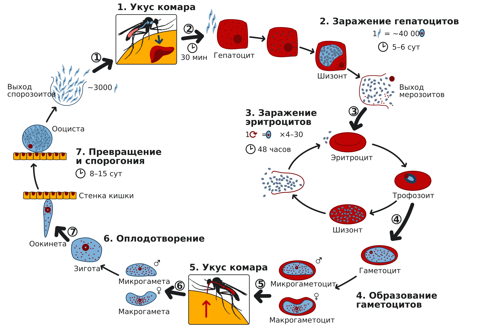
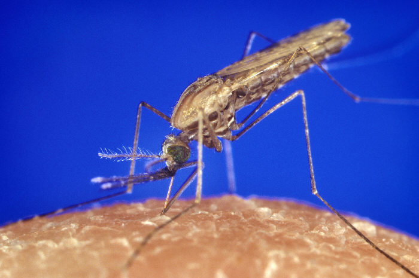

  
Учебный материал

  
Малярия

  
Как устроен жизненный цикл плазмодия и почему из него следует вся клиническая картина

  

  
Пять видов возбудителя. Цикл развития со сменой хозяев: спорогония в комаре, тканевая и эритроцитарная шизогония в человеке, гипнозоиты и отдалённые рецидивы. Откуда берётся приступ и почему он повторяется через 48 или 72 часа. Почему тропическая малярия убивает, а трёхдневная — почти никогда. Диагностика: толстая капля, тонкий мазок, экспресс-тест. Лечение по стадиям паразита. Как малярию открывали и что она сделала с человеческим геномом.

  
Серия «Крещение поворотом» · версия 1.0 · 15 сентября 2026 · CC BY-NC-SA 4.0

«В первое мгновение Стась страшно испугался; он подумал, что она умерла. Но это был только конец первого приступа страшной африканской лихорадки, которую считают гибельной. Два приступа её могут выдержать только люди сильные и здоровые, третьего не выдержал ещё никто. <…> Второй приступ наступал обыкновенно через несколько дней, а третий, если не наступал в течение двух недель, — не был смертелен, так как являлся опять, как первый, при новом рецидиве болезни».

Генрик Сенкевич. «В дебрях Африки», глава XXX

Сенкевич описывает приступ малярии точно: внезапный озноб, дикий блеск зрачков, спутанность, температура, которую по холодным рукам не заподозришь, профузный пот и падение в сон, похожее на смерть. А вот арифметика в эпиграфе — литературная. «Третьего приступа не выдержал ещё никто» — это представление конца XIX века, и оно неверно: при трёхдневной малярии человек без лечения переносит двенадцать-четырнадцать приступов и выздоравливает сам, а при тропической может умереть в первом. Разница между этими двумя исходами — не в стойкости больного, а в том, какой из пяти видов плазмодия его укусил. Из устройства паразита следует всё остальное: сроки инкубации, ритм лихорадки, тяжесть, набор осложнений, выбор препарата и то, вернётся ли болезнь через год.

Этот материал построен вокруг жизненного цикла. Не потому, что цикл красив, а потому, что без него клиническая картина малярии выглядит списком не связанных между собой фактов, который нужно запоминать наизусть. С циклом запоминать почти нечего: почти всё выводится.

# Откуда взялось название

Слово «малярия» пришло из средневекового итальянского: *mala aria* — дурной воздух. Болезнь связывали с болотными испарениями, и связь была настоящей, только объяснение неверным: у болота живут не миазмы, а комары. Второе название, сохранившееся во французском, — *paludisme*, от *palus*, болото. Русское «болотная лихорадка» из того же ряда.

Гиппократ разделял лихорадки по ритму приступов: *febris tertiana* и *febris quartana*. Это разделение переехало в современные диагнозы почти без изменений — и вместе с ним переехала путаница в счёте дней, о которой ниже.

# Возбудитель: пять видов

Малярию человека вызывают простейшие рода *Plasmodium*. Национальное руководство описывает четыре вида, паразитирующих у человека; ВОЗ в информационном бюллетене (декабрь 2025) называет пять, добавляя зоонозный *P. knowlesi* — паразит макак Юго-Восточной Азии, способный заражать человека. Расхождение объясняется временем: руководство под редакцией Н. Д. Ющука и Ю. Я. Венгерова вышло в 2009 году, значение *P. knowlesi* было признано позже.

| Вид | Форма малярии | Инкубация | Ритм лихорадки | Особенности |
|---|---|---|---|---|
| *P. falciparum* | Тропическая | 8–16 дней | Неправильный, часто без периодов апирексии | Единственный вид, дающий злокачественное течение и смерть. Без лечения живёт в человеке до 1,5 лет |
| *P. vivax* | Трёхдневная | 10–21 день либо 6–14 месяцев | Через 48 часов | Самый распространённый в мире. Даёт отдалённые рецидивы до 3 лет |
| *P. ovale* | Овале-малярия | 11–16 дней, иногда до 2 лет и более | Через 48 часов | Течение лёгкое, приступы часто прекращаются сами. Ареал — тропическая Африка и Западная часть Тихого океана |
| *P. malariae* | Четырёхдневная | 3–6 недель | Через 72 часа | Паразитирует годами, иногда пожизненно. В эндемичных очагах — причина нефротического синдрома у детей |
| *P. knowlesi* | Малярия knowlesi | Короткая | Суточный цикл (24 часа) | Зоонозная, резервуар — макаки Юго-Восточной Азии. Способна быстро нарастать в паразитемии |

Дальше в тексте — четыре «классических» вида, поскольку именно по ним построены и национальное руководство, и российская диагностика.

# Жизненный цикл

Плазмодий живёт в двух организмах, и это не прихоть, а необходимость: в человеке он размножается бесполым путём, а половое размножение возможно только в комаре. Поэтому комар — не «переносчик» в бытовом смысле, не летающий шприц. Комар — окончательный хозяин, место, где паразит спаривается. Человек — промежуточный хозяин, место, где он размножается численно.

Отсюда сразу два следствия. Первое: малярия не передаётся от человека к человеку при контакте — обязательно нужен комар (или прямое попадание крови в кровь). Второе: разорвать цикл можно с любой стороны — уничтожая комаров, защищаясь от укусов или убивая паразита в человеке.

<figure>
  
  <figcaption>Жизненный цикл малярийного плазмодия. Верхняя часть схемы и правый круг — то, что происходит в человеке: спорозоиты доходят до гепатоцита за 30 минут, тканевая шизогония занимает 5–6 суток, один спорозоит даёт около 40 000 мерозоитов. Эритроцитарный цикл замкнут и повторяется каждые 48 часов, увеличивая численность в 4–30 раз за цикл. Нижняя и левая части — то, что происходит в комаре: гаметоциты попадают к нему с кровью, оплодотворение даёт зиготу, оокинета проходит стенку кишки, и за 8–15 суток в ооцисте созревает около 3000 спорозоитов, доходящих до слюнных желёз. Числа на схеме объясняют, почему паразитемия нарастает лавинообразно: умножение происходит дважды, в печени и затем в каждом эритроцитарном цикле.</figcaption>
</figure>

На схеме удобно проследить то, что в тексте приходится держать в голове: цикл замкнут в двух местах. Правый круг — эритроцитарная шизогония, вращающаяся в человеке и дающая приступы. Большой круг через комара замыкается только через половые формы. Печень стоит особняком: паразит проходит через неё один раз, и именно поэтому она не участвует в ритме лихорадки, зато отвечает за длину инкубации, а у *P. vivax* и *P. ovale* — за рецидивы через месяцы.

Самка *Anopheles* — не любой комар. Кровью питаются только самки, самцам она не нужна. И передают малярию только комары рода *Anopheles*, а их около сорока видов в одной Италии, из которых переносчик — не каждый. Именно эта деталь оказалась ключом ко всему открытию, о чём в разделе об истории.

<figure class="foto">
  
  <figcaption>Самка *Anopheles gambiae* во время питания кровью — основной переносчик малярии в Африке. На фотографии видна родовая особенность посадки: тело приподнято под углом к поверхности, а хоботок продолжает его линию. Комары родов *Culex* и *Aedes* сидят иначе — тело держится почти параллельно поверхности, а хоботок направлен к ней под углом. Признак различает род на глаз и потому используется в полевой энтомологии; именно неспособность различать виды комаров стоила Роберту Коху приоритета в этом вопросе, а Баттиста Грасси, напротив, различал их превосходно.</figcaption>
</figure>

## Спорогония: что происходит в комаре

Комар кусает больного и всасывает кровь, в которой плавают половые формы паразита — гаметоциты, мужские (микрогаметоциты) и женские (макрогаметоциты). В человеке они бесплодны и ничего не делают; их единственная задача — попасть в комара.

В желудке комара за 9–12 минут мужской гаметоцит выбрасывает восемь тонких подвижных жгутов — микрогамет. Микрогамета проникает в женскую клетку, ядра сливаются, получается зигота. Зигота превращается в подвижную оокинету, та пробуравливает стенку желудка и снаружи превращается в ооцисту. Внутри ооцисты делением образуются тысячи спорозоитов, ооциста лопается, и спорозоиты по гемолимфе доходят до слюнных желёз комара. Теперь комар заразен.

При 25 °С спорогония занимает 10 дней у *P. vivax*, 12 у *P. falciparum*, 16 у *P. malariae* и *P. ovale*. При температуре воздуха ниже 15 °С спорозоиты не развиваются вовсе.

<strong>Почему малярия — болезнь тёплого климата, и почему это не навсегда.</strong> Порог 15 °С и десять-шестнадцать дней развития объясняют географию малярии лучше любых рассуждений о бедности и гигиене. Комар живёт недолго; если спорогония не успевает завершиться до его смерти, передачи нет. В России длительность малярийного сезона составляет от 1,5 до 3 месяцев — столько времени держится устойчивая среднесуточная температура выше 16 °С. Именно поэтому местная передача в средней полосе возможна, но хрупка: достаточно короткого прохладного лета, чтобы цепочка порвалась. И именно поэтому потепление климата обсуждают как фактор возвращения малярии в Европу.

## Тканевая шизогония: первые сорок минут и первая неделя

Комар кусает человека и вместе со слюной вводит спорозоиты. Их немного — десятки или сотни. В крови они не задерживаются: через 15–45 минут спорозоиты уходят из синусоидов печени в гепатоциты. Быстрота и избирательность объясняются тем, что на мембране гепатоцита есть специфические рецепторы, — паразит не блуждает, а идёт по адресу.

В гепатоците спорозоит растёт и многократно делится, превращаясь в тканевый шизонт, набитый мерозоитами. Одна клетка печени выпускает их тысячами. Эта фаза называется экзоэритроцитарной, или тканевой, шизогонией, и она полностью бессимптомна: паразитов ещё мало, эритроциты целы, лихорадки нет. Именно её длительность и составляет основу инкубационного периода: минимум 5–7 суток у *P. falciparum*, 6–8 у *P. vivax*, 9 у *P. ovale*, 14–16 у *P. malariae*.

Клинический вывод из этого абзаца простой и важный: **лихорадка раньше седьмого дня после укуса малярией не бывает**. Если человек вернулся из тропиков и заболел на третий день, это не малярия — паразит физически не успел пройти печень. Но верно и обратное, гораздо более опасное: если он заболел через восемь месяцев, это малярия вполне может быть.

## Гипнозоиты: почему малярия возвращается через год

У *P. vivax* и *P. ovale* есть особенность, которой нет у двух других видов. Часть спорозоитов, попав в гепатоцит, не начинает делиться, а замирает. Такие формы называют гипнозоитами — «спящими». Они могут пролежать в печени 7–14 месяцев и дольше, ничем себя не проявляя, а затем начать превращаться в мерозоиты и выйти в кровь.

Из этого следует сразу несколько вещей, которые иначе приходится запоминать списком:

- инкубационный период трёхдневной малярии бывает и 10 дней, и 14 месяцев — в зависимости от того, какая часть спорозоитов пошла в рост сразу, а какая залегла;
- отдалённые рецидивы возможны через 6–8 месяцев, иногда через 1–3 года после первичного заболевания;
- препарат, убивающий паразита в эритроцитах, рецидив не предотвращает: он не достаёт до печени. Нужен второй препарат, действующий на тканевые формы, — примахин. Курс идёт 14 дней уже после того, как приступы прекратились и человек чувствует себя здоровым;
- при тропической и четырёхдневной малярии гипнозоитов нет, и примахин с этой целью не нужен. У *P. malariae* многолетнее течение обеспечивается не печенью, а вялотекущей эритроцитарной шизогонией на низком уровне.

Рецидивы за счёт гипнозоитов называют экзоэритроцитарными и отличают от эритроцитарных, которые бывают при всех видах и связаны с сохранением паразитов в крови.

## Эритроцитарная шизогония: здесь начинается болезнь

Мерозоиты выходят из печени в кровь и внедряются в эритроциты. Внутри эритроцита паразит проходит стадии, которые и различают под микроскопом:

| Стадия | Как выглядит |
|---|---|
| Юный трофозоит | Кольцо: тонкий ободок цитоплазмы с ядром сбоку |
| Развивающийся трофозоит | Кольцо утолщается, появляется пигмент |
| Зрелый трофозоит | Крупное ядро, паразит занимает значительную часть эритроцита |
| Развивающийся шизонт | Ядро делится, формируются несколько ядер |
| Зрелый шизонт | Эритроцит заполнен готовыми мерозоитами |

Когда шизонт созрел, эритроцит разрушается, и мерозоиты выходят в плазму. Большая часть их погибает от иммунных механизмов, остальные внедряются в новые эритроциты, и цикл повторяется. Продолжительность одного эритроцитарного цикла — 48 часов у *P. vivax*, *P. ovale* и *P. falciparum* и 72 часа у *P. malariae*.

Часть мерозоитов вместо очередного цикла превращается в гаметоциты — те самые половые формы, которые ждут комара. Круг замкнулся.

## Откуда берётся приступ

Приступ малярии — это не «реакция на паразита» вообще, а событие, привязанное к одному моменту цикла: к одновременному разрушению множества эритроцитов и выходу мерозоитов в кровь. В этот момент в плазму попадают продукты распада эритроцитов и паразита, в ответ выбрасываются пирогенные цитокины, и развивается пароксизм.

Ключевое слово — **одновременно**. Если бы паразиты в организме делились кто когда, температура держалась бы ровным плато. Ритмичный приступ означает, что популяция паразитов синхронизирована: все шизонты в крови созревают в один и тот же час. Поэтому:

- в первые дни болезни лихорадка часто неправильная — в крови несколько генераций паразита, вышедших из печени не одновременно. Это называют инициальной лихорадкой;
- типичный ритм устанавливается позже, когда одна генерация становится основной;
- при тропической малярии ритм может не установиться никогда: генерации *P. falciparum* заканчивают шизогонию в разное время, и клинически это выглядит как постоянная лихорадка без периодов апирексии. Именно это чаще всего и мешает распознать самую опасную форму;
- при рецидиве трёхдневной малярии температурная кривая, наоборот, синхронна с самого начала: генерация одна.

## Почему «трёхдневная» малярия — это каждые 48 часов

Это место, на котором спотыкаются все, и презентации обычно просто ставят рядом «48 ч» и «трёхдневная», не объясняя противоречия. Противоречия нет — есть античный способ счёта, при котором считают оба крайних дня, а не промежуток между ними.

| | Пн | Вт | Ср | Чт | Пт |
|---|---|---|---|---|---|
| **Трёхдневная** (*tertiana*, цикл 48 ч) | приступ | — | приступ | — | приступ |
| **Четырёхдневная** (*quartana*, цикл 72 ч) | приступ | — | — | приступ | — |

При трёхдневной малярии день приступа считают первым, свободный день — вторым, следующий приступ приходится на третий день: *tertiana*. При четырёхдневной между приступами два свободных дня, и следующий приступ — на четвёртый день: *quartana*. То есть название описывает не длину цикла, а номер дня, на который выпадает следующий приступ при счёте от предыдущего включительно.

Отсюда же и разгадка «трёхдневной овале-малярии»: цикл у *P. ovale* тоже 48 часов, поэтому она трёхдневная, а слово «овале» добавлено, чтобы отличить её от vivax-малярии.

# Почему приступ выглядит именно так

Классический пароксизм состоит из трёх фаз, идущих непосредственно одна за другой. Общая длительность — 6–10 часов при трёхдневной малярии, около 13 часов при четырёхдневной.

| Фаза | Длительность | Что происходит с больным |
|---|---|---|
| Озноб | От нескольких минут до 1–2 часов | Больной ложится и безуспешно пытается согреться. Кожа сухая, шероховатая, «гусиная», холодная; конечности и слизистые цианотичны. Сильная головная боль, иногда рвота, боли в суставах и пояснице |
| Жар | От одного до нескольких часов | Больной сбрасывает одежду, но облегчения нет. Температура 40–41 °С, кожа сухая и горячая, лицо красное. Головная боль и боли в пояснице усиливаются, возможны бред и спутанность |
| Пот | 1–3 часа | Температура падает критически, потоотделение профузное, бельё приходится менять неоднократно. Ослабленный больной засыпает |

Физиология здесь та же, что при любом ознобе: в фазе озноба установочная точка терморегуляции резко смещается вверх, и организм воспринимает нормальную температуру тела как низкую — отсюда вазоконстрикция, «гусиная кожа», дрожь и субъективный холод при уже растущей температуре. В фазе пота установочная точка возвращается на место, и теперь та же температура воспринимается как избыточная — вазодилатация и потоотделение.

Практическое следствие: **в фазе озноба у больного холодные руки и цианоз, а температура при этом может быть 40 °С**. Сенкевич это описал буквально: «Руки и лоб у неё оставались холодными; но если бы Стась был хоть сколько-нибудь знаком с симптомами лихорадки, он понял бы по её крайне беспокойным движениям, что у неё должна быть страшно высокая температура».

Характерное время суток тоже различается: при трёхдневной малярии приступы обычно приходятся на утро и день, при овале-малярии — на вечер, при четырёхдневной начинаются около полудня.

После приступа наступает период апирексии, при трёхдневной малярии длящийся около 40 часов. Печень и селезёнка отчётливо увеличиваются после 2–3 приступов, анемия развивается постепенно со второй недели.

# Почему тропическая малярия убивает

*P. falciparum* отличается от остальных видов не тем, что «злее», а несколькими конкретными биологическими свойствами. Каждое из них по отдельности объясняет часть клинической картины.

**Он заражает эритроциты любого возраста.** *P. vivax* внедряется преимущественно в молодые эритроциты (ретикулоциты), *P. malariae* — в старые. И те и другие составляют лишь малую долю эритроцитарной массы, поэтому паразитемия при этих видах ограничена сверху сама собой. Для *P. falciparum* доступны все эритроциты, и паразитемия способна нарастать до величин, при которых поражена значительная часть крови.

**Заражённый эритроцит прилипает к эндотелию.** На поверхности эритроцита, заражённого *P. falciparum*, появляются выступы, через которые клетка связывается с эндотелием капилляров и венул. Это явление называют цитоадгезией; заражённые эритроциты также склеиваются с незаражёнными, образуя «розетки». В результате зрелые формы паразита уходят из периферической крови и скапливаются в микроциркуляции внутренних органов — прежде всего мозга. Отсюда два важных следствия:

- в периферической крови при неосложнённой тропической малярии видны только юные кольцевидные трофозоиты. Появление в мазке зрелых стадий и разных возрастных форм одновременно — признак тяжёлого, злокачественного течения;
- уровень паразитемии в периферической крови может недооценивать реальную массу паразита, потому что значительная её часть секвестрирована в тканях. Известны случаи смерти от церебральной малярии при очень низкой паразитемии в мазке.

**Гаметоциты созревают медленно, но живут долго.** Гаметоциты *P. falciparum* появляются в крови через 10–12 дней после начала паразитемии и живут до 6 недель, тогда как гаметоциты других видов погибают через несколько часов после созревания. Поэтому человек становится источником инфекции не сразу, но остаётся им 2 месяца и более. Для диагностики это даёт хронологический ориентир: только кольца — ранний период; кольца и гаметоциты — болезнь длится не меньше 10–12 дней; только гаметоциты — реконвалесценция.

<strong>О «98 % летальности».</strong> В учебных материалах иногда встречается утверждение, что летальность тропической малярии составляет 98 %. Это ошибка пересказа: на <em>P. falciparum</em> действительно приходится подавляющее большинство смертей от малярии в мире, но это доля в структуре смертности, а не вероятность умереть для заболевшего. Реальные величины другие: летальность тропической малярии по памятке Роспотребнадзора составляет от 10 до 40 % в зависимости от времени начала лечения и оснащённости клиники, летальность церебральной малярии — того же порядка, а при своевременно леченной неосложнённой тропической малярии исход, как правило, благополучный. Различать долю в смертности и летальность необходимо: из первой цифры следует, за каким видом гнаться в первую очередь, из второй — сколько времени есть у конкретного больного.

# Осложнения тропической малярии

Осложнения регистрируют на всех стадиях и практически только при *P. falciparum*: болезнь, вызванная *P. vivax*, *P. ovale* и *P. malariae*, как правило, течёт доброкачественно.

Признаки, указывающие на угрозу злокачественного течения, по национальному руководству: ежедневная лихорадка без апирексии между приступами, сильная головная боль, генерализованные судороги чаще двух раз за сутки, децеребрационная ригидность, шок (систолическое давление ниже 70 мм рт. ст. у взрослого и ниже 50 у ребёнка), паразитемия более 100 тыс. в 1 мкл, обнаружение разных возрастных стадий паразита в периферической крови, лейкоцитоз более 12,0×10⁹/л, гипогликемия менее 2,2 ммоль/л, декомпенсированный метаболический ацидоз, более чем трёхкратный рост аминотрансфераз, лактат более 6 мкмоль/л.

Этот перечень стоит читать правильно. Каждый пункт в нём — самостоятельный признак угрозы, а не обязательное условие. В учебных материалах иногда встречается формулировка, что тяжёлая малярия определяется как паразитемия свыше 100 тыс. в 1 мкл плюс минимум один клинический признак; это неверно, и неверно опасным образом. Высокая паразитемия действительно указывает на угрозу, но тяжёлая малярия развивается и при низкой паразитемии в мазке — из-за секвестрации зрелых форм в микроциркуляции, о которой сказано выше. Больной без гиперпаразитемии, но с нарушенным сознанием или ацидозом — это тяжёлая малярия, и требовать от него порогового числа паразитов не нужно.

| Осложнение | Суть |
|---|---|
| Церебральная малярия | Тяжёлое поражение ЦНС с развитием комы. Три периода: оглушение, сопор, истинная кома. При коме — нарушение конвергенции, расходящееся косоглазие, плавающие движения глазных яблок, нистагм, паралич VI пары, исчезновение сухожильных и брюшных рефлексов, патологические рефлексы. При спинномозговой пункции — повышение внутричерепного давления без выраженных изменений состава ликвора. При эффективном лечении сознание возвращается обычно внезапно |
| Тяжёлая анемия | Гематокрит ниже 20 %, гемоглобин ниже 50 г/л. Гипохромная анемия осложняет все формы малярии |
| ДВС-синдром | Кровоточивость дёсен, кровоизлияния в сетчатку, спонтанные носовые и желудочно-кишечные кровотечения |
| Острая почечная недостаточность | Олигурия менее 400 мл/сут у взрослого, креатинин выше 265 ммоль/л, мочевина выше 21,4 ммоль/л, гиперкалиемия |
| Гемоглобинурийная лихорадка | Следствие массивного внутрисосудистого гемолиза — при интенсивной инвазии либо от препаратов (хинин, примахин, сульфаниламиды) у лиц с дефицитом Г-6-ФДГ. Моча тёмно-коричневая, гемоглобин падает до 20–30 г/л, паразитов в крови очень мало или нет вовсе. При быстрой отмене препарата состояние улучшается |
| Малярийный алгид | Картина инфекционно-токсического шока с гипотермией и полиорганной недостаточностью. В отличие от церебральной малярии сознание сохранено. Паразитемия высокая |
| Отёк лёгких | Часто приводит к смерти. Может быть спровоцирован избыточной регидратацией, но развивается и при нормальном давлении в малом круге; сейчас рассматривается как respiratory distress syndrome взрослых |
| Разрыв селезёнки | Редкое, но грозное осложнение любой формы. Возможен при перекруте ножки селезёнки с острым застоем крови и субкапсулярной гематомой |

Отдельно стоит отметить, что гемоглобинурийная лихорадка — единственное в этом списке осложнение, которое может быть вызвано не паразитом, а лечением. Проверка на дефицит Г-6-ФДГ перед назначением примахина существует именно поэтому.

# Диагностика

Диагноз строится на трёх опорах: эпидемиологический анамнез, клиническая картина и лабораторное подтверждение. Первая опора важнее, чем кажется, потому что без неё две остальные не работают: врач, не спросивший о поездках, не назначит исследование крови на малярию, а лаборатория не станет искать паразита, которого никто не просил искать.

## Кого обследовать

Национальное руководство определяет круг обследуемых прямо:

- лихорадящие больные с неустановленным диагнозом в течение 3 дней в эпидемический сезон и 5 дней в остальное время года;
- больные с периодическими подъёмами температуры, несмотря на лечение по установленному диагнозу;
- реципиенты крови при подъёме температуры в последние 3 месяца после переливания;
- лица, проживающие в активном очаге, при любом повышении температуры.

## Толстая капля и тонкий мазок

Основной метод — микроскопия препаратов крови, окрашенных по Романовскому — Гимзе. Готовят два разных препарата, и они решают разные задачи.

| | Толстая капля | Тонкий мазок |
|---|---|---|
| Задача | Найти паразита | Определить вид |
| Почему | Объём крови в 30–40 раз больше, чем в тонком мазке, поэтому чувствительность выше | Эритроциты лежат одним слоем, морфология и окрашиваемость разных стадий хорошо различимы |
| Ограничение | Эритроциты при приготовлении разрушаются, вид определить трудно | При низкой паразитемии паразита можно не найти |

Определение вида обязательно, и прежде всего потому, что от него зависит, идёт ли речь о состоянии, способном убить за сутки, или о доброкачественной инфекции.

Практические оговорки, без которых метод подводит:

- при первых приступах паразитов в крови мало, исследование должно быть особенно тщательным;
- низкая паразитемия бывает и у тех, кто принимал противомалярийные препараты для профилактики, и у тех, кто получал тетрациклин или сульфаниламиды по другому поводу: эти препараты подавляют плазмодий;
- кровь берут и в период лихорадки, и во время апирексии — ждать приступа не нужно;
- отрицательный результат однократного исследования малярию не исключает, и при сохраняющемся подозрении исследование повторяют.

В процессе лечения паразитемию считают в динамике: через сутки после начала терапии она должна снизиться на 25 % и более, на третий день не превышать 25 % от исходной. Наличие паразитов на четвёртый день при соблюдении всех условий лечения — признак устойчивости возбудителя к препарату.

## Экспресс-тесты

Иммунохроматографические тесты выявляют белок HRP-2 и фермент pLDH *P. falciparum*, результат готов через 10–20 минут, освоить постановку можно за час-два. Диагностическая эффективность при сопоставлении с микроскопией и ПЦР достигает 95–98 %.

У метода есть ограничение, о котором ВОЗ предупреждает отдельно и которое имеет прямое отношение к надёжности результата. Большинство экспресс-тестов распознают антигены HRP2 и HRP3, а у части паразитов есть мутации, при которых эти белки не экспрессируются. Такие возбудители тестом не выявляются. В 2024 году подобные мутации регистрировались в 42 эндемичных странах, а в Бразилии, Джибути, Эритрее, Эфиопии, Никарагуа и Перу их распространённость превысила 15 %. Кроме того, антиген сохраняется в крови после излечения, что даёт положительный результат у уже выздоровевшего.

Практический вывод: экспресс-тест не заменяет микроскопию, а дополняет её. Отрицательный тест при убедительной клинике и эпиданамнезе основанием отказаться от диагноза не является.

## С чем путают

Дифференциальный ряд широк, и в него входит почти всё, что даёт лихорадку: грипп и другие ОРВИ, тифопаратифозные заболевания, денге, лихорадка паппатачи, тропические геморрагические лихорадки, жёлтая лихорадка, вирусные гепатиты, сепсис, лептоспироз, острый бруцеллёз, спирохетозы, пищевые токсикоинфекции, амёбный абсцесс печени, острый пиелонефрит, лимфогранулематоз, гемолитическая анемия. Малярийную кому дифференцируют с комами другой природы.

Из этого списка стоит выделить одно обстоятельство. Лихорадка, анемия и увеличенная селезёнка — классическая триада малярии, но опираться на её полноту нельзя: селезёнка увеличивается только после 2–3 приступов, анемия развивается со второй недели. У больного, поступившего на третий день тропической малярии, из триады может быть одна лихорадка. Утверждение «при отсутствии хотя бы одного признака триады диагноз малярии маловероятен» ошибочно и опасно именно для той формы, которая убивает быстрее всех.

# Лечение

Логика противомалярийной терапии прямо следует из цикла: препараты классифицируют по тому, на какую стадию паразита они действуют.

| Группа | На что действует | Зачем нужна |
|---|---|---|
| Гематошизотропные | Бесполые эритроцитарные стадии | Купируют приступы и спасают жизнь. Хлорохин, хинин, мефлохин, производные артемизинина |
| Гистошизотропные | Бесполые тканевые стадии, включая гипнозоиты | Предотвращают отдалённые рецидивы при vivax- и овале-малярии. Примахин, тафенохин |
| Гамотропные | Гаметоциты | Прерывают передачу: больной перестаёт быть источником для комара |

Отсюда понятно, почему при трёхдневной малярии назначают два препарата последовательно, а не один: хлорохин очищает кровь и снимает приступы, но не достаёт до гипнозоитов в печени, и без последующих 14 дней примахина болезнь вернётся. Такое лечение называют радикальным — в отличие от купирования приступа.

Основные положения, общие для всех схем:

- этиотропное лечение назначают сразу после установления клинико-эпидемиологического диагноза и взятия крови на исследование, не дожидаясь результата;
- при *P. vivax*, *P. ovale*, *P. malariae* применяют хлорохин, затем при vivax- и овале-малярии — примахин 0,25 мг/кг в сутки 14 дней. Приступы прекращаются через 24–48 часов, паразиты исчезают из крови через 48–72 часа;
- при *P. falciparum* у неиммунных лиц препараты выбора — производные артемизинина и мефлохин. ВОЗ определяет комбинированную терапию на основе артемизинина как наиболее эффективный метод лечения falciparum-малярии;
- препараты артемизинина действуют очень быстро и на кровяные стадии, и на гаметоциты, но быстро выводятся, поэтому применяются в комбинации — иначе возникают рецидивы. Отсюда и само понятие комбинированной терапии;
- хлорохин при *P. vivax* ВОЗ рекомендует только там, где сохраняется чувствительность; описаны устойчивые штаммы в Бирме, Индонезии, Папуа — Новой Гвинее и Вануату;
- перед примахином необходимо учитывать дефицит Г-6-ФДГ: препарат способен вызвать массивный гемолиз.

## Устойчивость

История противомалярийных препаратов — это история потери каждого из них по очереди. Хинин, хлорохин, сульфадоксин-пириметамин, мефлохин последовательно теряли эффективность в разных регионах. Сейчас та же история идёт с артемизинином: ВОЗ отмечает частичную устойчивость к нему в субрегионе Большого Меконга, подтверждённую также в Эритрее, Руанде, Уганде и Танзании, с данными, позволяющими предполагать её в Эфиопии, Намибии, Судане и Замбии. В 2022 году принята отдельная стратегия противодействия устойчивости в Африке.

Практический смысл этого для врача вне эндемичного региона: набор препаратов, который был правильным пять лет назад, может быть неправильным сейчас, а география устойчивости важна не меньше, чем вид возбудителя. Поэтому в эпидемиологическом анамнезе нужна не «Африка», а конкретная страна.

# Профилактика

Химиопрофилактика строится по принципу «до, во время и после»: препараты принимают до въезда в очаг, весь период пребывания в сезон передачи и в течение 4 недель после выезда. Последнее условие нарушают чаще всего, а оно необходимо: паразит может выйти из печени уже после возвращения.

В районах с устойчивостью *P. falciparum* к хлорохину применяют мефлохин по 250 мг раз в неделю, но не более 6 месяцев. Хлорохин используют там, где чувствительность сохранена, а также для профилактики трёхдневной, овале- и четырёхдневной малярии. Прибывшим из высокоэндемичного региона для предупреждения поздних рецидивов дополнительно назначают примахин 0,25 мг/кг 14 дней.

Неспецифическая защита — противомоскитные сетки, обработанные инсектицидом, репелленты, обработка помещений, защитная одежда в вечерние и ночные часы. Это не бытовая мелочь: обработанные сетки остаются одним из самых эффективных вмешательств в истории борьбы с малярией просто потому, что *Anopheles* кусает в основном ночью.

## Вакцины

Вакцины против малярии появились совсем недавно, и это стоит отметить как событие: до 2021 года ни одной лицензированной вакцины против паразитарного заболевания человека не существовало вообще.

- С октября 2021 года ВОЗ рекомендует вакцину **RTS,S/AS01** для детей в районах с умеренной и высокой передачей *P. falciparum*.
- В октябре 2023 года рекомендована вторая вакцина — **R21/Matrix-M**.

Обе внедряются в программы плановой иммунизации в Африке. ВОЗ подчёркивает, что наибольший эффект достигается только вместе с остальными мерами — сетками и химиопрофилактикой, — а не вместо них.

# Малярия и человеческий геном

Малярия — вероятно, самый сильный из известных факторов естественного отбора, действовавших на человека в историческое время. Проще всего это видно по тому, что несколько распространённых наследственных болезней сохраняются в популяциях именно потому, что защищают от малярии.

**Серповидноклеточная анемия.** Гомозиготы по гемоглобину S тяжело больны. Гетерозиготы практически здоровы и при этом легче переносят тропическую малярию. В регионах, где малярия убивала детей поколениями, носительство оказывалось выгодным, и частота аномального гена держится высокой до сих пор. Национальное руководство прямо отмечает, что носители гемоглобина S легко переносят тропическую малярию.

**Дефицит глюкозо-6-фосфатдегидрогеназы.** Та же логика: дефицит фермента даёт некоторую защиту от малярии и потому распространён в тех же районах. Клинический разворот этого факта неприятен: именно у таких людей примахин и хинин вызывают массивный гемолиз. Ген, защищавший от паразита, мешает лечить паразита.

**Отсутствие антигенов Даффи.** Мерозоиту *P. vivax* для проникновения в эритроцит нужен рецептор — изоантигены Даффи (Fy^a^ или Fy^b^). У коренных жителей Западной Африки этих антигенов на эритроцитах нет, и *P. vivax* там просто не встречается. Это объясняет географическую странность, которая иначе выглядит необъяснимой: самый распространённый в мире вид плазмодия отсутствует в регионе с самой тяжёлой малярией. В Восточной Африке *P. vivax* находят — но у арабов, индийцев, эфиопов и европейцев.

Сюда же относится и приобретённый иммунитет, формирующий в гиперэндемичных очагах характерную возрастную структуру заболеваемости:

- дети до 6 месяцев не болеют благодаря пассивному иммунитету от матери;
- дети 6–24 месяцев поражены *P. falciparum* массово — пассивный иммунитет угас, активный ещё не сформирован. В этой группе самая высокая смертность;
- у детей старше 2 лет течение мягче, паразитемия с возрастом снижается;
- у взрослых паразит обнаруживается редко, а при инфицировании клинических проявлений может не быть вовсе.

Отсюда следует то, что для приезжего важнее всего: **иммунитета к малярии у него нет**. Взрослый житель эндемичного района с той же паразитемией может чувствовать себя удовлетворительно, а неиммунный турист — умирать. Именно поэтому неиммунные путешественники стоят в списке групп риска рядом с детьми до пяти лет и беременными.

# Как малярию открывали

Эта история стоит того, чтобы её знать, — отчасти потому, что она хорошо рассказана Полем де Крюи в «Охотниках за микробами», отчасти потому, что в ней видно, как устроено рассуждение, приводящее к открытию.

## Кора, которая работала за двести лет до понимания болезни

Кора хинного дерева применялась при лихорадках с XVII века, из Вице-королевства Перу, и попала в Европу через иезуитов — отсюда название «иезуитский порошок». Действующее вещество выделили Пьер Жозеф Пеллетье и Жозеф Бьенеме Кавенту в 1820 году, назвав его хинином. То есть лекарство от малярии работало примерно два столетия до того, как стало известно, от чего именно оно лечит.

<strong>Хинин в «В дебрях Африки».</strong> Сюжетная роль хинина у Сенкевича — не выдумка для драматизма. В конце XIX века порошок хинной коры действительно был единственным средством, а его отсутствие в Африке означало смерть от лихорадки. Отсюда и весь эпизод с поисками: у Стася нет хинина, когда у Нель начинается первый приступ, и достать его становится единственной задачей.

## Лаверан: паразит в крови

В 1880 году французский военный врач Шарль Луи Альфонс Лаверан, работая в Алжире, увидел паразита в крови больного малярией. Это было первое обнаружение простейшего как возбудителя болезни человека. Нобелевскую премию по физиологии и медицине Лаверан получил в 1907 году.

## Росс: комар и настойчивость

Рональд Росс, врач индийской медицинской службы, работал по подсказке Патрика Мэнсона, считавшего переносчиком комара. Метод был прямой: он давал комарам напиться крови больного малярией и затем вскрывал их, разыскивая паразита в желудке.

Де Крюи описывает решающие дни августа 1897 года. Росс вскрывал комаров, кусавших больного по имени Гуссейн-хан, день за днём, и в стенке желудка обнаруживал круглые тельца, «набитые крошечными чёрными как смоль зернышками». На пятый день он записал: «21 августа я убил последнего бурого комара и ворвался в его желудок!» Кружки были крупнее, чем вчера. Они росли — значит, были живыми, значит, это действительно малярийные паразиты. От восторга Росс изложил открытие стихами.

Дальше последовало то, что в истории науки встречается чаще, чем триумф: начальство индийского медицинского ведомства запретило ему продолжать исследования, требуя обычной врачебной работы, и отправило на север, где комаров было мало, а те, что были, не кусались из-за холода. Нобелевскую премию Росс получил в 1902 году.

## Грасси: вопрос, поставленный правильно

Итальянец Баттиста Грасси занялся малярией в 1898 году, ничего не зная о работе Росса. Толчком, по де Крюи, послужил приезд Роберта Коха, который прибыл в Италию доказывать, что комары переносят малярию. Разговор между ними приведён у де Крюи так:

> «— В Италии есть места, где от комаров нет спасения, а между тем там совершенно не бывает малярии!
> — И что с того?
> — Значит, есть основания думать, что комары могут не иметь ничего общего с малярией, — сказал Грасси.
> — Ага! И вы так думаете? — язвительно спросил Кох.
> — Да, но здесь есть и другая сторона, — продолжал Грасси. — Я не слышал ещё ни об одной местности, где была бы малярия и одновременно не было бы комаров.
> — И что же из этого?
> — А из этого вот что! — воскликнул Грасси. — Или же малярия распространяется одним определённым видом из тридцати или сорока различных видов итальянского комара, или же она вообще не распространяется комарами!»

Это образцовое рассуждение, и оно стоит того, чтобы его разобрать. Наблюдение «комары есть, малярии нет» само по себе выглядит опровержением комариной теории. Наблюдение «малярии без комаров не бывает» её поддерживает. Вместе они дают вывод, которого не даёт ни одно из них по отдельности: переносчик — не комары вообще, а один конкретный вид.

Грасси, в отличие от Росса, был специалистом по комарам и различал три с лишним десятка видов. Он взял отпуск, отправился с пробирками в болотистую местность и стал ловить комаров там, где была малярия. Виновника местные жители называли «занзароне». Это был *Anopheles claviger* — и по нему Грасси нашёл соответствие: где слышался писк занзароне, там были и больные лихорадкой.

## Артемизинин: рецепт IV века и температура экстракции

Самая молодая глава — и, пожалуй, самая неожиданная.

В 1967 году в Китае был начат закрытый проект по поиску противомалярийных средств, получивший название «Проект 523» по дате начала — 23 мая. Поиск шёл в том числе по традиционным медицинским трактатам. Ту Юю, работавшая в Институте китайской материа медика, обратила внимание на рецепт из сочинения Гэ Хуна «Рецепты скорой помощи из-за рукава» (肘后备急方, около 340 года): взять горсть травы цинхао, залить двумя шэн воды, выжать сок и выпить его целиком.

Ключевым оказалось то, чего в рецепте **не было**. Почти все травяные снадобья готовили отваром, то есть кипятили. Гэ Хун нагревать не велел — он велел выжать сок. Ту Юю предположила, что нагревание разрушает действующее вещество, и переделала методику, перейдя на экстракцию при пониженной температуре этиловым эфиром. 4 октября 1971 года образец № 191 — нейтральная фракция эфирного экстракта цинхао — показал полное подавление малярии у грызунов; затем результат подтвердился на обезьянах. Нобелевскую премию Ту Юю получила в 2015 году.

Из полыни *Artemisia annua* выделили артемизинин, и сегодня комбинированная терапия на его основе — стандарт лечения тропической малярии по всему миру. Существенная деталь: подсказкой послужил не сам рецепт, а способ приготовления. Правильно прочитанной оказалась технологическая мелочь, на которую тысячу шестьсот лет никто не обращал внимания.

## Малярия как лекарство

Отдельный сюжет, показывающий, насколько иначе выглядела медицина сто лет назад. Юлиус Вагнер-Яурегг с 1887 года разрабатывал идею лечения душевных болезней искусственной лихорадкой, а в 1917 году привил девяти больным прогрессивным параличом — то есть нейросифилисом — трёхдневную малярию. Шесть из девяти дали выраженное улучшение. Малярию он выбрал сознательно, среди прочего потому, что её в любой момент можно прервать хинином. В 1927 году Вагнер-Яурегг получил за это Нобелевскую премию.

Метод исчез вместе с появлением пенициллина, и по современным этическим стандартам он невозможен. Но логика в нём была: до антибиотиков нейросифилис означал верную смерть, а управляемая малярия — риск, который можно оборвать.

# Малярия сегодня

По информационному бюллетеню ВОЗ (декабрь 2025), в 2024 году в 80 странах мира произошло 282 млн случаев заболевания малярией и 610 тыс. случаев смерти. На Африканский регион ВОЗ приходится 95 % случаев заболевания (265 млн) и 95 % смертей (579 тыс.). Около 75 % всех смертей от малярии в этом регионе — дети младше пяти лет.

Повышенному риску тяжёлого течения подвергаются младенцы, дети до пяти лет, беременные, путешественники и лица с ВИЧ-инфекцией.

<strong>О цифрах в учебных материалах.</strong> Данные по малярии обновляются ежегодно, и в презентациях нередко соседствуют показатели разных лет: 263 млн случаев и 597 тыс. смертей — это оценка за 2023 год, 282 млн и 610 тыс. — за 2024-й. Расхождение само по себе не ошибка, но год оценки указывать необходимо, иначе цифры выглядят противоречащими друг другу.

## Россия

Малярия в России — завозная инфекция, и это определяет всё остальное. Национальное руководство указывает 700–1000 случаев в год на момент издания. Существенно другое: переносчик в стране есть. Комары рода *Anopheles* обитают в том числе в средней полосе, а длительность малярийного сезона составляет от 1,5 до 3 месяцев. В руководстве отмечено возобновление передачи *P. vivax* через комаров в ряде регионов, включая Москву и Московскую область.

Это означает, что завозной случай, не выявленный вовремя, в тёплый сезон способен дать местную передачу. Диагностика здесь имеет не только клиническое, но и противоэпидемическое значение.

# Что из этого нужно на догоспитальном этапе

Малярию на линии не лечат и не подтверждают — её заподозривают и эвакуируют. Существенных пунктов немного.

**Вопрос о поездках задаётся при любой неясной лихорадке.** Не «были ли вы в тропиках», а где именно и когда: от страны зависит вероятная устойчивость возбудителя, от даты — какой вид возможен. Пациент сам связи с поездкой обычно не проводит, особенно если вернулся полгода назад.

**Сроки, которые исключают и не исключают диагноз.** Раньше седьмого дня после укуса малярии не бывает. Позже — бывает практически в любой срок: у *P. vivax* и *P. ovale* инкубация растягивается до 14 месяцев и более, отдалённые рецидивы возможны через 1–3 года. «Слишком давно был в отпуске» — не аргумент.

**Отсутствие правильного ритма лихорадки диагноз не снимает.** При тропической малярии периодичности часто нет вовсе, а в первые дни любой формы лихорадка неправильная. Ждать «классических» приступов через день — значит терять время именно на той форме, которая убивает.

**Неполная триада диагноз не снимает.** Селезёнка увеличивается после 2–3 приступов, анемия — со второй недели. На третий день болезни может быть одна лихорадка.

**Тропическая малярия — состояние с коротким запасом времени.** Без лечения falciparum-малярия способна перейти в тяжёлую форму и привести к смерти в течение суток; риск злокачественного течения резко растёт при задержке лечения более 6 дней от начала болезни. Поэтому подозрение на малярию — основание для экстренной эвакуации в инфекционный стационар, а не для наблюдения в динамике.

**Признаки, требующие немедленных действий:** нарушение сознания любой глубины, повторные судороги, одышка, олигурия или анурия, тёмная моча, шок, желтуха. Это признаки тяжёлой малярии, и все они означают, что счёт идёт на часы.

**Гипогликемия.** Гипогликемия менее 2,2 ммоль/л входит в прогностически неблагоприятные признаки, и она поддаётся коррекции на месте. Глюкометрия при лихорадке с нарушением сознания нужна независимо от версии диагноза.

# Источники

- Всемирная организация здравоохранения. Информационный бюллетень «Малярия», 4 декабря 2025 — оценки заболеваемости и смертности за 2024 год, вакцины RTS,S/AS01 и R21/Matrix-M, комбинированная терапия на основе артемизинина, устойчивость к артемизинину, мутации HRP2 и HRP3.
- Инфекционные болезни: национальное руководство / под ред. Н. Д. Ющука, Ю. Я. Венгерова. — М.: ГЭОТАР-Медиа, 2009. — 1040 с. Глава «Малярия»: этиология и цикл развития, эпидемиология, патогенез, клиническая картина по четырём формам, осложнения, диагностика, лечение.
- Роспотребнадзор. Памятка населению: малярия и её профилактика — инкубационный период, летальность тропической малярии, химиопрофилактика перед выездом.
- Поль де Крюи. Охотники за микробами. Главы о Рональде Россе и Баттиста Грасси — обстоятельства открытия переносчика, диалог Грасси с Кохом, идентификация *Anopheles claviger*.
- Генрик Сенкевич. В дебрях Африки, глава XXX — описание приступа африканской лихорадки.
- Tu Youyou. Nobel Lecture: Artemisinin — A Gift from Traditional Chinese Medicine to the World, 2015; Tu Youyou. Biographical, NobelPrize.org — рецепт Гэ Хуна, отказ от нагревания, образец № 191 от 4 октября 1971 года.
- 50 years of artemisinin. *Chemistry World* — «Проект 523», датировка сочинения Гэ Хуна 340 годом.
- The Nobel Prize in Physiology or Medicine 1927: Julius Wagner-Jauregg; Nobel Lecture «The Treatment of Dementia Paralytica by Malaria Inoculation», 13 декабря 1927 — прививная малярия при прогрессивном параличе.
- Kaufman T. S., Rúveda E. A. The Quest for Quinine — история хинной коры, выделение хинина Пеллетье и Кавенту в 1820 году, открытие Лаверана в 1880 году.

# Источники иллюстраций

| Файл | Что изображено | Источник и лицензия |
|---|---|---|
| `cikl_malyarii.png` | Жизненный цикл малярийного плазмодия | Bbkkk, Wikimedia Commons, файл `Life Cycle of the Malaria Parasite.svg`, CC BY-SA 4.0. Изменения: подписи переведены на русский язык, шрифт заменён на DejaVu Sans, поле расширено вправо под более длинные подписи, разделители тысяч и знак умножения приведены к русской типографике. Производная схема распространяется на условиях той же лицензии CC BY-SA 4.0 |
| `komar_anopheles.jpg` | Самка *Anopheles gambiae* во время питания кровью | CDC / James Gathany, Public Health Image Library, изображение № 1354, 1994. Общественное достояние как произведение федерального ведомства США. Изменений не вносилось |

Иллюстрация и её перевод распространяются на условиях CC BY-SA 4.0 и не подпадают под лицензию текста материала. Исходный переведённый файл в векторном формате лежит рядом: `images/cikl_malyarii.svg`.

# Выходные данные

**Материал:** «Малярия», учебный материал. Версия 1.0 от 15 сентября 2026.

**Серия:** «Крещение поворотом» — клинические разборы догоспитальной практики.

**Лицензия:** текст — Creative Commons «С указанием авторства — Некоммерческая — С сохранением условий» 4.0 (CC BY-NC-SA 4.0). Копировать, печатать и раздавать коллегам можно свободно; продавать — нельзя.

**Оговорка.** Материал носит учебный характер. Он не является нормативным документом, не заменяет действующие протоколы, клинические рекомендации и распоряжения службы и не может использоваться как единственное основание для клинического решения. Дозы, показания и маршрутизацию необходимо проверять по действующим первоисточникам. Ответственность за клинические решения несёт медицинский работник, а не автор материала.

**Нашли ошибку?** Сообщить можно через раздел Issues репозитория проекта; исправление выходит новой версией, а изменение фиксируется в журнале изменений.
