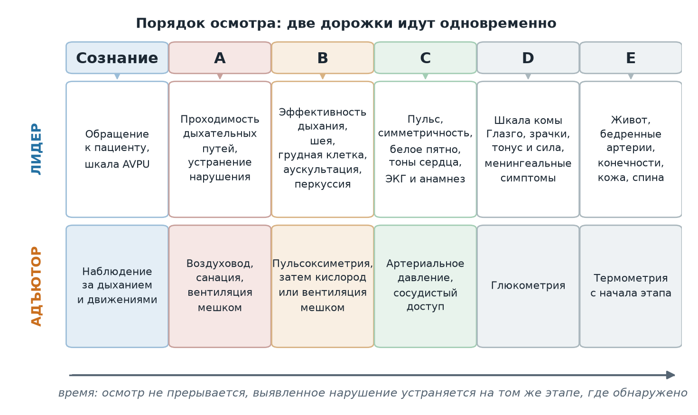
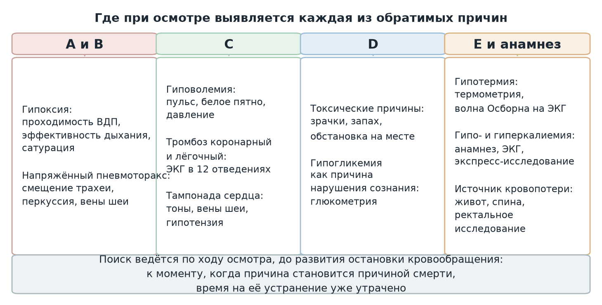
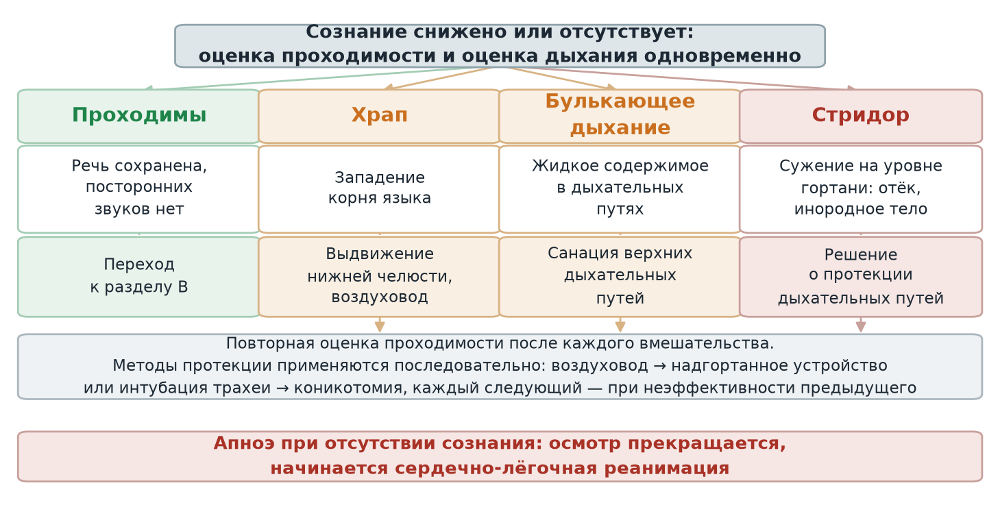

  
Учебный материал

  
Протокол ургентного осмотра

  
Общетерапевтический осмотр пациента в критическом состоянии: обоснование последовательности, шкалы и трактовка находок

  

  
Критическое состояние и механизмы его развития, потенциально обратимые причины остановки кровообращения, задачи протокола, подготовка до прибытия, первичная оценка и вынужденные положения, последовательность ABCDE с порогами и шкалами, повторный осмотр, мониторинг и маршрутизация. Распределение работы между лидером и адъютором приведено отдельным чек-листом.

  
Серия «Крещение поворотом» · версия 1.2 · 27 сентября 2026 · CC BY-NC-SA 4.0

Материал составлен по протоколу ургентного осмотра ГБУЗ «Станция скорой и неотложной медицинской помощи имени А. С. Пучкова» (Трофимова И. А., 2025–2026). Ссылки на дозы и объём помощи приведены по приказу ДЗМ Москвы № 535 от 18.05.2023.

# Предмет протокола

**Общетерапевтический осмотр** — комплекс мероприятий, выполняемых при оказании скорой, в том числе скорой специализированной, медицинской помощи вне медицинской организации соматическому пациенту в критическом состоянии, требующем срочного медицинского вмешательства.

**Критическое состояние** — крайняя степень любой, в том числе ятрогенной, патологии, для которой характерны тяжёлые расстройства жизненно важных функций, в первую очередь сердечно-сосудистой и дыхательной, требующие экстренной поддержки или искусственного замещения.

Из определения следует объём: осматриваются все системы, а не та, на которую указывает повод к вызову. Протокол задаёт последовательность, при которой жизнеугрожающие состояния выявляются и устраняются по ходу осмотра, а не после его завершения.

<figure>
  
  <figcaption>Рис. 1. Развёртка осмотра во времени. Верхняя дорожка — работа лидера, нижняя — работа адъютора; действия в пределах одного столбца выполняются одновременно. Осмотр не прерывается: выявленное нарушение устраняется на том этапе, где обнаружено.</figcaption>
</figure>

| Задача протокола | Чем достигается |
|---|---|
| Своевременное выявление жизнеугрожающих состояний и их купирование | Фиксированная последовательность ABCDE, в которой каждое нарушение устраняется до перехода к следующему разделу |
| Раннее распознавание потенциально обратимых причин остановки кровообращения | Целенаправленный поиск состояний группы 4Г/4Т при осмотре |
| Полнота осмотра без потери времени | Параллельная работа двух членов бригады и объединение процедур, не мешающих друг другу |
| Сокращение времени от прибытия до доставки в стационар | Решение о маршруте принимается по результатам первичного осмотра, а не после полного обследования |

# Механизмы развития критического состояния

Протокол группирует причины по нарушенной функции. Группировка имеет операционное назначение: каждая группа причин проверяется на том этапе осмотра, где её признаки доступны выявлению.

## Дыхательная недостаточность

| Механизм | Причины |
|---|---|
| Центральная | Расстройство регуляции дыхания: отравление снотворными, передозировка наркотических средств, нарушение мозгового кровообращения |
| Обструктивная | Отёк верхних дыхательных путей, бронхоспазм, обструкция инородным телом, слизью, жидкостью |
| Торакодиафрагмальная | Скопление жидкости и газа в плевральной полости, травмы грудной клетки, нарушение работы дыхательной мускулатуры, патология диафрагмы |
| Рестриктивная | Патология лёгочной ткани: пневмония, отёк лёгких, хронические заболевания лёгких |
| Вторичная | Анемия, нарушения кислотно-основного состояния, водно-электролитные нарушения |

## Нарушения гемодинамики

| Тип шока | Ведущий механизм | Причины |
|---|---|---|
| Гиповолемический | Уменьшение объёма циркулирующей крови | Кровопотеря, ожоги, тяжёлый эксикоз, почечные потери, секвестрация в «третье пространство» |
| Дистрибутивный | Патологическое перераспределение при вазодилатации | Сепсис и перитонит, анафилаксия, воздействие токсических веществ |
| Кардиогенный | Снижение сократимости миокарда | Острая сердечная недостаточность, тахиаритмии, миокардит |
| Обструктивный | Механическое препятствие кровотоку | Тампонада сердца, напряжённый пневмоторакс |

Гиповолемия разделяется на истинную, соответствующую гиповолемическому шоку, и относительную, соответствующую дистрибутивному шоку: в первом случае объём крови утрачен, во втором — перераспределён в расширенное сосудистое русло. Терминология «травматический шок» и «болевой шок» к употреблению не рекомендуется.

## Прочие механизмы

Расстройства водно-электролитного баланса и кислотно-основного состояния, нейроэндокринные нарушения, изменения сознания: гипергликемия и гипогликемия, острая почечная и печёночная недостаточность, дегидратация и гипергидратация, острые нарушения мозгового кровообращения, воздействие токсических веществ, ацидоз и алкалоз.

# Потенциально обратимые причины остановки кровообращения

Группы 4Г и 4Т проверяются в ходе осмотра, а не после развития остановки кровообращения: в этом и состоит смысл ургентного осмотра.

| Группа | Состояние | Где выявляется при осмотре |
|---|---|---|
| Г | Гипоксия | A и B: проходимость дыхательных путей, эффективность дыхания, сатурация |
| Г | Гиповолемия | C: пульс, капиллярное наполнение, давление; E: источник потерь |
| Г | Гипотермия | E: термометрия; ЭКГ — волна Осборна |
| Г | Гипо- и гиперкалиемия | Анамнез и ЭКГ; экспресс-исследование при технической возможности |
| Т | Тампонада сердца | B и C: вены шеи, глухие тоны, гипотензия; вынужденное положение сидя с наклоном вперёд |
| Т | Тромбоз коронарный и лёгочный | C: ЭКГ в 12 отведениях, анамнез |
| Т | Токсические причины | Анамнез, зрачки, запах, обстановка на месте вызова |
| Т | Напряжённый пневмоторакс | B: асимметрия трахеи, перкуссия, аускультация, вены шеи |

<figure>
  
  <figcaption>Рис. 2. Распределение обратимых причин остановки кровообращения по этапам осмотра. Каждая группа проверяется на том этапе, где её признаки доступны наблюдению, до развития остановки кровообращения.</figcaption>
</figure>

| Состояние | Градации |
|---|---|
| Гипотермия | Лёгкая 32–35 °C; умеренная 28–32 °C; тяжёлая ниже 28 °C |
| Гиперкалиемия | Лёгкая 5,1–5,9 ммоль/л; умеренная 6,0–6,4 ммоль/л; тяжёлая 6,5 ммоль/л и выше |

Причины гиперкалиемии, значимые на догоспитальном этапе: острая почечная недостаточность и хроническая болезнь почек, острая надпочечниковая недостаточность, рабдомиолиз, передозировка калийсберегающими диуретиками, сахарный диабет.

Причины тампонады: травма сердца и перикарда, инфекции сердца, разрыв стенки на фоне инфаркта миокарда, операции на сердце, хроническая болезнь почек. Причины напряжённого пневмоторакса: травма грудной клетки, разрыв булл, спонтанный пневмоторакс, искусственная вентиляция лёгких, астматический статус.

# Подготовка до прибытия

Работа начинается по пути следования и включает три составляющие.

**Превентивный сбор анамнеза.** Просматриваются данные ЕМИАС и личного кабинета ФОМС, данные опроса диспетчера при приёме вызова, наличие повторных вызовов к этому пациенту; при возможности выполняется звонок вызывающему для уточнения состояния.

**Подготовка оборудования.** Набор определяется поводом к вызову. Обязательно доставляются общепрофильная медицинская укладка, базовый ургентный набор и абонентский комплекс. При поводах, предполагающих остановку кровообращения — «без сознания», «нарушение сознания с угрозой жизни», «нарушение дыхания с угрозой жизни», «не дышит», «хрипит», «посинел», «подавился, не дышит» — дополнительно доставляются реанимационный набор соответствующего возраста, источник кислорода и дефибриллятор; при вызове «на себя» с реанимационным диагнозом — также аппарат искусственной вентиляции лёгких. В салоне заранее включается монитор, готовятся кислородная магистраль и раствор для инфузии, оборудование размещается так, чтобы выйти с ним без задержки.

**Распределение ролей и инструктаж.** Лидером является ответственный по бригаде либо наиболее опытный сотрудник; адъютор — помощник, выполняющий назначения лидера. Роли и порядок действий обсуждаются до прибытия.

**Личная и инфекционная безопасность.** Верхняя одежда застёгнута, карманы закрыты, волосы убраны, снято всё, что может помешать при манипуляциях. Перчатки и маски у всех членов бригады; защитные очки или экран обязательны при работе с дыхательными путями.

# Первичная оценка

Оценка безопасности места вызова предшествует контакту с пациентом и включает агрессию окружающих, животных, нестабильные конструкции и труднодоступное расположение пациента, угрозу от движущегося транспорта, разлитые жидкости и лёд. При непосредственной угрозе здоровью персонала место вызова покидается с докладом диспетчеру оперативного отдела.

Далее оценивается то, что видно до прикосновения: уровень сознания, положение пациента, доступность осмотру, наличие повреждений, общий вид, целенаправленные движения, цвет кожи, приблизительный возраст, пол, рост и вес. Первый вопрос окружающим — «что случилось».

## Вынужденные положения как диагностический признак

Положение разделяется на активное, пассивное и вынужденное. Вынужденное положение пациент принимает для облегчения боли или одышки, и оно указывает направление поиска.

| Положение | Состояние | Механизм облегчения |
|---|---|---|
| Ортопноэ: приподнятое изголовье, спущенные ноги | Сердечная недостаточность | Диафрагма смещается вниз, часть крови депонируется в венах нижних конечностей, уменьшается объём циркулирующей крови и работа сердца |
| Сидя с наклоном вперёд, часто на подушку | Скопление жидкости в полости перикарда | Жидкость смещается к основанию сердца; при сухом перикардите уменьшается трение листков |
| Сидя, опираясь руками на край кровати | Бронхиальная астма | Включается вспомогательная дыхательная мускулатура |
| Стоя без движения | Приступ стенокардии | Уменьшение загрудинной боли |
| На больном боку | Крупозная пневмония, сухой плеврит, туберкулёз | Ограничение движения плевральных листков уменьшает боль и улучшает вентиляцию здорового лёгкого |
| На больном боку | Абсцесс лёгкого, бронхоэктазы | Мокрота задерживается в полости, уменьшается кашель |
| На здоровом боку | Перелом ребёр | Уменьшается смещение отломков и раздражение межреберных нервов |
| На правом боку | Кардиомегалия | Поворот на левый бок усиливает чувство сдавления, одышку и сердцебиение |
| Лёжа на спине с приведёнными к животу ногами | Острый аппендицит, острый холецистит, язвенная болезнь | Облегчение боли |
| Лёжа на животе; коленно-локтевое положение | Опухоль поджелудочной железы, желудка; язва задней стенки желудка | Уменьшается давление на солнечное сплетение |
| «Легавой собаки»: на боку, голова запрокинута, ноги приведены к животу | Менингит, столбняк | Следствие ригидности мышц шеи и спины |
| «Причудливое», беспокойное, с постоянной сменой позы | Почечная и печёночная колика | Связано с остротой боли и продвижением камня |

# Оценка сознания

Уровень сознания оценивается по шкале AVPU: A — в сознании, активен; V — реагирует на голос (оглушение, сопор); P — реагирует на боль (сопор, неглубокая кома); U — не реагирует (глубокая кома).

Сочетание отсутствия сознания с отсутствием дыхания требует немедленного начала сердечно-лёгочной реанимации. Сочетание отсутствия сознания с сохранённым дыханием переводит бригаду к осмотру по ABCDE.

# A. Дыхательные пути

При ясном сознании и сохранённой речи проходимость дыхательных путей подтверждена самим фактом речи, и отдельная оценка не требуется. При сниженном сознании оценка проходимости и оценка эффективности дыхания выполняются одновременно.

Приём: ладонь одной руки на лбу, указательный и средний пальцы другой — на подбородке; голова запрокидывается, нижняя челюсть подтягивается вверх, рот приоткрывается. Ухо приближается ко рту пациента для выявления посторонних звуков.

| Находка | Механизм | Первоочередное действие |
|---|---|---|
| Храп | Западение корня языка при сниженном тонусе | Выдвижение нижней челюсти, воздуховод |
| Булькающее дыхание | Жидкое содержимое в дыхательных путях | Санация верхних дыхательных путей |
| Стридор | Сужение на уровне гортани: отёк, инородное тело, ожог | Решение о протекции дыхательных путей; при неэффективности мер — коникотомия как резерв |
| Апноэ при отсутствии сознания | Остановка дыхания | Сердечно-лёгочная реанимация |

Методы протекции применяются последовательно, каждый следующий — только при неэффективности предыдущего: воздуховод, надгортанное устройство или интубация трахеи, коникотомия. После каждого вмешательства проходимость оценивается заново.

<figure>
  
  <figcaption>Рис. 3. Оценка дыхательных путей: находка, её механизм и первоочередное действие. Апноэ при отсутствии сознания выводит бригаду из протокола осмотра в протокол реанимации.</figcaption>
</figure>

# B. Дыхание

## Эффективность дыхания

Оценка занимает 10 секунд при открытых дыхательных путях и строится по правилу «вижу — слышу — ощущаю»: экскурсия грудной клетки, звуки изо рта пациента, движение воздуха. Оцениваются наличие дыхания, частота, глубина и усилие. Число вдохов за 10 секунд умножается на 6.

Дыхание считается эффективным при частоте 8–32 в минуту. Частота менее 8 или более 32 в минуту требует активной респираторной поддержки немедленно: при I–II степени недостаточности — оксигенотерапия, при III–IV степени — вентиляция дыхательным мешком, подключённым к источнику кислорода.

## Степени острой дыхательной недостаточности

Приведены по В. Л. Кассилю (2004).

| Степень | Сознание | ЧДД | Кожа | ЧСС | Артериальное давление | SpO₂ на фоне оксигенотерапии |
|---|---|---|---|---|---|---|
| Норма | Ясное | 12–16 | Обычной окраски | Норма | Норма | 96–99 % |
| I | Ясное | 14–20 | Бледность, умеренный цианоз | 100–110 | Норма или умеренная гипертензия | 92–95 % |
| II | Возбуждение или агрессия | 20–30 | Цианоз | 110–120 | Умеренная гипертензия | 90–92 % |
| III | Спутанность, оглушение | 30–40 | Выраженный цианоз | 120–140 | Гипертензия | 85–90 % |
| IV | Гипоксическая кома, судороги, мидриаз | Более 40 или менее 8 | «Мраморный» цианоз | Более 140 или менее 60, возможна аритмия | Гипотензия | Менее 85 % |

## Шея

| Признак | Что означает |
|---|---|
| Смещение трахеи | Неравномерное давление в грудной клетке: травматический пневмоторакс как наиболее частая причина, ателектаз, плевральный выпот, фиброторакс, опухоли бронхов, лёгких и плевры, лимфомы средостения, состояние после пневмонэктомии |
| Набухание вен шеи | Правожелудочковая недостаточность, тампонада, констриктивный перикардит, эмфизема, пневмоторакс, сдавление или тромбоз верхней полой вены. Симптом Куссмауля — набухание вен на вдохе; воротник Стокса — резкое расширение вен с отёком при сдавлении верхней полой вены |
| Западение вен шеи | Снижение объёма циркулирующей крови, шок |

## Грудная клетка

Осматриваются симметричность, участие в акте дыхания, наличие повреждений и деформаций, втяжение или выбухание межрёберных промежутков. Аускультация и перкуссия выполняются обязательно, на симметричных участках, не менее чем в шести точках: второе-третье межреберье по средней ключичной линии, пятое-шестое по передней подмышечной, шестое-седьмое по задней подмышечной.

Пульсоксиметрия выполняется с началом осмотра грудной клетки — время, необходимое прибору на измерение, совмещается с осмотром.

# C. Кровообращение

## Пульс

Первым действием одновременно оцениваются пульс на магистральной (сонной) и периферической (лучевой) артерии с одной стороны в течение 10 секунд. Оцениваются наличие, частота, наполнение и ритмичность.

| Находка | Ориентировочное систолическое давление |
|---|---|
| Пульс определяется на лучевой артерии | Более 80 мм рт. ст. |
| Пульс определяется только на сонной артерии | Более 40 мм рт. ст. |

Сравнительная оценка пульса проводится одновременно на обеих лучевых артериях в течение 10 секунд. Асимметричный пульс (pulsus differens) возникает при компрессии или обтурации артериальных стволов, предшествующих лучевой артерии: плечевой, подмышечной, подключичной артерии, плечеголовного ствола, аорты. Внешняя компрессия возможна при увеличении подмышечных лимфатических узлов, келоидном рубце, опухолях средостения, синдроме передней лестничной мышцы, шейном ребре, митральном стенозе. Сужение просвета — при синдроме Такаясу, атеросклерозе плечеголовного ствола и подключичной артерии, артериальном тромбозе, аномалиях развития сосудов.

| Характеристика пульса | Обозначение | Состояния |
|---|---|---|
| Большой, обычно с повышенным напряжением | p. magnus, p. durus | Гипертиреоз, анемия, лихорадка, недостаточность аортального клапана, открытый артериальный проток |
| Малый | p. parvus | Хроническая артериальная гипотензия, воздействие холода, хроническая сердечная недостаточность |
| Нитевидный | p. filiformis | Коллапс, шок, пароксизмальная тахикардия |
| Парадоксальный, резко ослабевающий на вдохе | p. paradoxus | Экссудативный или слипчивый перикардит, большой плевральный выпот, обширные уплотнения лёгких |
| Альтернирующий | p. alternans | Тяжёлое поражение миокарда |
| Дефицит пульса | p. deficiens | Фибрилляция предсердий, частая экстрасистолия: число сердечных сокращений превышает частоту пульса на периферии |

## Капиллярное наполнение

Симптом белого пятна определяется надавливанием подушечками больших пальцев на тенар кисти в течение 5 секунд. Время восстановления естественной окраски до 3 секунд соответствует норме, свыше — циркуляторным нарушениям. Признак используется и для оценки динамики состояния на этапах помощи.

## Тоны сердца, давление, ЭКГ и анамнез

Аускультация на этом этапе выполняется в одной точке с одновременной оценкой пульса на лучевой артерии за 10 секунд; полная аускультация в пяти точках относится к повторному осмотру. Артериальное давление измеряется только после сравнительной оценки пульса, поскольку раздувание манжеты искажает её результат; при выявленной асимметрии — на обеих руках.

Регистрация ЭКГ в 12 отведениях, обеспечение сосудистого доступа и сбор анамнеза совмещаются во времени: пока регистрируется ЭКГ, собирается анамнез, а сосудистый доступ обеспечивается параллельно. При признаках нарушения гемодинамики инфузия кристаллоидами начинается сразу после обеспечения доступа.

Вопросы анамнеза: что произошло и когда; что предшествовало ухудшению; какие лекарства принимал и что принимает регулярно; хронические заболевания; аллергологический анамнез; эпидемиологический и гинекологический анамнез.

# D. Неврологический статус

## Шкала комы Глазго

Оценивается лучший ответ, полученный за весь осмотр. Открывание глаз и речевая реакция фиксируются ещё при оценке сознания, двигательная — при осмотре и обеспечении венозного доступа.

| Открывание глаз | Балл |
|---|---|
| Произвольное, стимула не требуется | 4 |
| На речевую команду, на обычный или громкий голос | 3 |
| На болевое раздражение — надавливание на кончик ногтя | 2 |
| Отсутствует | 1 |

| Речевая реакция | Балл |
|---|---|
| Ориентирован и контактен: называет имя, ориентирован в пространстве и времени | 5 |
| Спутанная речь: дезориентирован, но свободно общается | 4 |
| Отдельные понятные слова | 3 |
| Нечленораздельные звуки, стон | 2 |
| Отсутствует | 1 |

| Двигательная реакция | Балл |
|---|---|
| Выполняет команды | 6 |
| Локализует боль: поднимает руки при надавливании на трапециевидную мышцу | 5 |
| Отдёргивает конечность на боль | 4 |
| Патологическое сгибание, декортикационная ригидность | 3 |
| Разгибание, децеребрационная ригидность | 2 |
| Ответа нет | 1 |

| Сумма | Уровень сознания | Содержание |
|---|---|---|
| 15 | Ясное сознание | — |
| 13–14 | Умеренное оглушение | Сонливость, нарушение внимания, утрата связности мыслей и действий |
| 9–12 | Сопор | Угнетение сознания с сохранением координированных защитных реакций и открывания глаз на сильные раздражители |
| 7–8 | Кома I | Разбудить невозможно, на боль реагирует простейшими беспорядочными движениями, не локализует её |
| 5–6 | Кома II | Двигательных реакций на боль нет |
| 3–4 | Кома III | Реакции отсутствуют полностью; атония, арефлексия, возможны нарушение дыхания и угнетение сердечной деятельности |

## Зрачки

В норме зрачки круглые и равные, диаметр при комнатном освещении 2–6 мм; анизокория до 1 мм считается вариантом нормы. Реакция на свет бывает прямой — при освещении исследуемого глаза, и содружественной — в парном неосвещённом глазу; содружественная реакция объясняется частичным перекрестом волокон зрачкового рефлекса в области хиазмы.

| Картина | Трактовка |
|---|---|
| Точечные зрачки | Повреждение моста |
| Зрачки среднего размера, не реагирующие на свет | Поражение среднего мозга |
| Узкие с замедленной реакцией | Большинство интоксикаций лекарственными препаратами |
| Широкие, на свет не реагируют | Отравление препаратами, содержащими атропин |
| Односторонее расширение с отсутствием реакции | Дислокационный синдром при височно-тенториальном вклинении; аневризма задней соединительной артерии; у пациента в сознании чаще доброкачественный характер |
| Реакция на свет отсутствует с двух сторон | Отравление барбитуратами, производными фенотиазина, метанолом, аминогликозидами; гипотермия; клиническая смерть |

Сохранность реакции зрачков на свет — простейший и наиболее важный объективный признак, отличающий метаболическую кому от деструктивной: реакция устойчива к метаболическим поражениям, а при повреждении ствола мозга нарушается всегда.

При отсутствии спонтанных движений глазных яблок исследуется окулоцефалический рефлекс (проба «кукольных глаз»), и только при отсутствии признаков повреждения шейного отдела позвоночника. Проба положительна, если при повороте головы глаза продолжают смотреть прямо, то есть движутся в противоположную повороту сторону: рефлекторная дуга сохранена, повреждения ствола нет. Проба отрицательна, если глазные яблоки остаются по средней линии и движутся вместе с головой: это указывает на поражение ствола.

## Менингеальные симптомы

| Симптом | Приём | Положительный результат |
|---|---|---|
| Ригидность затылочных мышц | Рука под затылок, сгибание головы с приближением подбородка к грудине | Подбородок не приводится к грудине; оценивается напряжение задних шейных мышц и расстояние в пальцах |
| Брудзинского верхний | Тот же приём | Непроизвольное сгибание ног в тазобедренных и коленных суставах с подтягиванием к животу |
| Кернига | Нога сгибается под углом 90° в тазобедренном и коленном суставах, затем разгибается в коленном | Разгибание невозможно или ограничено из-за напряжения мышц |
| Брудзинского средний | Надавливание ребром или основанием ладони на лонное сочленение | Непроизвольное сгибание ног в коленных и тазобедренных суставах с приведением к туловищу |
| Брудзинского нижний | Разгибание одной ноги, согнутой в тазобедренном и коленном суставах | Непроизвольное сгибание противоположной ноги |

Ригидность затылочных мышц оценивается сразу после зрачков, симптомы Кернига и Брудзинского — вместе с оценкой мышечного тонуса.

## Мышечный тонус и сила

Тонус оценивается последовательно на каждой конечности; для сокращения времени допускается попарная оценка верхних и нижних конечностей. Приёмы: пассивное сгибание и разгибание в локтевом суставе, пронация и супинация предплечья; в положении лёжа — быстрый подъём бедра за колено, пассивные движения стопы.

| Изменение | Картина | Состояния |
|---|---|---|
| Гипотония | Пассивные движения без сопротивления, объём увеличен | — |
| Атония | Резко выраженное снижение тонуса | Периферический парез, патология мозжечка или экстрапирамидной системы |
| Гипертония, спастичность | Выраженное сопротивление в начале движения, затем ослабление — феномен складного ножа — и нарастание к концу | Центральный паралич |

Мышечная сила оценивается при уровне сознания, достаточном для выполнения команд, по шестибалльной шкале.

| Балл | Содержание |
|---|---|
| 5 | Сила полная |
| 4 | Пациент сопротивляется, но уступает в силе — лёгкий парез |
| 3 | Активные движения есть, сопротивления нет — умеренный парез |
| 2 | Движения возможны на опоре, без преодоления силы тяжести конечности — глубокий парез |
| 1 | Движения по типу шевеления |
| 0 | Движений нет — паралич |

**Глюкометрия обязательна при нарушении сознания** и выполняется параллельно неврологической части осмотра.

# E. Общий осмотр

Термометрия начинается в начале этапа, поскольку требует времени; при подозрении на гипотермию температура измеряется ректально или в паховой складке.

| Область | Что оценивается |
|---|---|
| Кожа и слизистые | Цвет, влажность, сыпь и патологические элементы, пролежни, рубцы, повреждения — на участках, не осмотренных ранее |
| Живот | Симметричность, участие в акте дыхания, повреждения; пальпация в четырёх точках: боль, напряжение |
| Бедренные артерии | Сравнительная пальпация: симметричность, наполнение. Ослабление или отсутствие пульса только на бедренных артериях возможно при артериите, двустороннем атероматозе, тромбозе; асимметрия может указывать на расслоение аорты |
| Конечности | Состояние кожи, повреждения, отёки, варикозно расширенные вены |
| Спина | Осмотр в устойчивом боковом положении: кожа, повреждения, пролежни |
| Ректальное исследование | По показаниям: при признаках шока — снижении артериального давления, увеличении времени капиллярного наполнения, тахикардии — для исключения кишечного кровотечения |

При выявлении болезненности или напряжения живота подробный осмотр переносится на повторный осмотр.

# После первичного осмотра

| Составляющая | Содержание |
|---|---|
| Повторный осмотр | Проводится при неоднозначной клинической картине и охватывает только те области и системы, где выявлены отклонения либо требуется уточнение |
| Мониторинг | ЭКГ-мониторинг, артериальное давление, сатурация, капнометрия. При критическом состоянии ЭКГ регистрируется на бумажном носителе каждые 5 минут |
| Терапия | По приказу № 535 в соответствии с выявленным состоянием. Начало возможно сразу после обеспечения венозного доступа при признаках нарушения гемодинамики |
| Дополнительные исследования | Ультразвуковое исследование, капнометрия, экспресс-тесты, анализ крови — при наличии показаний и технической возможности, в рамках повторного осмотра; при необходимости дистанционный консилиум |
| Маршрутизация | Медицинская эвакуация с непрерывным мониторингом и продолжением терапии в пути; при необходимости вызов бригады «на себя» |

# Источники

- Протокол ургентного осмотра: порядок проведения общетерапевтического осмотра пациента в критическом состоянии бригадами скорой медицинской помощи. ГБУЗ «Станция скорой и неотложной медицинской помощи имени А. С. Пучкова» Департамента здравоохранения города Москвы; Трофимова И. А. при участии Колесник А. В., Мец И. С., Вахромеева С. Г., 2025–2026 — определения, последовательность осмотра, пороги эффективности дыхания, ориентиры систолического давления по пульсу, время капиллярного наполнения, шкалы и трактовки находок.
- Кассиль В. Л. Механическая вентиляция лёгких в анестезиологии и интенсивной терапии, 2004 — степени острой дыхательной недостаточности.
- Приказ Департамента здравоохранения города Москвы № 535 от 18.05.2023 «Об утверждении Алгоритмов оказания скорой и неотложной медицинской помощи» — объём терапии по выявленному состоянию.

# Источники иллюстраций

| Файл | Что изображено | Источник |
|---|---|---|
| `razvertka_osmotra.png` | Развёртка осмотра во времени с дорожками лидера и адъютора | Собственная схема по протоколу ургентного осмотра |
| `obratimye_prichiny.png` | Распределение обратимых причин остановки кровообращения по этапам осмотра | Собственная схема по протоколу ургентного осмотра |
| `vetvlenie_vdp.png` | Находки при оценке дыхательных путей, их механизмы и первоочередные действия | Собственная схема по протоколу ургентного осмотра |

Схемы построены скриптом `images/postroit.py`. Иллюстрации из презентации-первоисточника не воспроизводятся.

# Выходные данные

**Материал:** «Протокол ургентного осмотра». Версия 1.2. В версии 1.1 материал перенесён из чек-листов в учебные материалы и дополнен тремя схемами. Распределение работы между лидером и адъютором вынесено в отдельный чек-лист «Ургентный осмотр: лидер и адъютор».

**Серия:** «Крещение поворотом» — материалы догоспитальной практики.

**Лицензия:** текст — Creative Commons «С указанием авторства — Некоммерческая — С сохранением условий» 4.0 (CC BY-NC-SA 4.0).

**Оговорка.** Материал носит учебный характер, не является нормативным документом и не заменяет действующие приказы, клинические рекомендации и распоряжения службы. Ответственность за клинические решения несёт медицинский работник, а не автор материала.

**Нашли ошибку?** Сообщить можно через раздел Issues репозитория проекта; исправление выходит новой версией, а изменение фиксируется в журнале изменений.
